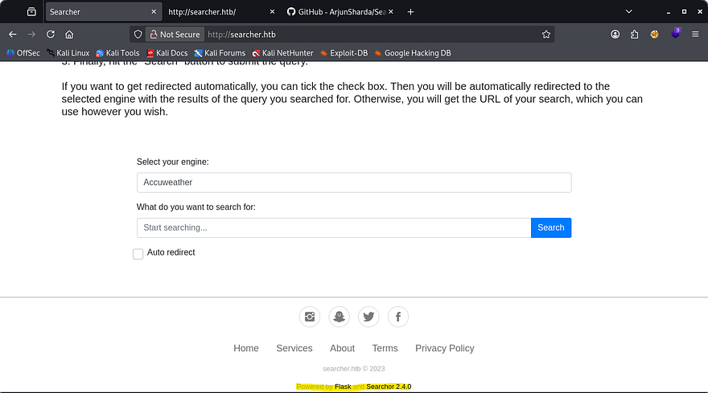
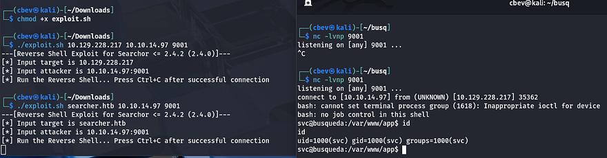
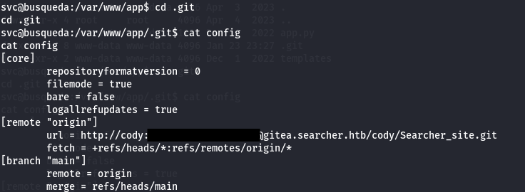
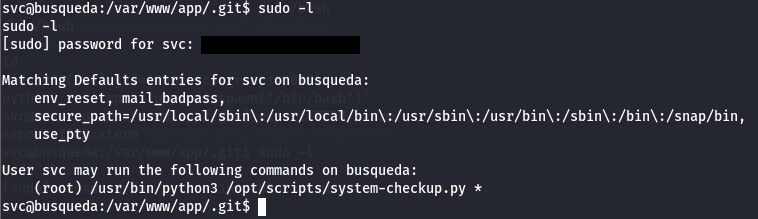
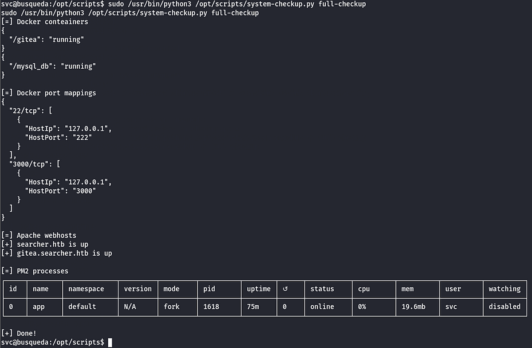
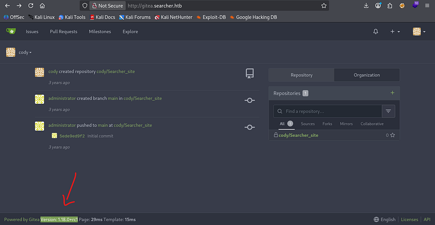
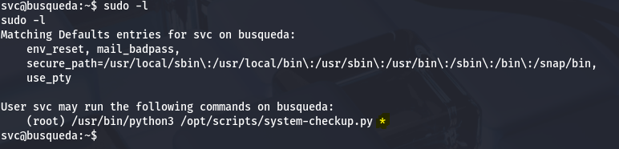
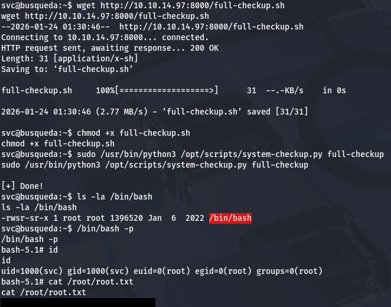

This box is rated easy difficulty on HTB. I'm starting to go down the list on [TJNull's](https://docs.google.com/spreadsheets/u/1/d/1dwSMIAPIam0PuRBkCiDI88pU3yzrqqHkDtBngUHNCw8/htmlview) OSCP-like boxes list for good practice and get a head start on what I need to know/learn.

It involves us getting a low level shell on the system through a known vulnerability in an open-source search engine and abusing Sudo privileges by supplying a malicious script as our parameter to escalate privileges to root.

## Scanning & Enumeration
I kick things off with an Nmap scan against the give IP to find any running services on the host.

```
$ sudo nmap -sCV 10.129.228.217 -oN fullscan-tcp -vv

Not shown: 998 closed tcp ports (reset)
PORT   STATE SERVICE REASON         VERSION
22/tcp open  ssh     syn-ack ttl 63 OpenSSH 8.9p1 Ubuntu 3ubuntu0.1 (Ubuntu Linux; protocol 2.0)
| ssh-hostkey: 
|   256 4f:e3:a6:67:a2:27:f9:11:8d:c3:0e:d7:73:a0:2c:28 (ECDSA)
| ecdsa-sha2-nistp256 AAAAE2VjZHNhLXNoYTItbmlzdHAyNTYAAAAIbmlzdHAyNTYAAABBBIzAFurw3qLK4OEzrjFarOhWslRrQ3K/MDVL2opfXQLI+zYXSwqofxsf8v2MEZuIGj6540YrzldnPf8CTFSW2rk=
|   256 81:6e:78:76:6b:8a:ea:7d:1b:ab:d4:36:b7:f8:ec:c4 (ED25519)
|_ssh-ed25519 AAAAC3NzaC1lZDI1NTE5AAAAIPTtbUicaITwpKjAQWp8Dkq1glFodwroxhLwJo6hRBUK
80/tcp open  http    syn-ack ttl 63 Apache httpd 2.4.52
| http-methods: 
|_  Supported Methods: GET HEAD POST OPTIONS
|_http-title: Did not follow redirect to http://searcher.htb/
|_http-server-header: Apache/2.4.52 (Ubuntu)
Service Info: Host: searcher.htb; OS: Linux; CPE: cpe:/o:linux:linux_kernel
```

There are just two ports open:
- SSH on port 22
- An Apache web server on port 80

It also reveals that the site redirects us to searcher.htb so I'll add that to my /etc/hosts file. I leave subdirectory and subdomain scans running in the background to save on time and head over to the webpage.



Looks like this site is used for querying things using different Search Engines with ease. It seems to function by making a POST request to /search, but that doesn't allow us to read it directly. Looking at the footer, we see that it's powered by Flask (Python) and has a link to the framework being used as well as the version. Since it's open source we'll be able to find any known vulnerabilities to exploit.

## Initial Foothold
Some quick research shows that Searchor versions predating v2.4.2 are prone to a critical RCE vulnerability due to how it implemented the eval method. Here's a [PoC](https://github.com/nikn0laty/Exploit-for-Searchor-2.4.0-Arbitrary-CMD-Injection) that will allow us to grab a shell.

This exploit works by passing in functions other than the expected query. We can then import the OS python module and use system commands in the query bar.

```
@click.argument("query")
def search(engine, query, open, copy):
    try:
        url = eval( # <<< See here 
            f"Engine.{engine}.search('{query}', copy_url={copy}, open_web={open})"
        )
        click.echo(url)
        searchor.history.update(engine, query, url)
        if open:
            click.echo("opening browser...")
   ...
```
   
Let's give it a shot. Make sure to supply searcher.htb, not the IP as it redirects us and set up a listener.



## Privilege Escalation
I get a shell as svc and can grab the user flag under their home dir. Next, I start looking at ways to escalate privileges to root as that's the only other user on the box.

Looking in the application's directory shows a .git folder which contains a config file. Inside are hardcoded credentials for a user named cody, and since there wasn't a user on the system named that I figured that had to be our svc account password.



Using that to list sudo privileges shows that we can run Python3 on a system-checkup script as root user.



The script takes allows for three parameters, a full-checkup, docker-ps, and docker-inspect. Seems like it's used for validating whether docker containers are running and inspects their network interfaces.



I see the domain of `gitea.searcher.htb` again, so I add that to my /etc/hosts file and login using Cody's credentials found earlier. This discloses the version it's running on and a few commits made by an administrator.

If you don't know, Gitea is a development service similar to GitHub that allows for repository hosting, code review, CI/CD, etc. This will allow us to potentially push a commit to the system as another user or exploit it to grab a shell.



This Gitea version seemed a bit outdated so I went searching for known vulnerabilities, using SearchSploit and Google however nothing return for this version.

Checking the sudo permissions again, I noticed that since the command took in parameters to choose the option, there probably wasn't a secure full path set. That meant that it would try to execute `full-checkup.sh` from our current working directory and then onto $PATH variables.



I made a full-checkup.sh script on my attacking machine that would copy /bin/bash to our home dir and set an SUID bit on it. Then, I transfered it to the host using a Python HTTP server.

```
#!/bin/bash
chmod +s /bin/bash
```



Finally, running the Sudo command with full-checkup as a parameter would use our malicious script and we could get a root shell on the box. I hope this was helpful to anyone following along or stuck and happy hacking!
