This box is rated hard difficulty on THM. It involves us exploiting a second-order SQL injection vulnerability to dump user credentials, finding SSTI in a similar application to get a reverse shell as another user, and hijacking the server's local name resolution to capture a POST request and root credentials.

_You Shall Fear The Second Order._

## Scanning & Enumeration
I kick things off with an Nmap scan against the given IP to find all running services on the host. Repeating the same process for UDP returns nothing, but it's good practice to do so.

```
$ sudo nmap -p22,8000 -sCV 10.66.140.102 -oN fullscan-tcp

Starting Nmap 7.95 ( https://nmap.org ) at 2026-02-01 18:12 CST
Nmap scan report for 10.66.140.102
Host is up (0.042s latency).

PORT     STATE SERVICE VERSION
22/tcp   open  ssh     OpenSSH 8.2p1 Ubuntu 4ubuntu0.13 (Ubuntu Linux; protocol 2.0)
| ssh-hostkey: 
|   3072 ab:e1:1b:81:d4:37:b6:b4:cf:4a:cd:43:fb:64:8c:27 (RSA)
|   256 be:3b:4c:1e:82:e7:04:a1:11:fa:f1:f5:b7:0f:2d:b4 (ECDSA)
|_  256 9d:b5:22:fa:f0:cb:41:a3:cb:25:97:9d:b6:5e:53:f2 (ED25519)
8000/tcp open  http    Werkzeug httpd 2.0.3 (Python 3.8.10)
|_http-title:  Login 
|_http-server-header: Werkzeug/2.0.3 Python/3.8.10
Service Info: OS: Linux; CPE: cpe:/o:linux:linux_kernel

Service detection performed. Please report any incorrect results at https://nmap.org/submit/ .
Nmap done: 1 IP address (1 host up) scanned in 8.43 seconds
```

There are just two ports open:
- SSH on port 22
- A Python Werkzeug web server on port 8000

Checking the landing page shows a typical login panel for the server. I try a few common default credentials for administrator and get a standard error back. I also start a few gobuster scans in the background to find subdomains/subdirectories to save on time.

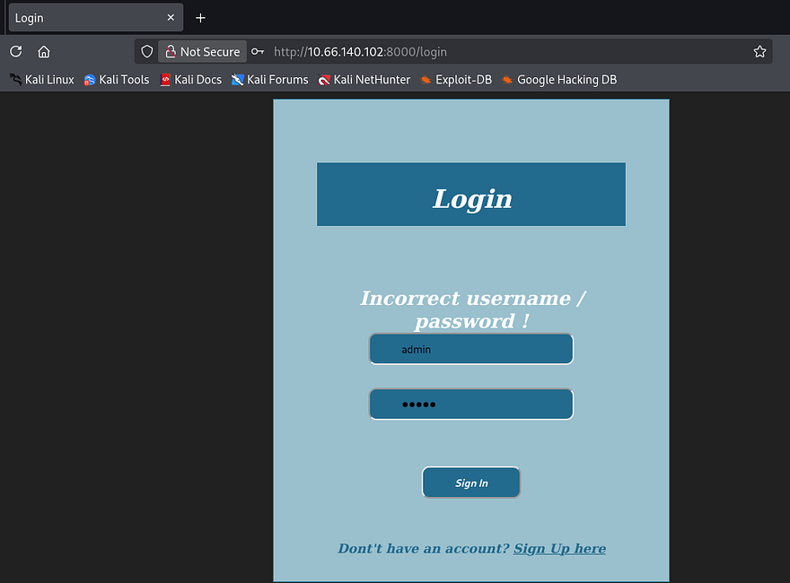

We do have a register account function, so I create a new account to enumerate the site internally. I discover a big query box that is used to count how many words are provided in the given text.

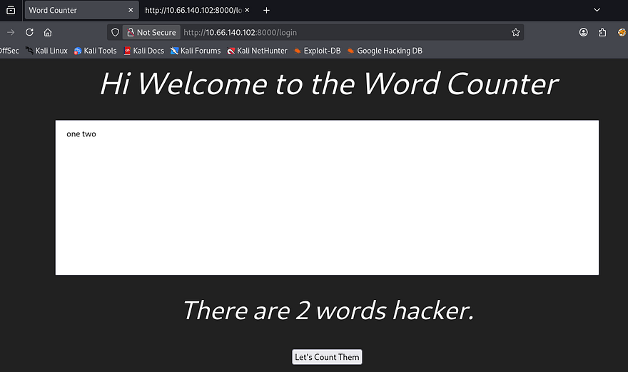

We'll most likely have to exploit this built-in function to read sensitive info, get remote command execution, or dump a database through a malicious payload. I was curious as to what the session cookie resolved to so I utilized the [flask-unsign](https://github.com/Paradoxis/Flask-Unsign) tool to read it, which displayed a few parameters including our username.

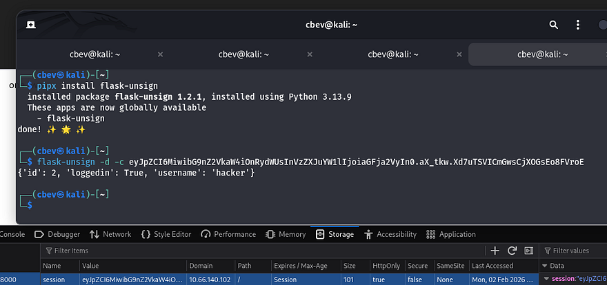

We can't exploit that as we haven't found the signing secret but it's nice to know how the site tracks our login. It seems like the function just parses for words separated by a space, so I move on to exploiting the register page. I notice that our username is reflected whenever a query is made to count the words.

The username parameter under register the register page also does not filter out special characters which is pretty dangerous. First I test for HTML injection by creating a username that should be printed as bold if it works.

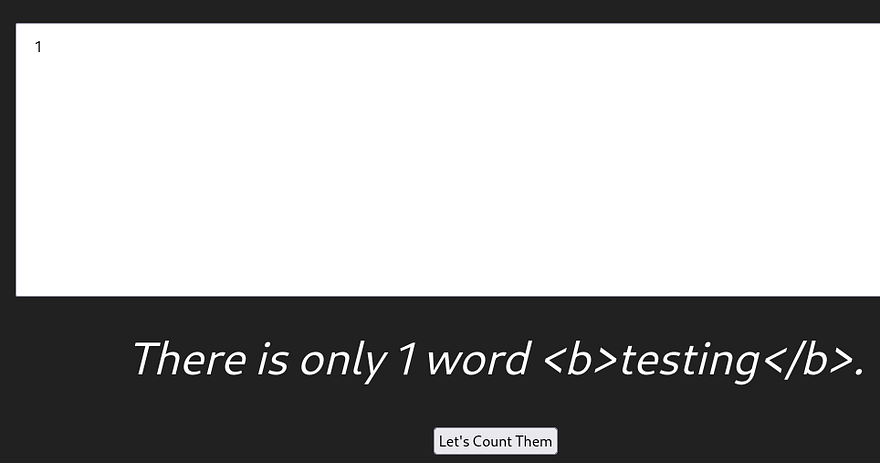

## Second-Order SQLi
Logging in with it shows that it does not bolden the username, so this site isn't prone to XSS attacks. Next, I repeat this process with a username containing an apostrophe to see if the site will throw an error.

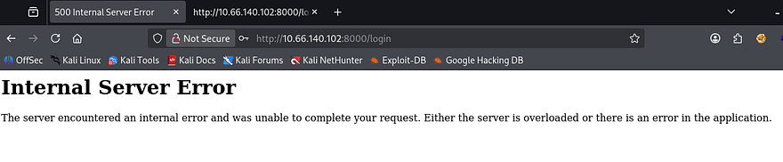

Bingo, the server throws an internal error! This site is absolutely vulnerable to a second order SQL injection attack. If you're unfamiliar as to what that is, a second-order SQLi occurs when malicious input is safely stored in a database at first, but later reused in a different SQL query without proper sanitization, and in turn triggering the injection at that later point. Unlike a typical SQLi, the payload gets executed when the stored data is trusted to be used in another query and ends up getting processed again.

This is possible due to the server not filtering special characters in the registration function. Developers should be using parameterized queries to mitigate and prevent such a vulnerability from arising. If you're curious about more information on this attack vector, [here](https://portswigger.net/kb/issues/00100210_sql-injection-second-order) is a great article containing resources to learn from.

Automating this attack is a pretty straight forward as we only need to create a new account at the registration, login with it, and query the function to sort by response codes. However I decide to do it manually for fun. [This](https://portswigger.net/web-security/sql-injection) is another great article explaining how attackers  enumerate databases through SQLi and is what I refer to.

First, I start by enumerating the correct amount of columns so that the server doesn't throw an error every time. Creating a new username with the following shows that the answer is four:

```
hacker' UNION SELECT 1,2,3,4-- -
```

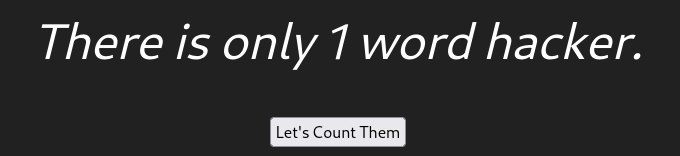

The second column is the one that gets reflected so I replace that with my malicious queries. Next up is the databases:

```
' union select 1,(select group_concat(SCHEMA_NAME) from Information_Schema.SCHEMATA),3,4-- -
```

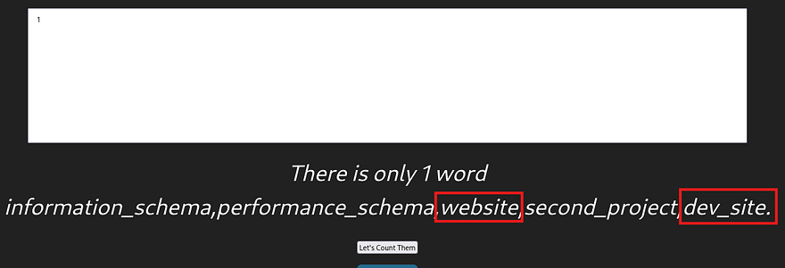

We probably want the website or dev_site DB as it could hold valuable credentials. Now I get all tables and column names from it:

```
' union select 1,(select group_concat(TABLE_NAME,COLUMN_NAME) from Information_Schema.COLUMNS where TABLE_SCHEMA = 'website'),3,4-- -
```

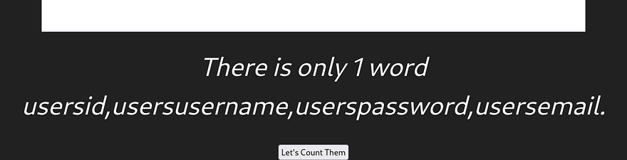

Finally, let's dump the username and password fields from the users table to see about any valid creds.

```
' union select 1,(select group_concat(username,password) from website.users),3,4-- -
```

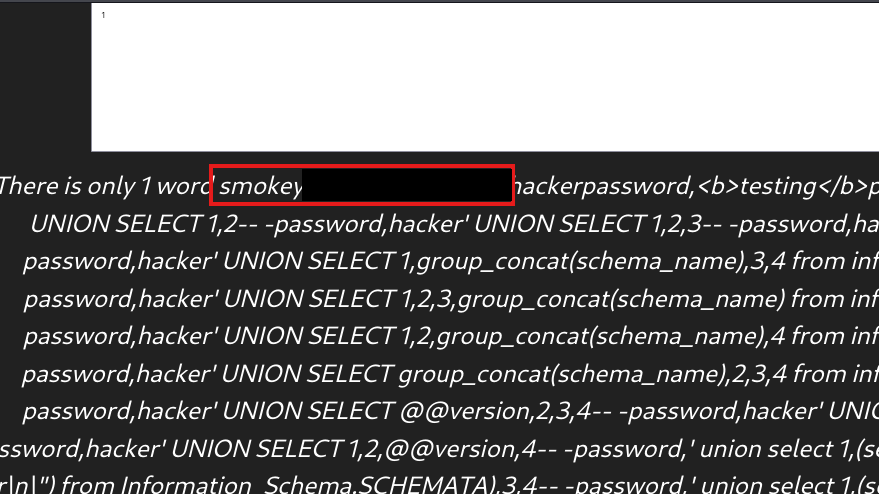

Along with the crazy amount of malicious usernames and passwords, I find a pair for a user named smokey. Interestingly enough, these don't actually work to login on the website but that's fine as they grant a successful login via SSH.

## Initial Foothold
Now we can start looking at routes to escalate privileges to root user. Taking a quick look around shows that there is another user on the box named hazel. As we don't have the user flag yet, we'll probably need to pivot to her account and then onto root. 

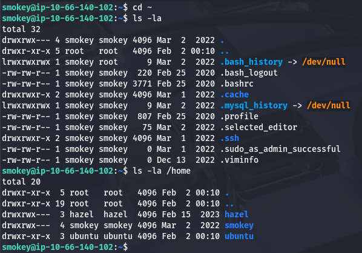

A bit of internal enumeration shows that there are a few websites and projects on the machine. Inside of the /var/www/dev_site directory is a config.php file which contains SQL credentials to login as smokey. 

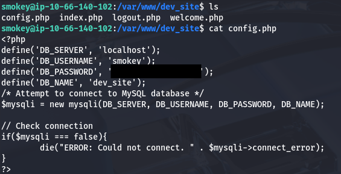

Dumping the dev_site database yields nothing but there is another DB named second_project. Dumping the users table from that one gives us Hazel's password for a mysterious project she's been working on. The contents of the password seemed like irony when it said something like 'notmySSHpasswd', but it really doesn't work to login there.

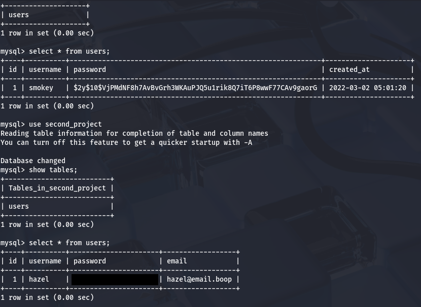

## Privilege Escalation
I figured we need another site or application to login on and we didn't find any subdomains in the earlier scans, meaning it has to be listening on localhost. Checking the services listening for TCP shows something on port 5000 which is frequently used for developer environments.

I port forward this to my attacking machine using SSH and take a look at what's on it.

```
ssh -L 5000:127.0.0.1:5000 smokey@[MACHINE_IP]
```

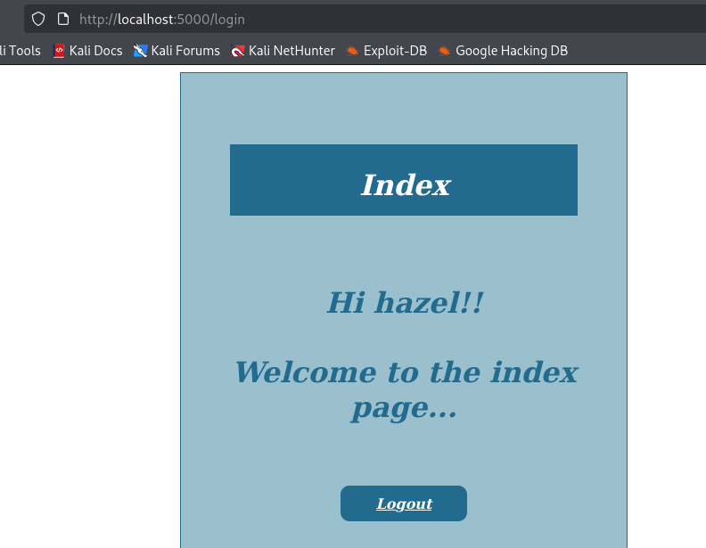

Hazel's credentials work to sign in here but there isn't much of anything to exploit as my directory scans return the same pages as the first website. The only real thing that is dynamically loaded is the username which may just be prone something like server-side template injection. Since we have the code for it, I quickly review it looking for any potential vulnerabilities.

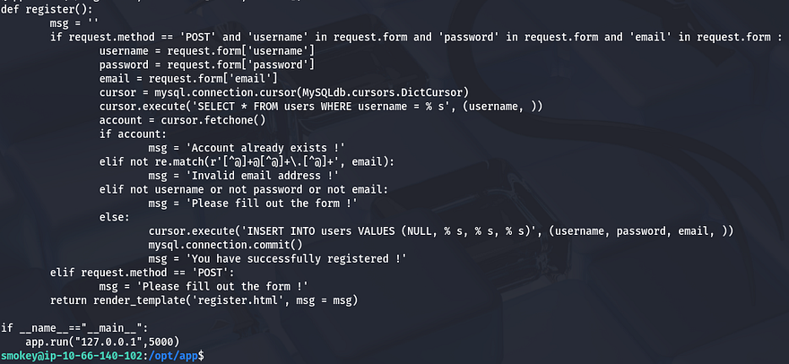

This site is located at /opt/app/app.py and we can see a register function that takes input provided from the user. This is pretty much the same thing we exploited as before, except for one detail. When the page is rendered, it takes the contents of `register.html` and displays it directly.

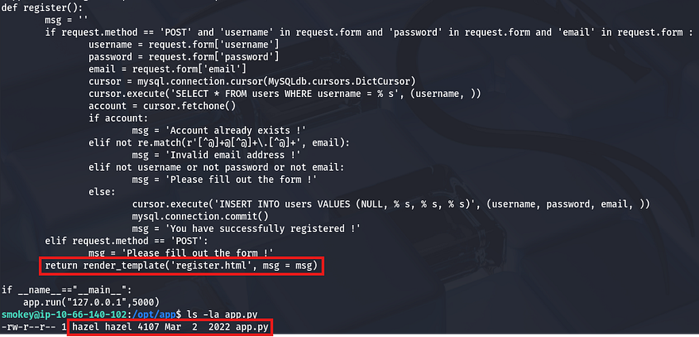

## Server-Side Template Injection
This application is also conveniently owned by hazel, so if we were to get remote command execution via SSTI, we'd grab a shell as her. To test if this, I create a new account with a common payload of `{{7*7}}` for the username and login.


The page renders and our username resolves to 49, confirming that we can pass malicious input to the username field and have the server execute it. The site is using Jinja2 as its template engine, so let's try and grab a shell using some more common Python payloads.


```
{{ self.__init__.__globals__.__builtins__.__import__('os').popen('id').read() }}
```


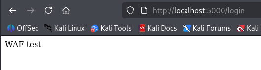

That one gets shot down by the WAF, so we need to find a way to bypass it. I come across [this great article](https://hackmd.io/@Chivato/HyWsJ31dI) explaining that the firewall blocks specific characters/strings like `".", "_", "[]", and "|join"` and that by encoding these, we can sneak around the filters in place. This is the payload I used to test for RCE:


```
{{request|attr('application')|attr('\x5f\x5fglobals\x5f\x5f')|attr('\x5f\x5fgetitem\x5f\x5f')('\x5f\x5fbuiltins\x5f\x5f')|attr('\x5f\x5fgetitem\x5f\x5f')('\x5f\x5fimport\x5f\x5f')('os')|attr('popen')('id')|attr('read')()}}
```


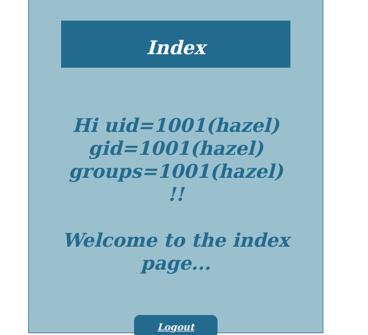

That displays the results from the user's id command confirming that this works. Next I replace "id" with a command that will execute a file containing a reverse shell pointed towards my attacking machine. I host the shell on the same server under `/dev/shm` (in shared memory as we want to be sneaky) as encoding a typical bash one liner could cause some trouble.

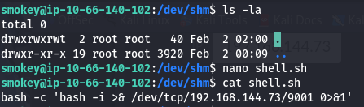

Now I setup a netcat listener and pop the shell using a similar payload that executes that script using bash:


```
{{request|attr('application')|attr('\x5f\x5fglobals\x5f\x5f')|attr('\x5f\x5fgetitem\x5f\x5f')('\x5f\x5fbuiltins\x5f\x5f')|attr('\x5f\x5fgetitem\x5f\x5f')('\x5f\x5fimport\x5f\x5f')('os')|attr('popen')('bash /dev/shm/shell.sh')|attr('read')()}}
```


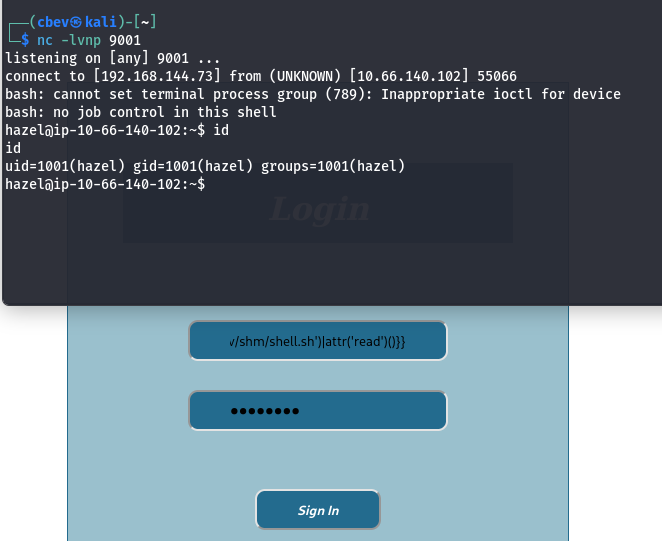

The login page hangs and we get a successful shell as Hazel. Now we can grab the user flag and start looking for ways to escalate privileges to root. I also upgrade my shell using the typical Python3 import pty method.

## Local Name Resolution Hijacking
There is a note left by Smokey in her home directory that says he would like her to work faster on a PHP site. The only ones we've seen have been built in Python, so this is interesting.

```
Hello Hazel

Please finish the second project site as soon as possible. Make sure the WAF actually stops all attacks and that you are using the proper render template to avoid SSTI. You really should make your site secure like my word counter.

Also, I need you to put a pep in your step on that PHP site, I will be logging in to check your progress on it.

Sincerely,
Smokey
```

I check the Apache2 configuration files under `/etc/apache2/sites-available/` to see what sites we have access to and find the dev_site once again. This application is running on `localhost:8080` and we know is built on PHP.

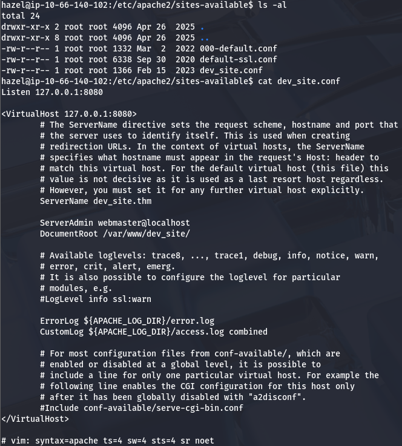

Searching the DocumentRoot directory that the site was hosted in didn't return anything of interest. I was a bit confused as to what to do for our next step, so I uploaded [LinPEAS](https://github.com/peass-ng/PEASS-ng/tree/master/linPEAS) for some more information on what Hazel's account has permissions for.

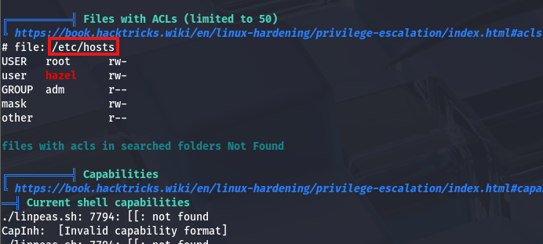

Parsing the output of that script shows that the `/etc/hosts` file has an access control list, which allows Hazel to read and write to it. Thinking back to the note left, I figured that somebody had to be logging into that site, maybe using a script to check its status or moderate it somehow. 

There were no active crontabs so I uploaded [pspy](https://github.com/DominicBreuker/pspy) to snoop around background processes and found that root was running a Python script to check the site every minute or so.

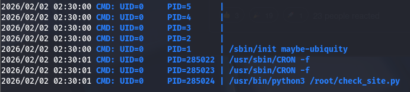

**So how do we exploit this?** Since we have the ability to change where the system will map IPs to the dev_site.thm domain, it's possible to create a new line which redirects the dev site towards our own server hosted on an attacking machine.

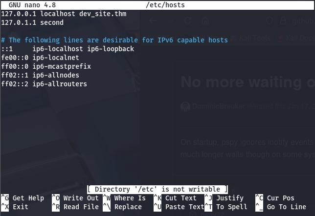

I remove the `dev_site.thm` from the first line and create a new one containing my machine's IP and the dev domain.

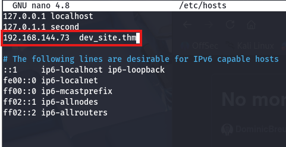

Before we setup our own server, we need to port forward the dev site so that we can copy the index page and the script can actually authenticate.

```
ssh -L 1234:127.0.0.1:8080 smokey@[MACHINE_IP]
```

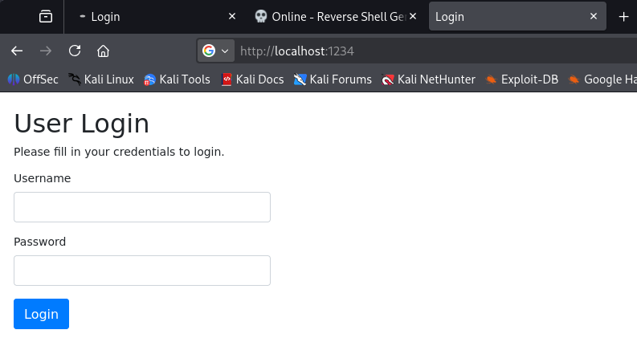

I copy/paste the `index.html` page to a file hosted on my machine and setup a Python server on port 8080. Now whenever that script executes, it will reach out to our server and try to authenticate on port 8080, where it thinks the dev_site is at. 

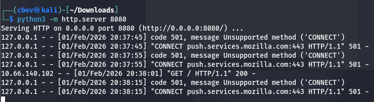

Since it's using the `CONNECT` request method we need to capture traffic using a tool like Wireshark. We're looking for a POST request sent from the servers IP. After finding it, I hit follow HTTP stream to see what data was sent and find basic auth credentials for smokey's account.

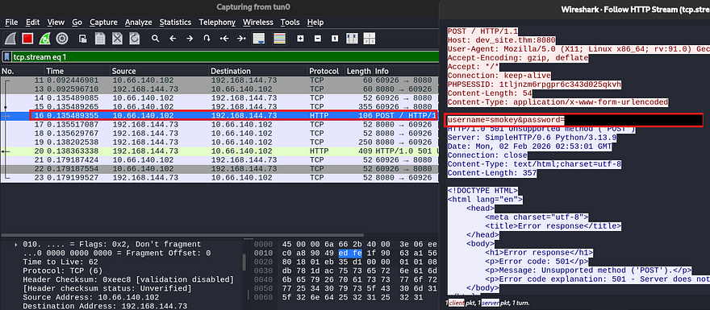

I send it over to CyberChef as they're URL encoded to grab the root password. Last step is to switch users and grab the final flag under `/root/root.txt`.

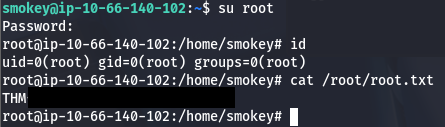

That's all y'all, I really liked this box because every part was exploiting web vulnerabilities which requires a good understanding of authentication and how user input gets processed. I hope this was helpful to anyone stuck or following along and happy hacking!
