This box is rated hard difficulty on THM and is more of a game then a realistic box. It involves us enumerating various directories in a subdomain on HTTPS to find a pair of SSH credentials, solving cryptographic puzzles to grab other users' passwords, and escalating privileges to root by abusing an SUID bit on the Exim4 binary. 

_A CTF based challenge to get your blood pumping..._

## Scanning & Enumeration
As always I begin with an Nmap scan against the given IP to find all running services.

```
$ sudo nmap -p21,22,80,443,31337 -sCV 10.67.147.172 -oN fullscan-tcp

Starting Nmap 7.95 ( https://nmap.org ) at 2026-02-03 01:12 CST
Nmap scan report for 10.67.147.172
Host is up (0.043s latency).

PORT      STATE SERVICE  VERSION
21/tcp    open  ftp      vsftpd 3.0.3
| ftp-syst: 
|   STAT: 
| FTP server status:
|      Connected to ::ffff:192.168.144.73
|      Logged in as ftp
|      TYPE: ASCII
|      No session bandwidth limit
|      Session timeout in seconds is 300
|      Control connection is plain text
|      Data connections will be plain text
|      At session startup, client count was 2
|      vsFTPd 3.0.3 - secure, fast, stable
|_End of status
| ftp-anon: Anonymous FTP login allowed (FTP code 230)
| -r--r--r--    1 ftp      ftp       1401357 Sep 21  2019 1.jpg
| -r--r--r--    1 ftp      ftp        233977 Sep 21  2019 2.jpg
| -r--r--r--    1 ftp      ftp        524615 Sep 21  2019 3.jpg
| -r--r--r--    1 ftp      ftp        771076 Sep 21  2019 4.jpg
| -r--r--r--    1 ftp      ftp       1644395 Sep 21  2019 5.jpg
|_-r--r--r--    1 ftp      ftp         40355 Sep 21  2019 6.jpg
22/tcp    open  ssh      OpenSSH 7.6p1 Ubuntu 4 (Ubuntu Linux; protocol 2.0)
| ssh-hostkey: 
|   2048 58:d2:86:99:c2:62:2d:95:d0:75:9c:4e:83:b6:1b:ca (RSA)
|   256 db:87:9e:06:43:c7:6e:00:7b:c3:bc:a1:97:dd:5e:83 (ECDSA)
|_  256 6b:40:84:e6:9c:bc:1c:a8:de:b2:a1:8b:a3:6a:ef:f0 (ED25519)
80/tcp    open  http     Apache httpd 2.4.29
|_http-server-header: Apache/2.4.29 (Ubuntu)
|_http-title: 404 Not Found
443/tcp   open  ssl/http Apache httpd 2.4.29 ((Ubuntu))
|_ssl-date: TLS randomness does not represent time
|_http-server-header: Apache/2.4.29 (Ubuntu)
|_http-title: You found Finn
| ssl-cert: Subject: commonName=adventure-time.com/organizationName=Candy Corporate Inc./stateOrProvinceName=Candy Kingdom/countryName=CK
| Not valid before: 2019-09-20T08:29:36
|_Not valid after:  2020-09-19T08:29:36
| tls-alpn: 
|_  http/1.1
31337/tcp open  Elite?
| fingerprint-strings: 
|   DNSStatusRequestTCP, RPCCheck, SSLSessionReq: 
|     Hello Princess Bubblegum. What is the magic word?
|     magic word is not
|   DNSVersionBindReqTCP: 
|     Hello Princess Bubblegum. What is the magic word?
|     magic word is not 
|     version
|     bind
|   GenericLines, NULL: 
|     Hello Princess Bubblegum. What is the magic word?
|   GetRequest: 
|     Hello Princess Bubblegum. What is the magic word?
|     magic word is not GET / HTTP/1.0
|   HTTPOptions: 
|     Hello Princess Bubblegum. What is the magic word?
|     magic word is not OPTIONS / HTTP/1.0
|   Help: 
|     Hello Princess Bubblegum. What is the magic word?
|     magic word is not HELP
|   RTSPRequest: 
|     Hello Princess Bubblegum. What is the magic word?
|     magic word is not OPTIONS / RTSP/1.0
|   SIPOptions: 
|     Hello Princess Bubblegum. What is the magic word?
|     magic word is not OPTIONS sip:nm SIP/2.0
|     Via: SIP/2.0/TCP nm;branch=foo
|     From: <sip:nm@nm>;tag=root
|     <sip:nm2@nm2>
|     Call-ID: 50000
|     CSeq: 42 OPTIONS
|     Max-Forwards: 70
|     Content-Length: 0
|     Contact: <sip:nm@nm>
|_    Accept: application/sdp
1 service unrecognized despite returning data. If you know the service/version, please submit the following fingerprint at https://nmap.org/cgi-bin/submit.cgi?new-service :
Service Info: Host: 127.0.1.1; OSs: Unix, Linux; CPE: cpe:/o:linux:linux_kernel

Service detection performed. Please report any incorrect results at https://nmap.org/submit/ .
Nmap done: 1 IP address (1 host up) scanned in 156.50 seconds
```

There are five ports open:
- FTP on port 21
- SSH on port 22
- An Apache web server on port 80 (HTTP)
- Another Apache web server on port 443 (HTTPS)
- Mystery port on 31337

Before doing anything else, I fire up Dirsearch to find directories on port 80 and 443 to save on time. Then I login to the FTP server as anonymous authentication is allowed.


Inside are six photos of the Adventure Time show. I tested each one for hidden data using exiftool, steghide, and strings but found nothing. I rule out FTP for now, but keep it in mind in case we're able to upload a shell from here later on.

Next up is the mystery port on 31337. I connect to it using Netcat and it prompts us to enter a magic word.

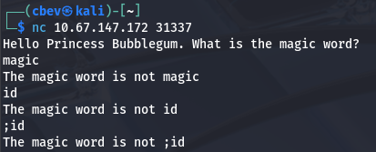

I test for a few common command injections and find that it just checks our input to the correct one and does nothing else with it. We won't be able to access this port until we find that so let's go over to the web pages.

The landing page on port 80 has nothing on it, and my scans didn't return anything either. On the other hand, HTTPS gives us a certificate to look at. There is a username of bubblegum as well as a different site at `land-of-ooo.com` which we can add to our `/etc/hosts` file.

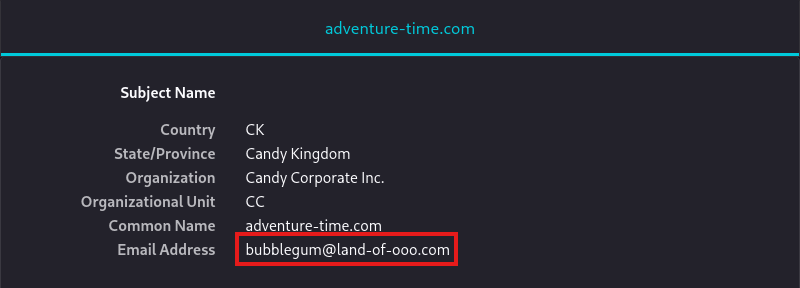

The actual page shows that we need to help Finn find Jake. There's not much to go off of and the photo doesn't hold any clues either.

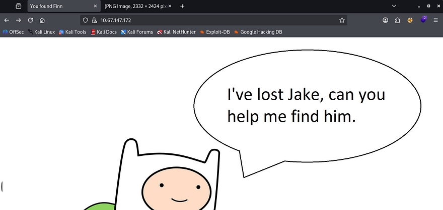

My directory scans finally finish and I get a hit back at `/candybar`. Let's check it out.

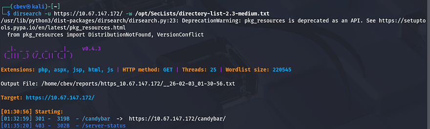

On this page, Finn tells us a magic word that Jake gave him in case we ever needed to find him. It's encoded so I send it to CyberChef to get the plaintext version.

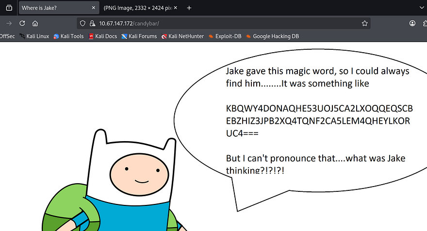

The correct recipe to decode is `From Base32 -> ROT11`. It really only hints at checking the SSL certificate again so it looks like we should head over to the land-of-ooo.

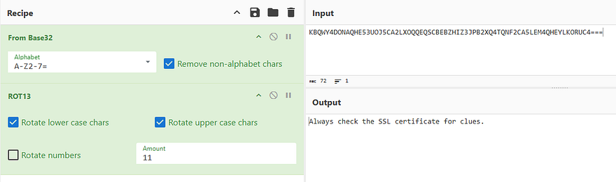

## Initial Foothold
Checking the landing page shows that we found Jake. We still need to find a reset code for BMO and it may be on his laptop with security in place. I restart a Dirsearch on this domain and wait for any hits.

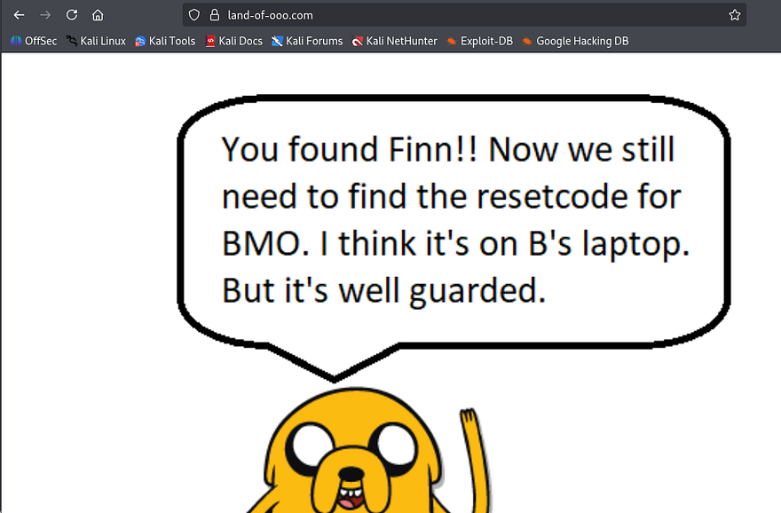

I finally get a response back at `/yellowdog`, so let's head over there to see about finding any9 reset codes or further clues in our mission.

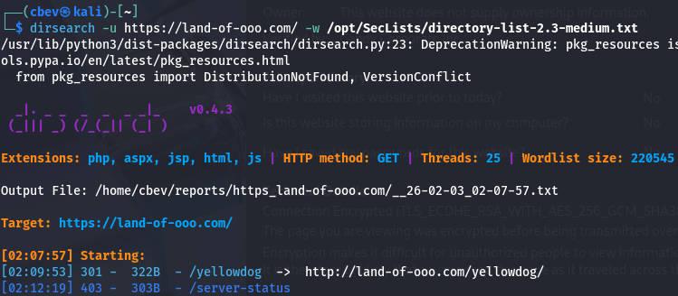

This discloses that BMO's laptop is being guarded by a Banana Guard and that he can be fooled. Not having anything more to go off of, I keep enumerating subdirectories until something pops up.

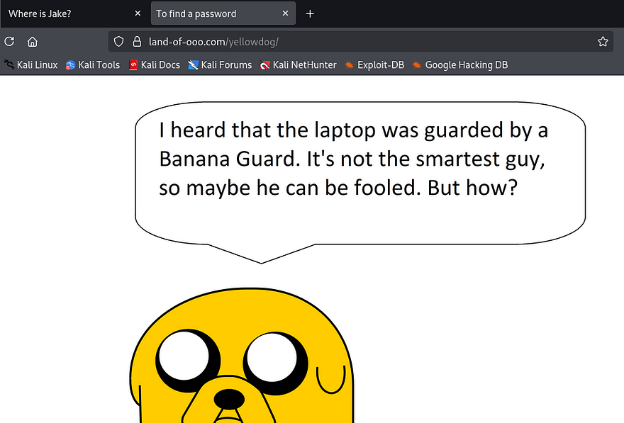

A bit of waiting rewards me with an endpoint at `/bananastock`. Inside is a picture of two guards speaking, and one of them gives us a password encoded in a strange format. I take to CyberChef once again to decode this.

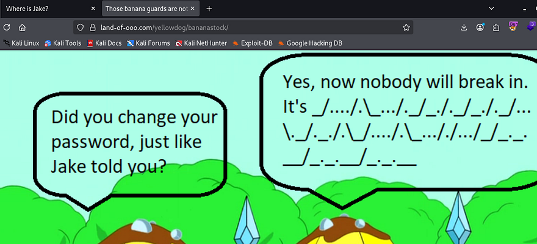

_Note: The source code page gives us this in a comment so it's a bit easier._

Looks like it's just Morse code with a backslash as the word delimiter and a forward slash for the letter delimiter

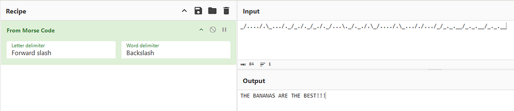

Once again, I continue with enumeration as we haven't found the laptop to use this at yet. This gives me another directory under /princess .

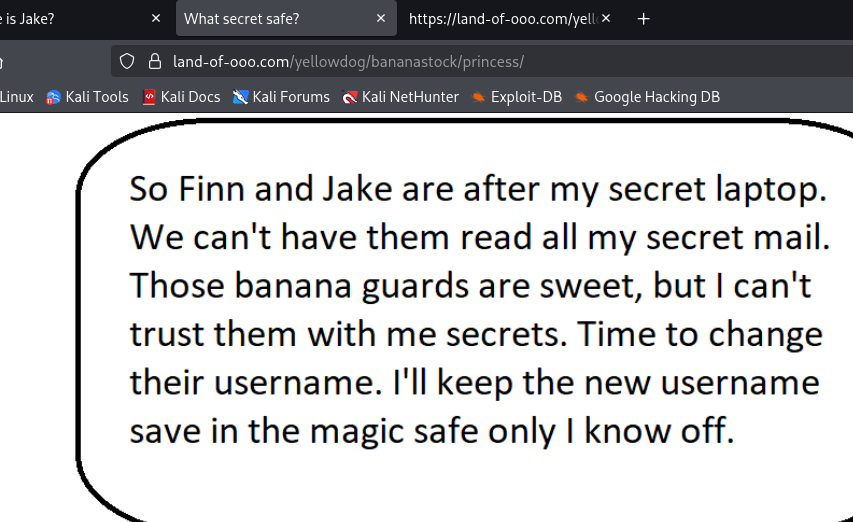

Here, Princess Bubblegum discloses that she changed the username for her laptop to be something only she knows of and that it's being kept in a magical safe. Looking at the source code gives us more info to use:

```
Secrettext = 0008f1a92d287b48dccb5079eac18ad2a0c59c22fbc7827295842f670cdb3cb645de3de794320af132ab341fe0d667a85368d0df5a3b731122ef97299acc3849cc9d8aac8c3acb647483103b5ee44166
Key = my cool password
IV = abcdefghijklmanopqrstuvwxyz
Mode = CBC
Input = hex
Output = raw
```

All these fields make me think that the secret text is AES encrypted, so it's back to CyberChef. Using the parameters gathered to decrypt the string gives us the magic word to open the safe on port 31337.

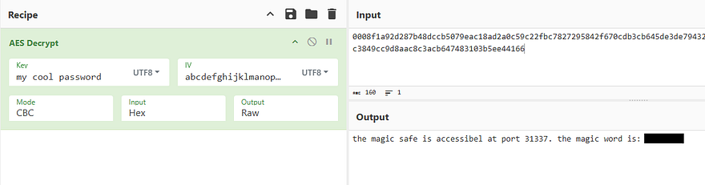

Finally we can use that magic word over Netcat to grab the username for her laptop.

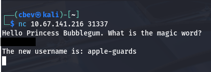

## Privilege Escalation
In reality we can just sign in via SSH as this new user along with the password gathered from the guards step. Now it's time to find routes to escalate privileges to other users. Looking in the /home directory shows there are a ton of other users on the box which may make it confusing to pivot.

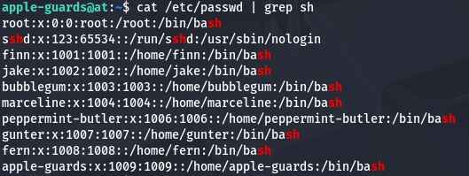

In the guard's home directory is our first flag as well as a mailbox. Inside that is a letter from Marceline saying she hid a file for us to find.

```
From marceline@at  Fri Sep 20 16:39:54 2019
Return-Path: <marceline@at>
X-Original-To: apple-guards@at
Delivered-To: apple-guards@at
Received: by at.localdomain (Postfix, from userid 1004)
 id 6737B24261C; Fri, 20 Sep 2019 16:39:54 +0200 (CEST)
Subject: Need help???
To: <apple-guards@at>
X-Mailer: mail (GNU Mailutils 3.4)
Message-Id: <20190920143954.6737B24261C@at.localdomain>
Date: Fri, 20 Sep 2019 16:39:54 +0200 (CEST)
From: marceline@at

Hi there bananaheads!!!
I heard Princess B revoked your access to the system. Bummer!
But I'll help you guys out.....doesn't cost you a thing.....well almost nothing.

I hid a file for you guys. If you get the answer right, you'll get better access.
Good luck!!!!
```

I make this easy on myself by running a find command specifying to search for files that our account could read and found an ELF at `/etc/fonts/helper`.

Running it gives us a cryptography puzzle to solve in order to get access to better privileges. 

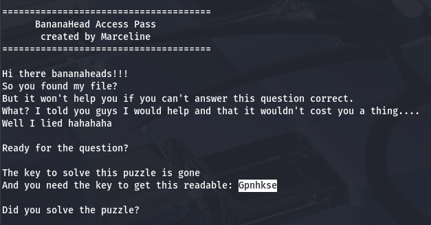

This looks like a Vigenere cipher so I head over to CyberChef once again using the key as literally 'gone' and input the string. This gives us the password to her account and we can switch users.

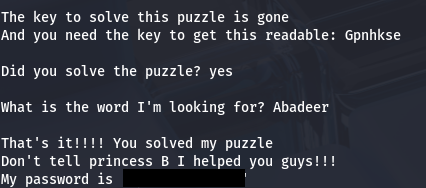

At this point we can grab the second flag and restart enumeration to take over someone else's account. There is a secret message in her home directory with yet another puzzle.

```
Hello Finn,

I heard that you pulled a fast one over the banana guards.
B was very upset hahahahaha.
I also heard you guys are looking for BMO's resetcode.
You guys broke him again with those silly games?

You know I like you Finn, but I don't want to anger B too much.
So I will help you a little bit...

But you have to solve my little puzzle. Think you're up for it?
Hahahahaha....I know you are.

111111111100100010101011101011111110101111111111011011011011000001101001001011111111111111001010010111100101000000000000101001101111001010010010111111110010100000000000000000000000000000000000000010101111110010101100101000000000000000000000101001101100101001001011111111111111111111001010000000000000000000000000001010111001010000000000000000000000000000000000000000000001010011011001010010010111111111111111111111001010000000000000000000000000000000001010111111001010011011001010010111111111111100101001000000000000101001111110010100110010100100100000000000000000000010101110010100010100000000000000010100000000010101111100101001111001010011001010010000001010010100101011100101001101100101001011100101001010010100110110010101111111111111111111111111111111110010100100100000000000010100010100111110010100000000000000000000000010100111111111111111110010100101111001010000000000000001010
```

At first I thought this was binary due to the concatenated string of ones and zero's but that returned nothing. After a while I did some more digging and found another type of programming language called Spoon that looks similar to it. I use a decoder found on [boxentriq](https://www.dcode.fr/spoon-language) to get the magic word.

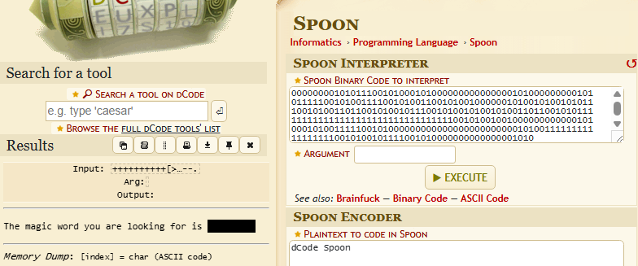

There was nowhere else to enter that prompted a magic word so I went back to port 31337 to see if it was successful there and got the password for the peppermint-butler user.

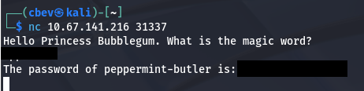

Switching users will give us the third flag under their home directory as well as a butler picture. I transfer the .jpg over to my attacking machine for further inspection over SSH and notice some strange data while using the strings utility.

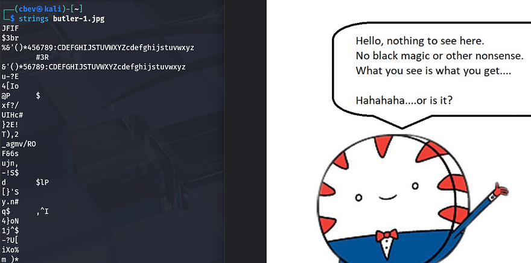

This doesn't work to extract anything with a blank passphrase so I go back to enumerating internally, looking for any files owned by our current account. This grants me a steg.txt file under the `/usr/share/xml` directory which gives us the passphrase to use on the picture.

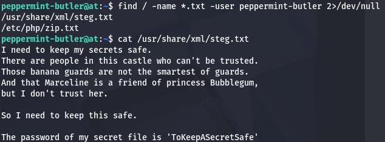

Extracting the zip file from the picture gives us secret.zip which we can unzip using 7z. However we're prompted a password, luckily I found it while looking for the steg one.

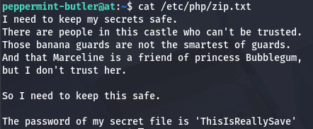

Unzipping that file using the second password extracts a secrets.txt file containing the following:

```
[0200 hours][upper stairs]
I was looking for my arch nemesis Peace Master, 
but instead I saw that cowering little puppet from the Ice King.....gunter.
What was he up to, I don't know.
But I saw him sneaking in the secret lab of Princess Bubblegum.
To be able to see what he was doing I used my spell 'the evil eye' and saw him.
He was hacking the secret laptop with something small like a duck of rubber.
I had to look closely, but I think I saw him type in something.
It was unclear, but it was something like 'The Ice King s????'.
The last 4 letters where a blur.

Should I tell princess Bubblegum or see how this all plays out?
I don't know.......
```

This gives us a partial password for Gunter's account, but we need to generate a wordlist to be able to brute force his SSH login. I use the crunch tool along with the '@' wildcard to specify all characters/numbers, in order to create a list of all viable passwords. After that's taken care of, I send it to over to Hydra so we can brute force the correct one.

```
crunch 18 18 -t 'The Ice King s@@@@' > passwords.txt
```

You could also just guess it pretty easily as there are only so many 5 letter words that start with s. Switching users gives us the fourth flag and we can finally start making our way to root user.

## Abusing Exim4
I notice that Gunter is apart of the `gcc` group, meaning we're allowed to compile libraries in C on the machine. I immediately start looking for and binaries with the SUID bit set in order to exploit. Doing so, I find exim4 has it set under `/usr/sbin`. This binary is used as a Mail Transfer Agent for Unix systems and is most certainly prone to privilege escalation methods.

To do so, first we need to read the configuration files to know where it's supposed to be running at. The default location to check this is at /etc/exim4/update-exim4.conf.conf .

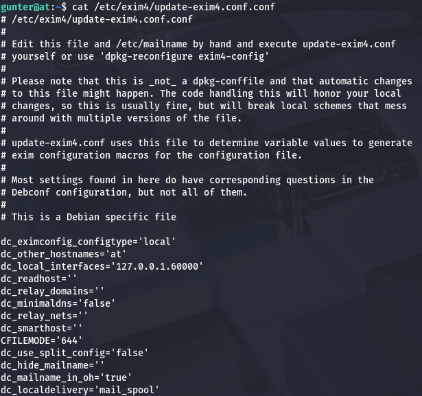

Looks like it's configured to on localhost:60000, now it's time to find a valid exploit for this. A quick Google search or looking on Exploit-DB gives me a [PoC](https://github.com/AzizMea/CVE-2019-10149-privilege-escalation) written in Python which makes it very easy to upload and run on the host.

This version of Exim4 is vulnerable to [CVE-2019–10149](https://nvd.nist.gov/vuln/detail/cve-2019-10149). It's caused by improper validation of the recipient address in the `deilver_messages()` function within `/src/deliver.c`, allowing for attackers to gain RCE on affected systems.

I grab the exploit from my attacking machine and send it to /tmp so we're able to give it execute permissions. I also change the script to contain the correct port on 60000.

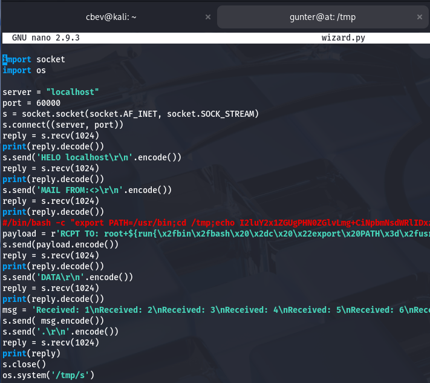

Finally, executing that script will escalate privileges to root user and we can grab the reset code for BMO in Princess Bubblegum's Secrets directory.

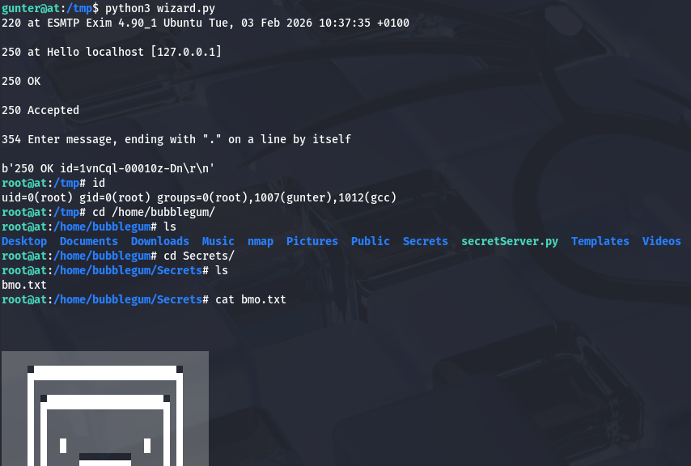

That's all y'all, this box was a pretty fun one as enumeration was key and it tested our skills of decoding strings. Thanks to [n0w4n](https://tryhackme.com/p/n0w4n) for making the box. I hope this was helpful to anyone following along or stuck and happy hacking!
