This box is rated hard difficulty on HTB. It involves us enumerating valid users via SMB guest authentication and AS-REP roasting a support account which gives us access to reset another account's password. Using that account allows us to investigate a forensic share, leading to us dumping an LSASS archive. That gives us the NTLM hash for a service backup account, enabling us to clone the NTDS.dit file and extract the administrator hash.

## Scanning & Enumeration
I kick things off with an Nmap scan against the target IP to find all running services on the host. Repeating the same for UDP shows the standard AD ports open.

```
$ sudo nmap -sCV -Pn 10.129.229.17 -oN fullscan-tcp

Starting Nmap 7.95 ( https://nmap.org ) at 2026-02-10 17:52 CST
Nmap scan report for 10.129.229.17
Host is up (0.056s latency).
Not shown: 992 filtered tcp ports (no-response)
PORT     STATE SERVICE       VERSION
53/tcp   open  domain        Simple DNS Plus
88/tcp   open  kerberos-sec  Microsoft Windows Kerberos (server time: 2026-02-11 06:53:10Z)
135/tcp  open  msrpc         Microsoft Windows RPC
389/tcp  open  ldap          Microsoft Windows Active Directory LDAP (Domain: BLACKFIELD.local0., Site: Default-First-Site-Name)
445/tcp  open  microsoft-ds?
593/tcp  open  ncacn_http    Microsoft Windows RPC over HTTP 1.0
3268/tcp open  ldap          Microsoft Windows Active Directory LDAP (Domain: BLACKFIELD.local0., Site: Default-First-Site-Name)
5985/tcp open  http          Microsoft HTTPAPI httpd 2.0 (SSDP/UPnP)
|_http-server-header: Microsoft-HTTPAPI/2.0
|_http-title: Not Found
Service Info: Host: DC01; OS: Windows; CPE: cpe:/o:microsoft:windows

Host script results:
| smb2-security-mode: 
|   3:1:1: 
|_    Message signing enabled and required
|_clock-skew: 6h59m59s
| smb2-time: 
|   date: 2026-02-11T06:53:15
|_  start_date: N/A

Service detection performed. Please report any incorrect results at https://nmap.org/submit/ .
Nmap done: 1 IP address (1 host up) scanned in 55.49 seconds
```

Looks like we're dealing with a Windows machine with Active Directory components. There doesn't appear to be a web server, even when scanning all 60k+ ports, which tells me to focus on services like LDAP, Kerberos, and SMB specifically. Another thing is that LDAP is leaking the domain name of `blackfield.local` so I'll add that to my `/etc/hosts` file.

I'll use Netexec to test for guest authentication on SMB, looking for any files in readable shares and to enumerate  users. We can indeed login as Guest user and there's a `profiles$` share that we have read permissions for.

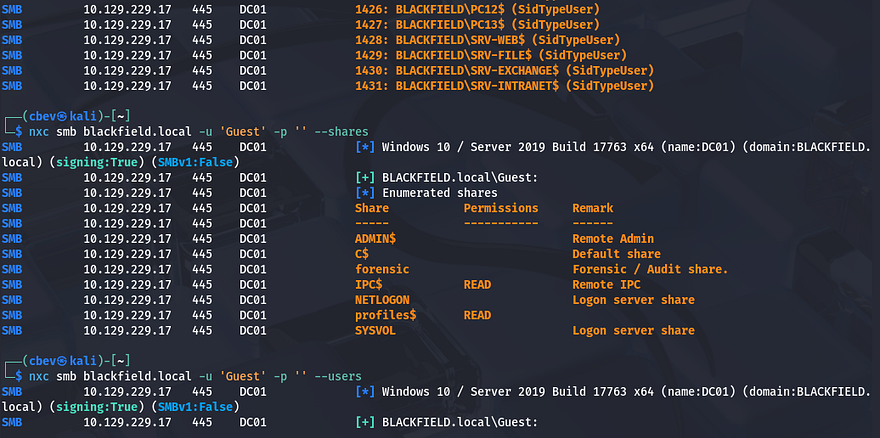

We're able to brute force user accounts with RID using the `--rid-brute` flag, this works better than `--users` because it directly supplies a range of RIDs to forcefully show accounts. This ends up only showing the SID number after the blackfield domain which doesn't really give us names, so I take a peak inside the `profiles$` share.

_Note that when a share has a special character like a '$', we need to encase the entire location with single quotes or it will fail to reach it and throw an internal error._

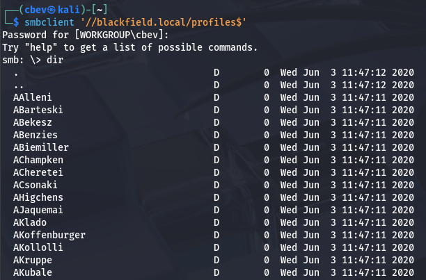

I don't want to copy/paste this big list from my machine or have to manually enumerate it, so I mount this share specifying the filesystem is CIFS.

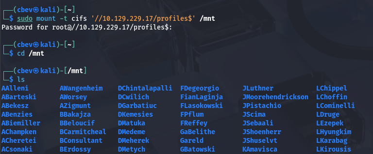

Now we can use commands like find to enumerate these user directories and also output their names to a user list.

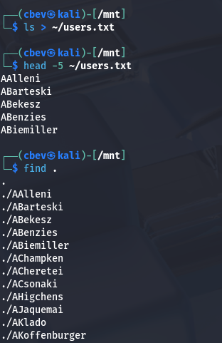

## AS-REP Roasting
There are no files within this share, but we did get a list of names to use in future attacks. Next, I move to finding any potential misconfigurations within AD. I go with [Kerbrute](https://github.com/ropnop/kerbrute/releases) here as I've found it's very reliable for validating users before exploiting Kerberos pre-auth.

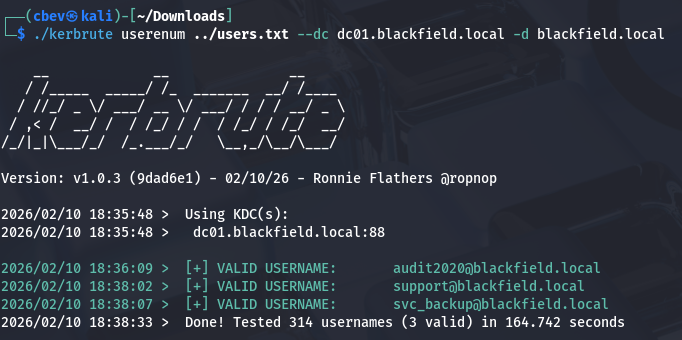

In doing so, I find that just three users are valid on the domain. Now, I utilize IMpacket's [GetNPUsers.py](https://github.com/fortra/impacket/blob/master/examples/GetNPUsers.py) script to check if any of these accounts require pre-authentication so we can snag a hash.

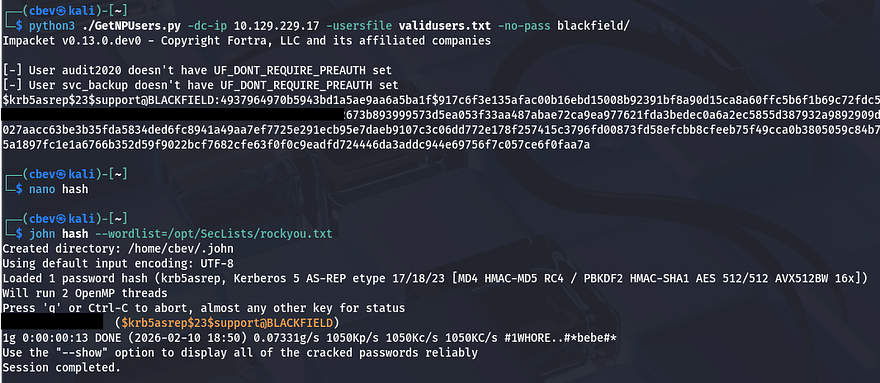

That returns a hash for the support account and sending that to JohnTheRipper or Hashcat will give us the plaintext version. Obviously, we don't have WinRM access or anything too crazy yet, but this shows a few more mundane shares to enumerate.

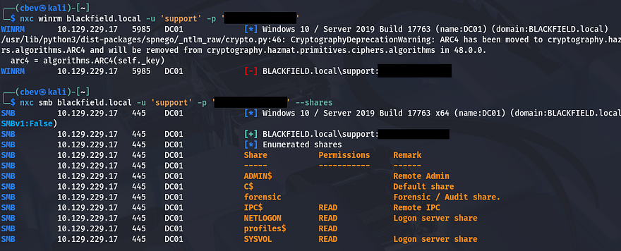

Nothing too crazy on those, besides it looks like the forensic share is what we're after. I fire up Bloodhound using the support account creds to ingest files and start to look around for any interesting permissions (which is likely since support accounts usually need elevated privs to help other users).

## Changing Account Password
Our account has the `ForceChangePassword` privilege over the audit2020 account and since RPC is on the box, I'll use that to carry out this next step. I refer to [this article](https://www.thehacker.recipes/ad/movement/dacl/forcechangepassword) for the commands as I couldn't get Bloodhound's abuse info tab to load for some odd reason.

```
$ rpcclient --user=support 10.129.229.17 -W blackfield.local
Password for [BLACKFIELD.LOCAL\support]:
rpcclient $> setuserinfo2
Usage: setuserinfo2 username level password [password_expired]
result was NT_STATUS_INVALID_PARAMETER
rpcclient $> setuserinfo2 audit2020 23 P@ssw0rd123!
```

Testing to see if this worked over SMB shows that this account has read permissions on the forensic share. I connect with smbclient and find a few directories pertaining to DFIR tasks.

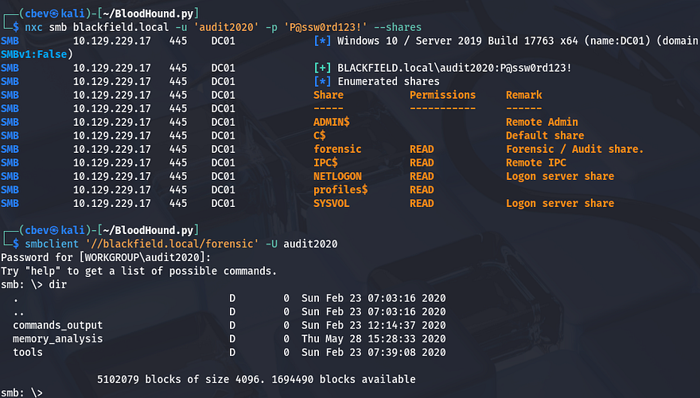

## Dumping LSASS
There are plenty of files saved here for inspection, however one that really stuck out to me was lsass.zip. Local Security Authority Subsystem Service (LSASS) is a critical process within Windows that manages security policies, user authentication, and active session credentials. 

Now I just needed to figure out a way to dump this `.DMP` file so we can read the secrets inside. A bit of research led me to a [Red Canary article](https://redcanary.com/threat-detection-report/techniques/lsass-memory/) explaining that common tools are Mimikatz, Cobalt Strike, IMPacket, etc. In my attempts to get this working on my Kali machine, the only one that succeeded in any regard was the python version of Mimikatz - [Pypykatz](https://github.com/skelsec/pypykatz) (I installed it with pipx).

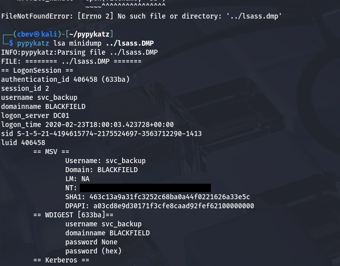

This file gives us quite a lot of information regarding past login sessions, however the only thing of real use was the NTLM hash for the svc_backup account. At this point, I utilize Evil-WinRM to grab a shell on the system and start internal enumeration to escalate privileges to administrator.

## Privilege Escalation
We could also grab the user flag under our Desktop folder.


Whilst enumerating the C:\ drive, I find a notes.txt file in the top directory which explains that someone will have to backup and restore the system at a later point. Curious as to what our account could do, I check current privileges to find that we have access to both `SeBackup` and `SeRestore` privs. 

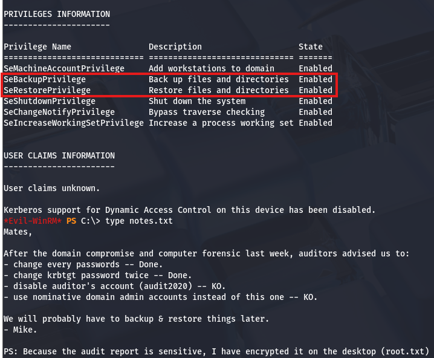

There's a pretty common way to dump the AD database by cloning the `NTDS.dit` file using the `DiskShadow` executable. [Here](https://medium.com/r3d-buck3t/windows-privesc-with-sebackupprivilege-65d2cd1eb960) is a great article that goes in-depth on a few ways to exploit this privilege.

Just to explain what we're doing here - Since our account has access to backup and restore certain files with elevated privileges, we can effectively make a clone of the Active Directory database files (NTDS.dit) which contain hashed passwords of the user accounts. Also `DiskShadow.exe` supports scripts through use of `/s`, so we can write a quick one to clone the `C:\` drive to another location that's exposed to the network. 

First I create a script that will perform the cloning:

```
set verbose on
set metadata C:\Windows\Temp\meta.cab
set context clientaccessible
set context persistent
begin backup
add volume C: alias cdrive
create
expose %cdrive% Z:
end backup
```

Make sure you use unix2dos in order for this file to be compatible with Windows. I upload it via Evil-WinRM and then execute DiskShadow specifying the .dsh to be ran.

```
diskshadow /s backup_script.dsh
```

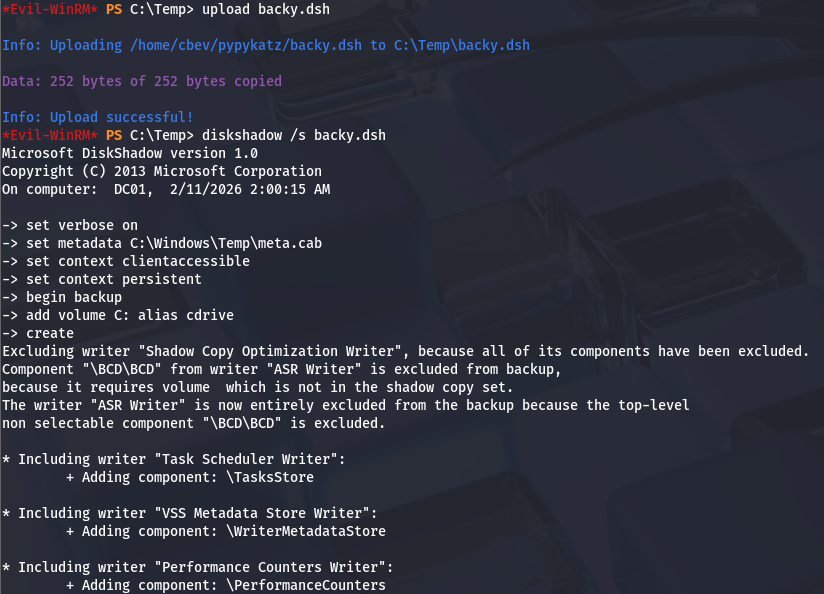

Once that script is officially done, we can utilize another executable our account has access to, which is robocopy. This will allow us to copy files from the `Z:\` drive to the Temp directory in order to download it to our attacking machine.

```
robocopy /b Z:\Windows\ntds . ntds.dit
```

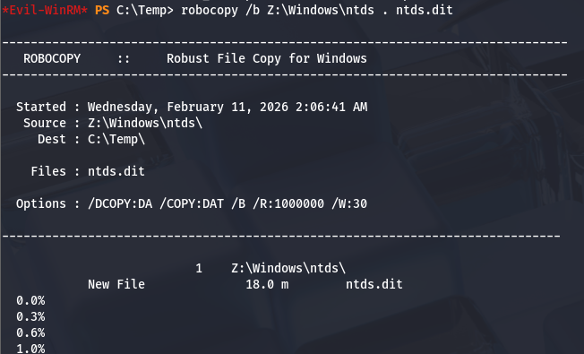

In order for us to decrypt `NTDS.dit`, we'll need the boot key from the SYSTEM hive so we can actually extract these hashes. Luckily we can just create a backup of it.

```
reg save hklm\system C:\Temp\system.bak

download system.bak
download ntds.dit
```

Once on our local machine, I use IMpacket's [secretsdump.py](https://github.com/fortra/impacket/blob/master/examples/secretsdump.py) script to snag the administrator hash.

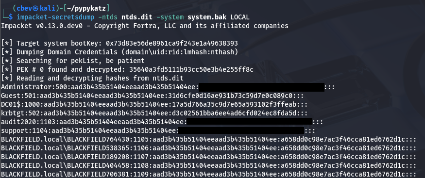

Lastly, we can either attempt to crack the hash using JTR/Hashcat or use a pass-the-hash attack with Evil-WinRM or PSexec to get a shell on the box. Grabbing the final flag under the administrator's desktop folder will complete the box.

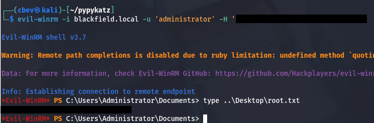

That's all y'all, this box was interesting to me as there were no web components for us to enumerate users from. Truthfully, I had trouble since I'm not very knowledgeable on AD exploits, but when in doubt do some research. It really made me focus on exploiting Kerberos and checking account permissions to expand the attack surface. I hope this was helpful to anyone following along or stuck and happy hacking!
