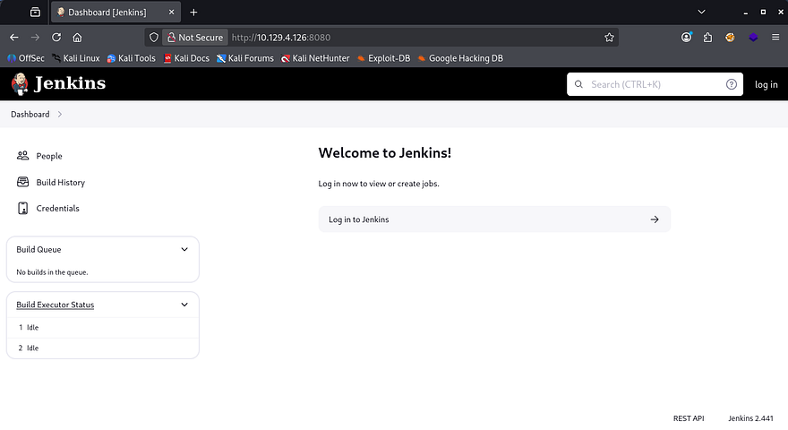
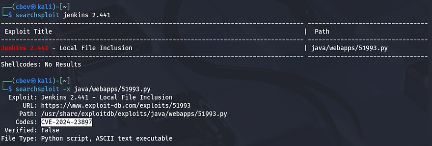
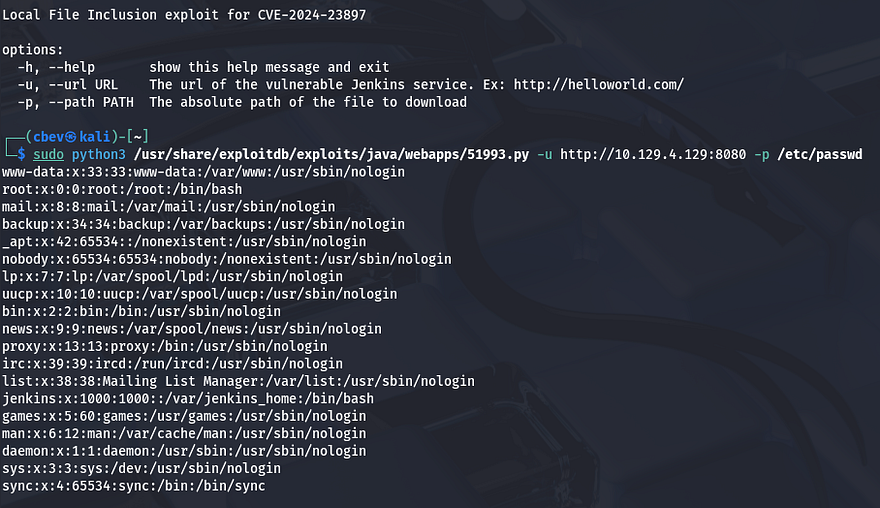
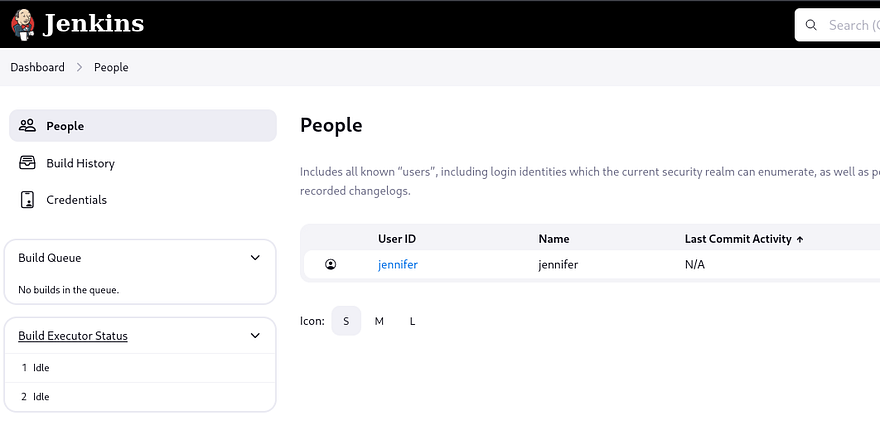
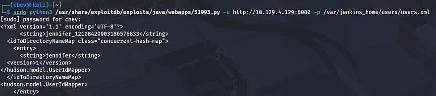
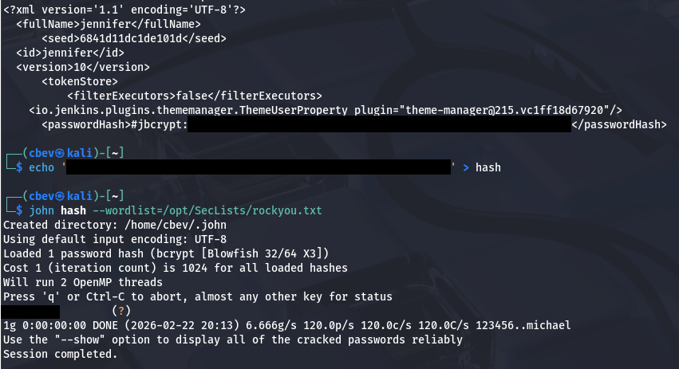
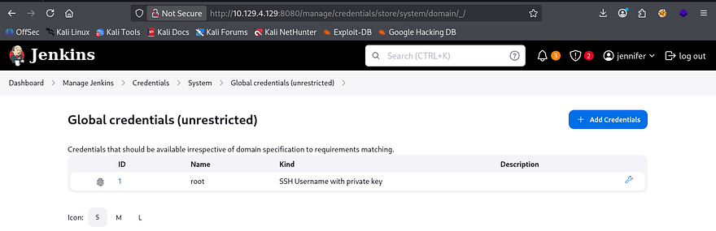
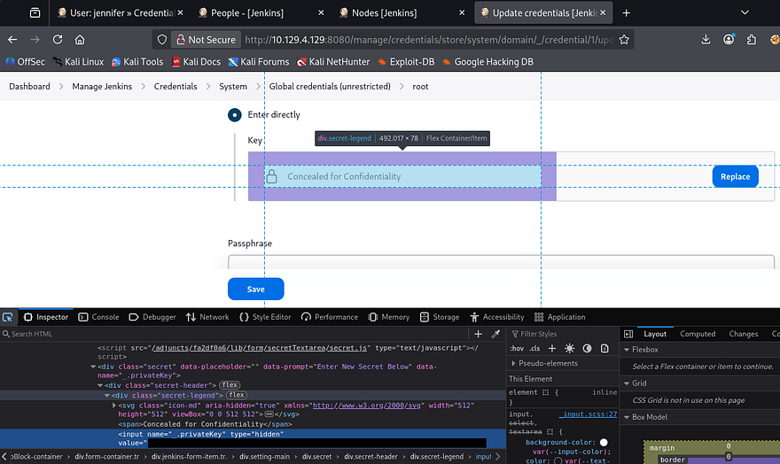
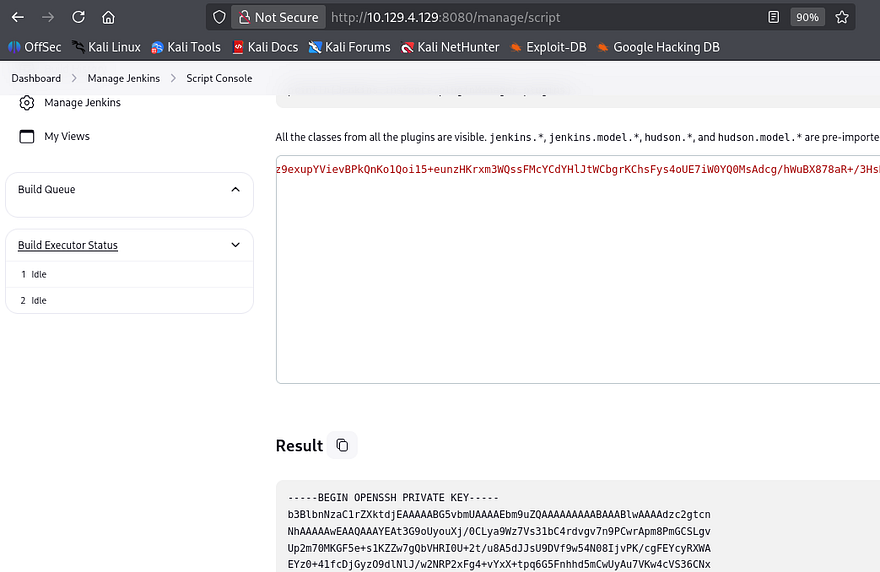
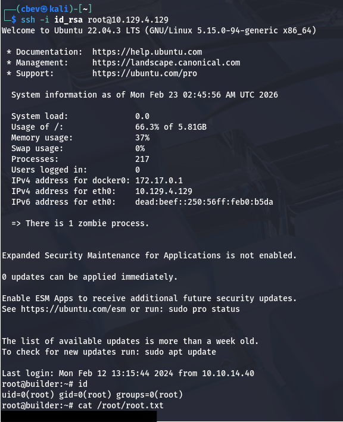

This box is rated medium difficulty on HTB. It involves us exploiting a vulnerable Jenkins application to read files on the server. Parsing XML files grants us the plaintext password for a user that can be used to log onto the site. Enumerating the site gives us an encrypted string for root user's private SSH key which can be decrypted via the site's script console. 

## Scanning & Enumeration
As always, I begin with an Nmap scan against the target IP to find all running services on the host.

```
$ sudo nmap -p22,8080 -sCV 10.129.4.126 -oN fullscan-tcp

Starting Nmap 7.95 ( https://nmap.org ) at 2026-02-22 17:42 CST
Nmap scan report for 10.129.4.126
Host is up (0.054s latency).

PORT     STATE SERVICE VERSION
22/tcp   open  ssh     OpenSSH 8.9p1 Ubuntu 3ubuntu0.6 (Ubuntu Linux; protocol 2.0)
| ssh-hostkey: 
|   256 3e:ea:45:4b:c5:d1:6d:6f:e2:d4:d1:3b:0a:3d:a9:4f (ECDSA)
|_  256 64:cc:75:de:4a:e6:a5:b4:73:eb:3f:1b:cf:b4:e3:94 (ED25519)
8080/tcp open  http    Jetty 10.0.18
| http-robots.txt: 1 disallowed entry 
|_/
| http-open-proxy: Potentially OPEN proxy.
|_Methods supported:CONNECTION
|_http-server-header: Jetty(10.0.18)
|_http-title: Dashboard [Jenkins]
Service Info: OS: Linux; CPE: cpe:/o:linux:linux_kernel

Service detection performed. Please report any incorrect results at https://nmap.org/submit/ .
Nmap done: 1 IP address (1 host up) scanned in 11.68 seconds
```

There are just two ports open:
- SSH on port 22
- An Apache web server on port 8080

Not a whole lot we can do on with that version of OpenSSH without credentials, so I fire up Gobuster to search for subdirectories/subdomains in the background before heading over to the website. Checking out the landing page shows that it's using the Jenkins to manage their CI/CD pipelines. Testing for default credentials on the login page doesn't work and shows that we don't get verbose errors to enumerate users. 



If you don't already know, Jenkins is an open-source automation server that's used to implement CI/CD pipelines and allows developers to automate the building, testing, and deployment of their software. Due to it's popularity and it being open-source, there are no shortage of CVEs, so keeping it up to date is imperative for security.

## Reading Arbitrary Files
Since the version is discloses in the page's footer, I'll check for any known vulnerabilities that we can use to get a shell or read sensitive files. A quick Searchsploit command reveals that this implementation may be vulnerable to [CVE-2024–23897](https://nvd.nist.gov/vuln/detail/cve-2024-23897) which explains that Jenkins fails to disable a feature in the CLI command parser which enables attackers to read arbitrary files on the server.

This [TrendMicro Article](https://www.trendmicro.com/en_us/research/24/c/cve-2024-23897.html) goes very in-depth as to how the @ character is used to pull files from the server even without authentication beforehand.



I already have a Python proof of concept script on my machine, but you can also grab it from [this Exploit-DB repository](https://www.exploit-db.com/exploits/51993). I go ahead and test it out by reading `/etc/passwd` and it returns a valid file to us.



The lack of real users on the box other than root user tells me that we'll either need to upload a shell and use this exploit to execute it, or find credentials for a user on the filesystem and login via Jenkins. Only one person is listed under the site's People tab who's named Jennifer.



I provide the system with `/proc/self/environ` to check the current environment variables which shows that Jenkins' home directory is located at `/var/jenkins_home`. Looking under there for any plaintext passwords didn't show anything too crazy without having to manually decrypt the `credentials.xml` file. We do see that there is a directory for Jennifer's account inside of the `/users/user.xml` file.



Jenkins stores sensitive account information inside of a `config.xml` file within each users' directory. Following that logic gives us a jbcrypt hash for her account which we can send over to JohnTheRipper in order to grab the plaintext version.



## Recovering Root SSH Key
After logging in, I find a a Global object under the credentials tab which seems to hold a private SSH key. We can investigate this further by hitting the configure icon (wrench) and seeing how it's stored.



I use my browser's developer tools to find a hidden form field which stores an encrypted string in place of the private key.



A bit of digging shows that we can just use the built-in script terminal to print the SSH key by decrypting it with a `hudson.util.Secret` function. To get there, go from the Manage Jenkins tab and scroll to the bottom of the page until you find the option for the Script Console.

```
println(hudson.util.Secret.decrypt("{SECRET_STRING_FROM_DEVELOPER_TOOLS}"))
```



Finally, we can use that recovered key to login over SSH grants us a successful shell on the box as root user. Grabbing the root flag under the `/root` dir and the user flag under `/home/jennifer` will complete this box.



That's all y'all, this box was a pretty fun one as it's pretty straight forward. I hope this was helpful to anyone following along or stuck and happy hacking!
