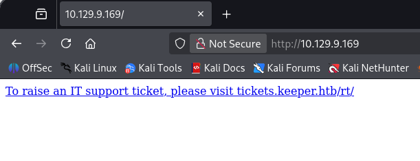
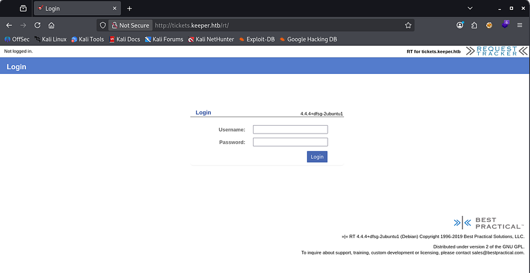
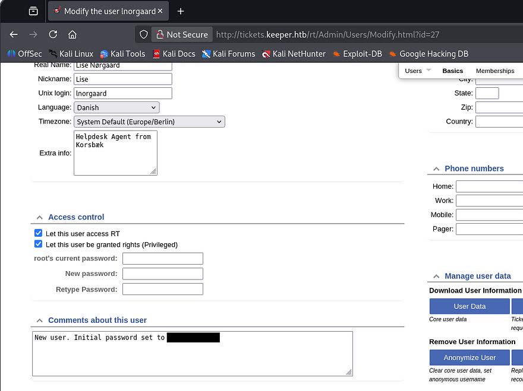
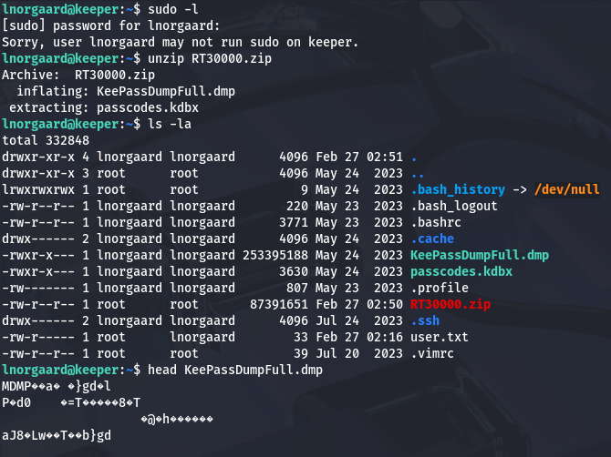
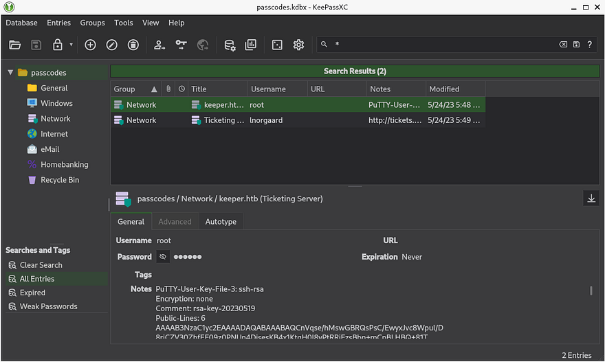
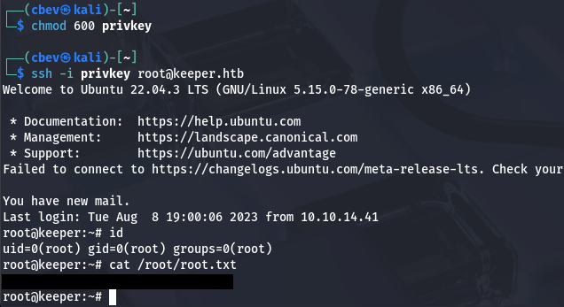

This box is rated easy difficulty on HTB. It involves us logging into a ticket support site with default credentials which leads to grabbing a plaintext password that can be used over SSH to get a shell. Once on the system, there is a KeePass database file as well as a memory dump from it which can be used to recover the database master key and steal an SSH key. After converting the key to RSA format, we're able to login as root.

## Scanning & Enumeration
I begin with an Nmap scan against the given IP to find all running services on the host; Repeating the same for UDP returns nothing.

```
$ sudo nmap -p22,80 -sCV 10.129.9.169 -oN fullscan-tcp
Starting Nmap 7.95 ( https://nmap.org ) at 2026-02-26 19:28 CST
Nmap scan report for 10.129.9.169
Host is up (0.057s latency).

PORT   STATE SERVICE VERSION
22/tcp open  ssh     OpenSSH 8.9p1 Ubuntu 3ubuntu0.3 (Ubuntu Linux; protocol 2.0)
| ssh-hostkey: 
|   256 35:39:d4:39:40:4b:1f:61:86:dd:7c:37:bb:4b:98:9e (ECDSA)
|_  256 1a:e9:72:be:8b:b1:05:d5:ef:fe:dd:80:d8:ef:c0:66 (ED25519)
80/tcp open  http    nginx 1.18.0 (Ubuntu)
|_http-server-header: nginx/1.18.0 (Ubuntu)
|_http-title: Site doesn't have a title (text/html).
Service Info: OS: Linux; CPE: cpe:/o:linux:linux_kernel

Service detection performed. Please report any incorrect results at https://nmap.org/submit/ .
Nmap done: 1 IP address (1 host up) scanned in 8.68 seconds
```

There are just two ports open:
- SSH on port 22
- An nginx web server on port 80

Not much to do with that version of OpenSSH without credentials, so I start up Gobuster to find any subdirectories/subdomains in the background before heading over to the website. Checking out the landing page shows a message telling us to visit tickets.keeper.htb in order to raise an IT support ticket. I'll add that domain as well as one without the subdomain to my /etc/hosts file so we can visit them.



## Creds on Ticketing Site
On the tickets page, I find a login prompt for the site which looks to be running Request Tracker. Verbose errors are disabled but we do have the version in the case we'll have to exploit any known vulnerabilities.



A quick Google search shows that default credentials for Request Tracker are root:password. Upon login, we see a standard ticketing dashboard used to manage support requests from various users. Our accounts does have admin privileges and while looking under that tab, I find a users section which lists only one other person registered on the site.

It seems like Lise Norgaard is a helpdesk agent that also works in IT, however they must have just started as a comment lists a default password for their account.



Using those credentials to login over SSH actually works and I grab a shell on the box.

## Privilege Escalation
At this point, we can grab the user flag under their home directory and start internal enumeration to escalate privileges to root user. Among the other typical documents in this directory is a ZIP archive which we have permissions to dump.



This gives us `.dmp` and `.kdbx` files which indicate a KeePass database that's used to store credentials for various websites/services. I transfer these to my attacking machine over HTTP in order to take have access to better tools. 

By installing a tool like [Keepassxc](https://keepassxc.org/), it shows that the .kdbx file is password protected. I'll be using [keepass2john](https://github.com/ivanmrsulja/keepass2john) on this file, which transforms it into a crackable version so that we can potentially dump the database. This doesn't end up retrieving anything so we'll have to figure out what the `.dmp` file holds in store for us.

### Recovering Password from Memory Dump
It looks to be a file that stored memory data from a previous crash report for KeePass. I wasn't sure how to tackle this without just grepping for string so I did a bit of research on how this could be useful. I discover [CVE-2023–32784](https://nvd.nist.gov/vuln/detail/CVE-2023-32784), which explains that in KeePass versions prior to 2.54, the cleartext master password can be recovered. 

So how does this work? For every character typed into the password field, KeePass creates residual string fragments in the system's memory (RAM). Say that a user inputs the password as "password", each character would show up one by one as something akin to `•a` and then `••s`, and so on. We won't be able to recover the first character as the dump must contain the hidden object beforehand in order to confirm that it's the password.

While gathering information on this vulnerability, I came across this [Github repository](https://github.com/vdohney/keepass-password-dumper) which held an automated script as a PoC. Since that script was built on `.NET` and I didn't have it setup on my Kali machine, I just decided to do it by hand as we already know what to look for. I grep for any hidden characters in the dump along with the strings utility.

```
strings -e S KeePassDumpFull.dmp | grep -a $(printf "%b" "\\xCF\\x25\\xCF\\x25")
```

That command will look for bytes after any instance of the `•` character. It's pretty rough around the edges, but I'll take it instead of installing some kind of .NET runtime.


Enumerating the password byte by byte shows a few places where the terminal doesn't recognize the characters. I figured that these either had to be special characters or non-printable ones that couldn't be displayed in the dump. Piecing the password together left me with:

```
??dgr?d med fl?de
```

This doesn't look like English, which made sense as the username found earlier seemed to be Norse or Swedish. I took to Google hoping that it would fill in the blanks or be able to translate, which returned a promising result.


The final password resolved to `rødgrød med fløde` and we could use that with the `.kdbx` file to dump credentials on the system. There weren't many stored plaintext passwords, however under All Entries was a file containing an SSH key for root.



To be able to use this, we must convert it into a format readable by our machine. I'm on Linux, so I download putty-tools to use their puttygen utility.

```
sudo apt install putty-tools
```

I save everything under the Notes section in the KeePass dump to a file and have puttygen transform it into a valid RSA key.

```
puttygen key -O private-openssh -o privkey
```

Making sure to give it the correct permissions, I use that to login via SSH and get a successful shell on the box as root user. Finally grabbing the root flag under their home directory completes this challenge.



That's all y'all, this box wasn't all that hard but took some time to figure out how to recover that password from the memory dump. I hope this was helpful to anyone following along or stuck and happy hacking!
